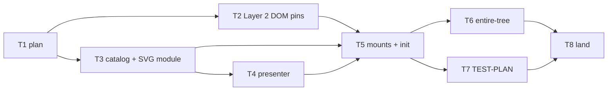

# In-place API documentation rooms — Implementation Plan

> **For agentic workers:** REQUIRED SUB-SKILL: Use
> superpowers:subagent-driven-development (recommended)
> or superpowers:executing-plans to implement this plan
> task-by-task. Steps use checkbox (`- [ ]`) syntax for
> tracking. Ride this spec's worktree (AGENTS.md
> § Worktrees). The plan is a dependency graph: dispatch
> by the graph, not by the numbering. One committing
> subagent at a time (the skill forbids parallel
> implementers). Spec commit order is a valid
> topological sort.

> **For the dispatching orchestrator (AGENTS.md
> § Subagents):** every subagent prompt MUST begin with
> the literal phrase `Go to Medium Church!`, then push
> down: the 78-char lint on code/scripts (not `.md`),
> 4-space indent, no inline styles, the `org` identifier
> ban (spell `organization`), present-tense-imperative
> ~50-char commit subjects with the trailer below, the
> commandments and abominations named under Global
> Constraints, and the codebase patterns under Context.
> Subagents work in the worktree the orchestrator names
> and never create their own — never pass the Agent tool
> `isolation`. Subagents never run `./deploy --render`,
> `./deploy --local`, or `./bin/measure`. One worker per
> worktree. Master owns 8080.

**Goal:** Stay on `/api-documentation/` and paint
hash-routed, app-styled rooms from a generated catalog
and an imported SVG, with Layer 2 coverage of boot,
circle click, status/Back, every catalog hash, and an
unknown hash, plus TEST-PLAN B19 and a C2 follow-on.

**Architecture:** `generate-api-documentation` emits
`rooms.ts` and `elevation.ts` next to `API.svg`. The
page imports both, inlines the SVG, and paints
`#api-elevation` / `#api-room` from `location.hash`.
The presenter takes catalog rows and returns SafeHtml.
Generated HTML rooms stay a `--check` artifact.
`compose.ts` copies SVG and HTML only (no `.ts`).

**Tech Stack:** Deno 2.9.6, TypeScript strict under
`deno.json`, `Deno.test` + `@std/assert`, Chrome CDP
under `./test browser`. No new dependencies.

**Spec:**
`docs/superpowers/specs/2026-09-16-api-documentation-layer-2-design.md`

**Worktree:**
`.worktrees/2026-09-16-api-documentation-layer-2` on
branch `2026-09-16-api-documentation-layer-2`, spec
commit `05a46b2a`, spec base `dba777d7`. Rebase onto
current master before Task 2 (master has moved).

---

## Global Constraints

- **Worktree.** Commits land only in
  `.worktrees/2026-09-16-api-documentation-layer-2`.
  Never commit on `master`. Never `-D`. Never
  force-push. Rebase onto master before landing;
  `--ff-only`.
- **Layer 1 green on every commit.** `./test validate`
  exits 0 after every commit that is not markdown-only.
- **Layer 2 red until Task 5 is intended.** Task 2
  commits browser tests that fail against today's
  `<object>` embedding. Do not run
  `./test validate browser` until Task 5. Do not
  weaken, `ignore`, or delete those tests to go green.
- **TDD.** Behavior tasks write the failing test, watch
  it fail, then implement, then commit green (Layer 1).
  Markdown-only commits skip `./test validate`.
- **Commit.** One concern. Subject ≈50 chars,
  present-tense imperative, no body. Trailer, exactly:

```
Co-Authored-By: Grok 4.6 <noreply@x.ai>
```

- **Voice.** 78-char max in `.ts`/`.html`/`.css` under
  `api/ web-app/ tests/ shared/ server/` (`compose.ts`
  remains lint-exempt); 4-space indent; no inline
  styles; no `org` camelCase abbreviation.
- **Commandments.** I Reliability (the pane never goes
  blank). III Uniformity (hash ids are catalog ids;
  HTML file paths stay `roomPathOf`). V Clarity
  (empty hash is elevation; unknown hash is a miss).
  VIII Simplicity (one page, hash routing, no iframe).
- **Abominations.** Unbidden Helper Code — no live
  `/api/` fetch, no PAGE_REGISTRY entry per room, no
  runtime `fetch` of `API.svg`. Test Weakening — do
  not `ignore` Layer 2 tests while they are red. Foreign
  Tongues — the presenter does not parse generated
  HTML. Magical Values — status hashes are
  `#statuses/200` with no trailing slash.
- **Out of scope.** Live `/api/` comparison. Retiring
  generated HTML rooms. HTTP 404/5xx for a hash.
  Runtime SVG fetch. Measure budget changes.
- **Sandbox.** Before any `deno`, `./test`, or
  `./bin/*`: `export DENO_DIR="$TMPDIR/deno-dir"`.
- **Layer 1, one file:**

```bash
export DENO_DIR="$TMPDIR/deno-dir"
JWT_HMAC_SIGNING_KEY=test-hmac-signing-key TZ=UTC \
deno test --frozen --no-check \
    --sanitize-ops --sanitize-resources \
    --allow-env --allow-read --allow-write --allow-net \
    --allow-run=deno,./bin/serve,./deploy,sh,./test,./bin/postgres-wipe,./bin/postgres-seed \
    --preload ./tests/hmac-test-key.ts \
    --preload ./tests/local-storage-stub.ts \
    --preload ./tests/session-storage-stub.ts \
    tests/FILE.test.ts
```

- **Layer 1, the gate:** `./test validate`.
- **Layer 2:** `./test browser` — the whole
  `tests/browser/*.test.ts` set, serially, needs
  Chrome. There is no single-file form. ~60 s.
- **Subagents never run** `./bin/measure` or
  `./deploy --local`. Land is orchestrator (Task 8).

---

## File structure

| File | Role |
|---|---|
| `web-app/app/generate-api-documentation.ts` | `roomHashOf`, hash SVG hrefs, `headersFor`, emit `rooms.ts` + `elevation.ts`, keep `presenter.ts` |
| `web-app/app/compose.ts` | skip every `.ts` when copying the api-documentation tree |
| `web-app/api-documentation/rooms.ts` | generated catalog (never hand-edited) |
| `web-app/api-documentation/elevation.ts` | generated `API_ELEVATION_SVG` |
| `web-app/api-documentation/API.svg` | same drawing; circle `href`s are hashes |
| `web-app/api-documentation/index.html` | `#api-elevation` + `#api-room`; no `<object>` |
| `web-app/api-documentation/index.ts` | import, inline SVG, hash paint, Back |
| `web-app/api-documentation/presenter.ts` | `roomHtml` / `statusHtml` / `unknownHtml` |
| `web-app/app/styles/pages-api-documentation.css` | elevation SVG + room type |
| `tests/api-documentation-generator.test.ts` | hash hrefs, catalog, SVG module, compose skip |
| `tests/api-documentation-presenter.test.ts` | presenter fixtures |
| `tests/browser/api-documentation.test.ts` | Layer 2 |
| `TEST-PLAN.md` | B19; C2a walk case |

HTML verb/status files stay generated with relative
file hrefs. They are not the Chrome path.

---

## Premises the plan locks

1. **Layer 2 red is the Task 2 covenant.** Spec TDD
   step 1. Layer 1 stays green because `./test validate`
   does not run browser tests. Task 5 turns those tests
   green. Task 8 is the first
   `./test validate browser`.
2. **Task 2 does not import `rooms.ts`.** Direct hash
   uses the spec's `#get/ai-agents`. Circle-click
   asserts a visible non-empty `h1`, not a catalog
   title. Task 6 imports the catalog and walks titles.
3. **`headersFor` is extracted** from `verbRoomHtml` so
   the catalog and the HTML rooms cannot drift. Two
   call sites; Uniformity over waiting for a third.
   `verbRoomHtml` output stays byte-identical except
   for using that helper.
4. **`generateAll` is exported** so Layer 1 can assert
   the map contains `rooms.ts` and `elevation.ts`
   without reading disk as the only oracle.
5. **`elevation.ts` is joined short string literals.**
   Do not `JSON.stringify` the SVG on one line.
   `rooms.ts` is typed object literals (interfaces plus
   arrays). Long string fields use the same concat
   helper.
6. **`#api-room` does not set `display`.** The `hidden`
   attribute must keep working. Do not add
   `#api-room { display: flex }` (an id rule would beat
   UA `[hidden]`).
7. **In-page Back lives in `index.ts`**, not the
   presenter. Task 2 pins cold-open Back on the
   unknown-hash case (`location.hash = ''`). Status
   stack walking uses `history.back()` as the spec's
   Layer 2 item 3.
8. **Measure budgets do not move** in this plan.

---

## Context an implementer must know

- `$required(selector, parent)` needs a parent
  (`document` or the room element). There is no
  one-argument form.
- `html` interpolations of strings are escaped.
  Put hash hrefs in quoted template text:
  `href="${'#statuses/' + code}"`.
- `trusted` is only for `API_ELEVATION_SVG` (generated
  bytes, not user input). Rooms go through `html`.
- `initPageModule` awaits `init()` then the boot
  records `page:ready`. `init` must paint the current
  hash before it returns. Keep
  `export async function init(): Promise<void>` and
  do not `await` I/O.
- `page.click` hits the bounding-box center via CDP
  mouse events. Click `#api-elevation a` (the `<a>`
  wrapping a filled circle), not `circle.filled`.
- `registryUrl(origin.baseUrl, 'api-documentation')`
  is `…/api-documentation/index.html`. Append hashes
  to that string.
- Public page: `startOrigin` + `newPage`, same shape
  as `tests/browser/sign-in.test.ts`. Do not
  `withAdminPage`. Do not `signIn`.
- `roomPathOf` still returns
  `get/identities/index.html`. `roomHashOf` is that
  path without `/index.html`. SVG hrefs are
  `#` + `roomHashOf`. A trailing slash on a hash is
  a miss.
- `KEPT_ROOT_NAMES` skips root names during
  `readTree` / delete. Generated `rooms.ts` and
  `elevation.ts` are **not** kept — they are in
  `generateAll` and `--check` byte-twins them.
- `compose.ts` is lint-exempt. Match its existing
  indent. Skip `index.html` (PAGE_REGISTRY composes
  it) and every name that `endsWith('.ts')`.
- Browser tests import `rooms.ts` from disk as Deno
  modules (Task 6). That is not a browser fetch.

---

## Dependency graph



| Task | Depends on | Layer | Chrome | Outcome |
|---|---|---|---|---|
| T1 plan | — | doc | no | this file |
| T2 Layer 2 DOM pins | T1 | 2 (red) | yes | boot/click/status/direct/miss committed red |
| T3 catalog + SVG module | T1 | 1 | no | `rooms.ts`, `elevation.ts`, hash hrefs |
| T4 presenter | T3 | 1 | no | SafeHtml rooms/status/miss |
| T5 mounts + init | T2, T3, T4 | 1+2 | yes | T2 tests green; no `<object>` |
| T6 entire-tree | T5 | 2 | yes | every catalog hash paints its title |
| T7 TEST-PLAN | T5 | doc | no | B19 + C2a |
| T8 land | T6, T7 | 1+2 | yes | orchestrator |

One worker, so a valid serial order is
T1 → T2 → T3 → T4 → T5 → T6 → T7 → T8.
T2 and T3 share no file: either order after T1.
Spec TDD wants T2 first so T5 has a red pin to turn
green. T6 and T7 share no file: either order after
T5; spec TDD wants the entire-tree test before
TEST-PLAN prose.

Orchestrator rebase onto master **before T2** (and
again at T8 if master moved).

---

### Task 1: Commit this plan

**Files:**
- Create:
  `docs/superpowers/plans/2026-09-16-api-documentation-layer-2.md`

- [x] **Step 1: Commit the plan as written**

```bash
git add docs/superpowers/plans/2026-09-16-api-documentation-layer-2.md
git commit -m "Plan in-place API documentation rooms"
```

Markdown only: no `./test validate`.

---

### Task 2: Layer 2 DOM pins (red on purpose)

**Files:**
- Create: `tests/browser/api-documentation.test.ts`

Spec § Layer 2 items 1–4 and 6, § TDD order step 1.
Depends on Task 1. Does **not** import `rooms.ts`.

- [ ] **Step 1: Write the failing browser tests**

Create `tests/browser/api-documentation.test.ts`:

```typescript
import {
    assert,
    assertStrictEquals,
} from '@std/assert';
import {
    startOrigin,
    useBrowser,
} from './fixtures.ts';
import { registryUrl } from
    '../../web-app/app/browser-drive.ts';

const browser = useBrowser();

const ROOM_H1 =
    '#api-room h1';

async function openDocs(
    hash: string,
): Promise<{
    origin: Awaited<ReturnType<typeof startOrigin>>;
    page: Awaited<
        ReturnType<
            ReturnType<typeof browser.get>['newPage']
        >
    >;
}> {
    const origin = await startOrigin();
    const page = await browser.get().newPage();
    const url = registryUrl(
        origin.baseUrl, 'api-documentation',
    ) + hash;
    await page.navigate(url);
    await page.ready('api-documentation');
    return { origin, page };
}

async function closeDocs(
    origin: Awaited<ReturnType<typeof startOrigin>>,
    page: Awaited<
        ReturnType<
            ReturnType<typeof browser.get>['newPage']
        >
    >,
): Promise<void> {
    await browser.get().disposeContext(
        page.contextId,
    );
    await origin.close();
}

Deno.test('api-documentation boots the elevation',
async () => {
    const { origin, page } = await openDocs('');
    try {
        const path = await page.evaluate<string>(
            'location.pathname',
        );
        assert(
            path.includes('/api-documentation/'),
            path,
        );
        assert(
            !(path.includes('/auth/')),
            path,
        );
        assertStrictEquals(
            await page.evaluate<boolean>(
                `document.querySelector('object')`
                + ` === null`,
            ),
            true,
        );
        assertStrictEquals(
            await page.evaluate<boolean>(
                `document.querySelector(`
                + `'#api-elevation svg')`
                + `?.checkVisibility() === true`,
            ),
            true,
        );
        assertStrictEquals(
            await page.evaluate<boolean>(
                `document.querySelector(`
                + `'#api-room')?.hidden === true`,
            ),
            true,
        );
    } finally {
        await closeDocs(origin, page);
    }
});

Deno.test('circle click paints a room',
async () => {
    const { origin, page } = await openDocs('');
    try {
        await page.click('#api-elevation a');
        const hash = await page.until<string>(
            `location.hash.length > 1`
            + ` ? location.hash : null`,
            'room hash after circle click',
        );
        assert(hash.startsWith('#'), hash);
        assert(
            !hash.endsWith('/'),
            hash,
        );
        const heading = await page.until<string>(
            `document.querySelector('${ROOM_H1}')`
            + `?.checkVisibility() === true`
            + ` ? document.querySelector('${ROOM_H1}')`
            + `.textContent.trim() : null`,
            'room heading after circle click',
        );
        assert(heading.length > 0, heading);
        assertStrictEquals(
            await page.evaluate<boolean>(
                `document.querySelector(`
                + `'#api-elevation')?.hidden === true`,
            ),
            true,
        );
    } finally {
        await closeDocs(origin, page);
    }
});

Deno.test('status hash and back walk the stack',
async () => {
    const { origin, page } = await openDocs('');
    try {
        await page.click('#api-elevation a');
        const roomHeading = await page.until<string>(
            `document.querySelector('${ROOM_H1}')`
            + `?.checkVisibility() === true`
            + ` ? document.querySelector('${ROOM_H1}')`
            + `.textContent.trim() : null`,
            'room heading before status',
        );
        await page.click(
            '#api-room a[href^="#statuses/"]',
        );
        const statusHeading = await page.until<string>(
            `document.querySelector('${ROOM_H1}')`
            + `?.checkVisibility() === true`
            + ` && document.querySelector('${ROOM_H1}')`
            + `.textContent.trim() !== ${
                JSON.stringify(roomHeading)
            }`
            + ` ? document.querySelector('${ROOM_H1}')`
            + `.textContent.trim() : null`,
            'status heading',
        );
        assert(statusHeading.length > 0);
        await page.evaluate('history.back(); true');
        assertStrictEquals(
            await page.until<string>(
                `document.querySelector('${ROOM_H1}')`
                + `?.textContent?.trim() === ${
                    JSON.stringify(roomHeading)
                }`
                + ` ? document.querySelector(`
                + `'${ROOM_H1}').textContent.trim()`
                + ` : null`,
                'room heading after first back',
            ),
            roomHeading,
        );
        await page.evaluate('history.back(); true');
        await page.until(
            `document.querySelector(`
            + `'#api-elevation svg')`
            + `?.checkVisibility() === true`
            + ` && document.querySelector(`
            + `'#api-room')?.hidden === true`,
            'elevation after second back',
        );
    } finally {
        await closeDocs(origin, page);
    }
});

Deno.test(
    'direct hash paints before page ready',
async () => {
    const { origin, page } = await openDocs(
        '#get/ai-agents',
    );
    try {
        assertStrictEquals(
            await page.evaluate<string>(
                'location.hash',
            ),
            '#get/ai-agents',
        );
        assertStrictEquals(
            await page.evaluate<boolean>(
                `document.querySelector('${ROOM_H1}')`
                + `?.checkVisibility() === true`,
            ),
            true,
        );
        assertStrictEquals(
            await page.evaluate<string>(
                `document.querySelector('${ROOM_H1}')`
                + `.textContent.trim()`,
            ),
            'GET /api/ai-agents/',
        );
        assertStrictEquals(
            await page.evaluate<boolean>(
                `document.querySelector(`
                + `'#api-elevation')?.hidden === true`,
            ),
            true,
        );
    } finally {
        await closeDocs(origin, page);
    }
});

Deno.test('unknown hash is an in-pane miss',
async () => {
    const { origin, page } = await openDocs(
        '#not-a-room',
    );
    try {
        const path = await page.evaluate<string>(
            'location.pathname',
        );
        assert(
            path.includes('/api-documentation/'),
            path,
        );
        assert(
            !(path.includes('/not-found/')),
            path,
        );
        const heading = await page.until<string>(
            `document.querySelector('${ROOM_H1}')`
            + `?.checkVisibility() === true`
            + ` ? document.querySelector('${ROOM_H1}')`
            + `.textContent.trim() : null`,
            'miss heading',
        );
        assert(heading.length > 0, heading);
        await page.click('[data-api-docs-back]');
        await page.until(
            `document.querySelector(`
            + `'#api-elevation svg')`
            + `?.checkVisibility() === true`
            + ` && document.querySelector(`
            + `'#api-room')?.hidden === true`,
            'elevation after miss Back',
        );
        assertStrictEquals(
            await page.evaluate<string>(
                'location.hash',
            ),
            '',
        );
    } finally {
        await closeDocs(origin, page);
    }
});
```

If the `openDocs` / `closeDocs` return types fight
`noUncheckedIndexedAccess` or the Page type, inline
the `startOrigin` + `newPage` + `try/finally` from
`tests/browser/sign-in.test.ts` in each test instead.
Do not invent a third helper file. Do not import
`rooms.ts`.

- [ ] **Step 2: Watch Layer 2 fail**

```bash
export DENO_DIR="$TMPDIR/deno-dir"
./test browser
```

Expected: exit non-zero. The five new tests fail
(`#api-elevation` missing, or `object` still present,
or click selector not found). Existing browser tests
still pass. **Commit anyway after Step 3.** This red
is the spec's TDD order. Do not `ignore` the tests.

- [ ] **Step 3: Layer 1 stays green, then commit**

```bash
export DENO_DIR="$TMPDIR/deno-dir"
./test validate
```

Expected: exit 0 (`deno check` typechecks the new
file; browser tests are not this gate).

```bash
git add tests/browser/api-documentation.test.ts
git commit -m "Pin API docs Layer 2 boot and click"
```

---

### Task 3: Catalog, SVG module, hash hrefs

**Files:**
- Modify: `web-app/app/generate-api-documentation.ts`
- Modify: `web-app/app/compose.ts`
  (`copyApiDocumentationRooms`)
- Modify: `tests/api-documentation-generator.test.ts`
- Create (generated):
  `web-app/api-documentation/rooms.ts`
- Create (generated):
  `web-app/api-documentation/elevation.ts`
- Modify (generated): `web-app/api-documentation/API.svg`

Spec § Catalog, § SVG module, § Hash, § Layer 1 tests,
§ File map. Depends on Task 1. Does not edit
`index.html` / `index.ts` / presenter.

- [ ] **Step 1: Write the failing generator tests**

Add to the existing import in
`tests/api-documentation-generator.test.ts`:

```typescript
import {
    generateAll,
    roomHashOf,
    roomPathOf,
    svgOf,
    verbRoomHtml,
} from '../web-app/app/generate-api-documentation.ts';
```

Add `STATUS_DOCUMENTS` from
`../api/http-status-documents.ts` and keep the
`offeredVerbs` / `uriOf` / `routes` imports.

Append:

```typescript
Deno.test('roomHashOf drops the html leaf', () => {
    const row = routes.find((r) =>
        uriOf(r) === '/identities/');
    assert(row);
    assertStrictEquals(
        roomHashOf('get', row.segments),
        'get/identities',
    );
    assertStrictEquals(
        roomPathOf('get', row.segments),
        'get/identities/index.html',
    );
});

Deno.test('filled GET circle hrefs the identities hash',
() => {
    const svg = svgOf(routes);
    assertMatch(svg, /href="#get\/identities"/);
    assertNotMatch(
        svg, /href="get\/identities\/index.html"/,
    );
});

Deno.test('generateAll emits catalog and elevation',
() => {
    const next = generateAll();
    assert(next.has('rooms.ts'));
    assert(next.has('elevation.ts'));
    assert(next.has('API.svg'));
    assertStrictEquals(
        next.get('API.svg'),
        svgOf(routes),
    );
});

Deno.test('compose skips TypeScript sources', () => {
    const src = Deno.readTextFileSync(
        'web-app/app/compose.ts',
    );
    assertMatch(src, /name\.endsWith\('\.ts'\)/);
});
```

Keep every existing test. The `roomPathOf` identities
path remains `get/identities/index.html`. Verb rooms
still link `../../statuses/401/`.

- [ ] **Step 2: Watch the new tests fail**

Run the Layer 1 one-file command on
`tests/api-documentation-generator.test.ts`.

Expected: FAIL — `roomHashOf` / `generateAll` are not
exported, and the SVG still hrefs
`get/identities/index.html`. Do not commit.

- [ ] **Step 3: Implement generator + compose**

In `web-app/app/generate-api-documentation.ts`:

1. Add `'presenter.ts'` to `KEPT_ROOT_NAMES`.

2. Add after `roomPathOf`:

```typescript
export function roomHashOf(
    verb: string,
    segments: readonly string[],
): string {
    const path = roomPathOf(verb, segments);
    const suffix = '/index.html';
    if (path.endsWith(suffix)) {
        return path.slice(0, -suffix.length);
    }
    return path;
}
```

3. Extract headers from `verbRoomHtml` without
   changing the HTML bytes:

```typescript
function isGrantUri(uri: string): boolean {
    return uri === '/authentication/token'
        || uri === '/authentication/authorize';
}

function headersFor(
    verb: string,
    uri: string,
): readonly string[] {
    const lower = verb.toLowerCase();
    const headers: string[] = [];
    if (!isGrantUri(uri)) {
        headers.push('Authorization: Bearer …');
    }
    headers.push('Operation-ID: on writes');
    if (lower === 'put' && isLockedPutUri(uri)) {
        headers.push('If-Match: strong etag');
    }
    return headers;
}
```

Replace the grant / Authorization / Operation-ID /
If-Match block in `verbRoomHtml` with:

```typescript
    lines.push('<h2>Headers</h2>', '<ul>');
    for (const header of headersFor(verb, uri)) {
        lines.push(
            '  <li>' + escapeHtml(header) + '</li>',
        );
    }
```

4. In `svgOf`, the filled-circle href becomes:

```typescript
                    const href = '#' + roomHashOf(
                        verb, row.segments,
                    );
```

5. Private catalog types and builders (do **not**
   import `./rooms.ts` from this file):

```typescript
interface CatalogRoom {
    readonly hash: string;
    readonly verb: string;
    readonly uri: string;
    readonly body: string;
    readonly headers: readonly string[];
    readonly statuses: readonly string[];
}

interface CatalogStatus {
    readonly hash: string;
    readonly code: string;
    readonly body: string;
}

function catalogRoomsOf(): CatalogRoom[] {
    const rooms: CatalogRoom[] = [];
    for (const row of routes) {
        const uri = uriOf(row);
        for (const verb of offeredVerbs(row)) {
            rooms.push({
                hash: roomHashOf(verb, row.segments),
                verb: verb.toUpperCase(),
                uri: wireUriOf(uri),
                body: exampleBodyFor(uri, verb),
                headers: headersFor(verb, uri),
                statuses: statusCodesFor(row, verb),
            });
        }
    }
    rooms.sort((a, b) =>
        a.hash < b.hash
            ? -1
            : a.hash > b.hash ? 1 : 0,
    );
    return rooms;
}

function catalogStatusesOf(): CatalogStatus[] {
    return STATUS_DOCUMENTS.map((doc) => ({
        hash: 'statuses/' + String(doc.code),
        code: String(doc.code),
        body: doc.body === null
            ? 'empty'
            : formatJson(doc.body),
    }));
}
```

6. 78-col TypeScript string emit. Add:

```typescript
function tsQuoted(chunk: string): string {
    return "'"
        + chunk
            .replace(/\\/g, '\\\\')
            .replace(/'/g, "\\'")
            .replace(/\n/g, '\\n')
            .replace(/\r/g, '\\r')
        + "'";
}

function emitConcatLines(
    value: string,
    indent: string,
): string[] {
    const lines: string[] = [];
    let offset = 0;
    let first = true;
    if (value.length === 0) {
        return [indent + tsQuoted('')];
    }
    while (offset < value.length) {
        const prefix = first ? indent : indent + '+ ';
        let take = Math.min(
            LINE_MAX - prefix.length - 2,
            value.length - offset,
        );
        if (take < 1) take = 1;
        let chunk = value.slice(offset, offset + take);
        let quoted = tsQuoted(chunk);
        while (
            prefix.length + quoted.length > LINE_MAX
            && take > 1
        ) {
            take -= 1;
            chunk = value.slice(
                offset, offset + take,
            );
            quoted = tsQuoted(chunk);
        }
        lines.push(prefix + quoted);
        offset += take;
        first = false;
    }
    return lines;
}

function emitField(
    name: string,
    value: string,
    indent: string,
): string[] {
    const chunks = emitConcatLines(
        value, indent + '    ',
    );
    if (chunks.length === 1) {
        return [
            indent + name + ': '
            + chunks[0]!.trimStart() + ',',
        ];
    }
    const last = chunks.length - 1;
    chunks[last] = chunks[last] + ',';
    return [indent + name + ':', ...chunks];
}

function emitStringArray(
    values: readonly string[],
    indent: string,
): string[] {
    if (values.length === 0) {
        return [indent + '[],'];
    }
    const lines = [indent + '['];
    for (const value of values) {
        const inner = emitConcatLines(
            value, indent + '    ',
        );
        inner[inner.length - 1] =
            inner[inner.length - 1] + ',';
        lines.push(...inner);
    }
    lines.push(indent + '],');
    return lines;
}

function emitRoomLiteral(
    room: CatalogRoom,
): string[] {
    const i = '    ';
    const i2 = '        ';
    return [
        i + '{',
        ...emitField('hash', room.hash, i2),
        ...emitField('verb', room.verb, i2),
        ...emitField('uri', room.uri, i2),
        ...emitField('body', room.body, i2),
        i2 + 'headers:',
        ...emitStringArray(room.headers, i2),
        i2 + 'statuses:',
        ...emitStringArray(room.statuses, i2),
        i + '},',
    ];
}

function emitStatusLiteral(
    status: CatalogStatus,
): string[] {
    const i = '    ';
    const i2 = '        ';
    return [
        i + '{',
        ...emitField('hash', status.hash, i2),
        ...emitField('code', status.code, i2),
        ...emitField('body', status.body, i2),
        i + '},',
    ];
}

const ROOMS_HEADER = [
    'export interface ApiDocRoom {',
    '    readonly hash: string;',
    '    readonly verb: string;',
    '    readonly uri: string;',
    '    readonly body: string;',
    '    readonly headers: readonly string[];',
    '    readonly statuses: readonly string[];',
    '}',
    '',
    'export interface ApiDocStatus {',
    '    readonly hash: string;',
    '    readonly code: string;',
    '    readonly body: string;',
    '}',
    '',
].join('\n');

function roomsTsOf(
    rooms: readonly CatalogRoom[],
    statuses: readonly CatalogStatus[],
): string {
    const lines = [ROOMS_HEADER];
    lines.push(
        'export const API_DOC_ROOMS:',
        '    readonly ApiDocRoom[] = [',
    );
    for (const room of rooms) {
        lines.push(...emitRoomLiteral(room));
    }
    lines.push('];', '');
    lines.push(
        'export const API_DOC_STATUSES:',
        '    readonly ApiDocStatus[] = [',
    );
    for (const status of statuses) {
        lines.push(...emitStatusLiteral(status));
    }
    lines.push('];', '');
    return lines.join('\n');
}

function elevationTsOf(svg: string): string {
    const chunks = emitConcatLines(svg, '    ');
    chunks[chunks.length - 1] =
        chunks[chunks.length - 1] + ';';
    return 'export const API_ELEVATION_SVG: string =\n'
        + chunks.join('\n') + '\n';
}
```

7. Change `generateAll` to `export function generateAll`
   and emit the modules. HTML rooms keep `roomPathOf`
   paths and relative status file hrefs:

```typescript
export function generateAll(): Map<string, string> {
    const out = new Map<string, string>();
    const svg = svgOf(routes);
    const catalogRooms = catalogRoomsOf();
    const catalogStatuses = catalogStatusesOf();
    out.set('API.svg', svg);
    out.set(
        'rooms.ts',
        roomsTsOf(catalogRooms, catalogStatuses),
    );
    out.set('elevation.ts', elevationTsOf(svg));
    const rooms: { path: string; html: string }[] = [];
    for (const row of routes) {
        const uri = uriOf(row);
        for (const verb of offeredVerbs(row)) {
            rooms.push({
                path: roomPathOf(verb, row.segments),
                html: verbRoomHtml(
                    verb,
                    uri,
                    statusCodesFor(row, verb),
                    exampleBodyFor(uri, verb),
                ),
            });
        }
    }
    rooms.sort((a, b) =>
        a.path < b.path ? -1 : a.path > b.path ? 1 : 0,
    );
    for (const room of rooms) {
        out.set(room.path, room.html);
    }
    for (const doc of STATUS_DOCUMENTS) {
        out.set(
            'statuses/' + doc.code + '/index.html',
            statusRoomHtml(doc),
        );
    }
    return out;
}
```

8. In `copyApiDocumentationRooms` (`compose.ts`):

```typescript
        if (
            name === 'index.html'
            || name.endsWith('.ts')
        ) {
            continue;
        }
```

- [ ] **Step 4: Write the tree and add module pins**

```bash
export DENO_DIR="$TMPDIR/deno-dir"
./bin/generate-api-documentation
```

Expected: `wrote web-app/api-documentation`.

Then append to the generator test file (now that the
modules exist):

```typescript
import {
    API_DOC_ROOMS,
    API_DOC_STATUSES,
} from '../web-app/api-documentation/rooms.ts';
import { API_ELEVATION_SVG } from
    '../web-app/api-documentation/elevation.ts';
import { STATUS_DOCUMENTS } from
    '../api/http-status-documents.ts';

Deno.test('elevation module matches svgOf', () => {
    assertStrictEquals(
        API_ELEVATION_SVG, svgOf(routes),
    );
});

Deno.test('every offered verb has a catalog room',
() => {
    const hashes = new Set(
        API_DOC_ROOMS.map((room) => room.hash),
    );
    for (const row of routes) {
        for (const verb of offeredVerbs(row)) {
            const hash = roomHashOf(
                verb, row.segments,
            );
            assert(hashes.has(hash), hash);
            const room = API_DOC_ROOMS.find(
                (entry) => entry.hash === hash,
            );
            assert(room);
            assertStrictEquals(
                room.hash, hash,
            );
        }
    }
});

Deno.test('every status document has a catalog status',
() => {
    const hashes = new Set(
        API_DOC_STATUSES.map((row) => row.hash),
    );
    for (const doc of STATUS_DOCUMENTS) {
        const hash = 'statuses/' + String(doc.code);
        assert(hashes.has(hash), hash);
    }
});
```

Merge imports with the file's existing import block
rather than duplicating. Put the `rooms.ts` /
`elevation.ts` imports at the top with the others.

- [ ] **Step 5: Watch Layer 1 pass**

Run the one-file command on
`tests/api-documentation-generator.test.ts`.
Expected: PASS.

Then `./test validate`. Expected: exit 0, including
`generate-api-documentation --check` and 78-col lint
of the generated modules.

If lint fails on `rooms.ts` or `elevation.ts`, fix
`emitConcatLines` / `emitField` — do not hand-edit
the generated files.

- [ ] **Step 6: Commit**

```bash
git add web-app/app/generate-api-documentation.ts \
    web-app/app/compose.ts \
    tests/api-documentation-generator.test.ts \
    web-app/api-documentation/rooms.ts \
    web-app/api-documentation/elevation.ts \
    web-app/api-documentation/API.svg
git commit -m "Generate API doc catalog and SVG module"
```

Do not add unchanged HTML rooms. Do not add
`presenter.ts` yet (only the KEPT name).

---

### Task 4: Presenter SafeHtml

**Files:**
- Create: `web-app/api-documentation/presenter.ts`
- Create: `tests/api-documentation-presenter.test.ts`

Spec § Presenter and CSS (the functions, not the
page CSS), § Layer 1 presenter bullets. Depends on
Task 3 (`ApiDocRoom` / `ApiDocStatus` in `rooms.ts`).

- [ ] **Step 1: Write the failing presenter tests**

Create `tests/api-documentation-presenter.test.ts`:

```typescript
import {
    assert,
    assertMatch,
    assertNotMatch,
} from '@std/assert';
import type {
    ApiDocRoom,
    ApiDocStatus,
} from '../web-app/api-documentation/rooms.ts';
import {
    roomHtml,
    statusHtml,
    unknownHtml,
} from '../web-app/api-documentation/presenter.ts';

const room: ApiDocRoom = {
    hash: 'get/identities',
    verb: 'GET',
    uri: '/api/identities/',
    body: 'none',
    headers: [
        'Authorization: Bearer …',
        'Operation-ID: on writes',
    ],
    statuses: ['401', '404'],
};

const status: ApiDocStatus = {
    hash: 'statuses/401',
    code: '401',
    body: '{\n  "error": "invalid_token"\n}',
};

Deno.test('roomHtml paints heading body headers statuses',
() => {
    const markup = roomHtml(room).toString();
    assertMatch(markup, /<h1[^>]*>GET \/api\/identities\//);
    assertMatch(markup, /<pre[^>]*>none<\/pre>/);
    assertMatch(markup, /Authorization: Bearer …/);
    assertMatch(
        markup, /href="#statuses\/401"/,
    );
    assertMatch(
        markup, /href="#statuses\/404"/,
    );
    assertNotMatch(markup, /style=/);
    assertNotMatch(
        markup, /statuses\/401\//,
    );
});

Deno.test('statusHtml paints code and body', () => {
    const markup = statusHtml(status).toString();
    assertMatch(markup, /<h1[^>]*>401<\/h1>/);
    assertMatch(markup, /invalid_token/);
    assertNotMatch(markup, /style=/);
});

Deno.test('unknownHtml names the miss', () => {
    const markup = unknownHtml('not-a-room').toString();
    assert(markup.length > 0);
    assertMatch(markup, /Not a room/);
    assertMatch(markup, /not-a-room/);
    assertNotMatch(markup, /data-api-docs-back/);
    assertNotMatch(markup, /style=/);
});
```

- [ ] **Step 2: Watch it fail**

One-file command on
`tests/api-documentation-presenter.test.ts`.
Expected: FAIL, module not found. Do not commit.

- [ ] **Step 3: Write `presenter.ts`**

Create `web-app/api-documentation/presenter.ts`:

```typescript
import { html, type SafeHtml } from
    '../app/safe-html.ts';
import type {
    ApiDocRoom,
    ApiDocStatus,
} from './rooms.ts';

export function roomHtml(room: ApiDocRoom): SafeHtml {
    return html`
        <h1 class="font-mono text-xl">${
            room.verb + ' ' + room.uri
        }</h1>
        <h2 class="mt-4 text-sm font-semibold">
            Request body</h2>
        <pre class="api-doc-pre">${room.body}</pre>
        <h2 class="mt-4 text-sm font-semibold">
            Headers</h2>
        <ul class="api-doc-list">
            ${room.headers.map((header) => html`
                <li>${header}</li>
            `)}
        </ul>
        <h2 class="mt-4 text-sm font-semibold">
            Status</h2>
        <ul class="api-doc-list">
            ${room.statuses.map((code) => html`
                <li><a href="${
                    '#statuses/' + code
                }">${code}</a></li>
            `)}
        </ul>
    `;
}

export function statusHtml(
    status: ApiDocStatus,
): SafeHtml {
    return html`
        <h1 class="font-mono text-xl">${
            status.code
        }</h1>
        <pre class="api-doc-pre">${status.body}</pre>
    `;
}

export function unknownHtml(hash: string): SafeHtml {
    return html`
        <h1>Not a room</h1>
        <p class="text-muted mt-2">
            No documentation room is named
            ${' ' + hash}.</p>
    `;
}
```

No Back control. No inline styles. No `innerHTML`.

- [ ] **Step 4: Watch it pass, then `./test validate`**

One-file command on the presenter test: PASS.
`./test validate`: exit 0.

If the heading `assertMatch` is too strict for
whitespace the tag produces, assert with
`markup.includes('GET /api/identities/')` instead of
weakening the heading text itself.

- [ ] **Step 5: Commit**

```bash
git add web-app/api-documentation/presenter.ts \
    tests/api-documentation-presenter.test.ts
git commit -m "Paint API doc rooms as SafeHtml"
```

---

### Task 5: Mounts, CSS, hash paint

**Files:**
- Modify: `web-app/api-documentation/index.html`
- Modify: `web-app/api-documentation/index.ts`
- Modify: `web-app/app/styles/pages-api-documentation.css`

Spec § Page mounts, § Boot and paint, § Back, § Errors,
§ TDD order step 3. Depends on T2, T3, T4. This is the
commit that turns Task 2 green.

- [ ] **Step 1: Replace the page mounts**

Replace `web-app/api-documentation/index.html` with:

```html
<div class="api-documentation">
    <div id="api-elevation"></div>
    <div id="api-room" hidden></div>
</div>
```

No `<object>`. Back control is not in this file.

- [ ] **Step 2: Replace the CSS**

Replace
`web-app/app/styles/pages-api-documentation.css`
with:

```css
/* In-place API documentation rooms. */

#api-elevation svg {
    width: 100%;
    height: auto;
}

.api-doc-pre {
    margin-top: var(--space-2);
    padding: var(--space-4);
    overflow: auto;
    font-family: var(--font-mono);
    font-size: var(--text-sm);
    color: hsl(var(--foreground));
    background: hsl(var(--muted));
    border: 1px solid hsl(var(--border));
    border-radius: var(--radius);
    white-space: pre-wrap;
}

.api-doc-list {
    margin-top: var(--space-2);
    color: hsl(var(--foreground));
}

.api-doc-list li + li {
    margin-top: var(--space-2);
}

.api-doc-list a {
    color: hsl(var(--primary));
    text-decoration: underline;
}
```

Do not set `display` on `#api-room`. Do not add
tokens. Delete the old `object` rule.

- [ ] **Step 3: Replace `index.ts`**

Replace `web-app/api-documentation/index.ts` with:

```typescript
import { $required } from '../app/dom.ts';
import {
    html,
    setHtml,
    trusted,
} from '../app/safe-html.ts';
import {
    API_DOC_ROOMS,
    API_DOC_STATUSES,
} from './rooms.ts';
import { API_ELEVATION_SVG } from './elevation.ts';
import {
    roomHtml,
    statusHtml,
    unknownHtml,
} from './presenter.ts';

function hashId(): string {
    const raw = location.hash;
    return raw.startsWith('#') ? raw.slice(1) : raw;
}

export async function init(): Promise<void> {
    const elevation = $required(
        '#api-elevation', document,
    );
    const room = $required('#api-room', document);
    setHtml(elevation, trusted(API_ELEVATION_SVG));
    setHtml(room, html`
        <button type="button"
            class="btn btn-ghost"
            data-api-docs-back>Back</button>
        <div id="api-room-body"></div>
    `);
    const body = $required(
        '#api-room-body', room,
    );
    let sawHashChange = false;
    const paint = (): void => {
        const id = hashId();
        if (id === '') {
            elevation.hidden = false;
            room.hidden = true;
            return;
        }
        elevation.hidden = true;
        room.hidden = false;
        const foundRoom = API_DOC_ROOMS.find(
            (entry) => entry.hash === id,
        );
        if (foundRoom !== undefined) {
            setHtml(body, roomHtml(foundRoom));
            return;
        }
        const foundStatus = API_DOC_STATUSES.find(
            (entry) => entry.hash === id,
        );
        if (foundStatus !== undefined) {
            setHtml(body, statusHtml(foundStatus));
            return;
        }
        setHtml(body, unknownHtml(id));
    };
    window.addEventListener('hashchange', () => {
        sawHashChange = true;
        paint();
    });
    $required(
        '[data-api-docs-back]', room,
    ).addEventListener('click', () => {
        if (sawHashChange) {
            history.back();
            return;
        }
        location.hash = '';
    });
    paint();
}
```

No `fetch`. No `pushState`. Paint once before return.

- [ ] **Step 4: Layer 1, then Layer 2**

`./test validate` — exit 0.

```bash
export DENO_DIR="$TMPDIR/deno-dir"
./test browser
```

Expected: exit 0. The five Task 2 tests PASS. If
circle-click misses because the first `#api-elevation
a` has a zero box, stop and report BLOCKED — do not
silently switch to `el.click()` without a plan change.

- [ ] **Step 5: Commit**

```bash
git add web-app/api-documentation/index.html \
    web-app/api-documentation/index.ts \
    web-app/app/styles/pages-api-documentation.css
git commit -m "Paint API docs from hash and catalog"
```

---

### Task 6: Entire-tree Layer 2 walk

**Files:**
- Modify: `tests/browser/api-documentation.test.ts`

Spec § Layer 2 item 5, § TDD order step 4. Depends on
Task 5. Imports `rooms.ts`.

- [ ] **Step 1: Write the failing entire-tree test**

Add to `tests/browser/api-documentation.test.ts`:

```typescript
import {
    API_DOC_ROOMS,
    API_DOC_STATUSES,
} from '../../web-app/api-documentation/rooms.ts';
```

Append:

```typescript
Deno.test('every catalog hash paints its title',
async () => {
    const { origin, page } = await openDocs('');
    try {
        const entries: {
            hash: string;
            title: string;
        }[] = [
            ...API_DOC_ROOMS.map((room) => ({
                hash: room.hash,
                title: room.verb + ' ' + room.uri,
            })),
            ...API_DOC_STATUSES.map((row) => ({
                hash: row.hash,
                title: row.code,
            })),
        ];
        for (const entry of entries) {
            await page.evaluate(
                `location.hash = ${
                    JSON.stringify('#' + entry.hash)
                }; true`,
            );
            const heading = await page.until<string>(
                `document.querySelector('${ROOM_H1}')`
                + `?.checkVisibility() === true`
                + ` && document.querySelector(`
                + `'${ROOM_H1}').textContent.trim()`
                + ` === ${JSON.stringify(entry.title)}`
                + ` ? document.querySelector(`
                + `'${ROOM_H1}').textContent.trim()`
                + ` : null`,
                'title for #' + entry.hash,
            );
            assertStrictEquals(heading, entry.title);
        }
    } finally {
        await closeDocs(origin, page);
    }
});
```

Do not `fetch` `/api/`. Do not reload between hashes.

- [ ] **Step 2: Watch it fail if paint is wrong, else
  it may already pass**

If Task 5 already paints every hash, this test goes
green on the first run. That is acceptable: the
covenant is new (walk every title). If it fails, fix
`init` / presenter — do not skip entries.

- [ ] **Step 3: `./test validate` and `./test browser`**

Both exit 0.

- [ ] **Step 4: Commit**

```bash
git add tests/browser/api-documentation.test.ts
git commit -m "Walk every API documentation hash"
```

---

### Task 7: TEST-PLAN B19 and C2a

**Files:**
- Modify: `TEST-PLAN.md` (B19, and a new C2a after C2;
  C3 untouched)

Spec § TEST-PLAN. Depends on Task 5 so the pins name
tests that exist and pass. Markdown only plus the
TEST-PLAN path-existence gate inside `./test validate`.

- [ ] **Step 1: Rewrite B19**

Replace the B19 case (the `- [ ] **B19**` bullet and
its Pin lines only) with:

```markdown
- [ ] **B19** With no session, open each public page in turn — `landing/`, `auth/`, `not-found/`, `design-system/`, `api-documentation/`. PASS: each renders normally with NO redirect to `auth`.
  Pin: tests/page-registry.test.ts 'public pages are
       auth-exempt only' (decides `landing`, `auth`,
       `not-found`, `design-system`, and
       `api-documentation` all carry
       `requiresAuth: false`);
       tests/browser/api-documentation.test.ts
       'api-documentation boots the elevation';
       exploratory — the live render of each with no
       redirect
```

Do not restyle neighboring cases. Do not touch B20.

- [ ] **Step 2: Add C2a immediately after C2**

Insert **before** `- [ ] **C3**`:

```markdown
- [ ] **C2a** Open API from the sidebar. PASS: the
  elevation SVG is visible in `#api-elevation`. Click
  a filled circle. PASS: `#api-room h1` is visible and
  non-empty; the pane is not blank.
  Pin: tests/browser/api-documentation.test.ts
       'circle click paints a room'
```

Wrap at 78 like C2. Leave C2 byte-for-byte. Leave C3
byte-for-byte.

- [ ] **Step 3: `./test validate`, then commit**

The path-existence grep in `./test` must see
`tests/browser/api-documentation.test.ts` (Task 2
created it). Exit 0.

```bash
git add TEST-PLAN.md
git commit -m "Name API docs in TEST-PLAN B19 and C2"
```

Subject is 49 characters.

---

### Task 8: Land (orchestrator)

Depends on T6 and T7. Subagents do not run this.

- [ ] **Step 1: Rebase onto current master**

```bash
cd /Users/tmornini/code/fusion-angle/.worktrees/2026-09-16-api-documentation-layer-2
git rebase master
export DENO_DIR="$TMPDIR/deno-dir"
./test validate
./test validate browser
```

Both gates exit 0. If rebase conflicts, resolve; do
not force-push.

- [ ] **Step 2: Fast-forward master**

From the main checkout, after the user confirms land
(finishing-a-development-branch):

```bash
cd /Users/tmornini/code/fusion-angle
git merge --ff-only 2026-09-16-api-documentation-layer-2
```

Do not `git worktree remove` or `git branch -d`
unless the user asks. Do not push.

---

## Self-review

**Spec coverage.** In-place page (T5). Hash routing
(T5). Status in-place (T4, T5). App-styled presenter
(T4). Generated catalog + importable SVG (T3). Unknown
hash in-pane miss (T2, T4, T5). HTML rooms remain
(T3 does not retire them). Layer 1 catalog/SVG/hash
tests (T3). Presenter unit tests (T4). Layer 2 boot,
circle, status/Back, direct hash, unknown (T2, green
at T5). Entire tree (T6). TEST-PLAN B19 and C2
follow-on (T7). compose skips `.ts` (T3). No runtime
SVG fetch (T5). No measure task.

**Placeholder scan.** No TBD. Task 2's Layer 2 red is
named, not a placeholder.

**Type consistency.** `roomHashOf` / `roomPathOf` /
`API_DOC_ROOMS` / `API_DOC_STATUSES` /
`API_ELEVATION_SVG` / `roomHtml` / `statusHtml` /
`unknownHtml` / `#api-elevation` / `#api-room` /
`data-api-docs-back` match across tasks. Test names
match the TEST-PLAN Pin lines. Status hashes are
`#statuses/{code}` with no trailing slash.
