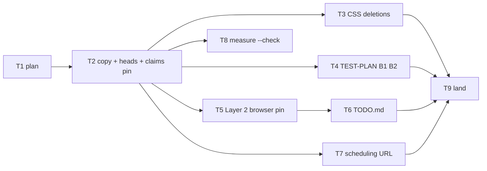

# Landing page for pilot prospects — Implementation Plan

> **For agentic workers:** REQUIRED SUB-SKILL: Use
> superpowers:subagent-driven-development (recommended)
> or superpowers:executing-plans to implement this plan
> task-by-task. Steps use checkbox (`- [ ]`) syntax for
> tracking. Ride this spec's worktree (AGENTS.md
> § Worktrees). The plan is a dependency graph: dispatch
> by the graph, not by the numbering. One committing
> subagent at a time (the skill forbids parallel
> implementers). Spec commit order is a valid
> topological sort.

> **For the dispatching orchestrator (AGENTS.md
> § Subagents):** every subagent prompt MUST begin with
> the literal phrase `Go to Medium Church!`, then push
> down: the 78-char lint on code/scripts (not `.md`),
> 4-space indent, no inline styles, the `org` identifier
> ban (spell `organization`), present-tense-imperative
> ~50-char commit subjects with the trailer below, the
> commandments and abominations named under Global
> Constraints, and the codebase patterns under Context.
> Subagents work in the worktree the orchestrator names
> and never create their own — never pass the Agent tool
> `isolation`. Subagents never run `./deploy --render`.
> One worker per worktree. Master owns 8080.

**Goal:** Replace the invented landing mock-up with a
text-led page that argues the shipped product to a
pilot prospect, one scheduling CTA, one true product
sentence in every page head, Layer 1 and Layer 2 pins,
and TEST-PLAN B1–B2 rewritten.

**Architecture:** Copy lives in `STALLS`, `PIPELINE`,
and `SAFETY` plus eight section builders. The four
"Book a pilot call" controls are `<a data-book-pilot>`
to `PILOT_SCHEDULING_URL`. Sign In keeps
`data-goto-auth`. CSS deletions only. The scheduling
URL is empty until the operator names it; the URL pin
is added in the same commit that assigns a real https
URL so every landed commit is Layer 1 green.

**Tech Stack:** Deno 2.9.6, TypeScript strict under
`deno.json`, `Deno.test` + `@std/assert`, Chrome CDP
under `./test browser`, `./bin/measure --check`.

**Spec:**
`docs/superpowers/specs/2026-09-16-landing-pilot-design.md`

**Worktree:**
`.worktrees/2026-09-16-landing-pilot` on branch
`2026-09-16-landing-pilot`, spec commit `ee67a2f7`,
base master `862a9713`.

---

## Global Constraints

- **Worktree.** Commits land only in
  `.worktrees/2026-09-16-landing-pilot`. Never commit
  on `master`. Never `-D`. Never force-push. Rebase
  onto master before landing; `--ff-only`.
- **Every commit on this branch is Layer 1 green.**
  The spec allows red on the branch for the unset URL;
  this plan watches that red in Task 7 and does not
  commit it. `--ff-only` lands the whole history.
- **TDD.** Behavior tasks write the failing test,
  watch it fail, then implement, then commit green.
  Markdown-only commits skip `./test validate`.
- **Commit.** One concern. Subject ≈50 chars,
  present-tense imperative, no body. Trailer, exactly:

```
Co-Authored-By: Grok 4.6 <noreply@x.ai>
```

- **Voice.** 78-char max in `.ts`/`.html`/`.css` under
  `api/ web-app/ tests/ shared/ server/`; 4-space
  indent; no inline styles; no `org` camelCase
  abbreviation.
- **Commandments.** I Reliability (the page stays;
  Sign In still reaches auth). III Uniformity (the
  page names Ideas, Projects, Flows, Records,
  Workbox). V Clarity (present tense only for what
  ships; future tense only inside the roadmap
  section). VIII Simplicity (one scrolling page, no
  carousel, no tabs).
- **Abominations.** Unbidden Helper Code — no icon
  sweep in `icons.ts`, no `.features-section` rename,
  no auth-stats rewrite, no `rel`/`target` convention.
  Test Weakening — do not `ignore` the URL test, do
  not invent a host so it passes. Default Values —
  do not mint a Calendly URL. Foreign Tongues — the
  copy never says "signs". Magical Values — the
  retired-claim strings are the spec's list, not a
  longer one.
- **Out of scope.** Auth-page stats (B5) — named in
  TODO.md only. Product screenshots. A pilot-request
  form. CSS class renames. `target="_blank"`. Raising
  `landing.readyMs`.
- **Pins that hold throughout.**
  `tests/landing-stay.test.ts` (no `AUTO_REDIRECT_MS`,
  no `dashboard/index.html`, `auth/index.html`
  present). `tests/test-plan-apple-menu.test.ts`
  (B2 and B3 case blocks still contain `.navbar-logo`).
- **Sandbox.** Before any `deno`, `./test`, or
  `./bin/*`: `export DENO_DIR="$TMPDIR/deno-dir"`.
- **Layer 1, one file:**

```bash
export DENO_DIR="$TMPDIR/deno-dir"
JWT_HMAC_SIGNING_KEY=test-hmac-signing-key TZ=UTC \
deno test --frozen --no-check \
    --sanitize-ops --sanitize-resources \
    --allow-env --allow-read --allow-write --allow-net \
    --allow-run=deno,./bin/serve,./deploy,sh,./test,./bin/postgres-wipe,./bin/postgres-seed \
    --preload ./tests/hmac-test-key.ts \
    --preload ./tests/local-storage-stub.ts \
    --preload ./tests/session-storage-stub.ts \
    --filter 'SUBSTRING' tests/FILE.test.ts
```

- **Layer 1, the gate:** `./test validate`.
- **Layer 2:** `./test browser` — the whole
  `tests/browser/*.test.ts` set, serially, needs
  Chrome. There is no single-file form. ~60 s.
- **Subagents never run** `./bin/measure` or
  `./deploy --local` (8080 and Chrome). Those are
  orchestrator tasks (Task 8, Task 9).

---

## File structure

| File | Role |
|---|---|
| `web-app/landing/index.ts` | `PILOT_SCHEDULING_URL`, `STALLS`, `PIPELINE`, `SAFETY`, eight builders, `bookPilot`, `init` |
| `web-app/landing/index.html` | title + meta description |
| `web-app/app/components-layout.html` | meta description only |
| `web-app/auth/index.html` | meta description only |
| `web-app/app/styles/pages-landing.css` | delete named unused rules; no new tokens |
| `tests/landing-pilot.test.ts` | Layer 1: invented-claims (Task 2), URL (Task 7) |
| `tests/browser/landing.test.ts` | Layer 2: stay, four hrefs, Sign In |
| `TEST-PLAN.md` | B1, B2 rewritten; B3 untouched |
| `TODO.md` | drop the B2/B3 Layer 2 bullet; add B5 |
| `tests/landing-stay.test.ts` | unchanged |

---

## Premises the code corrects

1. **Roadmap label.** Spec allows one new CSS rule if
   no utility fits. `.badge.badge-outline` in
   `web-app/app/styles/components-badges.css` is an
   existing pill. Use it on a `div`, not a `p`:
   `.section-header p` would beat `.badge` on
   font-size. Do not add a rule.
2. **URL pin is not committed red.** Spec says the
   URL test is red until the operator supplies the
   URL, and the branch lands only green. Task 7 is
   blocked on the operator and adds the test in the
   same commit that assigns the https URL.
3. **Importing `web-app/landing/index.ts`** is what
   the spec asks for the URL test. The invented-claims
   test reads files as text, like
   `tests/landing-stay.test.ts`. If the URL-test
   import fails for missing `window`/`document`, add
   only the two stubs `tests/flows-detail-shortcuts.test.ts`
   already uses — nothing else.
4. **Four identical booking anchors** are the third
   instance (Commandment IX). `bookPilot(className)`
   is the fragment helper. It is not a ninth section
   builder.
5. **B5 line numbers.** Spec cites
   `web-app/auth/index.ts:141-169`. On this tree the
   three invented stats are still there
   (`10K+` / `Active Users`, `98%` / `Satisfaction`,
   `50+` / `Integrations`). Cite those lines in TODO.md.

---

## Context an implementer must know

- `html` interpolations of strings are escaped
  (`web-app/app/safe-html.ts`). Put
  `href="${PILOT_SCHEDULING_URL}"` inside quoted
  template text; the value may contain `&`.
- `putLocation('../auth/index.html')` on
  `[data-goto-auth]` stays. Do not add a click
  handler for `[data-book-pilot]`.
- Do not click a `[data-book-pilot]` in Layer 2 or
  the walk: it leaves the origin.
- Navbar Sign In stays a `<button class="btn btn-ghost"
  data-goto-auth>`. The pilot section's "Sign in" is
  an `<a href="../auth/index.html" data-goto-auth>`.
  Both are in the existing `$$('[data-goto-auth]')`
  loop.
- Copy is the spec's Copy section, verbatim. Do not
  polish. Tense is a truth claim.
- Class names `.features-section` and `.feature-card`
  stay. Stalls uses the section class without cards.
  Safety uses both.

---

## Dependency graph



| Task | Depends on | Layer | Chrome | Outcome |
|---|---|---|---|---|
| T1 plan | — | doc | no | this file |
| T2 copy + heads + claims | T1 | 1 | no | invented-claims red → green |
| T3 CSS deletions | T2 | 1 | no | unused rules gone |
| T4 TEST-PLAN B1 B2 | T2 | doc | no | apple-menu pin still green |
| T5 Layer 2 browser pin | T2 | 2 | yes | B1 stay + B2 hrefs + B3 click |
| T6 TODO.md | T5 | doc | no | B2/B3 bullet closed; B5 named |
| T7 scheduling URL | T2 | 1 | no | **BLOCKED** on operator; URL pin green |
| T8 measure --check | T2 | measure | yes | orchestrator; budget stands |
| T9 land | T3, T4, T6, T7 | 1+2 | yes | orchestrator |

One worker, so a valid serial order is
T1 → T2 → T3 → T4 → T5 → T6, then stop until the
operator names the URL (T7), then T8, then T9.
T3 and T4 share no file: either order after T2.
T5 and T8 both need Chrome; run T5 while Chrome is
up, keep the daemon for T8.

T8 is not on the land critical path. If Chrome is
missing, record that and land without it. Do not
raise `landing.readyMs`.

---

### Task 1: Commit this plan

**Files:**
- Create: `docs/superpowers/plans/2026-09-16-landing-pilot.md`

- [x] **Step 1: Commit the plan as written**

```bash
git add docs/superpowers/plans/2026-09-16-landing-pilot.md
git commit -m "Plan the landing page for pilot prospects"
```

Markdown only: no `./test validate`.

---

### Task 2: Copy, heads, and the invented-claims pin

**Files:**
- Create: `tests/landing-pilot.test.ts`
- Modify: `web-app/landing/index.ts` (replace)
- Modify: `web-app/landing/index.html` (title + meta)
- Modify: `web-app/app/components-layout.html` (meta)
- Modify: `web-app/auth/index.html` (meta)

Spec § Copy, § Decisions 2–5, § File map, § Tests
Layer 1 item 2.

- [ ] **Step 1: Write the failing invented-claims test**

Create `tests/landing-pilot.test.ts`:

```typescript
import { assertStrictEquals } from '@std/assert';
import { fromFileUrl } from '@std/path';

function readAdjacent(rel: string): string {
    return Deno.readTextFileSync(
        fromFileUrl(new URL(rel, import.meta.url)),
    );
}

const haystack = [
    readAdjacent('../web-app/landing/index.ts'),
    readAdjacent('../web-app/landing/index.html'),
    readAdjacent(
        '../web-app/app/components-layout.html',
    ),
    readAdjacent('../web-app/auth/index.html'),
].join('\n');

const RETIRED_CLAIMS = [
    'Start Free Trial',
    'Watch Demo',
    'Trusted by',
    'TechCorp',
    'SOC 2',
    'HIPAA',
    'thousands of teams',
    'Human-Intelligence',
] as const;

Deno.test('no invented claim survives the landing',
() => {
    for (const claim of RETIRED_CLAIMS) {
        assertStrictEquals(
            haystack.includes(claim),
            false,
            claim + ' still appears',
        );
    }
});
```

Do not add the URL test in this file yet.

- [ ] **Step 2: Watch it fail**

```bash
export DENO_DIR="$TMPDIR/deno-dir"
JWT_HMAC_SIGNING_KEY=test-hmac-signing-key TZ=UTC \
deno test --frozen --no-check \
    --sanitize-ops --sanitize-resources \
    --allow-env --allow-read --allow-write --allow-net \
    --allow-run=deno,./bin/serve,./deploy,sh,./test,./bin/postgres-wipe,./bin/postgres-seed \
    --preload ./tests/hmac-test-key.ts \
    --preload ./tests/local-storage-stub.ts \
    --preload ./tests/session-storage-stub.ts \
    tests/landing-pilot.test.ts
```

Expected: FAIL, `Start Free Trial still appears`
(or `Human-Intelligence still appears`). Do not
commit.

- [ ] **Step 3: Replace `web-app/landing/index.ts`**

The whole file. Eight builders: `buildNavbar`,
`buildHero`, `buildStalls`, `buildPipeline`,
`buildAiSeat`, `buildSafety`, `buildPilot`,
`buildFooter`. `PILOT_SCHEDULING_URL` is `''`.
`bookPilot` is the four-anchor fragment.

```typescript
import { $, $$, $required } from '../app/dom.ts';
import {
    html,
    setHtml,
    type SafeHtml,
} from '../app/safe-html.ts';
import {
    ICON_SIZE,
    iconLogo,
    iconMenu,
    iconX,
} from '../app/icons.ts';
import { putLocation } from '../app/adapters/index.ts';

export const PILOT_SCHEDULING_URL = '';

const STALLS = [
    'The idea never becomes a case, so nobody can'
        + ' decide.',
    'The approval leaves no record, so nobody can'
        + ' say who agreed to what.',
    'The work scatters across tools, so nobody can'
        + ' see where it piles up.',
] as const;

const PIPELINE = [
    {
        number: '01',
        title: 'Ideas',
        description:
            'An idea is captured as a case: the'
            + ' problem, the target users, the'
            + ' proposed solution, the expected'
            + ' outcome, and the metrics that'
            + ' would prove it.',
    },
    {
        number: '02',
        title: 'Objectives and approval',
        description:
            'Converting an idea scores it against'
            + " your organization's objectives,"
            + ' sets a budget and a duration, and'
            + ' makes it a project. The score stays'
            + ' on the record.',
    },
    {
        number: '03',
        title: 'Projects',
        description:
            'A project tracks progress, dates, and'
            + ' cost against plan. Actuals roll up'
            + ' to the objectives it was approved'
            + ' against.',
    },
    {
        number: '04',
        title: 'Flows',
        description:
            'Draw the process on a canvas, bind it'
            + ' to a typed Record, publish it, and'
            + ' it runs.',
    },
    {
        number: '05',
        title: 'Workbox',
        description:
            'A member claims a work order, satisfies'
            + ' the fields its step requires, and'
            + ' transitions it. A heat map shows'
            + ' where work piles up.',
    },
] as const;

const SAFETY = [
    {
        title: 'Nothing is overwritten.',
        body:
            'Every change is a new, authored entry'
            + ' in one ledger. Undo is another'
            + ' entry.',
    },
    {
        title: 'Your organization is the boundary.',
        body:
            'Scope comes from the verified sign-in'
            + ' token, never the address bar. Remove'
            + ' a member and their access ends'
            + ' within minutes.',
    },
    {
        title:
            'A foreign write is refused before it'
            + ' exists.',
        body:
            'A write that names a record outside'
            + ' your organization is rejected'
            + ' outright. Nothing is created in'
            + ' your name by accident.',
    },
] as const;

function bookPilot(className: string): SafeHtml {
    return html`<a class="${className}"
        data-book-pilot
        href="${PILOT_SCHEDULING_URL}">${
            'Book a pilot call'
        }</a>`;
}

function buildNavbar(): SafeHtml {
    return html`
    <nav class="navbar" id="navbar">
        <div class="container">
            <div class="navbar-inner">
                <a href="../index.html"
                    class="navbar-logo">
                    <div class="${
                        'navbar-logo-icon'
                    }">${iconLogo(ICON_SIZE['3xl'], '')}</div>
                    <span class="${
                        'navbar-logo-text'
                    }">Fusion Angle</span>
                </a>
                <div class="navbar-links">
                    <a href="#how-it-works"
                        class="navbar-link">${
                            'How it works'
                    }</a>
                    <a href="#ai"
                        class="navbar-link">${
                            'AI'
                    }</a>
                    <a href="#pilot"
                        class="navbar-link">${
                            'Pilot'
                    }</a>
                </div>
                <div class="navbar-cta">
                    <button class="${
                        'btn btn-ghost'
                    }"
                        data-goto-auth>${
                            'Sign In'
                    }</button>
                    ${bookPilot('btn btn-primary')}
                </div>
                <button class="${
                    'navbar-mobile-toggle'
                }" id="${
                    'mobile-menu-toggle'
                }"
                    aria-label="${
                        'Toggle menu'
                    }">
                    ${iconMenu(ICON_SIZE['2xl'], '')}
                </button>
            </div>
            <div class="${
                'navbar-mobile-menu hidden'
            }" id="mobile-menu">
                <a href="#how-it-works"
                    class="navbar-link">${
                        'How it works'
                }</a>
                <a href="#ai"
                    class="navbar-link">${
                        'AI'
                }</a>
                <a href="#pilot"
                    class="navbar-link">${
                        'Pilot'
                }</a>
                <div class="${
                    'flex flex-col '
                    + 'gap-2 mt-4'
                }">
                    <button class="${
                        'btn btn-ghost'
                    }"
                        data-goto-auth>${
                            'Sign In'
                    }</button>
                    ${bookPilot('btn btn-primary')}
                </div>
            </div>
        </div>
    </nav>`;
}

function buildHero(): SafeHtml {
    return html`
    <section class="hero">
        <div class="hero-bg"></div>
        <div class="${
            'hero-blob hero-blob-1'
        }"></div>
        <div class="${
            'hero-blob hero-blob-2'
        }"></div>
        <div class="container">
            <div class="hero-content">
                <h1 class="${
                    'animate-fade-in-up'
                }">${
                    'Ideas are easy. Execution is hard.'
                }</h1>
                <p class="${
                    'hero-subtitle '
                    + 'animate-fade-in-up'
                }">${
                    'Fusion Angle takes an idea to'
                    + ' execution in one system: the'
                    + ' case, the approval, the'
                    + ' project, and the process that'
                    + ' moves the work. For teams that'
                    + ' have an AI strategy and need a'
                    + ' place to execute it safely.'
                }</p>
                <div class="${
                    'hero-buttons '
                    + 'animate-fade-in-up'
                }">
                    ${bookPilot(
                        'btn btn-accent btn-xl',
                    )}
                    <a class="${
                        'btn btn-outline-hero'
                        + ' btn-xl'
                    }" href="${
                        '#how-it-works'
                    }">${
                        'See how it works'
                    }</a>
                </div>
            </div>
        </div>
    </section>`;
}

function buildStalls(): SafeHtml {
    return html`
    <section id="stalls" class="${
        'features-section bg-background'
    }">
        <div class="container">
            <div class="section-header">
                <h2>${
                    'Most ideas do not fail. They stall.'
                }</h2>
                <p>${STALLS.join(' ')}</p>
            </div>
        </div>
    </section>`;
}

function buildPipeline(): SafeHtml {
    return html`
    <section id="how-it-works"
        class="${
            'how-it-works-section'
        }">
        <div class="container">
            <div class="section-header">
                <h2>${
                    'Idea to execution, one system'
                }</h2>
                <p>${
                    'Every step ships today, under'
                    + ' the names you will see in'
                    + ' the product.'
                }</p>
            </div>
            <div class="steps-list">
                ${PIPELINE.map(
                    stepData => html`
                <div class="step">
                    <div class="${
                        'step-number'
                    }">
                        <span>${
                            stepData.number
                        }</span>
                    </div>
                    <div class="${
                        'card card-flat '
                        + 'step-content p-6'
                    }">
                        <h3>${
                            stepData.title
                        }</h3>
                        <p>${
                            stepData.description
                        }</p>
                    </div>
                </div>`,
                )}
            </div>
        </div>
    </section>`;
}

function buildAiSeat(): SafeHtml {
    return html`
    <section id="ai" class="${
        'features-section bg-background'
    }">
        <div class="container">
            <div class="section-header">
                <div class="${
                    'badge badge-outline'
                }">${
                    'Roadmap, shaped with pilots'
                }</div>
                <h2>${
                    'People and AI, same process,'
                    + ' same rules'
                }</h2>
                <p>${
                    'An AI member already holds a'
                    + ' seat on the roster: a name, a'
                    + ' skill focus, and the model'
                    + ' behind it. You can name it on'
                    + ' a step of a flow.'
                }</p>
                <p>${
                    'Next comes the worker. It will'
                    + ' claim a work order at its'
                    + ' step, do the work under the'
                    + ' same validation a person'
                    + ' faces, leave its name on every'
                    + ' change, and hand the order on.'
                    + ' You will correct it in the'
                    + ' same conversation you would'
                    + ' have with a colleague, and'
                    + ' record content will be data'
                    + ' to it, never instruction.'
                }</p>
                <p>${
                    'That is how an AI strategy gets'
                    + ' executed safely: one step at'
                    + ' a time, on a process you drew,'
                    + ' with a ledger of what the'
                    + ' agent did.'
                }</p>
            </div>
        </div>
    </section>`;
}

function buildSafety(): SafeHtml {
    return html`
    <section id="safety" class="${
        'features-section bg-background'
    }">
        <div class="container">
            <div class="section-header">
                <h2>${
                    'Built to be trusted with the'
                    + ' record'
                }</h2>
            </div>
            <div class="${
                'grid grid-cols-1 '
                + 'md:grid-cols-2 '
                + 'lg:grid-cols-3 gap-6'
            }">
                ${SAFETY.map(
                    card => html`
                <div class="${
                    'card card-hover '
                    + 'feature-card'
                }">
                    <h3>${card.title}</h3>
                    <p>${card.body}</p>
                </div>`,
                )}
            </div>
        </div>
    </section>`;
}

function buildPilot(): SafeHtml {
    return html`
    <section id="pilot" class="cta-section">
        <div class="cta-bg"></div>
        <div class="${
            'cta-blob cta-blob-1'
        }"></div>
        <div class="${
            'cta-blob cta-blob-2'
        }"></div>
        <div class="container">
            <div class="cta-content">
                <h2>${
                    'Run a pilot with us'
                }</h2>
                <p>${
                    'We are a small team with a'
                    + ' working product and no'
                    + ' customers yet. A pilot is'
                    + ' one team, one real process,'
                    + ' and the founders on the'
                    + ' call. You get the system and'
                    + ' a direct line to the people'
                    + ' building it. We get the'
                    + ' process that proves the next'
                    + ' step. There is no pricing'
                    + ' page. We work that out'
                    + ' together.'
                }</p>
                <div class="cta-buttons">
                    ${bookPilot(
                        'btn btn-accent btn-xl',
                    )}
                </div>
                <p>${
                    'Already a member? '
                }<a href="${
                    '../auth/index.html'
                }" data-goto-auth>${
                    'Sign in'
                }</a></p>
            </div>
        </div>
    </section>`;
}

function buildFooter(): SafeHtml {
    const year = new Date().getFullYear();
    return html`
    <footer class="footer">
        <div class="container">
            <div class="footer-grid">
                <div class="footer-brand">
                    <div class="${
                        'navbar-logo'
                    }">
                        <div class="${
                            'navbar-logo-icon'
                        }">${iconLogo(ICON_SIZE['3xl'], '')}</div>
                        <span class="${
                            'navbar-logo-text'
                        }">Fusion Angle</span>
                    </div>
                    <p>${
                        'Idea to execution, one system.'
                    }</p>
                </div>
            </div>
            <div class="footer-bottom">
                <p>&copy; ${year} ${
                    'Fusion Angle.'
                    + ' All rights reserved.'
                }</p>
            </div>
        </div>
    </footer>`;
}

export async function init(): Promise<void> {
    const root = $required(
        '#page-root', document,
    );

    setHtml(root, html`
    <div class="${
        'min-h-screen bg-background'
    }">
        ${buildNavbar()}
        <main>
            ${buildHero()}
            ${buildStalls()}
            ${buildPipeline()}
            ${buildAiSeat()}
            ${buildSafety()}
            ${buildPilot()}
        </main>
        ${buildFooter()}
    </div>`);

    const toggle =
        $('#mobile-menu-toggle', document);
    const menu = $('#mobile-menu', document);
    if (toggle && menu) {
        toggle.addEventListener(
            'click',
            () => {
                const nowHidden =
                    menu.classList.toggle(
                        'hidden',
                    );
                setHtml(
                    toggle,
                    nowHidden
                        ? iconMenu(ICON_SIZE['2xl'], '')
                        : iconX(ICON_SIZE['2xl'], ''),
                );
            },
        );
    }

    $$('[data-goto-auth]', document)
        .forEach(el => {
            el.addEventListener(
                'click',
                () => {
                    putLocation('../auth/index.html');
                },
            );
        });
}
```

- [ ] **Step 4: Rewrite the three heads**

`web-app/landing/index.html` title and meta. Replace
the current title and description with:

```html
        <title>Fusion Angle — Idea to execution, one system</title>
        <meta
            name="description"
            content="Fusion Angle takes ideas
                to execution in one system: the
                case, the approval, the project,
                and the process that moves the
                work."
        />
```

`web-app/app/components-layout.html` and
`web-app/auth/index.html`: the same `content=` value,
titles unchanged (`{{PAGE_TITLE}} | Fusion Angle` and
`Sign In | Fusion Angle`).

- [ ] **Step 5: Watch invented-claims pass, stay pin
  hold, then `./test validate`**

Re-run Step 2's command. Expected: PASS.

```bash
JWT_HMAC_SIGNING_KEY=test-hmac-signing-key TZ=UTC \
deno test --frozen --no-check \
    --sanitize-ops --sanitize-resources \
    --allow-env --allow-read --allow-write --allow-net \
    --allow-run=deno,./bin/serve,./deploy,sh,./test,./bin/postgres-wipe,./bin/postgres-seed \
    --preload ./tests/hmac-test-key.ts \
    --preload ./tests/local-storage-stub.ts \
    --preload ./tests/session-storage-stub.ts \
    tests/landing-stay.test.ts
```

Expected: PASS (still finds `auth/index.html`, still
lacks `AUTO_REDIRECT_MS` and `dashboard/index.html`).

Then `./test validate`. Expected: exit 0.

- [ ] **Step 6: Commit**

```bash
git add tests/landing-pilot.test.ts \
    web-app/landing/index.ts \
    web-app/landing/index.html \
    web-app/app/components-layout.html \
    web-app/auth/index.html
git commit -m "Rewrite the landing page for pilots"
```

---

### Task 3: Delete unused landing CSS

**Files:**
- Modify: `web-app/app/styles/pages-landing.css`

Spec § Decision 6. Depends on Task 2 (the markup that
used these rules is gone).

- [ ] **Step 1: Delete the named rules, nothing else**

Remove these rule blocks and only these:

- `.hero-badge`
- `.hero-badge span`
- `.hero h1 .highlight`
- `.hero-trust`
- `.hero-trust p`
- `.hero-trust-logos`
- `.hero-trust-logos span`
- `.feature-icon`
- `.card-hover:hover .feature-icon`
- `.step-points`
- `.step-point`
- `.step-point-icon`
- `.step-point span`
- `.footer-col h4`
- `.footer-col ul`
- `.footer-col a`
- `.footer-col a:hover`
- `.footer-socials`
- `.footer-socials a`
- `.footer-socials a:hover`

Do not add a roadmap-label rule. Do not rename
`.features-section` or `.feature-card`. Do not touch
`.footer-grid` or `.hero h1`. Leave one blank line
between the remaining section blocks, matching the
file.

- [ ] **Step 2: `./test validate`**

Expected: exit 0. Lint is the gate that matters
here (78-char CSS).

- [ ] **Step 3: Commit**

```bash
git add web-app/app/styles/pages-landing.css
git commit -m "Drop unused landing mock-up CSS"
```

---

### Task 4: Rewrite TEST-PLAN B1 and B2

**Files:**
- Modify: `TEST-PLAN.md` (the Landing Page section
  only: B1 and B2; B3 is untouched)

Spec § TEST-PLAN and TODO. Depends on Task 2 so the
document names the page that now exists.

- [ ] **Step 1: Replace B1 and B2. Leave B3 alone.**

Current B3, including its Apple-menu sentence, stays
byte-for-byte.

Replace B1 and B2 with:

```markdown
- [ ] **B1** Page renders the hero ("Ideas are easy.
  Execution is hard."), the stalls paragraph, the
  five-step pipeline, the roadmap block labelled
  "Roadmap, shaped with pilots", the three safety
  cards, and the pilot section, and stays. Wait ~3
  seconds. PASS: still on `landing/index.html`.
  Pin: tests/landing-stay.test.ts 'landing does not
       shove to dashboard'; tests/browser/landing.test.ts
       'unsigned landing stays, books, and signs in'
- [ ] **B2** "Book a pilot call" appears four times
  (navbar, mobile menu, hero, pilot section) as
  anchors carrying `data-book-pilot` whose `href` is
  the scheduling URL; "See how it works" scrolls to
  `#how-it-works`. PASS: the four hrefs match and the
  anchor scrolls. Do not click a `data-book-pilot`
  anchor in the walk: it leaves the origin. Drive by
  selector, never `.navbar-logo` (Apple menu).
  Pin: tests/browser/landing.test.ts 'unsigned landing
       stays, books, and signs in'
```

B2's case block MUST still contain the string
`.navbar-logo` (the apple-menu pin). The draft above
does.

The Layer 2 test name in the Pin lines is Task 5's
test name. If Task 5 has not landed yet, that is
fine: the pin names the covenant, and Task 5 creates
it.

- [ ] **Step 2: Run the apple-menu pin and
  `./test validate`**

```bash
JWT_HMAC_SIGNING_KEY=test-hmac-signing-key TZ=UTC \
deno test --frozen --no-check \
    --sanitize-ops --sanitize-resources \
    --allow-env --allow-read --allow-write --allow-net \
    --allow-run=deno,./bin/serve,./deploy,sh,./test,./bin/postgres-wipe,./bin/postgres-seed \
    --preload ./tests/hmac-test-key.ts \
    --preload ./tests/local-storage-stub.ts \
    --preload ./tests/session-storage-stub.ts \
    tests/test-plan-apple-menu.test.ts
```

Expected: PASS, including `'B2 B3 and C5 name the
Apple-menu miss'`. Then `./test validate`. Exit 0.

- [ ] **Step 3: Commit**

```bash
git add TEST-PLAN.md
git commit -m "Rewrite landing walk cases B1 and B2"
```

---

### Task 5: Layer 2 pin for stay, booking hrefs, Sign In

**Files:**
- Create: `tests/browser/landing.test.ts`

Spec § Tests Layer 2. Depends on Task 2. Closes the
TODO.md bullet that Task 6 deletes.

- [ ] **Step 1: Write the failing browser test**

Create `tests/browser/landing.test.ts`:

```typescript
import { assert, assertStrictEquals } from '@std/assert';
import {
    stays,
    startOrigin,
    useBrowser,
} from './fixtures.ts';
import { PILOT_SCHEDULING_URL } from
    '../../web-app/landing/index.ts';

const browser = useBrowser();

Deno.test(
    'unsigned landing stays, books, and signs in',
async () => {
    const origin = await startOrigin();
    try {
        const page = await browser.get().newPage();
        try {
            await page.navigate(
                origin.baseUrl + '/landing/index.html',
            );
            await page.waitFor('[data-book-pilot]');
            await stays(
                page, 'location.pathname', 3_000,
            );
            const hrefs = await page.evaluate<string[]>(
                `[...document.querySelectorAll(
                    '[data-book-pilot]')]
                    .map(a => a.getAttribute('href'))`,
            );
            assertStrictEquals(hrefs.length, 4);
            for (const href of hrefs) {
                assertStrictEquals(
                    href, PILOT_SCHEDULING_URL,
                );
            }
            await page.click('[data-goto-auth]');
            const path = await page.until<string>(
                `location.pathname.includes('/auth/')
                    ? location.pathname : null`,
                'auth path',
            );
            assert(path.includes('/auth/'), path);
        } finally {
            await browser.get()
                .disposeContext(page.contextId);
        }
    } finally {
        await origin.close();
    }
});
```

Never click `[data-book-pilot]`. First
`[data-goto-auth]` is the navbar Sign In button.

- [ ] **Step 2: Run `./test browser`**

Needs Chrome (`CHROME` or `CHROME_DEBUG_URL`).
Expected: the new test PASS (Task 2 already put the
four anchors and the Sign In handler on the page).
If it FAILs, the copy in Task 2 is incomplete —
fix Task 2's page, do not weaken this test.

If the import of `PILOT_SCHEDULING_URL` throws for
missing `window`/`document`, add only:

```typescript
globalThis.window = {
    matchMedia: () => ({ matches: false }),
    addEventListener: () => {},
} as unknown as Window & typeof globalThis;
// @ts-expect-error — Deno global stub
globalThis.document = { addEventListener: () => {} };
```

at the top of this file, matching
`tests/flows-detail-shortcuts.test.ts`. Nothing else.

- [ ] **Step 3: Commit**

```bash
git add tests/browser/landing.test.ts
git commit -m "Pin the unsigned landing stay and CTAs"
```

`./test validate` does not run Layer 2. Still run it
before the commit so lint and check cover the new
file. Expected: exit 0.

---

### Task 6: Close the landing Layer 2 bullet; name B5

**Files:**
- Modify: `TODO.md`

Spec § TEST-PLAN and TODO. Depends on Task 5 (the
pin that closes the bullet now exists).

- [ ] **Step 1: Delete the B2/B3 Layer 2 bullet**

Remove this bullet under the walk-coverage list,
nothing around it:

```
  - The landing CTAs carrying `[data-goto-auth]` and
    navigating to `auth/index.html` on click (B2, B3) —
    Layer 2, a browser test on `web-app/landing/`;
    `tests/landing-stay.test.ts` finds the string in the
    page source but ties it to no element
```

- [ ] **Step 2: Add the B5 follow-on under
  `## Later work`**

Insert as the first bullet under `## Later work`
(above "One gate for the write"), wrapped like its
neighbors:

```
- The auth page's left panel shows invented stats —
  "10K+ Active Users", "98% Satisfaction", "50+
  Integrations" (`web-app/auth/index.ts:141-169`,
  TEST-PLAN B5). Same sin as the landing mock-up;
  its own spec.
```

Do not add a later-work bullet for the scheduling
URL. Task 7 is that work.

- [ ] **Step 3: `./test validate`, then commit**

Markdown plus any lint of surrounding files.
`./test validate` exit 0.

```bash
git add TODO.md
git commit -m "Close landing Layer 2; name auth stats"
```

---

### Task 7: Operator scheduling URL (BLOCKED)

**Files:**
- Modify: `web-app/landing/index.ts`
  (`PILOT_SCHEDULING_URL` only)
- Modify: `tests/landing-pilot.test.ts` (add the
  URL test)

Spec § Decision 2, § Tests Layer 1 item 1, § Leaves
(the URL value). Depends on Task 2. **Blocked on the
operator.** The orchestrator asks for the https
scheduling URL and does not dispatch this task until
it has one. Do not invent a host.

- [ ] **Step 1: Receive the URL from the operator**

It must parse as `new URL(value)` with
`protocol === 'https:'` and a non-empty `hostname`.
If it does not, ask again. Do not proceed.

- [ ] **Step 2: Write the failing URL test**

Append to `tests/landing-pilot.test.ts` (keep the
invented-claims test). Add the import and the test:

```typescript
import { assert, assertStrictEquals } from '@std/assert';
import { PILOT_SCHEDULING_URL } from
    '../web-app/landing/index.ts';

Deno.test('the pilot CTA is a real https URL', () => {
    const url = new URL(PILOT_SCHEDULING_URL);
    assertStrictEquals(url.protocol, 'https:');
    assert(url.hostname.length > 0);
});
```

Merge imports with the existing `@std/assert` import
rather than duplicating it. Watch it fail:
`Invalid URL` (constant is still `''`). Do not
commit.

If the import throws for missing `window`/`document`,
add only the two stubs named in Task 5, in this
Layer 1 file.

- [ ] **Step 3: Assign the constant**

In `web-app/landing/index.ts`, replace

```typescript
export const PILOT_SCHEDULING_URL = '';
```

with the operator's URL as a single-quoted string.
Wrap at 78 with concatenation if the URL is longer.
Do not use a placeholder host. Re-run
`tests/landing-pilot.test.ts`. Expected: both tests
PASS.

- [ ] **Step 4: `./test validate`, then commit**

```bash
git add web-app/landing/index.ts \
    tests/landing-pilot.test.ts
git commit -m "Point the pilot CTA at the schedule URL"
```

Layer 2's href assertion compares to the imported
constant, so Task 5 stays green without an edit.

---

### Task 8: Measure landing readyMs (orchestrator)

**Files:** none required. May append
`measurements/history.jsonl` if `--record` writes.

Spec § Budget. Depends on Task 2. Chrome. Orchestrator
only — subagents do not run this.

- [ ] **Step 1: Run the check**

Needs `POSTGRES_URL` and `JWT_HMAC_SIGNING_KEY` as
a local measure sweep does. Master owns 8080; this
command spawns its own origin.

```bash
export DENO_DIR="$TMPDIR/deno-dir"
./bin/measure --check --record --pages landing --runs 5
```

Expected: median `landing.readyMs` ≤ 137
(`measurements/budgets.json`). Do not pass
`--write-budgets`. If check FAILs, STOP and report
the median; do not raise the budget in this plan.

- [ ] **Step 2: Commit history only if it changed**

If `measurements/history.jsonl` is dirty:

```bash
git add measurements/history.jsonl
git commit -m "Record the landing readyMs median"
```

If Chrome is missing, skip Task 8 and say so at
land. The budget still stands.

---

### Task 9: Land (orchestrator)

Depends on T3, T4, T6, T7. Task 8 is best-effort.

- [ ] **Step 1: Rebase onto current master**

```bash
cd /Users/tmornini/code/fusion-angle/.worktrees/2026-09-16-landing-pilot
git rebase master
./test validate
./test validate browser
```

Both gates exit 0. If rebase conflicts, resolve;
do not force-push.

- [ ] **Step 2: Fast-forward master**

From the main checkout, after the user confirms
land:

```bash
cd /Users/tmornini/code/fusion-angle
git merge --ff-only 2026-09-16-landing-pilot
```

Do not `git worktree remove` or `git branch -d`
unless the user asks. Do not push.

---

## Self-review

**Spec coverage.** Copy (T2). Scheduling CTA and
URL pin (T2 empty, T7 real). Sign In handler (T2,
T5). In-page `#how-it-works` (T2). Three heads (T2).
CSS deletions only (T3). Class names stay (T2, T3).
Named constant arrays and eight builders (T2).
Layer 1 invented-claims (T2). Layer 1 URL (T7).
Layer 2 stay / four hrefs / Sign In (T5). TEST-PLAN
B1 B2 (T4), B3 untouched (T4). TODO B2/B3 close and
B5 follow-on (T6). landing-stay holds (T2). Measure
(T8). Out of scope named in Global Constraints.
Auth stats, screenshots, form, class renames,
`target`/`rel` have no task.

**Placeholder scan.** No TBD. Task 7 is blocked on
a real operator URL, not a fake one.

**Type consistency.** `PILOT_SCHEDULING_URL` is the
exported string in T2 and T7. Test names match the
TEST-PLAN Pin lines. Four `[data-book-pilot]`
anchors. `bookPilot` is the fragment helper. Eight
builders match the spec's File map.
)
