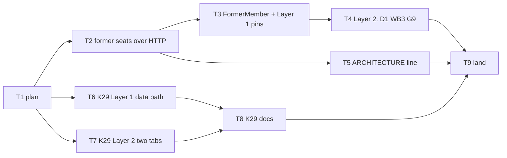

# 16 Sep walk FAIL mitigations — Implementation Plan

> **For agentic workers:** REQUIRED SUB-SKILL: Use
> superpowers:subagent-driven-development (recommended)
> or superpowers:executing-plans to implement this plan
> task-by-task. Steps use checkbox (`- [ ]`) syntax.
> Ride this spec's worktree (AGENTS.md § Worktrees).

**Goal:** Turn the four 16 Sep walk FAILs (D1, WB3,
G9, K29) into red tests, then land the product change
each red test demands — and only that.

**Architecture:** Two independent chains. The
de-seated-author cluster (D1/WB3/G9) gets a ledger
read of an organization's former seats, a fourth
`Member` kind the strict name resolver already knows
how to paint, and Layer 1 pins watched red before the
product change, then Layer 2 pins. K29 gets a Layer 1
pin of the aggregate's data path and a Layer 2 two-tab
pin of the cross-tab repaint; each pin's colour decides
whether a product change follows.

**Tech Stack:** Deno 2.9.6, TypeScript strict,
`Deno.test` + `@std/assert`, Chrome CDP through
`tests/browser/fixtures.ts` under `./test browser`.

**Spec:**
`docs/superpowers/specs/2026-09-16-walk-fail-mitigations-design.md`

**Worktree:**
`.worktrees/2026-09-16-walk-fail-mitigations` on branch
`2026-09-16-walk-fail-mitigations`, base `fdd1100b`.

**Stubs (frozen, never edited):**
`docs/superpowers/test-plan-mitigations/2026-09-16-D-D1.md`,
`…/2026-09-16-F2-WB3.md`, `…/2026-09-16-G-G9.md`,
`…/2026-09-16-K-K29.md`. Product commits cite the red
tests by name, never the stubs.

---

## Global constraints

- Work only in the worktree above. Never commit on
  master. Never `-D`. Never force-push. Rebase onto
  master before landing; `--ff-only`.
- One concern per commit. Subject ≈50 chars,
  present-tense imperative, no body. Trailer, exactly:

```
Co-Authored-By: Claude Fable 5.1 <noreply@anthropic.com>
Claude-Session: https://claude.ai/code/session_01EMqCACEjCpg5svHrpT9aPc
```

- A product change lands ONLY behind a test watched
  red at Layer 1 (`./test validate`) or Layer 2
  (`./test browser`), and only in the commit that turns
  it green. Every commit on the branch is green at
  Layer 1: `--ff-only` lands the whole history.
- Markdown-only commits skip `./test validate`.
- Under the Claude Code sandbox, before any `deno`,
  `./test`, or `./bin/*`:
  `export DENO_DIR="$TMPDIR/deno-dir"`.
- Voice: 78-char max in `.ts`/`.html`/`.css` under
  `api/ web-app/ tests/ shared/ server/`; 4-space
  indent; no inline styles; no `org` camelCase
  abbreviation in identifiers (`orgId`, `Org…`,
  `_ORG`) — write `organization`.
- Patterns: `RequestContext` is the first argument to
  adapter functions; snake_case on the wire, camelCase
  in the domain; HTTP-verb adapter names; validators at
  the gate, trust inside; `noUncheckedIndexedAccess`
  (`rows[0]!`).
- Commandments in play: Reliability (a page must not
  fall to one removed author), Security (the
  former-members read is fenced and PII-free),
  Uniformity (`FormerMember` names itself like the
  other kinds), Clarity (a visible label, not a
  swallowed throw), Simplicity (one read, one kind,
  no resolver change).
- Abominations to refuse: Test Weakening (the
  'memberName throws on missing id' pin stays;
  no `?? 'Former member'` fallback in the helper),
  Internal Defense (no `try/catch` around
  `memberName` at call sites), Default Values (the
  label is a kind, not a fallback), Unbidden Helper
  Code (no PII fill for former members, no
  `getFormerMembers` export, no extra fields), Premature
  Generalization (no "member lifecycle" abstraction).
- Layer 1, one file:

```bash
export DENO_DIR="$TMPDIR/deno-dir"
JWT_HMAC_SIGNING_KEY=test-hmac-signing-key TZ=UTC \
deno test --frozen --no-check \
    --sanitize-ops --sanitize-resources \
    --allow-env --allow-read --allow-write --allow-net \
    --allow-run=deno,./bin/serve,./deploy,sh,./test,./bin/postgres-wipe,./bin/postgres-seed \
    --preload ./tests/hmac-test-key.ts \
    --preload ./tests/local-storage-stub.ts \
    --preload ./tests/session-storage-stub.ts \
    --filter 'SUBSTRING' tests/FILE.test.ts
```

- Layer 1, the gate: `./test validate` (check, suite,
  lint, schema and API-doc staleness). Baseline on
  `fdd1100b`: 3570 passed, 0 failed, 7 ignored.
- Layer 2: `./test browser` — the whole
  `tests/browser/*.test.ts` set, serially, needs
  Chrome (`CHROME` or `CHROME_DEBUG_URL`). There is
  no single-file form. ~60 s.

---

## File structure

| File | Role |
|---|---|
| `api/types.ts` | `FormerSeatEntity`; `FormerMember`, `FORMER_MEMBER_NAME`, `isFormerMember`; `Member` union |
| `api/derive-memberships.ts` | `deriveOrganizationFormerSeats`; generic `byAtThenIdAscending` |
| `api/family-registry.ts` | `ORGANIZATION_FORMER_MEMBERS_COLLECTION_PATTERN` |
| `api/routes.ts` | the GET route |
| `api/authorization.ts` | member-tier GET row |
| `web-app/api-documentation/` | regenerated (tracked) |
| `web-app/app/adapters/members-union.ts` | `getFormerMembers` (private); `getMemberMap` union |
| `tests/api-organization-member-seat.test.ts` | derive: list, removal, re-seat, foreign 403 |
| `tests/api-member-tier.test.ts` | member GET 200 |
| `tests/adapters-members-union.test.ts` | root pin |
| `tests/adapters-ideas.test.ts` | D1 isolated; D1 on the seed |
| `tests/adapters-admin.test.ts` | G9 |
| `tests/workbox-inbox.test.ts` | WB3 |
| `tests/browser/former-member.test.ts` | D1, WB3, G9 at Layer 2 |
| `tests/adapters-project-scoring.test.ts` | K29 data path |
| `tests/browser/dashboard-objectives.test.ts` | K29 two tabs |
| `ARCHITECTURE.md` | former seats sentence |
| `TEST-PLAN.md` | K29 body and Pin line |
| `TODO.md` | drop the K29 bullet |

---

## Dependency graph



| Task | Depends on | Layer | Chrome | Outcome branch |
|---|---|---|---|---|
| T2 former seats over HTTP | T1 | 1 | no | red → green, product |
| T3 `FormerMember` + pins | T2 | 1 | no | red → green, product |
| T4 Layer 2 D1/WB3/G9 | T3 | 2 | yes | green expected; red = fix incomplete |
| T5 ARCHITECTURE line | T2 | doc | no | — |
| T6 K29 Layer 1 | T1 | 1 | no | green = pin; red = fix data path |
| T7 K29 Layer 2 | T1 | 2 | yes | green = artifact; red = fix bell |
| T8 K29 docs | T6, T7 | doc | no | wording follows T6/T7 |
| T9 land | T4, T5, T8 | 1+2 | yes | — |

The two chains (T2→T3→T4, T5) and (T6, T7→T8) share
no file and no state. One worker per worktree
(AGENTS.md), so run them in either order, not at once.
T4 and T7 need Chrome; batch them if Chrome is scarce.

Deferred walk cases (K1–K7, D2/D3/D18/D19/D25–D28/
D33/D36/D37, WB15/WB21, G10/V7–V9) are not tasks: they
re-run at the next Layer 3 walk once T3 lands.

---

### Task 1: Commit this plan

**Files:**
- Create: `docs/superpowers/plans/2026-09-16-walk-fail-mitigations.md`

- [x] **Step 1: Commit the plan as written**

```bash
git add docs/superpowers/plans/2026-09-16-walk-fail-mitigations.md
git commit -m "Plan the 16 Sep walk FAIL mitigations"
```

Markdown only: no `./test validate`.

---

### Task 2: Former seats over HTTP

**Files:**
- Modify: `api/types.ts` — after `MembershipEntity`
  (~line 1330)
- Modify: `api/derive-memberships.ts`
- Modify: `api/family-registry.ts` — after
  `ORGANIZATION_MEMBER_DETAIL_PATTERN` (~line 157)
- Modify: `api/routes.ts` — the
  `./derive-memberships.ts` import (~line 238), the
  `./family-registry.ts` import, and the roster route
  block (~line 5551)
- Modify: `api/authorization.ts` — `MEMBER_VERBS`,
  after `'/organizations/:id/members': ['GET'],`
- Regenerate: `web-app/api-documentation/`
- Test: `tests/api-organization-member-seat.test.ts`,
  `tests/api-member-tier.test.ts`

**Interfaces:**
- Produces `FormerSeatEntity`
  (`api/types.ts`):
  `{ id: Id; organization_id: Id; identity_id: Id; at: string }`
  — `id === identity_id`; `at` is the DELETE pair's
  arrival time.
- Produces
  `deriveOrganizationFormerSeats(db: DbAdapter, organization: Id): Promise<FormerSeatEntity[]>`
  (`api/derive-memberships.ts`), ascending by
  (`at`, `id`).
- Produces
  `ORGANIZATION_FORMER_MEMBERS_COLLECTION_PATTERN`
  `= 'organizations/:organization-id/former-members/'`
  (`api/family-registry.ts`).
- Produces HTTP
  `GET /organizations/:organization-id/former-members/`
  → `FormerSeatEntity[]`; foreign path org 403;
  member-tier GET allowed. Task 3 reads it.

- [x] **Step 1: Write the failing derive tests**

Append to `tests/api-organization-member-seat.test.ts`.
Extend its `'../api/types.ts'` import with
`type FormerSeatEntity`. Everything else it needs
(`memoryDbAdapter`, `handleRequest`,
`organizationToken`, `seedAdminSchema`, `seedSeat`,
`generateIdentifier`, `ORGANIZATION_TWO`, `AT`, `req`,
`assert`, `assertEquals`, `assertStrictEquals`) is
already imported or defined there.

```typescript
// A removed seat is a DELETE head at the seats prefix. The
// former-members read lists exactly those heads, with the
// DELETE pair's own arrival as `at`; a re-seat (PUT after
// DELETE) makes the head a PUT again and drops the row.
Deno.test('former-members lists a removed seat and drops it'
+ ' again on re-seat', async () => {
    const db = memoryDbAdapter();
    await seedAdminSchema(db);
    const admin = await organizationToken(
        'XXZruirZyAOoRpNxaDnpSA', 'AjdvjuECVZEgZoFajaIEkg');
    const leaver = generateIdentifier();
    await seedSeat(
        db, 'AjdvjuECVZEgZoFajaIEkg', leaver, 'member',
    );
    const former = '/organizations/AjdvjuECVZEgZoFajaIEkg'
        + '/former-members/';
    const seat = '/organizations/AjdvjuECVZEgZoFajaIEkg'
        + '/members/' + leaver;
    const before = await handleRequest(db, req(
        'GET', former, admin,
    ));
    assertStrictEquals(before.status, 200);
    assertEquals(await before.json(), []);
    const removed = await handleRequest(db, req(
        'DELETE', seat, admin,
    ));
    assertStrictEquals(removed.status, 204);
    const after = await handleRequest(db, req(
        'GET', former, admin,
    ));
    assertStrictEquals(after.status, 200);
    const rows = await after.json() as FormerSeatEntity[];
    assertStrictEquals(rows.length, 1);
    assertStrictEquals(rows[0]!.id, leaver);
    assertStrictEquals(rows[0]!.identity_id, leaver);
    assertStrictEquals(
        rows[0]!.organization_id, 'AjdvjuECVZEgZoFajaIEkg',
    );
    // The removal moment is the DELETE pair's arrival,
    // never seedSeat's 2020 grant time.
    assert(rows[0]!.at > '2020-01-02');
    const reseated = await handleRequest(db, req(
        'PUT', seat, admin, { type: 'member', at: AT },
    ));
    assertStrictEquals(reseated.status, 201);
    const again = await handleRequest(db, req(
        'GET', former, admin,
    ));
    assertEquals(await again.json(), []);
});

Deno.test('former-members is fenced to the token organization',
async () => {
    const db = memoryDbAdapter();
    await seedAdminSchema(db);
    const admin = await organizationToken(
        'XXZruirZyAOoRpNxaDnpSA', 'AjdvjuECVZEgZoFajaIEkg');
    const foreign = await handleRequest(db, req(
        'GET',
        '/organizations/' + ORGANIZATION_TWO + '/former-members/',
        admin,
    ));
    assertStrictEquals(foreign.status, 403);
});
```

Append to `tests/api-member-tier.test.ts` (its `req`,
`memberDb`, `devToken`, `MEMBER` are file-local):

```typescript
// Every member's name resolver reads the former seats
// beside the live roster — the member tier must offer
// the GET, or a non-admin 403s on every page that names
// an author.
Deno.test('a member reads the former-members list',
async () => {
    const db = await memberDb();
    const token = await devToken(MEMBER);
    const former = await handleRequest(
        db, req(
            'GET',
            '/organizations/AjdvjuECVZEgZoFajaIEkg/former-members/',
            token,
        ),
    );
    assertStrictEquals(former.status, 200);
});
```

- [x] **Step 2: Watch them fail**

Run the Layer 1 one-file command with
`--filter 'former-members'` on each file. Expected:
every `status` assertion fails `404 !== 200` — the
router has no such route.

- [x] **Step 3: The entity**

In `api/types.ts`, directly after the
`MembershipEntity` interface:

```typescript
// A seat the ledger has DELETEd: the identity once held a
// place in this organization and holds none now. `at` is
// the removal pair's own arrival time — the moment the
// seat ended — never the seat's grant time.
export interface FormerSeatEntity {
    id: Id;
    organization_id: Id;
    identity_id: Id;
    at: string;
}
```

- [x] **Step 4: The derive**

In `api/derive-memberships.ts`: extend the
`./types.ts` type import with `FormerSeatEntity`; add
`documentMessagePairsAt` to the
`./derive-documents.ts` import; add
`import { latestByKey } from '../shared/ledger-reduction.ts';`.
Make the sort generic (replace the existing
`byAtThenIdAscending`):

```typescript
const DELETE_METHOD = 'DELETE';

function byAtThenIdAscending<
    T extends { at: string; id: string },
>(a: T, b: T): number {
    return a.at < b.at ? -1
        : a.at > b.at ? 1
            : compareIdentifiers(a.id, b.id);
}
```

Append after `deriveOrganizationMemberSeat`:

```typescript
// Every seat at `organization` whose head pair is a DELETE:
// the identities that once held a seat here and hold none
// now. deriveDocumentsAt drops these heads on purpose (a
// removal is a hard DELETE, never a states-log event); this
// is the one reader that wants them. A re-seated identity
// has a PUT head again and leaves the list. Ascending by
// (at, id) — removal chronology, `at` being the DELETE
// pair's own arrival.
export async function deriveOrganizationFormerSeats(
    db: DbAdapter,
    organization: Id,
): Promise<FormerSeatEntity[]> {
    const prefix = seatsPrefixFor(organization);
    const messagePairs =
        await db.messagePairs.getCollectionPairs(prefix);
    const heads = latestByKey(
        documentMessagePairsAt(messagePairs, prefix),
        (messagePair) => messagePair.name,
    );
    const rows: FormerSeatEntity[] = [];
    for (const [name, head] of heads) {
        if (head.method !== DELETE_METHOD) continue;
        rows.push({
            id: name,
            organization_id: organization,
            identity_id: name,
            at: head.at,
        });
    }
    return rows.sort(byAtThenIdAscending);
}
```

- [x] **Step 5: The pattern, the route, the policy row**

`api/family-registry.ts`, after
`ORGANIZATION_MEMBER_DETAIL_PATTERN`:

```typescript
// The seats the ledger has DELETEd at the same prefix —
// read-only, derived, never a family of its own.
export const ORGANIZATION_FORMER_MEMBERS_COLLECTION_PATTERN =
    'organizations/:organization-id/former-members/';
```

`api/routes.ts`: add `deriveOrganizationFormerSeats`
to the existing `./derive-memberships.ts` import
(the one carrying `deriveOrganizationMemberSeats`),
and `ORGANIZATION_FORMER_MEMBERS_COLLECTION_PATTERN`
to the existing `./family-registry.ts` import (the
one carrying `ORGANIZATION_MEMBERS_COLLECTION_PATTERN`).
Insert directly BEFORE
`route(ORGANIZATION_MEMBERS_COLLECTION_PATTERN, {`:

```typescript
    // The seats the ledger has DELETEd — the organization's
    // former members. The name resolver reads it beside the
    // live roster to tell "left" from "never existed".
    // Same prefix as the roster, opposite head method;
    // fenced by the path organization like every
    // organizations/ route.
    route(ORGANIZATION_FORMER_MEMBERS_COLLECTION_PATTERN, {
        get: (db, _p, _actor, organization) =>
            deriveOrganizationFormerSeats(
                db, requireOrganization(organization),
            ),
    }),
```

`api/authorization.ts`, in `MEMBER_VERBS` directly
after `'/organizations/:id/members': ['GET'],`:

```typescript
    // The same roster's DELETEd seats — every member's
    // name resolver reads it beside the live roster.
    '/organizations/:id/former-members': ['GET'],
```

- [x] **Step 6: Regenerate the API documentation**

```bash
./bin/generate-api-documentation
git status --short web-app/api-documentation
```

Expected: `API.svg` modified and a new
`web-app/api-documentation/get/organizations/organization-id/former-members/index.html`.
Both land with this commit — `./test validate` runs
`generate-api-documentation --check` and fails on a
stale tree.

- [x] **Step 7: Watch them pass, then the gate**

Re-run Step 2's two filtered runs: green. Then
`./test validate`: green. `tests/api-identifier-route-gate.test.ts`
walks every route with a malformed `:organization-id`
and expects the generic identifier gate to answer; the
new route inherits it. If any other route-surface pin
counts routes, update the count in the same commit —
never delete the pin.

- [x] **Step 8: Commit**

```bash
git add api/types.ts api/derive-memberships.ts \
    api/family-registry.ts api/routes.ts \
    api/authorization.ts web-app/api-documentation \
    tests/api-organization-member-seat.test.ts \
    tests/api-member-tier.test.ts
git commit -m "Derive an organization's former seats over HTTP"
```

---

### Task 3: `FormerMember` and the Layer 1 pins

**Files:**
- Modify: `api/types.ts` — directly after the
  `SystemMember` class, replacing the `Member` union
  (~lines 846–892)
- Modify: `web-app/app/adapters/members-union.ts`
- Test: `tests/adapters-members-union.test.ts`,
  `tests/adapters-ideas.test.ts`,
  `tests/adapters-admin.test.ts`,
  `tests/workbox-inbox.test.ts`

**Interfaces:**
- Consumes HTTP
  `GET organizations/:organization-id/former-members/`
  → `FormerSeatEntity[]` (Task 2).
- Produces `FORMER_MEMBER_NAME = 'Former member'`,
  `class FormerMember { kind: 'former'; idForLink(); name(); matchesSearch() }`,
  `isFormerMember(w: Member): w is FormerMember`, and
  `Member = HumanMember | AIMember | SystemMember | FormerMember`
  (`api/types.ts`).
- `getMemberMap(ctx)` now resolves every former seat
  too; `getMembers(ctx)` is unchanged; `memberName`
  is unchanged (its non-human branch returns
  `member.name()`). Tasks 4, 6, 7 rely on nothing
  else.

- [x] **Step 1: Write the four failing pins**

`tests/adapters-members-union.test.ts` — add the
imports:

```typescript
import { deleteHumanMemberSeat } from
    '../web-app/app/adapters/members.ts';
import { FORMER_MEMBER_NAME } from '../api/types.ts';
import { seedSeat } from './root-admin-fixture.ts';
```

and append:

```typescript
// A removed seat leaves the roster, not the ledger. The
// map must still name what the leaver authored — as a
// former member, never as an unknown id — and name them
// again once re-seated.
Deno.test(
    'getMemberMap names a de-seated member Former member,'
    + ' off the roster, and by name again once re-seated',
    () => withLocalStorageAsync(NULL_STORAGE, async () => {
        const { db, ctx } = await adminContext();
        const leaverId = generateIdentifier();
        await seedHumanMember(db, leaverId, 'Lisa Leaver');
        assertStrictEquals(
            memberName(await getMemberMap(ctx), leaverId),
            'Lisa Leaver',
        );
        await deleteHumanMemberSeat(ctx, leaverId);
        const map = await getMemberMap(ctx);
        const former = map.get(leaverId);
        assert(former !== undefined, 'former member mapped');
        assertStrictEquals(former.kind, 'former');
        assertStrictEquals(
            memberName(map, leaverId), FORMER_MEMBER_NAME,
        );
        assert(
            !(await getMembers(ctx)).some(
                m => m.idForLink() === leaverId,
            ),
            'a former member is not a roster row',
        );
        await seedSeat(
            db, 'AjdvjuECVZEgZoFajaIEkg', leaverId, 'member',
        );
        assertStrictEquals(
            memberName(await getMemberMap(ctx), leaverId),
            'Lisa Leaver',
        );
    }),
);
```

`tests/adapters-ideas.test.ts` — add the imports:

```typescript
import { deleteHumanMemberSeat } from
    '../web-app/app/adapters/members.ts';
import { FORMER_MEMBER_NAME } from '../api/types.ts';
import { STARK_ORGANIZATION } from
    '../api/mock-data/seed-constants.ts';
```

and append (its `seedIdea`, `seedIdeaSubmission`,
`adminContext`, `seedHumanMember`, `seededMockDb`,
`createRequestContext`, `organizationToken` are
already there):

```typescript
Deno.test('getIdeas lists an idea whose submitter left (D1)',
async () => {
    const { db, ctx } = await adminContext();
    const leaverId = generateIdentifier();
    const ideaId = generateIdentifier();
    await seedHumanMember(db, leaverId, 'Lisa Leaver');
    await seedIdea(ctx, ideaId, 'Left behind', 'active');
    await seedIdeaSubmission(
        ctx, generateIdentifier(), ideaId, leaverId,
        '2026-04-01T00:00:00.000000Z',
    );
    await deleteHumanMemberSeat(ctx, leaverId);
    const rows = await getIdeas(ctx);
    assertStrictEquals(rows.length, 1);
    assertStrictEquals(rows[0]!.entity.id, ideaId);
    assertStrictEquals(
        rows[0]!.submitterName, FORMER_MEMBER_NAME,
    );
});

// The walk's own shape (B28, then D1): the seed's Lisa Wang
// (RPzLGrWcstxLaHoBcViPLQ) submits two of Stark's six
// visible ideas. Removing her seat leaves the list whole.
Deno.test(
    'getIdeas survives B28 removing a seeded submitter (D1)',
    async () => {
        const db = await seededMockDb();
        const ctx = createRequestContext(
            db,
            await organizationToken(
                'XXZruirZyAOoRpNxaDnpSA', STARK_ORGANIZATION,
            ),
        );
        await deleteHumanMemberSeat(
            ctx, 'RPzLGrWcstxLaHoBcViPLQ',
        );
        const rows = await getIdeas(ctx);
        assertStrictEquals(rows.length, 6);
        assertStrictEquals(
            rows.filter(
                r => r.submitterName === FORMER_MEMBER_NAME,
            ).length,
            2,
        );
    },
);
```

`tests/adapters-admin.test.ts` — add the import:

```typescript
import { deleteHumanMemberSeat } from
    '../web-app/app/adapters/members.ts';
```

and append (its `seedMember(db, id)` and
`seedIdea(ctx, id, state, submitter)` are file-local):

```typescript
// G9: the organization page counts ideas through getIdeas,
// so a submitter who left took the whole page down.
Deno.test(
    'getOrganizationStats counts an idea whose submitter'
    + ' left (G9)',
    async () => {
        const { db, ctx } = await adminContext();
        const leaverId = generateIdentifier();
        await seedMember(db, leaverId);
        await seedIdea(
            ctx, generateIdentifier(), 'active', leaverId,
        );
        await deleteHumanMemberSeat(ctx, leaverId);
        const stats = await getOrganizationStats(ctx);
        assertStrictEquals(stats.ideasCurrent, 1);
        assertStrictEquals(stats.activePeopleCount, 1);
    },
);
```

`tests/workbox-inbox.test.ts` — add the imports
(extend the existing `'../api/types.ts'` value import
with `FORMER_MEMBER_NAME`):

```typescript
import { deleteHumanMemberSeat } from
    '../web-app/app/adapters/members.ts';
```

and append (its `buildNode`, `buildEdge`, `seedFlow`,
`collectTables`, `N_START`, `N_MIDDLE`, `N_FINISH`,
`E2` are file-local). The creating member is the
creation transition's transitioner AND the active
claimant, so one work order pins both names:

```typescript
// WB3: a work order's transitioner and claimant are names
// resolved through the member map. A member who created a
// work order and then left must read as a former member,
// never take the Archive tab down as an unknown id.
Deno.test(
    'buildInboxItems names a creator who left'
    + ' Former member (WB3)',
    async () => {
        const db = memoryDbAdapter();
        await seedAdminSchema(db);
        await seedHumanMember(
            db, 'XXZruirZyAOoRpNxaDnpSA', 'Demo Test',
        );
        const leaverId = generateIdentifier();
        await seedHumanMember(db, leaverId, 'Lisa Leaver');
        const flowId = generateIdentifier();
        await seedFlow(db, flowId, {
            nodes: [
                buildNode(N_START, 'Start', {
                    isCreate: true,
                }),
                buildNode(N_MIDDLE, 'Doing work', {
                    memberIds: [leaverId],
                }),
                buildNode(N_FINISH, 'Done', {
                    isArchive: true,
                }),
            ],
            edges: [
                buildEdge(
                    generateIdentifier(), N_START, N_MIDDLE,
                ),
                buildEdge(E2, N_MIDDLE, N_FINISH),
            ],
        });
        const leaverCtx = createRequestContext(
            db, await organizationToken(leaverId),
        );
        await postWorkOrderCreation(leaverCtx, {
            workOrderId: generateIdentifier(),
            flowLinkId: generateIdentifier(),
            flowId,
        });
        const admin = createRequestContext(
            db, await organizationToken(),
        );
        await deleteHumanMemberSeat(admin, leaverId);
        const {
            workOrders, transitionsByWo,
            activeClaimsByWo, memberMap,
        } = await collectTables(db);
        const items = buildInboxItems(
            workOrders, transitionsByWo,
            activeClaimsByWo, memberMap, 'active',
        );
        assertStrictEquals(items.length, 1);
        assertStrictEquals(
            items[0]!.transitionerName, FORMER_MEMBER_NAME,
        );
        assertStrictEquals(
            items[0]!.claimedByName, FORMER_MEMBER_NAME,
        );
    },
);
```

- [x] **Step 2: Watch all five fail for the named reason**

Run the one-file command on each of the four files
with `--filter 'D1'`, `'G9'`, `'WB3'`, and
`'de-seated'`. Expected: the ideas, admin, and inbox
pins throw
`Error: memberName: unknown member <id>`; the union
pin fails at `former member mapped`. Already verified
at the adapter layer on this base: `getIdeas` and
`getOrganizationStats` both throw
`memberName: unknown member RPzLGrWcstxLaHoBcViPLQ`
after the seed's B28; `buildInboxItems` throws the
same for a leaver-created work order.

- [x] **Step 3: The kind**

In `api/types.ts`, directly after the `SystemMember`
class, replacing the existing `Member` union:

```typescript
export const FORMER_MEMBER_NAME = 'Former member';

// A former member: an identity whose seat in the active
// organization the ledger has DELETEd. What it authored
// while seated — submissions, transitions, scores — still
// names it, so the name resolver must know it and paint it
// as what it is. Identity only: no seat, no profile, and no
// PII read (a removed identity's PII is not the
// organization's to paint). Never a roster row.
export class FormerMember {
    readonly kind = 'former' as const;
    readonly #id: MemberId;

    constructor(seat: FormerSeatEntity) {
        this.#id = seat.identity_id;
    }

    idForLink(): string {
        return this.#id;
    }

    name(): string {
        return FORMER_MEMBER_NAME;
    }

    matchesSearch(_term: string): boolean {
        return false;
    }
}

export type Member =
    | HumanMember
    | AIMember
    | SystemMember
    | FormerMember;

export function isFormerMember(
    w: Member,
): w is FormerMember {
    return w.kind === 'former';
}
```

(`FormerSeatEntity` is declared later in the file;
interfaces hoist.)

- [x] **Step 4: The union in the map**

In `web-app/app/adapters/members-union.ts`: add
`FormerSeatEntity` to the `import type { … }` block
and `FormerMember` to the value import from
`'../../../api/types.ts'`. Add, above `getMemberMap`:

```typescript
// The seats the ledger has DELETEd for this organization —
// resolved beside the live roster so an author who has
// left still names. A flat session with no organization
// has no former seats to read.
async function getFormerMembers(
    ctx: RequestContext,
): Promise<FormerMember[]> {
    const organization = ctx.identity.organization
        ?? ctx.identity.organizations?.[0];
    if (organization === undefined) return [];
    const seats = await ctx.GET<FormerSeatEntity[]>(
        'organizations/' + organization
            + '/former-members/',
    );
    return seats.map(seat => new FormerMember(seat));
}
```

Replace `getMemberMap`:

```typescript
export async function getMemberMap(
    ctx: RequestContext,
): Promise<Map<MemberId, Member>> {
    const [members, former] = await Promise.all([
        getMembers(ctx),
        getFormerMembers(ctx),
    ]);
    const system = getSystemMembers();
    return new Map(
        [...members, ...former, ...system].map(
            member => [member.idForLink(), member],
        ),
    );
}
```

`memberName` is untouched: its `kind === 'human'`
branch reads PII; every other kind returns
`member.name()`, and `FormerMember.name()` is the
label.

- [x] **Step 5: Check the whole type universe**

```bash
deno check --frozen api shared server tests web-app
```

The only `Member` kind reads today are
`kind !== 'human'` / `kind === 'human'` in
`members-union.ts`; `presenters/member.ts` switches on
its own `MemberKindFilter`, not on `Member['kind']`.
If `deno check` names an exhaustive switch over
`Member['kind']`, add an explicit `'former'` arm
there — never a default.

- [x] **Step 6: Watch them pass, then the gate**

Re-run Step 2's four filtered runs: green, including
the untouched 'memberName throws on missing id
(matches personName contract)' and 'getMemberMap keys
by id with both kinds present' (size stays 4: no
former seats there). Then `./test validate`: green.

- [x] **Step 7: Commit**

```bash
git add api/types.ts web-app/app/adapters/members-union.ts \
    tests/adapters-members-union.test.ts \
    tests/adapters-ideas.test.ts tests/adapters-admin.test.ts \
    tests/workbox-inbox.test.ts
git commit -m "Name a de-seated author Former member"
```

---

### Task 4: Layer 2 — D1, WB3, G9 after B28

**Files:**
- Create: `tests/browser/former-member.test.ts`

**Interfaces:**
- Consumes `useBrowser`, `withAdminPage`, `adminToken`,
  `Origin` from `tests/browser/fixtures.ts`;
  `registryUrl` from `web-app/app/browser-drive.ts`;
  `handleRequest` + `apiRequest` to run B28 against the
  test origin's own `db`, the way
  `tests/browser/two-jars.test.ts` writes its idea.
- Page hooks: `[data-idea-card]` (ideas cards),
  `[data-tab="archive"]` and
  `#archive-list [data-work-order-card]` (workbox),
  `#org-edit-btn` and `#objectives-box` (organization),
  `[data-retry-btn]` (the error card's Try Again).

- [x] **Step 1: Write the three tests**

```typescript
import { assert, assertStrictEquals } from '@std/assert';
import { handleRequest } from '../../api/api.ts';
import { STARK_ORGANIZATION } from
    '../../api/mock-data/seed-constants.ts';
import { apiRequest } from '../http-fixtures.ts';
import {
    adminToken, useBrowser, withAdminPage, type Origin,
} from './fixtures.ts';
import { registryUrl } from
    '../../web-app/app/browser-drive.ts';

const browser = useBrowser();
// The seed's Lisa Wang: a single-seat Stark member who
// submits two ideas, transitions work orders, and scores
// projects — B28's removal target.
const LISA_WANG = 'RPzLGrWcstxLaHoBcViPLQ';
const ERROR_CARD =
    `document.querySelector('[data-retry-btn]') !== null`;

// B28 through the API on the test origin, the way the
// two-jars test writes its idea: the page under test is
// the one that reads, not the one that removes.
async function removeLisaWang(origin: Origin): Promise<void> {
    const res = await handleRequest(origin.db, apiRequest({
        method: 'DELETE',
        path: '/organizations/' + STARK_ORGANIZATION
            + '/members/' + LISA_WANG,
        token: await adminToken(),
    }));
    assertStrictEquals(res.status, 204);
}

function countAtLeast(selector: string, min: number): string {
    return `(() => {
        const n = document.querySelectorAll(${
            JSON.stringify(selector)
        }).length;
        return n >= ${min} ? n : null;
    })()`;
}

Deno.test(
    'ideas/ lists its cards after B28 removed a submitter (D1)',
    async () => {
        await withAdminPage(browser.get(), async (page, origin) => {
            await removeLisaWang(origin);
            await page.navigate(registryUrl(origin.baseUrl, 'ideas'));
            await page.ready('ideas');
            const cards = await page.until<number>(
                countAtLeast('[data-idea-card]', 6),
                'six idea cards',
            );
            assert(cards >= 6);
            assertStrictEquals(
                await page.evaluate<boolean>(ERROR_CARD), false,
            );
            assert(await page.evaluate<boolean>(
                `document.body.textContent.includes('Former member')`,
            ));
        });
    },
);

Deno.test(
    'the workbox Archive tab lists completed work orders'
    + ' after B28 (WB3)',
    async () => {
        await withAdminPage(browser.get(), async (page, origin) => {
            await removeLisaWang(origin);
            await page.navigate(
                registryUrl(origin.baseUrl, 'workbox'),
            );
            await page.ready('workbox');
            await page.click('[data-tab="archive"]');
            const rows = await page.until<number>(
                countAtLeast(
                    '#archive-list [data-work-order-card]', 1,
                ),
                'archived rows',
            );
            assert(rows >= 1);
            assertStrictEquals(
                await page.evaluate<boolean>(ERROR_CARD), false,
            );
        });
    },
);

Deno.test(
    'organization/ loads its header and boxes after B28 (G9)',
    async () => {
        await withAdminPage(browser.get(), async (page, origin) => {
            await removeLisaWang(origin);
            await page.navigate(
                registryUrl(origin.baseUrl, 'organization'),
            );
            await page.ready('organization');
            await page.waitFor('#org-edit-btn');
            await page.waitFor('#objectives-box');
            assertStrictEquals(
                await page.evaluate<boolean>(ERROR_CARD), false,
            );
        });
    },
);
```

- [x] **Step 2: Run `./test browser`**

Expected: all three green — Task 3's Layer 1 pins
already reproduced the walk's throw and the fix. If
one is red, the fix is incomplete on that page's own
path: find the resolver the page reaches (`getIdeas`,
`getOrganizationStats`, `buildInboxItems`, or a
neighbour such as `getSentInvitations`), pin it red at
Layer 1 in that adapter's test file, fix, and only
then return here. Do not commit a red Layer 2 test.

- [x] **Step 3: Commit**

```bash
git add tests/browser/former-member.test.ts
git commit -m "Pin ideas, archive, and organization after B28"
```

---

### Task 5: ARCHITECTURE line

**Files:**
- Modify: `ARCHITECTURE.md` § Identity, seats,
  invitations

Doc only. No tests.

- [x] **Step 1: Name the read**

After the sentence ending "…not a seat." add:

```
A removed seat stays in the ledger as a DELETE head at
the same prefix; `organizations/:id/former-members/`
lists those heads, and the name resolver paints them as
"Former member" — an author who left is not an unknown
id.
```

- [x] **Step 2: Commit**

```bash
git add ARCHITECTURE.md
git commit -m "Document former seats in ARCHITECTURE"
```

---

### Task 6: K29 Layer 1 — the aggregate's data path

**Files:**
- Test: `tests/adapters-project-scoring.test.ts`

**Interfaces:**
- Consumes `postProjectBaselineScoring`,
  `postProjectActualMeasurement`,
  `getObjectiveScoringInputs`,
  `buildObjectiveAggregates`,
  `buildObjectiveTrendlines`
  (`web-app/app/adapters/project-scoring.ts`, already
  imported there); `getProjectEntity`,
  `postProjectStateChange`
  (`web-app/app/adapters/projects.ts`); `latestPerPair`
  (`web-app/app/scoring-format.ts`); `seededMockDb`
  (`tests/mock-seed.ts`).
- Seed facts: Market Sentiment Analyzer is
  `PIfhHMLQQxTxKFDdabXbOw`, `submitted`, unscored;
  Lower expenses is `JobGWBxUTEBusPcVhYEKtA`; Stark's
  four active objectives are listed below; nine
  seeded projects are `approved`.

- [x] **Step 1: Write the pin**

Extend the file's imports: `assertNotStrictEquals`
from `@std/assert`; `getProjectEntity` and
`postProjectStateChange` alongside `putProject` from
`'../web-app/app/adapters/projects.ts'`; add
`import { latestPerPair } from '../web-app/app/scoring-format.ts';`
and `import { seededMockDb } from './mock-seed.ts';`.
Append:

```typescript
// K29's walk on the seed: Market Sentiment Analyzer starts
// `submitted` with no scores; AA24a baselines and approves
// it; K29 saves one actual. The Objectives box paints the
// MEAN of every approved project's latest actual for the
// objective — one −44 moves the mean, never shows −44 —
// and the trendline's last point is that mean.
const MARKET_SENTIMENT_ANALYZER = 'PIfhHMLQQxTxKFDdabXbOw';
const LOWER_EXPENSES = 'JobGWBxUTEBusPcVhYEKtA';
const STARK_OBJECTIVES = [
    'JobGWBxUTEBusPcVhYEKtA',
    'QVZjTYvKwffyfGpYILwkOA',
    'VhxqyRIQytSnUArslwxyog',
    'GNRUyOMVpjoeEQWrZkRMkQ',
];

Deno.test(
    'a new actual on a newly approved project moves the'
    + ' objective aggregate and its trendline (K29)',
    async () => {
        const db = await seededMockDb();
        const ctx = createRequestContext(
            db, await organizationToken(),
        );
        await postProjectBaselineScoring(
            ctx, MARKET_SENTIMENT_ANALYZER,
            STARK_OBJECTIVES.map(objectiveId => ({
                objectiveId, score: 10,
            })),
        );
        const {
            id: _id,
            organization_id: _organization,
            state: _state,
            ...fields
        } = await getProjectEntity(
            ctx, MARKET_SENTIMENT_ANALYZER,
        );
        await postProjectStateChange(
            ctx, MARKET_SENTIMENT_ANALYZER, fields, 'approved',
        );
        const before = buildObjectiveAggregates(
            await getObjectiveScoringInputs(ctx),
        ).find(a => a.objectiveId === LOWER_EXPENSES)!;
        await postProjectActualMeasurement(
            ctx, MARKET_SENTIMENT_ANALYZER,
            [{ objectiveId: LOWER_EXPENSES, score: -44 }],
        );
        const inputs = await getObjectiveScoringInputs(ctx);
        const after = buildObjectiveAggregates(inputs)
            .find(a => a.objectiveId === LOWER_EXPENSES)!;
        assertStrictEquals(
            after.projectsActualScored,
            before.projectsActualScored + 1,
        );
        const latest = latestPerPair(
            inputs.actualScores.filter(
                a => inputs.approvedProjectIds.has(a.projectId),
            ),
        )
            .filter(a => a.objectiveId === LOWER_EXPENSES)
            .map(a => a.score);
        assertStrictEquals(
            after.latestActualMean,
            Math.round(
                latest.reduce((sum, x) => sum + x, 0)
                    / latest.length,
            ),
        );
        assertNotStrictEquals(
            after.latestActualMean, before.latestActualMean,
        );
        const trend = buildObjectiveTrendlines(inputs)
            .get(LOWER_EXPENSES)!;
        assertStrictEquals(
            trend[trend.length - 1]!.value,
            after.latestActualMean,
        );
    },
);
```

- [x] **Step 2: Run it and read the colour**

One-file command, `--filter 'K29'`.

- **Green:** the data path is sound. This is a
  characterization pin (the R12 precedent), not a
  TDD violation. Go to Step 3.
- **Red:** the walk's "still −3 after reload" is a
  product bug in `web-app/app/adapters/project-scoring.ts`
  at the seam the failing assertion names
  (`approvedProjectIds` from `getProjectEntities`;
  `getAllActualScores`' per-project reassembly;
  `latestPerPair`; `meanOrUndefined`). Fix that seam
  only, re-run to green, and commit test + fix
  together as "Count a new actual in the objective
  aggregate".

- [x] **Step 3: `./test validate`, then commit**

```bash
git add tests/adapters-project-scoring.test.ts
git commit -m "Pin the objective aggregate after a new actual"
```

---

### Task 7: K29 Layer 2 — two tabs, one jar

**Files:**
- Create: `tests/browser/dashboard-objectives.test.ts`

**Interfaces:**
- Consumes `Browser.newPageIn(contextId)` — a second
  tab in the SAME browser context, the same cookie
  jar; `withAdminPage` disposes the context and both
  tabs with it.
- Page hooks: dashboard
  `.score-row[data-objective-id]` rows with one
  `.spark-dot` per trend point; project detail
  `#objective-slider-<objectiveId>.actual-slider`
  (enabled once a baseline exists) and
  `[data-action="save-objectives"]` (enabled by the
  section's `input` listener once a slider moved).
- Seed facts: AI-Powered Customer Segmentation
  (`wqGTTFdYUGnmBxWCppmkOQ`) is `approved` with
  baselines and at least one actual, so Lower
  expenses already has ≥ 2 dots and a live slider.

- [x] **Step 1: Write the test**

```typescript
import { assertStrictEquals } from '@std/assert';
import { useBrowser, withAdminPage } from './fixtures.ts';
import { registryUrl } from
    '../../web-app/app/browser-drive.ts';

const browser = useBrowser();
// A seeded approved, baseline-scored Stark project: its
// actual sliders are live on first paint.
const CUSTOMER_SEGMENTATION = 'wqGTTFdYUGnmBxWCppmkOQ';
const LOWER_EXPENSES = 'JobGWBxUTEBusPcVhYEKtA';
const ROW = `.score-row[data-objective-id="${LOWER_EXPENSES}"]`;
const DOTS =
    `document.querySelectorAll('${ROW} .spark-dot').length`;
const SLIDER = `#objective-slider-${LOWER_EXPENSES}`;
const SAVE = '[data-action="save-objectives"]';

Deno.test(
    'a Save in another same-jar tab adds a point to the'
    + ' dashboard Objectives box without a reload (K29)',
    async () => {
        await withAdminPage(browser.get(), async (page, origin) => {
            await page.navigate(
                registryUrl(origin.baseUrl, 'dashboard'),
            );
            await page.ready('dashboard');
            await page.waitFor(`${ROW} .spark-dot`);
            const before = await page.evaluate<number>(DOTS);
            // Same browser context — same cookie jar — as
            // the dashboard tab; disposed with it.
            const other = await browser.get().newPageIn(
                page.contextId,
            );
            await other.navigate(registryUrl(
                origin.baseUrl, 'project-detail',
                'projectId=' + CUSTOMER_SEGMENTATION,
            ));
            await other.ready('project-detail');
            await other.waitFor(
                `${SLIDER}.actual-slider:not([disabled])`,
            );
            await other.evaluate(`(() => {
                const slider = document.querySelector(${
                    JSON.stringify(SLIDER)
                });
                slider.value = '-44';
                slider.dispatchEvent(
                    new Event('input', { bubbles: true }),
                );
                return true;
            })()`);
            await other.until(
                `!document.querySelector(${
                    JSON.stringify(SAVE)
                }).disabled`,
                'Save enabled',
            );
            await other.click(SAVE);
            await page.until(
                `${DOTS} === ${before + 1}`,
                'one more trend point',
            );
            assertStrictEquals(
                await page.evaluate<number>(DOTS), before + 1,
            );
        });
    },
);
```

The dashboard tab never navigates: `page.until` polls
the live DOM, so a new dot proves the BroadcastChannel
bell and the repaint. The walk's "~1 second" stays
exploratory; `until` bounds the wait at 10 s.

- [x] **Step 2: Run `./test browser` and read the colour**

- **Green:** the cross-tab path works; the walk's
  FAIL was an expectation artifact (the box paints a
  mean over nine approved projects and adds one dot;
  it never shows −44). Task 8 says so in the case.
- **Red:** a real bug. Use
  superpowers:systematic-debugging. Split the seam
  first: before the click, install a probe in the
  dashboard tab —
  `page.evaluate("window.__heard = 0; new BroadcastChannel('fusion-angle:data').onmessage = () => { window.__heard += 1; }; true")`
  — then after the click read `window.__heard`.
  Zero means the project tab never posted
  (`notifyProjectScoreChange` →
  `createSubscriptionChannel().notify` →
  `postNotificationEvent`; check `eventForThisTab`
  on that tab's session). Non-zero with no new dot
  means the dashboard heard and did not repaint
  (`createSubscriptionChannel`'s scoped match in
  `web-app/app/channels.ts`, or
  `renderObjectiveAggregates` in
  `web-app/dashboard/index.ts`). Pin the lying seam
  red at Layer 1 — `tests/channels.test.ts` for the
  post or match halves; a new
  `tests/dashboard-objectives-refresh.test.ts` that
  renders `DashboardObjectiveAggregatesPresenter`
  over a second `getObjectiveScoringInputs` for the
  repaint half — fix, and commit test + fix as
  "Repaint the Objectives box on a cross-tab score".
  Remove the probe before committing the Layer 2
  test.

- [x] **Step 3: Commit**

```bash
git add tests/browser/dashboard-objectives.test.ts
git commit -m "Pin the cross-tab Objectives refresh (K29)"
```

---

### Task 8: K29 docs

**Files:**
- Modify: `TEST-PLAN.md` — the K29 case (~lines
  6463–6476)
- Modify: `TODO.md` — the "Unpinned but pinnable"
  bullet naming `subscribeProjectScoreChanges` /
  `notifyProjectScoreChange` (~lines 1318–1320)

Doc only. No tests. Wording follows Tasks 6 and 7:
both green means the mean sentence below; a fix in
either task means the same sentence plus "fixed
2026-09-16" is NOT written — the commit history
carries it.

- [x] **Step 1: Name the mean in the case**

In K29's body, after "the three arc-gauge cards
refresh only on full page load." add:

```
  The box paints each objective's MEAN over approved
  projects' latest actuals and adds one sparkline dot
  per save; read the dot count or the mean, never the
  score just saved.
```

Replace K29's Pin clause with:

```
  Pin: tests/adapters-project-scoring.test.ts 'a new
       actual on a newly approved project moves the
       objective aggregate and its trendline (K29)'
       (decides the mean and the trend point);
       tests/browser/dashboard-objectives.test.ts 'a
       Save in another same-jar tab adds a point to
       the dashboard Objectives box without a reload
       (K29)' (decides the cross-tab repaint);
       exploratory — the ~1 second
```

- [x] **Step 2: Drop the TODO bullet**

Delete, under "Unpinned but pinnable":

```
  - `subscribeProjectScoreChanges` /
    `notifyProjectScoreChange` (K29) — Layer 2, a two-tab
    BroadcastChannel test
```

- [x] **Step 3: Commit**

```bash
git add TEST-PLAN.md TODO.md
git commit -m "Name the K29 mean and its pins"
```

---

### Task 9: Land

- [x] **Step 1: Layer 2 gate on the whole branch**

```bash
git rebase master
./test validate browser
```

Both green. If master moved under a file this branch
touched, resolve, re-run, and amend the affected
commit — never a fix-up commit on top.

- [x] **Step 2: Tick this plan**

Mark every `- [ ]` above `- [x]`, then:

```bash
git add docs/superpowers/plans/2026-09-16-walk-fail-mitigations.md
git commit -m "Tick the walk-mitigations plan"
```

- [ ] **Step 3: Fast-forward master**

From the main checkout:

```bash
cd /Users/tmornini/code/fusion-angle
git merge --ff-only 2026-09-16-walk-fail-mitigations
git worktree remove .worktrees/2026-09-16-walk-fail-mitigations
git branch -d 2026-09-16-walk-fail-mitigations
```

`--ff-only` refuses if master moved: rebase again in
the worktree first. `-d` refuses stranded work.

- [ ] **Step 4: Hand the deferred cases to the next walk**

Nothing to commit. The next
`./deploy --local 8080 --postgres mock-data` walk
re-runs K1–K7, D2/D3/D18/D19/D25–D28/D33/D36/D37,
WB15/WB21, and G10/V7–V9 — they deferred on the
cluster T3 closed.
