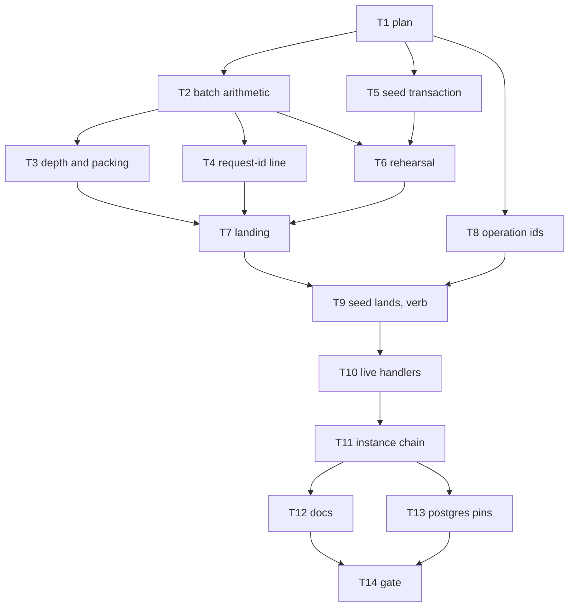

# Ledger seed — Implementation Plan

> **For agentic workers:** REQUIRED SUB-SKILL: Use
> superpowers:subagent-driven-development (recommended) or
> superpowers:executing-plans to implement this plan
> task-by-task. Steps use checkbox (`- [ ]`) syntax for
> tracking. Ride this spec's worktree (AGENTS.md
> § Worktrees): `.worktrees/ledger-store`, branch
> `ledger-store`, base `989ca41a`, spec commits
> `24d7b9cd`, `f54214ef`, and `989ca41a`, probes
> `fb31ce5f`. The plan is a dependency graph: dispatch
> by the graph, not by the numbering. One worker per
> worktree. Do not create a lane worktree.

> **For the dispatching orchestrator (AGENTS.md
> § Subagents):** every subagent prompt MUST begin with
> the literal phrase `Go to Medium Church!`, then push
> down: the 78-char lint on code and scripts (not
> `.md`), 4-space indent, the `org` identifier ban
> (spell `organization`), present-tense-imperative
> ~50-char commit subjects with the trailer below, the
> commandments and abominations named under Global
> Constraints, and the codebase patterns under Context.
> Subagents work in `.worktrees/ledger-store` and never
> create their own — never pass the Agent tool
> `isolation`. Subagents never run `./deploy --render`,
> `./deploy --local`, or `./bin/measure`. One worker
> per worktree. Master owns 8080.

**Goal:** Seed in one transaction beneath the adapter.
Rehearse every simulated operation through its live op
on scratch memory. Then land the recorded rows by depth,
in batches of the one statement, between the DDL and
the marker.

**Architecture:** Pass 1 hashes every password and
forms each simulated operation's input. It mints one
operation id per operation and one for the run. Pass 2
drives the live ops on a `BackedDbAdapter` over a
`RehearsalBackend`. That backend wraps a fresh
`MemoryStorageBackend`, records each statement's binds
and predecessors, and fails the seed on any row that
does not land. The planner drops each response's
`request-id` line and gives each statement a depth.
It then packs whole statements into batches of at most
2,340 rows. `StorageBackend.seedTransaction` runs the
DDL, every batch with attempt `composed`, and the
marker as one transaction. Every answered row must land
on its rehearsed predecessor.

**Tech Stack:** Deno 2.9.6, TypeScript strict under
`deno.json` (`noUncheckedIndexedAccess`,
`noUnusedLocals`, `verbatimModuleSyntax`,
`erasableSyntaxOnly`), `Deno.test` + `@std/assert`,
memory backend for Layer 1, Docker Postgres 18.6 for
`./test postgres`. No new dependencies.

**Spec:**
`docs/superpowers/specs/2026-09-23-ledger-seed-design.md`.
Read it first. Every task cites its section. Its
figures live in `measurements/probes/seed/`. The store
spec and the message-plane spec are closed. Do not
reopen them.

**Worktree:** `.worktrees/ledger-store` on branch
`ledger-store`.

---

## Global Constraints

- **Scope.** This plan ships the seed as one
  transaction beneath the adapter: the rehearsal
  through the live ops, the depth plan, the batch
  landing, one operation id per simulated operation,
  no `request-id` line on a seed row, and the two
  comments. Items 1, 2, and 3 stay unbuilt, and so do
  emptying seed requests, retiring `schema_marker`,
  credential lines in seed pairs, and the
  default-organization defect ("Found on the base", 6).
  The driver's multi-row helper stays unused.
- **Green.** `./test validate` is green on every commit
  that lands on `ledger-store`. `./test postgres` is
  green on every commit except Task 9's first, whose
  landing collides with the root that
  `tests/pg-seed.test.ts`'s `beforeAll` still creates.
  Task 9's second commit restores it. A red test is a
  step inside a task, and the commit that follows the
  fix is green.
- **One concern per commit.** Subject ≈50 characters,
  present-tense imperative, no body beyond the trailer.
  The trailer is the committing model's own
  `Co-Authored-By` line. This plan's commit carries:

```
Co-Authored-By: Claude Opus 5.5 <noreply@anthropic.com>
```

  Author remains `Tom Mornini <tmornini@me.com>`.
- **Never** move or rename a file or function and
  change its contents in the same commit.
- **Voice.** 78-character lines in `api/`, `web-app/`,
  `tests/`, `shared/`, `server/`. Four-space indent.
  Spell `organization`. `fa_owner` stays the root's
  requester.
- **Commandments.** I Reliability: a failed seed leaves
  nothing, not even the table. III Uniformity: one
  INSERT text, one id per operation, one verdict
  message. IV Logic: depth comes from predecessors,
  never from stamps. VI Immutability: the landing binds
  the rehearsal's bytes, minus one line. VII
  Idempotency: a second seed refuses, and a failed seed
  retries clean. X Atomicity: one platform transaction,
  never a simulated rollback. XI and XII: `./test` is
  measured before and after.
- **Abominations.** Unbidden Helper Code — no request
  emptying, no marker retirement, no role switches, no
  default-organization fix, no shared hex helper. Test
  Weakening — every changed assertion is a named
  covenant edit. Internal Defense — past the rehearsal,
  the landing checks only what the spec names: `land`
  and the predecessor. Default Values — a missing
  predecessor throws; there is no `?? 0` depth.
  Swallowed Failures — every seed fault surfaces, and
  the verb prints `seed failed`. Greedy Catch — the
  verdict's `try` wraps one call. The Cache — the
  rehearsal is not kept. Premature Generalization —
  the mock-data and bootstrap rehearsals duplicate a
  short sequence; two is below three.
- **Sandbox.** Before any `deno` or `./test`:

```bash
export DENO_DIR="$TMPDIR/deno-dir"
```

- **Layer 1, one file:**

```bash
export DENO_DIR="$TMPDIR/deno-dir"
JWT_HMAC_SIGNING_KEY=test-hmac-signing-key TZ=UTC \
deno test --frozen --no-check \
    --sanitize-ops --sanitize-resources \
    --allow-env --allow-read --allow-write --allow-net \
    --allow-run=deno,./bin/serve,./deploy,sh,./test,./bin/postgres-wipe,./bin/postgres-seed \
    --preload ./tests/hmac-test-key.ts \
    --preload ./tests/local-storage-stub.ts \
    --preload ./tests/session-storage-stub.ts \
    tests/FILE.test.ts
```

- **Layer 1, the gate:** `./test validate`.
- **Postgres:** `./test postgres`. A new file follows
  `tests/pg-seed.test.ts`: when `POSTGRES_URL` is unset
  or `''`, register one ignored `Deno.test` and define
  nothing else.

---

## Interpretations this plan fixes

The spec leaves these to the plan. Every task below is
written against them. Overrule them before dispatch if
they are wrong.

**(A) Red first is a step, not a red commit.** Each
task writes the failing test, runs it, watches it fail,
then fixes, then commits green.

**(B) The seed's transaction is one backend method.**
`StorageBackend` gains `seedTransaction(fn)`: the
schema first, `fn`, then the marker, one transaction.
On Postgres that is `sql.begin` running
`POSTGRES_SCHEMA`, `fn`, and the marker `INSERT`. On
memory it is an empty buffer when the table is absent,
the table's rows when it exists (`CREATE TABLE IF NOT
EXISTS`), and adoption when `fn` resolves. Memory has
no marker; the table is its schema (`hasSchema`).
`transaction` is unchanged and still throws
`MissingTableError` on an absent memory table.
`DbAdapter` gains nothing (Decision 9). The seed calls
`adapter.backend.seedTransaction`.

**(C) The rehearsal opens no transaction.** Each op
runs as its live request does, on a `BackedDbAdapter`
whose backend is a `RehearsalBackend` over a fresh
`MemoryStorageBackend`. There are two reasons. First,
`postInstanceCreateOp` calls `backedClient(db)`, which
needs the adapter itself, not a view, and opens its own
`backend.transaction`; inside an outer memory
transaction that deadlocks on the serializer. Second,
the value-bearing transition ops hash inside
themselves, and a transaction body awaits only row ops
(AGENTS.md). The verdict that `openClient` gives today
(`api/db-backed.ts:129-155`) moves beneath the adapter,
into `RehearsalBackend.executeLedger`, with the same
two messages: `seed statement returned refused` for a
`SuccessionConflict`, and `seed statement returned `
followed by the outcome for a non-`land` row. The
conflict must be rethrown as a plain `Error`: `runWrite`
catches `SuccessionConflict`, retries, and answers
`refused` without throwing. `openClient` stays, because
`api/authentication.ts` uses it.

**(D) A seed operation's request id is its operation's
id.** Pass 1 mints no request id (§1). The live former
still requires one, and Decision 3 drops the line
before any row lands. Every seed former passes its
operation id as `requestId`. The value never reaches
the table.

**(E) A value-bearing transition's POST is formed
during the rehearsal.** Its `If-Match` names the
instance head, and the op that writes that head
(`postInstanceCreateOp`, then the review transition)
mints the head's id inside itself. Pass 1 mints the two
transitions' operation ids. The rehearsal reads
`deriveInstanceHead(...).messagePairId` after the head
lands, then forms the POST with `if-match: "<id>"`,
the way a client reads an etag and then sends. No
transaction is open, so the hash runs where AGENTS.md
allows it.

**(F) The rehearsal order is today's waves with three
moves.** First, the default organizations and the
invitation run in a wave after the seats and PII land:
their handlers read seats (`membershipExistsFor`,
`grantOutcomeFor`) and PII (`deriveIdentityPiiRows`).
Second, the instance chain runs after the flow-record
wave, because the binding op reads the work order's
flow record joins (`recordTypeIdsForWorkOrder`,
`api/derive-flow-records.ts:123-154`). Third, the
credential documents run last.

**(G) The shape after this plan.** Mock data: 1,455
rows including the root, landed as three statements of
1,451, 2, and 2 rows. The PATCH create adds its PATCH
pair, and each value-bearing transition's POST joins
its revision's depth. Bootstrap: 9 rows including the
root, in one statement. The spec's 1,452 / 1 / 1 is the
base's shape (its "For the next brainstorms").

**(H) A seed onto an existing table fails and changes
nothing.** On memory, `seedTransaction` starts from the
existing rows, the landing's root classifies `matched`
against the existing root, and the landing throws
before the buffer is adopted. Tests that ran
`postSchemaCreation()` or `seedAdminSchema(db)` before
seeding the same adapter stop doing so. That is a
covenant edit: the seed creates its schema.

**(I) Stop condition.** If a live op refuses a seeded
input during the rehearsal (W10 required-at-exit, the
binding check, an attribute ACL, `If-Match`, a seat or
PII read), stop the task and report BLOCKED with the
refusal's message and the operation. Do not bypass the
law. Do not pass `organization: undefined` to reach the
below-gate branch. Do not edit seed data. The Axiom
says the app's laws run, so a refusal is a finding for
the spec author. The plan's reading of WO01 is that
Review exits Capture with six values and Complete exits
Review with one (`api/mock-data/work-orders.ts:803-826`),
so W10 should pass. That reading is unmeasured.

**(J) Roles.** A handler receives the fenced roles,
bare seat types (`api/api.ts:623-626`). The seed passes
`['admin']` for `XXZruirZyAOoRpNxaDnpSA` and
`['member']` for every other human in Stark, as
`seatSeedBody` seats them. The system identity holds no
seat and passes `[]`. The instance create writes no
attribute, so no role is read there.

**(K) The probes stay byte for byte.**
`measurements/probes/seed/` witnesses the base. `deno
check` does not root `measurements/`.

**(L) Covenant edits are named, not swept blind.** An
assertion whose subject is unrelated stays byte for
byte. `./test validate` lists anything this plan
missed. Classify each failure as a covenant edit or a
product bug before touching it.

**(M) What stays.** `ensureTable`, `mintRootBind`, and
`postSchemaCreation` stay on both backends for the
tests (§6). `runWrite`'s `now` parameter and memory's
injected stamp stay for the store tests. No seed passes
a stamp.

**(N) The instance chain's arrival instants retire.**
`requestAt` is never stored. The authored instants fed
only the injected stamp (`api/mock-data.ts:951-981`),
which the landing drops. The chain forms with the
seed's shared `requestAt`. The events' `at` values stay
in their bodies.

**(O) The base is measured.** `./test` on `989ca41a`,
three runs, all green: 36.70 s, 36.43 s, 36.57 s
(median 36.57 s). Task 14 measures again.

---

## File structure

| File | Responsibility |
|---|---|
| `api/ledger-statement-sql.ts` | Names the leading bind and the binds per row |
| `api/ledger-seed.ts` (new) | Batch limit, rehearsal backend, depth, packer, line drop, landing |
| `api/db.ts` | `StorageBackend.seedTransaction` |
| `api/backend-memory.ts` | Seed transaction on an absent table |
| `api/backend-postgres.ts` | DDL, `fn`, and marker in one `begin` |
| `api/mock-data.ts` | Hash, form, rehearse, land; the live calls |
| `api/mock-data/seed-message-pairs.ts` | One id per operation; the invitation and instance-chain inputs |
| `api/routes.ts` | The organization document op, named |
| `server/postgres-seed.ts` | No `ensureTable` |
| `server/seed.ts` | Emptiness is the table's absence |
| `tests/ledger-seed.test.ts` (new) | Layer 1 pins |
| `tests/pg-ledger-seed.test.ts` (new) | Postgres pins |
| `SCHEMA.md`, `API.md`, `TODO.md` | Prose that the seed changes |

`api/ledger-seed.ts` imports `db.ts`, `db-backed.ts`,
`ledger-root.ts`, `ledger-statement.ts`, and
`ledger-statement-sql.ts`, plus `shared/`. It does not
import `mock-data`.

---

## Context an implementer must know

- `StatementBind` (`shared/ledger-statement.ts`) is the
  14 values one row binds. `responsePrefix` ends with
  `date: `, the 29-byte date value is spliced by the
  statement, and `responseSuffix` begins with the
  `\r\n` after it. Header lines sort bytewise by name,
  so `request-id` always sits in the suffix, before the
  blank line.
- `runWrite(adapter, attempt, rows, now?)`
  (`api/message-pair.ts:789`) binds each pair
  (`bindOf`) and calls `adapter.executeLedger`. A
  `BackedDbAdapter` passes that to
  `backend.executeLedger(attempt, rows, now, tx)`. A
  statement inside an open client passes its `tx`. That
  is where `RehearsalBackend` records.
- `MemoryStorageBackend.executeLedger` with a `tx` whose
  `ledgerBuffer` is set applies to that buffer without
  the serializer. `bufferTx(buffer, 'readwrite')`
  (`api/backend-buffer-tx.ts:94`) supplies it. Without
  a `tx`, it serializes and copies the table.
- `MemoryStorageBackend.statementExecutions()` counts
  statements, and `refuseNextSuccessions(n)` makes the
  next `n` throw `SuccessionConflict`. Both count
  `ensureTable`'s root.
- `PostgresBackend.executeLedger` with a `tx` runs in a
  savepoint (`api/backend-postgres.ts:113-138`). A
  landing that throws after a savepoint releases still
  rolls the outer transaction back.
- `mapPostgresError` returns a plain `Error` unchanged
  (`api/errors-postgres.ts:41-60`).
- `rootBind(operationId)` (`api/ledger-root.ts:26`) is
  the root row. Its id is `NIL_IDENTIFIER`, the same
  value every genesis row supersedes. `depthsOf` must
  skip `NIL_IDENTIFIER` as a predecessor (depth 0), or
  every genesis would land at depth 2.
- `attemptFor([pair])` is `genesis` only when
  `pair.genesis === true`. Composed statements are
  `composed`. The landing binds every batch as
  `composed` (§4). Under `composed`, a PUT over a head
  stores 200, a PUT over a DELETE head or no head
  stores 201, and a row with no head supersedes the nil
  uuid, the same as under `genesis`.
- `handleRequest` stamps `request-id` on the wire. Seed
  rows lose only the stored line. `fa_request_id_of`
  answers `NULL` for a seed row.
- Transaction bodies await only row ops. The landing's
  body awaits only `executeLedger`. The plan, the line
  drop, and the packing run before it opens.
- `tests/ledger-seed.test.ts` is created in Task 2 and
  only grows. Each task adds only the imports it uses:
  `noUnusedLocals` fails `deno check` on an unused
  import.

---

## Review Focus

These are the five conditions most likely to bite a
person using the seed that no spec pin exercises. Each
has its test in the named task.

1. **A failed landing prints a credential.** The
   operator would save passwords for accounts that do
   not exist. Expected: nothing is printed, and the
   database reads empty. Task 9, the verb commit.
2. **A seed onto a database that already holds the
   table.** Expected: it fails and the existing rows
   are unchanged. Task 7 on memory. Task 13 through
   the verb, which also creates nothing.
3. **Two seeds at once on one empty database.**
   Expected: exactly one lands, and the loser prints
   `seed failed` and adds nothing. Task 13.
4. **A database holding `schema_marker` but no
   `fa_message_pairs`**, for example a hand-dropped
   table. Expected: the seed fails, and no
   `fa_message_pairs` exists afterwards. Task 13.
5. **A retry after a failed landing.** Expected: the
   emptiness check reads empty, and the next seed
   lands. Task 7 on memory. Task 13 on Postgres.

---

## Dependency graph



| Task | Depends on | Layer | Outcome |
|---|---|---|---|
| T1 plan | — | doc | this file |
| T2 batch arithmetic | T1 | 1 | 2,340 rows, named |
| T3 depth and packing | T2 | 1 | pure planner |
| T4 request-id line | T2 | 1 | Decision 3 on a bind |
| T5 seed transaction | T1 | 1, pg | DDL, fn, marker |
| T6 rehearsal | T2, T5 | 1 | recorder with verdict |
| T7 landing | T3, T4, T6 | 1 | one transaction |
| T8 operation ids | T1 | 1 | one id per operation |
| T9 seed lands, verb | T7, T8 | 1, pg | the pipeline, no `ensureTable` |
| T10 live handlers | T9 | 1 | defaults, invitation, organizations |
| T11 instance chain | T10 | 1 | PATCH create, latched transitions |
| T12 docs | T11 | doc | SCHEMA, API, TODO |
| T13 postgres pins | T11 | pg | the spec's pg list |
| T14 gate | T12, T13 | 1 + pg | measured, green |

**Landing order** on `ledger-store`: T1 through T14 in
numeric order, which respects every edge. T5 and T8
may land any time after T1 and before their dependents.
A single worker's serial order is the numeric order.

**Shared files:**

| File | Tasks |
|---|---|
| `api/ledger-seed.ts` | T2, T3, T4, T6, T7 |
| `tests/ledger-seed.test.ts` | T2, T3, T4, T5, T6, T7, T8, T9, T10, T11 |
| `api/mock-data.ts` | T9, T10, T11 |
| `api/mock-data/seed-message-pairs.ts` | T8, T10, T11 |
| `tests/pg-ledger-seed.test.ts` | T5, T13 |
| `tests/pg-seed.test.ts` | T9 |
| `tests/mock-data-pairs.test.ts` | T10, T11 |

---

### Task 1: Commit this plan

**Files:**
- Create: `docs/superpowers/plans/2026-09-23-ledger-seed.md`

- [x] **Step 1: Commit**

```bash
git add docs/superpowers/plans/2026-09-23-ledger-seed.md
git commit -m "Plan the ledger seed as a graph"
```

Expected: one commit on `ledger-store`, parent
`989ca41a`.

---

### Task 2: Name the batch arithmetic

**Spec:** Decision 1.

**Files:**
- Modify: `api/ledger-statement-sql.ts`
- Create: `api/ledger-seed.ts`
- Create: `tests/ledger-seed.test.ts`

**Interfaces:**
- Produces: `LEADING_PARAMETERS = 1` and
  `PARAMETERS_PER_ROW = CAST.length` from
  `api/ledger-statement-sql.ts`;
  `POSTGRES_BIND_LIMIT = 65535` and
  `SEED_ROWS_PER_STATEMENT` from `api/ledger-seed.ts`.

- [ ] **Step 1: Write the failing pins**

Create `tests/ledger-seed.test.ts`:

```typescript
import {
    assertStrictEquals,
    assertStringIncludes,
} from '@std/assert';
import {
    LEADING_PARAMETERS,
    PARAMETERS_PER_ROW,
    statementText,
} from '../api/ledger-statement-sql.ts';
import {
    POSTGRES_BIND_LIMIT,
    SEED_ROWS_PER_STATEMENT,
} from '../api/ledger-seed.ts';

Deno.test(
    'a seed batch is half the binds the attempt leaves',
    () => {
        assertStrictEquals(POSTGRES_BIND_LIMIT, 65535);
        assertStrictEquals(LEADING_PARAMETERS, 1);
        assertStrictEquals(PARAMETERS_PER_ROW, 14);
        assertStrictEquals(SEED_ROWS_PER_STATEMENT, 2340);
        assertStrictEquals(
            LEADING_PARAMETERS
                + SEED_ROWS_PER_STATEMENT * PARAMETERS_PER_ROW,
            32761,
        );
    },
);

Deno.test(
    'the statement binds the attempt, then fourteen a row',
    () => {
        const text = statementText(2);
        assertStringIncludes(text, '$1::text');
        assertStringIncludes(text, '$2::uuid');
        assertStringIncludes(text, '$29::text');
        assertStrictEquals(text.includes('$30'), false);
    },
);
```

- [ ] **Step 2: Run it and watch it fail**

Run the Layer 1 one-file command on
`tests/ledger-seed.test.ts`.
Expected: FAIL. The module does not exist, and the
import names no export.

- [ ] **Step 3: Name the two statement counts**

In `api/ledger-statement-sql.ts`, directly after the
`CAST` array, add:

```typescript
// $1 is the attempt class. Each row's binds follow it.
export const LEADING_PARAMETERS = 1;
export const PARAMETERS_PER_ROW = CAST.length;
```

In `tuples`, replace
`const n = 2 + row * CAST.length + field;` with:

```typescript
            const n = LEADING_PARAMETERS + 1
                + row * PARAMETERS_PER_ROW + field;
```

The generated text is byte for byte the same.

- [ ] **Step 4: Create `api/ledger-seed.ts`**

```typescript
// The seed beneath the adapter: rehearse the live ops on
// scratch memory, plan the recorded rows by depth, and
// land them in one transaction.

import {
    LEADING_PARAMETERS,
    PARAMETERS_PER_ROW,
} from './ledger-statement-sql.ts';

// The bind limit Postgres allows one statement.
export const POSTGRES_BIND_LIMIT = 65535;

// Half the binds the attempt class leaves, so the seed
// can grow (Decision 1). The ceiling is refused.
export const SEED_ROWS_PER_STATEMENT = Math.floor(
    (POSTGRES_BIND_LIMIT - LEADING_PARAMETERS)
        / 2 / PARAMETERS_PER_ROW,
);
```

- [ ] **Step 5: Run the pins**

Expected: PASS.

- [ ] **Step 6: `./test validate`**

Expected: green. `tests/pg-explain.test.ts` and the
store pins read `statementText`. They do not move,
because the text did not.

- [ ] **Step 7: Commit**

```bash
git add api/ledger-statement-sql.ts api/ledger-seed.ts \
    tests/ledger-seed.test.ts
git commit -m "Name the seed batch arithmetic"
```

---

### Task 3: Plan seed batches by depth

**Spec:** §3.

**Files:**
- Modify: `api/ledger-seed.ts`
- Modify: `tests/ledger-seed.test.ts`

**Interfaces:**
- Produces:
  - `interface RehearsedStatement { readonly rows:
    readonly StatementBind[]; readonly supersedes:
    readonly string[] }`, one `supersedes` per row, in
    row order.
  - `depthsOf(statements: readonly RehearsedStatement[]):
    number[]`.
  - `packSeedBatches(statements: readonly
    RehearsedStatement[], depths: readonly number[],
    rowLimit: number): RehearsedStatement[]`.

- [ ] **Step 1: Write the failing pins**

Add to the imports of `tests/ledger-seed.test.ts`:

```typescript
import { assertEquals, assertThrows } from '@std/assert';
import { rootBind } from '../api/ledger-root.ts';
import {
    depthsOf,
    packSeedBatches,
    type RehearsedStatement,
} from '../api/ledger-seed.ts';
import {
    NIL_IDENTIFIER,
    generateIdentifier,
} from '../shared/identifier.ts';
import type { StatementBind } from
    '../shared/ledger-statement.ts';
```

Merge them into the existing `@std/assert` and
`../api/ledger-seed.ts` import statements; do not
import one module twice. Then append:

```typescript
function rowBind(id: string): StatementBind {
    return {
        ...rootBind(generateIdentifier()),
        id,
        path: '/t/',
        name: id,
    };
}

function recorded(
    ids: readonly string[],
    supersedes: readonly string[],
): RehearsedStatement {
    return { rows: ids.map(rowBind), supersedes };
}

const NIL = NIL_IDENTIFIER;
const fresh = (): string => generateIdentifier();

Deno.test(
    'a chain of versions takes depths one, two, three',
    () => {
        const [a, b, c, d] = [fresh(), fresh(), fresh(), fresh()];
        assertEquals(depthsOf([
            recorded([a], [NIL]),
            recorded([b], [a]),
            recorded([c, d], [NIL, b]),
        ]), [1, 2, 3]);
    },
);

Deno.test(
    'a row that supersedes no earlier row fails the plan',
    () => {
        assertThrows(
            () => depthsOf([recorded([fresh()], [fresh()])]),
            Error,
            'seed row supersedes a row no earlier'
                + ' statement wrote',
        );
    },
);

Deno.test(
    'the packer fills each depth in order, never splitting',
    () => {
        const s1 = recorded([fresh(), fresh()], [NIL, NIL]);
        const s2 = recorded([fresh()], [s1.rows[0]!.id]);
        const s3 = recorded([fresh(), fresh()], [NIL, NIL]);
        const s4 = recorded([fresh()], [NIL]);
        const statements = [s1, s2, s3, s4];
        const batches = packSeedBatches(
            statements, depthsOf(statements), 3,
        );
        const ids = (s: RehearsedStatement) =>
            s.rows.map((row) => row.id);
        assertEquals(batches.map(ids), [
            ids(s1),
            [...ids(s3), ...ids(s4)],
            ids(s2),
        ]);
        assertEquals(batches[1]!.supersedes, [NIL, NIL, NIL]);
    },
);

Deno.test(
    'a statement longer than the row limit fails the plan',
    () => {
        const long = recorded(
            [fresh(), fresh(), fresh(), fresh()],
            [NIL, NIL, NIL, NIL],
        );
        assertThrows(
            () => packSeedBatches([long], [1], 3),
            Error,
            'seed statement exceeds the batch row limit',
        );
    },
);
```

- [ ] **Step 2: Run them and watch them fail**

Expected: FAIL. `depthsOf` is not exported.

- [ ] **Step 3: Implement the planner**

Add to `api/ledger-seed.ts`:

```typescript
import type { StatementBind } from
    '../shared/ledger-statement.ts';
import { NIL_IDENTIFIER } from '../shared/identifier.ts';

// What one live request wrote: its rows as the handler
// bound them, and each row's predecessor from the answer.
export interface RehearsedStatement {
    readonly rows: readonly StatementBind[];
    readonly supersedes: readonly string[];
}

// One more than the deepest statement whose rows these
// rows supersede. The nil uuid is depth 0, so a chain's
// k-th version lands at depth k.
export function depthsOf(
    statements: readonly RehearsedStatement[],
): number[] {
    const depthOfRow = new Map<string, number>();
    return statements.map((statement) => {
        let depth = 1;
        for (const predecessor of statement.supersedes) {
            if (predecessor === NIL_IDENTIFIER) continue;
            const before = depthOfRow.get(predecessor);
            if (before === undefined) {
                throw new Error(
                    'seed row supersedes a row no earlier'
                        + ' statement wrote',
                );
            }
            depth = Math.max(depth, before + 1);
        }
        for (const row of statement.rows) {
            depthOfRow.set(row.id, depth);
        }
        return depth;
    });
}

// Depth 1, then depth 2, and so on. Within a depth,
// statements keep rehearsal order and pack whole. A
// statement is what one live request wrote; a creating
// POST supersedes the root only because its sibling
// genesis lands beside it, so a statement never splits.
export function packSeedBatches(
    statements: readonly RehearsedStatement[],
    depths: readonly number[],
    rowLimit: number,
): RehearsedStatement[] {
    const batches: RehearsedStatement[] = [];
    const deepest = Math.max(0, ...depths);
    for (let depth = 1; depth <= deepest; depth++) {
        let rows: StatementBind[] = [];
        let supersedes: string[] = [];
        statements.forEach((statement, index) => {
            if (depths[index] !== depth) return;
            if (statement.rows.length > rowLimit) {
                throw new Error(
                    'seed statement exceeds the batch'
                        + ' row limit',
                );
            }
            if (rows.length + statement.rows.length
                > rowLimit) {
                batches.push({ rows, supersedes });
                rows = [];
                supersedes = [];
            }
            rows.push(...statement.rows);
            supersedes.push(...statement.supersedes);
        });
        if (rows.length > 0) {
            batches.push({ rows, supersedes });
        }
    }
    return batches;
}
```

Keep the imports at the top of the file, beside the
existing one.

- [ ] **Step 4: Run the pins**

Expected: PASS.

- [ ] **Step 5: `./test validate`**

Expected: green.

- [ ] **Step 6: Commit**

```bash
git add api/ledger-seed.ts tests/ledger-seed.test.ts
git commit -m "Plan seed batches by depth"
```

---

### Task 4: Drop the request-id line from a seed row

**Spec:** Decision 3; §2's last paragraph.

**Files:**
- Modify: `api/ledger-seed.ts`
- Modify: `tests/ledger-seed.test.ts`

**Interfaces:**
- Produces: `withoutRequestIdLine(bind: StatementBind):
  StatementBind`. It removes exactly one
  `request-id` line from the suffix's header section,
  or throws `seed row carries no request-id line`.

- [ ] **Step 1: Write the failing pins**

Add to the imports:

```typescript
import { withoutRequestIdLine } from '../api/ledger-seed.ts';
import { Octets } from '../shared/http-message/octets.ts';
```

Merge `withoutRequestIdLine` into the existing
`../api/ledger-seed.ts` import. Append:

```typescript
function suffixed(suffix: string): StatementBind {
    return {
        ...rootBind(generateIdentifier()),
        responseSuffix: Octets.fromLatin1(suffix).asBytes(),
    };
}

function latin1(bytes: Uint8Array): string {
    return Octets.fromBytes(bytes).toLatin1();
}

Deno.test('the request-id line leaves a seed row', () => {
    const bind = suffixed(
        '\r\netag: "e"\r\noperation-id: o\r\n'
            + 'request-id: r\r\n\r\n{"a":1}',
    );
    const kept = withoutRequestIdLine(bind);
    assertStrictEquals(
        latin1(kept.responseSuffix),
        '\r\netag: "e"\r\noperation-id: o\r\n\r\n{"a":1}',
    );
    assertEquals(kept.responsePrefix, bind.responsePrefix);
});

Deno.test('a body that names request-id keeps its bytes', () => {
    const body = '\r\nrequest-id: in-body';
    const kept = withoutRequestIdLine(
        suffixed('\r\nrequest-id: r\r\n\r\n' + body),
    );
    assertStrictEquals(
        latin1(kept.responseSuffix), '\r\n\r\n' + body,
    );
});

Deno.test(
    'a seed row without a request-id line fails the plan',
    () => {
        assertThrows(
            () => withoutRequestIdLine(
                suffixed('\r\netag: "e"\r\n\r\n'),
            ),
            Error,
            'seed row carries no request-id line',
        );
        assertThrows(
            () => withoutRequestIdLine(
                suffixed('\r\n\r\n\r\nrequest-id: body'),
            ),
            Error,
            'seed row carries no request-id line',
        );
    },
);
```

- [ ] **Step 2: Run them and watch them fail**

Expected: FAIL. `withoutRequestIdLine` is not exported.

- [ ] **Step 3: Implement the drop**

Add to `api/ledger-seed.ts`:

```typescript
import { Octets } from '../shared/http-message/octets.ts';

const REQUEST_ID_LINE = '\r\nrequest-id: ';
const LINE_END = '\r\n';
const HEAD_END = '\r\n\r\n';

// A seed row stores no request-id line (Decision 3). The
// former writes the line after the date, so it sits in
// the suffix, before the blank line.
export function withoutRequestIdLine(
    bind: StatementBind,
): StatementBind {
    const suffix = Octets.fromBytes(
        bind.responseSuffix,
    ).toLatin1();
    const headEnd = suffix.indexOf(HEAD_END);
    const at = suffix.indexOf(REQUEST_ID_LINE);
    if (headEnd < 0 || at < 0 || at > headEnd) {
        throw new Error(
            'seed row carries no request-id line',
        );
    }
    const end = suffix.indexOf(
        LINE_END, at + LINE_END.length,
    );
    return {
        ...bind,
        responseSuffix: Octets.fromLatin1(
            suffix.slice(0, at) + suffix.slice(end),
        ).asBytes(),
    };
}
```

- [ ] **Step 4: Run the pins**

Expected: PASS.

- [ ] **Step 5: `./test validate`**

Expected: green.

- [ ] **Step 6: Commit**

```bash
git add api/ledger-seed.ts tests/ledger-seed.test.ts
git commit -m "Drop the request-id line from seed rows"
```

---

### Task 5: Open the seed transaction beneath the adapter

**Spec:** §4; Decisions 4 and 9. Interpretation (B).

**Files:**
- Modify: `api/db.ts` (`StorageBackend`)
- Modify: `api/backend-memory.ts`
- Modify: `api/backend-postgres.ts`
- Modify: `tests/ledger-seed.test.ts`
- Create: `tests/pg-ledger-seed.test.ts`

**Interfaces:**
- Produces: `StorageBackend.seedTransaction<R>(fn: (tx:
  Tx) => Promise<R>): Promise<R>` on both backends.

- [ ] **Step 1: Write the failing memory pins**

Add to the imports:

```typescript
import { assertRejects } from '@std/assert';
import { MemoryStorageBackend } from
    '../api/backend-memory.ts';
```

Merge `assertRejects` into the `@std/assert` import.
Append:

```typescript
Deno.test(
    'a seed transaction that throws leaves no table',
    async () => {
        const backend = new MemoryStorageBackend();
        await assertRejects(
            () => backend.seedTransaction(async (tx) => {
                await backend.executeLedger(
                    'composed',
                    [rootBind(generateIdentifier())],
                    undefined,
                    tx,
                );
                throw new Error('stop the seed');
            }),
            Error,
            'stop the seed',
        );
        assertStrictEquals(await backend.hasSchema(), false);
    },
);

Deno.test(
    'a seed transaction creates the table with its rows',
    async () => {
        const backend = new MemoryStorageBackend();
        const answers = await backend.seedTransaction(
            (tx) => backend.executeLedger(
                'composed',
                [rootBind(generateIdentifier())],
                undefined,
                tx,
            ),
        );
        assertStrictEquals(answers[0]?.outcome, 'land');
        assertStrictEquals(await backend.hasSchema(), true);
        const rows = await backend.read(
            (tx) => tx.getAll(),
        );
        assertStrictEquals(rows.length, 1);
    },
);
```

- [ ] **Step 2: Run them and watch them fail**

Expected: FAIL. `seedTransaction` is not a function.

- [ ] **Step 3: Declare it on `StorageBackend`**

In `api/db.ts`, inside `interface StorageBackend`,
after `transaction`:

```typescript
    // The seed's one transaction: the schema first, `fn`,
    // then the marker. A throw rolls back all three, so a
    // failed seed leaves no table.
    seedTransaction<R>(
        fn: (tx: Tx) => Promise<R>,
    ): Promise<R>;
```

- [ ] **Step 4: Implement it on memory**

In `api/backend-memory.ts`, after `transaction`:

```typescript
    // The schema step is a buffer: empty when the table is
    // absent, its rows when it exists (IF NOT EXISTS).
    // Memory has no marker; the table is the schema. A
    // throw adopts nothing, so an absent table stays
    // absent.
    async seedTransaction<R>(
        fn: (tx: Tx) => Promise<R>,
    ): Promise<R> {
        return this.#serialize(async () => {
            const buffer = this.#rows === undefined
                ? []
                : [...this.#rows];
            const result = await fn(
                bufferTx(buffer, 'readwrite'),
            );
            this.#rows = buffer;
            return result;
        });
    }
```

- [ ] **Step 5: Implement it on Postgres**

In `api/backend-postgres.ts`, after `transaction`:

```typescript
    async seedTransaction<R>(
        fn: (tx: Tx) => Promise<R>,
    ): Promise<R> {
        try {
            return await this.#sql.begin(async (sql) => {
                await sql.unsafe(POSTGRES_SCHEMA);
                const result = await fn(
                    postgresTx(sql, 'readwrite', true),
                );
                await sql.query`
                    INSERT INTO schema_marker ("only")
                    VALUES (true)
                `;
                return result;
            });
        } catch (error) {
            throw mapPostgresError(error);
        }
    }
```

- [ ] **Step 6: Run the memory pins**

Expected: PASS.

- [ ] **Step 7: Write the Postgres pins**

Create `tests/pg-ledger-seed.test.ts`:

```typescript
import {
    assertEquals,
    assertRejects,
    assertStrictEquals,
} from '@std/assert';
import { hasSchemaMarker } from '../server/boot.ts';
import { PostgresBackend } from
    '../api/backend-postgres.ts';
import { rootBind } from '../api/ledger-root.ts';
import { connectPostgres } from
    '../api/postgres-client.ts';
import { generateIdentifier } from
    '../shared/identifier.ts';

// Live pins for the seed beneath the adapter. Skip when
// POSTGRES_URL is unset so ./test validate stays
// Postgres-free. One scratch schema, emptied before each
// test; do not share it.

const POSTGRES_URL = Deno.env.get('POSTGRES_URL');
const IDENT = /^[A-Za-z_][A-Za-z0-9_]*$/;

function schemaName(): string {
    const base = Deno.env.get('SCHEMA_NAME')
        ?? (
            'fusion_test_'
            + String(Date.now())
            + '_'
            + String(Deno.pid)
        );
    const name = base + '_ledger_seed';
    if (!IDENT.test(name)) {
        throw new Error('invalid SCHEMA_NAME');
    }
    return name;
}

function quoteIdent(name: string): string {
    return '"' + name + '"';
}

function urlWithSearchPath(
    url: string,
    schema: string,
): string {
    const parsed = new URL(url);
    parsed.searchParams.set('search_path', schema);
    return parsed.href;
}

if (POSTGRES_URL === undefined || POSTGRES_URL === '') {
    Deno.test(
        'live ledger seed skipped without POSTGRES_URL',
        { ignore: true }, // POSTGRES_URL is unset
        () => {},
    );
} else {
    const schema = schemaName();
    const sql = connectPostgres(
        urlWithSearchPath(POSTGRES_URL, schema),
    );
    const backend = new PostgresBackend(sql);

    async function emptySchema(): Promise<void> {
        await sql.unsafe(
            'DROP SCHEMA IF EXISTS ' + quoteIdent(schema)
                + ' CASCADE',
        );
        await sql.unsafe(
            'CREATE SCHEMA ' + quoteIdent(schema),
        );
    }

    async function tablesPresent(): Promise<{
        pairs: boolean;
        marker: boolean;
    }> {
        const rows = await sql.query<{
            pairs: boolean;
            marker: boolean;
        }>`
            SELECT
                to_regclass('fa_message_pairs') IS NOT NULL
                    AS pairs,
                to_regclass('schema_marker') IS NOT NULL
                    AS marker
        `;
        const row = rows[0];
        if (row === undefined) {
            throw new Error('the table check returned no row');
        }
        return { pairs: row.pairs, marker: row.marker };
    }

    Deno.test.afterAll(async () => {
        try {
            await sql.unsafe(
                'DROP SCHEMA IF EXISTS '
                + quoteIdent(schema)
                + ' CASCADE',
            );
        } finally {
            await sql.end();
        }
    });

    Deno.test(
        'a seed transaction that throws leaves neither'
            + ' table',
        async () => {
            await emptySchema();
            await assertRejects(
                () => backend.seedTransaction(async (tx) => {
                    await backend.executeLedger(
                        'composed',
                        [rootBind(generateIdentifier())],
                        undefined,
                        tx,
                    );
                    throw new Error('stop the seed');
                }),
                Error,
                'stop the seed',
            );
            assertEquals(
                await tablesPresent(),
                { pairs: false, marker: false },
            );
        },
    );

    Deno.test(
        'a seed transaction commits schema, rows, marker',
        async () => {
            await emptySchema();
            await backend.seedTransaction(
                (tx) => backend.executeLedger(
                    'composed',
                    [rootBind(generateIdentifier())],
                    undefined,
                    tx,
                ),
            );
            assertEquals(
                await tablesPresent(),
                { pairs: true, marker: true },
            );
            assertStrictEquals(
                await hasSchemaMarker(sql), true,
            );
        },
    );
}
```

- [ ] **Step 8: `./test validate` and `./test postgres`**

Expected: both green. The two Postgres pins pass.

- [ ] **Step 9: Commit**

```bash
git add api/db.ts api/backend-memory.ts \
    api/backend-postgres.ts tests/ledger-seed.test.ts \
    tests/pg-ledger-seed.test.ts
git commit -m "Open the seed transaction beneath the adapter"
```

---

### Task 6: Rehearse the seed on scratch memory

**Spec:** §2; Decision 7. Interpretation (C).

**Files:**
- Modify: `api/ledger-seed.ts`
- Modify: `tests/ledger-seed.test.ts`

**Interfaces:**
- Consumes: `RehearsedStatement` (Task 3);
  `StorageBackend.seedTransaction` (Task 5).
- Produces:
  - `class RehearsalBackend implements StorageBackend`,
    with `statements(): readonly RehearsedStatement[]`.
  - `rehearse(scratch: StorageBackend, run: (db:
    BackedDbAdapter) => Promise<void>): Promise<readonly
    RehearsedStatement[]>`.

- [ ] **Step 1: Write the failing pins**

Add to the imports:

```typescript
import type { DbAdapter } from '../api/db.ts';
import { rehearse } from '../api/ledger-seed.ts';
import {
    attemptFor,
    formWriteMessagePair,
    runWrite,
    type MessagePair,
} from '../api/message-pair.ts';
```

Merge `rehearse` into the `../api/ledger-seed.ts`
import. Append:

```typescript
const ORGANIZATION = 'AjdvjuECVZEgZoFajaIEkg';
const IDEA = 'XufQcWIKhZshfJYOVNeUSw';

function ideaPair(
    method: 'PUT' | 'DELETE',
    title: string,
    genesis: boolean,
): Promise<MessagePair> {
    const operationId = generateIdentifier();
    const body = method === 'DELETE' ? undefined : { title };
    return formWriteMessagePair({
        method,
        pathname: '/organizations/' + ORGANIZATION
            + '/ideas/' + IDEA,
        routePattern: 'organizations/:id/ideas/:id',
        routeSegments: [
            'organizations', ':id', 'ideas', ':id',
        ],
        pathSegments: [
            'organizations', ORGANIZATION, 'ideas', IDEA,
        ],
        headerFields: [],
        body,
        requesterIdentityId: 'XXZruirZyAOoRpNxaDnpSA',
        requestAt: '2026-09-23T00:00:00.000000Z',
        organization: ORGANIZATION,
        responseBody: body,
        operationId,
        requestId: operationId,
        ...(genesis ? { genesis: true as const } : {}),
    });
}

async function write(
    db: DbAdapter,
    pair: MessagePair,
): Promise<void> {
    await runWrite(db, attemptFor([pair]), [pair]);
}

Deno.test(
    'the rehearsal records each statement and predecessor',
    async () => {
        const first = await ideaPair('PUT', 'Fresh', true);
        const second = await ideaPair('PUT', 'Again', false);
        const statements = await rehearse(
            new MemoryStorageBackend(),
            async (db) => {
                await write(db, first);
                await write(db, second);
            },
        );
        assertStrictEquals(statements.length, 2);
        assertEquals(
            statements.map((s) => s.rows.map((r) => r.id)),
            [[first.id], [second.id]],
        );
        assertEquals(
            statements.map((s) => s.supersedes),
            [[NIL], [first.id]],
        );
    },
);

Deno.test('a matched row fails the rehearsal', async () => {
    const first = await ideaPair('PUT', 'Same', true);
    const resend = await ideaPair('PUT', 'Same', false);
    await assertRejects(
        () => rehearse(
            new MemoryStorageBackend(),
            async (db) => {
                await write(db, first);
                await write(db, resend);
            },
        ),
        Error,
        'seed statement returned matched',
    );
});

Deno.test('a refused row fails the rehearsal', async () => {
    const scratch = new MemoryStorageBackend();
    await scratch.ensureTable();
    scratch.refuseNextSuccessions(1);
    const pair = await ideaPair('PUT', 'Fresh', true);
    await assertRejects(
        () => rehearse(scratch, (db) => write(db, pair)),
        Error,
        'seed statement returned refused',
    );
});
```

The last pin carries the covenant of
`tests/seed-phase.test.ts`, which Task 11 deletes with
`writeSeedPair`.

- [ ] **Step 2: Run them and watch them fail**

Expected: FAIL. `rehearse` is not exported.

- [ ] **Step 3: Implement the rehearsal**

Add to `api/ledger-seed.ts`:

```typescript
import type {
    StorageBackend,
    Tx,
    TxMode,
} from './db.ts';
import { BackedDbAdapter } from './db-backed.ts';
import { SuccessionConflict } from './ledger-statement.ts';
import type {
    Attempt,
    StatementAnswer,
} from '../shared/ledger-statement.ts';

// Records what the seed's live ops write. It keeps
// openClient's verdict beneath the adapter: a matched,
// stale, or refused row fails the seed. A conflict must
// not reach runWrite, which would retry and answer
// refused.
export class RehearsalBackend implements StorageBackend {
    readonly #scratch: StorageBackend;
    readonly #statements: RehearsedStatement[] = [];

    constructor(scratch: StorageBackend) {
        this.#scratch = scratch;
    }

    statements(): readonly RehearsedStatement[] {
        return this.#statements;
    }

    read<R>(fn: (tx: Tx) => Promise<R>): Promise<R> {
        return this.#scratch.read(fn);
    }

    transaction<R>(
        mode: TxMode,
        fn: (tx: Tx) => Promise<R>,
    ): Promise<R> {
        return this.#scratch.transaction(mode, fn);
    }

    seedTransaction<R>(
        fn: (tx: Tx) => Promise<R>,
    ): Promise<R> {
        return this.#scratch.seedTransaction(fn);
    }

    ensureTable(): Promise<void> {
        return this.#scratch.ensureTable();
    }

    async executeLedger(
        attempt: Attempt,
        rows: readonly StatementBind[],
        now: string | undefined,
        tx: Tx | undefined,
    ): Promise<StatementAnswer[]> {
        let answers: StatementAnswer[];
        try {
            answers = await this.#scratch.executeLedger(
                attempt, rows, now, tx,
            );
        } catch (error) {
            if (error instanceof SuccessionConflict) {
                throw new Error(
                    'seed statement returned refused',
                );
            }
            throw error;
        }
        for (const answer of answers) {
            if (answer.outcome !== 'land') {
                throw new Error(
                    'seed statement returned '
                        + answer.outcome,
                );
            }
        }
        this.#statements.push({
            rows: [...rows],
            supersedes: answers.map(
                (answer) => answer.supersedes,
            ),
        });
        return answers;
    }

    hasSchema(): Promise<boolean> {
        return this.#scratch.hasSchema();
    }

    postSchemaCreation(): Promise<void> {
        return this.#scratch.postSchemaCreation();
    }

    deleteSchema(): Promise<void> {
        return this.#scratch.deleteSchema();
    }
}

// Run the seed's live ops on a scratch backend and return
// every statement they executed, in order. The scratch
// root is the scratch's own statement, not the seed's.
export async function rehearse(
    scratch: StorageBackend,
    run: (db: BackedDbAdapter) => Promise<void>,
): Promise<readonly RehearsedStatement[]> {
    const backend = new RehearsalBackend(scratch);
    const db = new BackedDbAdapter(
        backend,
        async () => {},
        async () => {},
        () => {},
    );
    await db.ensureTable();
    await run(db);
    return backend.statements();
}
```

`ensureTable` reaches the scratch's own
`executeLedger`, not the recorder's, so the scratch root
is never recorded.

- [ ] **Step 4: Run the pins**

Expected: PASS.

- [ ] **Step 5: `./test validate`**

Expected: green.

- [ ] **Step 6: Commit**

```bash
git add api/ledger-seed.ts tests/ledger-seed.test.ts
git commit -m "Rehearse the seed on scratch memory"
```

---

### Task 7: Land a rehearsed seed in one transaction

**Spec:** §3, §4; Decisions 3, 4, 5, and 9.

**Files:**
- Modify: `api/ledger-seed.ts`
- Modify: `tests/ledger-seed.test.ts`

**Interfaces:**
- Consumes: `depthsOf`, `packSeedBatches` (Task 3);
  `withoutRequestIdLine` (Task 4); `seedTransaction`
  (Task 5); `rehearse` (Task 6).
- Produces:
  - `interface SeedRehearsal { readonly seedRunId:
    string; readonly statements: readonly
    RehearsedStatement[] }`.
  - `postSeedLanding(backend: StorageBackend, rehearsal:
    SeedRehearsal): Promise<void>`.

- [ ] **Step 1: Write the failing pins**

Add to the imports:

```typescript
import { BackedDbAdapter } from '../api/db-backed.ts';
import { postSeedLanding } from '../api/ledger-seed.ts';
```

Merge `postSeedLanding` into the `../api/ledger-seed.ts`
import. Append:

```typescript
function adapterOver(
    backend: MemoryStorageBackend,
): BackedDbAdapter {
    return new BackedDbAdapter(
        backend, async () => {}, async () => {}, () => {},
    );
}

async function recreatedChain(): Promise<{
    readonly pairs: readonly MessagePair[];
    readonly statements: readonly RehearsedStatement[];
}> {
    const pairs = [
        await ideaPair('PUT', 'Fresh', true),
        await ideaPair('DELETE', '', false),
        await ideaPair('PUT', 'Back', false),
    ];
    const statements = await rehearse(
        new MemoryStorageBackend(),
        async (db) => {
            for (const pair of pairs) await write(db, pair);
        },
    );
    return { pairs, statements };
}

Deno.test(
    'a re-created document lands by depth and stores 201',
    async () => {
        const { pairs, statements } = await recreatedChain();
        assertEquals(depthsOf(statements), [1, 2, 3]);
        const backend = new MemoryStorageBackend();
        const seedRunId = generateIdentifier();
        await postSeedLanding(
            backend, { seedRunId, statements },
        );
        assertStrictEquals(backend.statementExecutions(), 3);
        const rows = new Map(
            (await adapterOver(backend).messagePairs.getAll())
                .map((row) => [row.id, row]),
        );
        const [put, removal, again] = pairs;
        assertStrictEquals(
            rows.get(put!.id)?.supersedes, NIL,
        );
        assertStrictEquals(
            rows.get(removal!.id)?.supersedes, put!.id,
        );
        assertStrictEquals(
            rows.get(again!.id)?.supersedes, removal!.id,
        );
        assertStrictEquals(
            rows.get(again!.id)?.response
                .startsWith('HTTP/1.1 201 '),
            true,
        );
    },
);

Deno.test(
    'the root carries the run id; no row keeps request-id',
    async () => {
        const { statements } = await recreatedChain();
        const backend = new MemoryStorageBackend();
        const seedRunId = generateIdentifier();
        await postSeedLanding(
            backend, { seedRunId, statements },
        );
        const rows = await adapterOver(backend)
            .messagePairs.getAll();
        const carriers = rows.filter(
            (row) => row.operation_id === seedRunId,
        );
        assertStrictEquals(carriers.length, 1);
        assertStrictEquals(carriers[0]!.path, '/migrations/');
        for (const row of rows) {
            assertStrictEquals(
                row.response.includes('\r\nrequest-id: '),
                false,
            );
            assertStrictEquals(row.secret, '');
        }
    },
);

Deno.test(
    'a failed landing leaves no table, then a retry lands',
    async () => {
        const { statements } = await recreatedChain();
        const backend = new MemoryStorageBackend();
        const rehearsal = {
            seedRunId: generateIdentifier(),
            statements,
        };
        backend.refuseNextSuccessions(1);
        await assertRejects(
            () => postSeedLanding(backend, rehearsal),
        );
        assertStrictEquals(await backend.hasSchema(), false);
        await postSeedLanding(backend, rehearsal);
        assertStrictEquals(await backend.hasSchema(), true);
        assertStrictEquals(
            (await adapterOver(backend).messagePairs.getAll())
                .length,
            4,
        );
    },
);

Deno.test(
    'a matched rehearsal leaves the target without a table',
    async () => {
        const backend = new MemoryStorageBackend();
        const first = await ideaPair('PUT', 'Same', true);
        const resend = await ideaPair('PUT', 'Same', false);
        await assertRejects(
            async () => {
                const statements = await rehearse(
                    new MemoryStorageBackend(),
                    async (db) => {
                        await write(db, first);
                        await write(db, resend);
                    },
                );
                await postSeedLanding(backend, {
                    seedRunId: generateIdentifier(),
                    statements,
                });
            },
            Error,
            'seed statement returned matched',
        );
        assertStrictEquals(await backend.hasSchema(), false);
    },
);

Deno.test(
    'a landing onto an existing table changes nothing',
    async () => {
        const { statements } = await recreatedChain();
        const backend = new MemoryStorageBackend();
        await backend.ensureTable();
        const before = await adapterOver(backend)
            .messagePairs.getAll();
        await assertRejects(
            () => postSeedLanding(backend, {
                seedRunId: generateIdentifier(),
                statements,
            }),
            Error,
            'seed statement returned matched',
        );
        assertEquals(
            await adapterOver(backend).messagePairs.getAll(),
            before,
        );
    },
);
```

The first pin is the spec's synthetic `PUT`, `DELETE`,
`PUT` (Decision 5). The third is the spec's "a landing
that fails leaves no table, and a second seed then
succeeds". The fourth is the spec's "a matched row in
the rehearsal fails the seed, and the target has no
table". The fifth is Review Focus 2.

- [ ] **Step 2: Run them and watch them fail**

Expected: FAIL. `postSeedLanding` is not exported.

- [ ] **Step 3: Implement the landing**

Add to `api/ledger-seed.ts`:

```typescript
import { rootBind } from './ledger-root.ts';

// A rehearsed seed: the run's id, for the root, and every
// statement the live ops executed.
export interface SeedRehearsal {
    readonly seedRunId: string;
    readonly statements: readonly RehearsedStatement[];
}

// One transaction beneath the adapter: the schema, the
// root and every batch by depth, then the marker. Every
// row must land on its rehearsed predecessor, or nothing
// exists afterwards, not even the table.
export async function postSeedLanding(
    backend: StorageBackend,
    rehearsal: SeedRehearsal,
): Promise<void> {
    const statements: RehearsedStatement[] = [
        {
            rows: [rootBind(rehearsal.seedRunId)],
            supersedes: [NIL_IDENTIFIER],
        },
        ...rehearsal.statements.map((statement) => ({
            rows: statement.rows.map(withoutRequestIdLine),
            supersedes: statement.supersedes,
        })),
    ];
    const batches = packSeedBatches(
        statements,
        depthsOf(statements),
        SEED_ROWS_PER_STATEMENT,
    );
    await backend.seedTransaction(async (tx) => {
        for (const batch of batches) {
            assertLanded(
                await backend.executeLedger(
                    'composed', batch.rows, undefined, tx,
                ),
                batch.supersedes,
            );
        }
    });
}

function assertLanded(
    answers: readonly StatementAnswer[],
    supersedes: readonly string[],
): void {
    answers.forEach((answer, index) => {
        if (answer.outcome !== 'land') {
            throw new Error(
                'seed statement returned ' + answer.outcome,
            );
        }
        if (answer.supersedes !== supersedes[index]) {
            throw new Error(
                'seed row landed on another predecessor',
            );
        }
    });
}
```

- [ ] **Step 4: Run the pins**

Expected: PASS. The chain lands as root and first PUT
at depth 1, DELETE at depth 2, and PUT at depth 3:
three executions.

- [ ] **Step 5: `./test validate`**

Expected: green.

- [ ] **Step 6: Commit**

```bash
git add api/ledger-seed.ts tests/ledger-seed.test.ts
git commit -m "Land a rehearsed seed in one transaction"
```

---

### Task 8: Give each seeded operation one id

**Spec:** Decision 2; §1; §5. Interpretation (D).

**Files:**
- Modify: `api/mock-data/seed-message-pairs.ts`
- Modify: `tests/ledger-seed.test.ts`

This task runs on the base pipeline. It changes only
which ids pass 1 hands the formers.

**Interfaces:**
- Produces:
  - `MockDataInvocation.operation: string`: the key of
    the simulated operation this pair belongs to.
  - `formSeedMessagePair(inv, requestAt, operationId:
    string)`: `operationId` is required, and it is also
    the `requestId`.
  - `formDefaultOrganizationSeedMessagePair(identityId,
    organizationId, requestAt, operationId: string)`.

- [ ] **Step 1: Write the failing pins**

Add to the imports:

```typescript
import { sharedMockDb } from './mock-seed.ts';
import { buildFlows } from '../api/mock-data/flows.ts';
import {
    buildRecords,
    buildRecordAttributes,
} from '../api/mock-data/records.ts';
import { OBJECTIVE_SEEDS } from
    '../api/mock-data/objectives.ts';
import { mockProjectFlows } from
    '../api/mock-data/seed-message-pairs.ts';
import { STARK_ORGANIZATION } from
    '../api/mock-data/seed-constants.ts';
```

and

```typescript
import type { MessagePairEntity } from '../api/types.ts';
```

Append:

```typescript
// Every mock-data row that shares the operation id of the
// one row `anchor` picks.
async function operationRowsOf(
    anchor: (row: MessagePairEntity) => boolean,
): Promise<MessagePairEntity[]> {
    const rows = await (await sharedMockDb())
        .messagePairs.getAll();
    const found = rows.find(anchor);
    if (found === undefined) {
        throw new Error('no seed row matches the anchor');
    }
    return rows.filter(
        (row) => row.operation_id === found.operation_id,
    );
}

Deno.test(
    'a flow creation\'s three rows share one id',
    async () => {
        const flow = buildFlows()[0]!;
        const join = mockProjectFlows.find(
            (pf) => pf.flow_id === flow.id,
        )!;
        const flows = '/organizations/' + STARK_ORGANIZATION
            + '/flows/';
        const rows = await operationRowsOf((row) =>
            row.path === flows && row.name === flow.id
            && row.method === 'POST');
        assertEquals(
            rows.map((row) => row.path + row.name).sort(),
            [
                flows + flow.id,
                flows + flow.id,
                '/organizations/' + STARK_ORGANIZATION
                    + '/projects/' + join.project_id
                    + '/flows/' + join.id,
            ].sort(),
        );
    },
);

Deno.test(
    'a record write\'s rows and an objective\'s share ids',
    async () => {
        const record = buildRecords()[0]!;
        const attributes = buildRecordAttributes().filter(
            (a) => a.record_id === record.id,
        );
        assertStrictEquals(
            (await operationRowsOf((row) =>
                row.name === record.id
                && row.method === 'POST')).length,
            2 + attributes.length,
        );
        const objective = OBJECTIVE_SEEDS[0]!;
        assertStrictEquals(
            (await operationRowsOf((row) =>
                row.name === objective.id
                && row.method === 'POST')).length,
            3,
        );
    },
);

Deno.test(
    'a single-pair operation keeps an id of its own',
    async () => {
        const ideas = '/organizations/' + STARK_ORGANIZATION
            + '/ideas/';
        assertStrictEquals(
            (await operationRowsOf((row) =>
                row.path === ideas
                && row.method === 'PUT')).length,
            1,
        );
    },
);
```

The anchors follow the existing pins that already find
these rows: `tests/mock-data-pairs.test.ts:292-303`
(flow), `:372-385` (record type, whose POST name is its
body `id` through `CREATE_BODY_ID_FIELDS`), and
`:452-481` (objective, two rows at its id).

- [ ] **Step 2: Run them and watch them fail**

Expected: FAIL. The flow creation shares one id across
one row, not three.

- [ ] **Step 3: Carry the operation on each invocation**

In `api/mock-data/seed-message-pairs.ts`, add to
`interface MockDataInvocation`:

```typescript
    // The simulated operation this pair belongs to. Pairs
    // one operation writes share its one id (Decision 2).
    readonly operation: string;
```

At every `invocations.push({...})` in
`buildMockDataInvocations`, set `operation`:

- flow creation: the op, the document, and the join
  all set `operation: seedMessagePairKey('flows',
  flow.id)`;
- record write: the op, the document, and every
  attribute set `operation: seedMessagePairKey(
  RECORD_TYPES_COLLECTION_PATTERN, r.id)`;
- objective creation, both loops: the op, the
  document, and the revision set `operation:
  seedMessagePairKey('objectives', <the objective's
  id>)` (`seed.id` or `ORGANIZATION_TWO_OBJECTIVE.id`);
- every other push sets `operation` equal to its own
  `key`. Hoist `const key = seedMessagePairKey(...)`
  where the expression would otherwise repeat.

The two literal invocations in
`formSeedCredentialMessagePairs` and the four in
`formBootstrapMessagePair` also set `operation: key`
(each is its own operation).

- [ ] **Step 4: Mint one id per operation**

Replace `formSeedMessagePair`'s signature and its two
fallback mints:

```typescript
export async function formSeedMessagePair(
    inv: MockDataInvocation, requestAt: string,
    operationId: string,
): Promise<MessagePair> {
```

Delete the `envelopeId` and `mintedRequestId` lines.
Pass `operationId` to the `OPERATION_ID_HEADER` field
and to `operationId`, and pass `requestId:
operationId`. Add above the function:

```typescript
// The seed's request id is its operation's id. Pass 1
// mints no request id, and the landing drops the line
// (Decision 3).
```

In `formMockDataMessagePairs`, replace the invocation
loop:

```typescript
    const operationIds = new Map<string, string>();
    for (const inv of buildMockDataInvocations()) {
        let operationId = operationIds.get(inv.operation);
        if (operationId === undefined) {
            operationId = generateIdentifier();
            operationIds.set(inv.operation, operationId);
        }
        messagePairs.set(
            inv.key,
            await formSeedMessagePair(
                inv, requestAt, operationId,
            ),
        );
    }
```

In `formSeedCredentialMessagePairs` and
`formBootstrapMessagePair`, pass `generateIdentifier()`
as the third argument of each `formSeedMessagePair`
call: each is its own operation.

`formDefaultOrganizationSeedMessagePair` takes
`operationId: string` as a fourth parameter and loses
its two mints; `requestId: operationId`. Its two
callers pass `generateIdentifier()`.

In `formInvitationSeedMessagePairs` and
`formInstanceChainMessagePairs`, delete each
`...RequestId = generateIdentifier()` line and pass the
operation's id as `requestId`. Tasks 10 and 11 retire
both formers.

- [ ] **Step 5: Fix the header comment**

`server/seed.ts:3` says `formSeedMessagePair already
mints operation_id.` Replace it with `Pass 1 mints one
operation id per simulated operation.`

- [ ] **Step 6: Run the pins**

Expected: PASS.

- [ ] **Step 7: `./test validate`**

Expected: green. Record the count of distinct
`operation_id` values over the non-root mock-data rows
in the task report. The plan does not pin that count.

- [ ] **Step 8: Commit**

```bash
git add api/mock-data/seed-message-pairs.ts server/seed.ts \
    tests/ledger-seed.test.ts
git commit -m "Give each seeded operation one id"
```

---

### Task 9: Land the seed through its rehearsal

**Spec:** Sequence; §1, §2, §4, §6, §7; Decisions 6
and 7. Interpretations (C), (F), (H).

Two commits. The first moves both seed paths onto
hash, form, rehearse, and land, with today's calls
still inside pass 2. The second takes `ensureTable` off
the verb.

**Files:**
- Modify: `api/mock-data.ts`
- Modify: `server/postgres-seed.ts`, `server/seed.ts`
- Modify: `tests/ledger-seed.test.ts`
- Modify (covenant): `tests/credential-surfacing.test.ts`,
  `tests/mock-data-root-admin.test.ts`,
  `tests/drift-organizations.test.ts`,
  `tests/mock-data-default-organization.test.ts`,
  `tests/mock-data-bootstrap.test.ts`,
  `tests/api-identities.test.ts`,
  `tests/pg-seed.test.ts`

**Interfaces:**
- Consumes: `rehearse`, `postSeedLanding`,
  `SeedRehearsal` (Tasks 6, 7).
- Produces:
  - `interface RehearsedSeed { readonly rehearsal:
    SeedRehearsal; readonly credentials:
    SeededCredentials }`.
  - `rehearseMockData(options?:
    PostMockDataLoadOptions): Promise<RehearsedSeed>`.
  - `rehearseBootstrap(options?:
    PostMockDataLoadOptions): Promise<RehearsedSeed>`.
  - `postMockDataLoad` and `postBootstrap` keep their
    signatures.

- [ ] **Step 1: Write the failing pins**

Add to the imports:

```typescript
import {
    rehearseBootstrap,
    rehearseMockData,
} from '../api/mock-data.ts';
import { testHashPassword } from './mock-seed.ts';
```

Merge `testHashPassword` into the `./mock-seed.ts`
import. Append:

```typescript
Deno.test(
    'mock data lands every rehearsed row in three'
        + ' statements',
    async () => {
        const backend = new MemoryStorageBackend();
        const seed = await rehearseMockData({
            hashPassword: testHashPassword,
        });
        await postSeedLanding(backend, seed.rehearsal);
        assertStrictEquals(backend.statementExecutions(), 3);
        const landed = new Map(
            (await adapterOver(backend).messagePairs.getAll())
                .map((row) => [row.id, row]),
        );
        let rehearsed = 0;
        for (const statement of seed.rehearsal.statements) {
            statement.rows.forEach((row, index) => {
                rehearsed += 1;
                assertStrictEquals(
                    landed.get(row.id)?.supersedes,
                    statement.supersedes[index],
                );
            });
        }
        assertStrictEquals(landed.size, rehearsed + 1);
    },
);

Deno.test('bootstrap lands in one statement', async () => {
    const backend = new MemoryStorageBackend();
    const seed = await rehearseBootstrap({
        hashPassword: testHashPassword,
    });
    await postSeedLanding(backend, seed.rehearsal);
    assertStrictEquals(backend.statementExecutions(), 1);
    assertStrictEquals(
        (await adapterOver(backend).messagePairs.getAll())
            .length,
        9,
    );
});

Deno.test(
    'a mock-data seed keeps no request-id and no secret',
    async () => {
        const db = await sharedMockDb();
        const rows = await db.messagePairs.getAll();
        const root = rows.filter(
            (row) => row.path === '/migrations/',
        );
        assertStrictEquals(root.length, 1);
        assertStrictEquals(
            rows.filter((row) =>
                row.operation_id === root[0]!.operation_id,
            ).length,
            1,
        );
        for (const row of rows) {
            assertStrictEquals(
                row.response.includes('\r\nrequest-id: '),
                false,
            );
            assertStrictEquals(row.secret, '');
        }
    },
);
```

- [ ] **Step 2: Run them and watch them fail**

Expected: FAIL. `rehearseMockData` is not exported.

- [ ] **Step 3: Split the credential seed**

In `api/mock-data.ts`, replace `seedHumanCredentials`
with three functions. The comment above
`SeededIdentityCredential` (`:163-166`) and the one
above `SeededCredentials` (`:173-176`) each become
Decision 6's text, verbatim and whole:

```typescript
// The seeded sign-ins, returned so the operator
// sees each password once. The seed never stores a
// plaintext: each password's hash lands in its
// identities/:id/credentials/:cid document, and the
// plaintexts live only in this return value.
```

Replace the comment block at `:182-207` with:

```typescript
// Mint a password for every login-capable person
// identity and a client secret for the system identity,
// and hash them all first: the credential documents
// embed the hashes (Sequence, step 1). A placeholder
// would not verify through /authentication/authorize.
// Recipients are the in-memory person list, never a
// row scan.
```

Then:

```typescript
interface SeedCredentialPlan {
    readonly humans: readonly {
        readonly id: string;
        readonly identityId: string;
        readonly username: string;
        readonly password: string;
        readonly secret: string;
    }[];
    readonly system: {
        readonly id: string;
        readonly secret: string;
    };
}

async function hashSeedCredentials(
    recipients: readonly CredentialRecipient[],
    hash: PasswordHasher,
): Promise<SeedCredentialPlan> {
    const humans = await Promise.all(
        recipients.map(async (recipient) => {
            const password = generateSecret();
            return {
                id: seedPasswordCredentialId(
                    recipient.identityId),
                identityId: recipient.identityId,
                username: recipient.email,
                password,
                secret: await hash(password),
            };
        }));
    const systemCredentialId = 'cFiyyRHxbIEVqeVFNPmDnw';
    return {
        humans,
        system: {
            id: systemCredentialId,
            secret: await hash(generateSecret()),
        },
    };
}

// Pass 2's last wave: the credential documents, through
// the op every live PUT identities/:id/credentials/:cid
// rides.
async function postSeedCredentialsIn(
    adapter: DbAdapter,
    plan: SeedCredentialPlan,
    credentialPairs: ReadonlyMap<string, MessagePair>,
): Promise<void> {
    await Promise.all([
        ...plan.humans.map((cred) =>
            postIdentityCredentialDocumentOp(
                adapter,
                cred.id,
                identityCredentialSeedBody(
                    cred.identityId, 'password',
                    cred.secret,
                ),
                SYSTEM_MEMBER_ID,
                requireMessagePair(
                    credentialPairs,
                    seedMessagePairKey(
                        'identities/:id/credentials/:cid',
                        cred.id,
                    ),
                ),
            )),
        postIdentityCredentialDocumentOp(
            adapter,
            plan.system.id,
            identityCredentialSeedBody(
                SYSTEM_MEMBER_ID, 'client_secret',
                plan.system.secret,
            ),
            SYSTEM_MEMBER_ID,
            requireMessagePair(
                credentialPairs,
                seedMessagePairKey(
                    'identities/:id/credentials/:cid',
                    plan.system.id,
                ),
            ),
        ),
    ]);
}

function revealedCredentials(
    plan: SeedCredentialPlan,
): SeededCredentials {
    return {
        identities: plan.humans.map((cred) => ({
            identityId: cred.identityId,
            username: cred.username,
            password: cred.password,
        })),
    };
}
```

- [ ] **Step 4: Rehearse, then land**

Add to the imports of `api/mock-data.ts`:

```typescript
import { MemoryStorageBackend } from
    './backend-memory.ts';
import {
    postSeedLanding,
    rehearse,
    type SeedRehearsal,
} from './ledger-seed.ts';
import { generateIdentifier } from
    '../shared/identifier.ts';
```

Replace `postMockDataLoad` and its comment block
(`:360-402`) with:

```typescript
// A rehearsed seed and the sign-ins it minted. The
// plaintexts leave only after the landing commits.
export interface RehearsedSeed {
    readonly rehearsal: SeedRehearsal;
    readonly credentials: SeededCredentials;
}

// Hash, form, and rehearse (Sequence, steps 1 to 3). The
// live ops run on scratch memory; nothing touches the
// target.
export async function rehearseMockData(
    options?: PostMockDataLoadOptions,
): Promise<RehearsedSeed> {
    const credentials = await hashSeedCredentials(
        [
            ...buildMembers(),
            buildUnaffiliatedIdentity(),
        ].map((member) => ({
            identityId: member.id,
            email: member.email,
        })),
        options?.hashPassword ?? hashPassword,
    );
    const seedRunId = generateIdentifier();
    const requestAt = nowUtc();
    const messagePairs =
        await formMockDataMessagePairs(requestAt);
    const credentialPairs =
        await formSeedCredentialMessagePairs(
            credentials.humans, credentials.system,
            requestAt,
        );
    const statements = await rehearse(
        new MemoryStorageBackend(),
        async (db) => {
            await postMockDataLoadIn(db, messagePairs);
            await postSeedCredentialsIn(
                db, credentials, credentialPairs,
            );
        },
    );
    return {
        rehearsal: { seedRunId, statements },
        credentials: revealedCredentials(credentials),
    };
}

// Plan and land (steps 4 and 5) in one transaction
// beneath the adapter. The caller reveals the sign-ins
// after this resolves.
export async function postMockDataLoad(
    adapter: BackedDbAdapter,
    options?: PostMockDataLoadOptions,
): Promise<SeededCredentials> {
    const seed = await rehearseMockData(options);
    await postSeedLanding(adapter.backend, seed.rehearsal);
    return seed.credentials;
}
```

Replace `postBootstrap` (`:1139-1211`) with the same
shape:

```typescript
export async function rehearseBootstrap(
    options?: PostMockDataLoadOptions,
): Promise<RehearsedSeed> {
    const bootstrapEmail =
        bootstrapCurrentMemberPiiBody()['email'];
    if (typeof bootstrapEmail !== 'string') {
        throw new Error('bootstrap PII body lacks email');
    }
    const credentials = await hashSeedCredentials(
        [{
            identityId: 'XXZruirZyAOoRpNxaDnpSA',
            email: bootstrapEmail,
        }],
        options?.hashPassword ?? hashPassword,
    );
    const seedRunId = generateIdentifier();
    const requestAt = nowUtc();
    const bootstrap =
        await formBootstrapMessagePair(requestAt);
    const credentialPairs =
        await formSeedCredentialMessagePairs(
            credentials.humans, credentials.system,
            requestAt,
        );
    const statements = await rehearse(
        new MemoryStorageBackend(),
        async (db) => {
            await postBootstrapIn(
                db,
                bootstrap.identityMessagePair,
                bootstrap.seatMessagePair,
                bootstrap.piiMessagePair,
                bootstrap.systemIdentityMessagePair,
                bootstrap.defaultOrganizationMessagePair,
                bootstrap.organizationMessagePair,
            );
            await postSeedCredentialsIn(
                db, credentials, credentialPairs,
            );
        },
    );
    return {
        rehearsal: { seedRunId, statements },
        credentials: revealedCredentials(credentials),
    };
}

export async function postBootstrap(
    adapter: BackedDbAdapter,
    options?: PostMockDataLoadOptions,
): Promise<SeededCredentials> {
    const seed = await rehearseBootstrap(options);
    await postSeedLanding(adapter.backend, seed.rehearsal);
    return seed.credentials;
}
```

`postMockDataLoadIn` and `postBootstrapIn` do not
change in this task. They now run on the rehearsal's
adapter instead of `openClient(tx)`. Remove the
imports that no longer have a use (`noUnusedLocals`
names them).

- [ ] **Step 5: Run the pins**

Expected: PASS. Mock data lands as 1,452, 1, and 1
rows. This is still the base's shape: the instance
chain writes each pair alone until Task 11.

- [ ] **Step 6: Stop pre-creating the table before a seed**

Covenant (Interpretation (H)): the seed creates its
schema. Delete each line that creates the table on an
adapter that is seeded next:

- `tests/credential-surfacing.test.ts`: every
  `await db.postSchemaCreation();`,
  `await db1.postSchemaCreation();`, and
  `await db2.postSchemaCreation();` that precedes a
  `postBootstrap` or `postMockDataLoad` call on that
  adapter (lines 35, 56, 75, 86, 98, 100).
- `tests/mock-data-root-admin.test.ts:15`.
- `tests/drift-organizations.test.ts:80`.
- `tests/mock-data-default-organization.test.ts:56`.
- `tests/mock-data-bootstrap.test.ts:21`.
- `tests/api-identities.test.ts`, the test
  `bootstrap seeds an identity per member, id-equal`:
  replace `const db = await freshDb();` with
  `const db = memoryDbAdapter();`. `freshDb` runs
  `seedAdminSchema`, which writes the table. The file
  already imports `memoryDbAdapter`.

- [ ] **Step 7: `./test validate`**

Expected: green. A failure that reads `seed statement
returned matched` is a test that created the table
before seeding: apply Step 6's edit to it and name it
in the report. Classify any other failure before
editing (Interpretation (L)).

- [ ] **Step 8: Rewrite the order comments**

§7: the comments at `api/mock-data.ts:364-378` and
`:1143-1179` were replaced in Step 4. Check that no
comment in `api/mock-data.ts` still says the
credentials land after the entity seed commits or that
the marker stamps last:

```bash
grep -n "commits\|marker\|AFTER the entity" api/mock-data.ts
```

Expected: no line describes the old order.

- [ ] **Step 9: Commit**

```bash
git add api/mock-data.ts tests/ledger-seed.test.ts \
    tests/credential-surfacing.test.ts \
    tests/mock-data-root-admin.test.ts \
    tests/drift-organizations.test.ts \
    tests/mock-data-default-organization.test.ts \
    tests/mock-data-bootstrap.test.ts \
    tests/api-identities.test.ts
git commit -m "Land the seed through its rehearsal"
```

- [ ] **Step 10: Write the verb's failing pins**

In `tests/pg-seed.test.ts`, make these covenant edits
(§6):

- `isDatabaseEmpty is true when no rows exist`
  (`:155-167`) becomes:

```typescript
Deno.test('isDatabaseEmpty is true when the table is absent',
async () => {
    const empty = fakeClient([{ message_pairs: false }]);
    assertStrictEquals(await isDatabaseEmpty(empty.sql), true);
    assertMatch(
        empty.texts[0] ?? '',
        /to_regclass\('fa_message_pairs'\)/,
    );
    assertNotMatch(empty.texts[0] ?? '', /0000-root/);
});
```

- `assertEmptyDatabase refuses any message row`
  (`:169-180`) is renamed `assertEmptyDatabase refuses
  an existing table`, and its fake row becomes
  `{ message_pairs: true }`.
- `assertEmptyDatabase refuses a marker row`
  (`:182-193`) is deleted. The covenant changed: the
  marker lands in the table's own transaction, and the
  check reads only the table.
- `postgres-seed refuses leftover pairs before DDL`
  (`:195-207`) becomes:

```typescript
Deno.test('postgres-seed refuses leftover pairs before seeding',
() => {
    const src = Deno.readTextFileSync(
        'server/postgres-seed.ts',
    );
    const legacy = src.indexOf(
        'assertNoLegacyMessageTables',
    );
    const seed = src.indexOf('seedPostgres(');
    assert(legacy >= 0);
    assert(seed >= 0);
    assert(legacy < seed);
    assertStrictEquals(src.indexOf('ensureTable'), -1);
});
```

- Every other fake row
  `{ message_pairs: ..., marker: false }` drops the
  unread `marker` key.
- The live section's `beforeAll` drops
  `await adapter.ensureTable();`. The seed creates its
  table.

Add Review Focus 1:

```typescript
Deno.test('a failed landing prints no credential',
async () => {
    const backend = new MemoryStorageBackend();
    const db = new BackedDbAdapter(
        backend, async () => {}, async () => {}, () => {},
    );
    const empty = fakeClient([{ message_pairs: false }]);
    backend.refuseNextSuccessions(1);
    let wrote = false;
    await assertRejects(
        () => seedPostgres(empty.sql, db, 'bootstrap', {
            hashPassword: testHashPassword,
            write: () => {
                wrote = true;
            },
        }),
    );
    assertStrictEquals(wrote, false);
    assertStrictEquals(await db.hasSchema(), false);
});
```

Import `MemoryStorageBackend` from
`../api/backend-memory.ts`. `BackedDbAdapter` is
already imported.

- [ ] **Step 11: Run `tests/pg-seed.test.ts`**

Expected: FAIL on the table-check pin and the
source-order pin. The failed-landing pin already
passes: the rehearsal runs on its own scratch, and the
refusal hits the landing.

- [ ] **Step 12: Let the seed create its own table**

In `server/postgres-seed.ts`, delete
`await adapter.ensureTable();`.

In `server/seed.ts`, replace `isDatabaseEmpty`:

```typescript
// The seed creates the table in its own transaction, so
// a database is empty exactly when fa_message_pairs does
// not exist.
export async function isDatabaseEmpty(
    sql: SqlClient,
): Promise<boolean> {
    const rows = await sql.query<{
        message_pairs: boolean;
    }>`
        SELECT to_regclass('fa_message_pairs') IS NOT NULL
            AS message_pairs
    `;
    const row = rows[0];
    if (row === undefined) {
        throw new Error(
            'the emptiness check returned no row',
        );
    }
    return !row.message_pairs;
}
```

- [ ] **Step 13: `./test validate` and `./test postgres`**

Expected: both green. `live empty bootstrap seeds then
refuses` now seeds a schema with no table, and the
second seed is refused by the table check.

- [ ] **Step 14: Commit**

```bash
git add server/postgres-seed.ts server/seed.ts \
    tests/pg-seed.test.ts
git commit -m "Let the seed create its own table"
```

---

### Task 10: Drive the seed's direct writes through handlers

**Spec:** Decisions 7 and 8; §2's list of reads.
Interpretations (F), (I), (J).

Two commits: a move, then the calls.

**Files:**
- Modify: `api/routes.ts`
- Modify: `api/mock-data.ts`
- Modify: `api/mock-data/seed-message-pairs.ts`
- Modify: `tests/ledger-seed.test.ts`
- Modify (covenant): `tests/mock-data-pairs.test.ts`
  (comment only)

**Interfaces:**
- Produces:
  - `postOrganizationDocumentOp(db: DbAdapter, p:
    string[], body: Record<string, unknown>, _actor: Id,
    messagePair: MessagePair | undefined)` in
    `api/routes.ts`, the route closure verbatim.
  - `seededOrganizationBody(organizationId: Id):
    Record<string, unknown>` in `seed-message-pairs.ts`.
  - `interface InvitationGrantSeedInput` and
    `formInvitationGrantSeedInput(requestAt: string):
    InvitationGrantSeedInput` in
    `seed-message-pairs.ts`.
  - `interface MockDataSeedInput { readonly
    messagePairs: ReadonlyMap<string, MessagePair>;
    readonly invitation: InvitationGrantSeedInput }` in
    `api/mock-data.ts`. `postMockDataLoadIn(adapter,
    input: MockDataSeedInput)`.

- [ ] **Step 1: Name the organization document op (move only)**

In `api/routes.ts`, move the `put` closure of
`route('organizations/:id', …)` (`:5747-5766`) into a
named export placed directly above
`export const routes`. Its body stays byte for byte:

```typescript
// PUT /organizations/:id — the tenant root's document,
// a pure message-plane write. The response is the entity
// organizationEntityOf forms.
export async function postOrganizationDocumentOp(
    db: DbAdapter,
    p: string[],
    body: Record<string, unknown>,
    _actor: Id,
    messagePair: MessagePair | undefined,
) {
    const id = param(p, 0);
    const entity = organizationEntityOf({
        name: id,
        messagePairId: id,
        method: 'PUT',
        body: withoutId(body),
    });
    // Phase Final Task 2: organizations ROW half
    // stripped.
    if (messagePair !== undefined) {
        await runWrite(
            db,
            attemptFor([messagePair]),
            [messagePair],
        );
    }
    return entity;
}
```

The route becomes `put: postOrganizationDocumentOp,`.
Leave the return type inferred, as the closure's was.

- [ ] **Step 2: `./test validate`, then commit the move**

Expected: green.

```bash
git add api/routes.ts
git commit -m "Name the organization document op"
```

- [ ] **Step 3: Write the failing pin**

Add to the imports of `tests/ledger-seed.test.ts`:

```typescript
import { assert } from '@std/assert';
import { HttpMessage } from
    '../shared/http-message/http-message.ts';
import { buildUnaffiliatedIdentity } from
    '../api/mock-data/members.ts';
import { UNAFFILIATED_INVITATION_ID } from
    '../api/mock-data/seed-message-pairs.ts';
```

Merge each into its module's existing import. Append:

```typescript
Deno.test(
    'the seeded invitation is the grant route\'s POST',
    async () => {
        const rows = await (await sharedMockDb())
            .messagePairs.getAll();
        const at = rows.filter((row) =>
            row.path === '/invitations/'
            && row.name === UNAFFILIATED_INVITATION_ID);
        const post = at.find((row) => row.method === 'POST');
        const put = at.find((row) => row.method === 'PUT');
        assert(post !== undefined && put !== undefined);
        assertStrictEquals(
            post.request.startsWith(
                'POST /organizations/' + STARK_ORGANIZATION
                    + '/invitations/ HTTP/1.1\r\n',
            ),
            true,
        );
        const body = JSON.parse(
            HttpMessage.fromWire(post.request).body().toText(),
        ) as Record<string, unknown>;
        assertStrictEquals(
            body['email'], buildUnaffiliatedIdentity().email,
        );
        assertStrictEquals(post.operation_id, put.operation_id);
    },
);
```

- [ ] **Step 4: Run it and watch it fail**

Expected: FAIL. The POST's request target is
`/invitations`, and its body carries `identity_id`.

- [ ] **Step 5: Form the invitation's input in pass 1**

In `api/mock-data/seed-message-pairs.ts`, add:

```typescript
import { buildRequestModel } from '../message-form.ts';
import type { ReceivedRequest } from '../message-pair.ts';

// The two seeded organizations' document bodies: one
// voice for pass 1's invocations and pass 2's op calls.
export function seededOrganizationBody(
    organizationId: Id,
): Record<string, unknown> {
    if (organizationId === STARK_ORGANIZATION) {
        return organizationSeedBody(
            'Stark Industries', 'acmecorp.com',
            daysFromNow(300, 0, 0),
        );
    }
    if (organizationId === ORGANIZATION_TWO) {
        return organizationSeedBody(
            'Wayne Enterprises', 'wayne.example.com',
            daysFromNow(200, 0, 0),
        );
    }
    throw new Error('no seeded organization ' + organizationId);
}

// The seeded pending invitation as the organization-scoped
// grant route receives it: the Stark admin invites the
// unaffiliated identity by email (Decision 8).
export interface InvitationGrantSeedInput {
    readonly organization: Id;
    readonly granterId: Id;
    readonly body: Record<string, unknown>;
    readonly requestAt: string;
    readonly operationId: string;
    readonly received: ReceivedRequest;
}

export function formInvitationGrantSeedInput(
    requestAt: string,
): InvitationGrantSeedInput {
    const operationId = generateIdentifier();
    const target = '/organizations/' + STARK_ORGANIZATION
        + '/invitations/';
    const body = {
        email: buildUnaffiliatedIdentity().email,
        invitationId: UNAFFILIATED_INVITATION_ID,
        grantEventId: UNAFFILIATED_INVITATION_GRANT_EVENT_ID,
        grantAt: MOCK_SEED_TIMESTAMP,
    };
    const model = buildRequestModel({
        method: 'POST',
        target,
        fields: [{
            name: OPERATION_ID_HEADER,
            value: operationId,
        }],
        body,
    });
    if (model.body === undefined) {
        throw new Error('seed invitation formed no body');
    }
    return {
        organization: STARK_ORGANIZATION,
        granterId: 'XXZruirZyAOoRpNxaDnpSA',
        body,
        requestAt,
        operationId,
        received: {
            target,
            headerFields: model.fields,
            bodyBytes: model.body.asBytes(),
            requestId: operationId,
        },
    };
}
```

Replace the three `organizationSeedBody(…)` calls in
`buildMockDataInvocations` (two) and
`formBootstrapMessagePair` (one) with
`seededOrganizationBody(<the organization id>)`.
Delete `formInvitationSeedMessagePairs` and its loop in
`formMockDataMessagePairs`. Correct the comment above
`UNAFFILIATED_INVITATION_ID`: pass 2 grants the
invitation through `postOrganizationInvitationGrant`.

- [ ] **Step 6: Call the handlers in pass 2**

In `api/mock-data.ts`:

- Define `MockDataSeedInput` beside `RehearsedSeed`,
  change `postMockDataLoadIn` to take `(adapter,
  input: MockDataSeedInput)`, and read
  `input.messagePairs` where it read `messagePairs`.
  `rehearseMockData` builds
  `{ messagePairs, invitation:
  formInvitationGrantSeedInput(requestAt) }`.
- In wave 1, delete the default-organization
  `writeSeedPair(…)` from the members' `flatMap` and the
  invitation's `(async () => {…})()` block.
- Directly after wave 1, add:

```typescript
    // The default-organization and invitation handlers
    // read the seats and PII wave 1 lands (Decision 8).
    await Promise.all([
        ...members.map((member, index) =>
            putIdentityDefaultOrganization(
                adapter,
                [member.id],
                defaultOrganizationSeedBody(
                    memberPrimaryOrganization(
                        member.id, index,
                    ),
                ),
                member.id,
                requireMessagePair(
                    input.messagePairs,
                    seedMessagePairKey(
                        'identities/:id/default-organization',
                        member.id,
                    ),
                ),
            )),
        postOrganizationInvitationGrant(
            adapter,
            [input.invitation.organization],
            input.invitation.body,
            input.invitation.granterId,
            undefined,
            input.invitation.organization,
            ['admin'],
            input.invitation.requestAt,
            input.invitation.operationId,
            input.invitation.received,
        ),
    ]);
```

- In wave 2, replace the two organization
  `writeSeedPair(…)` calls with:

```typescript
        ...[STARK_ORGANIZATION, ORGANIZATION_TWO].map(
            (organization) => postOrganizationDocumentOp(
                adapter,
                [organization],
                seededOrganizationBody(organization),
                SYSTEM_MEMBER_ID,
                requireMessagePair(
                    input.messagePairs,
                    seedMessagePairKey(
                        'organizations/:id', organization,
                    ),
                ),
            )),
```

- In `postBootstrapIn`, remove the two `writeSeedPair`
  calls from its `Promise.all`, and after it add:

```typescript
    await Promise.all([
        putIdentityDefaultOrganization(
            adapter,
            ['XXZruirZyAOoRpNxaDnpSA'],
            defaultOrganizationSeedBody(STARK_ORGANIZATION),
            'XXZruirZyAOoRpNxaDnpSA',
            defaultOrganizationMessagePair,
        ),
        postOrganizationDocumentOp(
            adapter,
            [STARK_ORGANIZATION],
            seededOrganizationBody(STARK_ORGANIZATION),
            SYSTEM_MEMBER_ID,
            organizationMessagePair,
        ),
    ]);
```

Import `putIdentityDefaultOrganization` from
`./organization-requests.ts`,
`postOrganizationInvitationGrant` from
`./invitations-domain.ts`, `postOrganizationDocumentOp`
from `./routes.ts`, and `defaultOrganizationSeedBody`,
`memberPrimaryOrganization`, `seededOrganizationBody`,
`formInvitationGrantSeedInput`, and
`InvitationGrantSeedInput` from
`./mock-data/seed-message-pairs.ts`. `writeSeedPair`
keeps one caller, the instance chain, until Task 11.

- [ ] **Step 7: Run the pin**

Expected: PASS. If a handler refuses, apply
Interpretation (I): stop and report.

- [ ] **Step 8: Correct the count comment**

In `tests/mock-data-pairs.test.ts:158-160`, the
invitation's pairs are now granted by
`postOrganizationInvitationGrant`, not formed by
`formInvitationSeedMessagePairs`. Change only that
clause. `EXPECTED_MESSAGE_PAIR_COUNT` stays 1454.

- [ ] **Step 9: `./test validate`**

Expected: green.

- [ ] **Step 10: Commit**

```bash
git add api/mock-data.ts \
    api/mock-data/seed-message-pairs.ts \
    tests/ledger-seed.test.ts tests/mock-data-pairs.test.ts
git commit -m "Drive the seed's direct writes through handlers"
```

---

### Task 11: Drive the instance chain through live ops

**Spec:** Decision 8; §2's instance head and latch;
§5. Interpretations (E), (F), (I), (J), (N).

**Files:**
- Modify: `api/mock-data/seed-message-pairs.ts`
- Modify: `api/mock-data.ts`
- Modify: `tests/ledger-seed.test.ts`
- Delete: `tests/seed-phase.test.ts`
- Modify (covenant): `tests/mock-data-pairs.test.ts`,
  `tests/mock-data-instance-chain.test.ts`

**Interfaces:**
- Produces, in `seed-message-pairs.ts`:
  - `interface InstanceTransitionSeedInput { readonly
    event: StateEntity; readonly operationId: string }`.
  - `interface InstanceChainSeedInput { readonly create:
    MessagePair; readonly binding: MessagePair; readonly
    review: InstanceTransitionSeedInput; readonly
    complete: InstanceTransitionSeedInput }`.
  - `formInstanceChainSeedInput(requestAt: string):
    Promise<InstanceChainSeedInput>`.
  - `formInstanceTransitionSeedPair(input:
    InstanceTransitionSeedInput, headMessagePairId:
    string, requestAt: string): Promise<MessagePair>`.
- `MockDataSeedInput` gains `readonly instanceChain:
  InstanceChainSeedInput; readonly requestAt: string`.

- [ ] **Step 1: Write the failing pins**

Add to the imports:

```typescript
import {
    SEED_INSTANCE_ID,
    WO01_ID,
} from '../api/mock-data/seed-message-pairs.ts';
```

Merge them into the existing import from that module.
Append:

```typescript
Deno.test(
    'the instance create lands as one PATCH and PUT',
    async () => {
        const seed = await rehearseMockData({
            hashPassword: testHashPassword,
        });
        const statements = seed.rehearsal.statements;
        const create = statements.find((statement) =>
            statement.rows.some((row) =>
                row.method === 'PATCH'
                && row.name === SEED_INSTANCE_ID));
        assert(create !== undefined);
        assertEquals(
            create.rows.map((row) => row.method),
            ['PATCH', 'PUT'],
        );
        assertEquals(create.supersedes, [NIL, NIL]);
        assertStrictEquals(
            depthsOf(statements)[statements.indexOf(create)],
            1,
        );
    },
);

Deno.test(
    'each value-bearing transition is one latched statement',
    async () => {
        const seed = await rehearseMockData({
            hashPassword: testHashPassword,
        });
        const statements = seed.rehearsal.statements;
        const depths = depthsOf(statements);
        const transitionPath = '/organizations/'
            + STARK_ORGANIZATION + '/work-orders/' + WO01_ID
            + '/transition/';
        const latched = statements
            .map((statement, index) => ({
                statement,
                depth: depths[index],
            }))
            .filter(({ statement }) =>
                statement.rows.length === 2
                && statement.rows[0]!.method === 'POST'
                && statement.rows[0]!.path === transitionPath);
        assertEquals(
            latched.map(({ depth }) => depth), [2, 3],
        );
        for (const { statement } of latched) {
            const revision = statement.rows[1]!;
            assertStrictEquals(revision.method, 'PUT');
            assertStringIncludes(
                latin1(revision.request),
                'if-match: "' + statement.supersedes[1]!
                    + '"\r\n',
            );
        }
    },
);
```

- [ ] **Step 2: Run them and watch them fail**

Expected: FAIL. No statement holds a PATCH, and each
revision is its own statement.

- [ ] **Step 3: Form the chain's input in pass 1**

In `api/mock-data/seed-message-pairs.ts`, replace
`formInstanceChainMessagePairs` and its comment
(`:2216-2446`) with:

```typescript
// A value-bearing transition: its event and the id pass 1
// minted. Its POST is formed in the rehearsal, once the
// head it latches has landed (Decision 8).
export interface InstanceTransitionSeedInput {
    readonly event: StateEntity;
    readonly operationId: string;
}

export interface InstanceChainSeedInput {
    readonly create: MessagePair;
    readonly binding: MessagePair;
    readonly review: InstanceTransitionSeedInput;
    readonly complete: InstanceTransitionSeedInput;
}

const INSTANCE_PATH_SEGMENTS = [
    'organizations', STARK_ORGANIZATION,
    'record-types', SEED_RECORD_TYPE_ID,
    'instances', SEED_INSTANCE_ID,
];
const TRANSITION_ROUTE =
    'organizations/:id/work-orders/:id/transition';

// The WO01 chain as the app writes it: a PATCH create,
// the binding PUT, then two value-bearing transitions.
export async function formInstanceChainSeedInput(
    requestAt: string,
): Promise<InstanceChainSeedInput> {
    const events = buildWorkOrderStateEvents();
    const eventOf = (id: string): StateEntity => {
        const event = events.find((e) => e.id === id);
        if (event === undefined) {
            throw new Error('no seeded event ' + id);
        }
        return event;
    };
    const createBody = { set: [] };
    const entry = WRITE_RESPONSE_SPECS[INSTANCE_DETAIL_PATTERN];
    if (entry === undefined || 'status' in entry
        || entry.patch === undefined) {
        throw new Error('no PATCH spec for the seed instance');
    }
    const createOperationId = generateIdentifier();
    const create = await formWriteMessagePair({
        method: 'PATCH',
        pathname: '/' + INSTANCE_PATH_SEGMENTS.join('/'),
        routePattern: INSTANCE_DETAIL_PATTERN,
        routeSegments: INSTANCE_DETAIL_PATTERN.split('/'),
        pathSegments: INSTANCE_PATH_SEGMENTS,
        headerFields: [],
        body: createBody,
        requesterIdentityId: SYSTEM_MEMBER_ID,
        requestAt,
        organization: STARK_ORGANIZATION,
        responseBody: entry.patch.successBody?.(
            [
                STARK_ORGANIZATION, SEED_RECORD_TYPE_ID,
                SEED_INSTANCE_ID,
            ],
            createBody,
            SYSTEM_MEMBER_ID,
            STARK_ORGANIZATION,
        ),
        operationId: createOperationId,
        requestId: createOperationId,
    });
    const bindingOperationId = generateIdentifier();
    const bindingSegments = [
        'organizations', STARK_ORGANIZATION,
        'work-orders', WO01_ID, 'binding',
    ];
    const binding = await formWriteMessagePair({
        method: 'PUT',
        pathname: '/' + bindingSegments.join('/'),
        routePattern:
            'organizations/:id/work-orders/:id/binding',
        routeSegments: [
            'organizations', ':id',
            'work-orders', ':id', 'binding',
        ],
        pathSegments: bindingSegments,
        headerFields: [],
        body: {
            instance_id: SEED_INSTANCE_ID,
            record_type_id: SEED_RECORD_TYPE_ID,
        },
        requesterIdentityId: SYSTEM_MEMBER_ID,
        requestAt,
        organization: STARK_ORGANIZATION,
        responseBody: undefined,
        operationId: bindingOperationId,
        requestId: bindingOperationId,
    });
    return {
        create,
        binding,
        review: {
            event: eventOf(WO01_REVIEW_EVENT_ID),
            operationId: generateIdentifier(),
        },
        complete: {
            event: eventOf(WO01_COMPLETE_EVENT_ID),
            operationId: generateIdentifier(),
        },
    };
}

// The transition's POST, formed after the head it latches
// lands: a client reads the etag, then sends If-Match.
export async function formInstanceTransitionSeedPair(
    input: InstanceTransitionSeedInput,
    headMessagePairId: string,
    requestAt: string,
): Promise<MessagePair> {
    const segments = [
        'organizations', STARK_ORGANIZATION,
        'work-orders', WO01_ID, 'transition',
    ];
    return formWriteMessagePair({
        method: 'POST',
        pathname: '/' + segments.join('/'),
        routePattern: TRANSITION_ROUTE,
        routeSegments: TRANSITION_ROUTE.split('/'),
        pathSegments: segments,
        headerFields: [{
            name: IF_MATCH_HEADER,
            value: strongEtagOf(headMessagePairId),
        }],
        body: transitionSeedBody(input.event),
        requesterIdentityId: input.event.member_id,
        requestAt,
        organization: STARK_ORGANIZATION,
        responseBody: undefined,
        operationId: input.operationId,
        requestId: input.operationId,
    });
}
```

Import `IF_MATCH_HEADER` and `strongEtagOf` from
`../message-pair.ts`. The narrowing is
`documentSeedResponse`'s: `'status' in entry` separates
a `WriteResponseSpec` from a `PerVerbWriteResponseSpec`
(`api/routes.ts:3148-3156`). Delete the instance-chain
loop in `formMockDataMessagePairs`.
Rewrite the comment above
`VALUE_BEARING_TRANSITION_EVENT_IDS`: those two events
drive the organization-scoped transition op in the
rehearsal. `mergeInstanceValues` and `daysFromNow`
may lose their last use here; remove any import
`noUnusedLocals` names.

- [ ] **Step 4: Drive the chain in pass 2**

In `api/mock-data.ts`:

- `MockDataSeedInput` gains `instanceChain` and
  `requestAt`. `rehearseMockData` passes
  `instanceChain: await
  formInstanceChainSeedInput(requestAt)` and
  `requestAt`.
- Delete the `instanceChainKeys` block and its loop
  (`:951-981`).
- Directly after the flow-record wave (the
  `mockFlowRecords` `Promise.all`), add
  `await postInstanceChainIn(adapter,
  input.instanceChain, input.requestAt);`, and move the
  flow-record wave's comment up to the old chain's
  place.
- Add:

```typescript
// Seat types in Stark, as the fence hands a handler its
// roles (api/api.ts).
function starkRolesOf(identityId: Id): readonly string[] {
    return identityId === 'XXZruirZyAOoRpNxaDnpSA'
        ? ['admin']
        : ['member'];
}

// The WO01 chain through the live ops, after the flow
// records land: the binding op reads the flow's record
// joins. Each transition's POST latches the head the
// previous op wrote.
async function postInstanceChainIn(
    adapter: DbAdapter,
    chain: InstanceChainSeedInput,
    requestAt: string,
): Promise<void> {
    await postInstancePatchOp(
        adapter,
        [STARK_ORGANIZATION, SEED_RECORD_TYPE_ID,
            SEED_INSTANCE_ID],
        { set: [] },
        SYSTEM_MEMBER_ID,
        chain.create,
        STARK_ORGANIZATION,
        [],
    );
    await postWorkOrderBindingOp(
        adapter,
        WO01_ID,
        {
            instance_id: SEED_INSTANCE_ID,
            record_type_id: SEED_RECORD_TYPE_ID,
        },
        SYSTEM_MEMBER_ID,
        STARK_ORGANIZATION,
        chain.binding,
    );
    for (const transition of [chain.review, chain.complete]) {
        const head = await deriveInstanceHead(
            adapter, STARK_ORGANIZATION,
            SEED_RECORD_TYPE_ID, SEED_INSTANCE_ID,
        );
        if (head === undefined) {
            throw new Error('the seed instance has no head');
        }
        await postWorkOrderTransitionOp(
            adapter,
            WO01_ID,
            transitionSeedBody(transition.event),
            transition.event.member_id,
            STARK_ORGANIZATION,
            starkRolesOf(transition.event.member_id),
            await formInstanceTransitionSeedPair(
                transition, head.messagePairId, requestAt,
            ),
        );
    }
}
```

- Delete `writeSeedPair`. It has no caller.

Import `postInstancePatchOp` and
`postWorkOrderBindingOp` from `./routes.ts`,
`deriveInstanceHead` from
`./derive-record-instances.ts`, and
`formInstanceChainSeedInput`,
`formInstanceTransitionSeedPair`,
`InstanceChainSeedInput`, `SEED_RECORD_TYPE_ID`, and
`transitionSeedBody` from
`./mock-data/seed-message-pairs.ts`. Drop the imports
this leaves unused: `WO01_REVIEW_EVENT_ID`,
`WO01_COMPLETE_EVENT_ID`, and `INSTANCE_DETAIL_PATTERN`
if nothing else reads them. `postInstancePatchOp` needs
`adapter` to be the rehearsal's `BackedDbAdapter`; it
is, because the rehearsal opens no transaction.

- [ ] **Step 5: Run the pins**

Expected: PASS. If a live op refuses, apply
Interpretation (I): stop and report BLOCKED with the
op, the event, and the message.

- [ ] **Step 6: Covenant edits**

- Delete `tests/seed-phase.test.ts`. Its covenant, a
  refused seed row fails and stores nothing, is Task
  6's `a refused row fails the rehearsal`.
- `tests/mock-data-pairs.test.ts:162`:
  `EXPECTED_MESSAGE_PAIR_COUNT = 1455`. In the comment
  above it, the instance chain's clause becomes: 7
  WO-instance chain pairs — the PATCH create's PATCH and
  PUT, the binding, and Review and Complete, each a POST
  with its revision.
- `tests/mock-data-instance-chain.test.ts`, `chain
  provenance`: the PATCH now shares the instance
  document. Both `.filter((r) => r.name ===
  SEED_INSTANCE_ID)` calls become `.filter((r) => r.name
  === SEED_INSTANCE_ID && r.method === 'PUT')`. Every
  other assertion stays.

- [ ] **Step 7: `./test validate`**

Expected: green. Task 9's pin `mock data lands every
rehearsed row in three statements` still passes, now
as 1,451, 2, and 2 rows (Interpretation (G)).

- [ ] **Step 8: Commit**

```bash
git add api/mock-data.ts \
    api/mock-data/seed-message-pairs.ts \
    tests/ledger-seed.test.ts tests/mock-data-pairs.test.ts \
    tests/mock-data-instance-chain.test.ts
git rm tests/seed-phase.test.ts
git commit -m "Drive the instance chain through live ops"
```

---

### Task 12: Describe the seed's one transaction

**Spec:** Testing's docs paragraph; Decisions 1, 2,
and 3.

**Files:**
- Modify: `SCHEMA.md`, `API.md`, `TODO.md`

- [ ] **Step 1: `SCHEMA.md`**

- Item 7 (`:60-63`) becomes: **`schema_marker`
  stays** — `POSTGRES_SCHEMA_MARKER_TABLE`. The seed's
  one transaction writes it last, after the DDL, the
  root, and every pair, so a failed seed leaves no
  table (`./bin/postgres-seed`).
- Item 9 (`:67-72`), from its third sentence on,
  becomes: The root carries the seed run's id. Every
  row a seeded operation writes carries that
  operation's one id. A seedless exchange mints an id,
  because that write is not a client request.
- "Operator tools" (`:144-149`), the first two
  sentences, become: `./bin/postgres-seed`
  (`--bootstrap`, `--mock-data`) runs in-process on a
  database with no `fa_message_pairs`. It rehearses the
  seed on scratch memory, then lands the DDL, the root,
  every pair, and `schema_marker` in one transaction,
  and a failed seed leaves no table. Seed refuses a
  database whose `fa_message_pairs` exists.

- [ ] **Step 2: `API.md`**

"Seed pair formation" (`:257-261`) becomes: Mock seed
`EXPECTED_MESSAGE_PAIR_COUNT = 1455`, root included;
bootstrap exactly 8 pairs and the root. Pinned by
`tests/mock-data-pairs.test.ts`. A seed row stores no
`request-id` line, and neither does the root.

- [ ] **Step 3: `TODO.md`**

Item 0's formula (`:316-319`) becomes: rows per
statement `floor((65535 - 1) / 2 / n)`, `1` the
statement's leading attempt bind and `n` its own
parameters per row, all named, no number picked by
hand. Decision 1 corrects only this arithmetic. Leave
the rest of item 0 as it is.

- [ ] **Step 4: Check the prose against the code**

```bash
grep -n "stamps it last\|stamps \`schema_marker\` last\|seed write with no\|stores a request-id" \
    SCHEMA.md API.md
```

Expected: no line.

- [ ] **Step 5: Commit**

```bash
git add SCHEMA.md API.md TODO.md
git commit -m "Describe the seed's one transaction"
```

---

### Task 13: Pin the ledger seed on Postgres

**Spec:** Testing's `./test postgres` list. Review
Focus 2 to 5.

**Files:**
- Modify: `tests/pg-ledger-seed.test.ts`

- [ ] **Step 1: Write the pins**

Add to the imports:

```typescript
import { BackedDbAdapter } from '../api/db-backed.ts';
import {
    depthsOf,
    postSeedLanding,
} from '../api/ledger-seed.ts';
import {
    rehearseBootstrap,
    rehearseMockData,
} from '../api/mock-data.ts';
import {
    isDatabaseEmpty,
    SEED_NONEMPTY,
    seedPostgres,
} from '../server/seed.ts';
import { uuidTextOfIdentifier } from
    '../shared/identifier.ts';
import {
    leafHashHex,
    pairRootHex,
    secretHashHex,
} from '../shared/pair-root.ts';
import { testHashPassword } from './mock-seed.ts';
```

Merge each into its module's existing import. Inside
the `else` branch, after the two Task 5 pins, add:

```typescript
    const adapter = new BackedDbAdapter(
        backend, async () => {}, async () => {}, () => {},
    );
    const quiet = {
        hashPassword: testHashPassword,
        write: () => {},
    };

    Deno.test(
        'a landing whose last batch fails leaves neither'
            + ' table',
        async () => {
            await emptySchema();
            const seed = await rehearseMockData({
                hashPassword: testHashPassword,
            });
            const statements = seed.rehearsal.statements;
            // The deepest statement lands in the last
            // batch. Rehearsal order ends with the
            // credentials, which land in the first.
            const depths = depthsOf(statements);
            const deepest = depths.lastIndexOf(
                Math.max(...depths),
            );
            const duplicate = statements[0]!.rows[0]!.id;
            const broken = statements.map(
                (statement, index) => index !== deepest
                    ? statement
                    : {
                        rows: [
                            {
                                ...statement.rows[0]!,
                                id: duplicate,
                            },
                            ...statement.rows.slice(1),
                        ],
                        supersedes: statement.supersedes,
                    },
            );
            await assertRejects(() => postSeedLanding(backend, {
                seedRunId: seed.rehearsal.seedRunId,
                statements: broken,
            }));
            assertEquals(
                await tablesPresent(),
                { pairs: false, marker: false },
            );
            assertStrictEquals(await isDatabaseEmpty(sql), true);
        },
    );

    Deno.test(
        'a landed seed has its root and its marker',
        async () => {
            await emptySchema();
            const seed = await rehearseMockData({
                hashPassword: testHashPassword,
            });
            await postSeedLanding(backend, seed.rehearsal);
            assertStrictEquals(
                await hasSchemaMarker(sql), true,
            );
            const roots = await sql.query<{
                operation_id: string;
            }>`
                SELECT operation_id::text AS operation_id
                FROM fa_message_pairs
                WHERE path = '/migrations/'
                  AND name = '0000-root'
            `;
            assertEquals(
                roots.map((row) => row.operation_id),
                [uuidTextOfIdentifier(seed.rehearsal.seedRunId)],
            );
        },
    );

    Deno.test(
        'the verb refuses an existing table, creating'
            + ' nothing',
        async () => {
            await emptySchema();
            await sql.unsafe(
                'CREATE TABLE fa_message_pairs (id integer)',
            );
            let wrote = false;
            const error = await assertRejects(
                () => seedPostgres(sql, adapter, 'bootstrap', {
                    hashPassword: testHashPassword,
                    write: () => {
                        wrote = true;
                    },
                }),
            ) as Error;
            assertStrictEquals(error.message, SEED_NONEMPTY);
            assertStrictEquals(wrote, false);
            assertEquals(
                await tablesPresent(),
                { pairs: true, marker: false },
            );
        },
    );

    Deno.test(
        'a landed seed row\'s digests match the twin',
        async () => {
            await emptySchema();
            await seedPostgres(sql, adapter, 'bootstrap', quiet);
            const rows = await sql.query<{
                id: string;
                operation_id: string;
                path: string;
                name: string;
                supersedes: string;
                requester_identity_id: string;
                method: string;
                stamp: string;
                request: Uint8Array;
                request_salt: Uint8Array;
                secret: Uint8Array;
                response: Uint8Array;
                response_salt: Uint8Array;
                request_hash: string;
                secret_hash: string;
                response_hash: string;
                pair_hash: string;
                request_id: string | null;
            }>`
                SELECT id::text AS id,
                    operation_id::text AS operation_id,
                    path, name,
                    supersedes::text AS supersedes,
                    requester_identity_id, method,
                    to_char(
                        response_at AT TIME ZONE 'UTC',
                        'YYYY-MM-DD"T"HH24:MI:SS.US"Z"'
                    ) AS stamp,
                    request, request_salt, secret,
                    response, response_salt,
                    encode(request_hash, 'hex')
                        AS request_hash,
                    encode(secret_hash, 'hex')
                        AS secret_hash,
                    encode(response_hash, 'hex')
                        AS response_hash,
                    encode(pair_hash, 'hex') AS pair_hash,
                    fa_request_id_of(response) AS request_id
                FROM fa_message_pairs
                WHERE path = '/identities/'
                  AND name = 'XXZruirZyAOoRpNxaDnpSA'
            `;
            assertStrictEquals(rows.length, 1);
            const row = rows[0]!;
            const requestDigest = await leafHashHex(
                row.request_salt, row.request,
            );
            const secretDigest = await secretHashHex(
                row.secret,
            );
            const responseDigest = await leafHashHex(
                row.response_salt, row.response,
            );
            assertStrictEquals(row.request_id, null);
            assertStrictEquals(row.secret.byteLength, 0);
            assertStrictEquals(row.request_hash, requestDigest);
            assertStrictEquals(row.secret_hash, secretDigest);
            assertStrictEquals(
                row.response_hash, responseDigest,
            );
            assertStrictEquals(
                row.pair_hash,
                await pairRootHex({
                    id: row.id,
                    operationId: row.operation_id,
                    path: row.path,
                    name: row.name,
                    supersedes: row.supersedes,
                    requesterIdentityId:
                        row.requester_identity_id,
                    method: row.method,
                    responseAt: row.stamp,
                    requestHashHex: requestDigest,
                    secretHashHex: secretDigest,
                    responseHashHex: responseDigest,
                }),
            );
        },
    );

    Deno.test(
        'two seeds at once on one database: one lands',
        async () => {
            await emptySchema();
            const second = connectPostgres(
                urlWithSearchPath(POSTGRES_URL, schema),
            );
            try {
                const [a, b] = await Promise.all([
                    rehearseBootstrap({
                        hashPassword: testHashPassword,
                    }),
                    rehearseBootstrap({
                        hashPassword: testHashPassword,
                    }),
                ]);
                const settled = await Promise.allSettled([
                    postSeedLanding(backend, a.rehearsal),
                    postSeedLanding(
                        new PostgresBackend(second),
                        b.rehearsal,
                    ),
                ]);
                assertStrictEquals(
                    settled.filter(
                        (s) => s.status === 'fulfilled',
                    ).length,
                    1,
                );
                const roots = await sql.query<{ n: number }>`
                    SELECT count(*)::int AS n
                    FROM fa_message_pairs
                    WHERE path = '/migrations/'
                `;
                assertStrictEquals(roots[0]?.n, 1);
            } finally {
                await second.end();
            }
        },
    );

    Deno.test(
        'a lone schema_marker fails the seed, creating'
            + ' nothing',
        async () => {
            await emptySchema();
            await sql.unsafe(
                'CREATE TABLE schema_marker ('
                + ' "only" boolean PRIMARY KEY'
                + ' CHECK ("only"));'
                + ' INSERT INTO schema_marker VALUES (true);',
            );
            let wrote = false;
            await assertRejects(
                () => seedPostgres(sql, adapter, 'bootstrap', {
                    hashPassword: testHashPassword,
                    write: () => {
                        wrote = true;
                    },
                }),
            );
            assertStrictEquals(wrote, false);
            assertEquals(
                await tablesPresent(),
                { pairs: false, marker: true },
            );
        },
    );
```

`POSTGRES_URL` narrows to `string` inside the `else`
branch. The two-seed pin is Review Focus 3: Postgres
serializes the two `CREATE TABLE IF NOT EXISTS`, and
the loser fails on the catalog or on the root's key.
The lone-marker pin is Review Focus 4: the landing's
last statement collides with the existing marker row.

- [ ] **Step 2: Run `./test postgres`**

Expected: green. Each pin is written against behavior
Tasks 5 to 11 built. A red pin here is a product bug.
Fix the product, not the pin.

- [ ] **Step 3: `./test validate`**

Expected: green. The new pins are ignored without
`POSTGRES_URL`.

- [ ] **Step 4: Commit**

```bash
git add tests/pg-ledger-seed.test.ts
git commit -m "Pin the ledger seed on Postgres"
```

---

### Task 14: Gate

**Files:**
- Modify: `docs/superpowers/plans/2026-09-23-ledger-seed.md`
  (Interpretation (O), the after figures)

- [ ] **Step 1: `./test validate`**

Expected: green, SHA-skip off (`git status` clean on
HEAD).

- [ ] **Step 2: `./test postgres`**

Expected: green.

- [ ] **Step 3: `./test browser`, when Chrome is present**

`tests/browser/fixtures.ts` seeds through
`postMockDataLoad`. Run it with `CHROME` or
`CHROME_DEBUG_URL` set. Without Chrome, report it as
skipped. Skip is not BLOCKED.

- [ ] **Step 4: Measure `./test`**

```bash
export DENO_DIR="$TMPDIR/deno-dir"
for i in 1 2 3; do
    /usr/bin/time -p ./test > "$TMPDIR/seed-after-$i.log" \
        2> "$TMPDIR/seed-after-time-$i.log"
    grep '^real' "$TMPDIR/seed-after-time-$i.log"
done
```

Record the three runs and their median in
Interpretation (O), beside the base's 36.57 s median.
Every seeded test now rehearses and then lands; this
figure is that cost.

- [ ] **Step 5: Walk the spec's Testing list**

Tick each line against its pin in the "Spec coverage"
table below. A line with no green pin is a missing
task. Stop and report it.

- [ ] **Step 6: Commit**

```bash
git add docs/superpowers/plans/2026-09-23-ledger-seed.md
git commit -m "Record the seed's test cost"
```

---

## Spec coverage

| Spec | Task | Pin |
|---|---|---|
| Decision 1, R = 2,340 | T2 | `a seed batch is half the binds the attempt leaves` |
| Decision 2, one id per operation | T8 | `a flow creation's three rows share one id` and two more |
| Decision 2, root carries the run's id | T7, T9 | `the root carries the run id…`; `a mock-data seed keeps no request-id and no secret` |
| Decision 3, zero-byte secret, no request-id | T4, T7, T9, T13 | line drop pins; `fa_request_id_of` is `NULL` |
| Decision 4, marker last | T5, T13 | `a seed transaction commits schema, rows, marker`; `a landed seed has its root and its marker` |
| Decision 5, re-created document by depth | T7 | `a re-created document lands by depth and stores 201` |
| Decision 6, plaintext comment | T9 | Step 3 |
| Decision 7, rehearse through the live ops | T6, T9, T10, T11 | rehearsal pins; handler pins |
| Decision 8, one call per operation | T10, T11 | invitation POST; PATCH create; latched transitions |
| Decision 9, carried in | T5, T7 | one transaction; `composed`; no `DbAdapter` method |
| §3, the packer never splits | T3 | `the packer fills each depth in order, never splitting` |
| §3, three statements and one | T9 | `mock data lands every rehearsed row in three statements`; `bootstrap lands in one statement` |
| Testing, matched rehearsal fails, no table | T6, T7 | `a matched row fails the rehearsal`; `a matched rehearsal leaves the target without a table` |
| Testing, PUT, DELETE, PUT at depths 1, 2, 3 | T7 | `a re-created document lands by depth and stores 201` |
| Testing, failed landing, retry | T7 | `a failed landing leaves no table, then a retry lands` |
| Testing pg, last batch fails | T13 | `a landing whose last batch fails leaves neither table` |
| Testing pg, marker and root | T13 | `a landed seed has its root and its marker` |
| Testing pg, verb refuses, creates nothing | T13 | `the verb refuses an existing table, creating nothing` |
| Testing pg, twin digests | T13 | `a landed seed row's digests match the twin` |
| §6, verb and emptiness | T9 | pg-seed covenant edits |
| §7, comments | T9 | Steps 3, 4, 8 |
| Docs | T12 | SCHEMA, API, TODO |
| Measure `./test` | T14 | Interpretation (O) |
