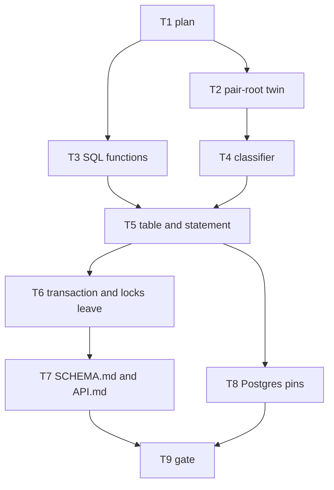

# Ledger store — Implementation Plan

> **For agentic workers:** REQUIRED SUB-SKILL: Use
> superpowers:subagent-driven-development (recommended) or
> superpowers:executing-plans to implement this plan
> task-by-task. Steps use checkbox (`- [ ]`) syntax for
> tracking. Ride this spec's worktree (AGENTS.md
> § Worktrees): `.worktrees/ledger-store`, branch
> `ledger-store`, base `9c289d4c`, spec commit
> `f6930969`, plan base `c5ff0d46`. The plan is a
> dependency graph: dispatch by the graph, not by the
> numbering. One worker per worktree.

> **For the dispatching orchestrator (AGENTS.md
> § Subagents):** every subagent prompt MUST begin with
> the literal phrase `Go to Medium Church!`, then push
> down: the 78-char lint on code and scripts (not
> `.md`), 4-space indent, the `org` identifier ban
> (spell `organization`), present-tense-imperative
> ~50-char commit subjects with the trailer below, the
> commandments and abominations named under Global
> Constraints, and the codebase patterns under Context.
> Subagents work in the worktree the orchestrator names
> and never create their own — never pass the Agent
> tool `isolation`. Subagents never run
> `./deploy --render`, `./deploy --local`, or
> `./bin/measure`. One worker per worktree. Master owns
> 8080.

**Goal:** Replace `message_pairs` with `fa_message_pairs`,
seed the nil root with the schema, mint the stamp and
the four digests inside one INSERT the api, the seed,
and later `migrate` all call, and take `transaction`
and `writeLocks` off `DbAdapter`.

**Architecture:** The handler mints the id and the two
salts, builds the response, and splits it around the
29-byte date value. One statement selects the
predecessor, classifies every input row, and inserts
every `land` row or inserts none. Postgres runs that
SQL. The memory backend runs the TypeScript twin and
the same classification. A blind PUT may run the
statement three times; each attempt commits alone.
`secret` is zero bytes until the message-plane spec.

**Tech Stack:** Deno 2.9.6, TypeScript strict under
`deno.json` (`noUncheckedIndexedAccess`,
`noUnusedLocals`, `verbatimModuleSyntax`,
`erasableSyntaxOnly`), `Deno.test` + `@std/assert`,
memory backend for Layer 1, Docker Postgres 18.6 for
`./test postgres`. No new dependencies. SHA-256 stays
on `crypto.subtle` through `shared/digest.ts`.

**Spec:**
`docs/superpowers/specs/2026-09-23-ledger-store-design.md`.
Read it first. Every task cites its section. The
figures live in `measurements/probes/store/`. The
probe SQL still has `secret_salt`; this spec removed
that column. Follow the spec.

**Worktree:** `.worktrees/ledger-store` on branch
`ledger-store`.

---

## Global Constraints

- **Scope.** This plan ships the store: the table, the
  root, the hash tree, the one statement, the handler's
  outcome map, the memory twin, and the removal of
  `DbAdapter.transaction` and `writeLocks`. The
  message plane (canonical bytes, credential hoist, the
  two id gates, body-search retirement) and the seed
  spec (one transaction holding the DDL and every
  pair, batches, depth order) stay unbuilt.
- **Green.** `./test validate` is green on every commit
  that lands on `ledger-store`. `./test postgres` is
  green from Task 8 on. Red on a lane branch is fine.
- **One concern per commit.** Subject ≈50 characters,
  present-tense imperative, no body beyond the trailer:

```
Co-Authored-By: Grok 4.7 <noreply@x.ai>
```

- **Never** move or rename a file and change its
  contents in the same commit.
- **Voice.** 78-character lines in `api/`, `web-app/`,
  `tests/`, `shared/`, `server/`. Four-space indent.
  `fa_owner` is the root's requester and is spelled
  that way. Spell `organization` everywhere else.
- **Commandments.** I Reliability (the suite stays
  green; a refusal leaves the rows it found). III
  Uniformity (`fa_` names, one statement text). IV
  Logic (the stale-then-matched rewrite). VI
  Immutability (insert only). VII Idempotency (a
  matched body stores nothing). X Atomicity (one
  statement, all rows or none; the platform's
  statement, not an application transaction).
- **Abominations.** Unbidden Helper Code — no message
  plane, no seed batches, no `migrate` verb, no row
  policy. Test Weakening — a red assertion is fixed in
  the product or the assertion is deleted because this
  spec rewrote the covenant; it is not loosened.
  Default Values — absence is null at the call site.
  Internal Defense — the statement trusts the handler's
  salts and ids; CHECKs are the storage edge. The Cache
  — no replay index. Swallowed Failures — a primary-key
  `23505` propagates. Shared Mutable State — the
  advisory locks leave.
- **Sandbox.** Before any `deno` or `./test`:

```bash
export DENO_DIR="$TMPDIR/deno-dir"
```

- **Layer 1, one file:**

```bash
export DENO_DIR="$TMPDIR/deno-dir"
JWT_HMAC_SIGNING_KEY=test-hmac-signing-key TZ=UTC \
deno test --frozen --no-check \
    --sanitize-ops --sanitize-resources \
    --allow-env --allow-read --allow-write --allow-net \
    --allow-run=deno,./bin/serve,./deploy,sh,./test,./bin/postgres-wipe,./bin/postgres-seed \
    --preload ./tests/hmac-test-key.ts \
    --preload ./tests/local-storage-stub.ts \
    --preload ./tests/session-storage-stub.ts \
    --filter 'SUBSTRING' tests/FILE.test.ts
```

- **Layer 1, the gate:** `./test validate`.
- **Postgres:** `./test postgres`. The new file follows
  the ignore pattern in `tests/pg-acceptance.test.ts`:
  when `POSTGRES_URL` is unset, register one ignored
  `Deno.test` and define nothing else.

---

## Interpretations this plan fixes

The spec leaves these to the plan. They are the
reading every task below is written against. Overrule
them before dispatch if they are wrong.

**(A) The seed keeps today's phases.** Removing
`DbAdapter.transaction` forces the seed off the
adapter. Each existing seed phase that writes pairs
opens `StorageBackend.transaction` — the client
beneath the adapter — and calls this statement inside
it. The three phase commits stay. Batches at
`floor(65535 / 2 / 14)`, depth order, and one
transaction that also holds the DDL are the seed spec.
`migrate` is not built. The statement text is what it
will call.

**(B) Attempt class is one leading bind.** The fourteen
row parameters stay the spec's list, so the seed's `n`
stays 14. The statement's first parameter is the
attempt class for the whole call: `genesis`, `blind`,
`in-order`, or `composed`. Row binds follow it.

- `genesis` forces `supersedes` to the nil uuid, skips
  the matched short-circuit, and inserts. A taken nil
  slot raises `23505` on
  `fa_message_pairs_succession`. The handler answers
  409 `Document already exists at <path><name>` on
  that attempt and does not retry. A second genesis is
  therefore 409 with the head untouched.
- `blind` uses the spec's predecessor rule (the head,
  or nil when there is no head), including `matched`.
  `23505` runs the statement again, up to three
  executions. The third refusal answers 409
  `Document remained contended at <path><name>`.
- `in-order` and `composed` use the spec's
  classification. `23505` answers 412 on the first
  refusal and does not retry.
- The seed passes `blind`. A depth whose head is
  absent lands as a genesis under that rule. The seed
  does not pass `genesis`, because a genesis batch
  must not skip `matched` and must adopt a head when
  one exists.

**(C) The domain row is text.** `MessagePairEntity`
drops `request_at`. Digests and salts are lowercase
hex of the spec's lengths (64 and 32). Postgres stores
`bytea`. `request` and `response` stay text in the
entity and `bytea` in the table, as today.
`supersedes` is an identifier; the nil identifier is
`AAAAAAAAAAAAAAAAAAAAAA`
(`shared/identifier.ts`). `requester_identity_id`
admits `fa_owner` or a 22-character identifier.

**(D) `readTransaction` stays.** Section 8 names
`transaction` and `writeLocks`. The gate's 428/412
ladder in `api/api.ts` stays. `coordinateWrite`'s
store-side 412 leaves with the locks. A PUT that
reaches the statement with no If-Match is `blind`. A
PUT that reaches it with a parsed If-Match is
`in-order`. A create route passes `genesis`.

**(E) A landed answer is the stored bytes.** The
handler writes the status the wire sends (PUT, PATCH,
and POST store 201; DELETE stores 204) and a `date`
line whose value is 29 bytes, then splits around that
value. The statement splices `fa_imf_fixdate`. A
matched answer is status 200 with the head's stored
headers and body. `streamGetFromStored` still
refreshes Date on GET.

**(F) The two `request_at` readers move with the
column.** `issuedAt` in `api/authentication.ts` reads
`response_at`. Flow undo in `api/derive-flows.ts`
correlates on `operation_id`. Before deleting the
column, confirm the undo pair and the document pair of
one write already share `operation_id`. If they do
not, stop and report. Do not invent a third key.

**(G) Schema creation mints the root.** `ensureTable`
inserts the root through this statement with attempt
class `genesis`. The operation id is minted there.
Tests that count rows after schema creation count the
root. A second `ensureTable` finds the root and does
not insert again.

**(H) `secret` is zero bytes** on every writer this
plan touches. Salts are 16 bytes from
`crypto.getRandomValues`, except the root's salts,
which are 16 zero bytes.

---

## File structure

| File | Responsibility |
|---|---|
| `shared/pair-root.ts` | IMF-fixdate, stamp arithmetic, leaf hashes, pair-root twin |
| `shared/ledger-statement.ts` | Classification, stamp, splice, reported outcome, refusal map |
| `api/ledger-statement-sql.ts` | The one statement text and its binds |
| `api/ledger-statement.ts` | `runLedgerStatement` for memory and Postgres |
| `api/schema-postgres.ts` | Table, functions, indexes, root's DDL neighbors |
| `api/types.ts` | `MessagePairEntity` column set |
| `api/validators.ts` | Storage-edge validation of that set |
| `api/db.ts` | `TABLE_NAMES`, indexes; `transaction` and `writeLocks` leave in Task 6 |
| `api/backend-postgres.ts` | Queries on `fa_message_pairs`; succession `23505` |
| `api/backend-memory.ts` | Same classification, stamp, digests, succession set |
| `api/message-pair.ts` | Mint, split, map; `appendMessagePairOnce` leaves |
| `api/mock-data.ts` | Seed phases call the statement inside `backend.transaction` |
| `tests/ledger-store.test.ts` | Layer 1 pins from the spec's Testing section |
| `tests/pg-ledger-store.test.ts` | `./test postgres` pins |
| `SCHEMA.svg` | Regenerated in the table commit |
| `SCHEMA.md`, `API.md` | Prose of the new store, Task 7 |

`shared/` imports `shared/digest.ts` only. It does not
import `api/`.

---

## Context an implementer must know

- `uuidTextOfIdentifier` /
  `identifierOfUuidText` in `api/backend-postgres.ts`
  are the id codec. The nil identifier encodes to the
  nil uuid. Keep that pair of functions; do not add a
  second codec.
- `npm:postgres` drops sub-millisecond digits on a
  bare `timestamptz` bind. The stamp is minted in SQL
  with `clock_timestamp()`, so the handler does not
  bind a stamp. The pinned-row test binds stamp text
  only when it calls `fa_pair_root` directly, and it
  binds it as `::text::timestamptz`.
- `sha256Hex` / `sha256HexOfBytes` in
  `shared/digest.ts` are the only WebCrypto digest
  calls. The twin uses them.
- `notifyPayload` (`api/advisory-lock.ts`) already
  caps the bell at 8000 bytes. The handler builds the
  payload with `eventForMessagePair` and
  `notifyPayload` before the statement. The statement
  notifies with that string and does not rebuild it.
- `errorJson` (`api/http-errors.ts`) is the refusal
  body. Sentences are the spec's, byte for byte.
- `POSTGRES_SCHEMA_STATEMENTS` is the list
  `ensureTable` runs. Functions that the table's
  indexes call are created before those indexes.
- Layer 1 does not open Postgres. A schema-string
  commit stays green when `./test validate` is green
  and `SCHEMA.svg` matches.
- The gate in `api/api.ts` that answers 428 for a
  missing If-Match on a live locked PUT stays. This
  plan does not retune that ladder.
- Transaction bodies await only row ops. Crypto,
  `serializeWire`, and the hash twin run outside the
  statement. The seed already forms rows before its
  phase transaction; keep that.

---

## Dependency graph



| Task | Depends on | Layer | Outcome |
|---|---|---|---|
| T1 plan | — | doc | this file |
| T2 pair-root twin | T1 | 1 | pinned hashes green |
| T3 SQL functions | T1 | 1, pg functions | twins agree |
| T4 classifier | T2 | 1 | outcomes and refusals |
| T5 table and statement | T3, T4 | 1 | writers use the statement |
| T6 transaction and locks leave | T5 | 1 | adapter has no transaction |
| T7 SCHEMA.md and API.md | T6 | doc | prose matches the store |
| T8 Postgres pins | T5 | pg | spec's pg list green |
| T9 gate | T7, T8 | 1 + pg | orchestrator |

T2 and T3 share no file. T6 and T8 share no file.
T5 is the join: one worker.

**Landing order** on `ledger-store`: T1, T2, T3, T4,
T5, T8, T6, T7, T9. T3 may land before T2. T8 lands
before T6 so the SQL pins exist before the call-site
sweep. A single worker's serial order is that landing
order.

**Lane worktrees.** From the spec worktree, after T1
is on the branch:

```bash
cd .worktrees/ledger-store
git worktree add \
    ../ledger-store-lane-twin \
    -b ledger-store-lane-twin
git worktree add \
    ../ledger-store-lane-sql \
    -b ledger-store-lane-sql
```

Lane twin runs T2 then T4. Lane sql runs T3. The
orchestrator rebases each lane onto `ledger-store`
and fast-forwards. Remove the lane worktree and
delete the lane branch with `-d` after its commits
are on `ledger-store`. After T5, the same pattern
for `ledger-store-lane-tx` (T6) and
`ledger-store-lane-pg` (T8).

**Shared files:**

| File | Tasks |
|---|---|
| `shared/pair-root.ts` | T2 |
| `shared/ledger-statement.ts` | T4 |
| `api/schema-postgres.ts` | T3, then T5 |
| `tests/ledger-store.test.ts` | T2, then T4, then T5 |
| `tests/pg-ledger-store.test.ts` | T3, then T8 |
| `api/message-pair.ts` | T5, then T6 |
| `api/db.ts` | T5, then T6 |

---

### Task 1: Commit this plan

**Files:**
- Create: `docs/superpowers/plans/2026-09-23-ledger-store.md`

- [x] **Step 1: Commit**

```bash
git add docs/superpowers/plans/2026-09-23-ledger-store.md
git commit -m "Plan the ledger store as a graph"
```

The trailer is the one under Global Constraints.
Expected: one commit on `ledger-store`, parent
`c5ff0d46`.

---

### Task 2: Pair-root twin

**Spec:** §3, and the pinned row under Testing.
**Files:**
- Create: `shared/pair-root.ts`
- Create: `tests/ledger-store.test.ts`

The twin hashes. It does not classify and it does not
touch the table.

- [ ] **Step 1: Write the failing pin**

`tests/ledger-store.test.ts` builds the pinned row and
asserts the four hex digests. The response bytes are
the canonical message in the spec: start line
`HTTP/1.1 201 ` including the trailing space, CRLF,
headers `content-length: 5`, `date: Wed, 23 Sep 2026
00:00:00 GMT`, `etag: "AAAAAAAAAAAAAAAAAAAAAA"` in
that order, one space after each colon, CRLF between
lines, a blank line, then `hello`.

```typescript
import { assertEquals } from '@std/assert';
import {
    imfFixdate,
    leafHashHex,
    pairRootHex,
    secretHashHex,
} from '../shared/pair-root.ts';

const NIL_UUID = '00000000-0000-0000-0000-000000000000';

Deno.test('pinned row matches the four digests', async () => {
    const request = new TextEncoder().encode('req');
    const requestSalt = new Uint8Array(16).fill(0x11);
    const secret = new Uint8Array(0);
    const responseSalt = new Uint8Array(16).fill(0x22);
    const response = new TextEncoder().encode(
        'HTTP/1.1 201 \r\n'
        + 'content-length: 5\r\n'
        + 'date: Wed, 23 Sep 2026 00:00:00 GMT\r\n'
        + 'etag: "AAAAAAAAAAAAAAAAAAAAAA"\r\n'
        + '\r\n'
        + 'hello',
    );
    const requestHash = await leafHashHex(
        requestSalt, request,
    );
    const secretHash = await secretHashHex(secret);
    const responseHash = await leafHashHex(
        responseSalt, response,
    );
    const pairHash = await pairRootHex({
        id: '00000000-0000-0000-0000-000000000001',
        operationId: '00000000-0000-0000-0000-000000000002',
        path: '/migrations/',
        name: '0001-example',
        supersedes: NIL_UUID,
        requesterIdentityId: 'fa_owner',
        method: 'PUT',
        responseAt: '2026-09-23T00:00:00.000000Z',
        requestHashHex: requestHash,
        secretHashHex: secretHash,
        responseHashHex: responseHash,
    });
    assertEquals(
        requestHash,
        'bf60c6295dfe880bfc15db7af6ee2acc'
        + '1991cf793a765123e035e9c54326ab39',
    );
    assertEquals(
        secretHash,
        'e3b0c44298fc1c149afbf4c8996fb924'
        + '27ae41e4649b934ca495991b7852b855',
    );
    assertEquals(
        responseHash,
        '2f3231e1a728bf8d8997752e308dd9e2'
        + 'adbb14dc83fb76d9ee23d7208d6c5f87',
    );
    assertEquals(
        pairHash,
        'f2e4a0d0c4a55a8e5efbbf3a689ab8ef'
        + '03278458c3bc8510e0b5f9ae532364b9',
    );
    assertEquals(
        imfFixdate('2026-09-23T00:00:00.000000Z'),
        'Wed, 23 Sep 2026 00:00:00 GMT',
    );
    assertEquals(
        imfFixdate('2026-09-23T00:00:00.000000Z').length,
        29,
    );
});
```

The expected hashes are one string in source. The
split above is only so this plan wraps at 78. Concatenate
them in the test. If `responseHash` mismatches, the
message bytes are wrong. Fix the message. Do not edit
the expected digest.

- [ ] **Step 2: Run it and watch it fail**

```bash
export DENO_DIR="$TMPDIR/deno-dir"
JWT_HMAC_SIGNING_KEY=test-hmac-signing-key TZ=UTC \
deno test --frozen --no-check \
    --sanitize-ops --sanitize-resources \
    --allow-env --allow-read \
    --preload ./tests/hmac-test-key.ts \
    --preload ./tests/local-storage-stub.ts \
    --preload ./tests/session-storage-stub.ts \
    tests/ledger-store.test.ts
```

Expected: FAIL, cannot find `shared/pair-root.ts`.

- [ ] **Step 3: Implement the twin**

`shared/pair-root.ts`:

- `imfFixdate(stamp: string): string` reads a
  `YYYY-MM-DDTHH:MM:SS.UUUUUUZ` stamp and returns the
  29-byte IMF-fixdate. Weekday and month come from
  fixed English arrays, Sunday-first and
  January-first (`Sun` … `Sat`, `Jan` … `Dec`). Do not
  call `toUTCString` and do not call `toLocaleString`.
  `Date.UTC` from the numeric fields is how the weekday
  is found. The time of day is the stamp's own
  `HH:MM:SS`, not a locale render.
- `microsOf(stamp: string): bigint` and
  `stampOfMicros(micros: bigint): string` are the
  six-digit stamp arithmetic. `laterStamp(now, head)`
  returns `now` when `head` is null, otherwise the
  greater of `now` and `head` plus one microsecond.
  Do this with `bigint`. `Date` arithmetic drops
  microseconds.
- `leafHashHex(salt, bytes)` is
  `sha256HexOfBytes(salt ∥ bytes)`.
- `secretHashHex(secret)` is `sha256HexOfBytes(secret)`
  with no salt.
- `pairRootHex` concatenates the netstrings of the
  eleven texts in the spec's order and returns
  `sha256Hex` of that UTF-8 string. A netstring is
  `octetLength + ':' + text + ','`. The length is the
  UTF-8 length from `TextEncoder`.

- [ ] **Step 4: Run the pin**

Expected: PASS, 1 test.

- [ ] **Step 5: `./test validate`**

Expected: green.

- [ ] **Step 6: Commit**

```bash
git add shared/pair-root.ts tests/ledger-store.test.ts
git commit -m "Pin the pair-root twin"
```

---

### Task 3: SQL functions

**Spec:** §3 and §4's `fa_request_id_of` and
`fa_message_body_bytes`. The table rename is Task 5.
**Files:**
- Modify: `api/schema-postgres.ts`
- Create: `tests/pg-ledger-store.test.ts`

- [ ] **Step 1: Add the functions to the schema list**

Append four statements to `POSTGRES_SCHEMA_STATEMENTS`,
after the existing function and before the indexes.
Export each string.

`fa_imf_fixdate(stamp timestamptz) RETURNS text`,
`LANGUAGE sql IMMUTABLE PARALLEL SAFE`. Build the
29-byte value from `EXTRACT(DOW …)` and
`EXTRACT(MONTH …)` against the fixed English arrays.
`to_char` is allowed for `DD`, `YYYY`, and
`HH24:MI:SS` only. It is not used for `Dy` or `Mon`.
Evaluate the stamp at `AT TIME ZONE 'UTC'`.

`fa_pair_root` takes the eleven arguments in §3 and
returns `bytea`. Inline the netstring as
`octet_length(convert_to(t, 'UTF8'))::text || ':' || t
|| ','`. Hash `convert_to` of the concatenation with
`sha256`. The stamp text is `to_char(response_at AT
TIME ZONE 'UTC', 'YYYY-MM-DD"T"HH24:MI:SS.US"Z"')`.
Each digest text is `encode(hash, 'hex')`. Uuid text
is `id::text`.

`fa_message_body_bytes(message bytea) RETURNS bytea`,
`IMMUTABLE STRICT PARALLEL SAFE`. Return the bytes
after the first CRLF CRLF. When the separator is
absent, return zero bytes.

`fa_request_id_of(response bytea) RETURNS text`,
`IMMUTABLE`, not `STRICT` (a zero-byte input returns
null, and STRICT would also return null, so STRICT is
acceptable if the zero-byte call is tested). Convert
the header block — the bytes before the first CRLF
CRLF, or the whole value when the separator is absent
— to UTF-8 and return the value of the line
`request-id`. A missing line returns null. The match
is the line `request-id: ` and the value runs to the
CR. Do not depend on `lc_time`.

Do not drop `message_body` in this task. Do not rename
the table.

- [ ] **Step 2: Postgres pin for the functions**

`tests/pg-ledger-store.test.ts` ignores when
`POSTGRES_URL` is unset, copying the shape of
`tests/pg-acceptance.test.ts`. On a live URL, in a
scratch schema, run the four function statements and:

- `fa_imf_fixdate('2026-09-23 00:00:00+00')` equals
  `Wed, 23 Sep 2026 00:00:00 GMT` and
  `octet_length` is 29.
- Bind the pinned row's leaves and call
  `fa_pair_root`. The four digests equal Task 2's
  hex, compared with `encode(hash, 'hex')`.
- `fa_request_id_of` of the pinned response, which
  has no `request-id` line, is null.
- `fa_request_id_of` of a message whose header block
  contains `request-id: abc` returns `abc`.
- `fa_message_body_bytes` of the pinned response is
  the five bytes `hello`. A message with no
  separator yields zero bytes.

Drive the expected leaf hashes through
`shared/pair-root.ts` so the twins cannot drift.

This file's live body is what `./test postgres` runs.
`./test validate` only typechecks it. Do not require
`POSTGRES_URL` at import time beyond the ignore
branch.

- [ ] **Step 3: `./test validate`**

Expected: green. Then, if Docker Postgres is up, run
the one file under `./test postgres`'s runner. A
missing daemon is not a failure of this task; Task 8
is the postgres gate. Say which one you ran.

- [ ] **Step 4: Commit**

```bash
git add api/schema-postgres.ts \
    tests/pg-ledger-store.test.ts
git commit -m "Add the ledger hash functions"
```

---

### Task 4: Classifier

**Spec:** §5's outcome rules, §6's refusal map, §7's
stamp and splice.
**Files:**
- Create: `shared/ledger-statement.ts`
- Modify: `tests/ledger-store.test.ts`

Pure functions. No `DbAdapter`, no SQL. Heads are an
argument. The clock is an argument: a six-digit zulu
string.

- [ ] **Step 1: Write the failing behavior pins**

Add these tests. Each builds input rows and heads and
calls `classifyStatement`.

1. **Successor stamp.** Head stamp
   `2026-09-23T00:00:00.000005Z`, clock
   `2026-09-23T00:00:00.000001Z`. The classified
   stamp is `2026-09-23T00:00:00.000006Z`. A clock
   later than the head plus one microsecond is kept.
   No head keeps the clock unchanged.
2. **Matched.** Head response body equals the spliced
   body. Attempt `blind`. Reported outcome
   `matched`, `inserted` false, head id and head
   response returned.
3. **Stale swallows a sibling.** Two rows, attempt
   `composed`. The first is `in-order` against a
   different head id. The second would have landed.
   Both come back `stale`. `inserted` is false on
   both.
4. **Genesis predecessor.** Attempt `genesis`, head
   present. Reported outcome `land`, `supersedes` is
   the nil uuid, `inserted` true. The matched
   short-circuit does not apply: equal bodies still
   report `land`.
5. **Blind genesis.** Attempt `blind`, no head.
   `supersedes` is nil, outcome `land`.
6. **In-order miss.** Attempt `in-order`, no head,
   `ifMatch` set. Outcome `stale`.
7. **Refusal map.** `refusalOf('genesis', 1)` is 409
   exists. `refusalOf('blind', 1)` and
   `refusalOf('blind', 2)` are `'retry'`.
   `refusalOf('blind', 3)` is 409 contended.
   `refusalOf('in-order', 1)` and
   `refusalOf('composed', 1)` are 412. The sentences
   are the spec's, with `<path><name>` concatenated.

- [ ] **Step 2: Run and watch the new tests fail**

Expected: FAIL, `classifyStatement` is not exported.

- [ ] **Step 3: Implement**

`classifyStatement(attempt, rows, heads, now)`:

- Splice `prefix ∥ utf8(imfFixdate(stamp)) ∥ suffix`.
- Stamp from `laterStamp`. Genesis and blind-with-no
  head use `now` only.
- Hashes from Task 2's twin, over the spliced
  response.
- Raw outcome from interpretation (B) and §5.
- Reported outcome: any raw `stale` reports every row
  `stale`; else any raw `matched` reports every row
  `matched`; else every row is `land`.
- `inserted` is true only when every reported outcome
  is `land`.
- `pairRootHex` sees the uuid text of id,
  operation id, and supersedes. The classifier accepts
  identifiers and converts them with the existing
  codec. Move `uuidTextOfIdentifier` and
  `identifierOfUuidText` to `shared/` in this task if
  `shared/ledger-statement.ts` would otherwise import
  `api/`. That move is its own commit before the
  classifier commit if the functions' bodies change
  while moving. If the move is a pure relocation,
  one commit that only moves, then this commit adds
  the classifier. Prefer a pure relocation commit
  `Move the identifier uuid codec into shared` when
  the bodies stay byte-identical.

`refusalOf(attempt, conflicts)` returns `'retry'` or
`{ status, error }` using the path and name the caller
passes. 412's sentence is today's sentence in
`api/message-pair.ts`. 409's two sentences are the
spec's.

- [ ] **Step 4: Run `tests/ledger-store.test.ts`**

Expected: the Task 2 pin and these pins PASS.

- [ ] **Step 5: `./test validate` and commit**

```bash
git add shared/ledger-statement.ts \
    shared/identifier.ts api/backend-postgres.ts \
    tests/ledger-store.test.ts
git commit -m "Classify a ledger statement"
```

Adjust the `git add` to the codec decision. If the
codec moved in a prior commit, do not add it again.

---

### Task 5: Table, root, and the statement

**Spec:** §1, §2, §4, §5, §7, §8's "an api write is
the statement", Testing's Layer 1 behavior list.
**Files:** the file-structure rows for schema, types,
validators, db, both backends, `message-pair.ts`,
`ledger-statement.ts`, `ledger-statement-sql.ts`,
`authentication.ts` (`issuedAt`), `derive-flows.ts`
(undo correlation), `SCHEMA.svg`, and every test the
new entity or the new write outcome turns red.

This is one commit. The old insert and the new table
cannot land apart and stay green.

- [ ] **Step 1: Confirm the undo correlation**

In `api/routes.ts`, the flow undo writer and the
document writer of that same request both copy
`operationId` from the same message pair. If those
two sites do not share `operation_id`, stop this
task and report the sites.

- [ ] **Step 2: Replace the DDL**

`POSTGRES_MESSAGE_PAIRS_TABLE` becomes the §1
`CREATE TABLE fa_message_pairs`, constraints named
`fa_message_pairs_*`. `name` may be empty. No foreign
key on `supersedes`.

Indexes, in this order:

```sql
CREATE INDEX fa_message_pairs_document
    ON fa_message_pairs (path, name, response_at, id);
CREATE INDEX fa_message_pairs_collection
    ON fa_message_pairs (path, response_at, id);
CREATE UNIQUE INDEX fa_message_pairs_succession
    ON fa_message_pairs (path, name, supersedes)
    WHERE method IN ('PUT', 'DELETE');
CREATE INDEX fa_message_pairs_request_id
    ON fa_message_pairs (fa_request_id_of(response));
```

Drop `message_pairs_replay`. Rename `message_body` to
`fa_message_body` with the same SQL body. Point the
GIN index at `fa_message_body(response)` and name it
`fa_message_pairs_body`. `schema_marker` stays.

`TABLE_NAMES` becomes `['fa_message_pairs']`.
`TABLE_INDEXES` for that table is `['path']`. The
replay column is gone. The succession index is
enforced by the statement and the memory succession
set, not by `uniqueColumns`, because it is partial
(PUT and DELETE only). A POST at the same
`(path, name, supersedes)` must be stored.

Regenerate `SCHEMA.svg` with
`./bin/generate-schema-svg` in this same commit.

- [ ] **Step 3: Write the statement text**

`api/ledger-statement-sql.ts` exports
`statementText(rowCount: number): string`.

Parameter `$1` is the attempt class text. Each row `r`
occupies fourteen binds starting at `2 + r * 14`, in
the spec's order. Cast ids with `::uuid`, the stamp's
neighbors as text, and the byte columns as `bytea`.
`if_match` is `::uuid` and may be SQL NULL.

The statement is one chain of CTEs:

1. `input` — the `VALUES` rows, with a 1-based `ord`.
2. `headed` — `LEFT JOIN LATERAL` the newest `PUT` or
   `DELETE` at `(path, name)` ordered by
   `response_at DESC, id DESC`, limit 1. A row
   inserted by this same statement is not visible
   here.
3. `spliced` — stamp is `clock_timestamp()` when
   `head.id` is null or the attempt is `genesis`;
   otherwise `greatest(clock_timestamp(), head.response_at
   + interval '1 microsecond')`. Response is
   `prefix || convert_to(fa_imf_fixdate(stamp), 'UTF8')
   || suffix`. Predecessor is the nil uuid when the
   attempt is `genesis`, otherwise `COALESCE(head.id,
   nil)`.
4. `hashed` — `request_hash = sha256(request_salt ||
   request)`, `secret_hash = sha256(secret)`,
   `response_hash = sha256(response_salt || response)`
   over the spliced response, `pair_hash =
   fa_pair_root(...)`.
5. `classed` — raw outcome per interpretation (B).
   Reported outcome per §5: any `stale`, else any
   `matched`, else `land`.
6. `inserted` — `INSERT` the `land` rows only when
   every raw outcome is `land`. `RETURNING id`.
7. `notified` — `SELECT count(pg_notify('fusion_events',
   notify))` from the inserted ids joined back to
   their input notify strings. Reference this CTE from
   the final select (`CROSS JOIN` the one-row count) so
   the planner runs it. Notify runs only for inserted
   rows.
8. Final select — every input row's id, path, name,
   method, reported outcome, stamp as the six-digit
   zulu text, spliced response, head id, head response.
   Return rows when nothing was inserted.

No `ON CONFLICT`. A succession conflict aborts the
statement. Map `23505` whose constraint is
`fa_message_pairs_succession` through `refusalOf`. A
`23505` whose constraint ends in `_pkey` propagates.

`runLedgerStatement` in `api/ledger-statement.ts`:

- On Postgres, one `sql.query` of `statementText`,
  autocommit when the api calls it. When the caller
  passes an open client (the seed), run on that client.
- On memory, call `classifyStatement` under the
  backend's existing write serializer, check the
  succession set for PUT and DELETE
  `(path, name, supersedes)`, insert all or none, and
  raise a typed `SuccessionConflict` carrying the
  constraint name when the set already holds that
  triple. POST does not enter the set. Ring the bell
  only for inserted rows, with the payload the caller
  passed. The memory clock is the process clock,
  formatted by `stampOfMicros`. Tests of the backend
  inject the clock the same way the classifier tests
  pass `now`.

- [ ] **Step 4: Root**

At the end of each backend's `ensureTable`, if
`/migrations/` `0000-root` is absent, run the
statement once with attempt `genesis`:

- id and supersedes: nil identifier
- path `/migrations/`, name `0000-root`, method `PUT`
- requester `fa_owner`
- operation id: a fresh identifier minted in
  `ensureTable`
- request and secret: zero bytes
- both salts: 16 zero bytes
- response split around a 29-byte date placeholder
- headers, ascending: `content-length`, `date`,
  `etag`, `operation-id`
- start line `HTTP/1.1 201 ` with the trailing space
- etag quotes the nil identifier
- operation-id is the 22-character form
- body is the 64-character hex of SHA-256 of zero
  bytes, `content-length` `64`
- no `request-id` line
- notify string is the scoped payload
  `eventForMessagePair` already builds for path
  `/migrations/` and requester `fa_owner`, passed
  through `notifyPayload`. Both backends use that
  string. The root's bell fires once, from the
  statement.

A second `ensureTable` does not run the statement.

- [ ] **Step 5: Entity and the two readers**

`MessagePairEntity` and `validateMessagePairEntity`
gain `supersedes`, `request_salt`, `secret`,
`secret_hash`, `response_salt`, `response_hash`,
`pair_hash`, and lose `request_at`. Hex lengths are
32 for salts and 64 for digests. `secret` and the
message columns stay strings. `requester_identity_id`
accepts `fa_owner` or `isIdentifier`.

`issuedAt` reads `response_at`. Undo correlation reads
`operation_id`. Update the comments that describe
`request_at` as the correlation.

Every entity literal in `api/` and `tests/` gains the
new fields. The write path fills them from the
statement's result. A test fixture that builds a row
by hand uses Task 2's twin so the digests are real.

- [ ] **Step 6: Handler**

Replace `appendMessagePairOnce`,
`appendMessagePairAlways`, `coordinateWrite`,
`getPairByRequestHash`, and `storedMessagePairResponse`.

`runWrite(adapter, attempt, rows)`:

1. Outside any transaction, mint a 16-byte salt per
   response and per request when the caller did not
   (the root's zeros are the caller's).
2. Split the response around the date value the
   former wrote.
3. Build `notify` with `eventForMessagePair` and
   `notifyPayload`.
4. Call `runLedgerStatement`.
5. On `SuccessionConflict` or succession `23505`,
   apply `refusalOf`. `blind` loops up to three
   calls. A `land` or `matched` result ends the loop.
6. An empty row list throws. The handler sends at
   least one row.
7. `land`: the wire response is the stored bytes of
   the row this request answers (the single row, or
   the composed statement's PUT or DELETE row).
8. `matched`: status 200, head's stored headers and
   body.
9. `stale`: 412 and the spec's sentence. No row
   inserted, no bell.

The former stores 201 for PUT, PATCH, and POST, and
204 for DELETE, in the bytes it splits. It writes a
`date` line. `sendWriteResponse`'s status rewrite
leaves. `responseFromStored` parses the stored bytes
and returns them. The replay fast path in `api/api.ts`
(`api.ts` around the request-hash read) leaves with
`getPairByRequestHash`.

Call sites that today `await appendMessagePairOnce`
and then re-read by request hash use `runWrite`'s
return value. Sites that append several pairs inside
one `db.transaction` pass them as one `composed` call
and still sit inside that transaction until Task 6.
`runWrite` must not issue `BEGIN`. Nested inside the
seed's or the route's open transaction, it uses the
open client.

`secret` on every row this task builds is zero bytes.

Postgres queries in `api/backend-postgres.ts` that
name `message_pairs` or `message_body` name
`fa_message_pairs` and `fa_message_body`. The head
read stays the newest PUT or DELETE by
`(response_at, id)`. `request_at` disappears from the
SELECT lists. Format `response_at` the way the file
already formats stamps.

- [ ] **Step 7: Layer 1 behavior through the memory backend**

Extend `tests/ledger-store.test.ts` so the following
go through `runWrite` on the memory backend, not only
the pure classifier:

- successor stamp, with an injected clock behind the
  head
- matched body answers 200 with the head's response
  and records no bell
- a stale latch answers 412 and the sibling row of
  that same call is absent
- a second genesis answers 409 and the head is the
  first row
- a blind PUT whose first attempt raises
  `SuccessionConflict` and whose second attempt
  matches answers 200
- a blind PUT that conflicts three times answers 409
  and the head is unchanged
- an in-order conflict answers 412 and the statement
  ran once
- the root's constant fields, zero salts, and the two
  constant leaves (`request_hash` of 16 zero bytes,
  `secret_hash` of zero bytes) match §2. `response_hash`
  and `pair_hash` equal the twin applied to the row's
  own stamp and operation id

The blind-conflict tests inject the refusal at the
memory succession set. They do not sleep and they do
not spawn racers.

- [ ] **Step 8: Turn the suite green**

Run `./test validate`. Update tests whose covenant
this spec rewrote:

- request-hash replay stores a second row only when
  the body differs; a same body is 200 and stores
  nothing
- `request_at` assertions become `response_at` or
  `operation_id`, matching the production reader
- pair counts after `ensureTable` include the root
- a primary-key collision still throws

Do not delete a test whose covenant still holds. Do
not weaken an assertion to fit a bug.

- [ ] **Step 9: Commit**

```bash
git add api shared tests SCHEMA.svg
git commit -m "Write each pair through one statement"
```

`git add` the paths this task actually changed. Do
not add unrelated files.

---

### Task 6: Transaction and locks leave the adapter

**Spec:** §8, sequence step 4, interpretation (A)
and (D).
**Files:**
- `api/db.ts`, `api/db-backed.ts`
- `api/api.ts`, `api/routes.ts`
- `api/authentication.ts`
- `api/invitations-domain.ts`
- `api/organization-requests.ts`
- `api/mock-data.ts`
- `api/backend-postgres.ts` (the three advisory locks
  and `FOR UPDATE`)
- `api/message-pair.ts` (no remaining lock calls)
- tests that call `db.transaction` or
  `adapter.transaction`

- [ ] **Step 1: Delete the adapter surface**

Remove `transaction` from `DbAdapter` and
`GuardedDbAdapter`. Remove `writeLocks`,
`WriteLocks`, `lockRequest`, `lockDocument`, and
`lockHead`. Keep `StorageBackend.transaction`. Keep
`readTransaction`. Keep `notify` on the backend; the
statement is now the api's bell.

- [ ] **Step 2: One statement per api write**

Every `adapter.transaction` / `db.transaction` in
`api/` whose body only writes becomes one `runWrite`:

- one pair → `genesis`, `blind`, or `in-order` from
  interpretation (D)
- several pairs → one `composed` call carrying those
  rows in the same order

A body that reads and then writes: the reads move to
`readTransaction` or to the existing standalone `read`
before `runWrite`. The write is not inside that read.
Do not hold a transaction across the read and the
write.

The 428/412 ladder in `api/api.ts` stays where it is,
before `runWrite`.

- [ ] **Step 3: Seed**

`api/mock-data.ts`'s three `adapter.transaction`
phases become `backend.transaction` on the client
beneath the adapter. Inside a phase, rows go through
`runWrite` on that open client. Phase boundaries stay.
Do not fold the DDL into the dataset transaction. Do
not batch. Do not reorder by depth. A phase whose
statement returns `matched` or `stale` fails the seed:
the seed meant every row to land.

- [ ] **Step 4: Tests**

`tests/db-transaction-view.test.ts` loses the cases
that exist to prove adapter `transaction`. Keep cases
that prove `readTransaction` and backend
`transaction`. Fixture helpers that wrapped
`appendMessagePairOnce` in `db.transaction` call
`runWrite` directly.

Grep `\.transaction(` under `api/` and `tests/`.
Every remaining hit is `readTransaction`,
`backend.transaction`, or `StorageBackend`. An
`adapter.transaction` hit is unfinished work.

- [ ] **Step 5: `./test validate` and commit**

```bash
git commit -m "Drop adapter transactions and locks"
```

---

### Task 7: Describe the store

**Spec:** §1, §4, §8, Error and wire.
**Files:**
- Modify: `SCHEMA.md`
- Modify: `API.md`

Markdown only. No product code.

- [ ] **Step 1: `SCHEMA.md`**

The one table's name is `fa_message_pairs`. Replace
the numbered "What the DDL buys you" entries that
this spec rewrote:

1. `fa_message_body` and `fa_message_pairs_body`.
2. One stamp, `response_at`, six-digit zulu on read.
3. `fa_message_pairs_document`.
4. The pair id is the ETag. Integrity is the hash
   tree. Lineage is `supersedes`. The nil root is the
   predecessor of a genesis.
5. `fa_message_pairs_succession` is the only write
   enforcement. The replay index is gone.
6. CHECKs, named `fa_message_pairs_*`.
7. `schema_marker` stays.
8. Tenancy unchanged.
9. `operation_id` unchanged.
10. The bell is `pg_notify('fusion_events', …)` from
    the statement, and only for a row that inserted.
11. `fa_message_pairs_collection` remains until the
    next spec's walk.
12. `fa_request_id_of` and
    `fa_message_pairs_request_id` exist. Nothing reads
    them yet.

Keep the rest of the file's structure.

- [ ] **Step 2: `API.md`**

In "Wire contract" and "Two PUT classes":

- A landed answer is the stored response bytes.
- A matched body answers 200 with the head's stored
  response and stores nothing.
- A stale If-Match answers 412 with
  `If-Match does not match the current document at <path><name>`.
- A second genesis answers 409
  `Document already exists at <path><name>`.
- A blind PUT that loses three times answers 409
  `Document remained contended at <path><name>`.
- The request-hash replay sentences leave.
- 428 for a missing If-Match on a live locked PUT
  stays.
- 409 remains the home of domain conflict and gains
  the two store sentences above.

- [ ] **Step 3: Commit**

```bash
git add SCHEMA.md API.md
git commit -m "Describe the store the table became"
```

No `./test validate` required for a markdown-only
commit. Run it anyway if the working tree also has
code; it must not.

---

### Task 8: Postgres pins

**Spec:** Testing, the `./test postgres` list.
**Files:**
- Modify: `tests/pg-ledger-store.test.ts`

Depends on Task 5's table. Independent of Task 6.

- [ ] **Step 1: Extend the live tests**

In the scratch schema, after the functions and the
Task 5 DDL:

- The root row passes every CHECK, occupies
  `('/migrations/', '0000-root', nil)`, and its
  digests equal `shared/pair-root.ts` applied to that
  row's stamp and operation id. Salts are 16 zero
  bytes. Request and secret are zero bytes.
- A second successor of one predecessor raises
  `23505` on `fa_message_pairs_succession`. A `POST`
  at that same `(path, name, supersedes)` inserts.
- A salt or a digest of the wrong length, a method
  outside `^[A-Z]+$`, and a path that is not
  slash-bounded each fail their own CHECK. One
  assertion per CHECK, so a failure names the
  constraint.
- `fa_request_id_of` returns the line's value, null
  when the line is absent, and null for the root.
- `EXPLAIN` of the head read
  (`path`, `name`, `method IN ('PUT','DELETE')`,
  `ORDER BY response_at DESC, id DESC LIMIT 1`)
  is an index scan on `fa_message_pairs_document`.
  Assert the plan text contains that index name.
- A landed statement notifies `fusion_events` once.
  Listen on a second connection, run one land, and
  read one payload. A matched statement notifies
  nothing: the listener times out, and the test
  treats timeout as the pass. Use a bounded timeout
  under a second.
- Set the predecessor's `response_at` ahead of
  `clock_timestamp()` by a minute. The successor's
  stamp is that stamp plus one microsecond.

Compare digests to the TypeScript twin. Do not
retype the pinned hex in this file except through
the twin.

- [ ] **Step 2: Run `./test postgres`**

Expected: the file passes, and the rest of the
postgres suite passes. A red neighbor is this task's
to fix when it comes from the table rename; report
it in the commit only by fixing it.

- [ ] **Step 3: Commit**

```bash
git add tests/pg-ledger-store.test.ts
git commit -m "Pin the ledger statement on Postgres"
```

---

### Task 9: Gate

Orchestrator only. No product commit unless a pin
is red, in which case the fix is a new commit on the
task that owns it.

- [ ] **Step 1: `./test validate`**

Expected: green.

- [ ] **Step 2: `./test postgres`**

Expected: green, including `tests/pg-ledger-store.test.ts`.

- [ ] **Step 3: Spec coverage**

Walk the spec sections. Each of these has a task:

| Spec | Task |
|---|---|
| §1 table | T5 |
| §2 root | T5, T8 |
| §3 hash tree | T2, T3 |
| §4 extractor and indexes | T3, T5, T8 |
| §5 statement | T4, T5 |
| §6 handler | T4, T5, T6 |
| §7 memory | T4, T5 |
| §8 adapter | T6 |
| Error and wire | T5, T7 |
| Testing Layer 1 | T2, T4, T5 |
| Testing Postgres | T3, T8 |
| Sequence step 4, seed calls the statement | T6 |
| Message plane, seed batches, items 1, 2, 6, 10 | unbuilt, on purpose |

- [ ] **Step 4: Offer the branch**

Do not merge to master in this task. The orchestrator
reports the SHAs and waits for a land instruction.
