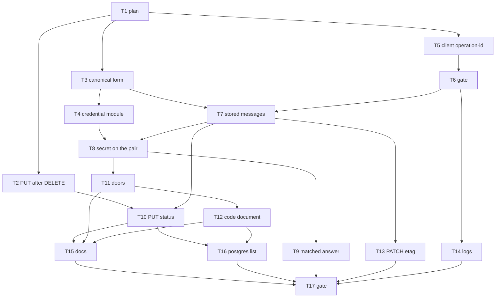

# Message plane — Implementation Plan

> **For agentic workers:** REQUIRED SUB-SKILL: Use
> superpowers:subagent-driven-development (recommended) or
> superpowers:executing-plans to implement this plan
> task-by-task. Steps use checkbox (`- [ ]`) syntax for
> tracking. Ride this spec's worktree (AGENTS.md
> § Worktrees): `.worktrees/message-plane`, branch
> `message-plane`, base `ledger-store` at `d104e99b`,
> spec commits `909386bb` and `93943c58`. The plan is a
> dependency graph: dispatch by the graph, not by the
> numbering. One worker per worktree. Do not create a
> lane worktree.

> **For the dispatching orchestrator (AGENTS.md
> § Subagents):** every subagent prompt MUST begin with
> the literal phrase `Go to Medium Church!`, then push
> down: the 78-char lint on code and scripts (not
> `.md`), 4-space indent, the `org` identifier ban
> (spell `organization`), present-tense-imperative
> ~50-char commit subjects with the trailer below, the
> commandments and abominations named under Global
> Constraints, and the codebase patterns under Context.
> Subagents work in `.worktrees/message-plane` and never
> create their own — never pass the Agent tool
> `isolation`. Subagents never run `./deploy --render`,
> `./deploy --local`, or `./bin/measure`. One worker
> per worktree. Master owns 8080.

**Goal:** Store each pair's request, secret, and
response as one canonical HTTP/1.1 message, hoist
credential lines into `secret`, give `request-id` and
`operation-id` one source each, replace the
authorization-code marker with a latched document, and
let the statement choose a landed PUT's 201 or 200.

**Architecture:** The gate reads the body bytes once,
refuses bad framing and a carried `request-id`, and
requires `operation-id`, all before authentication.
The handler builds the canonical request from those
bytes, builds the response from the context's two ids,
and splits credential lines into `secret`. The
statement splices the date, overwrites a modifying
PUT's status, and hashes the bytes it stores. The
handler merges `secret` back into the answering row
only, and that is what the wire sends. A matched
answer is the head's response with this request's
id and no date line.

**Tech Stack:** Deno 2.9.6, TypeScript strict under
`deno.json` (`noUncheckedIndexedAccess`,
`noUnusedLocals`, `verbatimModuleSyntax`,
`erasableSyntaxOnly`), `Deno.test` + `@std/assert`,
memory backend for Layer 1, Docker Postgres 18.6 for
`./test postgres`. No new dependencies. SHA-256 stays
on `crypto.subtle` through `shared/digest.ts`.
Base64 for Basic is `btoa` of the UTF-8 bytes.

**Spec:**
`docs/superpowers/specs/2026-09-23-message-plane-design.md`.
Read it first. Every task cites its section. The store
spec
`docs/superpowers/specs/2026-09-23-ledger-store-design.md`
is closed. Do not reopen it.

**Worktree:** `.worktrees/message-plane` on branch
`message-plane`.

---

## Global Constraints

- **Scope.** This plan ships the message plane: the
  canonical form, the credential hoist, the two id
  gates, the authorization-code document, and the
  status a landed PUT stores. The two store defects
  named "Found on the base" are tasks in this plan.
  The seed, items 1, 2, 4, and 6, moving application
  reads from `request` to `response`, emptying
  synthesized formers' requests, the status a POST or
  PATCH stores, `/status`, what the client sends as
  `user-agent`, the token-rotation transaction, and
  the instance-PATCH transaction stay unbuilt.
- **Green.** `./test validate` is green on every
  commit that lands on `message-plane`. `./test
  postgres` is green on every commit from Task 10
  on, and on Task 12 and Task 16. A red test is a
  step inside a task. The commit that follows the
  fix is green. Red on a lane branch does not apply:
  there is no lane.
- **One concern per commit.** Subject ≈50 characters,
  present-tense imperative, no body beyond the trailer:

```
Co-Authored-By: Grok 4.7 <noreply@x.ai>
```

  Author remains `Tom Mornini <tmornini@me.com>`.
- **Never** move or rename a file and change its
  contents in the same commit.
- **Voice.** 78-character lines in `api/`, `web-app/`,
  `tests/`, `shared/`, `server/`. Four-space indent.
  Spell `organization`. `fa_owner` stays the root's
  requester.
- **Commandments.** I Reliability (a refusal lands
  nothing; one redemption mints). III Uniformity (one
  canonical form, one mint each). IV Logic (stale
  before matched; 411 before 400 before auth). VI
  Immutability (stored bytes are the received bytes).
  VII Idempotency (the resent latch stays 412). X
  Atomicity (the code document lands in the grant's
  one statement; the platform statement, not a new
  application transaction).
- **Abominations.** Unbidden Helper Code — no seed
  batches, no `/status`, no item-1 read move, no
  second cache. Test Weakening — a red assertion is
  fixed in the product, or rewritten because this
  spec changed the covenant; it is not loosened.
  The source-scan pin at
  `tests/api-write-status.test.ts` is rewritten to
  the new function, not deleted. Default Values —
  a missing `code_challenge` is an absent field, never
  null. Internal Defense — past the gate, the former
  trusts the bytes and the two ids. The Cache — no
  body-search index kept "just in case". Swallowed
  Failures — a succession `23505` on the code DELETE
  becomes the grant's 401, not a 500. Shared Mutable
  State — the grant's transaction leaves; do not add
  a lock.
- **Sandbox.** Before any `deno` or `./test`:

```bash
export DENO_DIR="$TMPDIR/deno-dir"
```

- **Layer 1, one file:**

```bash
export DENO_DIR="$TMPDIR/deno-dir"
JWT_HMAC_SIGNING_KEY=test-hmac-signing-key TZ=UTC \
deno test --frozen --no-check \
    --sanitize-ops --sanitize-resources \
    --allow-env --allow-read --allow-write --allow-net \
    --allow-run=deno,./bin/serve,./deploy,sh,./test,./bin/postgres-wipe,./bin/postgres-seed \
    --preload ./tests/hmac-test-key.ts \
    --preload ./tests/local-storage-stub.ts \
    --preload ./tests/session-storage-stub.ts \
    tests/FILE.test.ts
```

- **Layer 1, the gate:** `./test validate`.
- **Postgres:** `./test postgres`. A new file follows
  `tests/pg-ledger-store.test.ts`: when
  `POSTGRES_URL` is unset or `''`, register one
  ignored `Deno.test` and define nothing else.

---

## Interpretations this plan fixes

The spec leaves these to the plan. They are the
reading every task below is written against.
Overrule them before dispatch if they are wrong.

**(A) Red first is a step, not a red commit.** Task 2
and Task 12 each write the failing test, run it, watch
it fail, then fix, then commit green.

**(B) `Deno.Request` does not set Content-Length.**
On Deno 2.9.6, `new Request(url, { body })` leaves
`content-length` unset. `fetch` with a string body
does send it; that is the browser client. Every
in-process `Request` that carries a body must set
`content-length` to the UTF-8 byte length. Task 6
does that in `tests/http-fixtures.ts` `apiRequest`
and in the in-process facade (`api/api.ts`
`facadeHeaders` / the `Request` constructors). A body
without that header is a 411, including a test that
forgot it.

**(C) `transfer-encoding` is visible on a server
Request and settable on a constructed one.** The
probe `measurements/probes/serve/chunked-framing.ts`
is the witness: `Deno.serve` hands the handler the
de-chunked bytes, the `transfer-encoding` line, and
no `content-length`. In this Deno,
`new Request` keeps a `transfer-encoding` header you
set and does not add `content-length`. The gate
reads the header. The edge is not taught to strip it
or to invent `content-length`. The edge already
reads the body once (`readCappedBody`) and rebuilds
the api `Request` with those bytes and the original
headers (`server/http-server.ts` `apiRequest`). The
gate's one read is that rebuilt body. Do not read
it again at the edge.

**(D) Framing is one pure function, called once.**
`framingRefusal(headers, bodyBytes)` lives in
`api/request-context.ts` beside the mint. Order,
first failure wins:

1. `transfer-encoding` present, any value → 411
   `A request body requires Content-Length`.
2. `bodyBytes.byteLength > 0` and no
   `content-length` → the same 411.
3. `content-length` present and not the body's
   byte length → 400
   `Content-Length does not match the body`.
   A non-integer or negative value is this 400.
4. No body (`byteLength === 0`) and no
   `content-length` → no refusal. `content-length: 0`
   with an empty body is a match, not a 411.

A 411 does not also check `operation-id`. The edge's
413 stays ahead of the gate and carries no
`request-id`.

**(E) The two ids are set once, in order.**
`incomingContext` mints `requestId` with
`generateIdentifier` and does not read a header.
Then framing. Then a carried `request-id` — any
value, well-formed or not — is 400
`Request-ID is minted by the server`, before
authentication, on every route including both doors
and an unauthenticated call. Then `operation-id`:
missing or empty is 400 `Operation-ID is required`;
present and not a 22-character identifier is 400
`Operation-ID must be a 22-character identifier`.
Reads and both doors are included. `/status` does
not exist and gets no exemption. The validated value
is `operationId` on the context, set in that one
place. `IncomingContext` gains `bodyBytes`. A
narrower type `FramedContext extends IncomingContext`
adds `operationId`. Authentication enriches
`FramedContext`. No step writes either id again.

**(F) One exit stamps `request-id`.** `finish(ctx,
response)` sets the header `request-id` to
`ctx.requestId` on every `Response` `handleRequest`
returns, including 411, 400, 401, 403, 404, 409,
412, 428, 500, landed, matched, and GET. It uses
`headers.set`, so a stored line and the exit agree.
The edge's 413 and the throttle's 429 are built in
`server/http-server.ts` and do not pass through
`finish`. They carry none.

**(G) Canonical fields.** `sortFields` becomes the
join and the sort. Same-name lines other than
`set-cookie` join with `', '` in received order,
then lines sort by name, bytewise, stable. Each
`set-cookie` stays its own line, in received order,
and sorts with the others under that name.
`serializeWire` writes the lines it is given and
computes no `content-length` and no
`transfer-encoding`. `putBody` sets `content-length`
to `String(body.byteLength())` in the same step,
writing the field itself; `putField` still rejects
a caller setting `content-length` or
`transfer-encoding`. Parse keeps `content-length`
and checks it against the body. Parse still
decodes a chunked body when it sees
`transfer-encoding`, and does not copy that line
into the model: the line is transport, and the gate
is what keeps it out of the store. `isStoredField`
retires. The JSON codec keeps `content-length` the
same way. `serializeStartLine` writes the version
token `HTTP/1.1` whatever the model holds. An empty
reason stays `HTTP/1.1 201 ` with the trailing
space. `buildRequestModel` and `buildResponseModel`
go through `putBody`, so a synthesized body gets one
`content-length`.

**(H) The answering row stores the received bytes.**
For the row whose response goes on the wire,
`request` is the start line
`<method> <target> HTTP/1.1`, then every header the
`Request` carries except credential lines, then the
body bytes unchanged. The target is the pathname
plus the query the api was handed. The edge's `/api`
mount stays off it. `Headers` has already joined
repeats other than `set-cookie`; the gate does not
split them back apart. The library's join is what
`serializeWire` does when a model still has
repeats. The gate decodes JSON from those bytes to
validate, as today, and does not write the decoded
value back. A number past 2^53 stays the digits
that arrived.

**(I) Synthesized formers keep a request.** Document
siblings, token events, the invitation's document
and seat, the assertion ticket, the credential
rehash, and the seed still build a request through
`buildRequestModel`. Their JSON is the canonical
encoding of the domain object. Decision 6 empties
only the code document's PUT and its DELETE. The
invitation POST's answering row stores the received
bytes, email included. The sibling that drops
`email` for `identity_id` stays. Do not hoist the
credential entity's `secret` field out of a
rehash body; it is not a credential line.

**(J) Credential lines live in one module.**
`shared/http-message/credentials.ts`:

```typescript
export const REQUEST_CREDENTIAL_NAMES = [
    'authorization',
    'proxy-authorization',
    'cookie',
] as const;

export const RESPONSE_CREDENTIAL_NAMES = [
    'set-cookie',
    'authentication-info',
    'proxy-authentication-info',
] as const;
```

`splitCredentials(fields)` returns `{ kept, hoisted }`
by those names. `secretBytes(hoisted)` is the
canonical lines joined by CRLF with no trailing
CRLF, or a zero-length `Uint8Array` when there are
none. `mergeSecret(message, secret)` parses the
message, inserts each secret line on the side its
name belongs to, re-sorts, and serializes. No name
is in both lists. `secret_hash` stays
`sha256(secret)` with no salt. The empty hash is
`e3b0c44298fc1c149afbf4c8996fb92427ae41e4649b934ca495991b7852b855`.

**(K) The wire merge is the answering row only.**
A landed answer merges that row's `secret` back
into its stored response and returns those bytes.
A matched answer does not merge the head's secret.
`responseFromHead(headResponse, requestId)` sets
status 200, deletes the `date` line, sets
`request-id` to this request's id, and leaves
`etag` and `operation-id` as the head stored them.
`Deno.serve` stamps `date` when the `Response` has
none. Layer 1 asserts the `Response` from
`handleRequest` has no `date` header. The status
override argument of `responseFromLatin1` retires.
The source pin that matches
`responseFromLatin1(stored.response, 200)` becomes
a pin that the matched arm calls `responseFromHead`.

**(L) PUT status is three bytes in the prefix.**
The handler forms every PUT as `HTTP/1.1 201 `.
Bytes 10 through 12 of `response_prefix`, counting
from one, are the status, because the prefix begins
at the start line. The `spliced` step in
`api/ledger-statement-sql.ts` applies the spec's
`CASE` before the date is concatenated and before
the hashes. `headed` selects `h.method AS
head_method`. A PUT whose attempt is `genesis`, or
whose head is null, or whose head method is
`DELETE`, keeps 201. A PUT whose head method is
`PUT` stores 200. DELETE stays 204. POST and PATCH
keep the status their former already writes. The
memory twin does the same overlay inside
`spliceResponse`'s caller, and `Head` gains
`method`. `headsOf` in `api/backend-memory.ts`
copies `method` off the buffered row. Fourteen
binds do not change. No status parameter is added.

**(M) A document PUT is a genesis only with no
head.** `documentHeadAt` already returns the head's
method for either PUT or DELETE. The gate uses it
for the genesis decision. `genesis: true` is set
only when that read returns null. A DELETE head
leaves `livePut` undefined, so the locked table does
not demand If-Match, and `attemptFor` returns
`blind`. Blind adopts the DELETE as predecessor.
`documentHeadMessagePairId` stays the live-PUT read
for ETag and for GET. Do not make a DELETE head a
live document.

**(N) The code document.** Path
`/authentication/authorization-codes/`, name
`deriveAuthorizationCodeId(code)` which is already
lowercase hex `sha256`. That name is 64 hex
characters, not a 22-character identifier; the
column is text and accepts it. Request bytes are
empty. Response is 201 whose JSON body is
`client_id` and, only when authorize sent one,
`code_challenge`. Absent means the field is
missing, never null. Requester is the
authenticated identity. `operation-id` and
`request-id` are authorize's. It is a genesis
(supersedes nil) in the same statement as
authorize's own pair. The grant reads that head
by name. No head, or a DELETE head, is 401 with
today's body `invalid or used authorization code`.
Issuer is `requester_identity_id`. `client_id` and
`code_challenge` come from the response body. The
issue instant is `response_at`. Redeeming is a
DELETE of that document latched on the head id just
read, zero request bytes, response 204, in the same
statement as the issued event and the grant's own
pair. The grant opens no transaction.
`23505` on that composed write is the statement's
412, and the grant answers 401. A stale latch is
the same 401. Nothing is stored on that failure.

**(O) Door credentials.** The body validator runs
first inside `postAuthorize` and `postToken`,
before any grant work and before a pair is formed.
The first listed field present in the body answers
400 `<field> rides the <line> line` and lands
nothing:

| Field | Line |
|---|---|
| `username` | `Authorization` |
| `password` | `Authorization` |
| `code` | `Authorization` |
| `code_verifier` | `Authorization` |
| `refresh_token` | `Cookie` |
| `subject_token` | `Authorization` |
| `actor_token` | `Authorization` |
| `client_assertion` | `Authorization` |

A missing credential line is the grant's existing
401, not this 400. Basic is UTF-8
`user-id + ':' + password`, then base64. The
user-id is `username` or the code and contains no
colon; split on the first colon. An empty password
is the code grant with no verifier. One
`Authorization: Bearer` is both subject and actor.
The refresh grant reads the `refresh_token` cookie
and nothing else. The in-process facade sends that
cookie line itself. `ctx.POST` no longer attaches
the session bearer to a door: door calls pass an
empty token and set their own credential header.
Authorize's wire response has no body and the line
`authentication-info: code="<code>"`. A token
grant's body keeps `token_type` and `expires_in`.
`access_token` moves to
`authentication-info: access_token="<token>"`.
The refresh `set-cookie` and the revocation clearing
cookie are fields of the response model before
`runWrite`, then hoisted. `attachSetCookie` after
the write retires on both call sites
(`api/api.ts` near the revocation return and near
the grant return). The wire answer already carries
the cookie because `secret` was merged back.

**(P) The client mints `operation-id` once.**
`RequestContext.requestId` becomes `operationId`.
`makeRequestContext` mints it once. Every verb sends
it, GET included. No verb sends `request-id`. No
caller passes an operation id in. `writeHeaders`
stops minting. The http-facade fallback stops. The
in-process `facadeHeaders` stops minting and stops
setting `request-id`. Recovery's refresh, exchange,
re-scope, and resend use the failing context's
`operationId`. The apex probe calls
`createRequestContext` so its id comes from that
same mint. `reportFault` logs `ctx.operationId`.
The logger field is `operationId`.

**(Q) `revisionMessagePairIdForPatch` retires.**
The composed statement's `WriteAnswer.rows` already
contains the revision row. The instance-PATCH arm
takes the etag from the row whose id is not the
wire pair's id. The history join by operation id
in `api/api.ts` is deleted. The flow undo's join
in `api/derive-flows.ts` stays.

**(R) Logs carry both ids, and invent neither.**
The two `console.error` / `console.warn` sites in
`api/api.ts` include `requestId` and, once framing
has accepted it, `operationId`. The edge access
line logs `operationId` from the request when the
header is present, for GET as well as writes, and
logs `requestId` from the response header when the
api set one. A 413 or 429 has no `requestId`. The
edge does not mint.

**(S) Body search leaves with its last reader.**
Task 12 removes `getAllWhereBody` and `getWhereBody`
from `EntityStore`, `Tx`, `store-history-entity.ts`,
`backend-postgres.ts`, `backend-buffer-tx.ts`, and
the memory backend if it implements them. It
removes `fa_message_body` and the GIN index
`fa_message_pairs_body` from
`POSTGRES_SCHEMA_STATEMENTS` and from both index
lists. `fa_message_body_bytes` stays. Tests that
exist only to pin the containment query are
deleted. `tests/pg-explain.test.ts`'s body-index
test is deleted with the index. Do not rewrite it
into a weaker scan pin.

**(T) A resent latched PUT stays 412.** The
classifier already returns stale before matched.
Task 9 pins that through `handleRequest`: If-Match
names the predecessor, the body equals the head,
the answer is 412, and no row lands. Do not teach
the classifier to answer 200.

**(U) Covenant edits are named, not swept blind.**
The files below change because the covenant
changed. An assertion whose subject is unrelated
stays byte for byte. `./test validate` is the
list of anything this table missed; each failure
is classified as a covenant edit or a product bug
before it is touched.

---

## File structure

| File | Responsibility |
|---|---|
| `shared/http-message/canonical.ts` | Join and sort |
| `shared/http-message/wire-codec.ts` | Parse keeps length; serialize writes given lines |
| `shared/http-message/modify.ts` | `putBody` sets `content-length` |
| `shared/http-message/json-codec.ts` | JSON form keeps `content-length` |
| `shared/http-message/framing.ts` | Constants only; `isStoredField` leaves |
| `shared/http-message/credentials.ts` | Six names, split, secret bytes, merge |
| `api/message-form.ts` | Synthesized models go through `putBody` |
| `api/request-context.ts` | Mint, body bytes, framing refusal |
| `api/message-pair.ts` | Former, `responseFromHead`, secret on the pair |
| `api/api.ts` | Gate order, `finish`, doors' cookies, PATCH etag |
| `api/authentication.ts` | Door validator, Basic, code document |
| `shared/ledger-statement.ts` | Status overlay, `Head.method` |
| `api/ledger-statement-sql.ts` | The same overlay in SQL |
| `api/backend-memory.ts` | `headsOf` copies `method` |
| `api/schema-postgres.ts` | Body function and GIN index leave |
| `api/db.ts` and the backends | `getWhereBody` leaves |
| `web-app/app/adapters/shared.ts` | One `operationId` per context |
| `web-app/app/adapters/http-facade.ts` | No fallback mint, no `request-id` |
| `web-app/app/adapters/authentication.ts` | Reads `authentication-info` |
| `server/http-server.ts` | Access line carries both ids |
| `tests/message-plane.test.ts` | Layer 1 pins |
| `tests/pg-message-plane.test.ts` | Postgres pins |
| `SCHEMA.md`, `API.md`, the generator | Prose and door examples |

`shared/http-message/credentials.ts` imports
`canonical.ts` and `wire-codec.ts` only. It does
not import `api/`.

---

## Context an implementer must know

- `errorJson` (`api/http-errors.ts`) is the refusal
  body. Sentences are the spec's, byte for byte.
  `finish` adds `request-id` after `errorJson`.
- `DATE_PLACEHOLDER` in `api/ledger-root.ts` is the
  29-byte date value `splitDate` finds. Do not
  change its length. The status overlay happens
  before that splice, on the prefix, and the date
  value stays 29 bytes.
- `attemptFor` (`api/message-pair.ts`) returns
  `genesis` only when `pair.genesis === true`.
  Task 2 stops setting that flag after a DELETE.
  It does not change `attemptFor`.
- `runWrite` merges nothing today. `wireForPair`
  and `answerOf` are where Task 8 and Task 9
  change the bytes the caller sees. `bindOf`
  already reads `secret` off a `WriteRow`. A
  `MessagePair` must grow `secret: Uint8Array`
  so `secretBytes` stops substituting zeros.
- `hoistedHeaderFields` and `HOISTED_HEADER_NAMES`
  retire in Task 7. The answering row's fields are
  every header on the `Request`.
- `headerFieldsWithOperationId`,
  `requireOperationId`'s exemptions, the second
  check at `api/api.ts` near the operation-id
  throw, the `?? ''` reads, and the
  `generateIdentifier()` fallback in
  `formAuthMessagePair` retire in Tasks 5 and 7.
  The seed still passes an operation id it minted.
  Do not remove the `operationId` parameter.
- `responseStatus` on `WriteMessagePairInput` is
  ignored today (DELETE forces 204, everything
  else stores 201). Task 7 deletes the field.
  Callers stop passing it. POST and PATCH still
  store the status `formWriteMessagePair` writes
  today, which is 201 for both. Do not invent a
  per-route status.
- `exchangeBearerForOrganization` is an internal
  hop, not a route. It does not pass a seed and
  does not form an auth pair. Task 11 changes it
  to pass one bearer as the credential, not as
  `subject_token` / `actor_token` body fields. The
  self-delegation 403 stays on the function.
- Transaction bodies await only row ops. Basic
  decode, JSON parse, `serializeWire`, and
  `sha256` run before `runWrite`.
- Layer 1 does not open Postgres. A schema-string
  commit stays green when `./test validate` is
  green. `tests/pg-explain.test.ts` reads the
  schema SQL as text; deleting the GIN index
  updates that file in the same commit.
- The store's pinned-digest row in
  `tests/ledger-store.test.ts` and
  `tests/pg-ledger-store.test.ts` stays byte for
  byte. Task 16 re-runs it. Do not edit the
  expected digests. If a digest moves, the
  canonical-form change leaked into the twin.
  Fix the leak. Do not edit the pin.
- `tests/message-plane.test.ts` is created in
  Task 3 and only grows. Later tasks append.
  They do not rewrite earlier tests except when
  a later covenant makes an earlier assertion
  lie, and then the edit is named in that task.

---

## Dependency graph



| Task | Depends on | Layer | Outcome |
|---|---|---|---|
| T1 plan | — | doc | this file |
| T2 PUT after DELETE | T1 | 1 | recreate lands 201 |
| T3 canonical form | T1 | 1 | library pins green |
| T4 credential module | T3 | 1 | split and merge |
| T5 client operation-id | T1 | 1 | one id on every verb |
| T6 gate | T5 | 1 | 411 and the two 400s |
| T7 stored messages | T3, T6 | 1 | exact bytes, both ids |
| T8 secret on the pair | T4, T7 | 1 | hoist and wire merge |
| T9 matched answer | T8 | 1 | 200, no date, head etag |
| T10 PUT status | T2, T7 | 1, pg | 201, 200, 201 |
| T11 doors | T8 | 1 | lines, not body fields |
| T12 code document | T11 | 1, pg | one redemption |
| T13 PATCH etag | T7 | 1 | etag from the answer |
| T14 logs | T6 | 1 | both ids on the lines |
| T15 docs | T10, T11, T12 | doc | SCHEMA, API, rooms |
| T16 postgres list | T10, T12 | pg | the spec's pg pins |
| T17 gate | T9, T13–T16 | 1 + pg | orchestrator |

**Landing order** on `message-plane`: T1 through
T17 in numeric order. That order respects every
edge. T3 may land before T2. T5 may land any time
after T1 and before T6. A single worker's serial
order is the numeric order. Do not open a second
worktree.

**Shared files:**

| File | Tasks |
|---|---|
| `api/api.ts` | T5, T6, T7, T9, T11, T13 |
| `api/message-pair.ts` | T7, T8, T9, T12 |
| `api/authentication.ts` | T11, T12 |
| `tests/message-plane.test.ts` | T3, then each later pin |
| `shared/ledger-statement.ts` | T10 |
| `api/ledger-statement-sql.ts` | T10 |
| `api/schema-postgres.ts` | T12 |
| `web-app/app/adapters/shared.ts` | T5, T11 |
| `tests/pg-message-plane.test.ts` | T10, T12, T16 |

---

### Task 1: Commit this plan

**Files:**
- Create: `docs/superpowers/plans/2026-09-23-message-plane.md`

- [x] **Step 1: Commit**

```bash
git add docs/superpowers/plans/2026-09-23-message-plane.md
git commit -m "Plan the message plane as a graph"
```

The trailer is the one under Global Constraints.
Expected: one commit on `message-plane`, parent
`93943c58`.

---

### Task 2: A PUT after a DELETE lands

**Spec:** Found on the base, 2. The 201 stored
status is already what every PUT stores. Task 10
keeps it for this case and changes only a PUT over
a live PUT.
**Files:**
- Create: `tests/message-plane.test.ts`
- Modify: `api/api.ts` (the genesis flag beside
  `documentHeadMessagePairId`)

- [ ] **Step 1: Write the failing pin**

Create `tests/message-plane.test.ts` with these
imports and helpers, then the test. Do not export
them from `tests/api-idea-document.test.ts`.

```typescript
import { assertStrictEquals } from '@std/assert';
import { handleRequest } from '../api/api.ts';
import { memoryDbAdapter } from '../api/db-memory.ts';
import { documentHeadAt } from '../api/message-pair.ts';
import { apiRequest } from './http-fixtures.ts';
import { organizationToken } from './token-fixtures.ts';
import { seedAdminSchema } from './test-fixtures.ts';

function ideaDocument(title: string, state: string) {
    return {
        title,
        position: 1,
        problem_statement: 'p',
        target_users: 't',
        proposed_solution: 's',
        expected_outcome: 'o',
        success_metrics: 'm',
        state,
    };
}

function req(
    method: string,
    path: string,
    token: string,
    body?: unknown,
): Request {
    return apiRequest({ method, path, token, body });
}

Deno.test(
    'a document PUT after a DELETE lands 201',
    async () => {
        const db = memoryDbAdapter();
        await seedAdminSchema(db);
        const token = await organizationToken();
        const path = '/organizations/'
            + 'AjdvjuECVZEgZoFajaIEkg/ideas/'
            + 'XufQcWIKhZshfJYOVNeUSw';
        const first = await handleRequest(db, req(
            'PUT', path, token,
            ideaDocument('Fresh', 'active'),
        ));
        assertStrictEquals(first.status, 201);
        const removed = await handleRequest(
            db, req('DELETE', path, token),
        );
        assertStrictEquals(removed.status, 204);
        const again = await handleRequest(db, req(
            'PUT', path, token,
            ideaDocument('Back', 'active'),
        ));
        assertStrictEquals(again.status, 201);
        const head = await documentHeadAt(
            db,
            '/organizations/AjdvjuECVZEgZoFajaIEkg'
                + '/ideas/',
            'XufQcWIKhZshfJYOVNeUSw',
        );
        assertStrictEquals(head?.method, 'PUT');
    },
);
```

`req` must set `content-length` only after Task 6.
Until then, `apiRequest` as it exists today is
enough, and this PUT is not yet subject to the
411. Run this test before Task 6.

- [ ] **Step 2: Run it and watch it fail**

Expected: FAIL, status 409
`Document already exists`.

- [ ] **Step 3: Stop treating a DELETE head as absent**

In the document-PUT block of `handleRequest`,
replace the `documentHeadMessagePairId` read used
for the genesis flag with `documentHeadAt`. Keep
`livePut` equal to the id only when
`head.method === 'PUT'`. Pass `genesis: true` only
when `head === null`. Leave the locked If-Match
table on `livePut`, so a DELETE head does not 428.

- [ ] **Step 4: Run the pin**

Expected: PASS.

- [ ] **Step 5: `./test validate`**

Expected: green. A 409 test that re-creates a
record type (`tests/drift-records.test.ts`) is a
blind PUT of a different family. Do not change it
unless it fails, and then read the failure before
editing.

- [ ] **Step 6: Commit**

```bash
git add tests/message-plane.test.ts api/api.ts
git commit -m "Land a document PUT after a DELETE"
```

---

### Task 3: Canonical form

**Spec:** §1.
**Files:**
- Modify: `shared/http-message/canonical.ts`
- Modify: `shared/http-message/wire-codec.ts`
- Modify: `shared/http-message/modify.ts`
- Modify: `shared/http-message/json-codec.ts`
- Modify: `shared/http-message/framing.ts`
- Modify: `api/message-form.ts`
- Modify: `tests/message-plane.test.ts`
- Modify: tests that assert a stripped
  `content-length` or a synthesized one. The rule
  is interpretation G. Run `./test validate` and
  edit only the assertions the new covenant makes
  false.

- [ ] **Step 1: Write the failing pins**

```typescript
Deno.test(
    'canonical form joins, spares set-cookie,'
    + ' and keeps content-length',
    () => {
        const model = parseWire(
            'HTTP/1.0 201 \r\n'
            + 'Set-Cookie: a=1\r\n'
            + 'X-Trace: two\r\n'
            + 'X-Trace: one\r\n'
            + 'Set-Cookie: b=2\r\n'
            + 'Content-Length: 5\r\n'
            + '\r\n'
            + 'hello',
        );
        const wire = serializeWire(model);
        assertStrictEquals(
            wire,
            'HTTP/1.1 201 \r\n'
            + 'content-length: 5\r\n'
            + 'set-cookie: a=1\r\n'
            + 'set-cookie: b=2\r\n'
            + 'x-trace: two, one\r\n'
            + '\r\n'
            + 'hello',
        );
    },
);

Deno.test(
    'parse refuses a content-length mismatch',
    () => {
        assertThrows(
            () => parseWire(
                'HTTP/1.1 200 \r\n'
                + 'content-length: 2\r\n'
                + '\r\n'
                + 'hello',
            ),
            HttpMessageError,
        );
    },
);
```

Join order is the order `parseWire` saw the lines.
`X-Trace: two` arrives before `X-Trace: one`, so
the joined value is `two, one`. Values are not
sorted. `set-cookie` stays two lines in receipt
order `a=1` then `b=2`. Names ascend:
`content-length`, `set-cookie`, `x-trace`.

- [ ] **Step 2: Run the pins and watch them fail**

Expected: FAIL. Today's serialize strips
`content-length` and re-adds it, does not join
`x-trace`, and may keep the parsed version.

- [ ] **Step 3: Implement interpretation G**

`sortFields` joins before it sorts. A second call
on its own output is a no-op. `serializeHead`
calls `sortFields` once. `putBody` replaces any
existing `content-length` and sets the new one
from `body.byteLength()`. `serializeWire` does not
push `content-length` and does not push
`transfer-encoding`. Chunked decode stays in
`parseWire` for a message that still has the line,
and that line is not a field of the model.
Delete `isStoredField`. Update its importers in
the same commit: `wire-codec.ts`, `json-codec.ts`.
`buildRequestModel` / `buildResponseModel` already
call `withBody`; once `putBody` sets the length,
their stored wire keeps it. Do not add a second
computation in `message-form.ts`.

- [ ] **Step 4: Run the pins, then `./test validate`**

Expected: the two pins PASS. The suite is green
after the covenant edits. A test that counted
header lines and now sees `content-length` is a
covenant edit. A test that hashed a stored message
and expected the old bytes is a covenant edit only
when the only difference is the new
`content-length` line or the joined repeats. Any
other byte change is a bug in this task.

- [ ] **Step 5: Commit**

```bash
git add shared/http-message api/message-form.ts \
    tests/message-plane.test.ts
git add -u tests
git commit -m "Keep the canonical message form"
```

`git add -u tests` is only the covenant edits this
task's run made. Do not add unrelated files.

---

### Task 4: Credential split and merge

**Spec:** §4, the list and the merge rule. No
product caller yet.
**Files:**
- Create: `shared/http-message/credentials.ts`
- Modify: `tests/message-plane.test.ts`

- [ ] **Step 1: Write the failing pin**

Build a request wire with `authorization`,
`cookie`, `content-type`, and a body, and a
response wire with `set-cookie`,
`authentication-info`, and `content-type`. Split
each. Assert the kept wires lack the four names
and the secret bytes are:

```text
authentication-info: code="c"
authorization: Basic abc
cookie: refresh_token=r
set-cookie: refresh_token=r; HttpOnly
```

joined by CRLF, no trailing CRLF, names ascending.
Merge the secret back into each message and assert
byte equality with the originals after those
originals have been serialized through the
canonical form. A message with none of the six
names yields `secretBytes` of length 0, and
`sha256HexOfBytes` of that is the empty hash in
interpretation J.

- [ ] **Step 2: Run it and watch it fail**

Expected: FAIL, module missing.

- [ ] **Step 3: Implement interpretation J**

`mergeSecret` sends a request line only into a
request and a response line only into a response.
A secret line whose name is on the wrong side
throws. The throw is a bug in the caller, not a
soft skip.

- [ ] **Step 4: Run the pin, then `./test validate`**

Expected: PASS, suite green.

- [ ] **Step 5: Commit**

```bash
git add shared/http-message/credentials.ts \
    tests/message-plane.test.ts
git commit -m "Split credential lines into a secret"
```

---

### Task 5: The client mints one operation-id

**Spec:** §6, the client half. The server still
accepts a missing `operation-id` on GET until
Task 6, and still accepts a carried `request-id`
until Task 6.
**Files:**
- Modify: `web-app/app/adapters/shared.ts`
- Modify: `web-app/app/adapters/http-facade.ts`
- Modify: `api/api.ts` (`facadeHeaders` and its
  callers only)
- Modify: `web-app/app/error-helpers.ts`
- Modify: `web-app/app/logger.ts` (the bound field)
- Modify: `web-app/app/apex-destination.ts`
- Modify: `tests/adapters-shared.test.ts`
- Modify: `tests/adapters-http-facade.test.ts`
- Modify: `tests/apex-destination.test.ts`
- Modify: the raw refresh and exchange in
  `http-facade.ts` (`postCookieRefresh`,
  `postOrganizationExchange`)

- [ ] **Step 1: Rewrite the two client pins**

`tests/adapters-shared.test.ts` `'RequestContext
requestId is stable and unique'` becomes
`operationId`. The same context returns the same
id; two contexts differ; both are 22-character
identifiers.

`'client requestId rides the wire as request-id'`
becomes two asserts on one context. A PUT and a
DELETE store the same `operation-id` line, and
neither stored request contains `request-id:`.
Today's former already stores the `operation-id`
header, so this does not wait for Task 7.

`tests/adapters-http-facade.test.ts`
`'createRequestContext accepts the fetch facade'`
also calls `ctx.GET` on that same context. The
recorded `fetch` headers of the GET and the PUT
carry one `operation-id`, and neither carries
`request-id`. The file's `withMockFetch` is the
stub. Do not add another.

`'cookie refresh posts under the /api/ mount'`
drives the GET through
`createRecoveringRequestContext`, not
`facade.GET`. Record `operation-id` on the ideas
GET, the token POST, and the retried GET. All
three are that context's id. None of the three
sends `request-id`. `tests/apex-destination.test.ts`
records the probe's `fetch` and asserts it sends
an `operation-id` and no `request-id`.

- [ ] **Step 2: Run them and watch them fail**

Expected: FAIL, `requestId` still the field, and
the wire still carries `request-id`.

- [ ] **Step 3: Implement interpretation P**

`writeHeaders` no longer mints. It prepends
`['operation-id', operationId]` when the extra
list lacks that name. GET's header list was empty
and gains this one entry. Delete the `requestId`
argument that became the `request-id` header.
`http-facade.ts` `requestHeaders` drops the
`request-id` set and the write-only fallback mint.
`postCookieRefresh` and `postOrganizationExchange`
take the context's `operationId` and set the
header. `probeRefreshSession` uses
`createRequestContext(getClientFacade(), '')` and
that context's POST, so it does not call
`generateIdentifier` itself. `reportFault` logs
`operationId`. Callers of `log.with` pass that id.
The log field key is `operationId`.

Recovery (`withAuthRecovery`, the re-scope block)
already closes over the context. It sends
`operationId` and does not mint another.

- [ ] **Step 4: `./test validate`**

Expected: green. Tests that read `ctx.requestId`
on the client context now read `ctx.operationId`.
The server's `IncomingContext.requestId` keeps its
name.

- [ ] **Step 5: Commit**

```bash
git add web-app/app/adapters web-app/app/error-helpers.ts \
    web-app/app/logger.ts web-app/app/apex-destination.ts \
    api/api.ts tests/adapters-shared.test.ts \
    tests/adapters-http-facade.test.ts \
    tests/apex-destination.test.ts
git commit -m "Mint one operation-id per context"
```

---

### Task 6: The gate reads bytes, then refuses

**Spec:** §5 and §6, the server half, and the
error table's first four rows.
**Files:**
- Modify: `api/request-context.ts`
- Modify: `api/api.ts`
- Modify: `tests/http-fixtures.ts`
- Modify: `tests/message-plane.test.ts`
- Modify: the covenant files named below

- [ ] **Step 1: Write the failing pins**

In `tests/message-plane.test.ts`:

- `transfer-encoding: chunked` on a POST with a
  body answers 411
  `A request body requires Content-Length`, lands
  no pair, and the response's `request-id` is a
  22-character identifier.
- A POST body with no `content-length` answers
  the same 411.
- `content-length: 1` on a longer body answers
  400 `Content-Length does not match the body`.
- A GET with a valid bearer and no
  `operation-id` answers 400
  `Operation-ID is required`.
- Each door, `authentication/authorize` and
  `authentication/token`, without `operation-id`
  answers that same 400.
- A carried `request-id` answers 400
  `Request-ID is minted by the server` on a GET
  with a bearer, on each door, and on a GET with
  no bearer. None of the four lands a pair.
- `incomingContext` given a `request-id` header
  mints a different id.

Build the `transfer-encoding` request with
`new Request` and an explicit header, as
interpretation C allows. Build the missing-length
request by omitting the header. Framing runs
before the id checks, so a missing
`operation-id` does not hide a 411. Still set a
valid `operation-id` on the framing pins so each
request has one fault.

- [ ] **Step 2: Run the pins and watch them fail**

Expected: FAIL. Today's GET without
`operation-id` is not 400
(`tests/api-operation-id.test.ts`). Today's
malformed `request-id` is a different sentence,
and a valid one is echoed.

- [ ] **Step 3: Implement interpretations D, E, F**

`apiRequest` in `tests/http-fixtures.ts` sets
`operation-id` for every method, including GET,
and sets `content-length` to the UTF-8 byte
length whenever `body` is passed. The in-process
facade sets `content-length` the same way when it
builds a `Request` with a body.

`handleRequest` structure:

```typescript
export async function handleRequest(
    adapter: GuardedDbAdapter,
    request: Request,
): Promise<Response> {
    const ctx = incomingContext(adapter, request);
    const response = await dispatched(ctx, request);
    return finish(ctx, response);
}
```

`incomingContext` reads the body once
(`arrayBuffer`) into `bodyBytes` and mints
`requestId`. `dispatched` runs framing, then the
`request-id` refusal, then the `operation-id`
check, then authentication, then the rest of
today's function. Later parses use `ctx.bodyBytes`
and `TextDecoder`. They do not call `request.text`
or `request.json`. `requireOperationId`'s method
and bearer exemptions are deleted; the function
either becomes the gate's check or is inlined and
removed. Delete the post-auth malformed
`request-id` branch. Delete the second
`operation-id` presence check that throws
`'Operation-ID missing after require'`. The
context's `operationId` is the value.

`finish` is the only place a `Response` from this
function gains `request-id`. Early refusals
return to `finish`. The `catch` that logs and
returns 500 returns to `finish` too.

- [ ] **Step 4: Covenant edits**

| Pin | Becomes |
|---|---|
| `tests/api-operation-id.test.ts` `'GET without Operation-ID is not 400'` | expects 400 `Operation-ID is required` |
| `tests/api-identifier-route-gate.test.ts` `'incomingContext echoes a canonical request-id'` | the minted id differs from the header |
| `'incomingContext mints a malformed request-id'` | same: header ignored, id minted |
| `'malformed Request-ID after auth is 400'` | sentence `Request-ID is minted by the server`, and the check is before auth |
| `'unauthenticated malformed Request-ID is 401'` | 400 with that sentence, not 401 |
| `tests/api-shadow-ledger-auth.test.ts` the two replay requests that set `request-id` to `replay-attemptAAAAAAAAAw` | drop that header. The replay's `operation-id` is already a different id. Expect 401 still, and a flat row count |
| `tests/http-server.test.ts` `'API path without a token is 401 before 404'` | send an `operation-id`. Status stays 401. `operationId` on the access line stays absent until Task 14 |
| `tests/api.test.ts` the domain-boundary 500 that GETs without `operation-id` | send an `operation-id` so the fault still reaches the catch and stays 500 |

A test that expected 401 and also sent
`request-id` now gets 400. Remove the header; do
not change the 401 it was testing. A test that
builds `new Request` or `fetch` with a body and
no `content-length` now gets 411. Set the length
to the UTF-8 byte length. A test that expects any
status other than the new 400 or 411, and omits
`operation-id`, now gets 400. Set a 22-character
`operation-id`. Do not weaken the assertion the
test was written for.

- [ ] **Step 5: `./test validate`**

Expected: green.

- [ ] **Step 6: Commit**

```bash
git add api/request-context.ts api/api.ts \
    tests/http-fixtures.ts tests/message-plane.test.ts
git add -u tests
git commit -m "Refuse framing and a carried request-id"
```

---

### Task 7: Store the received request and both ids

**Spec:** §2 and §3, except the matched answer
(Task 9) and the secret hoist (Task 8). Credential
lines are still in the stored messages after this
task. Task 8 lifts them.
**Files:**
- Modify: `api/message-pair.ts`
- Modify: `api/api.ts` (the former's inputs)
- Modify: `tests/message-plane.test.ts`

- [ ] **Step 1: Write the failing pin**

PUT a document whose JSON body is exactly
`{"n":9007199254740993,"z":1,"a":2}` with the
spacing and key order unchanged, plus a header
`x-trace: kept`. Assert the stored `request`
contains that byte sequence as the body, the
target the api was handed, `HTTP/1.1`, the
`content-length` that arrived, and `x-trace`.
Assert the stored `response` contains
`operation-id` equal to the request's, a
`request-id` equal to the response header's
`request-id`, an `etag`, and no `response-id`
line. A second pair written by the same request
(the credential rehash is not required for this
pin; use a route that writes one pair) carries
that same `request-id` on its response. For one
request that writes two pairs, the authorize
rehash is Task 11. This task's two-pair pin can
wait for a handler that already writes two pairs
without the door change. The token event beside a
grant is such a pair only after Task 11. Until
then, pin the answering row, and pin a
synthesized token-event unit call to
`formTokenEventMessagePair` that its response
carries the operation id it was given and a
`request-id` argument that is new on that
function.

Add `requestId: string` to
`WriteMessagePairInput` and to
`formTokenEventMessagePair`. A missing
`requestId` throws. Do not default it.

- [ ] **Step 2: Run the pin and watch it fail**

Expected: FAIL. The stored body is re-serialized
(`a` before `n`, the integer rounded or the keys
sorted) and the response has `response-id`.

- [ ] **Step 3: Implement interpretations H and I**

The answering row takes `bodyBytes` and the
request's header list. Build its request wire
with `serializeWire` from those bytes, not from
`buildRequestModel`. Synthesized callers still
use `buildRequestModel`. Delete
`responseStatus` from the input. Delete
`RESPONSE_ID_FIELD`. Response fields are `date`
(the placeholder), `etag`, `operation-id`,
`request-id`. `content-type` and `content-length`
come from `putBody` when there is a body. DELETE
stores 204 and no body. Every other method is
formed 201. `formAuthMessagePair` requires
`operationId` and `requestId` and does not mint.
`HOISTED_HEADER_NAMES` retires in Task 8 together
with the field list; this task may keep it for
one commit so the header list stays the six names
until Task 8 replaces it with every header. That
keeps this commit to bytes and ids. Do not hoist
yet.

- [ ] **Step 4: `./test validate`**

Expected: green. Assertions that read
`response-id` from a stored response now read
`etag`. The etag value is the pair id, which
`response-id` used to repeat.

- [ ] **Step 5: Commit**

```bash
git add api/message-pair.ts api/api.ts \
    tests/message-plane.test.ts
git add -u tests
git commit -m "Store the received body and both ids"
```

---

### Task 8: Hoist credential lines, merge on the wire

**Spec:** §4, the storage half. Door bodies still
carry secrets until Task 11. A bearer line on an
authenticated PUT is a credential line and moves
now.
**Files:**
- Modify: `api/message-pair.ts`
- Modify: `tests/message-plane.test.ts`

- [ ] **Step 1: Write the failing pin**

An authenticated PUT stores a `request` with no
`authorization` line. `secret` on that row holds
`authorization: Bearer <token>` and nothing else.
`secret_hash` equals `sha256` of those bytes.
Merging `secret` back into `request` yields the
canonical request including the bearer. The
landed `Response` does not echo `authorization`.
A response formed with `set-cookie` and
`authentication-info` stores neither line, and
both are in `secret`, ascending. With no
credential line, `secret` is zero bytes and
`secret_hash` is the empty hash.

The `set-cookie` half is a unit call on the
former until Task 11 forms real cookies. Pass the
lines in. Do not wait for the door.

- [ ] **Step 2: Run it and watch it fail**

Expected: FAIL. `authorization` is still inside
`request`, and `secret` is empty.

- [ ] **Step 3: Implement interpretations I and K's
  merge, for landed rows**

`MessagePair` gains `secret: Uint8Array`.
`secretBytes` returns it. The former runs
`splitCredentials` on the request fields and on
the response fields, stores the kept lines, and
concatenates both hoisted lists into one secret
in canonical order. `wireForPair` and the landed
arm of `answerOf` run `mergeSecret` on the
answering row's response only. `HOISTED_HEADER_NAMES`
and `hoistedHeaderFields` are deleted. The
answering row's request fields are
`request.headers`, each name once, lowercased by
the `Headers` iterator.

- [ ] **Step 4: `./test validate`**

Expected: green. A test that decoded `authorization`
out of a stored request now reads `secret`. The
bearer is not gone; it moved.

- [ ] **Step 5: Commit**

```bash
git add api/message-pair.ts tests/message-plane.test.ts
git add -u tests
git commit -m "Hoist credential lines into secret"
```

---

### Task 9: A matched answer is this transmission

**Spec:** §3's matched answer, and Decision 2.
**Files:**
- Modify: `api/message-pair.ts`
- Modify: `api/api.ts` if the matched arm still
  calls `responseFromLatin1` with a status
- Modify: `tests/message-plane.test.ts`
- Modify: `tests/api-write-status.test.ts`

- [ ] **Step 1: Write the failing pins**

A second PUT with the same body answers 200. The
response's `request-id` is this request's, not
the first request's. There is no `date` header.
`etag` and `operation-id` equal the head's. No
new row lands.

A third PUT whose If-Match names the first pair,
and whose body equals the head, answers 412
`If-Match does not match the current document at`
the document path. No new row lands. Use a locked
family (flows) so If-Match is required, or pass
If-Match on a simple family if the gate forwards
it. The store pin in `tests/ledger-store.test.ts`
stays. This pin is the HTTP witness of Decision 2.

- [ ] **Step 2: Run them and watch them fail**

Expected: the matched answer still has `date` and
the head's `request-id` if one was stored, or no
`request-id` swap. The 412 pin may already pass.
If it passes, keep it. Do not change the
classifier to make it fail.

- [ ] **Step 3: Implement `responseFromHead`**

```typescript
export function responseFromHead(
    wire: string,
    requestId: string,
): Response
```

Parse, require a response start line, set status
200, drop every `date` field, set `request-id` to
`requestId`, copy the other fields, copy the body.
The matched arm of `answerOf` calls it with the
current request's id. Thread that id into
`runWrite` from the pair, which already carries
`requestId` after Task 7, or pass it on
`WriteAnswer`'s construction from the row's own
response only after the substitution. The head's
stored response has the head's `request-id`. The
substitution replaces that line. It does not read
`secret`.

Delete the `statusOverride` parameter of
`responseFromLatin1`. Update the source pin:

```typescript
assertMatch(
    src,
    /responseFromHead\(/,
);
```

The pin still reads `api/message-pair.ts` or
`api/api.ts`, whichever file holds the matched
call. It must fail if the call disappears.

- [ ] **Step 4: `./test validate`**

Expected: green.

- [ ] **Step 5: Commit**

```bash
git add api/message-pair.ts api/api.ts \
    tests/message-plane.test.ts \
    tests/api-write-status.test.ts
git commit -m "Answer a match from this request"
```

---

### Task 10: The statement writes a PUT's status

**Spec:** §8.
**Files:**
- Modify: `shared/ledger-statement.ts`
- Modify: `api/ledger-statement-sql.ts`
- Modify: `api/backend-memory.ts` (`headsOf`)
- Modify: `tests/message-plane.test.ts`
- Create: `tests/pg-message-plane.test.ts`
- Modify: the 201 pins named below

- [ ] **Step 1: Write the failing pins**

Memory, in `tests/message-plane.test.ts`:

- A genesis PUT stores a response whose start
  line is `HTTP/1.1 201 `.
- A PUT over that live PUT stores
  `HTTP/1.1 200 `.
- The Task 2 PUT-after-DELETE still stores
  `HTTP/1.1 201 `.

Read the stored `response` bytes. The wire status
and the stored status are the same number.

Postgres, in `tests/pg-message-plane.test.ts`,
the same three writes through `handleRequest`
against a scratch schema. For each landed row,
`response_hash` equals `leafHashHex(salt,
response)` computed in TypeScript from the stored
salt and the stored response. The status byte is
inside those bytes, so a hash of the pre-overlay
message would not match. Follow the ignore
pattern in `tests/pg-ledger-store.test.ts`.

- [ ] **Step 2: Run them and watch them fail**

Expected: the modifying PUT still stores 201.
The postgres file is missing, which is a failure
of the memory pin first. Run the memory pin
before adding the postgres file if that is
faster. Both are red before the overlay.

- [ ] **Step 3: Implement interpretation L**

SQL, inside `spliced`, replace the expression
that builds `response` with the spec's `CASE` on
`response_prefix`, then concatenate
`fa_imf_fixdate` and `response_suffix` onto that
result. `headed` adds `h.method AS head_method`
to the lateral select.

Memory: `Head` gains `method: string`.
`classifyStatement` overlays the prefix before
`spliceResponse` when the row's method is `PUT`
and the attempt is not `genesis` and the head's
method is `PUT`. Use `TextEncoder` / a byte
overlay at index 9 (zero-based) for three bytes
`200`. Genesis, no head, and a DELETE head leave
the prefix. `headsOf` sets `method` from the row.
Hashes already run on `item.response` after the
splice, so they cover the overlay. Do not add a
bind.

- [ ] **Step 4: Covenant edits**

These assert a modifying PUT's wire or stored
status is 201. They become 200. A genesis PUT
stays 201.

| Pin | What changes |
|---|---|
| `tests/api-idea-document.test.ts:161` | the edit's status 200 |
| `tests/api-flow-document.test.ts:261`, `:328`, `:511`, `:873` | a PUT over a live flow is 200 |
| `tests/api-work-order-document.test.ts:410`, `:452` | 200 |
| `tests/api-objective-document.test.ts:419` | 200 |
| `tests/pg-races.test.ts:367-370` | the winner of the live race is 200; the loser stays 412 |

A test whose 201 is the first PUT of a new
document stays 201. Read the test before changing
the number.

- [ ] **Step 5: `./test validate` and `./test postgres`**

Expected: both green.

- [ ] **Step 6: Commit**

```bash
git add shared/ledger-statement.ts \
    api/ledger-statement-sql.ts api/backend-memory.ts \
    tests/message-plane.test.ts \
    tests/pg-message-plane.test.ts
git add -u tests
git commit -m "Store 200 when a PUT modifies"
```

---

### Task 11: Doors present credentials on lines

**Spec:** §4's grant table, Decision 4, Decision 5,
and the error table's last row.
**Files:**
- Modify: `api/authentication.ts`
- Modify: `api/api.ts` (cookie no longer attached
  after the write; door dispatch passes the
  header)
- Modify: `web-app/app/adapters/authentication.ts`
- Modify: `web-app/app/adapters/session-refresh.ts`
- Modify: `web-app/app/adapters/organization-session.ts`
- Modify: `web-app/app/adapters/http-facade.ts`
- Modify: `web-app/app/apex-destination.ts`
- Modify: `web-app/app/adapters/shared.ts` (door
  POST sends no session bearer)
- Modify: `tests/message-plane.test.ts`
- Modify: `tests/api-authentication-*.test.ts`

- [ ] **Step 1: Write the failing pins**

In `tests/message-plane.test.ts`:

- Authorize with `username` in the body answers
  400 `username rides the Authorization line`
  and lands nothing. The same for `password`,
  and for the token door's `code`,
  `code_verifier`, `refresh_token`,
  `subject_token`, `actor_token`,
  `client_assertion`, with the line from
  interpretation O.
- Authorize by Basic of `username:password`, body
  `{ method, client_id, code_challenge,
  code_challenge_method }`, answers 200 with an
  empty body and
  `authentication-info: code="..."`. The stored
  request body has none of the eight fields. The
  code is in `secret`, not in `response`.
- The code grant by Basic of `code:code_verifier`
  answers 200. `access_token` is in
  `authentication-info`. The body has
  `token_type` and `expires_in` and no
  `access_token`. The refresh `set-cookie` is in
  `secret`, not in `response`, and the wire
  `Response` still has the cookie.
- Refresh with only the cookie and body
  `{ grant_type: 'refresh' }` answers 200. A body
  `refresh_token` is the 400 above, even when the
  cookie is also present.
- Token exchange with one Bearer and body
  `{ grant_type: 'token-exchange', organization }`
  answers 200. Client credentials with Bearer of
  the assertion and body
  `{ grant_type, client_id }` answers 200.

Use the existing password-user fixture
(`dbWithPasswordUser` / `fullLoginFlow`'s setup)
from `tests/api-shadow-ledger-auth.test.ts`.
Duplicate the setup calls. Do not export a new
helper from that file unless it is already
exported.

- [ ] **Step 2: Run them and watch them fail**

Expected: FAIL. The body fields are still
accepted and the code is in the JSON body.

- [ ] **Step 3: Implement interpretation O**

Basic:

```typescript
function basicValue(
    userId: string,
    password: string,
): string {
    if (userId.includes(':')) {
        throw new Error(
            'basic user-id contains a colon',
        );
    }
    const bytes = new TextEncoder().encode(
        userId + ':' + password,
    );
    let binary = '';
    for (const byte of bytes) {
        binary += String.fromCharCode(byte);
    }
    return btoa(binary);
}

function parseBasic(
    header: string | null,
): { userId: string, password: string } | null {
    if (header === null) return null;
    const prefix = 'Basic ';
    if (!header.startsWith(prefix)) return null;
    const decoded = atob(header.slice(prefix.length));
    const colon = decoded.indexOf(':');
    if (colon < 0) return null;
    return {
        userId: decoded.slice(0, colon),
        password: decoded.slice(colon + 1),
    };
}
```

`atob` yields a binary string. User-ids and codes
are ASCII. A non-ASCII password round-trips
because `btoa` encoded the UTF-8 bytes and the
grant's verifier consumes those bytes; decode
with `TextDecoder` on the password side before
`verifyPassword`. Encode the password as UTF-8 in
`basicValue`, and decode the password bytes as
UTF-8 in `parseBasic`. The user-id stays ASCII
and is the slice before the colon of the decoded
UTF-8 string.

`authentication-info` values are quoted. The
code and the access token are the existing
`generateSecret` / minted token alphabets and
contain no `"` or `\`. If one does, throw. Do not
emit a broken line.

Form the set-cookie with the existing
`refreshSetCookie` / `refreshClearCookie` strings,
as a response field, before `runWrite`. Delete
both `attachSetCookie` wraps in `api/api.ts`.
The clearing cookie rides the revocation pair's
response the same way.

Door client calls use a POST that passes token
`''` and the credential header. Add
`postForHeaders` on the client context returning
status, headers, and body text. `postPasswordLogin`,
`postSessionRefresh`,
`postOrganizationSessionExchange`, the raw refresh
and exchange, and the apex probe read
`authentication-info` from those headers through
one function `authParam(header, name)` in
`web-app/app/adapters/authentication.ts`. Cookie
mode and the in-process mode both send
`cookie: refresh_token=...`. Neither sends
`refresh_token` in the body.
`postSessionRefresh` drops the `!isCookieSession()`
body branch.

`exchangeBearerForOrganization` passes the bearer
as the Authorization argument of
`grantTokenExchange`, not as body fields.

- [ ] **Step 4: `./test validate`**

Expected: green. Door tests under
`tests/api-authentication-*.test.ts` that posted
`username`, `password`, `code`, `code_verifier`,
`refresh_token`, `subject_token`, `actor_token`,
or `client_assertion` now send the line and keep
the rest of the body. Assertions on
`{ code }` or `{ access_token }` in the JSON body
read the header. A test of the 401 body keeps
today's 401 sentence.

- [ ] **Step 5: Commit**

```bash
git add api/authentication.ts api/api.ts \
    web-app/app/adapters web-app/app/apex-destination.ts \
    tests/message-plane.test.ts
git add -u tests
git commit -m "Present door credentials on lines"
```

---

### Task 12: The code document, and one redemption

**Spec:** §7, and Found on the base, 1.
**Files:**
- Modify: `api/authentication.ts`
- Modify: `api/message-pair.ts` (delete
  `formAuthorizationCodeMarkerPair`)
- Modify: `api/db.ts`
- Modify: `api/store-history-entity.ts`
- Modify: `api/backend-postgres.ts`
- Modify: `api/backend-buffer-tx.ts`
- Modify: `api/backend-memory.ts` if it
  implements `getWhereBody`
- Modify: `api/schema-postgres.ts`
- Modify: `tests/message-plane.test.ts`
- Modify: `tests/pg-message-plane.test.ts`
- Delete the containment pins named in
  interpretation S

- [ ] **Step 1: Write the failing memory pins**

- Authorize lands a PUT at
  `/authentication/authorization-codes/<hex>` in
  the same statement as its own pair. The code
  document's `request` is zero bytes. Its
  response body has `client_id` and
  `code_challenge` and no `code`. Its
  `operation-id` and `request-id` equal
  authorize's. `getAll()` row count grows by two
  (authorize, code document) or three when a
  pbkdf2 rehash also lands. Assert the code
  document exists; do not forbid the rehash.
- The grant's TTL reads `response_at` off that
  document. A document whose `response_at` is
  older than the code TTL answers 401 and lands
  nothing. Set the clock; do not add an
  `issued_at` field.
- A second redemption answers 401
  `invalid or used authorization code` and lands
  nothing.
- A code whose head is a DELETE answers that same
  status and that same body as a code that was
  never issued. Compare the two response bodies
  as bytes.

- [ ] **Step 2: Write the failing postgres pin**

Two concurrent redemptions of one code, modeled
on the `Promise.all` race in
`tests/pg-races.test.ts`. One answers 200 and one
answers 401. Exactly one DELETE exists at the
code document. Both callers use the same code and
distinct operation ids. Run them on two
`handleRequest` calls sharing one Postgres-backed
adapter. The memory backend serializes
transactions and must not be the witness for this
pin.

- [ ] **Step 3: Run them and watch them fail**

Expected: memory FAIL, no document at that path.
Postgres FAIL: both redeemers mint, or the second
is 500. Record which. The fix addresses both.

- [ ] **Step 4: Implement interpretations N and S**

`authorizePassword` forms the code-document pair
with empty request bytes, the 201 body, and
`genesis: true`, and passes it to the same
`runWrite` as authorize's pair.
`WriteMessagePairInput` gains `emptyRequest?: true`.
When it is set, the stored
request is zero bytes and `buildRequestModel` is
not called. The code PUT and the code DELETE set
it. Every other caller leaves it unset.

`grantAuthorizationCode` reads the head with
`documentHeadAt`. DELETE or null → 401 before
`mintPair`. Otherwise set
`latchedHeadMessagePairId` on the DELETE pair.
The statement also carries the issued event and
the grant pair, so `attemptFor` returns
`composed`.

`ifMatchOf` already returns
`latchedHeadMessagePairId` for a composed row
that has one, and returns null for a composed
POST. The DELETE carries the latch. The issued
event and the grant pair do not, so their
`if_match` binds are null. Do not add an attempt
class.

On `outcome === 'stale'` or `outcome ===
'refused'`, return the 401 and do not treat a
thrown `SuccessionConflict` as a 500.
`runWrite` already turns `23505` into a refused
`WriteAnswer` for `composed`. Use that answer.
Delete the `backend.transaction` block, the
re-check, `authorizationCodeSpent`,
`formAuthorizationCodeMarkerPair`, and
`authorizationCodesPrefixFor`. Delete
`authorizeCodeIssuer`.

Then delete the body-search methods and the DDL
in interpretation S. `SCHEMA.svg` regenerates if
`./test validate` says the schema check failed.
Run the generator the check names. Do not hand-edit
the SVG.

- [ ] **Step 5: `./test validate` and `./test postgres`**

Expected: both green. The double-redemption pin
passes on Postgres. Memory stays the home of the
sequential pins.

- [ ] **Step 6: Commit**

```bash
git add api tests/message-plane.test.ts \
    tests/pg-message-plane.test.ts SCHEMA.svg
git add -u api tests
git commit -m "Spend an authorization code by name"
```

Add `SCHEMA.svg` only if the generator changed it.

---

### Task 13: A PATCH etag names the revision

**Spec:** §6, `revisionMessagePairIdForPatch`.
**Files:**
- Modify: `api/api.ts`
- Modify: `tests/message-plane.test.ts`

- [ ] **Step 1: Write the failing pin**

The route is `INSTANCE_DETAIL_PATTERN` from
`api/family-registry.ts`. The behavioral fixture
is the PATCH helper in
`tests/api-instances-patch.test.ts` (`INSTANCES`,
`postInstancePatchOp`). The response `etag`
equals the revision row's id in
`writeAnswerOf(pair).rows`, and that id is not
the wire pair's id. The source pin is required
as well:

```typescript
const src = Deno.readTextFileSync('api/api.ts');
assert(!src.includes(
    'revisionMessagePairIdForPatch',
));
```

Plus a behavioral assert that the etag is the
other row's id. Both are required. The source pin
alone is not the pin.

- [ ] **Step 2: Run it and watch it fail**

Expected: FAIL, the function is still called.

- [ ] **Step 3: Take the id from the answer**

In the PATCH arm, when the route is the instance
detail pattern and the outcome is `land`, the
etag is the id of the `WriteAnswer` row that is
not `messagePair.id`. If that row is missing,
return `written.response` without inventing an
etag. Delete `revisionMessagePairIdForPatch`.

- [ ] **Step 4: `./test validate`**

Expected: green. Flow undo tests stay green
without editing `api/derive-flows.ts`.

- [ ] **Step 5: Commit**

```bash
git add api/api.ts tests/message-plane.test.ts
git commit -m "Take a PATCH etag from the answer"
```

---

### Task 14: Logs carry both ids

**Spec:** §6, the two error lines and the access
line.
**Files:**
- Modify: `api/api.ts`
- Modify: `server/http-server.ts`
- Modify: `tests/api.test.ts` (the domain-boundary
  500 already captures `console.error`)
- Modify: `tests/http-server.test.ts` (the access
  line assertion on
  `'API path without a token is 401 before 404'`)

- [ ] **Step 1: Write the failing pin**

Extend the domain-boundary 500 in
`tests/api.test.ts`. It already uses
`captureConsole` from
`tests/fixtures/console-capture.ts` and asserts
the arguments include `'request failed'`. Also
assert the logged fields include `requestId` and
`operationId` equal to the minted id and the
sent `operation-id`. The response status stays
500 and the body stays `internal error`.

Extend
`'API path without a token is 401 before 404'`
in `tests/http-server.test.ts`. Send
`operation-id`. Assert `logs` at the last line
has that `operationId`, and has `requestId`
equal to the response header `request-id`. The
status stays 401.

`tests/http-server.test.ts` `'body over 1 MiB is
413 and is not parsed'` keeps no `request-id`
and no minted `operationId`. Add that assert if
the test does not already forbid them. Do not
log the bearer, the cookie, or the body.

- [ ] **Step 2: Run it and watch it fail**

Expected: FAIL. The access line skips GET, and
the error log has `requestId` only.

- [ ] **Step 3: Implement interpretation R**

Do not log the bearer, the cookie, or the body.

- [ ] **Step 4: `./test validate`**

Expected: green.

- [ ] **Step 5: Commit**

```bash
git add api/api.ts server/http-server.ts tests
git commit -m "Log the request id and the operation"
```

`git add tests` only the test file this task
edited. Name it in the command once it exists.

---

### Task 15: Docs match the plane

**Spec:** the docs paragraph under Testing.
**Files:**
- Modify: `SCHEMA.md`
- Modify: `API.md`
- Modify: `web-app/app/generate-api-documentation.ts`
- Modify: the generated tree
  `web-app/api-documentation/` by running the
  generator, not by hand

- [ ] **Step 1: Edit the prose**

`SCHEMA.md` "What the DDL buys you":

- Item 1 no longer says `fa_message_body` and
  `fa_message_pairs_body` stay. They are gone.
  Say the body search left with the code
  document, and `fa_message_body_bytes` remains
  because the statement's sameness test reads it.
- Item 9 says the client mints `operation-id`
  once per operation, on every request, and the
  server never mints one.
- Item 12 says stored responses carry
  `request-id`, so `fa_request_id_of` finds the
  pairs one request wrote. Nothing in the product
  reads the index yet.

`## Secrets` states the hoist: six names, plaintext
`secret`, `secret_hash` is sha256 of those bytes,
no salt. Credential bodies do not carry the eight
fields.

`API.md` wire contract: a landed PUT stores 201
when it creates and 200 when it modifies. A PUT
after a DELETE stores 201. POST and PATCH still
store what their formers write. A matched answer
is 200 with this request's `request-id`, no date
line, and the head's etag and operation-id. The
status ladder's 201 line matches that. Doors: the
examples move to the lines in interpretation O.
411 is on the ladder:
`A request body requires Content-Length`.

- [ ] **Step 2: Regenerate the door rooms**

`generate-api-documentation.ts` examples for
`/authentication/token` and
`/authentication/authorize` drop the eight secret
fields and match the bodies Task 11 accepts. Run
the generator the way `./test validate` invokes
it, without `--check`, so the tree updates. Then
`./test validate` runs the check.

- [ ] **Step 3: `./test validate`**

Expected: green, including schema SVG and API
docs `--check`.

- [ ] **Step 4: Commit**

```bash
git add SCHEMA.md API.md \
    web-app/app/generate-api-documentation.ts \
    web-app/api-documentation
git commit -m "Describe the message plane"
```

---

### Task 16: Postgres pins the rest of the list

**Spec:** the `./test postgres` pins. Task 10
landed the status hashes. Task 12 landed the
race. This task lands the remaining three and
re-runs the store's pinned digest.
**Files:**
- Modify: `tests/pg-message-plane.test.ts`

- [ ] **Step 1: Write the pins**

- `fa_request_id_of(response)` on a row this
  plane stored returns the minted `request-id`.
  The root row returns null.
- After `ensureTable`,
  `to_regclass('fa_message_body')` is null and
  `to_regclass('fa_message_pairs_body')` is null.
  `fa_message_body_bytes` still exists.
- The store spec's pinned-digest row, copied by
  calling the same inputs `tests/pg-ledger-store.test.ts`
  already uses, returns the same four digests.
  Do not duplicate the expected hex if importing
  the assertion is awkward: run that existing
  test by leaving it in its file, and add a
  comment in this file that Task 16's witness is
  `tests/pg-ledger-store.test.ts` `'pinned row
  matches the four digests'` (use the test's real
  name). Re-running `./test postgres` is the
  witness. Do not fork the expected bytes.

- [ ] **Step 2: `./test postgres`**

Expected: green, including the race, the status
hashes, `fa_request_id_of`, the absent body
index, and the unchanged pinned digest.

- [ ] **Step 3: Commit**

```bash
git add tests/pg-message-plane.test.ts
git commit -m "Pin the message plane on Postgres"
```

If the only change would be a comment pointing at
an existing test, and the new SQL pins are the
whole diff, that is the commit. Do not commit a
comment with no pin.

---

### Task 17: Gate

**Spec:** Testing, the whole list. No product
code unless a pin is red.
**Files:** none, unless a pin fails.

- [ ] **Step 1: Walk the spec's Layer 1 list**

Every bullet under "Layer 1 pins" has a test
name in `tests/message-plane.test.ts` or a
covenant edit named in a task above. A bullet
with no test is a hole. Add the test, in a new
commit whose subject names the hole, before
calling this task done. Do not batch it into an
unrelated fix.

- [ ] **Step 2: Run the gates**

```bash
export DENO_DIR="$TMPDIR/deno-dir"
./test validate
./test postgres
```

Expected: both green. `./test validate` may
SHA-skip when HEAD was already validated; a
skip after a green run in Task 16 is a pass only
if HEAD is that commit. If this task added a
commit, the validate run must actually execute.

- [ ] **Step 3: Report**

Report the SHAs from `d104e99b` to HEAD, the
validate summary line, and the postgres summary
line. Do not merge. Do not push. Do not run
`./deploy` or `./bin/measure`. The orchestrator
waits for a land instruction.

---

## Spec coverage

| Spec | Task |
|---|---|
| §1 canonical form | T3 |
| §2 the request | T7 |
| §3 the response, except matched | T7 |
| §3 matched answer | T9 |
| §4 credential lines, module | T4 |
| §4 credential lines, storage | T8 |
| §4 doors | T11 |
| §5 framing | T6 |
| §6 the two ids, client | T5 |
| §6 the two ids, gate | T6 |
| §6 logs | T14 |
| §6 PATCH etag | T13 |
| §7 code document | T12 |
| §8 PUT status | T10 |
| Found on the base, 1 | T12 |
| Found on the base, 2 | T2 |
| Decision 1, 411 | T6 |
| Decision 2, resent latch | T9 |
| Decision 3, modifying 200 | T10 |
| Decision 4, one token | T11 |
| Decision 5, cookie only | T11 |
| Decision 6, empty code request | T12 |
| Decision 6, synthesized keep a request | T7 |
| Decision 7, store stays closed | every task |
| Error table | T6, T11 |
| Layer 1 pins | T17 walks them |
| Postgres pins | T10, T12, T16 |
| SCHEMA.md, API.md, door rooms | T15 |
| Out of scope | Global Constraints |
