# Packageable client — Implementation Plan

> **For agentic workers:** REQUIRED SUB-SKILL: Use
> superpowers:subagent-driven-development (recommended) or
> superpowers:executing-plans to implement this plan
> task-by-task. Steps use checkbox (`- [ ]`) syntax for
> tracking. Ride this spec's worktree (AGENTS.md
> § Worktrees): `.worktrees/packageable-client`, branch
> `packageable-client`, base `667d601d` on `ledger-store`,
> spec `5ead76fe`. The plan is a chain: each move rewrites
> paths the next task reads, so every task depends on the
> one before it. One worker, serial, numeric order. Do not
> create a lane worktree.

> **For the dispatching orchestrator (AGENTS.md
> § Subagents):** every subagent prompt MUST begin with
> the literal phrase `Go to Medium Church!`, then push
> down: the 78-char lint on code and scripts (not `.md`),
> 4-space indent, no inline styles (CSS custom properties
> and classes per DESIGN-SYSTEM.md), the `org` identifier
> ban (spell `organization`), present-tense-imperative
> ~50-char commit subjects with the trailer below, the
> commandments and abominations named under Global
> Constraints and in the task's Review line, and the
> patterns to match: `RequestContext` first on every
> client verb, `SafeHtml` from presenters, snake_case
> storage and camelCase domain, HTTP-verb naming
> (`getNoun`/`putNoun`/`deleteNoun`/`postNounOperation`),
> validators at the gate, no untyped `any` from a
> boundary. Proselytize first, then brief. Subagents work
> in `.worktrees/packageable-client` and never create
> their own — never pass the Agent tool `isolation`.
> Subagents never run `./deploy --render`,
> `./deploy --local`, `./bin/measure`, or
> `./test browser`. The SDD ledger is
> `.superpowers/sdd/2026-09-24-packageable-client/progress.md`
> (gitignored). Master owns 8080.

**Goal:** Package the API client as `client/`, importing
only itself and `shared/`, as an instance its caller
owns, under a test that walks its import graph.

**Architecture:** The wire contract moves from `api/` to
`shared/`: six modules whole, then the JSON assertions,
the flow-graph bodies, and the two id header names by
extraction. The client's 42 files move from
`web-app/app/adapters/` to `client/`. The bell and
credential resolution come in, with the two session
storage keys. Flow export, flow stats, the dashboard, and
flow publishing rise to the app whole, and five client
files split at the wire. Then `createClient` holds the
session per instance, the app owns one through
`web-app/app/client.ts`, the transport takes `fetch` and
its client's navigation, and
`tests/client-import-graph.test.ts` walks
`client/index.ts`. Last, `client/shared.ts` becomes
`client/request-context.ts`.

**Tech Stack:** Deno 2.9.6, TypeScript strict under
`deno.json` (`noUncheckedIndexedAccess`,
`noUnusedLocals`, `noUnusedParameters`,
`exactOptionalPropertyTypes`, `verbatimModuleSyntax`,
`erasableSyntaxOnly`), `Deno.test` + `@std/assert`,
memory backend for Layer 1, Docker Postgres for
`./test postgres`. No new dependencies.

**Spec:**
`docs/superpowers/specs/2026-09-24-packageable-client-design.md`.
Read it whole first; Decision 9 is the move discipline
every task obeys. Every task cites its Decision or
section. Item 1's brief is TODO.md:447-702. The store,
message-plane, seed, and rehearsal specs are closed; do
not reopen them.

**Worktree:** `.worktrees/packageable-client` on branch
`packageable-client`.

---

## Global Constraints

- **Scope.** This plan ships Decisions 1–11 and nothing
  else. State by PUT, whole responses, the retries
  bullet, the app's four remaining server reads, the
  eleven comments naming retired appenders, and the racy
  tests under `--parallel` stay where TODO.md holds them.
  The wire does not change. Comments that name a moved
  path stay as they are (Interpretation (C)).
- **Move discipline (Decision 9).** A move commit is
  `git mv` plus the import-path rewrites the move forces
  (Interpretation (C)) and nothing else, green at
  `./test validate`. An extraction is cut and paste plus
  paths (Interpretation (D)). A change commit follows its
  moves and never moves. Phase order: contract (Tasks
  2–6), the `client/` move (Task 7), in and out (Tasks
  8–19), the instance (Tasks 20–23), the test root and the
  transport (Tasks 24–26), the oracle (Task 26), the gates
  and docs (Tasks 27–28), the rename (Task 29).
- **Green.** `./test validate` is green on every commit.
  `./test postgres` is green at Task 6 and Task 30. A red
  test is a step inside a task; the commit after the fix
  is green.
- **Racy tests.** `tests/apex-destination.test.ts`,
  `tests/adapters-invitations.test.ts`,
  `tests/api-shadow-ledger-tokens.test.ts`, and
  `tests/adapters-shared-recovery.test.ts` fail
  intermittently under `--parallel` on the base
  (Interpretation (O)). If `./test` fails in one of those
  and nowhere else, report it in the task's result and
  re-run once. The same test failing twice running is a
  finding: stop and report. A failure anywhere else is
  the task's to fix.
- **One concern per commit.** Subject ≈50 characters,
  present-tense imperative, no body. The trailer follows
  a blank line:

```
Co-Authored-By: Claude Opus 5.5 <noreply@anthropic.com>
```

  Commit with `git commit -m "<subject>" -m "Co-Authored-By:
  Claude Opus 5.5 <noreply@anthropic.com>"`. Author
  remains Tom Mornini.
- **Never** move or rename a file or function and change
  its contents in the same commit.
- **Voice.** 78-character lines in `api/`, `web-app/`,
  `tests/`, `shared/`, `server/`, and `client/` (by hand
  until Task 27, Interpretation (L)). Four-space indent.
  Spell `organization`. No inline styles. A comment says
  why, never what.
- **Commandments.** I Reliability: behavior is identical
  except where a Decision changes it; every recovery rule
  survives the instance. II Security: no token is logged;
  cookie mode keeps the access token in memory. III
  Uniformity: one name per thing; no alias re-export
  softens a move. IV Logic: every rewritten specifier
  resolves to the module it named before. VI
  Immutability: session state lives in closures one
  client owns; nothing reads a module `let` for it. VIII
  Simplicity: the smallest seam per Decision. IX
  Generality: one flow-import verb serves three identical
  POSTs; `createAppClient` serves three roots.
- **Abominations.** Unbidden Helper Code — no alias
  re-exports, no shims beyond the three Interpretation
  (J) names, no renames beyond Decision 10 and the names
  Interpretation (F) fixes. Global State — the app's one
  client (Decision 6) and the bell's session
  (Interpretation (G)) are the only per-tab slots this
  plan adds; `facade-holder.ts` retires. Test Weakening —
  every changed test line is a named covenant edit
  (Interpretation (N)); no expected value changes.
  Swallowed Failures — `getClient()` before `putClient()`
  throws `client uninitialized`; a client without
  navigation throws. Coupling and Foreign Tongues — at
  Task 26 the client imports nothing outside `client/`
  and `shared/`. Default Values — no `?? fallback` stands
  in for a missing dependency. Greedy Catch — no new
  `try` wraps more than one call.
- **Sandbox.** Before any `deno`, `./test`, or `./deploy`:

```bash
export DENO_DIR="$TMPDIR/deno-dir"
```

  A fresh `DENO_DIR` needs one `deno cache --frozen` over
  `api/*.ts server/*.ts tests/*.test.ts tests/tz/*.test.ts
  web-app/app/*.ts` with network to `jsr.io` and
  `registry.npmjs.org`. A package directory under
  `$DENO_DIR/npm/registry.npmjs.org/` with an empty `src/`
  is a cut-short extraction: delete that one directory and
  cache again.
- **Layer 1, one file:**

```bash
export DENO_DIR="$TMPDIR/deno-dir"
JWT_HMAC_SIGNING_KEY=test-hmac-signing-key TZ=UTC \
deno test --frozen --no-check \
    --sanitize-ops --sanitize-resources \
    --allow-env --allow-read --allow-write --allow-net \
    --allow-run=deno,./bin/serve,./deploy,sh,./test,./bin/postgres-wipe,./bin/postgres-seed \
    --preload ./tests/hmac-test-key.ts \
    --preload ./tests/local-storage-stub.ts \
    --preload ./tests/session-storage-stub.ts \
    tests/FILE.test.ts
```

- **Layer 1, the gate:** `./test validate`. A dirty tree
  never takes the SHA skip.
- **Lint by hand on `client/`, Tasks 7–26:**

```bash
awk 'length > 78 {printf "%s:%d: %d chars\n", FILENAME, FNR, length}' \
    $(find client -name '*.ts')
find client -name '*.ts' -print0 | xargs -0 perl -ne '
    close ARGV if eof;
    print "$ARGV:$.: $_"
        if /org[A-Z]|[a-z]Org([A-Z]|\b)|\bOrg[A-Z]/
        || /[a-z]Orgs([A-Z]|\b)|\bOrgs[A-Z]/
        || /_ORG(_|[0-9]|\b)|\bORG(_|[0-9])/;'
```

  Expected: no output from either.
- **Postgres:** `./test postgres`, at Task 6 and Task 30:
  `api/` compiles against the moved contract.
- **Layer 2 is the operator's.** Task 30 names one
  `./test browser` attempt with `CHROME` set, run only if
  the operator has said so by then; otherwise it is
  reported as not run. Skip is not BLOCKED.

---

## Interpretations this plan fixes

The spec leaves these to the plan. Every task below is
written against them. Overrule them before dispatch if
they are wrong.

**(A) Red first is a step, not a red commit.** Each task
writes its failing pin, runs it, watches it fail, then
fixes, then commits green (the seed plan's (A)). The
import-graph oracle is written first in Task 26, run red
against the tree that still imports `navigation.ts`, and
committed right after the cut that turns it green.

**(B) The inventory comes from the import graph.** A
one-off script over every `.ts` file, resolving each
relative specifier in `from '…'`, `import '…'`, and
`import('…')` on one line or wrapped, gives these
importer counts at `667d601d` (identical at `2280c128`
and at the spec's base `b3a71bd0`):

| Module | Spec | Graph | Why they differ |
|---|---|---|---|
| `api/types.ts` | 281 | 285 | The spec's one-line `from` grep missed 16 real importers (12 `api/mock-data/` files import `'../types.ts'`; 4 tests wrap the specifier) and counted 12 `shared/http-message/` files that import their own `./types.ts` |
| `api/http-errors.ts` | 43 | 49 | 6 importers wrap the specifier |
| `api/identity-tokens.ts` | 7 | 5 | The grep counted the two barrels that import the client's and the presenters' own `./identity-tokens.ts` |
| `api/notifications.ts` | 9 | 12 | 3 `api/` importers wrap the specifier |
| `api/work-order-claims.ts` | 6 | 6 | — |
| `api/record-constraints.ts` | 6 | 8 | 2 importers wrap the specifier |

The spec's other counts reproduce: 57 client files and
10,429 lines; 37 files into eleven `api/` modules, 33 into
`api/types.ts`; 13 client files importing `channels.ts`;
98 test files importing the client; 33 `sessionContext`
callers (31 app and page modules, 2 tests). Three differ:
25 client files reach eighteen app modules, not 24 (the
25th is `blob-download.ts` into `dom.ts`, a browser
adapter that stays); nine test files import `init.ts`,
not six; seven test-side files install a facade, not
eight (six tests and `tests/in-page-facade.ts`). The
tasks name the graph's files. The mover (Tools) is the
script that performs the rewrites.

**(C) What a move forces.** The mover rewrites every
relative specifier whose file or target moved. Beyond
specifiers, a move forces exactly three kinds of edit: a
string that names a moved file's path as data (the schema
generator's `TYPES_PATH`, Task 2; two tests' source reads,
Task 7); a sweep root without which a moved file drops
out of a sweep that asserts on it (G7 gains `client`,
Task 7); and wrapping an import line a rewrite pushed
past 78 characters onto `} from` / `'…';` lines, as the
codebase already does. Comments that name a moved path
are not forced and stay; they are counted at Task 30 for
the operator. `SCHEMA.svg` and `web-app/api-documentation/`
name no moved path, so neither `--check` regenerates.
Step 5's grep counts 13 such comments across `api/`,
`client/`, `shared/`, `server/`, `tests/`, and `web-app/`
at `c11cb4bc`, left for the operator.

**(D) What an extraction may touch.** Cut the named
declarations with their leading comment blocks; paste
them in source order under a header of the imports they
need. The source and every importer change only import
lines, by the rewire tool (Tools) and by `deno check`'s
TS2304, TS6133, and TS6196 diagnostics in the source. A
private helper the moved code uses moves with it and is
`export`ed only when the source still calls it
(`typeName`, Task 4). When moved code calls a private
function that stays, a change commit first exports that
function (Tasks 15 and 17).

**(E) Four files rise whole and never enter `client/`.**
`flow-export.ts`, `flow-stats.ts`, `dashboard.ts`, and
`flow-publish.ts` stay in `web-app/app/adapters/`
through Task 7 and move to `web-app/app/` in Tasks 10–12.
The spec lists `flow-publish.ts` as split, but every
declaration in it depends on `validateFlowForCreation`
(`flow-graph.ts`): `FlowProblem`, `formatFlowProblem`,
the picker types, and `getFlowsForCreation`. It rises
whole, and its one wire read becomes a client verb.

**(F) The Decision 4 inventory,** by the app module each
function imports. Enumerated by a one-off script over the
nine files, then read by hand.

Rises whole (Tasks 10–12):

| File | Functions by app import | Wire calls that become verbs |
|---|---|---|
| `flow-export.ts` | `mermaid-generate.ts`: `getFlowMermaid`, `buildSidecar`, `getFlowZip`; `mermaid-parse.ts`: `IntermediateParsed`, `remapParsedToDefaults`, `buildImportedEdges`, `postFlowFromMermaid`, `postFlowFromZip`; `zip.ts`: `getFlowZip`, `getBackupFromZip`, `postFlowFromZip`; `flow-layout.ts` + `flow-graph-layout.ts`: `layoutImportedGraph` | `getFlowBackupData`'s flow GET → `getFlowWithGraph`; `computeFlowBackupResolution`'s two GETs → `getFlowEntities`, `getProjectEntities`; three flow POSTs → `postFlowImport` |
| `flow-stats.ts` | `flow-stats-aggregate.ts`: `getFlowStats` | none; it calls verbs |
| `dashboard.ts` | `format.ts` + `scoring-format.ts`: `getDashboardGauges`; `getDashboardStats` and the gauge types ride along | none |
| `flow-publish.ts` | `flow-graph.ts`: `validateFlowForCreation`, and with it `FlowProblem`, `FlowReadiness`, `formatFlowProblem`, `FlowPickerEntry`, `NotReadyFlowEntry`, `FlowsForCreation`, `getFlowsForCreation` | `getFlowsForCreation`'s GET → `getFlowsWithGraphs` |

The rest of `flow-export.ts` imports no app module and
rides along with the file: `SidecarNode`, `SidecarEdge`,
`fileStamp`, `buildFlowTxt`, `Backup`,
`ImportDialogConfig`, `ImportResolution`,
`buildDialogConfig`, `getFlowBackupData`,
`buildBackupJson`, `validateBackupJson`,
`computeFlowBackupResolution`, `postFlowFromBackup`,
`IMPORT_CANVAS_W`, `IMPORT_CANVAS_H`, `RemappedGraph`,
`autoWireDefaults`, `SidecarData`, `asSidecarNode`,
`asSidecarEdge`, `validateSidecarDataJson`,
`applySidecarToDefault`. After the moves, the only client
files that import a file left in `web-app/app/adapters/`
are `flows.ts` (re-exports `flow-export.ts`, cut at Task
10) and `work-orders-mutations.ts` (imports
`flow-publish.ts`, cut at Task 14).

Splits (Tasks 13–17). "Stays" lists the verbs:

| Client file | Rises, by app import | Home in `web-app/app/` | Stays in `client/` |
|---|---|---|---|
| `flow-queries.ts` | `flow-graph-layout.ts`: the layout half of `getFlowGraph`, as `getRenderableFlowGraph` | `flow-graph-layout.ts` | `getFlowGraph` (parsed, unlaid), new `getFlowWithGraph`, new `getFlowsWithGraphs`, `getProjectFlowEntities`, `getFlowsWithProjectNames`, `getFlowsByProject` |
| `work-orders-mutations.ts` | `drag-reorder-positions.ts` and (via `flow-publish.ts`) `flow-graph.ts`: the read-validate-position half of `postWorkOrderCreation`, as `createWorkOrderFromFlow` | `work-order-creation.ts` (new) | `postWorkOrderCreation` (POSTs a creation the app judged ready), `putWorkOrderBinding`, `putWorkOrder`, `putWorkOrderClaim`, `postWorkOrderTransition`, the channel |
| `admin.ts` | `format.ts`: `Organization`, with `OrganizationDerived`, `deriveOrganizationFacts`, `getOrganization` | `organization-view.ts` (new) | `getOrganizationEntity` (exported), `getOrganizationSeats`, `getOrganizationStats`, `OrganizationStats`, `GeneralInfoDraft`, `putOrganizationGeneralInfo` |
| `projects.ts` | `scoring-format.ts`: `ProjectView` | `project-view.ts` (new) | `getProjectEntities`, `getProjects`, `getProject`, `getProjectEntity`, `putProject`, `putProjectFields`, `putProjectPosition`, `postProjectStateChange`, `projectStateOf`, the channel |
| `project-scoring.ts` | `scoring-format.ts`: `getPortfolioImpactSummary`, `buildObjectiveAggregates`, `buildObjectiveTrendlines`, `TrendPoint`, `getProjectsScoreColumn`, and their only callees `meanOrUndefined`, `groupByProject` | `scoring-aggregate.ts` (new, named after `flow-stats-aggregate.ts`) | `getBaselineScoresForProject`, `getActualScoresForProject`, `getAllBaselineScores` and `getAllActualScores` (exported), `startDashboardScoringReads`, `getDashboardScoringBundle`, `getProjectScoring`, `getObjectiveScoringInputs`, `postProjectBaselineScoring`, `postProjectActualMeasurement`, the channel |

The spec's list names two app modules no client function
reaches: `dom.ts` (only `blob-download.ts`, which stays,
imports it; no client file calls `createElement`) and
`flow-graph.ts` directly (only `flow-publish.ts`, which
rises whole). The other seven client-to-app edges close
by Decision 4's "in" and by injection: `channels.ts` and
`credential-resolution.ts` come in (Task 8), the two
session keys come in (Task 9), `logger.ts`,
`page-request-profile.ts`, and `auth-redirect.ts` are
injected at Task 23, and `navigation.ts` at Task 26.

**(G) The bell reads the tab's session.** `channels.ts`
matches another tab's event against, and names its own
events by, this tab's session token. Decision 5 moves
the token into the instance while the bell stays per
tab. So `client/channels.ts` holds one per-tab slot,
`putBellSession(session)`, which `web-app/app/client.ts`
fills when the app puts its client, and
`deleteBellSession()` for tests, beside
`deleteNotificationChannel()`. An empty slot reads as
unseeded, as today before boot: a scoped event matches
nothing and throws nothing; a full event matches.

**(H) The transport binds its client at construction.**
The facade's own 401 layer (`exchangeOnce`) calls the
refresh single-flight and puts the refreshed token
(`http-facade.ts:298`, `:305`). Both become instance
state, and the facade exists before its client. So
`createHttpFacade(origin, fetch)` returns an
`HttpTransport`, `(client: TransportClient) =>
HttpFacade`, and `createClient({ facade, … })` binds it
with its own session. The transport's cookie refresh and
the context's recovery therefore share one flight
(Review Focus 5). The binding lands in Task 23, `fetch`
in Task 25, and `navigateToAuth` joins `TransportClient`
in Task 26. `wrapInPageAdapter` returns an
`HttpTransport` that ignores its client.

**(I) The context carries its client's session.**
`RequestContext` gains `readonly session: ClientSession`
— §4's "a context closes over its instance". Three verbs
read it: `invitations.ts` (the remint after an accept),
`authentication.ts` (the cookie-mode refresh token), and
`session-logout.ts`.

**(J) Decision 5 lands in four commits.** Task 20 points
the 33 `sessionContext` callers at
`web-app/app/client.ts`. Task 21 points the tests' raw
memory contexts at `inPageContext`. Task 22 gives every
context its session. Task 23 is the flip. Three shims
bridge them and each ends at Task 23: `client.ts`'s
pre-flip re-export of `sessionContext`, `inPageContext`
over the free factory, and `MODULE_SESSION`.

**(K) `createAppClient`.** The product root, the apex
root, and the tests' in-page client all build a client
with the app's navigation, logger, and recorder: three
callers, so one function in `web-app/app/client.ts`.

**(L) Gate roots land in Task 27.** Decision 9 puts the
gates after the transport. From Task 7 through Task 26,
every task runs the lint by hand on `client/` (Global
Constraints). Task 27 adds `client` to `deno check`, both
lint `find`s, and the retired-vocabulary grep. It also
adds `client` to `tests/fusion-angle-live-name.test.ts`'s
trees and `shared` to G7's roots: each walker whose roots
named a moved file's old home gains its new home. G7's
`client` root is forced at Task 7 (Interpretation (C)).

**(M) The test root meets `tests/` early.** From Task 23
until Task 24 moves it, `web-app/app/adapters/init.ts`
imports `tests/in-page-facade.ts`. It is a test-only
module under `web-app/`, and no product graph reaches it.
§7 says the root "returns a client": `initAdapter` keeps
its `Promise<boolean>` (nine callers assert `hasSchema`),
and the client it builds is the app's one, put with
`putClient` and read with `getClient()` — the page code
under test reads the client there, not from a return
value.

**(N) Named covenant edits.** A test's arrangement
changes — the module a name comes from, how a client is
built, which composition a test calls — and no expected
value does. Every task lists its edits. A test that fails
for any other reason is a product bug; fix the product,
not the pin.

**(O) The base is measured.** `./test` at `667d601d`,
three runs: 44.29 s green, 43.90 s red, 44.39 s green
(median 44.29 s). Green runs pass 3,718 (3,710 UTC, 8
Honolulu) with 11 ignored. The red run failed in
`tests/api-shadow-ledger-tokens.test.ts` ("revokeTokenChain
racing a concurrent rotateRefreshJti…"). Two earlier runs
failed once each in `tests/adapters-invitations.test.ts`
and `tests/adapters-shared-recovery.test.ts`. All three
are named racy files.

The after is measured too. `./test` at `c11cb4bc`, three
runs: 44.97 s red, 43.70 s red, 44.85 s red (median 44.85 s,
against the base's 44.29 s), passing 3,724, 3,723, and
3,724 respectively, all with 11 ignored. Run 1 failed in
`tests/adapters-invitations.test.ts` ("a re-minted token
without the seat earns one more attempt"). Run 2 failed
twice: `tests/adapters-invitations.test.ts` ("two re-minted
tokens without the seat surface a named failure") and
`tests/apex-destination.test.ts` ("probeRefreshSession
posts a cookie refresh grant"). Run 3 failed in
`tests/adapters-invitations.test.ts` ("two re-minted tokens
without the seat surface a named failure"). All failures
are in named racy files.

**(P) Base.** The brief named `2280c128`.
`ledger-store` moved to `667d601d` when the
rehearsal-transaction spec landed (8 commits:
`api/ledger-seed.ts`, `tests/ledger-seed.test.ts`,
AGENTS.md, TODO.md, `measurements/probes/`). This branch
starts there, so it rebases onto nothing already landed.
If `ledger-store` moves again before landing, rebase; a
conflict on an import line is resolved by taking the
other side's line and re-pointing its specifier at the
moved module, then `deno check`.

**(Q) What the oracle forbids.** Every static `import`,
`export … from`, and dynamic `import()` specifier reached
from `client/index.ts` must be relative and resolve under
`client/` or `shared/`. A bare specifier (`@std/…`,
`postgres`) resolves through `deno.json` to a registry
and is refused like `npm:`, `jsr:`, and `node:`.
`client/index.ts` re-exports every client module, so the
walk sees the whole client.

**(R) `client/index.ts` re-exports nothing from
`shared/`.** Client modules re-export 53 contract names
today (`ideas.ts` passes on `Idea`, `IdeaState`, …).
Task 18 removes those re-exports and points their
consumers at `shared/`, so Task 19's `export *` lines
carry the client alone.

**(S) Names this plan fixes.** New verbs:
`getFlowWithGraph`, `getFlowsWithGraphs`,
`postFlowImport`. New app functions:
`getRenderableFlowGraph`, `createWorkOrderFromFlow`,
`createAppClient`. New modules: `shared/json-assert.ts`,
`shared/flow-graph-body.ts`,
`shared/message-id-fields.ts`,
`client/session-storage-keys.ts`,
`client/client-session.ts`, `client/create-client.ts`,
`client/index.ts`, `web-app/app/client.ts`,
`web-app/app/work-order-creation.ts`,
`web-app/app/organization-view.ts`,
`web-app/app/project-view.ts`,
`web-app/app/scoring-aggregate.ts`,
`tests/client-instance.test.ts`,
`tests/client-holder.test.ts`,
`tests/client-import-graph.test.ts`.

---

## Tools

Two one-off scripts. Write each to `$TMPDIR` once, at
Task 2, and reuse them; never commit them. Both were
rehearsed on the base in a throwaway worktree. The
mover's `api/types.ts` move (Task 2) and its 42-file
client move (Task 7) were green at `./test validate` with
Interpretation (C)'s forced edits. The rewire tool's
extractions (Tasks 4 and 5) compiled once the source's own
import lines were fixed. The mover also walks
`measurements/`; no probe imports a moving module at
`667d601d`, so the probes stay byte for byte.

### `$TMPDIR/move-modules.ts` — the mover

Every move commit runs it. It rewrites specifiers in
every importer and in the moved files, then `git mv`s. It
reports the counts; compare them with the task's
expectation.

```typescript
// One-off move tool for the packageable-client plan. Not
// committed. Usage, from the worktree root:
//
//   deno run --allow-read --allow-write --allow-run=git \
//       "$TMPDIR/move-modules.ts" from.ts=to.ts [...]
//
// Rewrites every relative specifier that a move breaks —
// in the moved files and in every importer — then runs
// `git mv` for each pair. A specifier is the path in
// `from '…'`, `import '…'`, or `import('…')`, on one line
// or wrapped onto the next. Lines that begin with `//` or
// `*` are comments and are never rewritten. Nothing else
// in any file changes.

export {};

const SKIP = ['.git/', '.worktrees/', '.superpowers/'];
const SPECIFIER = new RegExp(
    String.raw`(\bfrom\s*|\bimport\s*\(\s*|\bimport\s+)`
        + String.raw`(['"])(\.{1,2}/[^'"\n]+)\2`,
    'g',
);

function normalize(path: string): string {
    const out: string[] = [];
    for (const part of path.split('/')) {
        if (part === '' || part === '.') continue;
        if (part === '..') {
            if (out.length === 0) {
                throw new Error('path escapes the root: ' + path);
            }
            out.pop();
            continue;
        }
        out.push(part);
    }
    return out.join('/');
}

function dirOf(path: string): string {
    const at = path.lastIndexOf('/');
    return at < 0 ? '' : path.slice(0, at);
}

function relativeSpecifier(fromFile: string, target: string): string {
    const from = dirOf(fromFile).split('/').filter(Boolean);
    const to = target.split('/');
    let shared = 0;
    while (
        shared < from.length
        && shared < to.length - 1
        && from[shared] === to[shared]
    ) {
        shared++;
    }
    const up = from.length - shared;
    const rest = to.slice(shared).join('/');
    return up === 0 ? './' + rest : '../'.repeat(up) + rest;
}

function isComment(source: string, index: number): boolean {
    const lineStart = source.lastIndexOf('\n', index) + 1;
    const lead = source.slice(lineStart, index).trimStart();
    return lead.startsWith('//') || lead.startsWith('*');
}

async function listTs(dir: string, out: string[]): Promise<void> {
    for await (const entry of Deno.readDir(dir === '' ? '.' : dir)) {
        const path = dir === '' ? entry.name : dir + '/' + entry.name;
        if (SKIP.some((skip) => (path + '/').startsWith(skip))) {
            continue;
        }
        if (entry.isDirectory) {
            await listTs(path, out);
        } else if (entry.isFile && path.endsWith('.ts')) {
            out.push(path);
        }
    }
}

const moves = new Map<string, string>();
for (const arg of Deno.args) {
    const [from, to] = arg.split('=');
    if (from === undefined || to === undefined) {
        throw new Error('expected from=to, got ' + arg);
    }
    moves.set(normalize(from), normalize(to));
}
for (const [from, to] of moves) {
    await Deno.stat(from);
    let exists = true;
    try {
        await Deno.stat(to);
    } catch {
        exists = false;
    }
    if (exists) throw new Error('destination exists: ' + to);
}

const files: string[] = [];
await listTs('', files);
let rewrittenFiles = 0;
let rewrittenSpecifiers = 0;
for (const file of files) {
    const source = await Deno.readTextFile(file);
    const fileAfter = moves.get(file) ?? file;
    let changed = 0;
    const text = source.replace(
        SPECIFIER,
        (match: string, lead: string, quote: string, spec: string, at: number) => {
            if (isComment(source, at)) return match;
            const target = normalize(dirOf(file) + '/' + spec);
            const targetAfter = moves.get(target) ?? target;
            if (fileAfter === file && targetAfter === target) {
                return match;
            }
            const next = relativeSpecifier(fileAfter, targetAfter);
            if (next === spec) return match;
            changed++;
            return lead + quote + next + quote;
        },
    );
    if (changed > 0) {
        await Deno.writeTextFile(file, text);
        rewrittenFiles++;
        rewrittenSpecifiers += changed;
    }
}
for (const [from, to] of moves) {
    await Deno.mkdir(dirOf(to) || '.', { recursive: true });
    const git = new Deno.Command('git', { args: ['mv', from, to] });
    const { code, stderr } = await git.output();
    if (code !== 0) {
        throw new Error(
            'git mv failed: ' + new TextDecoder().decode(stderr),
        );
    }
}
console.log(
    `moved ${moves.size} file(s); rewrote ${rewrittenSpecifiers}`
        + ` specifier(s) in ${rewrittenFiles} file(s)`,
);
```

### `$TMPDIR/rewire-imports.ts` — the rewire tool

Every extraction and every name-moving change runs it.
It moves named imports from one module to another in
every importer and keeps each remaining statement's
layout. It does not touch `export * from` lines, local
`export { … };` lists, or the source module's own imports.
Those are the task's hand edits, found by `deno check`.

```typescript
// One-off import rewiring for the packageable-client plan.
// Not committed. Usage, from the worktree root:
//
//   deno run --allow-read --allow-write \
//       "$TMPDIR/rewire-imports.ts" \
//       --from api/validators.ts --to shared/json-assert.ts \
//       --names parseOrThrow,asArray,asObject
//
// Every `import { … } from` and `export { … } from`
// statement, in any .ts file, whose specifier resolves to a
// --from module and that names one of --names loses those
// names; they join a statement of the same kind (value or
// `type`) that names --to, created right after the
// original when the file has none. A statement left with
// no names is removed. `--from` may repeat. The --to
// module itself is never rewired. Nothing else changes.

export {};

const SKIP = ['.git/', '.worktrees/', '.superpowers/'];
const STATEMENT = new RegExp(
    String.raw`(^|\n)([ \t]*)(import|export)(\s+type)?\s*\{`
        + String.raw`([^}]*)\}\s*from\s*(['"])(\.{1,2}/[^'"\n]+)\6;`,
    'g',
);

function normalize(path: string): string {
    const out: string[] = [];
    for (const part of path.split('/')) {
        if (part === '' || part === '.') continue;
        if (part === '..') {
            out.pop();
            continue;
        }
        out.push(part);
    }
    return out.join('/');
}

function dirOf(path: string): string {
    const at = path.lastIndexOf('/');
    return at < 0 ? '' : path.slice(0, at);
}

function relativeSpecifier(fromFile: string, target: string): string {
    const from = dirOf(fromFile).split('/').filter(Boolean);
    const to = target.split('/');
    let shared = 0;
    while (
        shared < from.length
        && shared < to.length - 1
        && from[shared] === to[shared]
    ) {
        shared++;
    }
    const up = from.length - shared;
    const rest = to.slice(shared).join('/');
    return up === 0 ? './' + rest : '../'.repeat(up) + rest;
}

// `type X`, `X as Y`, `type X as Y` → the exported name X.
function exportedName(entry: string): string {
    return entry.replace(/^type\s+/, '').split(/\s+as\s+/)[0]!.trim();
}

function render(
    indent: string,
    keyword: string,
    typeOnly: boolean,
    names: readonly string[],
    quote: string,
    spec: string,
): string {
    const head = indent + keyword + (typeOnly ? ' type' : '');
    const one = `${head} { ${names.join(', ')} } from ${quote}${spec}${quote};`;
    if (names.length === 1 && one.length <= 78) return one;
    const lines = names.map((name) => `${indent}    ${name},`);
    const tail = `${indent}} from ${quote}${spec}${quote};`;
    if (tail.length <= 78) {
        return [`${head} {`, ...lines, tail].join('\n');
    }
    return [
        `${head} {`,
        ...lines,
        `${indent}} from`,
        `${indent}    ${quote}${spec}${quote};`,
    ].join('\n');
}

async function listTs(dir: string, out: string[]): Promise<void> {
    for await (const entry of Deno.readDir(dir === '' ? '.' : dir)) {
        const path = dir === '' ? entry.name : dir + '/' + entry.name;
        if (SKIP.some((skip) => (path + '/').startsWith(skip))) {
            continue;
        }
        if (entry.isDirectory) {
            await listTs(path, out);
        } else if (entry.isFile && path.endsWith('.ts')) {
            out.push(path);
        }
    }
}

const froms = new Set<string>();
let to = '';
let wanted = new Set<string>();
for (let i = 0; i < Deno.args.length; i += 2) {
    const flag = Deno.args[i];
    const value = Deno.args[i + 1];
    if (value === undefined) throw new Error('missing value: ' + flag);
    if (flag === '--from') froms.add(normalize(value));
    else if (flag === '--to') to = normalize(value);
    else if (flag === '--names') {
        wanted = new Set(value.split(',').map((n) => n.trim()));
    } else throw new Error('unknown flag: ' + flag);
}
if (froms.size === 0 || to === '' || wanted.size === 0) {
    throw new Error('need --from, --to, and --names');
}

const files: string[] = [];
await listTs('', files);
let touched = 0;
for (const file of files) {
    if (file === to) continue;
    const source = await Deno.readTextFile(file);
    let text = source;
    // Rewrite right to left so earlier offsets stay valid.
    const matches = [...source.matchAll(STATEMENT)].reverse();
    for (const m of matches) {
        const [whole, lead, indent, keyword, typeWord, body, quote, spec]
            = m as unknown as string[];
        const target = normalize(dirOf(file) + '/' + spec!);
        if (!froms.has(target)) continue;
        const entries = body!.split(',').map((e) => e.trim())
            .filter((e) => e !== '');
        const moving = entries.filter((e) => wanted.has(exportedName(e)));
        if (moving.length === 0) continue;
        const staying = entries.filter((e) => !moving.includes(e));
        const typeOnly = typeWord !== undefined;
        const toSpec = relativeSpecifier(file, to);
        const parts: string[] = [];
        if (staying.length > 0) {
            // Keep the original layout: drop only the moving
            // entries, each with its own comma.
            const kept = body!.split(',').filter(
                (token) => !moving.includes(token.trim()),
            ).join(',');
            const statement = whole!.slice(lead!.length);
            const open = statement.indexOf('{') + 1;
            const close = statement.lastIndexOf('}');
            parts.push(
                statement.slice(0, open) + kept + statement.slice(close),
            );
        }
        parts.push(render(
            indent!, keyword!, typeOnly, moving, quote!, toSpec,
        ));
        const start = m.index! + lead!.length;
        const end = m.index! + whole!.length;
        text = text.slice(0, start) + parts.join('\n') + text.slice(end);
    }
    if (text !== source) {
        await Deno.writeTextFile(file, text);
        touched++;
    }
}
console.log(`rewired ${touched} file(s) to ${to}`);
```

---

## File structure

| File | Responsibility | Tasks |
|---|---|---|
| `shared/types.ts` (from `api/`) | Domain types, state helpers, `ValidationError`, `formatCompactCurrency` | 2 |
| `shared/http-errors.ts`, `identity-tokens.ts`, `notifications.ts`, `work-order-claims.ts`, `record-constraints.ts` (from `api/`) | Status codes and error classes; token-chain derivation; the bell's wire; claim rules; record constraints | 3 |
| `shared/json-assert.ts` (new) | `parseOrThrow`, `asArray`, `asObject`, `asString`, `asNumber`, `asBoolean`, `asIdentifier`, `typeName` | 4 |
| `shared/flow-graph-body.ts` (new) | `asStoredGraph`, `asWorkOrderFlowGraph`, their node and edge helpers, the seven row-body types | 5 |
| `shared/message-id-fields.ts` (new) | `OPERATION_ID_HEADER`, `REQUEST_ID_HEADER` | 6 |
| `client/*.ts` (42 from `web-app/app/adapters/`) | Transport, context, session, bell, verbs | 7 |
| `client/channels.ts`, `client/credential-resolution.ts` (from `web-app/app/`) | The bell's channels; the credential decision | 8 |
| `client/session-storage-keys.ts` (new) | `STORAGE_KEY_AUTHORIZATION`, `STORAGE_KEY_ACTIVE_ORGANIZATION_ID` | 9 |
| `web-app/app/flow-export.ts`, `flow-stats.ts`, `dashboard.ts`, `flow-publish.ts` (from `adapters/`) | App logic that rose whole | 10–12 |
| `web-app/app/flow-graph-layout.ts` | Gains `getRenderableFlowGraph` | 13 |
| `web-app/app/work-order-creation.ts` (new) | `createWorkOrderFromFlow` | 14 |
| `web-app/app/organization-view.ts`, `project-view.ts`, `scoring-aggregate.ts` (new) | The views and aggregates that rose | 15–17 |
| `client/index.ts` (new) | The client's one entry point | 19, 23 |
| `web-app/app/adapters/index.ts` | The nine browser adapters' barrel | 19 |
| `web-app/app/client.ts` (new) | The app's one client: `createAppClient`, `putClient`, `getClient`, `sessionContext` | 20, 23 |
| `client/client-session.ts` (new) | `ClientSession`; `MODULE_SESSION` (Task 22) then `createClientSession` (Task 23) | 22, 23 |
| `client/create-client.ts` (new) | `createClient`, `Client`, `ClientDeps`, `ClientNavigation`, `ClientLog`, `RequestRecorder` | 23 |
| `client/session-token.ts`, `session-credentials.ts`, `session-refresh-mutex.ts` | Factories of instance state | 23 |
| `client/http-facade.ts` | `HttpTransport`, `TransportClient`; `fetch` and navigation injected | 23, 25, 26 |
| `client/shared.ts` → `client/request-context.ts` | `RequestContext`, its factories over a `ClientCore` | 22, 23, 29 |
| `tests/in-page-facade.ts` | `wrapInPageAdapter`, `inPageContext`, `inPageClient` | 21, 23 |
| `tests/client-init.ts` (from `web-app/app/adapters/init.ts`) | The test composition root | 23, 24 |
| `tests/client-instance.test.ts` (new) | The instance pins; Review Focus 4 and 5 | 23, 25, 26 |
| `tests/client-holder.test.ts` (new) | Review Focus 2, alone in its worker | 23 |
| `tests/channels.test.ts` | Gains Review Focus 3 | 23 |
| `tests/client-import-graph.test.ts` (new) | The oracle | 26 |
| `test` | `client` in check, lint, `org` ban, retired vocabulary | 27 |
| `AGENTS.md`, `ARCHITECTURE.md` | The five directories, the roots, `ctx` first | 28 |

---

## Context an implementer must know

- Until Task 19, `web-app/app/adapters/index.ts` is one
  barrel over everything: client verbs, the four risers,
  the nine browser adapters, and contract names. 56 files
  import it (27 app modules, 25 pages, 4 tests).
- `client/flows.ts` re-exports `flow-queries.ts`,
  `flow-mutations.ts`, and `flow-export.ts` with
  `export *`; ten app modules take flow types through it.
- Until Task 23, `tests/in-page-facade.ts` registers its
  wrap as an import side effect (`registerInPageWrap`),
  and `createRequestContext(adapter, token)` accepts a raw
  memory adapter only because of that registration.
  `tests/context-fixtures.ts` and `tests/token-fixtures.ts`
  import it for the side effect.
- Deno runs each test file in its own worker; tests in
  one file share module state. A test that puts the app's
  client leaves it for the next test in that file, as
  `putClientFacade` does today.
- Deno's `BroadcastChannel` is real, and the resource
  sanitizer fails a test that leaves one open. Each client
  opens its own refresh peer channel on its first refresh
  (Task 23). A test that drives a refresh closes it with
  `client.deleteRefreshChannel()`, in `finally` or
  `afterEach`, as tests call `deleteRefreshChannel()`
  today.
- `navigator.locks` is present under Deno 2.9.6, so the
  refresh mutex serializes on its module-level lock name
  there as the browser does across tabs; two clients in
  one worker queue on it (Task 23's two-clients pin starts
  `b` before releasing `a`).
- Call an injected `fetch` as a local binding
  (`const send = fetch; send(url, init)`), never as a
  property (`deps.fetch(url)`). A property call passes a
  receiver, and Chrome's `fetch` then throws "Illegal
  invocation"; Deno's does not (Review Focus 1).
- `exactOptionalPropertyTypes` rejects assigning
  `undefined` to an optional property; spread a
  conditional object instead, as `exchange` does.
- `noUnusedLocals` and `noUnusedParameters` fail
  `deno check` on an unused import or parameter. An
  `HttpTransport` that ignores its client is written
  `() => ({ … })`.
- `./test validate` stamps a clean HEAD it validated in
  the git common dir, shared across worktrees; a clean
  HEAD another worktree validated skips. A dirty tree
  never skips.
- `deno check --frozen api shared server tests web-app`
  reaches `client/` through imports until Task 27 adds the
  root.
- Run the mover once per pair, on a clean tree. It refuses
  an existing destination.
- Line numbers below are at `667d601d` unless a task says
  otherwise; earlier tasks shift them. Locate by name
  (`grep -n`), then cut.

---

## Review Focus

These are the five conditions most likely to bite a
person using the packaged client that no spec pin
exercises. Each has its test in the named task.

1. **A platform `fetch` called with a receiver.** Chrome
   throws "Illegal invocation" when `fetch` runs as a
   method of a non-window object; Deno does not. Layer 1
   would pass while every production request failed.
   Expected: the transport calls the `fetch` it was handed
   with no receiver. Task 25.
2. **A page that reads the client before the root puts
   it.** Expected: `getClient()` throws the named error
   `client uninitialized`, never an undefined dereference,
   and the product root puts the client before
   `bootApp()`. Task 23.
3. **Another tab's event before this tab has a client.**
   The bell subscribes at module load, before boot.
   Expected: a scoped event matches nothing and throws
   nothing; a full event still fires. Task 23.
4. **Sign-out, then sign-in, in one tab.** Expected: after
   `deleteSessionToken()` and a new `putSessionToken()`,
   `sessionContext()` carries the new identity. The
   instance reads its token when asked and never captures
   one at construction. Task 23.
5. **The transport's cookie refresh and the context's
   recovery at once.** A transport bound to a second
   session would spend one refresh token twice; the grant
   brands the second spend a replay and revokes the
   chain, logging the user out. Expected: while the
   transport's refresh is in flight, the client's
   `runSingleFlightRefresh` joins it and starts nothing.
   Task 23.

---

## Dependency graph

```mermaid
graph TD
    T1[T1 plan] --> T2[T2 types]
    T2 --> T3[T3 five modules]
    T3 --> T4[T4 JSON assertions]
    T4 --> T5[T5 graph bodies]
    T5 --> T6[T6 header names, pg]
    T6 --> T7[T7 client move]
    T7 --> T8[T8 bell and credentials in]
    T8 --> T9[T9 session keys in]
    T9 --> T10[T10 flow export up]
    T10 --> T11[T11 stats and dashboard up]
    T11 --> T12[T12 flow publish up]
    T12 --> T13[T13 flow graph split]
    T13 --> T14[T14 work-order creation split]
    T14 --> T15[T15 organization view]
    T15 --> T16[T16 project view]
    T16 --> T17[T17 scoring aggregates]
    T17 --> T18[T18 contract from shared]
    T18 --> T19[T19 entry point]
    T19 --> T20[T20 sessionContext home]
    T20 --> T21[T21 in-page contexts]
    T21 --> T22[T22 context session]
    T22 --> T23[T23 the instance]
    T23 --> T24[T24 test root]
    T24 --> T25[T25 fetch]
    T25 --> T26[T26 navigation, oracle]
    T26 --> T27[T27 gate roots]
    T27 --> T28[T28 docs]
    T28 --> T29[T29 rename]
    T29 --> T30[T30 gate]
```



| Task | Phase | Layer | Commits | Outcome |
|---|---|---|---|---|
| T1 | — | doc | 1 | this file |
| T2 | contract | 1 | 1 | `shared/types.ts` |
| T3 | contract | 1 | 5 | five modules in `shared/` |
| T4 | contract | 1 | 1 | `shared/json-assert.ts` |
| T5 | contract | 1 | 1 | `shared/flow-graph-body.ts` |
| T6 | contract | 1, pg | 1 | `shared/message-id-fields.ts`; `api/` on Postgres |
| T7 | move | 1 | 1 | `client/` |
| T8 | in | 1 | 2 | the cycle closes |
| T9 | in | 1 | 2 | session keys |
| T10 | out | 1 | 3 | flow export in the app; two verbs |
| T11 | out | 1 | 2 | stats and dashboard in the app |
| T12 | out | 1 | 2 | flow publish in the app; one verb |
| T13 | split | 1 | 1 | layout rises |
| T14 | split | 1 | 1 | creation composition rises |
| T15 | split | 1 | 2 | organization view rises |
| T16 | split | 1 | 1 | project view rises |
| T17 | split | 1 | 2 | scoring aggregates rise |
| T18 | out | 1 | 1 | contract from `shared/` |
| T19 | move | 1 | 1 | `client/index.ts` |
| T20 | instance | 1 | 1 | `web-app/app/client.ts` |
| T21 | instance | 1 | 1 | `inPageContext` |
| T22 | instance | 1 | 1 | `ctx.session` |
| T23 | instance | 1 | 1 | `createClient`; the holder retires |
| T24 | root | 1 | 1 | `tests/client-init.ts` |
| T25 | transport | 1 | 1 | `fetch` injected |
| T26 | transport, oracle | 1 | 2 | navigation injected; the oracle |
| T27 | gates | 1 | 1 | `client` in every root |
| T28 | docs | doc | 2 | AGENTS.md, ARCHITECTURE.md |
| T29 | rename | 1 | 1 | `client/request-context.ts` |
| T30 | gate | 1, pg, 2? | 1 | measured, green |

**Landing order** on `packageable-client`: T1 through T30
in numeric order, which is the only order. 44 commits.

**Shared files:**

| File | Tasks |
|---|---|
| `api/validators.ts` | T4, T5 |
| `client/shared.ts` | T7, T22, T23, T29 |
| `client/http-facade.ts` | T7, T23, T25, T26 |
| `client/flow-queries.ts` | T7, T10, T12, T13 |
| `client/flow-mutations.ts` | T7, T10 |
| `web-app/app/adapters/index.ts` | T7–T19 (paths), T19 |
| `web-app/app/client.ts` | T20, T23 |
| `tests/in-page-facade.ts` | T21, T23 |
| `tests/client-instance.test.ts` | T23, T25, T26 |
| `tests/api-transition-legacy-cut.test.ts` | T7, T27 |

---

### Task 1: Commit this plan

**Files:**
- Create: `docs/superpowers/plans/2026-09-24-packageable-client.md`

- [x] **Step 1: `./test validate`**

The `test` script reads TODO.md, so a doc-only tree still
runs it. Expected: green.

- [x] **Step 2: Commit**

```bash
git add docs/superpowers/plans/2026-09-24-packageable-client.md
git commit -m "Plan the packageable client" \
    -m "Co-Authored-By: Claude Opus 5.5 <noreply@anthropic.com>"
```

Expected: one commit on `packageable-client`, parent
`667d601d`.

---

### Task 2: Move the type module to shared

**Spec:** Decision 2; Found on the base 4.
Interpretations (B), (C).

**Files:**
- Move: `api/types.ts` → `shared/types.ts`
- Modify: its 285 importers (specifiers only)
- Modify: `web-app/app/generate-schema-svg.ts:5`

**Interfaces:**
- Produces: `shared/types.ts`, byte for byte the old
  module but for its own import, `./identifier.ts`.

- [ ] **Step 1: Write the tools**

Write `$TMPDIR/move-modules.ts` and
`$TMPDIR/rewire-imports.ts` from the Tools section,
verbatim. Later tasks reuse them.

- [ ] **Step 2: Move**

```bash
export DENO_DIR="$TMPDIR/deno-dir"
deno run --allow-read --allow-write --allow-run=git \
    "$TMPDIR/move-modules.ts" api/types.ts=shared/types.ts
```

Expected: `moved 1 file(s); rewrote 381 specifier(s) in
286 file(s)`.

- [ ] **Step 3: The one data path**

In `web-app/app/generate-schema-svg.ts`, replace
`const TYPES_PATH = 'api/types.ts';` with
`const TYPES_PATH = 'shared/types.ts';`. The schema
generator reads the module as text.

- [ ] **Step 4: See that only paths changed**

```bash
git diff -U0 | grep -E '^[-+][^-+]' \
    | grep -vE "types\.ts|identifier\.ts"
```

Expected: no output.

- [ ] **Step 5: `./test validate`**

Expected: green; `SCHEMA.svg is up to date`. Wrap any line
the lint names (Interpretation (C)).

- [ ] **Step 6: Commit**

```bash
git add -A
git commit -m "Move the type module to shared" \
    -m "Co-Authored-By: Claude Opus 5.5 <noreply@anthropic.com>"
```

**Review:** only specifiers and `TYPES_PATH` changed;
`git show --stat` shows one rename and 286 modified files.
`shared/` still imports nothing from `api/`:
`grep -rnE "from ['\"][./]*api/" shared` is empty.

---

### Task 3: Move five contract modules to shared

**Spec:** Decision 2. Interpretation (C).

**Files:**
- Move: `api/http-errors.ts`, `api/identity-tokens.ts`,
  `api/notifications.ts`, `api/work-order-claims.ts`,
  `api/record-constraints.ts` → `shared/`
- Modify: their importers (specifiers only)

Five commits, one per module, in this order. For each:
run the mover, compare its counts, run `./test validate`,
commit.

- [ ] **Step 1: `http-errors.ts`**

```bash
deno run --allow-read --allow-write --allow-run=git \
    "$TMPDIR/move-modules.ts" \
    api/http-errors.ts=shared/http-errors.ts
./test validate
git add -A
git commit -m "Move the HTTP error module to shared" \
    -m "Co-Authored-By: Claude Opus 5.5 <noreply@anthropic.com>"
```

Expected mover output: `rewrote 50 specifier(s) in 49
file(s)`. The module imports nothing.

- [ ] **Step 2: `identity-tokens.ts`**

```bash
deno run --allow-read --allow-write --allow-run=git \
    "$TMPDIR/move-modules.ts" \
    api/identity-tokens.ts=shared/identity-tokens.ts
./test validate
git add -A
git commit -m "Move the token chain derivation to shared" \
    -m "Co-Authored-By: Claude Opus 5.5 <noreply@anthropic.com>"
```

Expected: `rewrote 9 specifier(s) in 6 file(s)`: five
importers, and the module's own three imports become
`./types.ts`, `./identifier.ts`, `./ledger-reduction.ts`.
The client's `web-app/app/adapters/identity-tokens.ts` is
a different module and does not move here.

- [ ] **Step 3: `notifications.ts`**

```bash
deno run --allow-read --allow-write --allow-run=git \
    "$TMPDIR/move-modules.ts" \
    api/notifications.ts=shared/notifications.ts
./test validate
git add -A
git commit -m "Move the notification wire to shared" \
    -m "Co-Authored-By: Claude Opus 5.5 <noreply@anthropic.com>"
```

Expected: `rewrote 13 specifier(s) in 12 file(s)`.

- [ ] **Step 4: `work-order-claims.ts`**

```bash
deno run --allow-read --allow-write --allow-run=git \
    "$TMPDIR/move-modules.ts" \
    api/work-order-claims.ts=shared/work-order-claims.ts
./test validate
git add -A
git commit -m "Move the work-order claim rules to shared" \
    -m "Co-Authored-By: Claude Opus 5.5 <noreply@anthropic.com>"
```

Expected: `rewrote 8 specifier(s) in 7 file(s)`.

- [ ] **Step 5: `record-constraints.ts`**

```bash
deno run --allow-read --allow-write --allow-run=git \
    "$TMPDIR/move-modules.ts" \
    api/record-constraints.ts=shared/record-constraints.ts
./test validate
git add -A
git commit -m "Move the record constraints to shared" \
    -m "Co-Authored-By: Claude Opus 5.5 <noreply@anthropic.com>"
```

Expected: `rewrote 11 specifier(s) in 9 file(s)`.

A count that differs means the tree differs from the
plan's base; stop and report the mover's output.

**Review:** five renames, specifiers only; `shared/`
imports nothing from `api/`.

---

### Task 4: Extract the JSON assertions to shared

**Spec:** Decision 3. Interpretation (D).

**Files:**
- Create: `shared/json-assert.ts`
- Modify: `api/validators.ts` (the cut and its import
  lines)
- Modify: the importers of the moved names (import lines)

**Interfaces:**
- Produces from `shared/json-assert.ts`: `parseOrThrow`,
  `asArray`, `asObject`, `asString`, `asNumber`,
  `asBoolean`, `asIdentifier`, `typeName`, each with its
  signature unchanged.

The spec names six functions (`validators.ts:75-190`).
Two more go with them: `typeName` (`:202-206`), the
private helper every one of them calls, and
`asIdentifier` (`:514-527`), which Task 5's graph helpers
call and which asserts a JSON value the way `asString`
does. `asScore` (`:157-176`) sits inside the spec's range
but has no client caller; it stays and imports
`typeName`, which is therefore exported.

- [ ] **Step 1: Cut**

From `api/validators.ts`, cut, each with any comment block
directly above it: `parseOrThrow`, `asArray`, `asObject`,
`asString`, `asNumber`, `asBoolean`, `typeName`,
`asIdentifier`. Create `shared/json-assert.ts` with this
header, then the eight declarations in source order, with
`function typeName` made `export function typeName`:

```typescript
import { extractErrorMessage } from './error-helpers.ts';
import { ValidationError } from './types.ts';
import { isIdentifier } from './identifier.ts';
```

- [ ] **Step 2: Rewire the importers**

```bash
deno run --allow-read --allow-write \
    "$TMPDIR/rewire-imports.ts" \
    --from api/validators.ts --to shared/json-assert.ts \
    --names parseOrThrow,asArray,asObject,asString,asNumber,asBoolean,typeName,asIdentifier
```

- [ ] **Step 3: Fix the source's own imports**

`api/validators.ts` still calls six of the names. Add, by
its other `../shared/` imports:

```typescript
import {
    asArray,
    asObject,
    asString,
    asNumber,
    asBoolean,
    asIdentifier,
    typeName,
} from '../shared/json-assert.ts';
```

Run `deno check --frozen api shared server tests web-app`.
Drop each import its TS6133 names as unused
(`extractErrorMessage`, `isIdentifier` if no other caller
remains). Change no line but import lines.

- [ ] **Step 4: `./test validate`**

Expected: green. `tests/validators.test.ts` reads the
validators that stayed.

- [ ] **Step 5: Commit**

```bash
git add -A
git commit -m "Extract the JSON assertions to shared" \
    -m "Co-Authored-By: Claude Opus 5.5 <noreply@anthropic.com>"
```

**Review:** `git diff -M --stat`; the eight bodies are
identical to their old text (`git show HEAD
--color-moved=plain` shows them as moved lines). Only
`typeName` gained a word, `export`.

---

### Task 5: Extract the flow-graph bodies to shared

**Spec:** Decision 3. Interpretation (D).

**Files:**
- Create: `shared/flow-graph-body.ts`
- Modify: `api/validators.ts`, importers (import lines)

**Interfaces:**
- Produces from `shared/flow-graph-body.ts`:
  `asStoredGraph`, `asWorkOrderFlowGraph`, `asMemberIds`,
  and the types `FlowNodeRowBody`, `FlowEdgeRowBody`,
  `GraphDeletion`, `GraphRevival`,
  `FlowNodeMemberRowBody`, `FlowNodeAttributeRowBody`,
  `FlowGraphDelta`.

- [ ] **Step 1: Cut**

From `api/validators.ts`, cut, each with the comment block
directly above it: `NODE_ATTRIBUTE_MODES`,
`asNodeAttribute`, `asMemberIds`, `asGraphNode`,
`asGraphEdge`, `asStoredGraph`, `asWorkOrderFlowGraph`
(base `:208-512`, less the regex and constraint
validators between them, which stay); then the row-body
block (base `:4250-4337`): the "FlowGraphDelta is the wire
shape…" comment, `FlowNodeRowBody`, `FlowEdgeRowBody`,
`GraphDeletion`, the revival comment and `GraphRevival`,
`FlowNodeMemberRowBody`, `FlowNodeAttributeRowBody`,
`FlowGraphDelta`. `validateGraphTriple` and
`FLOW_GRAPH_DELTA_KEYS` stay. Paste into
`shared/flow-graph-body.ts` under this header, private
declarations still private:

```typescript
import type {
    GraphEdge,
    GraphNode,
    MemberId,
    NodeAttribute,
    StoredGraph,
    WorkOrderFlowGraph,
} from './types.ts';
import { ValidationError } from './types.ts';
import {
    asArray,
    asBoolean,
    asIdentifier,
    asNumber,
    asObject,
    asString,
} from './json-assert.ts';
```

- [ ] **Step 2: Rewire the importers**

```bash
deno run --allow-read --allow-write \
    "$TMPDIR/rewire-imports.ts" \
    --from api/validators.ts --to shared/flow-graph-body.ts \
    --names asStoredGraph,asWorkOrderFlowGraph,asMemberIds,FlowNodeRowBody,FlowEdgeRowBody,GraphDeletion,GraphRevival,FlowNodeMemberRowBody,FlowNodeAttributeRowBody,FlowGraphDelta
```

Expected: about 26 files rewired.

- [ ] **Step 3: Fix both modules' own imports**

Add to `api/validators.ts` an import from
`'../shared/flow-graph-body.ts'` of what it still uses:
`asStoredGraph`, `asWorkOrderFlowGraph`, and the row-body
types its delta validators name (`type FlowGraphDelta`,
`type GraphDeletion`, `type GraphRevival`,
`type FlowNodeRowBody`, `type FlowEdgeRowBody`,
`type FlowNodeMemberRowBody`,
`type FlowNodeAttributeRowBody`). Run `deno check`; add
what TS2304 names and drop what TS6133 or TS6196 names,
in both files' import lines only. If `api/validators.ts`
still calls a moved private helper, export it from
`shared/flow-graph-body.ts` (Interpretation (D)).

- [ ] **Step 4: `./test validate`**

Expected: green.

- [ ] **Step 5: Commit**

```bash
git add -A
git commit -m "Extract the flow-graph bodies to shared" \
    -m "Co-Authored-By: Claude Opus 5.5 <noreply@anthropic.com>"
```

**Review:** moved bodies identical
(`--color-moved=plain`); `validateGraphTriple` still in
`api/validators.ts`; no new `export` except where Step 3
proved one needed.

---

### Task 6: Extract the id header names, and check Postgres

**Spec:** Decision 3; Sequence 1. The brief's Postgres
checkpoint.

**Files:**
- Create: `shared/message-id-fields.ts`
- Modify: `api/message-pair.ts`, `api/request-context.ts`,
  importers (import lines)

**Interfaces:**
- Produces: `OPERATION_ID_HEADER = 'operation-id'` and
  `REQUEST_ID_HEADER = 'request-id'` from
  `shared/message-id-fields.ts`.

- [ ] **Step 1: Cut**

Cut `export const OPERATION_ID_HEADER = 'operation-id';`
(`api/message-pair.ts:205`) and
`export const REQUEST_ID_HEADER = 'request-id';`
(`api/request-context.ts:26`) into
`shared/message-id-fields.ts`, in that order, separated
by a blank line. The two comment lines above
`REQUEST_ID_HEADER` ("The server mints request-id…this
step does not read one") describe `request-context.ts`'s
step, not the name: they stay where they are.

- [ ] **Step 2: Rewire**

```bash
deno run --allow-read --allow-write \
    "$TMPDIR/rewire-imports.ts" \
    --from api/message-pair.ts \
    --to shared/message-id-fields.ts \
    --names OPERATION_ID_HEADER
deno run --allow-read --allow-write \
    "$TMPDIR/rewire-imports.ts" \
    --from api/request-context.ts \
    --to shared/message-id-fields.ts \
    --names REQUEST_ID_HEADER
```

Then add imports in the two sources for whatever they
still use (`deno check` names them;
`api/message-pair.ts` uses `OPERATION_ID_HEADER` in
`headerFieldsWithOperationId`).

- [ ] **Step 3: `./test validate`**

Expected: green.

- [ ] **Step 4: Commit**

```bash
git add -A
git commit -m "Extract the id header names to shared" \
    -m "Co-Authored-By: Claude Opus 5.5 <noreply@anthropic.com>"
```

- [ ] **Step 5: `./test postgres`**

`api/` now compiles against the moved contract; this is
the brief's first Postgres checkpoint. Expected: green (93
passed at `d69f0ea1`; the count may have grown with the
rehearsal). A red here is a finding: stop and report.

**Review:** `grep -rn "OPERATION_ID_HEADER =\|REQUEST_ID_HEADER =" .`
names one file, `shared/message-id-fields.ts`.

---

### Task 7: Move the API client to client/

**Spec:** Decision 1; §1; Interpretations (C), (E).

**Files:**
- Move: 42 files, `web-app/app/adapters/<f>.ts` →
  `client/<f>.ts`
- Modify: every importer (specifiers only)
- Modify: `tests/adapters-record-instances.test.ts:203`,
  `tests/api-transition-legacy-cut.test.ts:70,236`

The 42: `admin`, `ai-members`, `authentication`,
`broadcast-channel`, `event-listener`, `facade-holder`,
`flow-defaults`, `flow-mutations`, `flow-queries`,
`flow-records`, `flows`, `http-facade`, `ideas`,
`identities`, `identity-credentials`,
`identity-default-organization`, `identity-providers`,
`identity-token-revocations`, `identity-tokens`,
`invitations`, `members-union`, `members`, `objectives`,
`organization-session`, `organizations`,
`project-publish`, `project-scoring`, `projects`,
`record-attributes`, `record-instances`,
`record-transitions`, `records`, `session-credentials`,
`session-logout`, `session-refresh-mutex`,
`session-refresh`, `session-token`, `shared`,
`validation`, `work-orders-deletions`,
`work-orders-mutations`, `work-orders-queries`.

Staying in `web-app/app/adapters/`: the nine browser
adapters (`blob-download`, `clipboard`, `location`,
`media-query`, `preferences`, `resize-observer`,
`storage-event`, `url-params`, `viewport`), the barrel
`index.ts`, the test root `init.ts` (leaves at Task 24),
and the four risers `flow-export`, `flow-stats`,
`dashboard`, `flow-publish` (leave at Tasks 10–12).
`facade-holder.ts` moves and retires at Task 23.

- [ ] **Step 1: Move**

```bash
pairs=()
for f in admin ai-members authentication broadcast-channel \
    event-listener facade-holder flow-defaults flow-mutations \
    flow-queries flow-records flows http-facade ideas \
    identities identity-credentials \
    identity-default-organization identity-providers \
    identity-token-revocations identity-tokens invitations \
    members-union members objectives organization-session \
    organizations project-publish project-scoring projects \
    record-attributes record-instances record-transitions \
    records session-credentials session-logout \
    session-refresh-mutex session-refresh session-token \
    shared validation work-orders-deletions \
    work-orders-mutations work-orders-queries; do
    pairs+=("web-app/app/adapters/$f.ts=client/$f.ts")
done
deno run --allow-read --allow-write --allow-run=git \
    "$TMPDIR/move-modules.ts" "${pairs[@]}"
```

`pairs` is an array: zsh does not split an unquoted
string. Expected: `moved 42 file(s)` and about 466
specifiers in 161 files (rehearsed after Task 2 alone;
Tasks 3–6 shift the count a little).

- [ ] **Step 2: The forced data paths and sweep root**

Two tests name moved files as data, and one sweep would
lose a file it asserts on:

- `tests/adapters-record-instances.test.ts:203`:
  `'web-app/app/adapters/record-instances.ts'` →
  `'client/record-instances.ts'`.
- `tests/api-transition-legacy-cut.test.ts:70`, in
  `NAMED_EXCEPTIONS`:
  `'web-app/app/adapters/work-orders-queries.ts'` →
  `'client/work-orders-queries.ts'`.
- The same file's G7 roots (`:234-237`) gain a third
  entry after `join(repoRoot, 'web-app', 'app'),`:

```typescript
        join(repoRoot, 'client'),
```

Without it the sweep no longer reaches
`client/work-orders-queries.ts` and G7 fails on the stale
exception (rehearsed).

- [ ] **Step 3: Check the tree**

```bash
ls web-app/app/adapters/
```

Expected: `blob-download.ts clipboard.ts dashboard.ts
flow-export.ts flow-publish.ts flow-stats.ts index.ts
init.ts location.ts media-query.ts preferences.ts
resize-observer.ts storage-event.ts url-params.ts
viewport.ts`.

- [ ] **Step 4: `./test validate`, lint `client/` by hand**

Expected: green (rehearsed: 3,718 passed once Step 2's
three edits are in); the Global Constraints lint prints
nothing.

- [ ] **Step 5: Commit**

```bash
git add -A
git commit -m "Move the API client to client/" \
    -m "Co-Authored-By: Claude Opus 5.5 <noreply@anthropic.com>"
```

**Review:** 42 renames at 100% similarity except for
specifier lines; the three Step 2 edits; nothing else.
Covenant edits (N): the two data paths and G7's root.

---

### Task 8: Bring the bell and credential resolution in

**Spec:** Decision 4 (into the client); Found on the
base 1.

**Files:**
- Move: `web-app/app/channels.ts` → `client/channels.ts`
- Move: `web-app/app/credential-resolution.ts` →
  `client/credential-resolution.ts`
- Modify: importers (specifiers only)

Two move commits. The first closes the cycle: thirteen
client files import `channels.ts`, and it imports the
client's bell and session token.

- [ ] **Step 1: Move the channels**

```bash
deno run --allow-read --allow-write --allow-run=git \
    "$TMPDIR/move-modules.ts" \
    web-app/app/channels.ts=client/channels.ts
./test validate
git add -A
git commit -m "Move the bell's channels into the client" \
    -m "Co-Authored-By: Claude Opus 5.5 <noreply@anthropic.com>"
```

- [ ] **Step 2: Move credential resolution**

```bash
deno run --allow-read --allow-write --allow-run=git \
    "$TMPDIR/move-modules.ts" \
    web-app/app/credential-resolution.ts=client/credential-resolution.ts
./test validate
git add -A
git commit -m "Move credential resolution into the client" \
    -m "Co-Authored-By: Claude Opus 5.5 <noreply@anthropic.com>"
```

Lint `client/` by hand before each commit.

**Review:** `grep -rn "web-app/app/channels\|/channels.ts'" client`
shows only `./channels.ts` specifiers; the thirteen client
importers now read `./channels.ts`.

---

### Task 9: Bring the session storage keys in

**Spec:** Decision 4 (the two session keys).
Interpretation (D).

**Files:**
- Create: `client/session-storage-keys.ts`
- Modify: `web-app/app/storage-keys.ts`, importers

- [ ] **Step 1: Cut**

From `web-app/app/storage-keys.ts`, cut
`STORAGE_KEY_AUTHORIZATION` and
`STORAGE_KEY_ACTIVE_ORGANIZATION_ID`, each with the
comment above it, into `client/session-storage-keys.ts`,
in that order. The new file needs no imports.

- [ ] **Step 2: Rewire**

```bash
deno run --allow-read --allow-write \
    "$TMPDIR/rewire-imports.ts" \
    --from web-app/app/storage-keys.ts \
    --to client/session-storage-keys.ts \
    --names STORAGE_KEY_AUTHORIZATION,STORAGE_KEY_ACTIVE_ORGANIZATION_ID
```

Importers: `client/session-credentials.ts`,
`client/organization-session.ts`,
`web-app/app/organization-switcher.ts`,
`tests/adapters-session-credentials.test.ts`,
`tests/adapters-shared-recovery.test.ts`,
`tests/fusion-angle-identifiers.test.ts`; `deno check`
names any other.

- [ ] **Step 3: `./test validate`; lint `client/`**

Expected: green. `tests/fusion-angle-identifiers.test.ts`
pins the key strings, unchanged.

- [ ] **Step 4: Commit the extraction**

```bash
git add -A
git commit -m "Move the session storage keys into the client" \
    -m "Co-Authored-By: Claude Opus 5.5 <noreply@anthropic.com>"
```

- [ ] **Step 5: The header the cut made false**

`web-app/app/storage-keys.ts`'s opening comment says the
file holds "UI preferences and the test session mode's
credential slot". The slot left in Step 1. Replace the
three comment lines with:

```typescript
// Client-side localStorage keys for UI preferences. All
// share the `fusion-angle:` prefix. No data lives in
// localStorage.
```

Run `./test validate`; commit:

```bash
git add web-app/app/storage-keys.ts
git commit -m "Name what the app's storage keys hold" \
    -m "Co-Authored-By: Claude Opus 5.5 <noreply@anthropic.com>"
```

**Review:** two commits; the keys' strings unchanged;
`web-app/app/storage-keys.ts` keeps four keys.

---

### Task 10: Move the flow export up to the app

**Spec:** Decision 4 (up, whole); §3. Interpretations
(E), (F).

**Files:**
- Move: `web-app/app/adapters/flow-export.ts` →
  `web-app/app/flow-export.ts`
- Modify: `client/flows.ts` (one re-export line)
- Modify: `client/flow-queries.ts` (new
  `getFlowWithGraph`), `client/flow-mutations.ts` (new
  `postFlowImport`), `web-app/app/flow-export.ts` (its
  six wire calls)

**Interfaces:**
- Produces, `client/flow-queries.ts`:
  `getFlowWithGraph(ctx: RequestContext, flowId: string):
  Promise<FlowWithGraph>`.
- Produces, `client/flow-mutations.ts`:
  `interface FlowImportInput` and
  `postFlowImport(ctx: RequestContext, input:
  FlowImportInput): Promise<void>`.
- Consumed by Task 13 (`getFlowWithGraph` in
  `getFlowGraph`) and Task 14 (in `createWorkOrderFromFlow`).

- [ ] **Step 1: Move**

```bash
deno run --allow-read --allow-write --allow-run=git \
    "$TMPDIR/move-modules.ts" \
    web-app/app/adapters/flow-export.ts=web-app/app/flow-export.ts
./test validate
git add -A
git commit -m "Move the flow export up to the app" \
    -m "Co-Authored-By: Claude Opus 5.5 <noreply@anthropic.com>"
```

`client/flows.ts` now reads
`export * from '../web-app/app/flow-export.ts';`, and the
barrel `export * from '../flow-export.ts';`: forced paths,
removed below and at Task 19.

- [ ] **Step 2: Stop re-exporting it from the client**

Delete `export * from '../web-app/app/flow-export.ts';`
from `client/flows.ts`. None of `client/flows.ts`'s ten
importers takes a flow-export name through it; they take
`getFlowEntities`, `GraphNode`, `GraphEdge`, `FlowGraph`,
`FlowListItem`, `FlowSummary`, `FlowSaveShape`.
`./test validate`; commit:

```bash
git add client/flows.ts
git commit -m "Stop re-exporting the flow export" \
    -m "Co-Authored-By: Claude Opus 5.5 <noreply@anthropic.com>"
```

- [ ] **Step 3: Add the two verbs**

In `client/flow-queries.ts`, after `getFlowsByProject`:

```typescript
// The flow document as stored: its scalar fields, its graph
// as the wire carries it, and the undo signal.
export async function getFlowWithGraph(
    ctx: RequestContext,
    flowId: string,
): Promise<FlowWithGraph> {
    return ctx.GET<FlowWithGraph>(
        organizationItem(ctx, 'flows', flowId),
    );
}
```

In `client/flow-mutations.ts`, after `postFlowCreation`:

```typescript
// A flow built outside the canvas — a backup, a Mermaid
// file, a ZIP — created whole: its scalar fields, its
// project link, and every node and edge as one graph
// delta, in one named operation.
export interface FlowImportInput {
    readonly flowId: string;
    readonly projectId: string;
    readonly name: string;
    readonly isLocked: boolean;
    readonly isAutoLayout: boolean;
    readonly isAutoFit: boolean;
    readonly lockTimeout: number;
    readonly graph: StoredGraph;
    readonly now: string;
}

export async function postFlowImport(
    ctx: RequestContext,
    input: FlowImportInput,
): Promise<void> {
    const graphDelta = buildSaveEvents(
        { nodes: [], edges: [] },
        input.graph,
        input.flowId,
        generateIdentifier,
        input.now,
    );
    const linkId = generateIdentifier();
    await ctx.POST(
        organizationCollection(ctx, 'flows'),
        {
        id: input.flowId,
        flow: {
            name: input.name,
            is_locked: input.isLocked,
            is_auto_layout: input.isAutoLayout,
            is_auto_fit: input.isAutoFit,
            lock_timeout: input.lockTimeout,
        },
        projectFlowId: linkId,
        projectFlow: {
            project_id: input.projectId,
            flow_id: input.flowId,
            at: input.now,
        },
        initialState: 'active',
        initialStateEventId: generateIdentifier(),
        initialStateAt: nowUtc(),
        graphDelta,
    });
    flowChanges.notify();
}
```

The body is the three import sites' own statements, in
their order: the graph delta, then the link id, then the
POST, then the bell.

- [ ] **Step 4: Point the export at the verbs**

In `web-app/app/flow-export.ts`:

- `getFlowBackupData`: replace
  `ctx.GET<FlowWithGraph>(organizationItem(ctx, 'flows', flowId))`
  with `getFlowWithGraph(ctx, flowId)`.
- `computeFlowBackupResolution`: replace its two GETs
  with `getFlowEntities(ctx)` (it reads only `id`) and
  `getProjectEntities(ctx)`.
- `postFlowFromBackup`, `postFlowFromMermaid`,
  `postFlowFromZip`: replace each
  `const graphDelta = buildSaveEvents(…)`,
  `const linkId = generateIdentifier();`,
  `await ctx.POST(organizationCollection(ctx, 'flows'), {…});`,
  and `notifyFlowChange();` with one call:

```typescript
    await postFlowImport(ctx, {
        flowId,
        projectId,
        name: backup.flow.name,
        isLocked: backup.flow.isLocked,
        isAutoLayout: backup.flow.isAutoLayout,
        isAutoFit: backup.flow.isAutoFit,
        lockTimeout: backup.flow.lockTimeout,
        graph: { nodes, edges },
        now,
    });
```

  (backup), with `name: firstNode.name + ' (import)'`,
  `isLocked: false`, `isAutoLayout: true`,
  `isAutoFit: true`, `lockTimeout: DEFAULT_LOCK_TIMEOUT`,
  `graph` (Mermaid), and with `name: flowName`,
  `isLocked: false`, `isAutoLayout: !sidecar`,
  `isAutoFit: !sidecar`,
  `lockTimeout: DEFAULT_LOCK_TIMEOUT`, `graph` (ZIP) —
  each site's values exactly as its POST body names them
  today, `sidecar ? false : true` read as `!sidecar` only
  if `sidecar` is a boolean there; otherwise keep the
  ternary.
- Imports: add `getFlowWithGraph` (flow-queries),
  `postFlowImport` (flow-mutations), `getFlowEntities`
  (flows), `getProjectEntities` (projects), all from
  `../../client/`; drop what `deno check` names unused
  (`organizationItem`, `organizationCollection`,
  `buildSaveEvents`, `notifyFlowChange`, `ProjectEntity`,
  `FlowWithGraph` as they fall out).

- [ ] **Step 5: `./test validate`**

Expected: green. `tests/adapters-flow-export.test.ts` pins
backup, Mermaid, and ZIP imports through the memory
adapter end to end; the POSTs are the same bytes.

```bash
grep -nE "ctx\.(GET|PUT|PATCH|DELETE|POST)" web-app/app/flow-export.ts
```

Expected: no output. Lint `client/` by hand.

- [ ] **Step 6: Commit**

```bash
git add -A
git commit -m "Give the flow export's wire calls verbs" \
    -m "Co-Authored-By: Claude Opus 5.5 <noreply@anthropic.com>"
```

**Review:** three commits; `postFlowImport`'s body equals
the three removed blocks; the app module holds no wire
call. Commandment IX: three identical POSTs, one verb.

---

### Task 11: Move flow stats and the dashboard up

**Spec:** Decision 4 (up, whole). Interpretation (E).

**Files:**
- Move: `web-app/app/adapters/flow-stats.ts` →
  `web-app/app/flow-stats.ts`
- Move: `web-app/app/adapters/dashboard.ts` →
  `web-app/app/dashboard.ts`

Neither holds a wire call; each calls verbs.

- [ ] **Step 1: Flow stats**

```bash
deno run --allow-read --allow-write --allow-run=git \
    "$TMPDIR/move-modules.ts" \
    web-app/app/adapters/flow-stats.ts=web-app/app/flow-stats.ts
./test validate
git add -A
git commit -m "Move flow stats up to the app" \
    -m "Co-Authored-By: Claude Opus 5.5 <noreply@anthropic.com>"
```

- [ ] **Step 2: The dashboard**

```bash
deno run --allow-read --allow-write --allow-run=git \
    "$TMPDIR/move-modules.ts" \
    web-app/app/adapters/dashboard.ts=web-app/app/dashboard.ts
./test validate
git add -A
git commit -m "Move the dashboard gauges up to the app" \
    -m "Co-Authored-By: Claude Opus 5.5 <noreply@anthropic.com>"
```

**Review:**
`grep -nE "ctx\.(GET|PUT|PATCH|DELETE|POST)" web-app/app/flow-stats.ts web-app/app/dashboard.ts`
is empty.

---

### Task 12: Move flow publishing up to the app

**Spec:** Decision 4; Interpretation (E).

**Files:**
- Move: `web-app/app/adapters/flow-publish.ts` →
  `web-app/app/flow-publish.ts`
- Modify: `client/flow-queries.ts` (new
  `getFlowsWithGraphs`), `web-app/app/flow-publish.ts`

**Interfaces:**
- Produces: `getFlowsWithGraphs(ctx: RequestContext):
  Promise<FlowWithGraph[]>` in `client/flow-queries.ts`.

- [ ] **Step 1: Move**

```bash
deno run --allow-read --allow-write --allow-run=git \
    "$TMPDIR/move-modules.ts" \
    web-app/app/adapters/flow-publish.ts=web-app/app/flow-publish.ts
./test validate
git add -A
git commit -m "Move flow publishing up to the app" \
    -m "Co-Authored-By: Claude Opus 5.5 <noreply@anthropic.com>"
```

`client/work-orders-mutations.ts` now imports
`validateFlowForCreation` and `formatFlowProblem` from
`'../web-app/app/flow-publish.ts'`; Task 14 removes that
edge.

- [ ] **Step 2: The picker's read as a verb**

In `client/flow-queries.ts`, after `getFlowWithGraph`:

```typescript
// Every flow the organization holds, each with its graph —
// the rows the work-order picker judges readiness from.
export async function getFlowsWithGraphs(
    ctx: RequestContext,
): Promise<FlowWithGraph[]> {
    return ctx.GET<FlowWithGraph[]>(
        organizationCollection(ctx, 'flows'),
    );
}
```

In `web-app/app/flow-publish.ts`'s `getFlowsForCreation`,
replace

```typescript
    const flows = await ctx.GET<FlowWithGraph[]>(
        organizationCollection(ctx, 'flows'),
    );
```

with `const flows = await getFlowsWithGraphs(ctx);`,
import it from `'../../client/flow-queries.ts'`, and drop
the `organizationCollection` import.

- [ ] **Step 3: `./test validate`; commit**

Expected: green (`tests/adapters-flow-publish.test.ts`
standing).

```bash
git add -A
git commit -m "Read the flow picker's flows through a verb" \
    -m "Co-Authored-By: Claude Opus 5.5 <noreply@anthropic.com>"
```

**Review:** the app module holds no wire call.

---

### Task 13: Split the flow graph read at the wire

**Spec:** Decision 4 (split `flow-queries.ts`); §3.
Interpretation (F).

**Files:**
- Modify: `client/flow-queries.ts` (`getFlowGraph`)
- Modify: `web-app/app/flow-graph-layout.ts` (new
  `getRenderableFlowGraph`)
- Modify: every caller of `getFlowGraph` outside
  `client/`
- Test: `tests/adapters-flow-queries.test.ts`

**Interfaces:**
- `getFlowGraph(ctx, flowId): Promise<FlowGraph>` —
  parsed, no layout.
- Produces: `getRenderableFlowGraph(ctx: RequestContext,
  flowId: string): Promise<FlowGraph>` from
  `web-app/app/flow-graph-layout.ts`.

- [ ] **Step 1: Write the failing pin**

Append to `tests/adapters-flow-queries.test.ts`, adding
the imports it needs to the file's existing statements
(`getFlowGraph` is already imported; add
`buildStartAndCompleteNodes` from
`'../client/flow-defaults.ts'`, `areNodePositionsDegenerate`
from `'../web-app/app/flow-graph-layout.ts'`, and the
types `FlowWithGraph` from `'../shared/types.ts'` and
`RequestContext` from `'../client/shared.ts'` where
missing):

```typescript
Deno.test(
    'the client reads a flow graph; the app lays it out',
    async () => {
        const { start, complete } = buildStartAndCompleteNodes();
        const stacked = [
            { ...start, positionX: 0, positionY: 0 },
            { ...complete, positionX: 0, positionY: 0 },
        ];
        const flow: FlowWithGraph = {
            id: 'ZOousbbnzpqlxJExVAruYQ',
            organization_id: 'XXZruirZyAOoRpNxaDnpSB',
            name: 'Stacked',
            is_locked: false,
            is_auto_layout: false,
            is_auto_fit: false,
            lock_timeout: 0,
            graph: { nodes: stacked, edges: [] },
            hasUndoHistory: false,
        };
        const ctx = {
            identity: {
                id: 'XXZruirZyAOoRpNxaDnpSA',
                roles: [],
                name: 'Reader',
                organization: 'XXZruirZyAOoRpNxaDnpSB',
            },
            GET: <T>() => Promise.resolve(
                flow as unknown as T,
            ),
        } as unknown as RequestContext;
        const read = await getFlowGraph(ctx, flow.id);
        assertEquals(
            read.nodes.map((n) => [n.positionX, n.positionY]),
            [[0, 0], [0, 0]],
        );
        const drawn = await getRenderableFlowGraph(ctx, flow.id);
        assertStrictEquals(
            areNodePositionsDegenerate(drawn.nodes), false,
        );
    },
);
```

(Import `getRenderableFlowGraph` from
`'../web-app/app/flow-graph-layout.ts'` beside
`areNodePositionsDegenerate`.)

- [ ] **Step 2: Run it and watch it fail**

Run the Layer 1 one-file command on
`tests/adapters-flow-queries.test.ts`. Expected: FAIL —
`getRenderableFlowGraph` is not exported (and, once it is,
the client's read still lays the stacked nodes out).

- [ ] **Step 3: Split**

In `client/flow-queries.ts`'s `getFlowGraph`, read through
the verb and drop the layout:

```typescript
export async function getFlowGraph(
    ctx: RequestContext,
    flowId: string,
): Promise<FlowGraph> {
    const flow = await getFlowWithGraph(ctx, flowId);
    const g = parseGraph(flow.graph);
    return {
        id: flow.id,
        name: flow.name,
        isLocked: asBoolean(
            flow.is_locked,
            'is_locked',
        ),
        isAutoLayout: asBoolean(
            flow.is_auto_layout,
            'is_auto_layout',
        ),
        isAutoFit: asBoolean(
            flow.is_auto_fit,
            'is_auto_fit',
        ),
        lockTimeout: flow.lock_timeout,
        nodes: g.nodes,
        edges: g.edges,
        hasUndoHistory: flow.hasUndoHistory,
    };
}
```

Remove its `withRenderableLayout` import. In
`web-app/app/flow-graph-layout.ts`, after
`withRenderableLayout`:

```typescript
// The flow as the canvas draws it: the client's parsed
// graph, laid out when the flow asks for auto-layout or its
// stored positions are degenerate.
export async function getRenderableFlowGraph(
    ctx: RequestContext,
    flowId: string,
): Promise<FlowGraph> {
    return withRenderableLayout(
        await getFlowGraph(ctx, flowId),
    );
}
```

Its imports gain `getFlowGraph` (merged into the existing
`FlowGraph` type import from `'../../client/flow-queries.ts'`
as `import { getFlowGraph, type FlowGraph } from …`) and
`import type { RequestContext } from
'../../client/shared.ts';`.

- [ ] **Step 4: Callers take the layout they had**

Every caller outside `client/` got a laid-out graph and
keeps one. Replace `getFlowGraph(` with
`getRenderableFlowGraph(` and import it from
`flow-graph-layout.ts` in: `web-app/app/flow-operations.ts`,
`web-app/flows/detail.ts`, `web-app/app/flow-stats.ts`,
`web-app/app/flow-export.ts`,
`tests/adapters-flow-export.test.ts`,
`tests/flow-designer-open.test.ts`,
`tests/api-flows-create-relations.test.ts`,
`tests/flow-undo-cursor.test.ts`,
`tests/adapters-flow-stats.test.ts`, and the calls in
`tests/adapters-flow-queries.test.ts` other than Step 1's
first read. `grep -rn "getFlowGraph(" web-app tests` then
names only Step 1's pin and `flow-graph-layout.ts`.

- [ ] **Step 5: Run the pin; `./test validate`**

Expected: PASS, then green.

- [ ] **Step 6: Commit**

```bash
git add -A
git commit -m "Split the flow graph read at the wire" \
    -m "Co-Authored-By: Claude Opus 5.5 <noreply@anthropic.com>"
```

**Review:** the client imports no layout; every former
caller outside `client/` calls `getRenderableFlowGraph`.
Covenant edits (N): the call name in the ten files; no
expected value changes.

---

### Task 14: Split work-order creation at the wire

**Spec:** Decision 4 (split
`work-orders-mutations.ts`); §3. Interpretation (F).

**Files:**
- Modify: `client/work-orders-mutations.ts`
  (`postWorkOrderCreation`),
  `client/work-orders-queries.ts` (export
  `getWorkOrderEntities`)
- Create: `web-app/app/work-order-creation.ts`
- Modify: `web-app/workbox/index.ts`,
  `tests/adapters-work-orders.test.ts`,
  `tests/workbox-inbox.test.ts`,
  `tests/api-flows-get-reassembly.test.ts`

**Interfaces:**
- `postWorkOrderCreation(ctx: RequestContext,
  creation: WorkOrderCreation): Promise<void>` where
  `interface WorkOrderCreation extends
  WorkOrderCreationInput { readonly flow: FlowWithGraph;
  readonly position: number }`.
- Produces: `createWorkOrderFromFlow(ctx: RequestContext,
  input: WorkOrderCreationInput): Promise<void>` from
  `web-app/app/work-order-creation.ts`. (The test file's
  local helper is already named `createWorkOrder`.)

- [ ] **Step 1: Write the failing pin**

In `tests/adapters-work-orders.test.ts`, after the
`'postWorkOrderCreation increments position across
calls'` test, add (import `getFlowWithGraph` from
`'../client/flow-queries.ts'`):

```typescript
Deno.test(
    'postWorkOrderCreation posts the position it is handed',
    async () => {
        const { db, ctx } = await setupDb();
        await seedFlow(
            db, 'ZOousbbnzpqlxJExVAruYQ', buildLinearGraph(),
        );
        const ids = mintCreateIds();
        await postWorkOrderCreation(ctx, {
            ...ids,
            flowId: 'ZOousbbnzpqlxJExVAruYQ',
            flow: await getFlowWithGraph(
                ctx, 'ZOousbbnzpqlxJExVAruYQ',
            ),
            position: 42,
        });
        assertStrictEquals(
            (await getWorkOrder(ctx, ids.workOrderId)).position,
            42,
        );
    },
);
```

- [ ] **Step 2: Run it and watch it fail**

Layer 1 one-file on `tests/adapters-work-orders.test.ts`.
Expected: FAIL — the verb picks position 1 itself.

- [ ] **Step 3: Export the list read**

In `client/work-orders-queries.ts`, `async function
getWorkOrderEntities(` becomes `export async function
getWorkOrderEntities(`.

- [ ] **Step 4: The verb posts what it is handed**

In `client/work-orders-mutations.ts`, add after
`WorkOrderCreationInput`:

```typescript
// A creation the app has judged ready, at the position it
// chose: the flow as read is frozen into the work order.
export interface WorkOrderCreation
    extends WorkOrderCreationInput {
    readonly flow: FlowWithGraph;
    readonly position: number;
}
```

Change `postWorkOrderCreation` to take
`creation: WorkOrderCreation`. Its wave-1 `Promise.all`,
the readiness check, and the `nextPosition` call leave:
the verb begins
`const displayId = await generateDisplayId(creation.workOrderId);`,
reads the graph from `creation.flow`
(`asStoredGraph(creation.flow.graph, 'flow.graph')`), and
posts `position: creation.position`. Every other line —
the start node and post-start edge checks, the frozen
`flowGraph` from `creation.flow.name` and
`creation.flow.lock_timeout`, the POST body, the three
state events, `workOrderChanges.notify()` — stays,
`input.` read as `creation.`. Drop the imports of
`validateFlowForCreation`, `formatFlowProblem`, and
`nextPosition`.

- [ ] **Step 5: The composition rises**

Create `web-app/app/work-order-creation.ts`:

```typescript
import type { RequestContext } from '../../client/shared.ts';
import { getFlowWithGraph } from
    '../../client/flow-queries.ts';
import { getWorkOrderEntities } from
    '../../client/work-orders-queries.ts';
import {
    postWorkOrderCreation,
    type WorkOrderCreationInput,
} from '../../client/work-orders-mutations.ts';
import {
    formatFlowProblem,
    validateFlowForCreation,
} from './flow-publish.ts';
import { nextPosition } from './drag-reorder-positions.ts';

// A work order starts from a flow the app judges ready, at
// the end of the list: read both, judge, place, then post.
export async function createWorkOrderFromFlow(
    ctx: RequestContext,
    input: WorkOrderCreationInput,
): Promise<void> {
    const [flow, existing] = await Promise.all([
        getFlowWithGraph(ctx, input.flowId),
        getWorkOrderEntities(ctx),
    ]);
    const readiness = validateFlowForCreation(flow);
    if (!readiness.ready) {
        throw new Error(
            'flow not ready: '
            + readiness.problems
                .map(formatFlowProblem)
                .join('; '),
        );
    }
    await postWorkOrderCreation(ctx, {
        ...input,
        flow,
        position: nextPosition(
            existing.map((w) => w.position),
        ),
    });
}
```

- [ ] **Step 6: Callers take the composition**

`web-app/workbox/index.ts`: `postWorkOrderCreation(` →
`createWorkOrderFromFlow(`, imported from
`'../app/work-order-creation.ts'`.
`tests/adapters-work-orders.test.ts`: its local
`createWorkOrder` helper calls
`createWorkOrderFromFlow(ctx, { ...ids, flowId })`; every
other direct call except Step 1's pin does the same.
`tests/workbox-inbox.test.ts` and
`tests/api-flows-get-reassembly.test.ts`: likewise.

- [ ] **Step 7: Run the pin; `./test validate`; lint**

Expected: PASS, then green. The file's "throws when flow
has no start node", "…multiple outgoing edges", "flow not
ready", and position tests pass unchanged through the
composition.

- [ ] **Step 8: Commit**

```bash
git add -A
git commit -m "Split work-order creation at the wire" \
    -m "Co-Authored-By: Claude Opus 5.5 <noreply@anthropic.com>"
```

**Review:** `client/work-orders-mutations.ts` imports
nothing from `web-app/`; readiness is judged before the
POST, as before. Covenant edits (N): the called name in
four files.

---

### Task 15: Lift the organization view to the app

**Spec:** Decision 4 (split `admin.ts`). Interpretation
(D).

**Files:**
- Modify: `client/admin.ts`
- Create: `web-app/app/organization-view.ts`
- Modify: importers of the moved names

- [ ] **Step 1: Export the read the view calls**

In `client/admin.ts`, `async function
getOrganizationEntity(` becomes `export async function
getOrganizationEntity(`. `./test validate`; commit:

```bash
git add client/admin.ts
git commit -m "Export the active organization read" \
    -m "Co-Authored-By: Claude Opus 5.5 <noreply@anthropic.com>"
```

- [ ] **Step 2: Cut**

Cut `OrganizationDerived` (with the "Ledger-derived
facts…" comment), `class Organization`,
`deriveOrganizationFacts` (with "Derive seat usage…"),
and `getOrganization` into
`web-app/app/organization-view.ts` under:

```typescript
import type {
    MembershipEntity,
    OrganizationEntity,
} from '../../shared/types.ts';
import { formatCalendarDate } from './format.ts';
import type { RequestContext } from '../../client/shared.ts';
import {
    getOrganizationEntity,
    getOrganizationSeats,
    type GeneralInfoDraft,
} from '../../client/admin.ts';
```

- [ ] **Step 3: Rewire**

```bash
deno run --allow-read --allow-write \
    "$TMPDIR/rewire-imports.ts" \
    --from client/admin.ts \
    --from web-app/app/adapters/index.ts \
    --to web-app/app/organization-view.ts \
    --names Organization,OrganizationDerived,getOrganization
```

`client/organizations.ts` also exports a `getOrganization`
(the verb `admin.ts` imports as `fetchOrganization`); its
importers are untouched because the tool rewires only
statements naming `--from` modules. Drop the imports
`client/admin.ts` no longer uses (`formatCalendarDate`
first).

- [ ] **Step 4: `./test validate`; lint; commit**

```bash
git add -A
git commit -m "Lift the organization view to the app" \
    -m "Co-Authored-By: Claude Opus 5.5 <noreply@anthropic.com>"
```

**Review:** the four declarations identical
(`--color-moved=plain`); `client/admin.ts` imports no app
module.

---

### Task 16: Lift the project view to the app

**Spec:** Decision 4 (split `projects.ts`).
Interpretation (D).

**Files:**
- Modify: `client/projects.ts`
- Create: `web-app/app/project-view.ts`
- Modify: importers of `ProjectView` (presenters, the
  project detail page, six tests)

- [ ] **Step 1: Cut**

Cut `export class ProjectView` into
`web-app/app/project-view.ts` under:

```typescript
import type {
    ObjectiveEntity,
    ObjectiveId,
    Project,
    ProjectState,
} from '../../shared/types.ts';
import {
    COST_DIVISOR,
    MS_PER_DAY,
    msSinceUtc,
} from '../../shared/types.ts';
import {
    latestPerPair,
    weightedMeanByPosition,
} from './scoring-format.ts';
import type { ObjectiveScore } from
    '../../client/project-scoring.ts';
```

- [ ] **Step 2: Rewire**

```bash
deno run --allow-read --allow-write \
    "$TMPDIR/rewire-imports.ts" \
    --from client/projects.ts \
    --from web-app/app/adapters/index.ts \
    --to web-app/app/project-view.ts \
    --names ProjectView
```

Drop what `client/projects.ts` no longer uses
(`latestPerPair`, `weightedMeanByPosition`, and the type
and constant imports `deno check` names).

- [ ] **Step 3: `./test validate`; lint; commit**

```bash
git add -A
git commit -m "Lift the project view to the app" \
    -m "Co-Authored-By: Claude Opus 5.5 <noreply@anthropic.com>"
```

**Review:** `client/projects.ts` imports no app module;
`tests/project-view-derived.test.ts` passes unchanged but
for its import line.

---

### Task 17: Lift the scoring aggregates to the app

**Spec:** Decision 4 (split `project-scoring.ts`).
Interpretation (D).

**Files:**
- Modify: `client/project-scoring.ts`
- Create: `web-app/app/scoring-aggregate.ts`
- Modify: importers (`web-app/app/dashboard.ts`,
  `web-app/dashboard/index.ts`, `web-app/projects/index.ts`,
  `web-app/app/presenters/dashboard-objective-aggregates.ts`,
  tests)

- [ ] **Step 1: Export the two score reads**

In `client/project-scoring.ts`, `getAllBaselineScores`
and `getAllActualScores` become `export async function`.
`./test validate`; commit:

```bash
git add client/project-scoring.ts
git commit -m "Export the portfolio score reads" \
    -m "Co-Authored-By: Claude Opus 5.5 <noreply@anthropic.com>"
```

- [ ] **Step 2: Cut**

Cut `meanOrUndefined`, `groupByProject`,
`getPortfolioImpactSummary`, `buildObjectiveAggregates`,
`TrendPoint`, `buildObjectiveTrendlines`, and
`getProjectsScoreColumn`, each with its comment, into
`web-app/app/scoring-aggregate.ts` in source order.
`meanOrUndefined` and `groupByProject` stay private: only
the moved functions call them. Header:

```typescript
import type { Id, ObjectiveId } from '../../shared/types.ts';
import {
    filterByField,
    type RequestContext,
} from '../../client/shared.ts';
import {
    getAllActualScores,
    getAllBaselineScores,
    type DashboardScoringBundle,
    type ObjectiveScore,
    type ObjectiveScoringInputs,
} from '../../client/project-scoring.ts';
import {
    getActiveObjectives,
    getObjectives,
} from '../../client/objectives.ts';
import { getProjectEntities } from '../../client/projects.ts';
import {
    latestPerPair,
    weightedMeanByPosition,
} from './scoring-format.ts';
```

`deno check` adds or drops the rest (for example the
project-state helpers `getProjectsScoreColumn` reads).

- [ ] **Step 3: Rewire**

```bash
deno run --allow-read --allow-write \
    "$TMPDIR/rewire-imports.ts" \
    --from client/project-scoring.ts \
    --from web-app/app/adapters/index.ts \
    --to web-app/app/scoring-aggregate.ts \
    --names getPortfolioImpactSummary,buildObjectiveAggregates,TrendPoint,buildObjectiveTrendlines,getProjectsScoreColumn
```

Drop `client/project-scoring.ts`'s now-unused imports
(`latestPerPair`, `weightedMeanByPosition` first).

- [ ] **Step 4: `./test validate`; lint; commit**

```bash
git add -A
git commit -m "Lift the scoring aggregates to the app" \
    -m "Co-Authored-By: Claude Opus 5.5 <noreply@anthropic.com>"
```

**Review:** `grep -rn "web-app/" client --include=*.ts`
names only `shared.ts` (logger, recorder, redirect) and
`http-facade.ts` (navigation), plus comments.

---

### Task 18: Import the contract from shared, not the client

**Spec:** §1 ("re-exports nothing from `shared/`"; "the
29 app files that take types from the barrel today take
them from `shared/`"). Interpretation (R).

**Files:**
- Modify: 17 client modules (their contract re-exports)
- Modify: `web-app/app/adapters/index.ts` (its contract
  lines)
- Modify: every consumer of a removed re-export (import
  lines)

- [ ] **Step 1: Delete the client's contract re-exports**

Delete each statement that re-exports a `shared/` name
from a client module:

| Module | Names |
|---|---|
| `admin.ts` | `OrganizationEntity` |
| `ai-members.ts` | `AIMember`; `AIMemberEntity` |
| `flow-queries.ts` | `ProjectFlowEntity`; and the local `export type { GraphNode, GraphEdge, NodeAttribute, AttributeType };` |
| `flow-records.ts` | `FlowRecordEntity`, `FlowRecordId` |
| `ideas.ts` | `Idea`, `IdeaState`, `IdeaEntity`, `IdeaReadiness`, `isIdeaState`, `IDEA_STATES`, `IDEA_READINESS`; `IdeaSubmissionEntity` |
| `invitations.ts` | `isInvitationState`; `InvitationState` |
| `members-union.ts` | `SystemMember`, `isHumanMember`, `isAIMember`, `isSystemMember`; `Member` |
| `members.ts` | `HumanMember`, `isDimensionKey`; `MemberId`, `HumanMemberEntity`, `HumanProfile`, `DimensionKey` |
| `projects.ts` | `Project`, `ProjectState`, `ProjectEntity`, `isProjectState`, `COST_DIVISOR` |
| `record-attributes.ts` | `RecordAttributeId` |
| `record-transitions.ts` | `ConstraintViolation` (from `record-constraints.ts`) |
| `records.ts` | `RecordModel`, `RECORD_STATES`, `isRecordState`, `assertRecordState`; `RecordEntity`, `RecordId`, `RecordState` |
| `work-orders-queries.ts` | `WorkOrderEntity`, `WorkOrderFlowGraph`, `WorkOrderHistoryEventEntity`, `GraphNode`, `GraphEdge`, `NodeAttribute` |

And in `web-app/app/adapters/index.ts`: the
`export { nowUtc, SECONDS_PER_DAY, MS_PER_DAY,
formatCompactCurrency } from …shared/types.ts`, the
`export { MissingTableError } from …api/db.ts` (no
consumer imports it through the barrel), the
`export { UnauthorizedError } from …shared/http-errors.ts`,
and the `export * from …shared/identifier.ts` lines.

A client module that also *uses* a name it re-exported
keeps its own import of it.

- [ ] **Step 2: Point the consumers at `shared/`**

Rewire, from every client module and the barrel, to the
contract's own modules:

```bash
FROM=()
for f in client/*.ts web-app/app/adapters/index.ts; do
    FROM+=(--from "$f")
done
TYPES=OrganizationEntity,AIMember,AIMemberEntity,ProjectFlowEntity
TYPES=$TYPES,GraphNode,GraphEdge,NodeAttribute,AttributeType
TYPES=$TYPES,FlowRecordEntity,FlowRecordId,Idea,IdeaState
TYPES=$TYPES,IdeaEntity,IdeaReadiness,isIdeaState,IDEA_STATES
TYPES=$TYPES,IDEA_READINESS,IdeaSubmissionEntity
TYPES=$TYPES,isInvitationState,InvitationState,SystemMember
TYPES=$TYPES,isHumanMember,isAIMember,isSystemMember,Member
TYPES=$TYPES,HumanMember,isDimensionKey,MemberId
TYPES=$TYPES,HumanMemberEntity,HumanProfile,DimensionKey
TYPES=$TYPES,Project,ProjectState,ProjectEntity,isProjectState
TYPES=$TYPES,COST_DIVISOR,RecordAttributeId,RecordModel
TYPES=$TYPES,RECORD_STATES,isRecordState,assertRecordState
TYPES=$TYPES,RecordEntity,RecordId,RecordState,WorkOrderEntity
TYPES=$TYPES,WorkOrderFlowGraph,WorkOrderHistoryEventEntity
TYPES=$TYPES,nowUtc,SECONDS_PER_DAY,MS_PER_DAY
TYPES=$TYPES,formatCompactCurrency
deno run --allow-read --allow-write \
    "$TMPDIR/rewire-imports.ts" "${FROM[@]}" \
    --to shared/types.ts --names "$TYPES"
deno run --allow-read --allow-write \
    "$TMPDIR/rewire-imports.ts" "${FROM[@]}" \
    --to shared/record-constraints.ts \
    --names ConstraintViolation
deno run --allow-read --allow-write \
    "$TMPDIR/rewire-imports.ts" "${FROM[@]}" \
    --to shared/http-errors.ts --names UnauthorizedError
IDS=$(grep -ohE '^export (const|function|type|interface) [A-Za-z_]+' \
    shared/identifier.ts | awk '{print $NF}' | paste -sd, -)
deno run --allow-read --allow-write \
    "$TMPDIR/rewire-imports.ts" "${FROM[@]}" \
    --to shared/identifier.ts --names "$IDS"
```

A name a client module *declares* is never in these
lists, so no client export moves.

- [ ] **Step 3: `deno check`, then `./test validate`**

Each remaining TS2305 or TS2614 names a consumer that
takes a removed name through a path the lists missed;
point it at the name's `shared/` module by hand. Then
green. Lint `client/`.

- [ ] **Step 4: Commit**

```bash
git add -A
git commit -m "Import the contract from shared, not the client" \
    -m "Co-Authored-By: Claude Opus 5.5 <noreply@anthropic.com>"
```

**Review:** `grep -nE "^export .* from '\.\./shared/" client/*.ts`
is empty; no client re-export of a `shared/` name
remains. Covenant edits (N): import lines only.

---

### Task 19: Give the client one entry point

**Spec:** Decision 1 ("Its entry point is
`client/index.ts`, which exports the client alone"); §1.
Interpretations (Q), (R).

**Files:**
- Create: `client/index.ts`
- Modify: `web-app/app/adapters/index.ts`
- Modify: its 56 importers (import lines)

- [ ] **Step 1: Write the entry point**

`client/index.ts` is one `export * from './<module>.ts';`
line per client module, alphabetical, every file in
`client/` but `index.ts`:

```bash
for f in $(ls client | grep -v '^index.ts$' | sort); do
    echo "export * from './$f';"
done > client/index.ts
```

It re-exports every module so the oracle's walk reaches
the whole client (Interpretation (Q)). Two modules that
export one name as different bindings are TS2308 under
`deno check`; that is a finding — stop and report the
pair.

- [ ] **Step 2: Point the barrel's client importers at
  it**

```bash
NAMES=$(grep -ohE '^export (declare )?(async )?(function|const|let|class|interface|type|enum) [A-Za-z_][A-Za-z0-9_]*' \
    client/*.ts | awk '{print $NF}' | sort -u | paste -sd, -)
deno run --allow-read --allow-write \
    "$TMPDIR/rewire-imports.ts" \
    --from web-app/app/adapters/index.ts \
    --to client/index.ts --names "$NAMES"
for m in flow-export flow-stats dashboard flow-publish; do
    NAMES=$(grep -ohE '^export (async )?(function|const|class|interface|type) [A-Za-z_][A-Za-z0-9_]*' \
        web-app/app/$m.ts | awk '{print $NF}' | paste -sd, -)
    deno run --allow-read --allow-write \
        "$TMPDIR/rewire-imports.ts" \
        --from web-app/app/adapters/index.ts \
        --to web-app/app/$m.ts --names "$NAMES"
done
```

- [ ] **Step 3: The barrel keeps the browser adapters**

`web-app/app/adapters/index.ts` becomes the six browser
adapters it exported, in their order:

```typescript
export * from './clipboard.ts';
export * from './viewport.ts';
export * from './location.ts';
export * from './url-params.ts';
export * from './preferences.ts';
export * from './resize-observer.ts';
```

- [ ] **Step 4: `deno check`, `./test validate`, lint**

A remaining TS2305 names an importer whose name the lists
missed; point it at the module that declares it. Then
green.

- [ ] **Step 5: Commit**

```bash
git add -A
git commit -m "Give the client one entry point" \
    -m "Co-Authored-By: Claude Opus 5.5 <noreply@anthropic.com>"
```

**Review:** `client/index.ts` has one line per client
module and nothing else; the barrel has six lines; no
file imports a client name through
`web-app/app/adapters/index.ts`.

---

### Task 20: Read the session context from the app's client

**Spec:** Decision 6 ("a `sessionContext()` for the 33
page and app modules that call it today"); §5.
Interpretation (J).

**Files:**
- Create: `web-app/app/client.ts`
- Modify: the 33 importers of `sessionContext` (31 app
  and page modules, 2 tests)

- [ ] **Step 1: The app's client module, first shape**

```typescript
export { sessionContext } from '../../client/shared.ts';
```

This is the first of Interpretation (J)'s three shims;
Task 23 gives the module its final body.

- [ ] **Step 2: Rewire**

```bash
deno run --allow-read --allow-write \
    "$TMPDIR/rewire-imports.ts" \
    --from client/shared.ts --from client/index.ts \
    --to web-app/app/client.ts --names sessionContext
```

Expected: 33 files rewired. `web-app/app/client.ts`
itself is skipped (it is `--to`).

- [ ] **Step 3: `./test validate`; commit**

```bash
git add -A
git commit -m "Read the session context from the app's client" \
    -m "Co-Authored-By: Claude Opus 5.5 <noreply@anthropic.com>"
```

**Review:** `grep -rln "sessionContext" web-app tests | xargs grep -l "client/shared.ts'"`
lists no file that imports `sessionContext` from the
client directly.

---

### Task 21: Build test contexts through the in-page facade

**Spec:** Decision 6 ("a test hands the client a real
facade"); §7. Interpretation (J).

**Files:**
- Modify: `tests/in-page-facade.ts` (new
  `inPageContext`)
- Modify: every test that calls `createRequestContext`
  with a memory adapter (about 52 files, and
  `tests/context-fixtures.ts`)

**Interfaces:**
- Produces: `inPageContext(adapter: ClientFacadeAdapter,
  token: string): RequestContext` from
  `tests/in-page-facade.ts`. Its body changes at Task 23;
  its callers do not.

- [ ] **Step 1: The helper**

Add to `tests/in-page-facade.ts`:

```typescript
import {
    createRequestContext,
    type RequestContext,
} from '../client/shared.ts';

// A context over the in-process handler, for a test that
// holds a memory adapter and a token.
export function inPageContext(
    adapter: ClientFacadeAdapter,
    token: string,
): RequestContext {
    return createRequestContext(adapter, token);
}
```

- [ ] **Step 2: Rename the calls**

```bash
FILES=$(grep -rlw createRequestContext tests \
    | grep -v '^tests/in-page-facade.ts$')
perl -pi -e 's/\bcreateRequestContext\b/inPageContext/g' $FILES
deno run --allow-read --allow-write \
    "$TMPDIR/rewire-imports.ts" \
    --from client/shared.ts --from client/index.ts \
    --to tests/in-page-facade.ts --names inPageContext
```

- [ ] **Step 3: Put back the calls that pass a transport**

`deno check`: `inPageContext` takes a
`ClientFacadeAdapter`, so a call that passes an
`HttpFacade` is TS2345. Those calls (in
`tests/adapters-http-facade.test.ts` and any other
`deno check` names) go back to `createRequestContext` and
their import back to `'../client/shared.ts'`; Task 23
owns them. Then `deno check` is clean.

- [ ] **Step 4: `./test validate`; commit**

```bash
git add -A
git commit -m "Build test contexts through the in-page facade" \
    -m "Co-Authored-By: Claude Opus 5.5 <noreply@anthropic.com>"
```

**Review:** a rename and import change per file; no
test body changes otherwise. Covenant edits (N): the call
name.

---

### Task 22: Give every context its client's session

**Spec:** §4 ("A context closes over its instance; the
verbs stay free functions taking `ctx` first").
Interpretations (I), (J).

**Files:**
- Create: `client/client-session.ts`
- Modify: `client/shared.ts` (`RequestContext.session`),
  `client/index.ts` (one line)
- Modify: `client/invitations.ts`,
  `client/authentication.ts`, `client/session-logout.ts`
- Modify: `tests/adapters-authentication.test.ts:139,186`,
  `tests/adapters-session-logout.test.ts:74` (fakes)
- Test: `tests/adapters-session-logout.test.ts`

**Interfaces:**
- Produces: `interface ClientSession` (fifteen members,
  below) and, until Task 23, `MODULE_SESSION:
  ClientSession`, from `client/client-session.ts`.
- `RequestContext` gains `readonly session:
  ClientSession`.

- [ ] **Step 1: Write the failing pin**

Append to `tests/adapters-session-logout.test.ts` (import
`adminContext` from `'./context-fixtures.ts'` if the file
lacks it). The pin spreads the context's own session, so
it holds unchanged through Task 23:

```typescript
Deno.test('logout scrubs the session its context carries',
async () => {
    const scrubbed: string[] = [];
    const { ctx } = await adminContext();
    await postSessionLogout({
        ...ctx,
        session: {
            ...ctx.session,
            deleteSessionCredentials: () => {
                scrubbed.push('credentials');
            },
            deleteSessionToken: () => {
                scrubbed.push('token');
            },
        },
    });
    assertEquals(scrubbed, ['credentials', 'token']);
});
```

- [ ] **Step 2: Run it and watch it fail**

Expected: FAIL — `RequestContext` has no `session`, so
the spread is empty and the verb scrubs module state; the
stub records nothing.

- [ ] **Step 3: The session's shape**

Create `client/client-session.ts`:

```typescript
import {
    deleteSessionToken,
    getSessionToken,
    putSessionToken,
    sessionHasReachableOrganization,
    sessionIsAuthenticated,
    sessionIsOrganizationScoped,
    sessionTokenIsSeeded,
} from './session-token.ts';
import {
    deleteSessionCredentials,
    getSessionCredentials,
    isCookieSession,
    putSessionCredentials,
    setCookieSession,
    type SessionCredentials,
} from './session-credentials.ts';
import {
    deleteRefreshChannel,
    runRefreshAfterInFlight,
    runSingleFlightRefresh,
} from './session-refresh-mutex.ts';

// One client's session: its bearer, its credential store,
// and its refresh single-flight. A verb reaches it through
// the context it was handed.
export interface ClientSession {
    putSessionToken(token: string): void;
    deleteSessionToken(): void;
    sessionTokenIsSeeded(): boolean;
    getSessionToken(): string;
    sessionIsOrganizationScoped(): boolean;
    sessionHasReachableOrganization(): boolean;
    sessionIsAuthenticated(): boolean;
    setCookieSession(enabled: boolean): void;
    isCookieSession(): boolean;
    getSessionCredentials(): SessionCredentials | null;
    putSessionCredentials(creds: SessionCredentials): void;
    deleteSessionCredentials(): void;
    runSingleFlightRefresh(
        refresh: () => Promise<string | null>,
    ): Promise<string | null>;
    runRefreshAfterInFlight(
        refresh: () => Promise<string | null>,
    ): Promise<string | null>;
    deleteRefreshChannel(): void;
}

// The session every context shares while it lives in
// module state.
export const MODULE_SESSION: ClientSession = {
    putSessionToken,
    deleteSessionToken,
    sessionTokenIsSeeded,
    getSessionToken,
    sessionIsOrganizationScoped,
    sessionHasReachableOrganization,
    sessionIsAuthenticated,
    setCookieSession,
    isCookieSession,
    getSessionCredentials,
    putSessionCredentials,
    deleteSessionCredentials,
    runSingleFlightRefresh,
    runRefreshAfterInFlight,
    deleteRefreshChannel,
};
```

Add `export * from './client-session.ts';` to
`client/index.ts` in its alphabetical place.

- [ ] **Step 4: The context carries it**

In `client/shared.ts`, `RequestContext` gains, after
`identity`:

```typescript
    // This context's client session. A verb that reads or
    // replaces the session goes through it.
    readonly session: ClientSession;
```

`openRequestContext`'s `ctx` literal gains
`session: MODULE_SESSION,` after `identity,`; import both
from `'./client-session.ts'`.

- [ ] **Step 5: The three verbs read it**

- `client/session-logout.ts`: `deleteSessionCredentials();`
  → `ctx.session.deleteSessionCredentials();` and
  `deleteSessionToken();` →
  `ctx.session.deleteSessionToken();`; drop both imports.
- `client/authentication.ts`: `isCookieSession()` →
  `ctx.session.isCookieSession()` (the function holding
  it already takes `ctx`); drop the import.
- `client/invitations.ts`: in `remintSessionClaims`,
  `isCookieSession()` and `getSessionCredentials()` read
  `ctx.session`; in `postRemintRefresh`,
  `runRefreshAfterInFlight`, `putSessionCredentials`,
  and `putSessionToken` read `ctx.session`;
  `storedRefreshToken()` takes the session it reads —
  `function storedRefreshToken(session: ClientSession):
  string` with `session.isCookieSession()` and
  `session.getSessionCredentials()` — and is called as
  `storedRefreshToken(ctx.session)`; drop the module
  imports.

- [ ] **Step 6: The three fakes carry a session**

`tests/adapters-authentication.test.ts:139`, `:186` and
`tests/adapters-session-logout.test.ts:74` build
`{ … } as unknown as RequestContext` fakes that reach a
session-reading verb; each literal gains
`session: MODULE_SESSION,`. Covenant edit (N):
arrangement only.

- [ ] **Step 7: Run the pin; `./test validate`; lint**

Expected: PASS, then green.

- [ ] **Step 8: Commit**

```bash
git add -A
git commit -m "Give every context its client's session" \
    -m "Co-Authored-By: Claude Opus 5.5 <noreply@anthropic.com>"
```

**Review:** no client verb imports a session module
function; `grep -rnE "\b(isCookieSession|putSessionToken|deleteSessionToken|getSessionCredentials|putSessionCredentials|deleteSessionCredentials|runRefreshAfterInFlight)\(" client --include=*.ts | grep -v "ctx.session\|session\.\|client-session.ts\|session-token.ts\|session-credentials.ts\|session-refresh-mutex.ts\|shared.ts\|http-facade.ts"`
is empty (`shared.ts` and `http-facade.ts` are Task 23's).

---

### Task 23: Keep the session on a client instance

**Spec:** Decisions 5 and 6; §4, §5, §7; Found on the
base 6. Interpretations (G), (H), (I), (J), (K), (M).
Review Focus 2–5.

This is the flip: one concern, the session leaving
module state, and every reader of it moving with it. The
three shims end here.

**Files:**
- Modify: `client/session-token.ts`,
  `client/session-credentials.ts`,
  `client/session-refresh-mutex.ts` (factories)
- Modify: `client/client-session.ts`
  (`createClientSession`; `MODULE_SESSION` leaves)
- Create: `client/create-client.ts`
- Modify: `client/shared.ts` (contexts over a
  `ClientCore`), `client/http-facade.ts` (the transport
  binds its client), `client/channels.ts` (the bell's
  session), `client/index.ts`
- Delete: `client/facade-holder.ts`
- Modify: `web-app/app/client.ts` (final),
  `web-app/app/server-core.ts`,
  `web-app/app/root-redirect.ts`,
  `web-app/app/apex-destination.ts`,
  `web-app/app/app-boot.ts`, `web-app/auth/index.ts`,
  `web-app/app/layout.ts`, `web-app/app/command-palette.ts`,
  `web-app/projects/index.ts`, `web-app/ideas/convert.ts`,
  `web-app/app/adapters/init.ts`
- Modify: `tests/in-page-facade.ts`, and the eighteen
  tests of Step 11
- Create: `tests/client-instance.test.ts`,
  `tests/client-holder.test.ts`
- Modify: `tests/channels.test.ts` (Review Focus 3)

**Interfaces:**
- Produces, `client/create-client.ts`:

```typescript
export interface ClientDeps {
    readonly facade: HttpTransport;
    readonly navigation: ClientNavigation;
    readonly log: ClientLog;
    readonly recordRequest: RequestRecorder;
}

export interface Client extends ClientSession {
    sessionContext(): RequestContext;
    requestContext(token: string): RequestContext;
    recoveringRequestContext(token: string): RequestContext;
}

export function createClient(deps: ClientDeps): Client;
```

- Produces, `client/shared.ts`: `ClientNavigation`
  (`redirectToLogin(): void; navigateToAuth(): void`),
  `ClientLog` (`warn(message: string, context?: string,
  ...data: unknown[]): void`), `RequestRecorder`
  (`(method: string, resource: string) => void`),
  `ClientCore`, `SharedRecovery`,
  `createSharedRecovery()`, and
  `createRequestContext(core, token)` /
  `createRecoveringRequestContext(core, token)`.
- Produces, `client/http-facade.ts`:
  `interface TransportClient { runSingleFlightRefresh(…);
  putSessionToken(token: string): void }`,
  `type HttpTransport = (client: TransportClient) =>
  HttpFacade`, `createHttpFacade(origin: string):
  HttpTransport`.
- Produces, `client/channels.ts`: `BellSession`,
  `putBellSession(session)`, `deleteBellSession()`.
- Produces, `web-app/app/client.ts`:
  `createAppClient(facade: HttpTransport): Client`,
  `putClient(client: Client): void`, `getClient():
  Client`, `sessionContext(): RequestContext`.
- Produces, `tests/in-page-facade.ts`:
  `wrapInPageAdapter(adapter): HttpTransport`,
  `inPageClient(adapter): Client`, `inPageContext`
  (unchanged signature).

- [ ] **Step 1: Write the failing pins**

Create `tests/client-holder.test.ts` (its own file: it
needs a worker in which no client was ever put):

```typescript
import { assertThrows } from '@std/assert';
import { getClient } from '../web-app/app/client.ts';

Deno.test('the app reads no client before its root puts one',
() => {
    assertThrows(
        () => getClient(),
        Error,
        'client uninitialized',
    );
});
```

Create `tests/client-instance.test.ts`:

```typescript
import {
    assert,
    assertEquals,
    assertRejects,
    assertStrictEquals,
    assertThrows,
} from '@std/assert';
import { memoryDbAdapter } from '../api/db-memory.ts';
import { UnauthorizedError } from '../shared/http-errors.ts';
import { generateIdentifier } from '../shared/identifier.ts';
import {
    createClient,
    type ClientDeps,
} from '../client/create-client.ts';
import { createHttpFacade } from '../client/http-facade.ts';
import { getOrganizations } from '../client/organizations.ts';
import {
    createAppClient,
    getClient,
} from '../web-app/app/client.ts';
import {
    getDbAdapter,
    initAdapter,
} from '../web-app/app/adapters/init.ts';
import {
    inPageClient,
    wrapInPageAdapter,
} from './in-page-facade.ts';
import { withLocalStorageAsync } from
    './fixtures/local-storage.ts';
import { seedAdminSchema } from './test-fixtures.ts';
import {
    expiredToken,
    organizationToken,
    reachableToken,
} from './token-fixtures.ts';

const quiet = {
    log: { warn: () => {} },
    recordRequest: () => {},
};

Deno.test('two clients hold two sessions', async () => {
    const ada = 'XXZruirZyAOoRpNxaDnpSA';
    const bea = generateIdentifier();
    const a = inPageClient(memoryDbAdapter());
    const b = inPageClient(memoryDbAdapter());
    a.putSessionToken(await reachableToken(ada, []));
    b.putSessionToken(await reachableToken(bea, []));
    assertStrictEquals(a.sessionContext().identity.id, ada);
    assertStrictEquals(b.sessionContext().identity.id, bea);
    a.deleteSessionToken();
    assertStrictEquals(a.sessionTokenIsSeeded(), false);
    assertStrictEquals(b.sessionTokenIsSeeded(), true);
    let release: (token: string) => void = () => {};
    const pending = a.runSingleFlightRefresh(
        () => new Promise((resolve) => {
            release = resolve;
        }),
    );
    let ranB = false;
    await b.runSingleFlightRefresh(async () => {
        ranB = true;
        return 'b-access';
    });
    assertStrictEquals(ranB, true);
    release('a-access');
    assertStrictEquals(await pending, 'a-access');
    a.deleteRefreshChannel();
    b.deleteRefreshChannel();
});

Deno.test('a failed recovery calls the injected navigation',
async () => {
    const calls: string[] = [];
    const db = memoryDbAdapter();
    await seedAdminSchema(db);
    const client = createClient({
        facade: wrapInPageAdapter(db),
        navigation: {
            redirectToLogin: () => {
                calls.push('redirectToLogin');
            },
            navigateToAuth: () => {
                calls.push('navigateToAuth');
            },
        },
        ...quiet,
    });
    const ctx = client.recoveringRequestContext(
        await expiredToken(),
    );
    await withLocalStorageAsync({
        getItem: () => null,
        removeItem: () => {},
    }, async () => {
        await assertRejects(
            () => ctx.GET('organizations/'),
            UnauthorizedError,
        );
    });
    assertEquals(calls, ['redirectToLogin']);
});

Deno.test('a client is never built without navigation', () => {
    assertThrows(
        () => createClient({
            facade: wrapInPageAdapter(memoryDbAdapter()),
            ...quiet,
        } as unknown as ClientDeps),
        Error,
        'a client needs its navigation',
    );
});

Deno.test('the test root builds a working client', async () => {
    const db = memoryDbAdapter();
    await seedAdminSchema(db);
    await initAdapter(() => db);
    assertStrictEquals(getDbAdapter(), db);
    getClient().putSessionToken(await organizationToken());
    const organizations = await getOrganizations(
        getClient().sessionContext(),
    );
    assert(organizations.length > 0);
});

Deno.test('sign-out then sign-in reads the new identity',
async () => {
    const client = inPageClient(memoryDbAdapter());
    client.putSessionToken(
        await reachableToken('XXZruirZyAOoRpNxaDnpSA', []),
    );
    client.deleteSessionToken();
    const next = generateIdentifier();
    client.putSessionToken(await reachableToken(next, []));
    assertStrictEquals(
        client.sessionContext().identity.id, next,
    );
});

Deno.test(
    'the transport and the context share one refresh flight',
    async () => {
        const original = globalThis.fetch;
        const fresh = await reachableToken(
            generateIdentifier(), [],
        );
        let releaseRefresh: (response: Response) => void =
            () => {};
        let refreshAsked: () => void = () => {};
        const asked = new Promise<void>((resolve) => {
            refreshAsked = resolve;
        });
        let calls = 0;
        globalThis.fetch = (input) => {
            calls += 1;
            if (calls === 1) {
                return Promise.resolve(new Response(
                    JSON.stringify({ error: 'expired' }),
                    { status: 401 },
                ));
            }
            if (String(input).endsWith('authentication/token')) {
                refreshAsked();
                return new Promise((resolve) => {
                    releaseRefresh = resolve;
                });
            }
            return Promise.resolve(new Response('[]'));
        };
        const client = createAppClient(createHttpFacade(''));
        client.setCookieSession(true);
        const flat = await reachableToken(
            'XXZruirZyAOoRpNxaDnpSA', [],
        );
        client.putSessionToken(flat);
        try {
            const read = client.requestContext(flat)
                .GET('organizations/');
            await asked;
            let ranOwn = false;
            const joined = client.runSingleFlightRefresh(
                async () => {
                    ranOwn = true;
                    return 'own';
                },
            );
            releaseRefresh(new Response('', {
                status: 200,
                headers: {
                    'authentication-info':
                        'access_token="' + fresh + '"',
                },
            }));
            assertStrictEquals(await joined, fresh);
            assertEquals(await read, []);
            assertStrictEquals(ranOwn, false);
            assertStrictEquals(client.getSessionToken(), fresh);
        } finally {
            globalThis.fetch = original;
            client.deleteRefreshChannel();
        }
    },
);
```

In `tests/channels.test.ts`, add after
`'a full event fires regardless of session'` (import
`deleteBellSession` from `'../client/channels.ts'`):

```typescript
Deno.test(
    'before this tab has a client, a scoped event is silent',
    async () => {
        deleteBellSession();
        const ch = createSubscriptionChannel();
        let fired = 0;
        ch.subscribe(() => { fired += 1; });
        const poster = new BroadcastChannel(CHANNEL_NAME);
        poster.postMessage({
            kind: 'scoped',
            organizationIds: ['AjdvjuECVZEgZoFajaIEkg'],
            identityIds: ['XXZruirZyAOoRpNxaDnpSA'],
        });
        await deliver();
        assertStrictEquals(fired, 0);
        poster.postMessage({ kind: 'full' });
        await deliver();
        poster.close();
        assertStrictEquals(fired, 1);
    },
);
```

- [ ] **Step 2: Run them and watch them fail**

Layer 1 one-file on each of the three files. Expected:
FAIL — `web-app/app/client.ts` exports no `getClient`,
`client/create-client.ts` does not exist, and
`deleteBellSession` is not exported.

- [ ] **Step 3: The session modules become factories**

Each module-level `let` moves inside a factory; each
exported function becomes a method of the object the
factory returns, its body unchanged; each function's
comment moves onto its interface member. The constants
and pure helpers stay module-level.

- `client/session-token.ts`: `export interface
  SessionTokenHolder` (the seven token members of
  `ClientSession`) and `export function
  createSessionTokenHolder(): SessionTokenHolder`, which
  holds `let sessionToken: string | undefined`.
- `client/session-credentials.ts`: `SessionCredentials`
  and `SessionCredentialsCorruptError` stay exported;
  `export interface SessionCredentialStore`
  (`setCookieSession`, `isCookieSession`,
  `getSessionCredentials`, `putSessionCredentials`,
  `deleteSessionCredentials`) and `export function
  createSessionCredentialStore(tokens: Pick<
  SessionTokenHolder, 'putSessionToken' |
  'deleteSessionToken'>): SessionCredentialStore`, which
  holds `let cookieSession = false` and calls `tokens.`
  where it called the module functions. `parseBlob`,
  `parseJson`, `tokenField`, and `assertDecodable` stay
  module-level.
- `client/session-refresh-mutex.ts`: `REFRESH_LOCK` and
  `REFRESH_CHANNEL` stay module-level; `export interface
  RefreshMutex` (`runSingleFlightRefresh`,
  `runRefreshAfterInFlight`, `deleteRefreshChannel`) and
  `export function createRefreshMutex(): RefreshMutex`,
  which holds `inFlight`, `peerAccess`, and `channel`,
  with `refreshChannel` and `runLocked` as inner
  functions.
- `client/client-session.ts`: `ClientSession` stays;
  `MODULE_SESSION` and its imports leave; add

```typescript
// A fresh session: an empty bearer, a credential store over
// it, and an idle refresh flight with its own peer channel.
export function createClientSession(): ClientSession {
    const tokens = createSessionTokenHolder();
    return {
        ...tokens,
        ...createSessionCredentialStore(tokens),
        ...createRefreshMutex(),
    };
}
```

- [ ] **Step 4: The transport binds its client**

In `client/http-facade.ts`, drop the imports of
`putSessionToken` and `runSingleFlightRefresh`; add
before `createHttpFacade`:

```typescript
// What the transport's own 401 layer asks of the client
// that binds it: the client's refresh flight and its
// bearer.
export interface TransportClient {
    runSingleFlightRefresh(
        refresh: () => Promise<string | null>,
    ): Promise<string | null>;
    putSessionToken(token: string): void;
}

// A transport before its client binds it. The client hands
// in its session once, at construction; the facade it gets
// back belongs to that client alone.
export type HttpTransport = (
    client: TransportClient,
) => HttpFacade;
```

`createHttpFacade(origin: string): HttpTransport` returns
`(client) => { … }` around its current body; inside,
`runSingleFlightRefresh(` becomes
`client.runSingleFlightRefresh(` and
`putSessionToken(access)` becomes
`client.putSessionToken(access)`. `navigateTo('auth')`
stays until Task 26.

- [ ] **Step 5: Contexts close over a client core**

In `client/shared.ts`:

- Remove the imports of `session-token.ts`,
  `facade-holder.ts`, the `session-credentials.ts`
  functions (keep `type SessionCredentials`),
  `session-refresh-mutex.ts`, `../web-app/app/auth-redirect.ts`,
  `../web-app/app/logger.ts`,
  `../web-app/app/page-request-profile.ts`,
  `MODULE_SESSION`, and `type ClientFacade`.
- Add:

```typescript
// The app's hands, given to a client at construction.
export interface ClientNavigation {
    redirectToLogin(): void;
    navigateToAuth(): void;
}

export interface ClientLog {
    warn(message: string, context?: string, ...data: unknown[]): void;
}

export type RequestRecorder = (
    method: string,
    resource: string,
) => void;

// All concurrent 401s share ONE recovery: the first failure
// starts it, the rest await the same promise — a burst of
// parallel reads over an expired token spends the refresh jti
// exactly once. A second spend would be branded reuse by the
// grant, revoking the winner's fresh chain and force-logging
// the user out. Cleared on settle so the NEXT 401 starts a
// fresh recovery.
export type SharedRecovery = (
    start: () => Promise<string | null>,
) => Promise<string | null>;

export function createSharedRecovery(): SharedRecovery {
    let recoveryInFlight: Promise<string | null> | null = null;
    return (start) => {
        recoveryInFlight ??= start().finally(() => {
            recoveryInFlight = null;
        });
        return recoveryInFlight;
    };
}

// What one client's contexts close over: its bound
// transport, its session, the app's hands, and its one
// recovery in flight.
export interface ClientCore {
    readonly facade: HttpFacade;
    readonly session: ClientSession;
    readonly navigation: ClientNavigation;
    readonly log: ClientLog;
    readonly recordRequest: RequestRecorder;
    readonly recovery: SharedRecovery;
}
```

  The old `recoveryInFlight` comment is this one; delete
  the old `let` and `sharedRecovery`.
- Every private function that took `adapter:
  ClientFacade` takes `core: ClientCore` instead, and
  passes `core` on. `createRequestContext(core, token)`
  and `createRecoveringRequestContext(core, token)` keep
  their exports. In `openRequestContext`, `const verbs =
  core.facade;`, the literal's `session: core.session`,
  and each `recordApiRequest(` becomes
  `core.recordRequest(`. `sharedRecovery(…)` becomes
  `core.recovery(() => recoverSession(core,
  requestOrganization, operationId))`. Each session call
  reads `core.session.` (`getSessionCredentials`,
  `deleteSessionCredentials`, `isCookieSession`,
  `putSessionToken`, `getSessionToken`,
  `sessionTokenIsSeeded`, `runSingleFlightRefresh`,
  `putSessionCredentials`); `redirectToLogin()` becomes
  `core.navigation.redirectToLogin()`; `log.warn(` becomes
  `core.log.warn(`.
- Delete `sessionContext()`: the instance owns it now.

- [ ] **Step 6: `createClient`**

Create `client/create-client.ts`:

```typescript
import type { HttpTransport } from './http-facade.ts';
import {
    createClientSession,
    type ClientSession,
} from './client-session.ts';
import {
    createRecoveringRequestContext,
    createRequestContext,
    createSharedRecovery,
    type ClientCore,
    type ClientLog,
    type ClientNavigation,
    type RequestContext,
    type RequestRecorder,
} from './shared.ts';

export interface ClientDeps {
    readonly facade: HttpTransport;
    readonly navigation: ClientNavigation;
    readonly log: ClientLog;
    readonly recordRequest: RequestRecorder;
}

// One client: a session of its own, the transport bound to
// it, and the contexts that close over both.
export interface Client extends ClientSession {
    sessionContext(): RequestContext;
    requestContext(token: string): RequestContext;
    recoveringRequestContext(token: string): RequestContext;
}

// A failed refresh must go somewhere: a client without its
// navigation is a bug at construction, never a silent no-op.
function assertNavigation(
    navigation: ClientNavigation | undefined,
): ClientNavigation {
    if (
        typeof navigation?.redirectToLogin !== 'function'
        || typeof navigation.navigateToAuth !== 'function'
    ) {
        throw new Error('a client needs its navigation');
    }
    return navigation;
}

export function createClient(deps: ClientDeps): Client {
    const navigation = assertNavigation(deps.navigation);
    const session = createClientSession();
    const core: ClientCore = {
        facade: deps.facade(session),
        session,
        navigation,
        log: deps.log,
        recordRequest: deps.recordRequest,
        recovery: createSharedRecovery(),
    };
    return {
        ...session,
        sessionContext: () => createRecoveringRequestContext(
            core, session.getSessionToken(),
        ),
        requestContext: (token) =>
            createRequestContext(core, token),
        recoveringRequestContext: (token) =>
            createRecoveringRequestContext(core, token),
    };
}
```

`deps.facade(session)` binds the transport to this
client's session: the flight the transport joins is the
flight the contexts join (Review Focus 5).

- [ ] **Step 7: The bell reads the tab's session**

In `client/channels.ts`, drop the `session-token.ts`
import; add `import type { ClientSession } from
'./client-session.ts';` and:

```typescript
// This tab's session as the bell reads it: another tab's
// scoped event is matched against it, and a notify names
// it. The bell is per tab, so the app puts its one client
// here; an empty slot reads as unseeded, as before boot.
export type BellSession = Pick<
    ClientSession,
    | 'sessionTokenIsSeeded'
    | 'getSessionToken'
    | 'sessionIsAuthenticated'
>;

let bellSession: BellSession | undefined;

export function putBellSession(session: BellSession): void {
    bellSession = session;
}

// A test process has no unload; the divorce point offers
// the release explicitly, as deleteNotificationChannel does.
export function deleteBellSession(): void {
    bellSession = undefined;
}
```

In `eventForThisTab` and `notificationMatchesSession`,
read `const session = bellSession;` first; treat
`session === undefined || !session.sessionTokenIsSeeded()`
as today's unseeded branch; call
`session.getSessionToken()` and
`session.sessionIsAuthenticated()` where they called the
module functions.

- [ ] **Step 8: The entry point and the holder's retirement**

`git rm client/facade-holder.ts`. In `client/index.ts`,
delete its line and add
`export * from './create-client.ts';` in its alphabetical
place.

- [ ] **Step 9: The app owns one client**

Replace `web-app/app/client.ts` with:

```typescript
import {
    createClient,
    putBellSession,
    type Client,
    type HttpTransport,
    type RequestContext,
} from '../../client/index.ts';
import { redirectToLogin } from './auth-redirect.ts';
import { navigateTo } from './navigation.ts';
import { log } from './logger.ts';
import { recordApiRequest } from './page-request-profile.ts';

// The tab's one client, put by the composition root before
// any page reads it.
let client: Client | undefined;

// The app's hands: its login redirect, its auth page, its
// logger, and the page-profile recorder.
export function createAppClient(
    facade: HttpTransport,
): Client {
    return createClient({
        facade,
        navigation: {
            redirectToLogin,
            navigateToAuth: () => navigateTo('auth'),
        },
        log,
        recordRequest: recordApiRequest,
    });
}

export function putClient(next: Client): void {
    client = next;
    putBellSession(next);
}

export function getClient(): Client {
    if (client === undefined) {
        throw new Error('client uninitialized');
    }
    return client;
}

export function sessionContext(): RequestContext {
    return getClient().sessionContext();
}
```

- [ ] **Step 10: The app's readers**

- `web-app/app/server-core.ts`: drop the
  `facade-holder.ts` and `session-credentials.ts` imports;
  import `createAppClient` and `putClient` from
  `'./client.ts'`; the listener body becomes:

```typescript
        const client = createAppClient(
            createHttpFacade(serverOrigin()),
        );
        client.setCookieSession(true);
        putClient(client);
        await bootApp();
```

- `web-app/app/root-redirect.ts`: the IIFE's first
  statement becomes
  `putClient(createAppClient(createHttpFacade(probeOrigin())));`
  (wrapped at 78), imports as above.
- `web-app/app/apex-destination.ts`: `probeRefreshSession`
  reads `const client = getClient();`,
  `const ctx = client.requestContext('');`, and
  `client.runSingleFlightRefresh(`; drop the
  `shared.ts`, `facade-holder.ts`, and mutex imports.
- `web-app/app/app-boot.ts`, `web-app/auth/index.ts`,
  `web-app/app/layout.ts`, `web-app/app/command-palette.ts`:
  each call of `getSessionToken`, `putSessionToken`,
  `sessionTokenIsSeeded`, `sessionIsOrganizationScoped`,
  `sessionHasReachableOrganization`,
  `sessionIsAuthenticated`, `getSessionCredentials`,
  `putSessionCredentials`, `deleteSessionCredentials`,
  `isCookieSession`, or `runSingleFlightRefresh` becomes
  `getClient().<same>(…)`; each
  `createRequestContext(getClientFacade(), <token>)`
  becomes `getClient().requestContext(<token>)`; drop the
  module imports, keep `type SessionCredentials`, and
  import `getClient` from the app's `client.ts`.
- `web-app/projects/index.ts:50,108` and
  `web-app/ideas/convert.ts:576`:
  `ReturnType<typeof createRequestContext>` becomes
  `RequestContext`, imported as a type from
  `'../../client/shared.ts'`.
- `web-app/app/adapters/init.ts` (Interpretation (M)):

```typescript
import type {
    ClientFacadeAdapter,
} from '../../../api/api.ts';
import {
    mintAccessToken,
    TOKEN_AUDIENCE,
    ANONYMOUS_ID,
} from '../../../api/access-token.ts';
import {
    generateIdentifier,
} from '../../../shared/identifier.ts';
import {
    nowEpochSeconds,
} from '../../../shared/types.ts';
import {
    createAppClient,
    getClient,
    putClient,
} from '../client.ts';
import { wrapInPageAdapter } from
    '../../../tests/in-page-facade.ts';

let adapter: ClientFacadeAdapter | undefined;

// Test composition root: an injected adapter (memory)
// behind the in-page transport, as the app's one client.
// Product boot uses server-core and the fetch transport.
export async function initAdapter(
    makeAdapter: () => ClientFacadeAdapter,
): Promise<boolean> {
    adapter = makeAdapter();
    await adapter.initialize();
    putClient(createAppClient(wrapInPageAdapter(adapter)));
    await postSessionSeed();
    return adapter.hasSchema();
}
```

  `getDbAdapter`, `SESSION_TTL_SECONDS`, and
  `mintSessionToken` stay; `postSessionSeed` reads
  `getClient().sessionTokenIsSeeded()` and
  `getClient().putSessionToken(…)`; the re-export of the
  seven session-token functions leaves.

- [ ] **Step 11: The tests' side**

`tests/in-page-facade.ts`: `wrapInPageAdapter` returns
`HttpTransport` (`return () => ({ … });`, the verbs
unchanged); the `registerInPageWrap` import and call
leave; add

```typescript
// A client over the in-process handler, with the app's
// hands.
export function inPageClient(
    adapter: ClientFacadeAdapter,
): Client {
    return createAppClient(wrapInPageAdapter(adapter));
}
```

and `inPageContext` returns
`inPageClient(adapter).requestContext(token)` (its
`createRequestContext` import leaves). Delete every bare
`import './in-page-facade.ts';` and
`await import('./in-page-facade.ts');` — their effect is
gone — in `tests/context-fixtures.ts`,
`tests/token-fixtures.ts`, and the tests below.

The eighteen tests, by one table (Covenant edits (N):
arrangement only):

| Today | After |
|---|---|
| `putClientFacade(wrapInPageAdapter(db))` | `putClient(inPageClient(db))` |
| `putClientFacade(createHttpFacade(o))` | `putClient(createAppClient(createHttpFacade(o)))` |
| `getClientFacade()` to build a context | `getClient().requestContext(token)` |
| `createRecoveringRequestContext(facade, t)` | `client.recoveringRequestContext(t)`, `client = createAppClient(createHttpFacade(o))` |
| `createRequestContext(facade, t)` with a transport | `client.requestContext(t)` |
| `putSessionToken`, `getSessionToken`, `deleteSessionToken`, the three session predicates, `setCookieSession`, the three credential calls, `runSingleFlightRefresh` | the same method on the test's client, or `getClient()` after `initAdapter` |
| `deleteRefreshChannel()` | `client.deleteRefreshChannel()` for each client the test refreshed |
| `putSessionToken(x)` / `deleteSessionToken()` in `tests/channels.test.ts` | `putBellSession(client)` over a client holding `x` / `deleteBellSession()`; `afterEach` also calls `deleteBellSession()` |

The eighteen: `adapters-dashboard-scoring-dedupe`,
`adapters-http-facade`, `adapters-invitations`,
`adapters-organization-dedupe`, `adapters-refresh-mutex`,
`adapters-session-credentials`, `adapters-session-logout`
(its `:74` fake's `session: MODULE_SESSION` becomes
`session: inPageClient(memoryDbAdapter())`; Task 22's pin
is unchanged), `adapters-shared-recovery`,
`apex-destination`,
`channels`, `command-palette-init`, `flow-designer-open`,
`flow-designer-presenter`, `flow-stats-subscribe`,
`flow-undo-cursor`, `ideas-empty-reinit-error`,
`ideas-empty-subscribe`, `session-holder`.
`tests/adapters-authentication.test.ts`'s two fakes take
`session: inPageClient(memoryDbAdapter())` in place of
`MODULE_SESSION`.

- [ ] **Step 12: Run the pins; `./test validate`; lint**

Expected: the three pin files PASS, then green. Any
other red is a missed reader: `deno check` names each.

- [ ] **Step 13: Commit**

```bash
git add -A
git commit -m "Keep the session on a client instance" \
    -m "Co-Authored-By: Claude Opus 5.5 <noreply@anthropic.com>"
```

**Review:** no module-level `let` holds a token, a
cookie flag, a flight, or a recovery
(`grep -n "^let " client/*.ts` names only the bell's
buses in `broadcast-channel.ts`, the flow save chains'
map in `flow-mutations.ts`, and `bellSession`);
`facade-holder.ts` is gone; `grep -rn "web-app/" client
--include=*.ts` names only `http-facade.ts`'s
`navigation.ts` import. Commandments I, II, VI; Review
Focus 2–5 pinned.

---

### Task 24: Move the test root to tests

**Spec:** Decision 8; §7. Interpretation (M).

**Files:**
- Move: `web-app/app/adapters/init.ts` →
  `tests/client-init.ts`
- Modify: its importers (specifiers only)

Since Task 23 the root already mints its anonymous token
through `api/access-token.ts` and builds the app's client
over `tests/in-page-facade.ts`'s transport; this is the
move alone.

- [ ] **Step 1: Move**

```bash
deno run --allow-read --allow-write --allow-run=git \
    "$TMPDIR/move-modules.ts" \
    web-app/app/adapters/init.ts=tests/client-init.ts
```

Expected: the root's own specifiers become `../api/…`,
`../shared/…`, `../web-app/app/client.ts`, and
`./in-page-facade.ts`; its importers (the tests of Task
23's table that call `initAdapter`, and
`tests/client-instance.test.ts`) read `./client-init.ts`.

- [ ] **Step 2: `./test validate`; commit**

```bash
git add -A
git commit -m "Move the test root to tests" \
    -m "Co-Authored-By: Claude Opus 5.5 <noreply@anthropic.com>"
```

**Review:** one rename, specifiers only;
`ls web-app/app/adapters/` names the nine browser
adapters and `index.ts`; no file under `web-app/` imports
`tests/`.

---

### Task 25: Hand the transport its fetch

**Spec:** Decision 7; §6; Found on the base 2. Review
Focus 1.

**Files:**
- Modify: `client/http-facade.ts`
- Modify: `web-app/app/server-core.ts`,
  `web-app/app/root-redirect.ts`
- Modify: tests that build `createHttpFacade(…)`
  (`tests/adapters-http-facade.test.ts`,
  `tests/adapters-refresh-mutex.test.ts`,
  `tests/adapters-shared-recovery.test.ts`,
  `tests/apex-destination.test.ts`,
  `tests/client-instance.test.ts`)
- Test: `tests/client-instance.test.ts`

**Interfaces:**
- `createHttpFacade(origin: string, fetch: typeof
  globalThis.fetch): HttpTransport`.

- [ ] **Step 1: Write the failing pins**

Append to `tests/client-instance.test.ts`:

```typescript
Deno.test(
    'the cookie refresh and the exchange ride the transport',
    async () => {
        const flat = await reachableToken(
            'XXZruirZyAOoRpNxaDnpSA',
            ['AjdvjuECVZEgZoFajaIEkg'],
        );
        const scoped = await organizationToken();
        const dead = await organizationToken();
        const seen: {
            method: string;
            url: string;
            headers: Headers;
            receiver: unknown;
        }[] = [];
        function scripted(
            this: unknown,
            input: RequestInfo | URL,
            init?: RequestInit,
        ): Promise<Response> {
            seen.push({
                method: init?.method ?? 'GET',
                url: String(input),
                headers: new Headers(init?.headers),
                receiver: this,
            });
            const body = String(init?.body ?? '');
            if (seen.length === 1) {
                return Promise.resolve(new Response(
                    JSON.stringify({ error: 'expired' }),
                    { status: 401 },
                ));
            }
            if (body.includes('"refresh"')) {
                return Promise.resolve(new Response('', {
                    headers: {
                        'authentication-info':
                            'access_token="' + flat + '"',
                    },
                }));
            }
            if (body.includes('"token-exchange"')) {
                return Promise.resolve(new Response('', {
                    headers: {
                        'authentication-info':
                            'access_token="' + scoped + '"',
                    },
                }));
            }
            return Promise.resolve(new Response('[]'));
        }
        const client = createAppClient(
            createHttpFacade('https://origin.test', scripted),
        );
        try {
            await client.requestContext(dead)
                .GET('organizations/');
        } finally {
            client.deleteRefreshChannel();
        }
        assertEquals(
            seen.map((s) => [s.method, s.url]),
            [
                ['GET', 'https://origin.test/api/organizations/'],
                ['POST', 'https://origin.test/api/authentication/token'],
                ['POST', 'https://origin.test/api/authentication/token'],
                ['GET', 'https://origin.test/api/organizations/'],
            ],
        );
        const [, refresh, exchange] = seen;
        assertStrictEquals(
            refresh!.headers.get('content-type'),
            'application/json',
        );
        assert(refresh!.headers.get('operation-id') !== null);
        assertStrictEquals(
            refresh!.headers.get('authorization'), null,
        );
        assertStrictEquals(
            exchange!.headers.get('authorization'),
            'Bearer ' + flat,
        );
        assertStrictEquals(
            exchange!.headers.get('operation-id'),
            refresh!.headers.get('operation-id'),
        );
        assertStrictEquals(client.getSessionToken(), scoped);
        for (const s of seen) {
            assertStrictEquals(s.receiver, undefined);
        }
    },
);

Deno.test('a cookie refresh on one client leaves another',
async () => {
    const other = inPageClient(memoryDbAdapter());
    const kept = await reachableToken(generateIdentifier(), []);
    other.putSessionToken(kept);
    const fresh = await reachableToken(generateIdentifier(), []);
    let calls = 0;
    const client = createAppClient(createHttpFacade(
        '',
        (_input, init) => {
            calls += 1;
            if (calls === 1) {
                return Promise.resolve(new Response(
                    JSON.stringify({ error: 'expired' }),
                    { status: 401 },
                ));
            }
            if (String(init?.body ?? '').includes('"refresh"')) {
                return Promise.resolve(new Response('', {
                    headers: {
                        'authentication-info':
                            'access_token="' + fresh + '"',
                    },
                }));
            }
            return Promise.resolve(new Response('[]'));
        },
    ));
    try {
        await client.requestContext(
            await reachableToken('XXZruirZyAOoRpNxaDnpSA', []),
        ).GET('organizations/');
    } finally {
        client.deleteRefreshChannel();
    }
    assertStrictEquals(client.getSessionToken(), fresh);
    assertStrictEquals(other.getSessionToken(), kept);
});
```

The first pin's `dead` token carries an organization
claim, so the refresh is followed by the exchange; the
flat token's `organizations` does not matter to it.

- [ ] **Step 2: Run them and watch them fail**

Expected: FAIL — `createHttpFacade` takes one argument
and calls the global `fetch`, which answers nothing at
`https://origin.test`.

- [ ] **Step 3: The transport takes `fetch`**

In `client/http-facade.ts`:

- `createHttpFacade(origin: string, fetch: typeof
  globalThis.fetch): HttpTransport`. Inside the returned
  function, bind it once as a local:
  `const send = fetch;`. Every call is `send(url, init)`
  — never a property call, which would hand Chrome's
  `fetch` a receiver and throw "Illegal invocation"
  (Review Focus 1).
- `exchange` calls `send(origin + '/api/' + resource,
  {…})` with its body unchanged.
- `postCookieRefresh(operationId)` becomes:

```typescript
    async function postCookieRefresh(
        operationId: string | undefined,
    ): Promise<string | null> {
        const response = await exchange(
            'POST', 'authentication/token', '',
            { grant_type: 'refresh' },
            operationId === undefined
                ? undefined
                : [[OPERATION_ID_HEADER, operationId]],
        );
        await response.text();
        if (!response.ok) return null;
        return authParam(
            response.headers.get('authentication-info'),
            'access_token',
        );
    }
```

- `postOrganizationExchange(flat, organization,
  operationId)` becomes the same shape with token
  `flat` (so `exchange` sets `Authorization: Bearer
  <flat>`) and payload `{ grant_type: 'token-exchange',
  organization }`.

`exchange` sets `Content-Type: application/json` for any
payload and `Authorization` for a non-empty token, so
each call carries the headers it set by hand today, and
`credentials: 'same-origin'`.

- [ ] **Step 4: The roots hand in the platform's**

`web-app/app/server-core.ts`:
`createHttpFacade(serverOrigin(), fetch)`;
`web-app/app/root-redirect.ts`:
`createHttpFacade(probeOrigin(), fetch)`. The bare
identifier is the global function; `createHttpFacade`
calls it through its local, with no receiver.

- [ ] **Step 5: Tests hand in theirs**

Each test that stubs `globalThis.fetch` and builds
`createHttpFacade(o)` passes its stub:
`createHttpFacade(o, stub)`. Where a test swaps the
global after building the facade, it passes
`(input, init) => globalThis.fetch(input, init)` so the
swap still reaches it. Task 23's
`'the transport and the context share one refresh flight'`
passes its stub the same way. Covenant edits (N):
arrangement only.

- [ ] **Step 6: Run the pins; `./test validate`; lint**

Expected: PASS, then green.
`grep -n "fetch(" client/http-facade.ts` names no call
but `send(`.

- [ ] **Step 7: Commit**

```bash
git add -A
git commit -m "Hand the transport its fetch" \
    -m "Co-Authored-By: Claude Opus 5.5 <noreply@anthropic.com>"
```

**Review:** the two credential calls go through
`exchange`; no raw `fetch` remains; the headers each
sends are the ones it set before (the pin names them).

---

### Task 26: Hand the transport its navigation; walk the graph

**Spec:** Decisions 5 and 7 ("only navigation is
injected here"); §8; Testing (the oracle; "a failed
refresh calls the injected navigation").
Interpretations (A), (Q). The last cut.

**Files:**
- Modify: `client/http-facade.ts` (`TransportClient`
  gains `navigateToAuth`), `client/create-client.ts`
  (the binding passes it)
- Create: `tests/client-import-graph.test.ts`
- Test: `tests/client-instance.test.ts`

**Interfaces:**
- `TransportClient` gains `navigateToAuth(): void`.

- [ ] **Step 1: Write the oracle**

Create `tests/client-import-graph.test.ts`:

```typescript
import { assertEquals } from '@std/assert';
import { dirname, fromFileUrl, join, relative } from '@std/path';

// The client's boundary is this walk (spec Axiom): from
// its entry point, every static import, export-from, and
// dynamic import resolves inside client/ or shared/, and
// none names a registry — a bare specifier resolves
// through deno.json to one.
const ROOT = fromFileUrl(new URL('..', import.meta.url));
const ENTRY = 'client/index.ts';
const SPECIFIER = new RegExp(
    String.raw`(?:\bfrom\s*|\bimport\s*\(\s*|\bimport\s+)`
        + String.raw`(['"])([^'"\n]+)\1`,
    'g',
);
const INSIDE = ['client/', 'shared/'];

function isComment(source: string, index: number): boolean {
    const lineStart = source.lastIndexOf('\n', index) + 1;
    const lead = source.slice(lineStart, index).trimStart();
    return lead.startsWith('//') || lead.startsWith('*');
}

function walk(): string[] {
    const outside: string[] = [];
    const seen = new Set<string>();
    const queue = [ENTRY];
    while (queue.length > 0) {
        const file = queue.pop()!;
        if (seen.has(file)) continue;
        seen.add(file);
        const source = Deno.readTextFileSync(join(ROOT, file));
        for (const match of source.matchAll(SPECIFIER)) {
            if (isComment(source, match.index!)) continue;
            const specifier = match[2]!;
            if (!specifier.startsWith('.')) {
                outside.push(file + ' → ' + specifier);
                continue;
            }
            const target = relative(
                ROOT, join(ROOT, dirname(file), specifier),
            );
            if (!INSIDE.some((dir) => target.startsWith(dir))) {
                outside.push(file + ' → ' + target);
                continue;
            }
            queue.push(target);
        }
    }
    return outside.sort();
}

Deno.test('the client imports only itself and shared/', () => {
    assertEquals(walk(), []);
});
```

- [ ] **Step 2: Run it and watch it fail**

Layer 1 one-file on `tests/client-import-graph.test.ts`.
Expected: FAIL, naming exactly
`client/http-facade.ts → web-app/app/navigation.ts`. Any
other line is a cut an earlier task missed: stop and
report it.

- [ ] **Step 3: Write the navigation pin**

Append to `tests/client-instance.test.ts`:

```typescript
Deno.test('a failed cookie refresh calls the injected navigation',
async () => {
    const calls: string[] = [];
    const client = createClient({
        facade: createHttpFacade('', (_input, init) =>
            Promise.resolve(
                String(init?.body ?? '').includes('"refresh"')
                    ? new Response('', { status: 401 })
                    : new Response(
                        JSON.stringify({ error: 'expired' }),
                        { status: 401 },
                    ),
            )),
        navigation: {
            redirectToLogin: () => {
                calls.push('redirectToLogin');
            },
            navigateToAuth: () => {
                calls.push('navigateToAuth');
            },
        },
        ...quiet,
    });
    const ctx = client.requestContext(
        await reachableToken('XXZruirZyAOoRpNxaDnpSA', []),
    );
    try {
        await assertRejects(
            () => ctx.GET('organizations/'),
            UnauthorizedError,
        );
    } finally {
        client.deleteRefreshChannel();
    }
    assertEquals(calls, ['navigateToAuth']);
});
```

Run it. Expected: FAIL — the transport navigates through
`navigation.ts`, and the test records nothing.

- [ ] **Step 4: The cut**

In `client/http-facade.ts`: `TransportClient` gains

```typescript
    navigateToAuth(): void;
```

`exchangeOnce`'s `navigateTo('auth');` becomes
`client.navigateToAuth();`; the `import { navigateTo }
from '../web-app/app/navigation.ts';` line leaves. In
`client/create-client.ts`, bind the transport with the
session and the navigation both:

```typescript
        facade: deps.facade({
            runSingleFlightRefresh: session.runSingleFlightRefresh,
            putSessionToken: session.putSessionToken,
            navigateToAuth: navigation.navigateToAuth,
        }),
```

The two session members are the same closures the
contexts use, so Review Focus 5's pin still holds.

- [ ] **Step 5: Both pins; `./test validate`; lint**

The navigation pin and the oracle both PASS, then green.
The oracle is still uncommitted: `./test validate` runs
it with the rest.

- [ ] **Step 6: Commit the cut**

```bash
git add client/http-facade.ts client/create-client.ts \
    tests/client-instance.test.ts
git commit -m "Hand the transport its navigation" \
    -m "Co-Authored-By: Claude Opus 5.5 <noreply@anthropic.com>"
```

- [ ] **Step 7: Commit the oracle**

```bash
./test validate
git add tests/client-import-graph.test.ts
git commit -m "Walk the client's import graph" \
    -m "Co-Authored-By: Claude Opus 5.5 <noreply@anthropic.com>"
```

**Review:** the oracle was red in Step 2 on one named
edge and is green on both commits; the cut commit holds
no test file but the navigation pin. `grep -rn "web-app/"
client --include=*.ts` names comments only.

---

### Task 27: Gate the client like the other roots

**Spec:** §9. Interpretation (L).

**Files:**
- Modify: `test` (four roots)
- Modify: `tests/fusion-angle-live-name.test.ts`
  (`TREES`), `tests/api-transition-legacy-cut.test.ts`
  (G7 roots)

- [ ] **Step 1: The `test` script**

- `run_check`: `deno check --frozen api shared server
  tests web-app` → `deno check --frozen api client
  shared server tests web-app`.
- `run_lint`, the 78-character `find`: `find api web-app
  tests shared server` → `find api client web-app tests
  shared server`.
- `run_lint`, the `org` ban `find`: the same.
- `run_lint`, the retired-vocabulary `find`: `find api
  shared server tests web-app/app` → `find api client
  shared server tests web-app/app`.

- [ ] **Step 2: The two sweeps**

- `tests/fusion-angle-live-name.test.ts`: `TREES` gains
  `'client',` after `'api',`.
- `tests/api-transition-legacy-cut.test.ts`: G7's roots
  gain `join(repoRoot, 'shared'),` after the `client`
  root Task 7 added. `shared/` holds no `fieldValues`
  hit, so the exception list is unchanged.

- [ ] **Step 3: `./test validate`**

Expected: green, with `client/` now checked, linted,
`org`-banned, and vocabulary-swept by the script itself.

- [ ] **Step 4: Commit**

```bash
git add test tests/fusion-angle-live-name.test.ts \
    tests/api-transition-legacy-cut.test.ts
git commit -m "Gate the client like the other roots" \
    -m "Co-Authored-By: Claude Opus 5.5 <noreply@anthropic.com>"
```

**Review:** four roots in `test`, two in the sweeps;
nothing else.

---

### Task 28: Describe the client in AGENTS.md and ARCHITECTURE.md

**Spec:** §9; Docs that change when this ships.

**Files:**
- Modify: `AGENTS.md`, `ARCHITECTURE.md`

- [ ] **Step 1: AGENTS.md**

- `## Gates`, first sentence: `deno check --frozen api
  shared server tests web-app` → `deno check --frozen api
  client shared server tests web-app`; "the `org`
  identifier ban under `api/`, `web-app/`, `tests/`, and
  `shared/`" → "…under `api/`, `client/`, `web-app/`,
  `tests/`, and `shared/`".
- `## Invariants that bite` → `### One type universe, no
  browser fence`: each `deno check --frozen api shared
  server tests web-app` gains `client` in the same place.
- `## Subagents`, the patterns bullet: "RequestContext
  as the first argument to adapter methods" → "RequestContext
  as the first argument to client verbs".
- `## Where things live`: add, after `api/`,
  `- \`client/\` — the API client: transport, request
  context, session, bell, verbs; imports only itself and
  \`shared/\`; entry \`client/index.ts\``; `web-app/`
  becomes `- \`web-app/\` — pages, presenters, browser
  adapters, app logic, CSS`; `tests/` gains
  "`client-init.ts` (the test composition root) and
  `in-page-facade.ts` (the in-process transport)" beside
  `tests/fixtures/`.

- [ ] **Step 2: Commit**

```bash
git add AGENTS.md
git commit -m "Describe the client in AGENTS.md" \
    -m "Co-Authored-By: Claude Opus 5.5 <noreply@anthropic.com>"
```

- [ ] **Step 3: ARCHITECTURE.md**

`## Layers` (`:82-102`) becomes:

> Five directories. `api/` is the server REST and schema
> handlers (Deno over Postgres on the product path; memory
> in `./test`). `shared/` is the one-way chasm: the wire
> contract — domain types, status codes and error classes,
> the bell's wire, claim and token-chain derivation,
> record constraints, JSON assertions, graph bodies, and
> the two id header names — plus the HTTP message schema
> (`http-message/`, with its own `types.ts`) and pure
> utilities. `client/` is the API client: the transport,
> the request context, the session, the bell, and the
> per-noun verbs; it imports only itself and `shared/`,
> and `tests/client-import-graph.test.ts` walks
> `client/index.ts` to prove it. `api/`, `client/`, and
> `web-app/` import `shared/`; `shared/` never imports
> `api/`. `web-app/` is the pages, presenters, browser
> adapters, app logic, and CSS. `server/` is boot, HTTP,
> seed, wipe, and throttle.
>
> `web-app/app/server-core.ts` is the product composition
> root: it builds the app's one client over the fetch
> transport (`createAppClient`, `web-app/app/client.ts`),
> puts it, and calls `bootApp()`.
> `web-app/app/root-redirect.ts` builds one for the apex
> probe. `tests/client-init.ts` is the test composition
> root (`initAdapter()` / `getDbAdapter()` over memory,
> behind `tests/in-page-facade.ts`). `routes[]`
> (`api/routes.ts`) is the HTTP surface; if a URI is not
> on the table, it does not exist. Browse it at
> `/api-documentation/`.

`## Conventions`: "Page modules never call transport
verbs from `api/api.ts` — data access goes through
`adapters/`." → "…goes through `client/`."; "Adapters
take `ctx: RequestContext` first." → "Client verbs take
`ctx: RequestContext` first."

- [ ] **Step 4: Check the prose against the tree**

```bash
grep -nE "adapters/init\.ts|facade-holder|Four directories|installs the fetch facade" \
    AGENTS.md ARCHITECTURE.md
```

Expected: no line. `./test validate` (the `test` script's
later-work lint reads root docs): green.

- [ ] **Step 5: Commit**

```bash
git add ARCHITECTURE.md
git commit -m "Describe the client in ARCHITECTURE.md" \
    -m "Co-Authored-By: Claude Opus 5.5 <noreply@anthropic.com>"
```

TODO.md: nothing closes; the two bullets the brainstorm
added stay (spec, Docs).

---

### Task 29: Rename the client's context module

**Spec:** Decision 10.

**Files:**
- Move: `client/shared.ts` → `client/request-context.ts`
- Modify: importers (specifiers only), `client/index.ts`

- [ ] **Step 1: Move**

```bash
deno run --allow-read --allow-write --allow-run=git \
    "$TMPDIR/move-modules.ts" \
    client/shared.ts=client/request-context.ts
```

The mover rewrites `client/index.ts`'s
`export * from './shared.ts';` to
`'./request-context.ts'`. The line keeps its place, out of
alphabetical order: a move commit changes paths and
nothing else.

- [ ] **Step 2: `./test validate`; commit**

```bash
git add -A
git commit -m "Rename the client's context module" \
    -m "Co-Authored-By: Claude Opus 5.5 <noreply@anthropic.com>"
```

**Review:** one rename, specifiers only; the oracle is
green; `client/request-context.ts` sits beside
`api/request-context.ts`, the server's.

---

### Task 30: Gate

**Files:**
- Modify: `docs/superpowers/plans/2026-09-24-packageable-client.md`
  (Interpretation (O), the after figures)

- [ ] **Step 1: `./test validate`**

Expected: green; a clean HEAD may take the SHA skip only
if this worktree validated it.

- [ ] **Step 2: `./test postgres`**

Expected: green. The brief's end-of-plan Postgres run.

- [ ] **Step 3: `./test browser`, if the operator said so**

The master runs this step, never a subagent, and only if
the operator has said so by now: `CHROME=… ./test
browser`, one attempt. Otherwise report "not run". Skip
is not BLOCKED.

- [ ] **Step 4: Measure `./test`**

```bash
export DENO_DIR="$TMPDIR/deno-dir"
for i in 1 2 3; do
    /usr/bin/time -p ./test > "$TMPDIR/pc-after-$i.log" \
        2> "$TMPDIR/pc-after-time-$i.log"
    grep '^real' "$TMPDIR/pc-after-time-$i.log"
done
```

Record the three runs, pass/fail, and the median in
Interpretation (O) beside the base's 44.29 s. A red run in
a named racy file is recorded as such.

- [ ] **Step 5: Count what stayed**

```bash
grep -rnE "(api/(types|http-errors|identity-tokens|notifications|work-order-claims|record-constraints)\.ts|web-app/app/adapters/[a-z-]+\.ts)" \
    --include=*.ts api client shared server tests web-app \
    | grep -E "//|\*" | wc -l
```

Record the count in Interpretation (C): comments naming a
moved path, left as Decision 9 requires, for the
operator.

- [ ] **Step 6: Walk the spec's Testing list**

Tick each line of "Spec coverage" below against its green
pin. A line with no green pin is a missing task: stop and
report it.

- [ ] **Step 7: Commit**

```bash
git add docs/superpowers/plans/2026-09-24-packageable-client.md
git commit -m "Record the packaged client's test cost" \
    -m "Co-Authored-By: Claude Opus 5.5 <noreply@anthropic.com>"
```

---

## Spec coverage

| Spec | Task | Pin |
|---|---|---|
| Decision 1, `client/` at the root | T7, T19 | the move; `client/index.ts` |
| Decision 2, six modules whole | T2, T3 | standing: every moved module's tests pass under `shared/` |
| Decision 3, two extractions and the header names | T4, T5, T6 | standing: `tests/validators.test.ts`, the flow and work-order suites, `tests/message-plane.test.ts` |
| Decision 4, infrastructure in | T8, T9 | standing: `tests/channels.test.ts`, `tests/credential-resolution.test.ts`, `tests/fusion-angle-identifiers.test.ts` |
| Decision 4, app logic out (whole) | T10, T11, T12 | standing: `tests/adapters-flow-export.test.ts`, `…-flow-stats…`, `…-dashboard…`, `…-flow-publish…` |
| Decision 4, split at the wire | T13, T14, T15, T16, T17 | `the client reads a flow graph; the app lays it out`; `postWorkOrderCreation posts the position it is handed`; standing admin, project-view, scoring suites |
| Decision 5, session per instance | T22, T23 | `two clients hold two sessions`; `logout scrubs the session its context carries` |
| Decision 6, the app owns one; holder retires | T20, T23 | `the app reads no client before its root puts one` |
| Decision 7, the transport takes `fetch`; two calls through `exchange` | T25 | `the cookie refresh and the exchange ride the transport` |
| Decision 8, the test root leaves | T23, T24 | `the test root builds a working client` |
| Decision 9, move discipline | every move task | the Review lines; `--color-moved` |
| Decision 10, the rename | T29 | the move |
| Decision 11, carried in | all | no wire change; standing suites |
| §8, the oracle | T26 | `the client imports only itself and shared/` |
| §9, gates and docs | T27, T28 | `./test validate` roots; Step 4 grep |
| Testing, two clients coexist | T23, T25 | `two clients hold two sessions`; `a cookie refresh on one client leaves another` |
| Testing, failed refresh calls navigation; never without one | T23, T26 | `a failed recovery calls the injected navigation`; `a failed cookie refresh calls the injected navigation`; `a client is never built without navigation` |
| Testing, both credential calls through the transport | T25 | `the cookie refresh and the exchange ride the transport` |
| Testing, the test root builds a working client | T23 | `the test root builds a working client` |
| Testing, standing: 98 test files with new paths | T7–T29 | `./test validate` at every commit |
| Review Focus 1–5 | T25, T23 | the five pins named there |
| Brief: `./test postgres` after the contract and at the end | T6, T30 | the runs |
| Brief: Layer 2 once, if asked | T30 | Step 3 |
