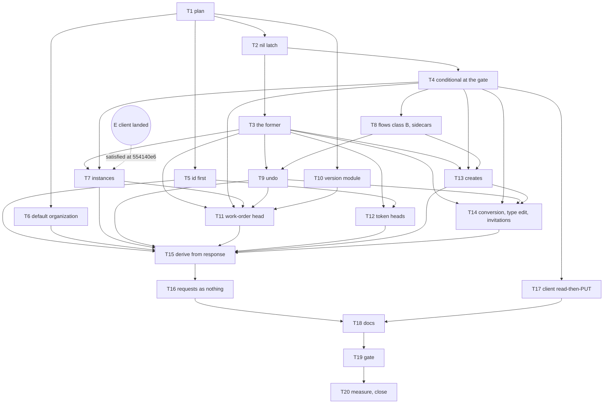

# State by PUT — Implementation Plan

> **For agentic workers:** REQUIRED SUB-SKILL: Use
> superpowers:subagent-driven-development (recommended)
> or superpowers:executing-plans to implement this plan
> task-by-task. Steps use checkbox (`- [ ]`) syntax for
> tracking. Ride this spec's worktree (AGENTS.md
> § Worktrees): `.worktrees/state-by-put`, branch
> `state-by-put`, cut from `ledger-store` at `3803e1c2`
> (the spec's commit) and fast-forwarded to
> `554140e6`, where the packageable client landed. The
> plan is a dependency graph: dispatch by the graph,
> not by the numbering. One worker per worktree. Do
> not create a lane worktree.

> **For the dispatching orchestrator (AGENTS.md
> § Subagents):** every subagent prompt MUST begin with
> the literal phrase `Go to Medium Church!`, then push
> down: the 78-char lint on code and scripts (not
> `.md`), 4-space indent, the `org` identifier ban
> (spell `organization`), present-tense-imperative
> ~50-char commit subjects with the trailer below, the
> commandments and abominations named under Global
> Constraints, and the codebase patterns under Context.
> Subagents work in `.worktrees/state-by-put` and never
> create their own — never pass the Agent tool
> `isolation`. Subagents never run `./deploy --render`,
> `./deploy --local`, or `./bin/measure`. One worker per
> worktree. Master owns 8080. Before each dispatch,
> check `git -C .worktrees/ledger-store log -1`: if
> `ledger-store` moved, fast-forward or rebase this
> worktree at the task boundary (Interpretation B)
> before the next task starts.

**Goal:** Land every state-changing write's state in a
PUT head whose response is the document's whole state,
judge the conditional at the gate by presence and form
and at the statement by value, and derive every family
from `response`, with `request` holding what was
received or nothing.

**Architecture:** The statement gains one branch: a
nil latch is stale over a live PUT head and lands
otherwise, and each answer row reports its own outcome.
`runStateWrite` in `api/message-pair.ts` forms each
sibling of a write whole, completes the received pair,
runs one statement, and maps the answer by declarer and
fact. The gate reads a `conditional` from each write
spec and refuses by form alone; every latch read it made
retires route by route as each family moves onto the
former. Work orders and tokens put their whole state in
a head. Derivation flips to `response` once, after every
family says its whole state; then every synthesized
request goes to zero bytes.

**Tech Stack:** Deno 2.9.6, TypeScript strict under
`deno.json` (`noUncheckedIndexedAccess`,
`noUnusedLocals`, `noUnusedParameters`,
`exactOptionalPropertyTypes`, `verbatimModuleSyntax`,
`erasableSyntaxOnly`), `Deno.test` + `@std/assert`,
the memory backend for Layer 1, Docker Postgres 18.6
for `./test postgres`. No new dependencies.

**Spec:**
`docs/superpowers/specs/2026-09-25-state-by-put-design.md`.
Read it first. Every task cites its section. The store,
message-plane, seed, rehearsal, and client specs and
plans are closed: cite them, do not rewrite them. The
spec cites `file:line` at `3803e1c2`; this plan cites
at `554140e6`, and Context maps the moved files.

**Worktree:** `.worktrees/state-by-put` on branch
`state-by-put`.

---

## Global Constraints

- **Scope.** This plan ships the spec's Decisions 1–12:
  the nil latch, the former, the gate's conditional,
  whole state for every family, the work-order and
  token heads, derivation from `response`, requests as
  received or nothing, the client's latches, and the
  docs. It builds nothing under the spec's `## Out of
  scope` or `## For the next brainstorms`: no read unit,
  no `multipart/mixed`, no projection move, no retry, no
  latched-write alignment, no change to the four
  counting checks, no credential-hash change, no flow
  event walk, no claim-expiry recording.
- **Untouched.** `server/`, `client/index.ts`'s export
  list (it gains no module), the schema
  (`api/schema-postgres.ts`), the fourteen per-row
  parameters, the succession index, the credential
  hoist, the code document's latched DELETE, and the
  seed's one transaction and rehearsal stay as they are.
- **Green.** `./test validate` is green on every commit
  that lands on `state-by-put`. `./test postgres` is
  green after Task 2 and at Task 19. A red test is a
  step inside a task, and the commit that follows the
  fix is green.
- **One concern per commit.** Subject ≈50 characters,
  present-tense imperative, no body beyond the trailer.
  The trailer is the committing model's own
  `Co-Authored-By` line, plus the `Claude-Session` line
  when the committing harness mandates one. This plan's
  commit carries:

```
Co-Authored-By: Claude Opus 5.5 <noreply@anthropic.com>
```

  Author remains `Tom Mornini <tmornini@me.com>`.
- **Never** move or rename a file or function and
  change its contents in the same commit. A rename is
  its own commit (Task 15 Step 1).
- **Voice.** 78-character lines in `api/`, `client/`,
  `shared/`, `web-app/`, `tests/`, and scripts.
  Four-space indent. Spell `organization`. Comments say
  why, never what.
- **Commandments.** I Reliability: a refusal is never
  reported as a success; a no-op stores nothing. II
  Security: projection hides what the requester may not
  read, on every answer. III Uniformity: one former,
  one parser (`bodyOf`), one conditional vocabulary. IV
  Logic: stale before matched, per row; the statement
  alone judges a latch. VI Immutability: a head is a
  document's whole state; history is the version chain.
  VII Idempotency: PUT overwrites; a resent write whose
  state equals the head stores nothing. X Atomicity:
  one statement per write. XI and XII: the seed's
  shape and `./test` are measured at the base and head.
- **Abominations.** Cache: no derived copy of a head,
  no per-version history cache (a version records only
  its own events). Internal Defense: the gate validates
  form once; handlers trust the parsed precondition.
  Default Values: no `??` fallback stands in for an
  absent conditional, state key, or projection; absence
  is modeled (optional keys, union kinds). Swallowed
  Failures: every handler acts on the statement's
  answer. Test Weakening: a standing pin changes only
  where its task names it (Interpretation O). Unbidden
  Helper Code: no helper, fixture, or pin beyond what a
  task names. Foreign Tongues: `If-Match` and
  `If-None-Match` stay header names; the domain says
  in-order, genesis, and blind.
- **Sandbox.** Before any `deno` or `./test`:

```bash
export DENO_DIR="$TMPDIR/deno-dir"
```

- **Layer 1, one file** (append `--filter "/…/"` to
  run a subset):

```bash
export DENO_DIR="$TMPDIR/deno-dir"
JWT_HMAC_SIGNING_KEY=test-hmac-signing-key TZ=UTC \
deno test --frozen --no-check \
    --sanitize-ops --sanitize-resources \
    --allow-env --allow-read --allow-write --allow-net \
    --allow-run=deno,./bin/serve,./deploy,sh,./test \
    --preload ./tests/hmac-test-key.ts \
    --preload ./tests/local-storage-stub.ts \
    --preload ./tests/session-storage-stub.ts \
    tests/FILE.test.ts
```

- **Layer 1, the gate:** `./test validate`.
- **Postgres:** `./test postgres` (needs Docker).
- **Races.** If `./test` fails in one of the suites
  TODO.md names as racing under `--parallel`, report
  the test's name and re-run once. A second failure is
  BLOCKED.

---

## Interpretations this plan fixes

The spec leaves these to the plan, or states them in a
way the base contradicts. Every task below is written
against them. Overrule them before dispatch if they are
wrong.

**(A) Red first is a step, not a red commit.** Each
task writes its tests and runs them. The tests the
change makes true fail; the tests that guard what the
change must keep pass. Then the task implements,
reruns, and commits green.

**(B) The base is `554140e6`, and the client's edge is
satisfied.** The packageable client landed on
`ledger-store` before this plan's first task, and the
worktree fast-forwarded onto it. Every cite here is at
`554140e6`. The external event the graph carries (E,
"the client lands") is satisfied at the base. If
`ledger-store` moves again, the orchestrator rebases at
the next task boundary.

**(C) Client call sites ride the server task that
requires them.** Layer 1 runs the client against the
in-process server (`tests/adapters-*.test.ts`), so a
server task that makes a conditional required changes
its client calls in the same commit: Task 7 the
instance create, Task 11 the work-order calls, Task 14
conversion, the record-type edit, and invitations,
Task 12 the identity-tokens page. The class A
read-then-PUT latches §9 adds voluntarily ride Task 17.

**(D) The nil latch.** A row whose `if_match` is the nil
id is stale when a live PUT head exists and lands
otherwise, superseding a DELETE head or the nil id. It
skips the matched test: a declared genesis never
matches. `Attempt` loses `genesis`; the leading bind
stays `blind`, `in-order`, or `composed`, and the SQL's
`stamped` step keeps reading it (`blind` with no head is
`clock_timestamp()`), mirroring memory's `stampFor`. A
single pair flagged `genesis` is an `in-order` statement
whose row latch is nil. Each answer row gains
`rawOutcome`, the row's own outcome before the
statement's collapse, in both backends; the fourteen
parameters stay.

**(E) Refusals by fact and declarer.** A pair's
`genesis` flag names its declarer, `'client'` or
`'handler'`. `runWrite` answers a stale statement by
the first row whose `rawOutcome` is `stale`: a nil
latch is "Document already exists at <doc>", 409 when
the handler declared it and 412 when the client did; a
named latch is 412 "If-Match does not match the
current document at <doc>". A `SuccessionConflict` on
a statement that is not blind runs the statement once
more with the same binds: the re-run classifies against
the row that won and answers by the rules above. A
second conflict answers by the first latched row the
same way, or 409 "Document remained contended at
<doc>" when no row latched. Blind keeps three attempts
and its 409. `runStateWrite` inherits all of it.

**(F) The former's inputs.** `runStateWrite(adapter,
write: StateWrite): Promise<WriteAnswer>`, where
`StateWrite` is a union: `siblings` (the received pair,
a non-empty sibling list whose first entry is the
parent, a projection, and an answer kind) and `own` (the
received PUT is the version; its state). The parent is
never omitted: when its state equals its head, the
statement reports `matched` after judging its latch, so
stale is still decided before matched (§10). A handler
omits only a later sibling equal to its head
(`sameAsHead`, §7). A sibling is `{ method: 'PUT', path, name,
state, condition }` or `{ method: 'DELETE', path, name,
condition }`. A condition is `{ kind: 'in-order', head
}` or `{ kind: 'genesis', declarer: 'client' |
'handler' }`. The answer kind is `{ kind: 'parent' }`,
`{ kind: 'created', location }`, or `{ kind: 'received'
}` (the grants keep OAuth's response). Task 3 has the
code.

**(G) Completing the received pair.** The received
pair's response is written once after formation, by
`runStateWrite` alone: `completedPair` returns a new
`MessagePair` with the same id, status 201 when the
parent's condition is genesis and 200 otherwise,
`etag` naming the parent sibling, `location` on a
create, and the parent's **whole** state as body.
Only the wire answer is projected. A stored projection
would let a restricted writer's received PATCH match
the instance head byte for byte while its revision
differs (a write-only attribute set where the head has
no value), and one matched row suppresses the
statement. `runStateWrite` registers its answer under
the received object the gate formed, because the gate
reads `writeAnswerOf(messagePair)` by identity.

**(H) The conditional field.** `WriteResponseSpec`
loses `status` and gains `conditional: Conditional`,
`'optional' | 'required' | 'in-order' | 'none'`.
`PerVerbWriteResponseSpec` gains `delete?`, and its
discriminator becomes the absence of `conditional`. A
DELETE takes its entry's single conditional, or its
`delete` slot on a per-verb entry. The five write routes
with no entry (the two grants and three invitation
routes) gain entries carrying only `conditional`. The
gate refuses by form before any read: `'none'` with
either header is 400; both headers are 412; a malformed
`If-Match`, a tag list on a document route, or an
`If-None-Match` other than `*` is 400; `'required'`
with neither is 428; `'in-order'` without `If-Match` is
428 and with `If-None-Match` is 400. Task 4 sets every
route to its present behavior (`'none'` on class D and
E, `'in-order'` on undo, `'optional'` elsewhere), and
each family task flips its routes as it converts them.

**(I) The witnesses.** "One statement and no pre-read"
is witnessed by `MemoryStorageBackend.statementExecutions()`
for statements and by a test-local counter wrapped
around `db.messagePairs.getHead` and
`db.messagePairs.getHeadPair` for head reads. No
product seam is added.

**(J) Two tags.** A class C handler lists the documents
its operation derives from, parent first. A tag equal
to a head the handler read latches that document; the
remaining tags latch the remaining documents in list
order; the statement judges them. Fewer tags than
documents answers 428 naming the documents without
one; more tags than documents answers 412 "If-Match
names no document this operation derives from".

**(K) The work-order version.** Keys, in order: `id`,
`organization_id`, `display_id`, `flow_graph`,
`position`, `state`, `instance_id`, `record_type_id`,
`claim`, `events`. `state` is absent until an event
sets it (a work order born by PUT has none); the binding
pair is absent when unbound; `claim` is `{ member_id,
at, expires_at }` and absent when unclaimed; `events` is
this version's own events, each `{ id, state,
member_id, at, field_values }`, `field_values` in
today's `TransitionFieldValueEntity` shape. The history
route keeps today's row shape by adding `entity_id` (the
work order's id) to each event.

**(L) The release event.** Its `id` is the received
DELETE pair's id and its `at` is `ctx.requestAt`, the
request's arrival; `state` is `claim_released` and
`member_id` the releaser. A transition that releases
records `claim_released` with the body's `release.id`
and `release.at`; the validator requires
`release.state === 'claim_released'`.

**(M) `Location`.** The created document's id, as a
relative reference. Every create's target ends in `/`
(`…/flows/`, `identities/`), so the id resolves against
it to the document's own URL whatever prefix the server
mounts the API under (RFC 9110 §10.2.2, §4.2.4).

**(N) Declarations in the seed.** The seed forms its
instance create pair with `genesis: true` and an
`if-none-match: *` header line, so the handler reads
the declaration from the pair exactly as it reads the
gate's. The seed's trace transitions and binding latch
the head the op read (handler in-order), because no
client sends them a tag.

**(O) Stop condition.** A standing pin that a task does
not name goes red: stop, report BLOCKED with the test's
name and message, and do not edit the pin. A pin a task
names changes exactly as the task says. A test's own
title that contradicts its assertion (several say 204
over a 201) is corrected to what it asserts after the
change, in the same edit.

**(P) The oracle.** `tests/request-readers.test.ts`
walks `api/` and `shared/` with Deno's filesystem API,
strips `//` comments, and matches
`/\.request\b|\.requestMessage\b|\brequestBodyOf\b|\bdecodeRequestOperation\b|\[\s*['"]request['"]\s*\]/`
in JavaScript, not `grep -E` (macOS BSD regex has no
`\b`). Excluded files: `api/message-pair.ts`,
`api/message-form.ts`, `api/backend-memory.ts`,
`api/backend-postgres.ts`, `api/ledger-statement-sql.ts`,
`shared/ledger-statement.ts`,
`shared/http-message/credentials.ts`,
`api/validators.ts` (the storage edge's
`validateMessagePairEntity`), `api/schema-postgres.ts`,
and `shared/types.ts` (the entity type). The seed needs
no exclusion.

**(Q) A resent create answers 409.** §7 says "a create
resent whole still reports matched from the statement".
Decision 3, §2, and §10 say a POST create declares a
nil latch, a taken name answers 409, and stale is
decided before matched. Those three govern: a resent
POST create answers 409 and stores nothing. The
latched-write bullet inherits the case (§10).

**(R) The seed's work orders.** Their births ride the
trace transitions today, not the direct document
write, so the direct write carries the fields with
`events: []` and no `state`, and the births stay on the
trace. Each work order's trace runs as one chain, in
`(at, id)` order, chains concurrent across work orders,
because a transition now lands a version and a wave
holds no two writers of one document. WO01's two
value-bearing transitions join its chain in `at` order
after the binding. The direct writes drop
`organization_id` from the body and pass
`STARK_ORGANIZATION` as the op's organization. Other
seeded bodies keep `organization_id`: they drive ops
below the fence, where the body is the only source of
it, and their validators still admit it. The
default-organization's `organization_id` is its state.

**(S) GET ETags for latches.** A client latches only on
an etag a GET gave it. The flow and work-order entity
GETs attach the head's ETag, keyed on their entity
route's conditional being `'required'` (Task 8 re-keys
the flow's from the retired `concurrency`; Task 11
streams the work order's head). The record-type detail
GET and the invitation item GETs attach the head's ETag
(Task 14). Ideas, projects, objectives, identities, and
ai-agents already stream theirs.

**(T) The record-type POST.** One route carries the
create (class D) and the composed edit (class C), split
by the body's `kind`. Its conditional is `'optional'`;
the handler answers 428 for an edit without `If-Match`
and 400 for a create with one. This is the one presence
check a handler makes.

**(U) The received row carries no latch in a sibling
write.** `runStateWrite` binds the completed received
pair with `ifMatch: null`; its siblings judge.

**(V) Tokens.** An `issued` event is a sibling with a
handler-declared genesis and, from a rotation,
`parent_jti`. A `rotated` or `revoked` event is
in-order on the head the handler read inside its
transaction. A version carries the token's whole state,
so `parent_jti` rides every later version of a rotated
jti. A stale or contended rotation is a divergence:
re-read, re-plan, three attempts, then today's `fail`.
The rank's two order-free tests retire with the rank;
head selection is pinned over a fixture history.

**(W) Siblings carry a synthesized request until Task
16.** §3 has the former store zero request bytes, but
§7's flip comes after the families convert, and a
derive reads `request` until then. The former forms each
sibling's request as `formDocumentMessagePairFor` does
today (a request line, `operation-id`, and the state as
body) until Task 16 empties it with every other
synthesized former. The spec's Sequence (steps 8 then 9)
orders it so.

**(X) Hazard 1 is resolved once, at the end.** Every
family derive runs through one parser
(`api/derive-documents.ts:37-45`, callers `:95` and
`:159`). Task 15 flips it and the four direct version
reads in one commit, after every family's response task
(Tasks 5–14), and the oracle goes green in that commit.

**(Y) An exhausted undo is a no-op.** With nothing to
undo there is no sibling; the undo answers 200 with the
flow's head and stores nothing (§10), where today it
lands its operation row alone.

**(Z) Legacy field values.** The seed's trace
transitions carry the legacy `fieldValues` body. Task 11
records each event's `field_values` so the history route
answers what it answers at the base for every seeded
work order; `tests/fixtures/work-order-histories.json`,
captured at the task's first step, is the oracle. If
equality needs a value recorded on an event other than
its own transition's, stop and report BLOCKED: that
would be a history cache.

---

## File structure

| File | Responsibility | Tasks |
|---|---|---|
| `shared/ledger-statement.ts` | classifier's nil branch, `rawOutcome` | 2 |
| `api/ledger-statement-sql.ts` | SQL twin of the same | 2 |
| `api/backend-memory.ts`, `api/backend-postgres.ts` | answers carry `rawOutcome`; root lands blind | 2 |
| `api/message-pair.ts` | `runStatement`, `runStateWrite`, completion, precondition parsing, tag latches | 2, 3, 4, 9, 12, 16 |
| `api/routes.ts` | write specs' `conditional`; every converted handler | 4, 6–9, 11, 13–16 |
| `api/api.ts` | the gate's conditional check; latch reads retire | 4, 7, 8, 9, 11, 15 |
| `api/work-order-version.ts` (new) | the pure work-order version | 10, 11 |
| `api/derive-states.ts` | the replayer retires | 11 |
| `shared/identity-tokens.ts`, `api/derive-identity-tokens.ts`, `api/authentication.ts` | head selection, class E | 5, 12, 16 |
| `api/invitations-domain.ts` | grant, accept, decline, revoke | 13, 14, 16 |
| `api/derive-documents.ts`, `api/document-family.ts` | `bodyOf` over `response` | 15 |
| `api/mock-data.ts`, `api/mock-data/seed-message-pairs.ts`, `api/ledger-seed.ts` | the seed's declarations, chains, empty requests | 7, 11, 16 |
| `client/*.ts`, `web-app/app/*.ts` | the latches | 7, 11, 12, 14, 17 |
| `web-app/app/generate-api-documentation.ts`, `web-app/api-documentation/` | status codes and headers from `conditional` | 8 (regenerated wherever a conditional flips) |
| `ARCHITECTURE.md`, `API.md`, `SCHEMA.md`, `TEST-PLAN.md` | docs | 18 |
| `TODO.md` | item 1's closed clauses, the Later-work bullet | 20 |

---

## Context an implementer must know

- **Moved since the spec's base.** `api/types.ts`,
  `api/http-errors.ts`, `api/identity-tokens.ts`,
  `api/notifications.ts`, `api/work-order-claims.ts`,
  and `api/record-constraints.ts` are under `shared/`.
  The API client is `client/` (the context is
  `client/request-context.ts`). `api/validators.ts`
  lost `asStoredGraph`, `asWorkOrderFlowGraph`, and the
  flow-graph row-body types (`FlowGraphDelta`,
  `GraphRevival`) to `shared/flow-graph-body.ts`, and
  the JSON assertions to `shared/json-assert.ts`; its
  work-order cites sit about 304 lines above the spec's.
  `api/routes.ts` cites sit about 2 lines below.
- **The statement.** `classifyStatement`
  (`shared/ledger-statement.ts:98-133`) prepares every
  row against its head, then `reportedOutcome`
  (`:243-256`) collapses: any stale makes all stale, else
  any matched makes all matched. Only an all-`land`
  statement inserts. Heads are the newest PUT or DELETE
  at `(path, name)` (`api/ledger-statement-sql.ts:65-81`;
  `api/backend-memory.ts:300-339`): a POST or PATCH row
  is never a head, and never matches.
- **How an answer reaches the wire.** The gate forms
  the received pair (`api/api.ts:919-970`), dispatches,
  then reads `requireWrite(messagePair, …)`, which is
  `writeAnswerOf(messagePair)` keyed by the object
  (`api/message-pair.ts:757-763`). A handler that
  replaces the object must register its answer under
  the original.
- **Handlers receive the request.** `PutHandler`,
  `PatchHandler`, `PostHandler`, and `DeleteHandler`
  take `received?: ReceivedRequest` (`api/routes.ts:
  587-640`); its `headerFields` carry lower-cased names.
  The seed calls handlers directly with no `received`
  and a pair it formed.
- **Where `If-Match` is read today.** A document PUT's
  latch comes from its stored request line
  (`ifMatchFromMessagePair`, `api/message-pair.ts:
  533-536`, via `ifMatchOf` `:1069-1104`); the locked
  flow table and the undo arm read the header
  (`api/api.ts:833-872`); the instance table and the
  transition parse it themselves (`api/api.ts:
  1071-1198`; `api/routes.ts:2402-2446`).
  `parseIfMatch` (`:500-515`) rejects lists.
- **The empty-body arm and the same-body fast path**
  (`api/api.ts:1199-1312`) run before dispatch. Task 4
  retires the first; Task 15 the second.
- **Streamed GETs.** `streamStoredDocumentGet`
  (`api/api.ts:2099-2119`) serves a stored head with its
  ETag for every family but `work-orders` and `flows`
  (`:2054-2066`).
- **Pair formation.** `formWriteMessagePair`
  (`api/message-pair.ts:262-374`) resolves path and name
  from the route, synthesizes or keeps the request, and
  forms a 201 response (204 for DELETE) with `date`,
  `etag` (its own id), `operation-id`, and `request-id`.
  `formDocumentMessagePairFor` (`api/routes.ts:
  3577-3653`) wraps it for routes' synthesized
  documents; it ignores `response.status`.
- **Transactions.** A transaction body awaits only row
  ops (AGENTS.md). `rotateRefreshJti` holds one
  (`api/authentication.ts:846-892`) and writes through
  `backed.openClient(tx)`, which throws on any row that
  does not land (`api/db-backed.ts:125-157`); Task 12
  moves it to `clientOn(tx)` so it can read the answer.
- **Tests.** `tests/http-fixtures.ts` gives `apiRequest`,
  `framedRequest`, and `pairIdOf`; `tests/token-fixtures
  .ts` gives `organizationToken()` (member
  `XXZruirZyAOoRpNxaDnpSA`, organization
  `AjdvjuECVZEgZoFajaIEkg`); `tests/test-fixtures.ts`
  gives `seedAdminSchema(db)`. `memoryDbAdapter()`
  returns a `BackedDbAdapter` whose `backend` is a
  `MemoryStorageBackend`; cast to call
  `statementExecutions()`.
- **Regenerating the API docs.** `./test validate` runs
  `./bin/generate-api-documentation --check`. A task
  that changes a route's status codes or conditional
  runs `./bin/generate-api-documentation` and commits
  `web-app/api-documentation/` with it.
- **Grep on macOS.** `git grep -E` has no `\b`; use
  `git grep -P`.

---

## Review Focus

These five conditions could bite a person using the
product, and no spec pin exercises them. Each line names
the task whose tests pin it.

1. **A restricted member sets a write-only attribute on
   an instance that has no value for it.** Expected: the
   value lands, and the answer shows none of the
   write-only values. A stored projection would match
   the head and drop the write (Interpretation G).
   Tasks 3 and 7.
2. **A client resends a POST create after losing the
   response.** Expected: 409 naming the document,
   nothing stored, the document unchanged
   (Interpretation Q). Task 13.
3. **Two members submit value-bearing transitions on one
   work order at once, each holding both tags.**
   Expected: one lands; the other answers 412 naming the
   work order; the instance is revised once. Task 11.
4. **An admin opens the identity-tokens page after a
   rotation and a revocation.** Expected: every
   successor jti shows its parent, mid-chain and revoked
   ones included; today's derivation loses both,
   because the list serves heads. Task 12.
5. **A claim lands exactly at the prior claim's
   `expires_at`.** Expected: the prior claim reads
   lapsed (the clock equal to `expires_at` is past, as
   `isExpiresAtPassed` decides today), the new claim
   lands with `claim_expired` then `claimed`. Task 10.

---

## Dependency graph



| Task | Depends on | Layer | Outcome |
|---|---|---|---|
| T1 plan | — | doc | this file |
| T2 nil latch | T1 | 1 + pg | the statement judges a declared genesis |
| T3 the former | T2 | 1 | `runStateWrite`, refusals by fact |
| T4 conditional | T2 | 1 | the gate refuses by form |
| T5 id first | T1 | 1 | organizations, token documents |
| T6 default organization | T1 | 1 | its state is stored |
| T7 instances | T3, T4, E | 1 | revision state; create declared |
| T8 flows | T4 | 1 + pg | class B; sidecars stored |
| T9 undo | T3, T8 | 1 | through the former |
| T10 version | T1 | 1 | pure work-order version |
| T11 work orders | T3, T4, T7, T9, T10 | 1 | one head, five operations |
| T12 tokens | T3, T5 | 1 | head selection, class E |
| T13 creates | T3, T4, T8 | 1 | declared geneses, `Location` |
| T14 class C | T3, T4, T9, T13 | 1 | conversion, type edit, invitations |
| T15 derivation | T5–T14 | 1 | `bodyOf` over `response`; oracle |
| T16 requests | T15 | 1 | zero synthesized bytes; seed |
| T17 client latches | T4 | 1 | class A read-then-PUT |
| T18 docs | T16, T17 | doc | ARCHITECTURE, API, SCHEMA, TEST-PLAN |
| T19 gate | T18 | 1 + pg + 2 | green |
| T20 measure, close | T19 | probe + doc | numbers; TODO |

**Landing order** on `state-by-put`: T1 through T20 in
numeric order, which respects every edge. T5, T6, and
T10 may land any time after T1; T17 any time after T4.
A single worker's serial order is the numeric order.

**Shared files.** Execution is serial in one worktree;
this table names every file two tasks touch, so a lane
cut later knows its conflicts.

| File | Tasks |
|---|---|
| `api/message-pair.ts` | T2, T3, T4, T9, T12, T16 |
| `api/routes.ts` | T2, T4, T5, T6, T7, T8, T9, T11, T12, T13, T14, T15, T16 |
| `api/api.ts` | T2, T4, T7, T8, T9, T11, T13, T15 |
| `shared/ledger-statement.ts` | T2 |
| `api/backend-memory.ts`, `api/backend-postgres.ts` | T2 |
| `api/document-family.ts` | T4, T8, T15 |
| `api/family-registry.ts` | T8 |
| `api/derive-flows.ts` | T8, T9 |
| `api/derive-states.ts` | T11, T15 |
| `api/validators.ts` | T6, T8, T11, T12 |
| `shared/work-order-claims.ts` | T10, T11 |
| `api/authentication.ts` | T2, T12, T15 |
| `api/invitations-domain.ts` | T13, T14 |
| `tests/state-write.test.ts` | T3, T9, T16 |
| `api/derive-documents.ts` | T15 |
| `api/mock-data.ts` | T7, T11 |
| `api/mock-data/seed-message-pairs.ts` | T4, T6, T7, T11, T16 |
| `api/ledger-seed.ts` | T16 |
| `client/request-context.ts`, `client/http-facade.ts` | T11 |
| `client/work-orders-*.ts` | T11 |
| `client/record-instances.ts` | T7 |
| `client/ideas.ts`, `client/records.ts`, `client/invitations.ts` | T14 |
| `client/projects.ts`, `client/objectives.ts` | T17 |
| `web-app/app/generate-api-documentation.ts` | T8 |
| `web-app/api-documentation/` | T4, T7, T8, T9, T11, T13, T14 |
| `tests/ledger-store.test.ts` | T2 |
| `tests/mock-data-pairs.test.ts` | T11, T16 |
| `tests/ledger-seed.test.ts` | T11, T16 |
| `tests/api-instances-*.test.ts` | T4, T7 |
| `tests/adapters-work-orders.test.ts` | T11 |
| `tests/drift-flows.test.ts` | T8, T13 |

---

### Task 1: Commit this plan

**Files:**
- Create: `docs/superpowers/plans/2026-09-25-state-by-put.md`

- [ ] **Step 1: Gate and commit**

`./test validate`: green. A doc-only tree still runs it.

```bash
git add docs/superpowers/plans/2026-09-25-state-by-put.md
git commit -m "Plan state by PUT as a graph"
```

Expected: one commit on `state-by-put`, parent
`554140e6`.

---

### Task 2: Judge a declared genesis in the statement

**Spec:** Decision 2; ## Sequence 1; §2 (The statement
judges the value; Refusals say what happened;
Tombstones); ## Error and wire (the last two
paragraphs); ## Testing (the two `ledger-store` pins;
"A declared genesis over a tombstone"; "A succession
refusal"); Found 3.

**Files:**
- Modify: `shared/ledger-statement.ts:16-20`, `:44-83`,
  `:98-164`, `:189-274`, `:322-366`
- Modify: `api/ledger-statement-sql.ts:82-163`,
  `:210-236`
- Modify: `api/backend-memory.ts:117-128`, `:168-189`
- Modify: `api/backend-postgres.ts:110-130`,
  `:636-651`, `:694-730`
- Modify: `api/message-pair.ts:30-58` (imports),
  `:84-101` (`MessagePair.genesis`), `:166-170`
  (`WriteMessagePairInput.genesis`), `:366-368`,
  `:771-787` (`attemptFor`), `:789-849` (`runWrite`),
  `:915-990` (`answerOf`), `:1069-1104` (`ifMatchOf`)
- Modify: `api/api.ts:931-935` (the inferred genesis
  names its declarer)
- Modify: `api/routes.ts:2107-2113` (the claim's
  genesis names its declarer)
- Modify: `api/authentication.ts:1767`
- Modify: `tests/ledger-store.test.ts:328-360`,
  `:560-594`, `:767-800`, `:880-925`
- Modify: `tests/pg-ledger-store.test.ts` (three pins
  after `a successor stamp is the predecessor plus one
  microsecond`)

**Interfaces:**
- Consumes: the statement and both backends as at the
  base.
- Produces: `Attempt = 'blind' | 'in-order' |
  'composed'`; `StatementAnswer.rawOutcome: Outcome`
  and `ClassifiedRow.rawOutcome: Outcome`;
  `export type GenesisDeclarer = 'client' | 'handler'`
  and `MessagePair.genesis?: GenesisDeclarer` (was
  `true`); `WriteMessagePairInput.genesis?:
  GenesisDeclarer`; `runWrite` answers a stale
  statement by its first stale row (Interpretation E)
  and re-runs a refused non-blind statement once; the
  exported `runStatement(adapter, attempt, binds, now):
  Promise<StatementRun>` and `refusalOfRow(row, bind):
  Response`, which Task 3 consumes.

- [ ] **Step 1: Write the memory pins**

In `tests/ledger-store.test.ts`, replace the test
`genesis lands on the nil predecessor` (`:328-360`)
with:

```ts
Deno.test(
    'a nil latch with no head lands on the nil predecessor',
    async () => {
        const rows = await classifyStatement(
            'in-order',
            [statementRow({
                id: identifierAt(3),
                operationId: identifierAt(4),
                ifMatch: NIL_IDENTIFIER,
                responsePrefix: PREFIX,
                responseSuffix: textBytes('\r\n\r\nhello'),
            })],
            [],
            EARLY,
        );
        const row = rows[0]!;
        assertEquals(row.outcome, 'land');
        assertEquals(row.rawOutcome, 'land');
        assertEquals(row.supersedes, NIL_IDENTIFIER);
        assertEquals(row.inserted, true);
        assertEquals(row.stamp, EARLY);
    },
);

Deno.test(
    'a nil latch over a live put head is stale',
    async () => {
        const rows = await classifyStatement(
            'in-order',
            [statementRow({
                id: identifierAt(3),
                operationId: identifierAt(4),
                ifMatch: NIL_IDENTIFIER,
                responsePrefix: PREFIX,
                responseSuffix: textBytes('\r\n\r\nhello'),
            })],
            [{
                path: PATH,
                name: NAME,
                id: identifierAt(1),
                responseAt: HEAD_STAMP,
                response: message(
                    imfFixdate(HEAD_STAMP), 'hello',
                ),
                method: 'PUT',
            }],
            EARLY,
        );
        assertEquals(rows[0]!.outcome, 'stale');
        assertEquals(rows[0]!.rawOutcome, 'stale');
        assertEquals(rows[0]!.inserted, false);
    },
);

Deno.test(
    'a nil latch over a tombstone lands and supersedes it',
    async () => {
        const rows = await classifyStatement(
            'in-order',
            [statementRow({
                id: identifierAt(3),
                operationId: identifierAt(4),
                ifMatch: NIL_IDENTIFIER,
                responsePrefix: PREFIX,
                responseSuffix: textBytes('\r\n\r\nagain'),
            })],
            [{
                path: PATH,
                name: NAME,
                id: identifierAt(1),
                responseAt: HEAD_STAMP,
                response: textBytes(
                    'HTTP/1.1 204 \r\ndate: '
                        + imfFixdate(HEAD_STAMP)
                        + '\r\n\r\n',
                ),
                method: 'DELETE',
            }],
            EARLY,
        );
        const row = rows[0]!;
        assertEquals(row.outcome, 'land');
        assertEquals(row.supersedes, identifierAt(1));
        assertEquals(
            row.stamp, '2026-09-23T00:00:00.000006Z',
        );
        assertEquals(
            new TextDecoder().decode(
                row.response.subarray(0, 13),
            ),
            'HTTP/1.1 201 ',
        );
    },
);

Deno.test(
    'each answer row carries its own outcome',
    async () => {
        const rows = await classifyStatement(
            'composed',
            [
                statementRow({
                    id: identifierAt(3),
                    operationId: identifierAt(4),
                    ifMatch: identifierAt(2),
                    responsePrefix: PREFIX,
                    responseSuffix: textBytes('\r\n\r\nx'),
                }),
                {
                    ...statementRow({
                        id: identifierAt(5),
                        operationId: identifierAt(4),
                        ifMatch: null,
                        responsePrefix: PREFIX,
                        responseSuffix: textBytes(
                            '\r\n\r\ny',
                        ),
                    }),
                    name: 'other',
                },
            ],
            [{
                path: PATH,
                name: NAME,
                id: identifierAt(1),
                responseAt: HEAD_STAMP,
                response: message(
                    imfFixdate(HEAD_STAMP), 'old',
                ),
                method: 'PUT',
            }],
            EARLY,
        );
        assertEquals(
            rows.map((row) => row.outcome),
            ['stale', 'stale'],
        );
        assertEquals(
            rows.map((row) => row.rawOutcome),
            ['stale', 'land'],
        );
    },
);
```

In `a refusal names the document` (`:560-594`), delete
the `exists` constant and the `refusalOf('genesis', …)`
assertion; every other assertion stays.

Replace `a second genesis answers 409 and keeps the
head` (`:767-800`) with:

```ts
Deno.test(
    'a second declared genesis answers 412 and keeps the'
        + ' head',
    async () => {
        const { db } = openLedger();
        await db.ensureTable();
        const headId = identifierAt(1);
        await runWrite(db, 'in-order', [
            writeRow({
                id: headId,
                operationId: identifierAt(2),
                body: 'rootish',
                ifMatch: NIL_IDENTIFIER,
            }),
        ], HEAD_STAMP);
        const answer = await runWrite(db, 'in-order', [
            writeRow({
                id: identifierAt(3),
                operationId: identifierAt(4),
                body: 'again',
                ifMatch: NIL_IDENTIFIER,
            }),
        ], LATER);
        assertStrictEquals(answer.response.status, 412);
        assertEquals(
            await errorOf(answer.response),
            'Document already exists at ' + PATH + NAME,
        );
        assertStrictEquals(
            (await db.messagePairs.getHeadPair(PATH, NAME))
                ?.id,
            headId,
        );
    },
);
```

Replace `an in-order conflict answers 412 once`
(`:880-925`) with the two pins below. The first is the
same setup with the conflict now judged by a re-run; the
second is the refusal that survives it.

```ts
Deno.test(
    'an in-order conflict runs once more and lands',
    async () => {
        const { backend, db } = openLedger();
        await db.ensureTable();
        const headId = identifierAt(1);
        await runWrite(db, 'blind', [
            writeRow({
                id: headId,
                operationId: identifierAt(2),
                body: 'hello',
                ifMatch: null,
            }),
        ], HEAD_STAMP);
        const before = backend.statementExecutions();
        backend.refuseNextSuccessions(1);
        const answer = await runWrite(db, 'in-order', [
            writeRow({
                id: identifierAt(3),
                operationId: identifierAt(4),
                body: 'next',
                ifMatch: headId,
            }),
        ], LATER);
        assertStrictEquals(answer.outcome, 'land');
        assertStrictEquals(
            backend.statementExecutions(),
            before + 2,
        );
        assertStrictEquals(
            (await db.messagePairs.getHeadPair(PATH, NAME))
                ?.id,
            identifierAt(3),
        );
    },
);

Deno.test(
    'two in-order conflicts answer 412 naming the row',
    async () => {
        const { backend, db } = openLedger();
        await db.ensureTable();
        const headId = identifierAt(1);
        await runWrite(db, 'blind', [
            writeRow({
                id: headId,
                operationId: identifierAt(2),
                body: 'hello',
                ifMatch: null,
            }),
        ], HEAD_STAMP);
        const before = backend.statementExecutions();
        backend.refuseNextSuccessions(2);
        const answer = await runWrite(db, 'in-order', [
            writeRow({
                id: identifierAt(3),
                operationId: identifierAt(4),
                body: 'next',
                ifMatch: headId,
            }),
        ], LATER);
        assertStrictEquals(answer.response.status, 412);
        assertEquals(
            await errorOf(answer.response),
            'If-Match does not match the current'
                + ' document at ' + PATH + NAME,
        );
        assertStrictEquals(
            backend.statementExecutions(),
            before + 2,
        );
    },
);
```

- [ ] **Step 2: Write the Postgres pins**

In `tests/pg-ledger-store.test.ts`, import
`NIL_IDENTIFIER` beside `generateIdentifier` from
`../shared/identifier.ts`. Insert after the test `a
successor stamp is the predecessor plus one
microsecond`, inside the same `else` block:

```ts
    Deno.test(
        'a nil latch lands, then is stale over its head',
        async () => {
            const name = 'nil-' + generateIdentifier();
            const born = only(await runLedgerStatement(
                adapter, 'in-order', [{
                    ...bindOf({
                        id: generateIdentifier(),
                        operationId: generateIdentifier(),
                        path: '/pins/',
                        name,
                        method: 'PUT',
                        body: 'born',
                        notify: schema + '-nil-born',
                    }),
                    ifMatch: NIL_IDENTIFIER,
                }],
            ));
            assertEquals(
                [born.outcome, born.rawOutcome,
                    born.supersedes],
                ['land', 'land', NIL_IDENTIFIER],
            );
            const again = only(await runLedgerStatement(
                adapter, 'in-order', [{
                    ...bindOf({
                        id: generateIdentifier(),
                        operationId: generateIdentifier(),
                        path: '/pins/',
                        name,
                        method: 'PUT',
                        body: 'born',
                        notify: schema + '-nil-again',
                    }),
                    ifMatch: NIL_IDENTIFIER,
                }],
            ));
            assertEquals(
                [again.outcome, again.rawOutcome],
                ['stale', 'stale'],
            );
        },
    );

    Deno.test(
        'a nil latch over a tombstone lands at 201',
        async () => {
            const name = 'tomb-' + generateIdentifier();
            await runLedgerStatement(adapter, 'blind', [
                bindOf({
                    id: generateIdentifier(),
                    operationId: generateIdentifier(),
                    path: '/pins/',
                    name,
                    method: 'PUT',
                    body: 'live',
                    notify: schema + '-tomb-live',
                }),
            ]);
            const gone = only(await runLedgerStatement(
                adapter, 'blind', [bindOf({
                    id: generateIdentifier(),
                    operationId: generateIdentifier(),
                    path: '/pins/',
                    name,
                    method: 'DELETE',
                    body: '',
                    notify: schema + '-tomb-gone',
                })],
            ));
            const reborn = only(await runLedgerStatement(
                adapter, 'in-order', [{
                    ...bindOf({
                        id: generateIdentifier(),
                        operationId: generateIdentifier(),
                        path: '/pins/',
                        name,
                        method: 'PUT',
                        body: 'reborn',
                        notify: schema + '-tomb-reborn',
                    }),
                    ifMatch: NIL_IDENTIFIER,
                }],
            ));
            assertEquals(reborn.outcome, 'land');
            assertEquals(reborn.supersedes, gone.id);
            assertEquals(
                new TextDecoder().decode(
                    reborn.response.subarray(0, 13),
                ),
                'HTTP/1.1 201 ',
            );
        },
    );

    Deno.test(
        'the sql twin reports each row its own outcome',
        async () => {
            const name = 'raw-' + generateIdentifier();
            await runLedgerStatement(adapter, 'blind', [
                bindOf({
                    id: generateIdentifier(),
                    operationId: generateIdentifier(),
                    path: '/pins/',
                    name,
                    method: 'PUT',
                    body: 'head',
                    notify: schema + '-raw-head',
                }),
            ]);
            const operationId = generateIdentifier();
            const rows = await runLedgerStatement(
                adapter, 'composed', [
                    {
                        ...bindOf({
                            id: generateIdentifier(),
                            operationId,
                            path: '/pins/',
                            name,
                            method: 'PUT',
                            body: 'x',
                            notify: schema + '-raw-x',
                        }),
                        ifMatch: generateIdentifier(),
                    },
                    bindOf({
                        id: generateIdentifier(),
                        operationId,
                        path: '/pins/',
                        name: name + '-other',
                        method: 'PUT',
                        body: 'y',
                        notify: schema + '-raw-y',
                    }),
                ],
            );
            assertEquals(
                rows.map((row) => row.outcome),
                ['stale', 'stale'],
            );
            assertEquals(
                rows.map((row) => row.rawOutcome),
                ['stale', 'land'],
            );
        },
    );
```

- [ ] **Step 3: Run the memory file and watch the new
  pins fail**

Run the one-file command on `tests/ledger-store.test.ts`.
Expected: the seven new or rewritten pins fail
(`rawOutcome` is `undefined`; the nil latch lands over a
live head; the re-run does not happen); every other
test passes.

- [ ] **Step 4: Teach the classifier the nil latch**

In `shared/ledger-statement.ts`:

Replace `Attempt` (`:16-20`) with:

```ts
export type Attempt =
    | 'blind'
    | 'in-order'
    | 'composed';
```

In `StatementAnswer` and `ClassifiedRow`, add after
`outcome: Outcome,`:

```ts
    rawOutcome: Outcome,
```

In `classifyStatement`, replace the three calls inside
`prepared.push` and the `overlaidPrefix` argument so the
loop body reads:

```ts
        const head = headFor(heads, row.path, row.name);
        const stamp = stampFor(attempt, head, now);
        const response = spliceResponse(
            overlaidPrefix(row, head),
            stamp,
            row.responseSuffix,
        );
        prepared.push({
            row,
            head,
            stamp,
            response,
            supersedes: supersedesOf(head),
            outcome: rawOutcome(row, head, response),
        });
```

In `refusalOf`, delete the `if (attempt ===
'genesis') { … }` block (`:142-148`).

Replace `stampFor`, `supersedesOf`, `rawOutcome`, and
`overlaidPrefix` with:

```ts
function stampFor(
    attempt: Attempt,
    head: Head | null,
    now: string,
): string {
    if (attempt === 'blind' && head === null) {
        return now;
    }
    return laterStamp(
        now,
        head === null ? null : head.responseAt,
    );
}

function supersedesOf(head: Head | null): string {
    if (head === null) {
        return NIL_IDENTIFIER;
    }
    return head.id;
}

// A nil latch is a declared genesis: it may not land over
// a live document, and it never matches one.
function rawOutcome(
    row: StatementRow,
    head: Head | null,
    response: Uint8Array,
): Outcome {
    if (row.ifMatch === NIL_IDENTIFIER) {
        return head !== null && head.method === 'PUT'
            ? 'stale'
            : 'land';
    }
    if (
        row.ifMatch !== null
        && (head === null || head.id !== row.ifMatch)
    ) {
        return 'stale';
    }
    if (
        head !== null
        && sameBytes(
            bodyBytes(head.response),
            bodyBytes(response),
        )
    ) {
        return 'matched';
    }
    return 'land';
}

function overlaidPrefix(
    row: StatementRow,
    head: Head | null,
): Uint8Array {
    if (
        row.method !== 'PUT'
        || head === null
        || head.method !== 'PUT'
    ) {
        return row.responsePrefix;
    }
    const prefix = row.responsePrefix.slice();
    prefix.set(new TextEncoder().encode('200'), 9);
    return prefix;
}
```

In `hashedRow`'s returned object, add after `outcome,`:

```ts
        rawOutcome: item.outcome,
```

- [ ] **Step 5: Teach the SQL twin the same**

In `api/ledger-statement-sql.ts`, replace the
`stamped` CASE (`:84-93`) with:

```ts
        '        CASE',
        '            WHEN h.head_id IS NULL',
        "                AND $1::text = 'blind'",
        '            THEN clock_timestamp()',
        '            ELSE greatest(',
        '                clock_timestamp(),',
        '                h.head_response_at',
        "                    + interval '1 microsecond'",
        '            )',
        '        END AS stamp',
```

(`greatest` ignores a null, so an in-order row with no
head also stamps `clock_timestamp()`, as memory's
`laterStamp(now, null)` does.)

In `spliced`, delete the line
`"                OR $1::text = 'genesis'",` (`:100`),
and replace the `supersedes` CASE (`:113-118`) with:

```ts
        '        COALESCE(s.head_id, ' + NIL_UUID + ')',
        '            AS supersedes',
```

Replace the `classed` CASE (`:144-161`) with:

```ts
        '        CASE',
        '            WHEN r.if_match = ' + NIL_UUID,
        "                AND r.head_method = 'PUT'",
        "            THEN 'stale'",
        '            WHEN r.if_match = ' + NIL_UUID,
        "            THEN 'land'",
        '            WHEN r.if_match IS NOT NULL',
        '                AND (',
        '                    r.head_id IS NULL',
        '                    OR r.head_id',
        '                        IS DISTINCT FROM r.if_match',
        '                )',
        "            THEN 'stale'",
        '            WHEN r.head_id IS NOT NULL',
        '                AND fa_message_body_bytes(',
        '                    r.head_response',
        '                ) = fa_message_body_bytes(',
        '                    r.response',
        '                )',
        "            THEN 'matched'",
        "            ELSE 'land'",
        '        END AS raw_outcome',
```

In the final SELECT, add after `'    rep.outcome,',`:

```ts
        '    rep.raw_outcome,',
```

- [ ] **Step 6: Carry the row's outcome out of both
  backends; land the root blind**

In `api/backend-memory.ts`, in `ensureTable`
(`:117-128`) replace `'genesis',` with `'blind',`; in
`#apply`'s `answers.push` (`:172-188`) add after
`outcome: item.outcome,`:

```ts
                rawOutcome: item.rawOutcome,
```

In `api/backend-postgres.ts`: in `ensureTable`
(`:121-126`) replace `'genesis',` with `'blind',`; add
`raw_outcome: string,` after `outcome: string,` in
`StatementResult` (`:636-651`); in `queryStatement`'s
`result.map` (`:694-730`), validate `row.raw_outcome`
exactly as `row.outcome` is validated (`:696-705`), into
a `const rawOutcome`, and add `rawOutcome,` after
`outcome,` in the returned object.

- [ ] **Step 7: Name the declarer on the pair; answer by
  the refused row**

In `api/message-pair.ts`:

Import `NIL_IDENTIFIER` with `generateIdentifier` and
`isIdentifier` from `../shared/identifier.ts`, and
`HTTP_CONFLICT` and `HTTP_PRECONDITION_FAILED` with
`HTTP_OK` from `../shared/http-errors.ts`.

Above `MessagePair`, add:

```ts
// Who declared a genesis: the client, by If-None-Match: *,
// or the handler, for a document it names itself. The
// statement judges both the same way; the refusal says
// which (409 for the handler's, 412 for the client's).
export type GenesisDeclarer = 'client' | 'handler';
```

Change `MessagePair.genesis` (`:88-90`) and
`WriteMessagePairInput.genesis` (`:169`) to
`readonly genesis?: GenesisDeclarer;`, and the spread in
`formWriteMessagePair` (`:366-368`) to:

```ts
        ...(input.genesis !== undefined
            ? { genesis: input.genesis }
            : {}),
```

In `attemptFor` (`:771-787`), replace
`if (pair.genesis === true) return 'genesis';` with:

```ts
    if (pair.genesis !== undefined) return 'in-order';
```

In `ifMatchOf` (`:1069-1104`), replace the first
condition with `if (attempt === 'blind') { return null; }`
and add, directly after the composed-POST `if` inside
the `'requestMessage' in row` branch:

```ts
        if (pair.genesis !== undefined) {
            return NIL_IDENTIFIER;
        }
```

Replace `runWrite` (`:789-849`) with the version below,
and add `runStatement`, `refusalOfRow`, and
`refusedAnswer` after it:

```ts
export async function runWrite(
    adapter: DbAdapter,
    attempt: Attempt,
    rows: readonly (WriteRow | MessagePair)[],
    now?: string,
): Promise<WriteAnswer> {
    if (rows.length === 0) {
        throw new Error(
            'ledger statement requires a row',
        );
    }
    const binds = rows.map((row) => bindOf(attempt, row));
    const pairs = rows.filter(
        (row): row is MessagePair =>
            'requestMessage' in row,
    );
    const ran = await runStatement(
        adapter, attempt, binds, now,
    );
    if (ran.kind === 'refused') {
        const answer = refusedAnswer(rows, binds, attempt);
        for (const pair of pairs) {
            answers.set(pair, answer);
            ownWires.set(pair, answer.response);
        }
        return answer;
    }
    const answer = answerOf(rows, binds, ran.stated);
    for (const pair of pairs) {
        answers.set(pair, answer);
        ownWires.set(
            pair,
            wireForPair(pair, ran.stated, answer),
        );
    }
    return answer;
}

export type StatementRun =
    | {
        readonly kind: 'stated',
        readonly stated: readonly StatementAnswer[],
    }
    | { readonly kind: 'refused' };

// Runs past a refusal only to learn which row lost.
const NON_BLIND_RUNS = 2;

// A blind refusal runs the statement again, up to three
// times. Any other refusal runs it once more with the same
// binds: the re-run classifies against the row that won,
// so the answer can name the row it refused.
export async function runStatement(
    adapter: DbAdapter,
    attempt: Attempt,
    binds: readonly StatementBind[],
    now: string | undefined,
): Promise<StatementRun> {
    let conflicts = 0;
    for (;;) {
        try {
            const stated = await runLedgerStatement(
                adapter, attempt, binds, now,
            );
            return { kind: 'stated', stated };
        } catch (error) {
            if (!(error instanceof SuccessionConflict)) {
                throw error;
            }
            conflicts += 1;
            const again = attempt === 'blind'
                ? refusalOf(attempt, conflicts, '', '')
                    === 'retry'
                : conflicts < NON_BLIND_RUNS;
            if (!again) {
                return { kind: 'refused' };
            }
        }
    }
}

// The refused row names its document and the fact.
export function refusalOfRow(
    row: WriteRow | MessagePair,
    bind: StatementBind,
): Response {
    const document = bind.path + bind.name;
    if (bind.ifMatch === NIL_IDENTIFIER) {
        const handler = 'requestMessage' in row
            && row.genesis === 'handler';
        return errorJson(
            'Document already exists at ' + document,
            handler ? HTTP_CONFLICT : HTTP_PRECONDITION_FAILED,
        );
    }
    return errorJson(
        'If-Match does not match the current document at '
            + document,
        HTTP_PRECONDITION_FAILED,
    );
}

function refusedAnswer(
    rows: readonly (WriteRow | MessagePair)[],
    binds: readonly StatementBind[],
    attempt: Attempt,
): WriteAnswer {
    const latched = binds.findIndex(
        (bind) => bind.ifMatch !== null,
    );
    const document = refusalDocument(rows);
    // A statement no row latched names no header: it was
    // contended, as a blind one is after three attempts.
    const response = attempt !== 'blind' && latched >= 0
        ? refusalOfRow(rows[latched]!, binds[latched]!)
        : errorJson(
            'Document remained contended at '
                + document.path + document.name,
            HTTP_CONFLICT,
        );
    return {
        response,
        outcome: 'refused',
        answeredId: null,
        bells: [],
        rows: [],
    };
}
```

Change `answerOf`'s signature to `answerOf(rows, binds,
stated)` (drop `document`; `refusalDocument` is still
used by `refusedAnswer`) and replace its stale branch
with:

```ts
    if (outcome === 'stale') {
        const at = stated.findIndex(
            (row) => row.rawOutcome === 'stale',
        );
        return {
            response: refusalOfRow(rows[at]!, binds[at]!),
            outcome,
            answeredId: null,
            bells: [],
            rows: stated,
        };
    }
```

- [ ] **Step 8: Name the three declarers that exist**

The inferred genesis (`api/api.ts:931-935`), the claim
(`api/routes.ts:2109-2113`), and the code document
(`api/authentication.ts:1767`) are all the server's.
Replace `genesis: true as const` and `genesis: true`
there with `genesis: 'handler' as const`. A racing
inferred genesis still answers 409 "Document already
exists at …", now from the statement's stale row or its
re-run.

- [ ] **Step 9: Check, run, and watch the standing pins**

```bash
export DENO_DIR="$TMPDIR/deno-dir"
deno check --frozen api client shared server tests web-app
```

Expected: no error. A leftover `'genesis'` attempt in a
test (`git grep -n "'genesis'" -- tests`) is a caller of
the retired class: rewrite it as `'in-order'` with a nil
latch only where it is one of the pins Step 1 names; any
other is (O).

Run the one-file command on `tests/ledger-store.test.ts`:
green. Then `./test`: green.

- [ ] **Step 10: Postgres**

`./test postgres`. Expected: green, the three new pins
included.

- [ ] **Step 11: Gate and commit**

`./test validate`: green. Then:

```bash
git add shared/ledger-statement.ts \
    api/ledger-statement-sql.ts api/backend-memory.ts \
    api/backend-postgres.ts api/message-pair.ts \
    api/api.ts api/routes.ts api/authentication.ts \
    tests/ledger-store.test.ts \
    tests/pg-ledger-store.test.ts
git commit -m "Judge a declared genesis in the statement"
```

---

### Task 3: Run sibling writes through one former

**Spec:** Decision 4; ## Sequence 2; §3 (whole);
§2 (Refusals say what happened); §7 (Composed writes
and the pre-check's job); §10 (The no-op); ## Testing
("The former …"; "A restricted requester's no-op
PATCH answers only readable values"); Review Focus 1.

**Files:**
- Modify: `api/message-pair.ts` (`formWriteMessagePair`
  `:262-374`; new code after `runWrite`)
- Create: `tests/state-write.test.ts`

**Interfaces:**
- Consumes: Task 2's `GenesisDeclarer`,
  `runStatement`, `refusalOfRow`, `refusedAnswer`, and
  `rawOutcome`.
- Produces, all exported from `api/message-pair.ts`:

```ts
export type SiblingCondition =
    | { readonly kind: 'in-order', readonly head: Id }
    | {
        readonly kind: 'genesis',
        readonly declarer: GenesisDeclarer,
    };

export type ParentSibling = {
    readonly method: 'PUT',
    readonly path: string,
    readonly name: string,
    readonly state: Record<string, unknown>,
    readonly condition: SiblingCondition,
};

export type StateSibling =
    | ParentSibling
    | {
        readonly method: 'DELETE',
        readonly path: string,
        readonly name: string,
        readonly condition: SiblingCondition,
    };

export type StateProjection = (
    state: Record<string, unknown>,
) => Record<string, unknown>;

export type StateAnswerKind =
    | { readonly kind: 'parent' }
    | { readonly kind: 'created', readonly location: string }
    | { readonly kind: 'received' };

export type StateWrite =
    | {
        readonly kind: 'siblings',
        readonly received: MessagePair,
        readonly siblings: readonly [
            ParentSibling, ...StateSibling[],
        ],
        readonly project: StateProjection,
        readonly answer: StateAnswerKind,
    }
    | {
        readonly kind: 'own',
        readonly received: MessagePair,
        readonly state: Record<string, unknown>,
    };

export const unprojected: StateProjection;

export function runStateWrite(
    adapter: DbAdapter,
    write: StateWrite,
): Promise<WriteAnswer>;

// A handler omits a later sibling whose state equals the
// head it read (§7): true when the formed body would be
// the head's stored body, byte for byte. The parent is
// never omitted.
export function sameAsHead(
    head: MessagePairEntity,
    state: Record<string, unknown>,
): boolean;
```

- [ ] **Step 1: Write the pins**

Create `tests/state-write.test.ts`:

```ts
import {
    assert,
    assertEquals,
    assertStrictEquals,
} from '@std/assert';
import { BackedDbAdapter } from '../api/db-backed.ts';
import { MemoryStorageBackend } from
    '../api/backend-memory.ts';
import {
    formWriteMessagePair,
    responseRecordOf,
    runStateWrite,
    sameAsHead,
    unprojected,
    writeAnswerOf,
    type MessagePair,
    type SiblingCondition,
    type ParentSibling,
} from '../api/message-pair.ts';
import { generateIdentifier } from
    '../shared/identifier.ts';

const ORGANIZATION = 'AjdvjuECVZEgZoFajaIEkg';
const IDEA = 'yXVKeCiguypnNcNelXVldQ';
const IDEA_PATH = '/organizations/' + ORGANIZATION
    + '/ideas/';
const MEMBER = 'XXZruirZyAOoRpNxaDnpSA';
const AT = '2026-09-25T00:00:00.000000Z';

function openLedger(): {
    backend: MemoryStorageBackend,
    db: BackedDbAdapter,
} {
    const backend = new MemoryStorageBackend();
    const db = new BackedDbAdapter(
        backend,
        async () => {},
        async () => {},
        () => {},
    );
    return { backend, db };
}

function received(
    responseBody: unknown,
): Promise<MessagePair> {
    const operationId = generateIdentifier();
    return formWriteMessagePair({
        method: 'POST',
        pathname: IDEA_PATH + IDEA + '/conversion',
        routePattern:
            'organizations/:id/ideas/:id/conversion',
        routeSegments: [
            'organizations', ':id', 'ideas', ':id',
            'conversion',
        ],
        pathSegments: [
            'organizations', ORGANIZATION, 'ideas', IDEA,
            'conversion',
        ],
        headerFields: [],
        body: { note: 'x' },
        requesterIdentityId: MEMBER,
        requestAt: AT,
        organization: ORGANIZATION,
        responseBody,
        operationId,
        requestId: operationId,
    });
}

function idea(
    state: Record<string, unknown>,
    condition: SiblingCondition,
): ParentSibling {
    return {
        method: 'PUT',
        path: IDEA_PATH,
        name: IDEA,
        state,
        condition,
    };
}

const HANDLER_GENESIS: SiblingCondition = {
    kind: 'genesis', declarer: 'handler',
};

async function born(
    db: BackedDbAdapter,
    state: Record<string, unknown>,
): Promise<string> {
    await runStateWrite(db, {
        kind: 'siblings',
        received: await received(undefined),
        siblings: [idea(state, HANDLER_GENESIS)],
        project: unprojected,
        answer: { kind: 'parent' },
    });
    const head = await db.messagePairs.getHeadPair(
        IDEA_PATH, IDEA,
    );
    assert(head !== undefined);
    return head.id;
}

Deno.test(
    'a genesis parent answers 201 with its whole state',
    async () => {
        const { db } = openLedger();
        await db.ensureTable();
        const pair = await received(undefined);
        const answer = await runStateWrite(db, {
            kind: 'siblings',
            received: pair,
            siblings: [idea(
                { id: IDEA, title: 'Born' },
                HANDLER_GENESIS,
            )],
            project: unprojected,
            answer: { kind: 'parent' },
        });
        const head = await db.messagePairs.getHeadPair(
            IDEA_PATH, IDEA,
        );
        assert(head !== undefined);
        assertStrictEquals(answer.outcome, 'land');
        assertStrictEquals(answer.response.status, 201);
        assertStrictEquals(
            answer.response.headers.get('etag'),
            '"' + head.id + '"',
        );
        assertEquals(
            await answer.response.json(),
            { id: IDEA, title: 'Born' },
        );
        assertEquals(
            responseRecordOf(head.response),
            { id: IDEA, title: 'Born' },
        );
        assertStrictEquals(writeAnswerOf(pair), answer);
    },
);

Deno.test(
    'every row of a state write shares one operation id',
    async () => {
        const { db } = openLedger();
        await db.ensureTable();
        const pair = await received(undefined);
        await runStateWrite(db, {
            kind: 'siblings',
            received: pair,
            siblings: [
                idea({ id: IDEA, title: 'Born' },
                    HANDLER_GENESIS),
                {
                    method: 'PUT',
                    path: IDEA_PATH,
                    name: 'second',
                    state: { id: 'second' },
                    condition: HANDLER_GENESIS,
                },
            ],
            project: unprojected,
            answer: { kind: 'parent' },
        });
        const rows = (await db.messagePairs.getAll())
            .filter((row) =>
                row.operation_id === pair.operationId);
        assertStrictEquals(rows.length, 3);
    },
);

Deno.test(
    'a created parent answers its location',
    async () => {
        const { db } = openLedger();
        await db.ensureTable();
        const answer = await runStateWrite(db, {
            kind: 'siblings',
            received: await received(undefined),
            siblings: [idea(
                { id: IDEA, title: 'Born' },
                HANDLER_GENESIS,
            )],
            project: unprojected,
            answer: { kind: 'created', location: IDEA },
        });
        assertStrictEquals(answer.response.status, 201);
        assertStrictEquals(
            answer.response.headers.get('location'), IDEA,
        );
        await answer.response.body?.cancel();
    },
);

Deno.test(
    'an in-order parent answers 200 with its new state',
    async () => {
        const { db } = openLedger();
        await db.ensureTable();
        const headId = await born(db, { id: IDEA, title: 'A' });
        const answer = await runStateWrite(db, {
            kind: 'siblings',
            received: await received(undefined),
            siblings: [idea(
                { id: IDEA, title: 'B' },
                { kind: 'in-order', head: headId },
            )],
            project: unprojected,
            answer: { kind: 'parent' },
        });
        assertStrictEquals(answer.response.status, 200);
        assertEquals(
            await answer.response.json(),
            { id: IDEA, title: 'B' },
        );
    },
);

Deno.test(
    'a stale sibling answers 412 and stores nothing',
    async () => {
        const { db } = openLedger();
        await db.ensureTable();
        await born(db, { id: IDEA, title: 'A' });
        const before = (await db.messagePairs.getAll())
            .length;
        const answer = await runStateWrite(db, {
            kind: 'siblings',
            received: await received(undefined),
            siblings: [idea(
                { id: IDEA, title: 'B' },
                { kind: 'in-order', head: generateIdentifier() },
            )],
            project: unprojected,
            answer: { kind: 'parent' },
        });
        assertStrictEquals(answer.response.status, 412);
        assertEquals(
            await answer.response.json(),
            {
                error: 'If-Match does not match the current'
                    + ' document at ' + IDEA_PATH + IDEA,
            },
        );
        assertStrictEquals(
            (await db.messagePairs.getAll()).length, before,
        );
    },
);

Deno.test(
    'a taken name is 409 for the handler, 412 for a client',
    async () => {
        const { db } = openLedger();
        await db.ensureTable();
        await born(db, { id: IDEA, title: 'A' });
        for (const [declarer, status] of [
            ['handler', 409], ['client', 412],
        ] as const) {
            const answer = await runStateWrite(db, {
                kind: 'siblings',
                received: await received(undefined),
                siblings: [idea(
                    { id: IDEA, title: 'A' },
                    { kind: 'genesis', declarer },
                )],
                project: unprojected,
                answer: { kind: 'created', location: IDEA },
            });
            assertStrictEquals(answer.response.status, status);
            assertEquals(
                await answer.response.json(),
                {
                    error: 'Document already exists at '
                        + IDEA_PATH + IDEA,
                },
            );
        }
    },
);

Deno.test(
    'an unchanged parent answers its head, storing nothing',
    async () => {
        const { db } = openLedger();
        await db.ensureTable();
        const headId = await born(db, {
            id: IDEA, title: 'A', hidden: 'h',
        });
        const head = await db.messagePairs.getHeadPair(
            IDEA_PATH, IDEA,
        );
        assert(head !== undefined);
        assertStrictEquals(
            sameAsHead(
                head, { id: IDEA, title: 'A', hidden: 'h' },
            ),
            true,
        );
        const before = (await db.messagePairs.getAll())
            .length;
        const answer = await runStateWrite(db, {
            kind: 'siblings',
            received: await received(undefined),
            siblings: [idea(
                { id: IDEA, title: 'A', hidden: 'h' },
                { kind: 'in-order', head: headId },
            )],
            project: (state) => ({
                id: state['id'], title: state['title'],
            }),
            answer: { kind: 'parent' },
        });
        assertStrictEquals(answer.outcome, 'matched');
        assertStrictEquals(answer.response.status, 200);
        assertStrictEquals(
            answer.response.headers.get('etag'),
            '"' + headId + '"',
        );
        assertEquals(
            await answer.response.json(),
            { id: IDEA, title: 'A' },
        );
        assertStrictEquals(
            (await db.messagePairs.getAll()).length, before,
        );
    },
);

Deno.test(
    'the received row stores the whole state; the wire'
        + ' is projected',
    async () => {
        const { db } = openLedger();
        await db.ensureTable();
        const headId = await born(db, { id: IDEA, title: 'A' });
        const pair = await received(undefined);
        const answer = await runStateWrite(db, {
            kind: 'siblings',
            received: pair,
            siblings: [idea(
                { id: IDEA, title: 'A', hidden: 'written' },
                { kind: 'in-order', head: headId },
            )],
            project: (state) => ({
                id: state['id'], title: state['title'],
            }),
            answer: { kind: 'parent' },
        });
        assertStrictEquals(answer.outcome, 'land');
        assertEquals(
            await answer.response.json(),
            { id: IDEA, title: 'A' },
        );
        const stored = (await db.messagePairs.getAll())
            .find((row) => row.id === pair.id);
        assert(stored !== undefined);
        assertEquals(
            responseRecordOf(stored.response),
            { id: IDEA, title: 'A', hidden: 'written' },
        );
    },
);

Deno.test(
    'a refused state write is judged by one re-run',
    async () => {
        const { backend, db } = openLedger();
        await db.ensureTable();
        const before = backend.statementExecutions();
        backend.refuseNextSuccessions(1);
        const answer = await runStateWrite(db, {
            kind: 'siblings',
            received: await received(undefined),
            siblings: [idea(
                { id: IDEA, title: 'Born' },
                HANDLER_GENESIS,
            )],
            project: unprojected,
            answer: { kind: 'parent' },
        });
        assertStrictEquals(answer.outcome, 'land');
        assertStrictEquals(
            backend.statementExecutions(), before + 2,
        );
        await answer.response.body?.cancel();
    },
);

Deno.test(
    'a received answer keeps the pair it was formed with',
    async () => {
        const { db } = openLedger();
        await db.ensureTable();
        const answer = await runStateWrite(db, {
            kind: 'siblings',
            received: await received({ granted: true }),
            siblings: [idea(
                { id: IDEA, title: 'Born' },
                HANDLER_GENESIS,
            )],
            project: unprojected,
            answer: { kind: 'received' },
        });
        assertStrictEquals(answer.outcome, 'land');
        assertEquals(
            await answer.response.json(),
            { granted: true },
        );
    },
);

Deno.test(
    'an own write stores the state it was given',
    async () => {
        const { db } = openLedger();
        await db.ensureTable();
        const operationId = generateIdentifier();
        const pair = await formWriteMessagePair({
            method: 'PUT',
            pathname: IDEA_PATH + IDEA,
            routePattern: 'organizations/:id/ideas/:id',
            routeSegments: [
                'organizations', ':id', 'ideas', ':id',
            ],
            pathSegments: [
                'organizations', ORGANIZATION, 'ideas', IDEA,
            ],
            headerFields: [],
            body: { title: 'Fields' },
            requesterIdentityId: MEMBER,
            requestAt: AT,
            organization: ORGANIZATION,
            responseBody: undefined,
            operationId,
            requestId: operationId,
        });
        const answer = await runStateWrite(db, {
            kind: 'own',
            received: pair,
            state: { id: IDEA, title: 'Fields', facet: 1 },
        });
        assertStrictEquals(answer.response.status, 201);
        assertEquals(
            await answer.response.json(),
            { id: IDEA, title: 'Fields', facet: 1 },
        );
        assertStrictEquals(writeAnswerOf(pair), answer);
    },
);
```

- [ ] **Step 2: Run the file and watch it fail**

Run the one-file command on `tests/state-write.test.ts`.
Expected: every test fails at import (`runStateWrite`,
`sameAsHead`, and `unprojected` are not exported).

- [ ] **Step 3: Extract the response half of pair
  formation**

In `api/message-pair.ts`, add before
`formWriteMessagePair`:

```ts
// The response half of every formed pair: its status, the
// four lines every pair carries, any extra lines, and the
// body. Credential lines are hoisted for the secret.
function formedResponse(input: {
    readonly status: number,
    readonly etag: Id,
    readonly operationId: string,
    readonly requestId: string,
    readonly fields: readonly FieldLine[],
    readonly body: unknown,
}): {
    readonly message: string,
    readonly hoisted: readonly FieldLine[],
} {
    const split = splitCredentials([
        { name: 'date', value: DATE_PLACEHOLDER },
        { name: 'etag', value: strongEtagOf(input.etag) },
        { name: 'operation-id', value: input.operationId },
        { name: 'request-id', value: input.requestId },
        ...input.fields,
    ]);
    return {
        message: storedWire(buildResponseModel({
            status: input.status,
            fields: split.kept,
            body: input.body,
        })),
        hoisted: split.hoisted,
    };
}
```

In `formWriteMessagePair`, replace the block from
`const responseLines` through `const secret = …`
(`:324-349`) with:

```ts
    const response = formedResponse({
        status: storedStatus,
        etag: id,
        operationId: input.operationId,
        requestId: input.requestId,
        fields: input.responseFields === undefined
            ? []
            : input.responseFields,
        body: input.method === 'DELETE'
            ? undefined
            : input.responseBody,
    });
    const responseMessage = response.message;
    const secret = secretOfLines([
        ...requestSplit.hoisted,
        ...response.hoisted,
    ]);
```

`tests/message-plane.test.ts` pins the formed bytes;
they do not change.

- [ ] **Step 4: Add the former**

After `refusedAnswer`, add the types from Interfaces and:

```ts
export const unprojected: StateProjection = (state) => state;

export function sameAsHead(
    head: MessagePairEntity,
    state: Record<string, unknown>,
): boolean {
    return responseBodyText(head.response)
        === JSON.stringify(state);
}

// The one former for class C, D, and E writes (§3). Every
// answer is registered under the received object the gate
// formed, which is the one it reads the answer by.
export async function runStateWrite(
    adapter: DbAdapter,
    write: StateWrite,
): Promise<WriteAnswer> {
    const answer = write.kind === 'own'
        ? await ownAnswer(adapter, write)
        : await siblingsAnswer(adapter, write);
    answers.set(write.received, answer);
    ownWires.set(write.received, answer.response);
    return answer;
}

async function ownAnswer(
    adapter: DbAdapter,
    write: Extract<StateWrite, { kind: 'own' }>,
): Promise<WriteAnswer> {
    const completed = await completedPair(write.received, {
        status: HTTP_CREATED,
        etag: write.received.id,
        fields: [],
        state: write.state,
    });
    return runWrite(
        adapter, attemptFor([completed]), [completed],
    );
}

async function siblingsAnswer(
    adapter: DbAdapter,
    write: Extract<StateWrite, { kind: 'siblings' }>,
): Promise<WriteAnswer> {
    const parent = write.siblings[0];
    const pairs = await Promise.all(write.siblings.map(
        (sibling) => formSiblingPair(write.received, sibling),
    ));
    const parentPair = pairs[0]!;
    const received = write.answer.kind === 'received'
        ? write.received
        : await completedPair(write.received, {
            status: parent.condition.kind === 'genesis'
                ? HTTP_CREATED
                : HTTP_OK,
            etag: parentPair.id,
            fields: write.answer.kind === 'created'
                ? [{
                    name: 'location',
                    value: write.answer.location,
                }]
                : [],
            state: parent.state,
        });
    const rows: readonly (WriteRow | MessagePair)[] = [
        writeRowOf(received, null), ...pairs,
    ];
    const binds = rows.map((row) => bindOf('composed', row));
    const ran = await runStatement(
        adapter, 'composed', binds, undefined,
    );
    if (ran.kind === 'refused') {
        return refusedAnswer(rows, binds, 'composed');
    }
    const stated = ran.stated;
    const outcome = stated[0]!.outcome;
    if (outcome === 'stale') {
        const at = stated.findIndex(
            (row) => row.rawOutcome === 'stale',
        );
        return {
            response: refusalOfRow(rows[at]!, binds[at]!),
            outcome,
            answeredId: null,
            bells: [],
            rows: stated,
        };
    }
    if (outcome === 'matched') {
        const head = stated[1]!;
        if (head.headResponse === null || head.headId === null) {
            throw new Error('a matched parent has no head');
        }
        const stored = latin1(head.headResponse);
        return {
            response: projectedResponse(
                responseFromHead(stored, received.requestId),
                stored,
                write.project,
            ),
            outcome,
            answeredId: head.headId,
            bells: [],
            rows: stated,
        };
    }
    const own = responseFromLatin1(mergeSecret(
        latin1(stated[0]!.response),
        secretBytes(rows[0]!),
    ));
    return {
        response: write.answer.kind === 'received'
            ? own
            : projectedResponse(
                own, latin1(stated[0]!.response), write.project,
            ),
        outcome,
        answeredId: parentPair.id,
        bells: bellsOf(rows, stated),
        rows: stated,
    };
}

// A sibling carries its state as its request body until
// Task 16 empties every synthesized request
// (Interpretation W).
async function formSiblingPair(
    received: MessagePair,
    sibling: StateSibling,
): Promise<MessagePair> {
    const id = generateIdentifier();
    const body = sibling.method === 'PUT'
        ? sibling.state
        : undefined;
    const status = sibling.method === 'PUT'
        ? HTTP_CREATED
        : HTTP_NO_CONTENT;
    const requestMessage = storedWire(buildRequestModel({
        method: sibling.method,
        target: sibling.path + sibling.name,
        fields: [{
            name: OPERATION_ID_HEADER,
            value: received.operationId,
        }],
        body,
    }));
    const response = formedResponse({
        status,
        etag: id,
        operationId: received.operationId,
        requestId: received.requestId,
        fields: [],
        body,
    });
    return {
        id,
        requestAt: received.requestAt,
        path: sibling.path,
        name: sibling.name,
        requesterIdentityId: received.requesterIdentityId,
        requestMessage,
        requestHash: await requestMessageHash(requestMessage),
        secret: secretOfLines(response.hoisted),
        responseStatus: status,
        responseMessage: response.message,
        responseHash: await requestMessageHash(
            response.message,
        ),
        method: sibling.method,
        operationId: received.operationId,
        requestId: received.requestId,
        ...(sibling.condition.kind === 'genesis'
            ? { genesis: sibling.condition.declarer }
            : {
                latchedHeadMessagePairId:
                    sibling.condition.head,
            }),
    };
}

// The received pair's response, written once after
// formation (Interpretation G): the parent's whole state,
// its etag, and a created document's location.
async function completedPair(
    received: MessagePair,
    input: {
        readonly status: number,
        readonly etag: Id,
        readonly fields: readonly FieldLine[],
        readonly state: Record<string, unknown>,
    },
): Promise<MessagePair> {
    const response = formedResponse({
        status: input.status,
        etag: input.etag,
        operationId: received.operationId,
        requestId: received.requestId,
        fields: input.fields,
        body: input.state,
    });
    return {
        ...received,
        responseStatus: input.status,
        responseMessage: response.message,
        responseHash: await requestMessageHash(
            response.message,
        ),
    };
}

// The received row judges nothing in a sibling write; its
// siblings do (Interpretation U).
function writeRowOf(
    pair: MessagePair,
    ifMatch: string | null,
): WriteRow {
    return {
        id: pair.id,
        operationId: pair.operationId,
        path: pair.path,
        name: pair.name,
        requesterIdentityId: pair.requesterIdentityId,
        method: pair.method,
        request: requestBytes(pair),
        secret: pair.secret,
        response: responseBytes(pair),
        ifMatch,
    };
}

// The wire answer carries the requester's view; the stored
// response keeps the whole state.
function projectedResponse(
    response: Response,
    stored: string,
    project: StateProjection,
): Response {
    const state = responseRecordOf(stored);
    if (state === undefined) {
        return response;
    }
    const headers = new Headers(response.headers);
    headers.delete('content-length');
    return new Response(JSON.stringify(project(state)), {
        status: response.status,
        headers,
    });
}
```

Move the bell loop out of `answerOf` into:

```ts
function bellsOf(
    rows: readonly (WriteRow | MessagePair)[],
    stated: readonly StatementAnswer[],
): string[] {
    const bells: string[] = [];
    for (let i = 0; i < stated.length; i++) {
        if (!stated[i]!.inserted) continue;
        const source = rows[i]!;
        bells.push(notifyPayload(eventForMessagePair({
            path: source.path,
            requesterIdentityId: source.requesterIdentityId,
        })));
    }
    return bells;
}
```

and have `answerOf`'s land branch call
`bellsOf(rows, stated)`. Import `buildRequestModel`
(already imported), `OPERATION_ID_HEADER` (already
imported), and `MessagePairEntity` (already imported).

- [ ] **Step 5: Run the file and the standing pins**

Run the one-file command on `tests/state-write.test.ts`:
green. Then `tests/ledger-store.test.ts` and
`tests/message-plane.test.ts`: green.

- [ ] **Step 6: Gate and commit**

`./test validate`: green. Then:

```bash
git add api/message-pair.ts tests/state-write.test.ts
git commit -m "Run sibling writes through one former"
```

---

### Task 4: Check a write's conditional by its form

**Spec:** Decisions 2, 3 (the header forms), and 12;
## Sequence 3; §2 (Who must send what; The gate checks
presence and form); ## Error and wire (428, 400, 412);
Found 1, 7, and 15; ## Testing ("The conditional per
class …"; `tests/api-write-status.test.ts:330-361`;
`tests/pair-write-coverage.test.ts:113`).

**Files:**
- Modify: `api/routes.ts:3120-3154` (the two spec
  types; `conditionalOf`), `:3156-3552` (every entry's
  `status` becomes `conditional`; five new entries)
- Modify: `api/document-family.ts:676-714`
  (`documentWriteResponseSpec`)
- Modify: `api/message-pair.ts` (`IF_NONE_MATCH_HEADER`,
  `parseEntityTags` after `parseIfMatch` `:500-515`;
  `REPLAY_EXEMPT_ROUTE_PATTERNS` `:1305-1334` and
  `DOCUMENT_CLASS_ROUTE_PATTERNS` `:1336-1397` retire)
- Modify: `api/api.ts:244-255` (`writeResponseSpecFor`),
  `:653-673` (PUT bodies), after `:673` (the check),
  `:886-898` (the DELETE spec), `:931-935` (the
  declared genesis), `:1199-1210` (the same-body path's
  guard), `:1262-1312` (the empty-body arm retires)
- Modify: `api/request-auth.ts:190-245`
  (`parsePutBody` retires)
- Modify: `api/mock-data/seed-message-pairs.ts:2146-2172`
  (`documentSeedResponse` stops copying `status`)
- Modify: the fixtures that discriminate with
  `'status' in spec`: `tests/identity-fixtures.ts:39`,
  `:70`, `:103`, `:138`, `:265`;
  `tests/member-fixtures.ts:98`, `:128`, `:159`;
  `tests/root-admin-fixture.ts:77`, `:116`;
  `tests/adapters-members-union.test.ts:269`;
  `tests/write-response-spec-shape.test.ts:18`, `:159`;
  `tests/document-family.test.ts:41`, `:395-415`,
  `:807-816`; `tests/drift-identity-tokens.test.ts:250`;
  `tests/drift-organizations.test.ts:332`
- Modify: `tests/api-write-status.test.ts:330-356`,
  `tests/pair-write-coverage.test.ts:1-10`, `:109-118`,
  `tests/api-instances-delete.test.ts:397-414`,
  `tests/api-foreign-op-403.test.ts:217-234`
- Create: `tests/write-conditional.test.ts`

**Interfaces:**
- Consumes: Task 2's `GenesisDeclarer`.
- Produces, from `api/routes.ts`:

```ts
export type Conditional =
    | 'optional'
    | 'required'
    | 'in-order'
    | 'none';

export type WriteMethod = 'PUT' | 'POST' | 'PATCH' | 'DELETE';

export function conditionalOf(
    routePattern: string,
    method: WriteMethod,
): Conditional;
```

  and from `api/message-pair.ts`:
  `IF_NONE_MATCH_HEADER = 'if-none-match'` and
  `parseEntityTags(header: string): readonly string[] |
  undefined`. A received pair whose request carried
  `If-None-Match: *` has `genesis: 'client'`. Tasks 7,
  8, 9, 11, and 14 flip their routes' conditional.

- [ ] **Step 1: Write the pins**

Create `tests/write-conditional.test.ts`:

```ts
import { assert, assertStrictEquals } from '@std/assert';
import {
    memoryDbAdapter,
    type MemoryDbAdapter,
} from '../api/db-memory.ts';
import type { MemoryStorageBackend } from
    '../api/backend-memory.ts';
import { handleRequest } from '../api/api.ts';
import {
    conditionalOf,
    routes,
    type WriteMethod,
} from '../api/routes.ts';
import { organizationToken } from './token-fixtures.ts';
import { seedAdminSchema } from './test-fixtures.ts';
import { apiRequest } from './http-fixtures.ts';
import { generateIdentifier } from
    '../shared/identifier.ts';

const ORGANIZATION = '/organizations/AjdvjuECVZEgZoFajaIEkg';

function ideaDocument(title: string): Record<string, unknown> {
    return {
        title,
        position: 1,
        problem_statement: 'p',
        target_users: 't',
        proposed_solution: 's',
        expected_outcome: 'o',
        success_metrics: 'm',
        state: 'active',
    };
}

// Counts the head reads of one family's documents; a
// refusal by form makes none (Interpretation I). The fence
// reads other documents, which this does not count.
function countHeadReads(
    db: MemoryDbAdapter,
    prefix: string,
): () => number {
    let reads = 0;
    const pairs = db.messagePairs as unknown as Record<
        string, (...args: unknown[]) => unknown
    >;
    for (const name of ['getHead', 'getHeadPair']) {
        const original = pairs[name]!.bind(db.messagePairs);
        pairs[name] = (...args: unknown[]) => {
            if (String(args[0]).startsWith(prefix)) {
                reads += 1;
            }
            return original(...args);
        };
    }
    return () => reads;
}

async function refusedBeforeAnyRead(
    method: string,
    path: string,
    body: unknown,
    headers: Readonly<Record<string, string>>,
): Promise<number> {
    const db = memoryDbAdapter();
    await seedAdminSchema(db);
    const backend = db.backend as MemoryStorageBackend;
    const token = await organizationToken();
    const family = path.split('/').slice(0, 4).join('/')
        + '/';
    const reads = countHeadReads(db, family);
    const before = backend.statementExecutions();
    const response = await handleRequest(db, apiRequest({
        method, path, token, body, headers,
    }));
    await response.body?.cancel();
    assertStrictEquals(backend.statementExecutions(), before);
    assertStrictEquals(reads(), 0);
    return response.status;
}

Deno.test('every write route declares its conditional', () => {
    const verbs = [
        ['put', 'PUT'], ['post', 'POST'],
        ['patch', 'PATCH'], ['delete', 'DELETE'],
    ] as const;
    for (const route of routes) {
        const pattern = route.segments.join('/');
        for (const [slot, method] of verbs) {
            if (route[slot] === undefined) continue;
            const conditional = conditionalOf(
                pattern, method as WriteMethod,
            );
            assert(
                ['optional', 'required', 'in-order', 'none']
                    .includes(conditional),
                pattern + ' ' + method,
            );
        }
    }
});

Deno.test('a malformed If-Match is 400 before any read',
async () => {
    assertStrictEquals(
        await refusedBeforeAnyRead(
            'PUT',
            ORGANIZATION + '/ideas/' + generateIdentifier(),
            ideaDocument('A'),
            { 'If-Match': 'nope' },
        ),
        400,
    );
});

Deno.test('a tag list on a document PUT is 400',
async () => {
    assertStrictEquals(
        await refusedBeforeAnyRead(
            'PUT',
            ORGANIZATION + '/ideas/' + generateIdentifier(),
            ideaDocument('A'),
            {
                'If-Match': '"' + generateIdentifier()
                    + '", "' + generateIdentifier() + '"',
            },
        ),
        400,
    );
});

Deno.test('both conditionals are 412 before any read',
async () => {
    assertStrictEquals(
        await refusedBeforeAnyRead(
            'PUT',
            ORGANIZATION + '/ideas/' + generateIdentifier(),
            ideaDocument('A'),
            {
                'If-Match': '"' + generateIdentifier() + '"',
                'If-None-Match': '*',
            },
        ),
        412,
    );
});

Deno.test('If-None-Match other than * is 400', async () => {
    assertStrictEquals(
        await refusedBeforeAnyRead(
            'PUT',
            ORGANIZATION + '/ideas/' + generateIdentifier(),
            ideaDocument('A'),
            { 'If-None-Match': '"' + generateIdentifier() + '"' },
        ),
        400,
    );
});

Deno.test('a conditional on a create is 400', async () => {
    assertStrictEquals(
        await refusedBeforeAnyRead(
            'POST',
            ORGANIZATION + '/objectives/',
            { id: generateIdentifier() },
            { 'If-Match': '"' + generateIdentifier() + '"' },
        ),
        400,
    );
});

Deno.test('an undo without If-Match is 428 before any read',
async () => {
    assertStrictEquals(
        await refusedBeforeAnyRead(
            'POST',
            ORGANIZATION + '/flows/' + generateIdentifier()
                + '/undo',
            { eventId: generateIdentifier(), at: 'x' },
            {},
        ),
        428,
    );
});

Deno.test('a PUT with no body is 400', async () => {
    const db = memoryDbAdapter();
    await seedAdminSchema(db);
    const token = await organizationToken();
    const response = await handleRequest(db, apiRequest({
        method: 'PUT',
        path: ORGANIZATION + '/ideas/' + generateIdentifier(),
        token,
    }));
    assertStrictEquals(response.status, 400);
    await response.body?.cancel();
});

Deno.test('a declared genesis is 201 fresh, 412 on a live'
    + ' document', async () => {
    const db = memoryDbAdapter();
    await seedAdminSchema(db);
    const token = await organizationToken();
    const path = ORGANIZATION + '/ideas/'
        + generateIdentifier();
    const born = await handleRequest(db, apiRequest({
        method: 'PUT', path, token,
        body: ideaDocument('A'),
        headers: { 'If-None-Match': '*' },
    }));
    assertStrictEquals(born.status, 201);
    await born.body?.cancel();
    const again = await handleRequest(db, apiRequest({
        method: 'PUT', path, token,
        body: ideaDocument('B'),
        headers: { 'If-None-Match': '*' },
    }));
    assertStrictEquals(again.status, 412);
    await again.body?.cancel();
});
```

In `tests/api-write-status.test.ts`, delete the test
`empty-body PUT is a live document, not a delete`
(`:330-356`); `a PUT with no body is 400` above is its
successor. In `tests/pair-write-coverage.test.ts`,
delete the `REPLAY_EXEMPT_ROUTE_PATTERNS` import and
the test at `:109-118`: the set retires with the replay
path it described (Found 7). In
`tests/api-instances-delete.test.ts:397-414`, the
malformed tag now answers 400: rename the test to
`a malformed If-Match on an instance DELETE is 400` and
assert 400 with nothing stored. In
`tests/api-foreign-op-403.test.ts:217-234`, add the
header `'If-Match': '"' + generateIdentifier() + '"'` to
the foreign undo, so it still reaches the handler's 404:
the gate now answers a missing latch before any read.

- [ ] **Step 2: Run the new file and watch it fail**

Run the one-file command on
`tests/write-conditional.test.ts`. Expected: import
failure (`conditionalOf` is not exported).

- [ ] **Step 3: Declare every route's conditional**

In `api/routes.ts`, replace `WriteResponseSpec`'s
`readonly status: number;` with
`readonly conditional: Conditional;`; add the `delete`
slot to `PerVerbWriteResponseSpec`; add, above them:

```ts
// The conditional a write takes (§2): optional for class A
// and every DELETE, required (If-Match or If-None-Match: *)
// for class B, in-order (If-Match) for class C, none for
// class D creates and class E operations.
export type Conditional =
    | 'optional'
    | 'required'
    | 'in-order'
    | 'none';

export type WriteMethod = 'PUT' | 'POST' | 'PATCH' | 'DELETE';
```

and after `WRITE_RESPONSE_SPECS`:

```ts
// Every write route declares its conditional. A route that
// does not is a fault in this table, never an unguarded
// write.
export function conditionalOf(
    routePattern: string,
    method: WriteMethod,
): Conditional {
    const entry = WRITE_RESPONSE_SPECS[routePattern];
    if (entry === undefined) {
        throw new Error(
            'no conditional for write route: ' + routePattern,
        );
    }
    if ('conditional' in entry) {
        return entry.conditional;
    }
    const spec = method === 'PUT'
        ? entry.put
        : method === 'PATCH'
            ? entry.patch
            : method === 'DELETE'
                ? entry.delete
                : entry.post;
    if (spec === undefined) {
        throw new Error(
            'no conditional for ' + method + ' '
                + routePattern,
        );
    }
    return spec.conditional;
}
```

In every entry of `WRITE_RESPONSE_SPECS`, replace the
`status: …,` line with `conditional: …,`:

| Entries | `conditional` |
|---|---|
| `organizations/:id/flows/`, `…/work-orders/`, `…/objectives/`, `identities/`, `identities/:id/tokens/:jti/rotation`, `identities/:id/tokens/:jti/revocation` | `'none'` |
| `organizations/:id/flows/:id/undo` | `'in-order'` |
| every other entry, and each slot of the three per-verb entries | `'optional'` |

The three per-verb entries (`RECORD_TYPE_DETAIL_PATTERN`,
`ATTRIBUTE_DETAIL_PATTERN`, `INSTANCE_DETAIL_PATTERN`)
each gain `delete: { conditional: 'optional' },`. The
record-types collection POST is `'optional'`
(Interpretation T). Add five entries at the end:

```ts
    // The grants and the invitation routes form their own
    // pairs; their conditional is still the gate's.
    'authentication/token': { conditional: 'none' },
    'authentication/authorize': { conditional: 'none' },
    'organizations/:id/invitations/': {
        conditional: 'none',
    },
    'identities/:id/invitations/:id': {
        conditional: 'optional',
    },
    'organizations/:id/invitations/:id': {
        conditional: 'optional',
    },
```

In `api/document-family.ts:676-714`,
`documentWriteResponseSpec` returns
`conditional: 'optional'` where it returned
`status: HTTP_OK`. Remove every `HTTP_OK` or
`HTTP_NO_CONTENT` import the edit leaves unused.

- [ ] **Step 4: Parse entity tags**

In `api/message-pair.ts`, after `parseIfMatch`, add:

```ts
export const IF_NONE_MATCH_HEADER = 'if-none-match';

// A wire If-Match as its strong validators: one or more
// quoted identifiers, comma-separated (RFC 9110 §13.1.1).
// Anything else yields undefined; the gate answers 400.
export function parseEntityTags(
    header: string,
): readonly string[] | undefined {
    const tags: string[] = [];
    for (const part of header.split(',')) {
        const tag = parseIfMatch(part.trim());
        if (tag === undefined) return undefined;
        tags.push(tag);
    }
    return tags;
}
```

Delete `REPLAY_EXEMPT_ROUTE_PATTERNS` and
`DOCUMENT_CLASS_ROUTE_PATTERNS` with their comment
blocks (`:1305-1397`). In
`tests/document-family.test.ts`,
`withSyntheticLockedFamily` (`:350-420`) adds and
deletes its synthetic patterns in
`DOCUMENT_CLASS_ROUTE_PATTERNS`: remove those four
lines and the import (`:41`), change its child spec's
`status: 204` to `conditional: 'optional'`, and remove
the `DOCUMENT_CLASS_ROUTE_PATTERNS.has` assertions from
`withSyntheticLockedFamily leaves no residue behind`
(`:807-816`); its other assertions stay.

- [ ] **Step 5: Refuse by form at the gate**

In `api/api.ts`:

Route PUT bodies through `parseObjectBody` (`:659-661`
becomes `const parse = parseObjectBody(ctx.bodyBytes);`),
so an empty PUT is the same 400 as an empty POST. In
`api/request-auth.ts`, delete `parsePutBody` and
`ParsedPutBody`, and drop `parseObjectText`'s
`allowEmpty` parameter (an empty text is `{ ok: false
}`).

Directly after the body parse (`:673`), add:

```ts
    if (isWriteMethod(method)) {
        const refused = preconditionRefusal(
            request.headers,
            conditionalOf(routePattern, method),
            method,
            pathname,
        );
        if (refused !== undefined) {
            return refused;
        }
    }
```

and, as module functions:

```ts
function isWriteMethod(method: string): method is WriteMethod {
    return method === 'PUT' || method === 'POST'
        || method === 'PATCH' || method === 'DELETE';
}

// Presence and form only (§2): the gate never reads a head
// to decide a latch; the statement judges the value.
function preconditionRefusal(
    headers: Headers,
    conditional: Conditional,
    method: string,
    pathname: string,
): Response | undefined {
    const ifMatch = headers.get(IF_MATCH_HEADER);
    const ifNoneMatch = headers.get(IF_NONE_MATCH_HEADER);
    if (conditional === 'none') {
        return ifMatch === null && ifNoneMatch === null
            ? undefined
            : refusal(
                method + ' ' + pathname
                    + ' takes no precondition',
                HTTP_BAD_REQUEST,
            );
    }
    if (ifMatch !== null && ifNoneMatch !== null) {
        return refusal(
            'If-Match and If-None-Match cannot both hold'
                + ' at ' + pathname,
            HTTP_PRECONDITION_FAILED,
        );
    }
    if (ifNoneMatch !== null) {
        if (conditional === 'in-order') {
            return refusal(
                method + ' ' + pathname
                    + ' requires If-Match',
                HTTP_BAD_REQUEST,
            );
        }
        return ifNoneMatch.trim() === '*'
            ? undefined
            : refusal(
                'If-None-Match must be *',
                HTTP_BAD_REQUEST,
            );
    }
    if (ifMatch !== null) {
        const tags = parseEntityTags(ifMatch);
        if (
            tags === undefined
            || (conditional !== 'in-order' && tags.length !== 1)
        ) {
            return refusal(
                'If-Match must carry exactly one strong'
                    + ' validator',
                HTTP_BAD_REQUEST,
            );
        }
        return undefined;
    }
    if (conditional === 'required') {
        return refusal(
            'If-Match or If-None-Match is required to '
                + method + ' ' + pathname,
            HTTP_PRECONDITION_REQUIRED,
        );
    }
    if (conditional === 'in-order') {
        return refusal(
            'If-Match is required to ' + method + ' '
                + pathname,
            HTTP_PRECONDITION_REQUIRED,
        );
    }
    return undefined;
}

function refusal(error: string, status: number): Response {
    return Response.json({ error }, { status });
}
```

(The one `'in-order'` route at this task, undo, still
meets its latched arm, which answers a tag list 400
until Task 9 retires the arm.)

`writeResponseSpecFor` (`:244-255`) discriminates with
`'conditional' in entry`. In the pair block, replace the
DELETE literal (`:889-891`) so DELETE forms no response
body without consulting a spec:

```ts
            const spec = method === 'DELETE'
                ? undefined
                : writeResponseSpecFor(routePattern, method);
            if (method !== 'DELETE' && spec === undefined) {
                throw new Error(
                    'no write response spec for wired route: '
                    + routePattern,
                );
            }
```

and `responseBody: spec?.successBody?.(params, body,
actor, organization)` (the `body === undefined` guard
goes: a PUT always has one now).

Replace the inferred genesis (`:931-935`) with the
declared one, keeping the locked flows' inference until
Task 8 retires the locked table:

```ts
                ...(request.headers.get(IF_NONE_MATCH_HEADER)
                    !== null
                    ? { genesis: 'client' as const }
                    : isLockedWrite && head === null
                        ? { genesis: 'handler' as const }
                        : {}),
```

The same-body fast path (`:1199-1210`) must never
answer a request whose tag it cannot judge: its guard
becomes

```ts
            if (
                method === 'PUT'
                && livePut !== undefined
                && request.headers.get(IF_MATCH_HEADER) === null
                && request.headers.get(IF_NONE_MATCH_HEADER)
                    === null
            ) {
```

so a conditional PUT always reaches the statement,
which answers a same-body write with a current tag as
matched (200, the head) and a declared genesis on a live
document as 412. (The path retires in Task 15.)

Delete the empty-body arm (`:1262-1312`) and its
comment. A class A PUT with no conditional and no head
is now blind: it lands 201 at the nil id, as before; two
racing ones land 201 and 200 instead of 201 and 409.

In `api/mock-data/seed-message-pairs.ts:2146-2172`,
`documentSeedResponse` stops reading `spec.status`
(`:2166`); its caller never used the value
(`formSeedMessagePair` passes only the body, `:2126`).

- [ ] **Step 6: Point the fixtures at the new
  discriminator**

At each fixture site listed under Files, replace
`'status' in spec` (or `in entry`) with
`'conditional' in spec` and any `spec.status` read with
`spec.conditional`. `tests/write-response-spec-shape
.test.ts:18` and `:159ff` assert the shape of every
entry: they assert `conditional` is one of the four
values where they asserted `status` was a number.

- [ ] **Step 7: Run and regenerate**

Run the one-file command on
`tests/write-conditional.test.ts`: green. Then `./test`:
green. `./bin/generate-api-documentation --check`: green
(the generator still reads `concurrency` until Task 8).

- [ ] **Step 8: Gate and commit**

`./test validate`: green. Then:

```bash
git add api/routes.ts api/document-family.ts \
    api/message-pair.ts api/api.ts api/request-auth.ts \
    api/mock-data/seed-message-pairs.ts tests/
git commit -m "Check a write's conditional by its form"
```

---

### Task 5: Put `id` first on organizations and tokens

**Spec:** Decision 5; §1 A (the three exceptions);
§4 (Organizations; Token documents' key order); §6
Wire (`id` first on the token document).

**Files:**
- Modify: `api/derive-organizations.ts:73-80`
- Modify: `api/derive-identity-tokens.ts:37-44`
- Modify: `api/message-pair.ts:437-468`
  (`formTokenEventMessagePair`'s `responseBody`)
- Modify: `api/routes.ts:3524-3534` (the comment "id
  last")
- Modify: `tests/derive-organizations.test.ts:198-214`;
  `tests/drift-organizations.test.ts:292`, `:324`,
  `:330-342`; `tests/drift-identity-tokens.test.ts:
  166-184`, `:188-219`, `:221-242`, `:247-262`, `:269-300`;
  `tests/write-response-spec-shape.test.ts:138-144`

**Interfaces:**
- Consumes: nothing new.
- Produces: `organizationEntityOf` and
  `identityTokenEntityOf` return `id` as the first key;
  a token event pair's response body is `{ id, jti,
  identity_id, action, chain_id, at }`.

- [ ] **Step 1: Flip the pins to id first**

Each pin listed under Files asserts the key order of an
organization or token document, or builds an id-last
expectation. Rewrite each expectation with `id` first,
the rest in the validator's order (organizations:
`name, domain, next_billing, seats, projects_limit,
ideas_limit`, `api/validators.ts:1628-1647`; tokens:
`jti, identity_id, action, chain_id, at`). Where a pin
compares `Object.keys(…)`, the expected array starts
with `'id'`. Rename any test whose title says "id last"
to say "id first".

- [ ] **Step 2: Run the files and watch them fail**

Run the one-file command on the five test files.
Expected: the rewritten pins fail on key order; the
rest pass.

- [ ] **Step 3: Move `id` first**

In `api/derive-organizations.ts`:

```ts
export function organizationEntityOf(
    document: DerivedDocument,
): OrganizationEntity {
    return {
        id: document.name,
        ...validateOrganizationEntity(withoutId(document.body)),
    };
}
```

In `api/derive-identity-tokens.ts`:

```ts
export function identityTokenEntityOf(
    document: DerivedDocument,
): IdentityTokenEntity {
    return {
        id: document.name,
        ...validateIdentityTokenEntity(withoutId(document.body)),
    };
}
```

In `formTokenEventMessagePair`, the `responseBody`
becomes `{ id: name, ...validateIdentityTokenEntity(body)
}`. Replace the comment at `api/routes.ts:3524-3525`
("organizationEntityOf is id-last; the prior
successBody was id-first") with "Stored PUT = GET, `id`
first."

The seed's organizations and every live token land with
the new order; nothing stored migrates (§4: every
deployment seeds fresh).

- [ ] **Step 4: Run and gate**

Run the five files: green. `./test validate`: green.

- [ ] **Step 5: Commit**

```bash
git add api/derive-organizations.ts \
    api/derive-identity-tokens.ts api/message-pair.ts \
    api/routes.ts tests/
git commit -m "Put id first on organizations and tokens"
```

---

### Task 6: Store the default organization's state

**Spec:** Decision 5; Problem (a PUT naming another
organization matches the first and lands nothing); §1 A
(the default-organization exception); §4
(Default-organization); Found 2.

**Files:**
- Modify: `api/validators.ts` (after
  `validateIdentityDefaultOrganizationEntity`, `:630-646`)
- Modify: `api/routes.ts:3448-3454` (the write spec)
- Modify: `api/organization-requests.ts:96-131`
- Modify: `api/mock-data/seed-message-pairs.ts:2178-2212`
- Modify: `tests/api-identity-default-organization.test.ts`

**Interfaces:**
- Consumes: Task 4's `conditional` field.
- Produces: `validateDefaultOrganizationBody(body):
  { readonly organization_id: Id }`; the stored
  response `{ id: <identity id>, organization_id }`.
  `deriveDefaultOrganization`
  (`api/derive-default-organization.ts:24-46`) reads the
  same `organization_id` from the request until Task 15
  and from this body after.

- [ ] **Step 1: Write the pins**

Append to `tests/api-identity-default-organization
.test.ts`, which already has `freshDb`, `seedMembership`,
`putDefaultOrganization`, and `getDefaultOrganization`.
Add `assertEquals` to its `@std/assert` import and
`responseRecordOf` from `../api/message-pair.ts`:

```ts
const MEMBER = 'XXZruirZyAOoRpNxaDnpSA';
const STARK = 'AjdvjuECVZEgZoFajaIEkg';
const OTHER = 'BBjWJsjYIDkTRKIIPrzWRw';

Deno.test(
    'a default organization naming another one lands',
    async () => {
        const db = await freshDb();
        await seedMembership(db, MEMBER, STARK);
        await seedMembership(db, MEMBER, OTHER);
        const token = await devToken();
        const first = await handleRequest(
            db, putDefaultOrganization(token, MEMBER, STARK),
        );
        assertStrictEquals(first.status, 201);
        const second = await handleRequest(
            db, putDefaultOrganization(token, MEMBER, OTHER),
        );
        assertStrictEquals(second.status, 200);
        assert(
            second.headers.get('etag')
                !== first.headers.get('etag'),
        );
        const got = await handleRequest(
            db, getDefaultOrganization(token, MEMBER),
        );
        assertEquals(
            await got.json(), { organization_id: OTHER },
        );
    },
);

Deno.test(
    'the default organization stores its state',
    async () => {
        const db = await freshDb();
        await seedMembership(db, MEMBER, STARK);
        const token = await devToken();
        const put = await handleRequest(
            db, putDefaultOrganization(token, MEMBER, STARK),
        );
        await put.body?.cancel();
        const head = await db.messagePairs.getHeadPair(
            '/identities/' + MEMBER
                + '/default-organization/',
            '',
        );
        assert(head !== undefined);
        assertEquals(
            responseRecordOf(head.response),
            { id: MEMBER, organization_id: STARK },
        );
    },
);

Deno.test(
    'a default organization body with another key is 400',
    async () => {
        const db = await freshDb();
        await seedMembership(db, MEMBER, STARK);
        const token = await devToken();
        const before = (await db.messagePairs.getAll())
            .length;
        const res = await handleRequest(db, framedRequest(
            BASE + '/identities/' + MEMBER
                + '/default-organization',
            {
                method: 'PUT',
                headers: {
                    'Content-Type': 'application/json',
                    'Authorization': 'Bearer ' + token,
                    'operation-id': generateIdentifier(),
                },
                body: JSON.stringify({
                    organization_id: STARK, extra: 1,
                }),
            },
        ));
        assertStrictEquals(res.status, 400);
        await res.body?.cancel();
        assertStrictEquals(
            (await db.messagePairs.getAll()).length, before,
        );
    },
);
```

The document lives at path
`/identities/<id>/default-organization/`, name `''`
(`storedPathAndNameOf`, `api/message-pair.ts:233-260`).

- [ ] **Step 2: Run the file and watch two fail**

Run the one-file command on the file. Expected: `a
default organization naming another one lands` fails
(the second PUT matches the empty head and answers 200
with the old etag, and GET still answers A); `the
default organization stores its state` fails (the body
is empty). The 400 pin fails too: the handler checks
only that `organization_id` is a string.

- [ ] **Step 3: Validate at the gate and store the
  state**

In `api/validators.ts`, after
`validateIdentityDefaultOrganizationEntity`:

```ts
const DEFAULT_ORGANIZATION_BODY_KEYS: readonly string[] = [
    'organization_id',
];

// The wire body of PUT identities/:id/default-organization.
export function validateDefaultOrganizationBody(
    body: Record<string, unknown>,
): { readonly organization_id: Id } {
    assertOnlyKeys(
        body,
        DEFAULT_ORGANIZATION_BODY_KEYS,
        'DefaultOrganizationBody',
    );
    return {
        organization_id: pickIdentifier(
            body, 'organization_id',
        ),
    };
}
```

In `api/routes.ts`, replace the entry and its stale
comment (`:3450-3454`):

```ts
    // The default organization's state: the identity's id
    // and the organization it names (§4), the singleton
    // shape pii and registration use.
    'identities/:id/default-organization': {
        conditional: 'optional',
        successBody: (params, body) => ({
            id: param(params, 0),
            ...validateDefaultOrganizationBody(body ?? {}),
        }),
    },
```

In `putIdentityDefaultOrganization`
(`api/organization-requests.ts:96-131`), delete the
`typeof organization !== 'string'` check (the gate
validated the body) and read the id through the same
validator, so the seed's direct call is validated too:

```ts
    const { organization_id: organization } =
        validateDefaultOrganizationBody(payload);
```

The seat probe stays (a cross-document check, the
spec's Out of scope).

In `formDefaultOrganizationSeedMessagePair`, replace
`responseBody: undefined,` with:

```ts
        responseBody: {
            id: identityId,
            organization_id: organizationId,
        },
```

- [ ] **Step 4: Run and gate**

Run the file: green. `./test`: green.
`./test validate`: green.

- [ ] **Step 5: Commit**

```bash
git add api/validators.ts api/routes.ts \
    api/organization-requests.ts \
    api/mock-data/seed-message-pairs.ts \
    tests/api-identity-default-organization.test.ts
git commit -m "Store the default organization's state"
```

---

### Task 7: Keep an instance's whole state in its head

**Spec:** Decisions 3, 4, 5, 10, and 11; §1 C (the
instance update) and D (the instance create); §2
(Who must send what; the handlers' pre-checks retire;
Tombstones); §3 (the post-dispatch etag replacement
retires); §4 (Instance revisions); §9 (Declare a
create); §10; ## Testing (`tests/api-instances-create
.test.ts:616`; "A declared genesis over a tombstone";
"A restricted requester's no-op PATCH"); Review
Focus 1.

**Files:**
- Modify: `api/routes.ts:3311-3329` (the instance
  entry), `:3822-4023` (`postInstanceCreateOp`,
  `postInstancePatchOp`), `:2480-2498` (the transition's
  revision body)
- Modify: `api/api.ts:1071-1198` (the instance PATCH
  table retires), `:1554-1600` (the PATCH dispatch; the
  etag replacement retires)
- Modify: `client/record-instances.ts:137-152`
- Modify: `api/mock-data/seed-message-pairs.ts:
  2295-2332` (the chain's create pair)
- Modify: the instance tests listed in Steps 1 and 5
- Regenerate: `web-app/api-documentation/`

**Interfaces:**
- Consumes: `runStateWrite`, `unprojected`,
  `StateProjection` (Task 3); `conditional` (Task 4);
  `projectReadableValues` (`api/attribute-acl.ts:77-94`);
  `revisionValuesOf`, `mergeInstanceValues`
  (`api/derive-record-instances.ts:78-118`).
- Produces: `instanceStateOf(organization, typeId,
  instanceId, values): Record<string, unknown>` and
  `instanceProjection(attributesById, roles):
  StateProjection` in `api/routes.ts`, which Task 11's
  transition uses for its revision sibling. The instance
  PATCH's conditional is `'required'`.

The new precedence, which Step 1's pins and the edits
of Step 5 follow:

| Head | Header | Answer |
|---|---|---|
| none | none | 428 |
| none | `If-None-Match: *` | 201, the state |
| none | `If-Match` | 412 |
| live | none | 428 |
| live | `If-None-Match: *` | 412 |
| live | `If-Match` current | 200, the merged state |
| live | `If-Match` current, no change | 200, the head |
| live | `If-Match` stale | 412 |
| tombstone | none | 428 |
| tombstone | `If-None-Match: *` | 409 |
| tombstone | `If-Match` | 404 |
| any | malformed; both headers | 400; 412 |

- [ ] **Step 1: Write the pins**

Append to `tests/api-instances-create.test.ts`, one
`Deno.test` per bullet, each against a fresh instance
id, built as the file's `:189` create is (its seeded
type, tokens, and request builder), every named
assertion required:

- `a headerless instance create is 428`: the `:189`
  create with no conditional header → 428; nothing
  stored at the instance.
- `a declared instance create answers its whole state`:
  `If-None-Match: *`, `{ set: [v] }` → 201; body
  `{ id, organization_id, record_type_id, values: [v] }`;
  `etag` equals the stored revision's id.
- `a declared create over a live instance is 412`.
- `a declared create over a tombstone is 409`: create,
  DELETE, create again → 409 "instance already exists
  at …".
- `a PATCH naming a never-written instance is 412`.

Append to `tests/api-instances-patch.test.ts`, on the
fixture of its test at `:804-851` (a member who may
write but not read one attribute):

- `an instance PATCH answers the merged state
  projected`: the admin creates with `a1`, the member
  PATCHes `a2` with the current tag → 200; body `values`
  omit the write-only attribute; the stored revision
  holds every value.
- `a restricted member's no-op PATCH answers only
  readable values`: the member PATCHes a value equal to
  the head's → 200; `etag` is the head's; body omits
  the write-only attribute; nothing stored.
- `a restricted member's write-only value lands`: the
  instance has no value for the write-only attribute;
  the member PATCHes one → 200 with a new `etag`; the
  stored revision holds it; the body does not show it
  (Review Focus 1).

- [ ] **Step 2: Run the two files and watch the new pins
  fail**

Expected: the headerless create answers 201 today; the
declared create answers the delta echo; the tombstone
create answers 409 only without the header; the
projected-answer and no-op pins see echoes; the
write-only pin passes (the PATCH row and the revision
both land today), and guards what Step 3 must keep.

- [ ] **Step 3: Rewrite the two handlers over the
  former**

In `api/routes.ts`, add above `postInstanceCreateOp`:

```ts
// An instance's whole state (§4): the GET's shape with
// every value, stored on each revision.
export function instanceStateOf(
    organization: Id,
    typeId: Id,
    instanceId: Id,
    values: readonly InstanceValue[],
): Record<string, unknown> {
    return {
        id: instanceId,
        organization_id: organization,
        record_type_id: typeId,
        values,
    };
}

// What this requester may read of an instance's state.
export function instanceProjection(
    attributesById: ReadonlyMap<string, AttributeSchemaRow>,
    roles: readonly string[],
): StateProjection {
    return (state) => ({
        ...state,
        values: projectReadableValues(
            revisionValuesOf(state), attributesById, roles,
        ),
    });
}
```

Replace `postInstanceCreateOp` and `postInstancePatchOp`
(`:3822-4023`, their comments included) with:

```ts
// Instance create: PATCH with If-None-Match: * (§3). The
// client declares the genesis; the statement judges it.
// Tombstone-wins is this family's rule, not the ledger's:
// a retired name never comes back.
async function postInstanceCreateOp(
    db: DbAdapter,
    p: string[],
    body: Record<string, unknown>,
    messagePair: MessagePair,
    organization: Id | undefined,
    roles: readonly string[],
): Promise<void> {
    const org = requireOrganization(organization);
    const typeId = param(p, 1);
    const instanceId = param(p, 2);
    await requireRecordTypeExists(db, org, typeId);
    const validated = validateInstancePutBody(body);
    const attributesById = await loadAttributeSchemaById(
        db, org, typeId,
    );
    assertWritableAttributeIds(
        validated.set.map((entry) => entry.attribute_id),
        attributesById,
        roles,
    );
    validateInstanceValues(validated.set, attributesById);
    const prefix = instancesUriPrefix(org, typeId);
    const head = await documentHeadAt(db, prefix, instanceId);
    if (head?.method === 'DELETE') {
        throw new ApiError(
            'instance already exists at /organizations/'
                + org + '/record-types/' + typeId
                + '/instances/' + instanceId,
            HTTP_CONFLICT,
        );
    }
    await runStateWrite(db, {
        kind: 'siblings',
        received: messagePair,
        siblings: [{
            method: 'PUT',
            path: prefix,
            name: instanceId,
            state: instanceStateOf(
                org, typeId, instanceId,
                mergeInstanceValues([], { set: validated.set }),
            ),
            condition: { kind: 'genesis', declarer: 'client' },
        }],
        project: instanceProjection(attributesById, roles),
        answer: { kind: 'parent' },
    });
}

// Instance update: PATCH with If-Match (§1 C). The handler
// reads the head to merge; the statement judges the tag.
export async function postInstancePatchOp(
    db: DbAdapter,
    p: string[],
    body: Record<string, unknown>,
    _actor: Id,
    messagePair: MessagePair | undefined,
    organization: Id | undefined,
    roles: readonly string[],
): Promise<void> {
    if (messagePair === undefined) {
        throw new Error(
            'instance PATCH requires a formed pair',
        );
    }
    if (messagePair.genesis === 'client') {
        return postInstanceCreateOp(
            db, p, body, messagePair, organization, roles,
        );
    }
    const tag = ifMatchFromMessagePair(messagePair);
    if (tag === undefined) {
        throw new Error(
            'the gate admitted an instance PATCH with no'
                + ' conditional',
        );
    }
    const org = requireOrganization(organization);
    const typeId = param(p, 1);
    const instanceId = param(p, 2);
    const prefix = instancesUriPrefix(org, typeId);
    const head = await deriveInstanceHead(
        db, org, typeId, instanceId,
    );
    if (
        head === undefined
        && await documentHeadAt(db, prefix, instanceId) !== null
    ) {
        throw await missedReadError(
            db, instanceId, org, 'record_instances',
        );
    }
    const attributesById = await loadAttributeSchemaById(
        db, org, typeId,
    );
    const validated = validateInstancePatchBody(body);
    assertWritableAttributeIds(
        [
            ...validated.set.map((entry) => entry.attribute_id),
            ...validated.clear,
        ],
        attributesById,
        roles,
    );
    validateInstanceValues(validated.set, attributesById);
    // A never-written instance merges onto no values; the
    // tag names no head, so the statement answers 412.
    const values = head === undefined ? [] : head.values;
    await runStateWrite(db, {
        kind: 'siblings',
        received: messagePair,
        siblings: [{
            method: 'PUT',
            path: prefix,
            name: instanceId,
            state: instanceStateOf(
                org, typeId, instanceId,
                mergeInstanceValues(values, {
                    set: validated.set,
                    clear: validated.clear,
                }),
            ),
            condition: { kind: 'in-order', head: tag },
        }],
        project: instanceProjection(attributesById, roles),
        answer: { kind: 'parent' },
    });
}
```

The route's `patch:` wiring (`:5665-5669`) passes the
same arguments. Delete `backedClient` (`:3803-3821`) if
nothing else calls it (`git grep -n backedClient`); keep
it otherwise.

In the transition's revision sibling (`:2480-2498`),
the body and the response body become
`instanceStateOf(org, typeId, instanceId,
mergedValues)`; everything else in that handler stays
until Task 11.

Replace the instance entry (`:3301-3329`, its comment
included) with:

```ts
    // Instances: PATCH creates with If-None-Match: * and
    // updates with If-Match; the former answers the state.
    [INSTANCE_DETAIL_PATTERN]: {
        patch: { conditional: 'required' },
        delete: { conditional: 'optional' },
    },
```

- [ ] **Step 4: Retire the gate's instance reads**

In `api/api.ts`, delete the instance PATCH table
(`:1071-1198`, from its comment "Instance PATCH table
(Task 20)" through its closing brace). In the PATCH
dispatch (`:1554-1600`), replace everything after
`const written = requireWrite(messagePair,
routePattern);` up to the block's `return` with:

```ts
                    if (written.outcome === 'land') {
                        postWriteNotification(
                            adapter, routePattern, params,
                            body, organization, actor,
                        );
                    }
                    return written.response;
```

(The etag swap retires: the completed response already
names the revision.) Remove the imports the deletions
leave unused (`deriveInstanceHead`, `instancesUriPrefix`,
`missedReadError` if unused elsewhere in the file).

- [ ] **Step 5: Declare the create on the client, in the
  seed, and in every test**

`client/record-instances.ts:143-146` becomes:

```ts
    const { etag } = await ctx.PATCHWithEtag(
        instancePath, { set },
        [['If-None-Match', '*']],
    );
```

In `api/mock-data/seed-message-pairs.ts`, the chain's
create pair (`:2305-2332`) passes `headerFields:
[{ name: 'if-none-match', value: '*' }]`,
`genesis: 'client'`, and `responseBody: undefined` (the
spec's `patch` slot no longer has a `successBody`;
delete the read of `entry.patch`, `:2295-2303`).

Every test that creates an instance with a PATCH that
carries no `If-Match` now sends `If-None-Match: *`.
Find them:

```bash
git grep -n "PATCH" -- tests | grep -i instance
```

in `tests/adapters-work-orders.test.ts`,
`api-identifier-route-gate`,
`api-instance-delete-restrict`, `api-instances-create`,
`api-instances-delete`, `api-instances-history`,
`api-instances-patch`, `api-instances-precedence`,
`api-instances-read`, `api-nested-attributes`,
`api-operation-id`, `api-record-attribute-restrict`,
`api-record-types-composed-op`,
`api-record-types-restrict`,
`api-transition-required-exit`,
`api-work-order-binding`,
`api-work-order-transition-instance`,
`api-work-orders-get-class`, `message-plane`, and
`mock-data-instance-chain`. The `putInstance` helpers
(`api-instances-delete.test.ts:176`, `-history:172`,
`-patch:191`, `-precedence:166`, `-read:174`) take the
header once each.

Then change these standing pins as the table says, and
nothing else:

- The two races, `api-instances-create.test.ts:613-650`
  and `api-instances-precedence.test.ts:456-493`:
  `[201, 428]` becomes `[201, 412]`, both racers
  declaring.
- `api-instances-precedence.test.ts:244-257` ("201
  create (not 428)"): a headerless create over no head
  is 428; rename the test so.
- Every other precedence case in that file follows the
  table's row for its head and header.
- Update statuses in `api-instances-patch.test.ts`
  (`:280`, `:361`, `:385`, `:456`, `:833`, `:891`,
  `:1027`, `:1127`, `:1177`): 201 becomes 200; `:915`'s
  `[201, 412]` becomes `[200, 412]`.
- Echo bodies (`api-instances-create.test.ts:226-269`,
  `:271-287`; `api-instances-patch.test.ts:255-325`,
  `:804-851`): the body is the merged state, projected
  for the requester.
- Direct handler calls that expect a thrown 412
  (`api-instances-patch.test.ts:961-1059`;
  `api-instances-delete.test.ts:419-503`): the handler
  now returns; assert
  `writeAnswerOf(pair)!.response.status === 412`.
- The etag swap pins (`message-plane.test.ts:
  2342-2570`): the wire `etag` still names the
  revision; the stored PATCH row's own response now
  carries that same `etag` and the whole state.

- [ ] **Step 6: Run, regenerate, and gate**

Run the one-file command on each instance test file,
then `./test`: green. Run
`./bin/generate-api-documentation` and keep its output.
`./test validate`: green.

- [ ] **Step 7: Commit**

```bash
git add api/routes.ts api/api.ts client/record-instances.ts \
    api/mock-data/seed-message-pairs.ts \
    web-app/api-documentation tests/
git commit -m "Keep an instance's whole state in its head"
```

---

### Task 8: Require a flow's conditional; store its sidecars

**Spec:** §1 B (flows); §2 (the class replaces the
registry's `concurrency`; the locked table and the flow
latch re-check retire); §4 (Flows); Found 11; ##
Testing (`tests/api-flow-document.test.ts:410-486`).

**Files:**
- Modify: `api/derive-flows.ts:112-146`
  (`flowStoredEntityOf`)
- Modify: `api/validators.ts:3298` (export
  `validateRevivals`)
- Modify: `api/routes.ts:3212-3213` (the flow entry
  becomes `'required'`), `:1543-1585`
  (`postFlowDocumentOp`'s re-check retires)
- Modify: `api/api.ts:800-1070` (`isLockedWrite`, the
  hoisted echo, `echoMatchesHead`, the locked table, the
  locked inference in the genesis spread), `:1366-1411`
  (the GET ETag attach, re-keyed)
- Modify: `api/family-registry.ts:18-110`
  (`ConcurrencyClass` and every `concurrency` retire)
- Modify: `web-app/app/generate-api-documentation.ts:
  627-693` (status codes and headers from
  `conditionalOf`)
- Modify: `tests/family-registry.test.ts`,
  `tests/document-family.test.ts:350-800`,
  `tests/api-flow-document.test.ts:410-493`,
  `tests/drift-flows.test.ts:978-998`, `:1030-1034`,
  `:1119-1127`, `tests/shadow-ledger-invariants.test.ts:
  370-375`, `tests/api-entity-history-routes.test.ts:
  638-649`, `:714-726`, `tests/pg-races.test.ts:241-298`,
  and every other test `git grep -n concurrency -- tests`
  names
- Regenerate: `web-app/api-documentation/`

**Interfaces:**
- Consumes: `conditionalOf` (Task 4).
- Produces: `flowStoredEntityOf` returns the stored
  fields, the lifecycle trio when present, then
  `graphDelta` and `revivals`. `FamilyRegistration`
  has no `concurrency`. A document GET attaches its
  head's ETag when its entity route's PUT conditional
  is `'required'`. Task 9's undo and Task 13's flow
  create form their document's state through
  `flowStoredEntityOf`.

- [ ] **Step 1: Write the pins**

In `tests/api-flow-document.test.ts`, append (reusing
the file's seeding and request helpers):

- `a flow PUT with neither conditional is 428`: a PUT
  of a fresh flow id with no header → 428 "If-Match or
  If-None-Match is required to PUT …", nothing stored.
- `a declared flow genesis is 201; a second is 412`:
  two PUTs of one fresh id with `If-None-Match: *`.
- `a flow's stored state carries its sidecars`: after a
  PUT, the head's stored response body has
  `graphDelta` and `revivals` equal to the request's,
  after the lifecycle trio; the GET body has neither
  (and still has `hasUndoHistory`).

In `tests/document-family.test.ts`, the synthetic
family (`withSyntheticLockedFamily`, `:350-420`) drops
`concurrency: 'locked'` from its registration and sets
its entity spec to `{ ...documentWriteResponseSpec(wiring),
conditional: 'required' }`. Rename its tests from
"locked arm" to "required arm". `locked arm: genesis
with neither header passes` (`:427-444`) becomes
`required arm: genesis with neither header is 428`, and
gains a second request with `If-None-Match: *` that
answers 201. The other required-arm tests keep their
statuses; where one asserts a gate message, it asserts
the new one (`If-Match or If-None-Match is required to
PUT …`; `If-Match must carry exactly one strong
validator`; a stale tag is the statement's `If-Match
does not match the current document at …`).

- [ ] **Step 2: Run the two files and watch the new pins
  fail**

Expected: the headerless PUT answers 201; the sidecars
are absent from the stored body; `required arm: genesis
with neither header is 428` fails.

- [ ] **Step 3: Store the sidecars**

Export `validateRevivals` from `api/validators.ts`. In
`flowStoredEntityOf`, read the two sidecars once and
append them in both branches, after the trio when it is
present:

```ts
    const sidecars = {
        graphDelta: validateFlowGraphDelta(asObject(
            body['graphDelta'], 'flow.graphDelta',
        )),
        revivals: validateRevivals(
            body['revivals'], 'flow.revivals',
        ),
    };
    if (
        typeof state !== 'string'
        || typeof stateAt !== 'string'
        || typeof stateEventId !== 'string'
    ) {
        return { ...stored, ...sidecars };
    }
    return {
        ...stored,
        state,
        state_at: stateAt,
        state_event_id: stateEventId,
        ...sidecars,
    };
```

The return type gains `readonly graphDelta:
FlowGraphDelta; readonly revivals: readonly
GraphRevival[];` (types from
`shared/flow-graph-body.ts`). Update the function's
comment: the stored PUT carries the sidecars; GET
(`flowEntityOf`) still drops them.

- [ ] **Step 4: Retire the locked table and the
  registry's class**

In `api/routes.ts`, the `flows/:id` entry becomes
`{ ...documentWriteResponseSpec(FLOWS_WIRING),
conditional: 'required' }`. In `postFlowDocumentOp`,
delete the `latchedId` re-check (`:1554`, `:1563-1577`);
the statement judges the received PUT's own tag.

In `api/api.ts`: delete `isLockedWrite`, the hoisted
echo (`rawIfMatch`, `echo`, `echoMatchesHead`), the
locked table (`:1020-1070`), and the
`latchedHeadMessagePairId: echo` spread (`:953-961`).
The genesis spread becomes:

```ts
                ...(request.headers.get(IF_NONE_MATCH_HEADER)
                    !== null
                    ? { genesis: 'client' as const }
                    : {}),
```

Re-key the GET ETag attach (`:1366-1411`): replace the
`familyRegistration(readWiring.family)?.concurrency ===
'locked'` condition with
`conditionalOf(documentEntityPattern(readWiring), 'PUT')
=== 'required'`, and its comment's "locked-family" with
"a family whose PUT requires a conditional".

In `api/family-registry.ts`, delete `ConcurrencyClass`,
the `concurrency` field and its comment, and every
entry's `concurrency:` line. Fix every reader
`deno check` names.

- [ ] **Step 5: The documentation generator**

In `web-app/app/generate-api-documentation.ts`, replace
`isLockedDocumentPut` and `isLockedPutUri` with a
lookup of the route's conditional for the verb
(`conditionalOf(<the row's pattern>, <verb upper-cased>)`
for PUT, POST, PATCH, and DELETE). In `statusCodesFor`,
push `412` for any conditional but `'none'`, and `428`
for `'required'` and `'in-order'`. In `headersFor`, add
`If-Match: strong etag` for `'in-order'`, `If-Match or
If-None-Match: *` for `'required'`, and `If-Match or
If-None-Match: * (optional)` for `'optional'`.

- [ ] **Step 6: Declare the flow geneses in the tests**

Each headerless flow PUT that creates a flow now sends
`If-None-Match: *`: `tests/drift-flows.test.ts:978-998`,
`:1030-1034`, `:1119-1127`;
`tests/shadow-ledger-invariants.test.ts:370-375`;
`tests/api-entity-history-routes.test.ts:638-649`,
`:714-726`. In `tests/pg-races.test.ts:241-298`, both
racers declare, and the pin becomes `[201, 412]`.
Update `tests/family-registry.test.ts` and each test
`git grep -n concurrency -- tests` finds to the
registry without the field.

- [ ] **Step 7: Run, regenerate, and gate**

Run the changed files, then `./test`: green.
`./bin/generate-api-documentation`, then
`./test validate`: green. `./test postgres`: green
(`pg-races`).

- [ ] **Step 8: Commit**

```bash
git add api/ web-app/app/generate-api-documentation.ts \
    web-app/api-documentation tests/
git commit -m "Require a flow's conditional; store its sidecars"
```

---

### Task 9: Land flow undo through the former

**Spec:** §1 C (flow undo); §2 (the latched-operation
head read and undo's re-read retire; the three sets); §3;
§4 (Class C operations: the flow for undo); Found 5 and
9; Interpretation Y.

**Files:**
- Modify: `api/message-pair.ts` (`entityTagsOf`,
  `latchesOf` after `parseEntityTags`;
  `LATCHED_OPERATION_ROUTE_PATTERNS` `:1230-1242` and
  `pinnedDocumentMessagePairId` retire: `MessagePair`
  `:93-100`, `WriteMessagePairInput` `:159`,
  `formWriteMessagePair` `:372-377`, `attemptFor`
  `:781-783`, `ifMatchOf` `:1089-1091`)
- Modify: `api/routes.ts:1587-1707` (`postFlowUndoOp`),
  `:4905-4931` (the route), `:3214-3216` (the undo
  entry loses nothing but its comment)
- Modify: `api/api.ts:845-872` (the latch head read),
  `:962-969` (the pin), `:985-1019` (the latched table)
- Modify: `tests/flow-undo-cursor.test.ts:372-420`,
  `:538-609`; `tests/api-flow-document.test.ts:1124`;
  `tests/flow-operations.test.ts:1202-1260`
- Regenerate: `web-app/api-documentation/`

**Interfaces:**
- Consumes: `runStateWrite` (Task 3),
  `flowStoredEntityOf` with sidecars (Task 8).
- Produces, from `api/message-pair.ts`:

```ts
// The strong validators the client's If-Match named, after
// the gate checked their form; none when absent.
export function entityTagsOf(
    pair: MessagePair,
): readonly string[];

export type Latches =
    | { readonly kind: 'latched', readonly heads: readonly Id[] }
    | { readonly kind: 'missing', readonly documents: readonly number[] }
    | { readonly kind: 'extra' };

// Interpretation J: match a class C operation's tags to
// the documents it derives from, parent first.
export function latchesOf(
    tags: readonly string[],
    heads: readonly (Id | null)[],
): Latches;
```

  Tasks 11 and 14 consume both.

- [ ] **Step 1: Write the pins**

Append to `tests/flow-undo-cursor.test.ts`, reusing its
flow-seeding helpers:

- `an undo answers the flow's state at 200`: after one
  save, an undo with the current tag answers 200; the
  body is the restored flow's stored state (with
  `graphDelta` and `revivals`); `etag` names the new
  head.
- `an undo at exhaustion stores nothing and answers the
  head`: replaces the pins at `:372-420` ("exhaustion
  appends exactly the operation message pair"; "a second
  exhausted undo ALSO appends only its…"), which pin the
  retired shape: each exhausted undo answers 200 with
  the head's `etag` and stores no pair.
- `a stale undo tag is 412 from the statement`: the
  flow saved after the client read → 412, nothing
  stored, `statementExecutions()` advanced by one.

Append to `tests/state-write.test.ts`:

```ts
Deno.test('latches pair tags with the heads read', () => {
    const [a, b] = [generateIdentifier(), generateIdentifier()];
    assertEquals(
        latchesOf([b, a], [a, b]),
        { kind: 'latched', heads: [a, b] },
    );
    const stale = generateIdentifier();
    assertEquals(
        latchesOf([stale, b], [a, b]),
        { kind: 'latched', heads: [stale, b] },
    );
    assertEquals(
        latchesOf([a], [a, b]),
        { kind: 'missing', documents: [1] },
    );
    assertEquals(
        latchesOf([a, b, stale], [a, b]),
        { kind: 'extra' },
    );
    assertEquals(
        latchesOf([a], [null]),
        { kind: 'latched', heads: [a] },
    );
});
```

(import `latchesOf`).

- [ ] **Step 2: Run the two files and watch them fail**

Expected: `latchesOf` is not exported; the undo answers
201 with an empty body; exhaustion lands its operation
row.

- [ ] **Step 3: Add the tag helpers**

In `api/message-pair.ts`, after `parseEntityTags`:

```ts
export function entityTagsOf(
    pair: MessagePair,
): readonly string[] {
    const raw = rawIfMatchFromMessagePair(pair);
    if (raw === undefined) {
        return [];
    }
    const tags = parseEntityTags(raw);
    if (tags === undefined) {
        throw new Error(
            'the gate admitted a malformed If-Match',
        );
    }
    return tags;
}

export function latchesOf(
    tags: readonly string[],
    heads: readonly (Id | null)[],
): Latches {
    if (tags.length > heads.length) {
        return { kind: 'extra' };
    }
    const assigned: (Id | undefined)[] = heads.map(
        (head) => head !== null && tags.includes(head)
            ? head
            : undefined,
    );
    const spare = tags.filter(
        (tag) => !assigned.includes(tag),
    );
    const missing: number[] = [];
    const latched = assigned.map((head, index) => {
        if (head !== undefined) return head;
        const next = spare.shift();
        if (next === undefined) missing.push(index);
        return next;
    });
    if (missing.length > 0) {
        return { kind: 'missing', documents: missing };
    }
    return {
        kind: 'latched',
        heads: latched.filter(
            (head): head is Id => head !== undefined,
        ),
    };
}
```

- [ ] **Step 4: Undo through the former**

Replace `postFlowUndoOp` (`:1587-1707`, its comment
included) with:

```ts
// Undo-as-replay through the former (§1 C): the flow's
// restored state lands in-order on the client's tag. At
// exhaustion the flow's current state is the sibling, so
// the statement answers the head and stores nothing.
export async function postFlowUndoOp(
    db: DbAdapter,
    id: Id,
    organization: Id,
    messagePair: MessagePair,
    resolution: FlowUndoResolution,
    b: FlowUndoBody,
): Promise<void> {
    const { current, target } = resolution;
    const latches = latchesOf(
        entityTagsOf(messagePair), [current.id],
    );
    if (latches.kind === 'missing') {
        throw new ApiError(
            'If-Match is required for /flows/' + id,
            HTTP_PRECONDITION_REQUIRED,
        );
    }
    if (latches.kind === 'extra') {
        throw new ApiError(
            'If-Match names no document this operation'
                + ' derives from',
            HTTP_PRECONDITION_FAILED,
        );
    }
    const body = target === undefined
        ? current.body
        : undoneFlowBody(id, current, target, b);
    await runStateWrite(db, {
        kind: 'siblings',
        received: messagePair,
        siblings: [{
            method: 'PUT',
            path: canonicalPath(organization, '/flows/'),
            name: id,
            state: flowStoredEntityOf({
                name: id,
                messagePairId: current.id,
                method: 'PUT',
                body,
            }, organization),
            condition: {
                kind: 'in-order', head: latches.heads[0]!,
            },
        }],
        project: unprojected,
        answer: { kind: 'parent' },
    });
}
```

and move today's body construction (from `const
currentGraph` through `validateFlowDocumentBody(
documentBody);`) verbatim into
`undoneFlowBody(id, current, target, b):
Record<string, unknown>`, returning `documentBody`.
The route (`:4905-4931`) calls
`postFlowUndoOp(db, id, organization, messagePair,
resolution, b)` and returns `undefined`.

- [ ] **Step 5: Retire the latched arm**

In `api/api.ts`, delete `isLatchedOperation`,
`latchPathAndName`, `latchHead`, `latchEcho`
(`:845-872`), the `pinnedDocumentMessagePairId` spread
(`:962-969`), and the latched-operation table
(`:973-1019`). In `api/message-pair.ts`, delete
`LATCHED_OPERATION_ROUTE_PATTERNS` and its comment, and
`pinnedDocumentMessagePairId` everywhere Files names.
`API.md:154` names the set; Task 18 rewrites that
section.

- [ ] **Step 6: Update the standing pins**

`tests/api-flow-document.test.ts:1124` (the undo's
201): 200. `tests/flow-undo-cursor.test.ts:538-609`
(a direct `postFlowUndoOp` call expecting a thrown 412):
drop the `actor` argument, and assert
`writeAnswerOf(pair)!.response.status === 412`.
`tests/flow-operations.test.ts:1202-1260` pins the
exhausted undo's appended operation row: it asserts no
pair is stored. The client (`web-app/app/flow-operations
.ts:726-769`) already sends the tag and discards the
body; it does not change.

- [ ] **Step 7: Run, regenerate, gate, and commit**

Run the changed files, then `./test`: green.
`./bin/generate-api-documentation`. `./test validate`:
green.

```bash
git add api/ web-app/api-documentation tests/
git commit -m "Land flow undo through the former"
```

---

### Task 10: Model a work-order version

**Spec:** Decision 6; §5 (The version body; The five
operations; Two heads, two tags; Reads: one clock);
Interpretations K and L; Review Focus 5.

**Files:**
- Create: `api/work-order-version.ts`
- Create: `tests/work-order-version.test.ts`

**Interfaces:**
- Consumes: `addUtcSeconds` (`shared/work-order-claims
  .ts:68-77`), `microsOf` (`shared/pair-root.ts:95`),
  `TransitionFieldValueEntity`
  (`shared/types.ts:425-435`).
- Produces (all exported from
  `api/work-order-version.ts`, consumed by Task 11):
  the types `WorkOrderClaim`, `WorkOrderEvent`,
  `WorkOrderFields`, `WorkOrderVersion`; the functions
  `createdVersion`, `fieldsVersion`, `claimedVersion`,
  `releasedVersion`, `transitionedVersion`,
  `boundVersion`, `isClaimLive`, `historyOf`; the result
  types `ClaimChange` and `BindingChange`. Every
  function is pure: no read, no clock of its own.

- [ ] **Step 1: Write the pins**

Create `tests/work-order-version.test.ts`:

```ts
import { assertEquals, assertStrictEquals } from '@std/assert';
import {
    boundVersion,
    claimedVersion,
    createdVersion,
    fieldsVersion,
    historyOf,
    isClaimLive,
    releasedVersion,
    transitionedVersion,
    type WorkOrderVersion,
} from '../api/work-order-version.ts';

const ORGANIZATION = 'AjdvjuECVZEgZoFajaIEkg';
const WORK_ORDER = 'xqcXYHXBJJXcLkRYkRngKA';
const ALICE = 'XXZruirZyAOoRpNxaDnpSA';
const BOB = 'yatHlUsoiwxMlkqjKvCVGQ';
const FIELDS = {
    display_id: 'WO-1',
    flow_graph: { nodes: [], edges: [] },
    position: 1,
};
const T0 = '2026-09-25T10:00:00.000000Z';
const T1 = '2026-09-25T10:00:01.000000Z';
const T2 = '2026-09-25T10:00:02.000000Z';
const LOCK = 300;
const EXPIRES = '2026-09-25T10:05:02.000000Z';

function created(): WorkOrderVersion {
    return createdVersion({
        id: WORK_ORDER,
        organization_id: ORGANIZATION,
        fields: FIELDS,
        births: [
            { id: 'e0', state: 'start', at: T0 },
            { id: 'e1', state: 'node-1', at: T1 },
            { id: 'e2', state: 'claimed', at: T2 },
        ],
        creator: ALICE,
        lockTimeoutSeconds: LOCK,
    });
}

Deno.test('a created version holds three births and a claim',
() => {
    const version = created();
    assertEquals(Object.keys(version), [
        'id', 'organization_id', 'display_id', 'flow_graph',
        'position', 'state', 'claim', 'events',
    ]);
    assertStrictEquals(version.state, 'node-1');
    assertEquals(version.claim, {
        member_id: ALICE, at: T2, expires_at: EXPIRES,
    });
    assertEquals(version.events.map((e) => e.state), [
        'start', 'node-1', 'claimed',
    ]);
    assertEquals(
        version.events.map((e) => e.member_id),
        [ALICE, ALICE, ALICE],
    );
});

Deno.test('a fields version keeps the facets, no events',
() => {
    const version = fieldsVersion(created(), {
        ...FIELDS, position: 2,
    });
    assertStrictEquals(version.position, 2);
    assertStrictEquals(version.state, 'node-1');
    assertEquals(version.claim, created().claim);
    assertEquals(version.events, []);
});

Deno.test('a version born by PUT has no state', () => {
    const version = fieldsVersion(
        { id: WORK_ORDER, organization_id: ORGANIZATION },
        FIELDS,
    );
    assertEquals(Object.keys(version), [
        'id', 'organization_id', 'display_id', 'flow_graph',
        'position', 'events',
    ]);
});

Deno.test('a foreign live claim holds', () => {
    const change = claimedVersion(created(), {
        member: BOB,
        claimEventId: 'c1', claimAt: T2,
        expireEventId: 'x1', expireAt: T2,
        expiresAt: EXPIRES,
        now: T2,
    });
    assertEquals(change, { kind: 'held', by: ALICE });
});

Deno.test('a claim at the expiry instant finds it lapsed',
() => {
    const change = claimedVersion(created(), {
        member: BOB,
        claimEventId: 'c1', claimAt: EXPIRES,
        expireEventId: 'x1', expireAt: EXPIRES,
        expiresAt: '2026-09-25T10:10:02.000000Z',
        now: EXPIRES,
    });
    assertStrictEquals(change.kind, 'claimed');
    if (change.kind !== 'claimed') return;
    assertEquals(change.version.events.map((e) => [
        e.id, e.state, e.member_id,
    ]), [
        ['x1', 'claim_expired', ALICE],
        ['c1', 'claimed', BOB],
    ]);
    assertEquals(change.version.claim?.member_id, BOB);
});

Deno.test('the holder resending its claim changes nothing',
() => {
    const head = created();
    const change = claimedVersion(head, {
        member: ALICE,
        claimEventId: 'e2', claimAt: T2,
        expireEventId: 'x1', expireAt: T2,
        expiresAt: EXPIRES,
        now: T2,
    });
    assertStrictEquals(change.kind, 'claimed');
    if (change.kind !== 'claimed') return;
    assertEquals(change.version.claim, head.claim);
});

Deno.test('a release drops a live claim and records it', () => {
    const released = releasedVersion(created(), {
        eventId: 'r1', member: ALICE, at: T2, now: T2,
    });
    assertStrictEquals(released.claim, undefined);
    assertEquals(released.events.map((e) => [
        e.id, e.state,
    ]), [['r1', 'claim_released']]);
});

Deno.test('a release with no live claim is the head', () => {
    const head = releasedVersion(created(), {
        eventId: 'r1', member: ALICE, at: T2, now: T2,
    });
    assertStrictEquals(
        releasedVersion(head, {
            eventId: 'r2', member: ALICE, at: T2, now: T2,
        }),
        head,
    );
});

Deno.test('a transition moves the node and may release', () => {
    const moved = transitionedVersion(created(), {
        eventId: 't1', targetState: 'node-2', member: ALICE,
        at: T2, fieldValues: [],
        release: { kind: 'released', id: 'r1', at: T2 },
    });
    assertStrictEquals(moved.state, 'node-2');
    assertStrictEquals(moved.claim, undefined);
    assertEquals(moved.events.map((e) => e.state), [
        'node-2', 'claim_released',
    ]);
});

Deno.test('a binding is set once; a rebind conflicts', () => {
    const bound = boundVersion(created(), 'i1', 'rt1');
    assertStrictEquals(bound.kind, 'bound');
    if (bound.kind !== 'bound') return;
    assertStrictEquals(bound.version.instance_id, 'i1');
    assertEquals(bound.version.events, []);
    assertEquals(
        boundVersion(bound.version, 'i1', 'rt1'),
        { kind: 'bound', version: bound.version },
    );
    assertEquals(
        boundVersion(bound.version, 'i2', 'rt1'),
        { kind: 'rebound', to: 'i1' },
    );
});

Deno.test('history is every version\'s events, newest first',
() => {
    const first = created();
    const second = releasedVersion(first, {
        eventId: 'r1', member: ALICE, at: T2, now: T2,
    });
    assertEquals(
        historyOf([first, second]).map((e) => e.id),
        ['r1', 'e2', 'e1', 'e0'],
    );
});

Deno.test('a claim is live strictly before it expires', () => {
    const claim = created().claim!;
    assertStrictEquals(isClaimLive(claim, T2), true);
    assertStrictEquals(isClaimLive(claim, EXPIRES), false);
});
```

- [ ] **Step 2: Run the file and watch it fail**

Expected: import failure.

- [ ] **Step 3: Write the module**

Create `api/work-order-version.ts`:

```ts
// A work order's whole state (§5): its fields, its node,
// its binding, its claim, and the events this version
// recorded. History is the chain of versions; no version
// carries an earlier one's events. Every function here is
// pure: the handler reads the head and the clock, then
// asks for the next version.

import type {
    Id,
    TransitionFieldValueEntity,
} from '../shared/types.ts';
import { addUtcSeconds } from '../shared/work-order-claims.ts';
import { microsOf } from '../shared/pair-root.ts';

export type WorkOrderClaim = {
    readonly member_id: Id,
    readonly at: string,
    readonly expires_at: string,
};

export type WorkOrderEvent = {
    readonly id: Id,
    readonly state: string,
    readonly member_id: Id,
    readonly at: string,
    readonly field_values: readonly TransitionFieldValueEntity[],
};

export type WorkOrderFields = {
    readonly display_id: string,
    readonly flow_graph: Record<string, unknown>,
    readonly position: number,
};

export type WorkOrderVersion = WorkOrderFields & {
    readonly id: Id,
    readonly organization_id: Id,
    readonly state?: string,
    readonly instance_id?: Id,
    readonly record_type_id?: Id,
    readonly claim?: WorkOrderClaim,
    readonly events: readonly WorkOrderEvent[],
};

export type ClaimChange =
    | { readonly kind: 'claimed', readonly version: WorkOrderVersion }
    | { readonly kind: 'held', readonly by: Id };

export type BindingChange =
    | { readonly kind: 'bound', readonly version: WorkOrderVersion }
    | { readonly kind: 'rebound', readonly to: Id };

// Keys in the version's order (Interpretation K). An
// absent facet is an absent key.
function ordered(version: WorkOrderVersion): WorkOrderVersion {
    return {
        id: version.id,
        organization_id: version.organization_id,
        display_id: version.display_id,
        flow_graph: version.flow_graph,
        position: version.position,
        ...(version.state === undefined
            ? {}
            : { state: version.state }),
        ...(version.instance_id === undefined
            || version.record_type_id === undefined
            ? {}
            : {
                instance_id: version.instance_id,
                record_type_id: version.record_type_id,
            }),
        ...(version.claim === undefined
            ? {}
            : { claim: version.claim }),
        events: version.events,
    };
}

function withoutClaim(version: WorkOrderVersion): WorkOrderVersion {
    const { claim: _claim, ...rest } = version;
    return rest;
}

function event(
    id: Id,
    state: string,
    member: Id,
    at: string,
    fieldValues: readonly TransitionFieldValueEntity[],
): WorkOrderEvent {
    return {
        id, state, member_id: member, at, field_values: fieldValues,
    };
}

// One clock (§5): the request's stamp against the claim's
// expires_at. At the instant itself the claim has lapsed,
// as isExpiresAtPassed decides today.
export function isClaimLive(
    claim: WorkOrderClaim,
    now: string,
): boolean {
    return microsOf(now) < microsOf(claim.expires_at);
}

export function createdVersion(input: {
    readonly id: Id,
    readonly organization_id: Id,
    readonly fields: WorkOrderFields,
    readonly births: readonly {
        readonly id: Id,
        readonly state: string,
        readonly at: string,
    }[],
    readonly creator: Id,
    readonly lockTimeoutSeconds: number,
}): WorkOrderVersion {
    const node = input.births[1]!;
    const claimed = input.births[2]!;
    return ordered({
        id: input.id,
        organization_id: input.organization_id,
        ...input.fields,
        state: node.state,
        claim: {
            member_id: input.creator,
            at: claimed.at,
            expires_at: addUtcSeconds(
                claimed.at, input.lockTimeoutSeconds,
            ),
        },
        events: input.births.map((birth) => event(
            birth.id, birth.state, input.creator, birth.at, [],
        )),
    });
}

// The PUT (§5): the request's fields over the head's
// facets, no event. With no head the version is born with
// no state.
export function fieldsVersion(
    head: WorkOrderVersion | {
        readonly id: Id,
        readonly organization_id: Id,
    },
    fields: WorkOrderFields,
): WorkOrderVersion {
    return ordered({ ...head, ...fields, events: [] });
}

export function claimedVersion(
    head: WorkOrderVersion,
    input: {
        readonly member: Id,
        readonly claimEventId: Id,
        readonly claimAt: string,
        readonly expireEventId: Id,
        readonly expireAt: string,
        readonly expiresAt: string,
        readonly now: string,
    },
): ClaimChange {
    const prior = head.claim;
    const live = prior !== undefined
        && isClaimLive(prior, input.now);
    if (live && prior.member_id !== input.member) {
        return { kind: 'held', by: prior.member_id };
    }
    if (
        live
        && prior.at === input.claimAt
        && prior.expires_at === input.expiresAt
    ) {
        return { kind: 'claimed', version: head };
    }
    const lapsed = prior !== undefined && !live
        ? [event(
            input.expireEventId, 'claim_expired',
            prior.member_id, input.expireAt, [],
        )]
        : [];
    return {
        kind: 'claimed',
        version: ordered({
            ...head,
            claim: {
                member_id: input.member,
                at: input.claimAt,
                expires_at: input.expiresAt,
            },
            events: [
                ...lapsed,
                event(
                    input.claimEventId, 'claimed',
                    input.member, input.claimAt, [],
                ),
            ],
        }),
    };
}

// A release with no live claim is the head: the statement
// reports it matched and nothing lands (§5).
export function releasedVersion(
    head: WorkOrderVersion,
    input: {
        readonly eventId: Id,
        readonly member: Id,
        readonly at: string,
        readonly now: string,
    },
): WorkOrderVersion {
    if (
        head.claim === undefined
        || !isClaimLive(head.claim, input.now)
    ) {
        return head;
    }
    return ordered({
        ...withoutClaim(head),
        events: [event(
            input.eventId, 'claim_released',
            input.member, input.at, [],
        )],
    });
}

export function transitionedVersion(
    head: WorkOrderVersion,
    input: {
        readonly eventId: Id,
        readonly targetState: string,
        readonly member: Id,
        readonly at: string,
        readonly fieldValues: readonly TransitionFieldValueEntity[],
        readonly release:
            | { readonly kind: 'kept' }
            | {
                readonly kind: 'released',
                readonly id: Id,
                readonly at: string,
            },
    },
): WorkOrderVersion {
    const moved = event(
        input.eventId, input.targetState, input.member,
        input.at, input.fieldValues,
    );
    if (input.release.kind === 'kept') {
        return ordered({
            ...head,
            state: input.targetState,
            events: [moved],
        });
    }
    return ordered({
        ...withoutClaim(head),
        state: input.targetState,
        events: [
            moved,
            event(
                input.release.id, 'claim_released',
                input.member, input.release.at, [],
            ),
        ],
    });
}

export function boundVersion(
    head: WorkOrderVersion,
    instanceId: Id,
    recordTypeId: Id,
): BindingChange {
    if (head.instance_id === undefined) {
        return {
            kind: 'bound',
            version: ordered({
                ...head,
                instance_id: instanceId,
                record_type_id: recordTypeId,
                events: [],
            }),
        };
    }
    if (
        head.instance_id === instanceId
        && head.record_type_id === recordTypeId
    ) {
        return { kind: 'bound', version: head };
    }
    return { kind: 'rebound', to: head.instance_id };
}

// History is the version chain, oldest version first in,
// every event newest first out.
export function historyOf(
    versions: readonly WorkOrderVersion[],
): WorkOrderEvent[] {
    return versions.flatMap((version) => version.events)
        .reverse();
}
```

Note what the pins make true: a holder's resend with the
same claim returns the head unchanged, so the statement
matches it and nothing lands (§5 "The same claimant
resending lands nothing"); a holder's fresh claim renews
it, as today.

- [ ] **Step 4: Run, gate, and commit**

Run the file: green. `./test validate`: green.

```bash
git add api/work-order-version.ts \
    tests/work-order-version.test.ts
git commit -m "Model a work-order version"
```

---

### Task 11: Keep a work order's state in its head

**Spec:** Decisions 1, 4, 6, 10, and 12; ## Sequence 5;
§1 B (work orders) and C (claim, release, transition,
binding) and D (`work-orders/`); §2; §4 (Work orders);
§5 (whole); §8 (The seed: the two direct work-order
writes, the value-bearing transitions); §9 (Latch on the
head held; Two calls change shape); Found 2, 6, 13; ##
Testing (the work-order pins; `derive-states-work-orders`,
`derive-work-order-lifecycle-for`); Interpretations J,
K, L, N, R, S, Z; Review Focus 3.

This task is one commit: the version, every operation,
every read, the client's calls, and the seed must agree
at once, or a read sees a shape no write forms.

**Files:**
- Modify: `api/validators.ts:1519-1566`
  (`validateWorkOrderDocumentBody` rejects
  `organization_id`), the transition body's `release`
  (`:3582-3613`), and a new `validateWorkOrderVersion`
- Modify: `api/routes.ts`: the work-order handlers
  (`:1920-2010` create rows, `:2040-2157` claim and
  release, `:2159-2290` required-at-exit and lifecycle
  readers, `:2292-2529` transition, `:2540-2611`
  binding, `:2620-2649` document PUT), the placement
  blockers' binding read (`:3742-3789`), the routes
  (`:4993-5239`), and the entries (`:3219-3240`)
- Modify: `api/document-family.ts:307-315`
  (`documentPutHandler` passes the organization) and the
  `DocumentFamilyWiring.documentOp` type
- Modify: `api/derive-states.ts:489-1379` (the replayer
  and its readers retire; `workOrderHistoryFor` and
  `workOrderLifecycleStatesFor` read the chain)
- Modify: `shared/work-order-claims.ts:36-57`
  (`latestClaimEvent`, `isClaimEventExpired` retire if
  no caller remains)
- Modify: `api/api.ts:898-917` (the DELETE table skips
  an in-order DELETE), `:2054-2097` (work orders
  stream)
- Modify: `client/request-context.ts:111-374`,
  `client/http-facade.ts:19-84`, `:310-400`,
  `api/api.ts:2157-2340` (the in-process twin),
  `tests/in-page-facade.ts:23-76`,
  `tests/adapters-shared-recovery.test.ts:666-710`
  (`DELETEWithEtag`)
- Modify: `client/work-orders-mutations.ts:236-479`,
  `client/work-orders-deletions.ts:11-20`,
  `client/work-orders-queries.ts:406-414`
- Modify: `api/mock-data.ts:448-494`, `:856-1029`;
  `api/mock-data/seed-message-pairs.ts:924-929`,
  `:1697-1782`, `:2333-2398`
- Create: `tests/fixtures/work-order-histories.json`,
  `tests/work-order-history-oracle.test.ts`
- Modify: the work-order tests Step 12 lists
- Regenerate: `web-app/api-documentation/`

**Interfaces:**
- Consumes: Task 10's module; Task 9's `entityTagsOf`
  and `latchesOf`; Task 7's `instanceStateOf`; Task 3's
  `runStateWrite`, `sameAsHead`, `unprojected`.
- Produces: `validateWorkOrderVersion(body):
  WorkOrderVersion` (`api/validators.ts`);
  `workOrderHeadFor(db, organization, workOrderId):
  Promise<{ version: WorkOrderVersion, pair:
  MessagePairEntity } | null>` (`api/derive-states.ts`);
  `RequestContext.DELETEWithEtag(resource,
  headerFields): Promise<{ etag: string | undefined }>`;
  `getWorkOrderWithEtag(ctx, id): Promise<{ workOrder:
  WorkOrder, etag: string | undefined }>`
  (`client/work-orders-queries.ts`). The work-order
  entries' conditionals: `work-orders/:id`
  `'required'`, `claim`, `transition`, and `binding`
  `'in-order'`.

- [ ] **Step 1: Capture the history oracle at the
  pre-task head (Interpretation Z)**

Before any edit, write `$TMPDIR/capture-histories.ts`:

```ts
import { memoryDbAdapter } from './api/db-memory.ts';
import { postMockDataLoad } from './api/mock-data.ts';
import { testHashPassword } from './tests/mock-seed.ts';
import { workOrderHistoryFor } from './api/derive-states.ts';

const WORK_ORDERS = /^\/organizations\/([^/]+)\/work-orders\/$/;
const db = memoryDbAdapter();
await postMockDataLoad(db, { hashPassword: testHashPassword });
const histories: Record<string, unknown> = {};
for (const row of await db.messagePairs.getAll()) {
    const match = WORK_ORDERS.exec(row.path);
    if (match === null || row.method !== 'PUT') continue;
    const key = match[1] + '/' + row.name;
    if (key in histories) continue;
    histories[key] = await workOrderHistoryFor(
        db, match[1]!, row.name,
    ).catch(() => 'missing');
}
console.log(JSON.stringify(histories, null, 1));
```

Run it from the worktree root and save the output:

```bash
export DENO_DIR="$TMPDIR/deno-dir"
cp "$TMPDIR/capture-histories.ts" ./capture-histories.ts
JWT_HMAC_SIGNING_KEY=x deno run --frozen --allow-env \
    --allow-read capture-histories.ts \
    > tests/fixtures/work-order-histories.json
rm capture-histories.ts
```

Each key is `<organization>/<work order>`; each value is
today's history rows, or `"missing"` for a 404. Create
`tests/work-order-history-oracle.test.ts`:

```ts
import { assertEquals } from '@std/assert';
import { memoryDbAdapter } from '../api/db-memory.ts';
import { postMockDataLoad } from '../api/mock-data.ts';
import { testHashPassword } from './mock-seed.ts';
import { workOrderHistoryFor } from '../api/derive-states.ts';

const expected = JSON.parse(Deno.readTextFileSync(
    'tests/fixtures/work-order-histories.json',
)) as Record<string, unknown>;

Deno.test('every seeded work order keeps its history', async () => {
    const db = memoryDbAdapter();
    await postMockDataLoad(db, {
        hashPassword: testHashPassword,
    });
    for (const [key, rows] of Object.entries(expected)) {
        const [organization, workOrder] = key.split('/');
        const actual = await workOrderHistoryFor(
            db, organization!, workOrder!,
        ).catch(() => 'missing');
        assertEquals(actual, rows, key);
    }
});
```

Run it: green at the pre-task head, by construction. It
stays green through this task.

- [ ] **Step 2: Write the pins**

Add the following, each in the file named, reusing that
file's seeding and request builders. Each bullet is one
`Deno.test`; every assertion named is required.

`tests/api-work-orders-create.test.ts`:
- `a work-order create lands one version with three
  births`: POST `work-orders/` → 201; `location` is the
  id; the body is the version with `state` the
  post-start node, `claim` the creator, and `events` the
  three births; no pair exists at `…/<id>/claim/`.
- `a resent work-order create is 409` (Interpretation
  Q): the same POST twice → 201 then 409 "Document
  already exists at …"; nothing stored the second time.

`tests/api-work-order-claim.test.ts`:
- `a claim without If-Match is 428`.
- `a claim lands one version`: with the head's tag →
  200; the body's `claim` is the claimant's; its
  `events` are `[claimed]`.
- `a foreign live claim is 409 from the head`.
- `a claim over a lapsed claim records its expiry`: the
  test clock (`setClockForTest`, `shared/types.ts:
  343-356`) past the prior `expires_at` → 200 with
  `events` `[claim_expired, claimed]`, the first
  authored by the prior claimant.
- `the claim GET reads the head's live claim`: 200
  `{ member_id, expires_at }`; after expiry, 404.

`tests/api-work-order-release.test.ts`:
- `a release lands one version`: DELETE `…/claim` with
  the head's tag → 200; `claim` absent; `events`
  `[claim_released]`, its `id` the DELETE pair's id.
- `a release with no live claim answers the head`: 200,
  the head's `etag`, nothing stored.

`tests/api-work-order-binding.test.ts`:
- `two racing binds answer 200 and 412`: both read the
  tag; the first binds (200); the second, with the same
  now stale tag, is 412 (the spec's Testing line reads
  201; by its own Error table a successor answers 200).
- `a rebind to another instance is 409`.

`tests/api-work-order-transition-instance.test.ts`:
- `a pure move sends the work order's tag`: with it →
  200; without → 428.
- `a value-bearing transition names both heads`: two
  tags → 200; the work order's version and the
  instance's revision land in one statement.
- `a value-bearing transition missing the instance tag
  is 428 naming the instance`.
- `a third tag is 412`.
- `racing value-bearing transitions land once`
  (Review Focus 3): two members read both tags; the
  first transitions (200); the second sends the same,
  now stale, tags → 412 "If-Match does not match the
  current document at /organizations/…/work-orders/…";
  the instance has one new revision. Sequenced, so the
  pin cannot flake.

`tests/api-work-order-document.test.ts`:
- `a work-order PUT with neither conditional is 428`.
- `a work-order PUT keeps the head's facets`: after a
  claim, a PUT of the three fields with the tag → 200;
  the body keeps `state`, `claim`, and the binding,
  with `events: []`.
- `a work-order body with organization_id is 400`
  (replaces the allowance pinned at `:115`).
- `a work-order GET streams its head with its ETag`.

- [ ] **Step 3: Run the files and watch the new pins
  fail**

Expected: each new pin fails against today's pairs
(the claim pair at `claim/`, the empty or echoed
bodies, 201 successors, no 428 on the operations); the
oracle passes.

- [ ] **Step 4: Validate the body and the stored
  version**

In `api/validators.ts`: `validateWorkOrderDocumentBody`
drops the `['organization_id']` allowance from its
`assertOnlyKeys` call and the comment above it that
explains the allowance; a body with the key is 400. The
transition validator's `release` requires
`state === 'claim_released'` (Interpretation L). Add:

```ts
const WORK_ORDER_VERSION_KEYS: readonly string[] = [
    'id', 'organization_id', 'display_id', 'flow_graph',
    'position', 'state', 'instance_id', 'record_type_id',
    'claim', 'events',
];

// A stored work-order version (the storage edge, §5).
export function validateWorkOrderVersion(
    body: Record<string, unknown>,
): WorkOrderVersion {
    assertOnlyKeys(
        body, WORK_ORDER_VERSION_KEYS, 'WorkOrderVersion',
    );
    …
}
```

Its body picks each key with the existing helpers
(`pickIdentifier`, `pickString`, `pickNumber`,
`asObject`, `asArray`), treats `state`, the binding
pair, and `claim` as optional (absent key, never null),
and validates each event's five keys and each
`field_values` entry as `TransitionFieldValueEntity`.
It returns the object in Interpretation K's key order.

- [ ] **Step 5: Read the head**

In `api/derive-states.ts`, replace
`workOrderDocumentHeadFor` (`:1352-1379`) with:

```ts
// The work order's head version, from its stored response
// (§5). Null when it was never written or is gone.
export async function workOrderHeadFor(
    db: DbAdapter,
    organization: Id,
    workOrderId: Id,
): Promise<{
    readonly version: WorkOrderVersion,
    readonly pair: MessagePairEntity,
} | null> {
    const pair = await db.messagePairs.getHeadPair(
        canonicalPath(organization, '/work-orders/'),
        workOrderId,
    );
    if (pair === undefined || pair.method !== 'PUT') {
        return null;
    }
    const body = responseRecordOf(pair.response);
    if (body === undefined) {
        throw new Error(
            'a work-order head carries no state: ' + pair.id,
        );
    }
    return { version: validateWorkOrderVersion(body), pair };
}
```

Every caller of `workOrderDocumentHeadFor`
(`api/routes.ts:2060`, `:2324`, `:2360`, `:2502`,
`:2549`) moves to `workOrderHeadFor` and reads
`head.version`; every caller of `workOrderBindingFor`
(`:2227`, `:2375`, `:2587`, `:3758`, `:5002`, `:5139`)
reads `head.version.instance_id` and
`record_type_id`, which are absent when unbound.

- [ ] **Step 6: Create through the former**

The create route (`:4993-5121`) and
`postWorkOrderCreationOp` (`:1992-2010`) become one
handler; `workOrderRowsToSubmit` (`:1963-1990`) and
`workOrderCreateDocumentBody` (`:1920-1930`) retire. Its
core:

```ts
            const org = requireOrganization(organization);
            const b = validateWorkOrderCreateBody(body);
            const fields = validateWorkOrderDocumentBody(
                withoutId(b.workOrder),
            ).entity;
            const graph = asWorkOrderFlowGraph(
                fields.flow_graph, 'WorkOrderCreateBody',
            );
            await runStateWrite(db, {
                kind: 'siblings',
                received: requirePair(messagePair),
                siblings: [
                    {
                        method: 'PUT',
                        path: canonicalPath(org, '/work-orders/'),
                        name: b.id,
                        state: createdVersion({
                            id: b.id,
                            organization_id: org,
                            fields,
                            births: b.stateEventIds.map(
                                (id, i) => ({
                                    id,
                                    state: b.states[i]!,
                                    at: b.stateEventAts[i]!,
                                }),
                            ),
                            creator: actor,
                            lockTimeoutSeconds: graph.lockTimeout,
                        }),
                        condition: {
                            kind: 'genesis', declarer: 'handler',
                        },
                    },
                    {
                        method: 'PUT',
                        path: <the join's path, as the join
                            sibling at :5062-5086 computes it>,
                        name: b.flowWorkOrderId,
                        state: <the join entity that sibling
                            stores today, via
                            flowWorkOrderEntityOf>,
                        condition: {
                            kind: 'genesis', declarer: 'handler',
                        },
                    },
                ],
                project: unprojected,
                answer: { kind: 'created', location: b.id },
            });
```

`requirePair` is the file's existing idiom for "a wired
route always has its pair" (throw `new Error('a wired
route formed no pair')` when `undefined`); add it if the
file has none. The two angle-bracketed expressions are
the join's path and body exactly as the join sibling
forms them today (`:5062-5086`), moved, not rewritten.
The synthesized claim pair (`:5087-5112`) retires.

- [ ] **Step 7: The PUT is its own version**

`DocumentFamilyWiring.documentOp` gains a sixth
parameter, `organization: Id | undefined`, and
`documentPutHandler` passes the `PutHandler`'s
`organization` to it (the other families ignore it).
`postWorkOrderDocumentOp` (`:2620-2649`) becomes:

```ts
export async function postWorkOrderDocumentOp(
    db: DbAdapter,
    id: Id,
    body: Record<string, unknown>,
    _actor: Id,
    messagePair: MessagePair | undefined,
    organization: Id | undefined,
): Promise<void> {
    const org = requireOrganization(organization);
    const fields = validateWorkOrderDocumentBody(
        withoutId(body),
    ).entity;
    const head = await workOrderHeadFor(db, org, id);
    await runStateWrite(db, {
        kind: 'own',
        received: requirePair(messagePair),
        state: fieldsVersion(
            head === null
                ? { id, organization_id: org }
                : head.version,
            fields,
        ),
    });
}
```

The received PUT's own tag (or `If-None-Match: *`)
latches it; the statement judges it.

- [ ] **Step 8: Claim, release, and binding through the
  former**

Each reads the head, matches the client's tag
(`latchesOf(entityTagsOf(pair), [head.pair.id])`;
`missing` → 428 "If-Match is required for
/organizations/…/work-orders/<id>", `extra` → 412), forms
the next version with Task 10's module, and runs one
state write with the work order as the parent:

```ts
async function workOrderOperation(
    db: DbAdapter,
    organization: Id,
    workOrderId: Id,
    messagePair: MessagePair,
    next: (head: WorkOrderVersion) => WorkOrderVersion,
): Promise<void> {
    const head = await workOrderHeadFor(
        db, organization, workOrderId,
    );
    if (head === null) {
        throw await missedReadError(
            db, workOrderId, organization, 'work_orders',
        );
    }
    const latches = latchesOf(
        entityTagsOf(messagePair), [head.pair.id],
    );
    if (latches.kind === 'missing') {
        throw new ApiError(
            'If-Match is required for '
                + head.pair.path + workOrderId,
            HTTP_PRECONDITION_REQUIRED,
        );
    }
    if (latches.kind === 'extra') {
        throw new ApiError(
            'If-Match names no document this operation'
                + ' derives from',
            HTTP_PRECONDITION_FAILED,
        );
    }
    await runStateWrite(db, {
        kind: 'siblings',
        received: messagePair,
        siblings: [{
            method: 'PUT',
            path: head.pair.path,
            name: workOrderId,
            state: next(head.version),
            condition: {
                kind: 'in-order', head: latches.heads[0]!,
            },
        }],
        project: unprojected,
        answer: { kind: 'parent' },
    });
}
```

- **Claim** (`postWorkOrderClaimOp`, `:2040-2134`):
  validate the body, then `workOrderOperation(…,
  (head) => …)` where the callback calls
  `claimedVersion(head, { member: actor, claimEventId,
  claimAt, expireEventId, expireAt, expiresAt:
  <the body's expires_at when present, else
  addUtcSeconds(claimAt, <the head's flow_graph
  lockTimeout>)>, now: messagePair.requestAt })` and, on
  `held`, throws `new ApiError('work order is already
  claimed', HTTP_CONFLICT)`. The prior read transaction,
  `Object.assign`, and the 409-on-stale mapping retire.
- **Release** (`deleteWorkOrderClaimOp`, `:2142-2157`):
  `releasedVersion(head, { eventId: messagePair.id,
  member: actor, at: messagePair.requestAt, now:
  messagePair.requestAt })`.
- **Binding** (`postWorkOrderBindingOp`, `:2540-2611`):
  the instance-miss 404 and the record-type-join 400
  stay as reads before the write; then
  `boundVersion(head, instanceId, recordTypeId)`, and
  `rebound` throws `new ApiError('work order is already
  bound to another instance', HTTP_CONFLICT)`. The
  closing read transaction (`:2549-2603`) retires.

The gate's DELETE table (`api/api.ts:898-917`) runs
only when `conditionalOf(routePattern, 'DELETE') !==
'in-order'`: a release is an operation, not a document
DELETE, and answers the work order's state.

- [ ] **Step 9: The transition, live and seeded**

Split `postWorkOrderTransitionOp` (`:2292-2529`) into
the live op (fenced, gated) and
`postSeedWorkOrderTransitionOp(db, organization,
workOrderId, body, actor, messagePair)` for the seed
(no ACL, constraint, or required-at-exit check: W10,
"historical seed moves are not re-gated"). Both read the
head and land one version through
`landWorkOrderTransition`:

```ts
async function landWorkOrderTransition(
    db: DbAdapter,
    organization: Id,
    head: { version: WorkOrderVersion, pair: MessagePairEntity },
    messagePair: MessagePair,
    event: {
        readonly eventId: Id,
        readonly targetState: string,
        readonly member: Id,
        readonly at: string,
        readonly fieldValues: readonly TransitionFieldValueEntity[],
        readonly release: Parameters<
            typeof transitionedVersion
        >[1]['release'],
    },
    instance:
        | { readonly kind: 'none' }
        | {
            readonly kind: 'revised',
            readonly head: MessagePairEntity,
            readonly state: Record<string, unknown>,
        },
    tags: readonly string[],
): Promise<void> {
    const documents = instance.kind === 'none'
        ? [head.pair.id]
        : [head.pair.id, instance.head.id];
    const latches = latchesOf(tags, documents);
    if (latches.kind === 'missing') {
        throw new ApiError(
            'If-Match is required for '
                + latches.documents.map((index) => index === 0
                    ? head.pair.path + head.version.id
                    : 'the bound instance').join(' and '),
            HTTP_PRECONDITION_REQUIRED,
        );
    }
    if (latches.kind === 'extra') {
        throw new ApiError(
            'If-Match names no document this operation'
                + ' derives from',
            HTTP_PRECONDITION_FAILED,
        );
    }
    const workOrder: ParentSibling = {
        method: 'PUT',
        path: head.pair.path,
        name: head.version.id,
        state: transitionedVersion(head.version, event),
        condition: { kind: 'in-order', head: latches.heads[0]! },
    };
    const revision: readonly StateSibling[] =
        instance.kind === 'none'
            || sameAsHead(instance.head, instance.state)
            ? []
            : [{
                method: 'PUT',
                path: instance.head.path,
                name: instance.head.name,
                state: instance.state,
                condition: {
                    kind: 'in-order', head: latches.heads[1]!,
                },
            }];
    await runStateWrite(db, {
        kind: 'siblings',
        received: messagePair,
        siblings: [workOrder, ...revision],
        project: unprojected,
        answer: { kind: 'parent' },
    });
}
```

The live op keeps today's reads and checks in order
(the fence, the binding checks, ACL, constraints,
required-at-exit against `head.version.flow_graph`),
reads the instance head only when value-bearing, merges
the values, and computes the event's `field_values` from
`set` and `clear` as `fieldValuesByTransitionEvent`
(`api/derive-states.ts:1074-1168`) assigns them to a
new-shape transition today. It passes
`entityTagsOf(messagePair)` as the tags. The pure move's
"If-Match is forbidden" 400 (`:2333-2343`) retires: a
pure move sends the work order's tag. The re-verify read
transaction (`:2500-2524`) and the synthesized
`If-Match` request line (`:2494-2497`) retire.

The seed op passes the head's own id as its one tag
(Interpretation N: the handler latches what it read),
never reads the instance, and maps the legacy
`fieldValues` to `field_values` exactly as the fold
assigns them to that event today; the oracle (Step 1)
decides.

- [ ] **Step 10: Read from the chain; retire the
  replayer**

- **GET and list:** drop `'work-orders'` from the
  exclusions in `streamFamilyWiring` and
  `streamCollectionWiring` (`api/api.ts:2054-2097`); the
  stored head is the whole state, and the stream
  attaches its ETag (Interpretation S). Delete the
  route's own `get` (`api/routes.ts:5133-5151`) and the
  collection handler's per-row binding read
  (`:4994-5035`).
- **Claim GET** (`:5159-5176`): `head.version.claim`
  when `isClaimLive(claim, <the request's stamp>)`,
  answered `{ member_id, expires_at }`; otherwise the
  existing 404 (`'work_order_claims'`).
- **History** (`workOrderHistoryFor`): the document's
  PUT rows (`getDocumentHistory`) in order, each through
  `validateWorkOrderVersion(responseRecordOf(…))`, then
  `historyOf`, each event with `entity_id` added after
  `id`; an empty list keeps today's 404.
- **Lifecycle** (`workOrderLifecycleStatesFor`): the
  same events oldest first, as `StateEntity`.
- **Retire** from `api/derive-states.ts` everything the
  work-order agent's list marks (R): `OperationMessagePair`,
  `decodeRequestOperation`, `atIdCompare`, `POST_ONLY`,
  `POST_OR_PUT`, `operationMessagePairsAt`,
  `documentDeletesAsOperations`, `msBetween`,
  `isExpiredAsOf`, `documentHeadBefore`,
  `lockTimeoutAsOf`, `priorClaimCandidates`, the three
  appliers, `WorkOrderAction`,
  `replayWorkOrderOperations`, `WorkOrderClaimSources`,
  `workOrderClaimSourcesFor`, `workOrderClaimHistoryFor`,
  `workOrderBindingFor`, `WorkOrderClaimDocument`,
  `workOrderClaimDocumentFor`, and, once their last
  caller leaves, `fieldValuesByTransitionEvent` and
  `historyEventsWithFieldValues`. The three stale
  comments naming `postWorkOrderReleaseOp` go with the
  code they sit in. `latestClaimEvent` and
  `isClaimEventExpired` (`shared/work-order-claims.ts`)
  retire when Step 11 removes the client's last call.

Every work-order entry (`:3219-3240`) loses its
`successBody`: `work-orders/` is `{ conditional: 'none'
}`; `work-orders/:id` is `{ conditional: 'required' }`;
`claim`, `transition`, and `binding` are
`{ conditional: 'in-order' }`.

- [ ] **Step 11: The client latches the head it read**

Add `DELETEWithEtag(resource, headerFields)` beside
`GETWithEtag` in the `RequestContext` interface and
`openRequestContext` (`client/request-context.ts`), in
`HttpFacade` and its fetch body
(`client/http-facade.ts`; it returns
`etagFromHeader(response)`), in the in-process twin
(`api/api.ts:2273-2296`), in `tests/in-page-facade.ts`,
and as `unused` in the stub at
`tests/adapters-shared-recovery.test.ts:666-710`. Add
`getWorkOrderWithEtag` to `client/work-orders-queries
.ts`, reading with `ctx.GETWithEtag`.

Then, in `client/work-orders-mutations.ts` and
`client/work-orders-deletions.ts`, each call reads the
work order with its etag and sends it:

| Call | Request |
|---|---|
| `putWorkOrder` (`:423-438`) | `PUT …/<id>` with `If-Match` |
| `putWorkOrderClaim` (`:450-479`) | reads with the etag (replacing the plain GET at `:454-458`); `PUT …/claim` with `If-Match` |
| `deleteWorkOrderClaim` (`:11-20`) | `DELETEWithEtag(…/claim, [['If-Match', …]])` |
| `putWorkOrderBinding` (`:405-421`) | `PUT …/binding` with `If-Match` |
| `postWorkOrderTransition` (`:236-401`) | wave 1 reads with the etag (replacing `:246-257`); value-bearing: `If-Match: "<work order>", "<instance>"`; pure move: `If-Match: "<work order>"` via `POSTWithHeaders` |

`postWorkOrderTransition` decides whether it releases
from the work order's `claim` (live when
`!isExpiresAtPassed(claim.expires_at)` and its
`member_id` is the caller), replacing
`latestClaimEvent`/`isClaimEventExpired` over history
(`:338-343`). A 412 throws `RequestError`, as the
instance PATCH does (§9 Refusals).

- [ ] **Step 12: The seed and the test sweep**

**The seed** (Interpretation R). The two direct
document writes (`api/mock-data.ts:868-881`, `:935-948`)
pass `STARK_ORGANIZATION` as the op's organization, and
`workOrderDocumentSeedBody`
(`seed-message-pairs.ts:924-929`) drops
`organization_id`. The trace transitions leave the
single wave: group `mockStateEvents` and
`leadToCloseData.stateEvents` by `entity_id`, order each
group by `(at, id)`, and drive each group as one chain of
`postSeedWorkOrderTransitionOp` calls (chains run
concurrently), after the wave that writes the documents.
WO01's chain (`postInstanceChainIn`, `:448-494`) runs its
trace events and, in `at` order, the binding and the two
value-bearing transitions through the live op with both
tags taken from the heads it reads; its binding pair
(`seed-message-pairs.ts:2333-2354`) and transition pairs
(`:2371-2398`) drop their synthesized `If-Match` line
and carry the tags as `if-match` header fields.

**The tests.** Every test that creates a work order by
PUT sends `If-None-Match: *`; every work-order
operation in a test sends the head's tag, read with the
file's GET helper. Then these standing pins change, and
nothing else:

- Statuses: binding, claim, and release successors
  answer 200 with the work order's state
  (`api-work-order-binding.test.ts:521`, `:569`, `:587`;
  `api-work-order-claim.test.ts`;
  `api-work-order-release.test.ts:106-212`; the
  `bindInstance` helper at
  `api-work-order-transition-instance.test.ts:387`).
- The claim race (`api-work-order-claim.test.ts:385`,
  `[201, 409]`): make it deterministic. Both members
  read the work order's tag; the first claims (200); the
  second claims with the same, now stale, tag (412 from
  the statement). The foreign-live-claim pin above keeps
  the 409 for a claimant who read the new head.
- `api-work-order-document.test.ts:357-359` (seven
  create pairs): six; `:389`, `:433` (a duplicate create
  supersedes): 409; `:340`, `:368` (request bytes) read
  the response.
- History pins (`api-work-order-history.test.ts:
  223-297`; `api-work-order-history-shapes.test.ts:
  209-297`, `:411`): the oracle's rows.
- `derive-states-work-orders.test.ts` and
  `derive-work-order-lifecycle-for.test.ts` test the
  retired replayer: their pins move to
  `tests/work-order-version.test.ts` (already there) and
  the oracle; delete the tests of retired functions and
  keep the ones whose covenant (lifecycle order,
  PUT-born work orders derive `[]`) still holds through
  `workOrderLifecycleStatesFor`.
- `drift-work-orders.test.ts`: the private replayer
  copies (`:1031-1420`) and the trace-replay test
  (`:1424`) retire with the replayer; `:757` (six
  births on a duplicate create): 409; request-byte
  reads (`:651`, `:966`, `:1051`, `:1501`) read the
  response.
- `drift-states.test.ts:582`, `:603`, `:812`: the
  version chain.
- `adapters-work-orders.test.ts`: the transition,
  claim, release, and binding pins send tags through the
  client; `:731` ("412s when the snapshot etag is
  stale") holds.
- `mock-data-instance-chain.test.ts:140-155` (the
  binding's request method): the binding lands a
  work-order version.
- `mock-data-pairs.test.ts:161`
  (`EXPECTED_MESSAGE_PAIR_COUNT = 1455`): the new count,
  read from
  `measurements/probes/seed/shape.ts`'s `pairs` for
  mock-data plus the root; `:633-711` (transition request
  bytes) read the stored version.
- `ledger-seed.test.ts:799-825` (three landing
  statements) and `:918-950` (transition depths `[2, 3]`,
  the revision's `if-match` request): the chains' depths,
  read from `shape.ts`'s `maxDepth`; the revision
  supersedes the instance's prior head.

- [ ] **Step 13: Run, regenerate, gate, and commit**

Run each changed test file, then `./test`: green, the
oracle included. `./bin/generate-api-documentation`.
`./test validate`: green.

```bash
git add api/ client/ shared/work-order-claims.ts \
    web-app/api-documentation tests/
git commit -m "Keep a work order's state in its head"
```

---

### Task 12: Select a token's state from its head

**Spec:** Decisions 4 and 7; ## Sequence 6; §1 E; §4
(Token operations; the grants' exception); §6 (whole);
Found 4, 5 (revocation), 12; ## Testing
(`tests/identity-tokens-reduce.test.ts`,
`tests/api-identity-token-rotation.test.ts`; "Tokens:
…"); Interpretation V; Review Focus 4.

**Files:**
- Modify: `shared/types.ts:581-588` (`parent_jti?`)
- Modify: `api/validators.ts:676-701`
  (`validateIdentityTokenEntity` admits `parent_jti`)
- Modify: `shared/identity-tokens.ts` (whole)
- Modify: `api/derive-identity-tokens.ts:63-116`
- Modify: `api/message-pair.ts` (`formStateWrite`,
  `landStateWrite`, the `events` kind;
  `formTokenEventMessagePair` retires)
- Modify: `api/authentication.ts:541-611`
  (`issueTokenPair`), `:621-691` (the revocation reason;
  the chain read), `:758-910` (rotation), `:941-1041`
  (revocation), `:1261-1387` (client credentials),
  `:1419-1548` (authorization code), `:1670-1822`
  (`authorizePassword`)
- Modify: `api/routes.ts:4503-4562` (rotation and
  revocation routes), `:3508-3523` (their entries lose
  `successBody`)
- Modify: `client/identity-tokens.ts:56-86`
- Modify: `tests/identity-tokens-reduce.test.ts`,
  `tests/adapters-identity-tokens.test.ts:21-26`,
  `tests/drift-identity-tokens.test.ts:368-414`,
  `tests/api-shadow-ledger-tokens.test.ts`,
  `tests/api-identity-token-rotation.test.ts`,
  `tests/presenter-identity-tokens.test.ts:36-57`

**Interfaces:**
- Consumes: Task 3's former, Task 5's id-first token
  documents.
- Produces: `IdentityTokenEntity.parent_jti?: string`;
  the head readers `tokenHeadsFor(db, identityId):
  Promise<readonly TokenHead[]>` and `tokenHeadFor(db,
  identityId, jti): Promise<TokenHead | undefined>`,
  `TokenHead = { entity: IdentityTokenEntity, pairId:
  Id }` (`api/derive-identity-tokens.ts`); from
  `api/message-pair.ts`, `formStateWrite(write):
  Promise<FormedStateWrite>` and
  `landStateWrite(adapter, formed):
  Promise<WriteAnswer>` (a transaction lands a write
  formed outside it; `runStateWrite` is the two in
  sequence), and the `StateWrite` kind
  `{ kind: 'events', context: SiblingContext, siblings
  }` for events that land with no received pair. Task
  16 edits `formSiblingPair`, which now takes a
  `SiblingContext`.

- [ ] **Step 1: Write the pins**

Rewrite `tests/identity-tokens-reduce.test.ts` over
heads, one row per jti. Delete its two rank tests
(`:34-44`, `:46-56`) and its two parent-derivation tests
(`:86-113`): the rank retires with the fold, and
`parentJtiByJti` retires for the stored `parent_jti`
(Interpretation V). Each remaining lookup and planning
test feeds the heads the fold would have reduced its
events to, and expects the same answer. Add:

```ts
Deno.test('a rotation plan carries the parent forward', () => {
    const heads = [{
        id: 'p', jti: 'p', identity_id: IDENTITY,
        action: 'issued' as const, chain_id: 'c', at: T0,
        parent_jti: 'root',
    }];
    const plan = planRotation(heads, 'p', 'n', T1);
    assertStrictEquals(plan.kind, 'rotate');
    if (plan.kind !== 'rotate') return;
    assertEquals(plan.appends, [
        {
            jti: 'p', identity_id: IDENTITY,
            action: 'rotated', chain_id: 'c', at: T1,
            parent_jti: 'root',
        },
        {
            jti: 'n', identity_id: IDENTITY,
            action: 'issued', chain_id: 'c', at: T1,
            parent_jti: 'p',
        },
    ]);
});
```

(with the file's `IDENTITY`, `T0`, `T1`, or constants of
those names). In `tests/api-identity-token-rotation
.test.ts`, add, over the file's issued-token fixture:

- `a rotation answers the successor's state`: 201; the
  body is `{ id, jti, identity_id, action: 'issued',
  chain_id, at, parent_jti: <the presented jti> }`.
- `a rotated token's head keeps its parent`: after two
  rotations, the middle jti's head is `rotated` and
  carries its `parent_jti`.
- `a refused rotation is not a rotation`:
  `refuseNextSuccessions(6)` on the memory backend; the
  rotation answers 409; the presented jti's head is
  still `issued`; no successor exists.
- `a revocation answers the presented token's state`:
  200 with `action: 'revoked'`.

In `tests/adapters-identity-tokens.test.ts`, the test
`rejects the retired parent_jti key` (`:21-26`) becomes
`admits parent_jti on a token`: the covenant changed.
In `tests/drift-identity-tokens.test.ts:368-414`, the
two-event pin of `deriveIdentityTokenEventsForJti`
becomes a head pin of `tokenHeadFor` (the jti's head is
the later event).

- [ ] **Step 2: Run the files and watch them fail**

Expected: the new rotation pins fail (the answer is
`{jti}`; no `parent_jti`; a refusal is a 500); the
reduce pins fail on `parent_jti`.

- [ ] **Step 3: Head selection**

In `shared/types.ts`, add `parent_jti?: string;` to
`IdentityTokenEntity` after `at`. In
`validateIdentityTokenEntity`, add `'parent_jti'` to
`IDENTITY_TOKEN_BODY_KEYS` and return it when present:

```ts
        ...(body['parent_jti'] === undefined
            ? {}
            : { parent_jti: pickIdentifier(body, 'parent_jti') }),
```

Replace `shared/identity-tokens.ts` from its header
comment through `parentJtiByJti` (`:13-136`) with:

```ts
// Pure reads over token heads. The head of tokens/<jti> is
// the token's whole state (§6); succession orders one
// jti's events, so no rank breaks a tie.

function headOf(
    heads: readonly IdentityTokenEntity[],
    jti: string,
): IdentityTokenEntity | undefined {
    return heads.find((head) => head.jti === jti);
}

export function latestActionForJti(
    heads: readonly IdentityTokenEntity[],
    jti: string,
): IdentityTokenAction | null {
    const head = headOf(heads, jti);
    return head === undefined ? null : head.action;
}

export function chainIdForJti(
    heads: readonly IdentityTokenEntity[],
    jti: string,
): string | null {
    const head = headOf(heads, jti);
    return head === undefined ? null : head.chain_id;
}

export function jtisInChain(
    heads: readonly IdentityTokenEntity[],
    chainId: string,
): string[] {
    return heads
        .filter((head) => head.chain_id === chainId)
        .map((head) => head.jti);
}

// A presented token is denied iff its head is revoked.
export function isTokenRevoked(
    heads: readonly IdentityTokenEntity[],
    jti: string,
): boolean {
    return latestActionForJti(heads, jti) === 'revoked';
}

export function identityForJti(
    heads: readonly IdentityTokenEntity[],
    jti: string,
): Id | null {
    const head = headOf(heads, jti);
    return head === undefined ? null : head.identity_id;
}
```

`revocationAppends` and `planRotation` keep their
signatures with `heads` for `rows`; each append for an
existing jti spreads that head's `parent_jti` when it has
one, and the `issued` append of a rotation carries
`parent_jti: presentedJti`. Delete `ACTION_RANK`,
`failClosed`, `parentJtiByJti`, and the
`latestByKey`/`findFirstByKey`/`compareIdentifiers`
imports they leave unused.

- [ ] **Step 4: Read heads, with their pair ids**

In `api/derive-identity-tokens.ts`, add:

```ts
export type TokenHead = {
    readonly entity: IdentityTokenEntity,
    readonly pairId: Id,
};
```

and `tokenHeadsFor(db, identityId)` (the collection's
live heads, via `getCollectionHeadPairs` on
`tokensPrefixFor(identityId)`, each through
`identityTokenEntityOf` over its parsed body) and
`tokenHeadFor(db, identityId, jti)` (one
`getHeadPair`). Both parse the body with the same parser
the file's other reads use, so Task 15 flips them with
the rest. `deriveIdentityTokenEventsForJti` retires; its
callers (`api/authentication.ts:644`, `:769`, `:851`)
read `tokenHeadFor`. `readTokenChainFromLedger`
(`:666-691`) reads `tokenHeadsFor` filtered by chain.

- [ ] **Step 5: Split the former for a transaction**

A transaction's body awaits only row ops (AGENTS.md), so
a write formed with hashes and salts must be formed
outside and landed inside. In `api/message-pair.ts`:

```ts
// The request, author, and stamp every sibling of one
// write shares.
export type SiblingContext = {
    readonly operationId: string,
    readonly requestId: string,
    readonly requesterIdentityId: Id,
    readonly requestAt: string,
};
```

`formSiblingPair` takes a `SiblingContext` (a
`MessagePair` satisfies it). Add the kind:

```ts
    | {
        readonly kind: 'events',
        readonly context: SiblingContext,
        readonly siblings: readonly [
            StateSibling, ...StateSibling[],
        ],
    }
```

whose landing is `runWrite('composed', <its sibling
pairs>)`'s answer, registered under nothing. Then split
`runStateWrite`:

```ts
export type FormedStateWrite = {
    readonly write: StateWrite,
    readonly rows: readonly (WriteRow | MessagePair)[],
    readonly binds: readonly StatementBind[],
    readonly parentId: Id,
};

export async function formStateWrite(
    write: StateWrite,
): Promise<FormedStateWrite>;

// Row ops only: safe inside a transaction's body.
export async function landStateWrite(
    adapter: DbAdapter,
    formed: FormedStateWrite,
): Promise<WriteAnswer>;

export async function runStateWrite(
    adapter: DbAdapter,
    write: StateWrite,
): Promise<WriteAnswer> {
    return landStateWrite(adapter, await formStateWrite(write));
}
```

`formStateWrite` does everything `siblingsAnswer` and
`ownAnswer` did before `runStatement` (forming, the
completed pair, `writeRowOf`, `bindOf`);
`landStateWrite` runs the statement and builds the
answer exactly as they did after it. The Task 3 pins
stay green unchanged. Delete
`formTokenEventMessagePair` once Step 6 removes its four
callers.

- [ ] **Step 6: Rotation, revocation, and the grants
  through the former**

A token event is a sibling at
`canonicalPath(undefined, '/identities/<identity>/tokens/')`,
name `<jti>`, state `{ id: jti, ...event }` (id first,
Task 5). An `issued` event's condition is
`{ kind: 'genesis', declarer: 'handler' }`; a `rotated`
or `revoked` event's is `{ kind: 'in-order', head:
<that jti's TokenHead.pairId> }`.

**Rotation** (`rotateRefreshJti`, `:824-910`): each
attempt plans from heads read outside the transaction
(`planRotationAttempt` returns the plan and its
siblings), forms the write outside, and lands it inside:

```ts
        const provisional = await planRotationAttempt(
            adapter, identityId, presentedJti, newJti,
        );
        if (provisional.siblings.length === 0) {
            return { kind: 'fail' as const };
        }
        const formed = await formStateWrite(
            provisional.plan.kind === 'rotate'
                ? rotationWrite(received, provisional.siblings)
                : {
                    kind: 'events',
                    context,
                    siblings: provisional.siblings,
                },
        );
        let answer: WriteAnswer;
        try {
            answer = await backed.backend.transaction(
                'readwrite',
                async (tx) => {
                    const view = backed.clientOn(tx);
                    const fresh = await planFromHeads(
                        view, identityId, presentedJti, newJti,
                    );
                    if (!jtiSetsEqual(
                        fresh, provisional.jtis,
                    )) {
                        throw new TokenPlanDivergedError();
                    }
                    return landStateWrite(view, formed);
                },
            );
        } catch (e) {
            if (!(e instanceof TokenPlanDivergedError)) {
                throw e;
            }
            continue;
        }
        if (answer.outcome !== 'land') {
            continue;
        }
        return provisional.plan.kind === 'rotate'
            ? {
                kind: 'rotate' as const,
                newJti: provisional.plan.newJti,
                answer,
            }
            : { kind: 'fail' as const };
```

A stale or refused statement is a divergence: the loop
re-reads and re-plans (§6), and three attempts end in
today's `fail`. `rotationWrite(received, siblings)` is
`{ kind: 'siblings', received, siblings: [<the issued
successor>, <the rotated presented jti>], project:
unprojected, answer }`, where `answer` is `{ kind:
'parent' }` for the rotation route (the successor's
state, 201) and `{ kind: 'received' }` for the refresh
grant (OAuth's response, which the grant formed with
`formAuthMessagePair`). `received` is the route's pair
or the grant's; `context` is its ids. The view is
`clientOn`, not `openClient`: the answer, not a thrown
error, carries a refusal. `RotationOutcome`'s `rotate`
arm gains the answer; the rotation route returns
nothing and the gate serves the registered answer; the
refresh grant serves `ownWireOf(<its pair>)` as today.

**Revocation** (`revokeTokenChain`, `:984-1041`) takes
the same shape: plan from heads outside, form outside,
and in one transaction re-read the chain's jti set and
land; a stale statement retries; three attempts end in
a 409. Its siblings are one `revoked` event per jti in
the chain, the presented jti's first; the route's
answer is `{ kind: 'parent' }` (the presented token's
state, 200). The comments at `:963-966` and
`api/routes.ts:4549-4553` that claim one transaction
become true; keep them.

**The grants** keep OAuth's response
(`{ kind: 'received' }`) and act on the answer:
- `issueTokenPair` (`:541-611`, token exchange): one
  `issued` sibling; a non-`land` answer throws (a fresh
  jti cannot be taken).
- Client credentials (`:1261-1387`): the assertion
  ticket (`/authentication/assertion-jtis/`, name the
  assertion's jti, state `{ exp }`) is a handler-declared
  genesis, and the closed head probe (`:1363-1369`)
  retires: a replayed assertion's ticket is stale, and
  a non-`land` answer is today's replay 401.
- Authorization code (`:1419-1548`): the issued event
  (parent) and the code document's DELETE, in-order on
  the head the grant read; a non-`land` answer is
  today's 401.
- `authorizePassword` (`:1670-1822`): the code document
  (parent, handler genesis) and, for a pbkdf2 secret,
  the rehashed credential (a fresh `cid`, handler
  genesis); a non-`land` answer throws.

The rotation and revocation entries
(`api/routes.ts:3508-3523`) keep `conditional: 'none'`
and lose `successBody`.

- [ ] **Step 7: The page reads the stored parent**

`getTokenChainsFor` (`client/identity-tokens.ts:56-86`)
maps each head's `parent_jti` to the chain row's
`parentJti` and stops calling `parentJtiByJti`. The
presenter's fixture (`tests/presenter-identity-tokens
.test.ts:36-57`) is unchanged: it already feeds
`parentJti`.

- [ ] **Step 8: Update the standing pins**

In `tests/api-shadow-ledger-tokens.test.ts`, the
revocation's 201 (`:315`, `:336`, `:358`, `:366`, `:750`,
`:768`, `:890`) becomes 200, and its body is the
presented token's state. The rotation's wire (`:229-254`)
is the successor's state, which still carries `jti`; the
pin compares the wire's `jti` to the stored successor's.
The concurrent-rotation pin (`:777-815`) stays `[201,
409]`.

- [ ] **Step 9: Run, gate, and commit**

Run the changed files, then `./test`: green. `./test
validate`: green.

```bash
git add shared/ api/ client/identity-tokens.ts tests/
git commit -m "Select a token's state from its head"
```

---

### Task 13: Land the POST creates as declared geneses

**Spec:** Decisions 3, 4, and 5; ## Sequence 7 (the
five POST creates; `Location`); §1 D; §2 (Refusals:
409 for a handler's genesis); §3; §4 (The five create
POSTs); §7 (the pre-check's job); Found 2, 3, 4 (the
grant), 14; ## Testing ("`Location` on a POST
create's 201"); Interpretations M and Q; Review
Focus 2.

**Files:**
- Modify: `api/routes.ts:1428-1514` (`flowCreateDocumentBody`,
  `flowRowsToSubmit`, `postFlowCreationOp`),
  `:1779-1798` (`postObjectiveCreationOp`), `:841-942`
  and `:1088-1201` (the record-type create path),
  `:1885-1908` (`postIdentityCreationOp`), the routes
  `:4065-4147`, `:4796-4871`, `:5284-5313`,
  `:5989-6041`, and the entries `:3197-3203`,
  `:3253-3259`, `:3358-3360`, `:3405`
- Modify: `api/invitations-domain.ts:300-317`,
  `:397-603` (the grant)
- Modify: `api/api.ts:1522-1534`, `:1818-1824` (an
  unwired handler may answer with a `Response`)
- Modify: the create pins Step 5 names

**Interfaces:**
- Consumes: Task 3's former (`created` answers), Task
  8's `flowStoredEntityOf`.
- Produces: every POST create answers 201 with
  `location: <id>` and the created document's state; a
  taken name answers 409. An unwired write handler that
  returns a `Response` is answered with it.

- [ ] **Step 1: Write the pins**

For each create, in its own test file and with that
file's builders, add two pins (Review Focus 2 is the
second of each):

| File | Create |
|---|---|
| `tests/api-identities-create.test.ts` | `POST identities/` |
| `tests/drift-flows.test.ts` | `POST …/flows/` |
| `tests/drift-objectives.test.ts` | `POST …/objectives/` |
| `tests/api-record-types-composed-op.test.ts` | `POST …/record-types/` with `kind: 'create'` |
| `tests/api-invitation-document.test.ts` | `POST …/invitations/` |

- `<create> answers 201 with the document's state and
  its location`: `location` equals the created id; the
  body equals the created document's stored head body.
- `a resent <create> is 409 and stores nothing`: the
  same request twice → 201, then 409 "Document already
  exists at …"; the pair count after the second equals
  the count after the first.

And in `tests/api-record-types-composed-op.test.ts`:
`a record-type create with If-Match is 400`
(Interpretation T).

- [ ] **Step 2: Run the files and watch them fail**

Expected: the creates answer echoes or no body with no
`location`; a resend answers 200 (matched) or 201 (a
blind successor); the grant answers 200.

- [ ] **Step 3: Answer an unwired handler's Response**

In `api/api.ts`'s PUT and POST dispatch, before
`return Response.json(result);` (`:1533`, `:1823`):

```ts
                if (result instanceof Response) {
                    return result;
                }
```

The invitation routes are unwired (the domain forms its
own received pair); this lets them answer the former's
response, status, and headers.

- [ ] **Step 4: Each create lands through the former**

Each create forms the created document and its
companions as siblings, every condition
`{ kind: 'genesis', declarer: 'handler' }`, the created
document first, and answers
`{ kind: 'created', location: <id> }`:

| Create | Parent (state) | Other siblings |
|---|---|---|
| `identities/` (`:4065-4147`) | the identity document, `identityEntityOf` over `identityDocumentBodyOf(kind)` | a service identity's credential (`:4115`), its body as today |
| `flows/` (`:4796-4871`) | the flow, `flowStoredEntityOf` over `flowCreateDocumentBody` | the project-flow join (`:4852`) |
| `objectives/` (`:5989-6041`) | the objective, its family `entityOf` over the document body (`:6008`) | the first revision (`:6021`) |
| record-type create (`:5284-5313`, `kind: 'create'`) | the type, `recordTypeEntityOf` | each attribute PUT (`:893`) |
| invitation grant (`api/invitations-domain.ts:397-527`) | the invitation, today's document body (`:575-603`) | — |

Each parent's state is the object its family's GET
derive yields for it (§4), formed by the same
`entityOf` the family's write spec uses, `id` first.
The handlers stop calling `formDocumentMessagePairFor`
for these siblings, and the entries lose
`successBody`: `flows/`, `objectives/`, `identities/`,
and the record-types collection keep only their
conditional (Task 4). `flowRowsToSubmit` and the create
path's use of `recordRowsToSubmit` retire: a create
submits every row, and the statement's nil latch makes a
resend a 409 (Interpretation Q). The record-type POST
with `kind: 'create'` and an `If-Match` answers 400
(Interpretation T).

The grant forms its received pair as today
(`:456-467`, the operation POST named `invitationId`),
runs `runStateWrite`, and returns `answer.response`:
201 with the invitation's state and `location`. The
grant's read of a pending invitation for the same
organization and identity (`grantOutcomeFor`,
`:534-549`) stays; when it finds one, the grant answers
that invitation's state with 200 and stores nothing,
where today it stored an operation row alone. The
re-check read transaction (`:498-513`) retires: the
nil latch judges a taken `invitationId`, and the
pending-per-identity rule is a cross-document check
(Out of scope).

- [ ] **Step 5: Update the standing pins**

Change these, and nothing else:

- `tests/drift-flows.test.ts:799-857` (a duplicate
  create with another body answers 201 twice) and
  `:860-910`, `:1167-1207`: the second create is 409
  and stores nothing.
- `tests/drift-records.test.ts:884-962` and
  `tests/drift-objectives.test.ts:850-939` (duplicate
  creates supersede): 409.
- `tests/api-record-types-composed-op.test.ts:171`
  (create 201, titled "→ 204"): 201, titled so; the
  body is the type's state.
- The grant's 200 (`api-invitation-document.test.ts:159`,
  `api-invitation-nests.test.ts:214`,
  `api-invitations-fence.test.ts:190`, `:204`, `:288`,
  `:364`, `:368`,
  `pin-invitation-write-path-parity.test.ts:122`,
  `:157`, `:180`, `:333`,
  `drift-invitation-pending-dedup.test.ts:72`, `:112`):
  a fresh grant is 201; a pending duplicate is 200 with
  the pending invitation and stores nothing
  (`api-invitation-document.test.ts:192-211`, which
  pinned an operation-only pair).
- `tests/api-invitation-document.test.ts:503` (22
  pairs): the count less the operation rows the pending
  duplicates no longer store.

- [ ] **Step 6: Run, regenerate, gate, and commit**

Run the changed files, then `./test`: green.
`./bin/generate-api-documentation`. `./test validate`:
green.

```bash
git add api/ web-app/api-documentation tests/
git commit -m "Land the POST creates as declared geneses"
```

---

### Task 14: Latch conversion, type edits, and invitations

**Spec:** Decisions 4, 5, and 10; §1 C (idea
conversion, the record-type edit, invitation accept,
decline, and revoke); §2; §4 (Class C operations); §7
(the pre-check retires); §9 (conversion; the
record-type composed edit; invitation accept, decline,
and revoke); Found 3, 4, 5 (the invitation
transitions), 14 (conversion); Interpretations J, S,
T.

**Files:**
- Modify: `api/routes.ts:4654-4769` (conversion),
  `:841-942`, `:1088-1201` (the record-type edit;
  `recordRowsToSubmit`), `:1027-1081` (`requestDiffers`,
  `sameValue` retire), the entries
  (`ideas/:id/conversion` `:3169-3171`), the record-type
  detail GET, and the two invitation item GETs
  (`:4176-4179`, `:5831-5834`)
- Modify: `api/invitations-domain.ts:633-960`
  (accept, decline, revoke; `revocationIsReplay`
  retires)
- Modify: `api/routes.ts` entries
  `identities/:id/invitations/:id`,
  `organizations/:id/invitations/:id` (`'in-order'`)
- Modify: `client/ideas.ts:317-378`,
  `client/records.ts:81-88`, `:224-259`,
  `client/invitations.ts:84-125`, `:191-211`, `:297-330`
- Modify: the pins Step 6 names
- Regenerate: `web-app/api-documentation/`

**Interfaces:**
- Consumes: Tasks 3, 9 (`entityTagsOf`, `latchesOf`),
  and 13 (an unwired handler's `Response`).
- Produces: `getRecordWithEtag(ctx, id)` and
  `getInvitationWithEtag(ctx, id)` in the client; the
  record-type detail GET and the invitation item GETs
  attach their head's `ETag`. Every class C operation
  answers its parent's state.

- [ ] **Step 1: Write the pins**

In each operation's test file, with its builders:

- `tests/drift-ideas.test.ts`: `a conversion without
  If-Match is 428`; `a conversion answers the idea's
  state` (200, the idea's `etag`); `a conversion of a
  missing idea is 404` (Found 14: today it lands a fresh
  idea); `a stale conversion tag is 412`.
- `tests/api-record-types-composed-op.test.ts`: `an
  edit without If-Match is 428` (Interpretation T); `an
  edit answers the type's state`; `an unchanged edit
  answers the head and stores nothing`; `an edit of a
  missing type is 404`.
- `tests/api-invitation-document.test.ts`: `accept,
  decline, and revoke without If-Match are 428`; `accept
  answers the invitation's state` (200); `a stale
  invitation tag is 412`; `a resent revoke answers the
  head and stores nothing` (replaces what
  `revocationIsReplay` decided from the request).
- `tests/api-record-types-read.test.ts` (or the file
  that pins the record-type GET): `the record-type GET
  carries its head's ETag`; the same for an invitation
  item GET in `tests/api-invitation-nests.test.ts`.

- [ ] **Step 2: Run the files and watch them fail**

Expected: the operations write blind with no 428; they
answer 201 with no body or 204; the GETs carry no ETag.

- [ ] **Step 3: The server operations**

Each reads its parent's head, matches the tags
(`latchesOf(entityTagsOf(pair), [<parent head id>])`;
`missing` → 428, `extra` → 412, as in Task 11's
`workOrderOperation`), and runs one state write with the
parent first and `{ kind: 'parent' }`:

- **Conversion** (`:4654-4769`): the idea's head is
  read; none answers `missedReadError` (404). Siblings:
  the idea (parent, in-order on the tag; state its
  `entityOf` over the promoted body), the project and
  each baseline score (handler genesis). The missing-idea
  branch (`:4698-4714`) retires.
- **Record-type edit** (`kind: 'edit'`, `:841-942`,
  `:1146-1201`): no `If-Match` answers 428
  (Interpretation T). The type's head is read (none:
  404). Siblings: the type (parent, in-order on the
  tag), each changed attribute PUT (in-order on the head
  the handler read in `loadAttributeSchemaById`; handler
  genesis for a new attribute id), each attribute DELETE
  (in-order on its head). An attribute sibling equal to
  its head is omitted (`sameAsHead`, §7). The RESTRICT
  read (`:1178-1195`) stays before the write (Out of
  scope). `recordRowsToSubmit` and `deleteAlreadyApplied`
  retire, and so do `requestDiffers` and `sameValue`
  (`:1024-1081`): this is their last caller.
- **Invitations** (`acceptInvitation` `:633-753`,
  `declineInvitation` `:755-837`, `revokeInvitation`
  `:839-929`): each forms its received operation pair as
  today, reads the invitation's head (`loadInvitation`)
  for its tag, and runs one state write: the invitation
  (parent, in-order on the tag; state the terminal
  invitation, `:684-695`), and for accept the seat
  (handler genesis; omitted when a live seat exists). The
  read transactions that closed before the write
  (`:713-738`, `:809-821`, `:891-913`) and
  `revocationIsReplay` (`:931-960`) retire. Each returns
  `answer.response` (Task 13's pass-through): the
  invitation's state at 200, or the refusal.

The two invitation PUT entries and
`ideas/:id/conversion` become `{ conditional: 'in-order'
}`; the conversion entry loses its `status` comment.

The record-type detail GET and the two invitation item
GETs attach their document head's ETag with
`attachEtag(response, headPairId)`, reading the head id
from the same head read that answers the GET.

- [ ] **Step 4: The client latches**

Add `getRecordWithEtag` (`client/records.ts`, beside
`getRecord` `:81-88`) and `getInvitationWithEtag`
(`client/invitations.ts`, the client's first
single-invitation read, over the item GET the route
already serves), each with `ctx.GETWithEtag`. Then:

| Call | Reads | Sends |
|---|---|---|
| `postIdeaConversion` (`client/ideas.ts:317-378`) | the idea with its etag | `POSTWithHeaders(…/conversion, body, [['If-Match', …]])` |
| `postRecordChange`, edit (`client/records.ts:224-259`) | the type with its etag | `POSTWithHeaders(record-types/, body, [['If-Match', …]])` |
| `postInvitationAcceptance`, `postInvitationDecline`, `postInvitationRevocation` (`client/invitations.ts:191-211`, `:297-330`) | the invitation with its etag | `PUT` with `If-Match` |

A 412 throws `RequestError` (§9 Refusals).

- [ ] **Step 5: Update the standing pins**

- Conversion's 201 (`drift-ideas.test.ts:478`,
  `drift-projects.test.ts:469`,
  `drift-objectives.test.ts:776`): 200 with the idea's
  state; each sends the idea's tag.
- The record-type edit's 201
  (`api-record-types-composed-op.test.ts:426`, `:588`;
  `drift-records.test.ts:730`, `:751`, `:863`): 200
  with the type's state, each sending the tag; the
  unchanged-edit resend (`:603-641`) holds (200,
  nothing stored).
- The invitation transitions' 204 (every accept,
  decline, and revoke pin the creates agent listed:
  `api-invitation-document.test.ts:269`, `:313`,
  `:318`, `:341`, `:374`;
  `api-invitation-nests.test.ts:246`, `:270`, `:295`,
  `:354`, `:368`, `:400`;
  `api-invitations-fence.test.ts:276`, `:420`, `:425`,
  `:477`, `:482`, `:531`, `:536`, `:757`, `:775`;
  `pin-invitation-write-path-parity.test.ts:137`,
  `:225`, `:252`, `:275`, `:348`;
  `drift-invitation-pending-dedup.test.ts:91`, `:134`):
  200 with the invitation's state, each sending the
  tag; an already-accepted no-op is 200 with the head.
- The client's objective and invitation adapters' pins
  (`tests/adapters-invitations.test.ts`, the accept,
  decline, and revoke tests the client agent listed;
  `tests/adapters-ideas.test.ts:283`, `:362`;
  `tests/adapters-records.test.ts:121`): each expects
  the read with the etag before the write.

- [ ] **Step 6: Run, regenerate, gate, and commit**

Run the changed files, then `./test`: green.
`./bin/generate-api-documentation`. `./test validate`:
green.

```bash
git add api/ client/ web-app/api-documentation tests/
git commit -m "Latch conversion, type edits, and invitations"
```

---

### Task 15: Derive every family from its response

**Spec:** Decision 8; ## Sequence 8; §7 (whole); Found
7; ## Testing ("The oracle"; `tests/api-write-status
.test.ts`'s same-body pins); Interpretations P and X.

This task makes two commits: the rename alone (the
Never rule), then the flip.

**Files:**
- Modify: `api/derive-documents.ts:37-45`, `:95`,
  `:159`; `api/document-family.ts:14`, `:396`, `:473`;
  `api/routes.ts:187`, `:5389`, `:5609`
- Modify: `api/derive-states.ts:401-409`
  (`responseBodyOf` retires), `api/authentication.ts:
  1407` (`decodedBodyOf` retires)
- Modify: `api/api.ts:1199-1261` (the same-body fast
  path retires) and the `livePut`/`head` reads that
  served only it (`:805-829`)
- Modify: `tests/api-write-status.test.ts:360-371`
- Create: `tests/request-readers.test.ts`

**Interfaces:**
- Produces: `bodyOf(message: string): Record<string,
  unknown>` in `api/derive-documents.ts`, applied to
  `pair.response` by every family's derive.

- [ ] **Step 1: Rename the parser, alone**

Rename `requestBodyOf` to `bodyOf` at its definition
and every caller (`git grep -n requestBodyOf`), changing
nothing else. Run `./test validate`: green.

```bash
git add api/
git commit -m "Name the wire body parser bodyOf"
```

- [ ] **Step 2: Write the oracle**

Create `tests/request-readers.test.ts`:

```ts
import { assertEquals } from '@std/assert';

// Nothing derives from a pair's request (§7): only the
// formers, the backends, the statement, and the storage
// edge touch it (Interpretation P).
const READER = new RegExp([
    String.raw`\.request\b`,
    String.raw`\.requestMessage\b`,
    String.raw`\brequestBodyOf\b`,
    String.raw`\bdecodeRequestOperation\b`,
    String.raw`\[\s*['"]request['"]\s*\]`,
].join('|'));
const EXCLUDED: ReadonlySet<string> = new Set([
    'api/message-pair.ts',
    'api/message-form.ts',
    'api/backend-memory.ts',
    'api/backend-postgres.ts',
    'api/ledger-statement-sql.ts',
    'api/schema-postgres.ts',
    'api/validators.ts',
    'shared/ledger-statement.ts',
    'shared/http-message/credentials.ts',
    'shared/types.ts',
]);

function walkTs(root: string): string[] {
    const files: string[] = [];
    for (const entry of Deno.readDirSync(root)) {
        const path = root + '/' + entry.name;
        if (entry.isDirectory) {
            files.push(...walkTs(path));
        } else if (entry.name.endsWith('.ts')) {
            files.push(path);
        }
    }
    return files;
}

Deno.test('nothing derives from a pair\'s request', () => {
    const readers: string[] = [];
    for (const file of [...walkTs('api'), ...walkTs('shared')]) {
        if (EXCLUDED.has(file)) continue;
        const lines = Deno.readTextFileSync(file).split('\n');
        lines.forEach((line, index) => {
            const code = line.replace(/\/\/.*$/, '');
            if (READER.test(code)) {
                readers.push(file + ':' + (index + 1));
            }
        });
    }
    assertEquals(readers, []);
});
```

- [ ] **Step 3: Run it and watch it fail**

Expected: it names the six readers left at this base
(`api/derive-documents.ts:95`, `:159`;
`api/document-family.ts:396`, `:473`;
`api/routes.ts:5389`, `:5609`) and the same-body path
(`api/api.ts:1215`, `:1218`); Tasks 11 and 14 retired
the rest (`derive-states.ts:617`, `routes.ts:1037`,
`invitations-domain.ts:940`).

- [ ] **Step 4: Flip the derives to the response**

Apply `bodyOf` to `pair.response` at the six readers
(`messagePair.response`, `found.response`). Replace
`responseBodyOf` (`api/derive-states.ts:401-409`) and
`decodedBodyOf` (`api/authentication.ts:1407`), whose
bodies equal `bodyOf`'s, with `bodyOf`. `jsonBodyOf`
(`api/message-store.ts:52`) and `responseRecordOf`
(`api/message-pair.ts`) stay: they answer "is there a
body", with `undefined` for none.

A family's `entityOf` now receives its own stored
output, `id` first and `organization_id` stamped. Where
one rejects that (a validator that refuses `id` or
`organization_id`), strip the key as `withoutId` does,
in that family's derive, and name each family in the
report. The drift tests (`tests/drift-*.test.ts`)
compare derives to GETs and catch any that does not.

- [ ] **Step 5: Retire the same-body fast path**

Delete it (`api/api.ts:1199-1261`) and the head read
that only it used (`livePut`, `advertised`, and the
`isDocumentPut ? documentHeadAt(…)` read, `:805-829`,
once nothing else reads them). The statement's matched
answer serves the same body at 200 with the head's
`etag` (`tests/api-write-status.test.ts:156-230` pins
that and stays). Delete the source-grep pin
`a same-body answer is status 200 from the stored
response` (`:360-371`): it pinned where the no-op was
served, not what the client sees.

- [ ] **Step 6: Run, gate, and commit**

Run the oracle and `./test`: green. `./test validate`:
green.

```bash
git add api/ tests/
git commit -m "Derive every family from its response"
```

---

### Task 16: Store synthesized requests as nothing

**Spec:** Decision 9; ## Sequence 9; §8 (whole);
## Testing ("The former: zero request bytes on a
sibling"; the seed's shape and request bytes);
Interpretation W.

**Files:**
- Modify: `api/message-pair.ts` (`formSiblingPair`)
- Modify: `api/routes.ts:3577-3653`
  (`formDocumentMessagePairFor` retires if no caller
  remains)
- Modify: `api/ledger-seed.ts:318-347`
- Modify: `tests/state-write.test.ts`,
  `tests/ledger-seed.test.ts:866-892`, `:918-950`,
  `tests/mock-data-pairs.test.ts` (the 23 request
  readers), `tests/api-instances-patch.test.ts:1070`

**Interfaces:**
- Produces: every synthesized pair and every seeded row
  stores a zero-byte request. A live request stays as it
  arrived.

- [ ] **Step 1: Write the pins**

In `tests/state-write.test.ts`, `a genesis parent
answers 201 with its whole state` also asserts
`head.request === ''` (the sibling's stored request).
In `tests/ledger-seed.test.ts`, add:

```ts
Deno.test('every seeded row stores an empty request',
async () => {
    const db = memoryDbAdapter();
    await postMockDataLoad(db, {
        hashPassword: testHashPassword,
    });
    const nonEmpty = (await db.messagePairs.getAll())
        .filter((row) => row.request !== '')
        .map((row) => row.path + row.name);
    assertEquals(nonEmpty, []);
});
```

(importing what the file lacks).

- [ ] **Step 2: Run and watch them fail**

Expected: both fail on synthesized request bytes.

- [ ] **Step 3: Empty the synthesized requests**

In `formSiblingPair`, `requestMessage` becomes `''`
(the `emptyRequest` form, §3); drop the request build.
In `postSeedLanding` (`api/ledger-seed.ts:318-347`),
each rehearsed row lands with an empty request:

```ts
        ...rehearsal.statements.map((statement) => ({
            rows: statement.rows.map(
                (row) => withoutRequest(withoutRequestIdLine(row)),
            ),
            supersedes: statement.supersedes,
        })),
```

```ts
// A seeded row is synthesized: it stores what was
// received, which is nothing (§8). The statement hashes
// what it stores.
function withoutRequest(bind: StatementBind): StatementBind {
    return { ...bind, request: new Uint8Array(0) };
}
```

`formDocumentMessagePairFor` has no product caller after
Tasks 7–14 (`git grep -n formDocumentMessagePairFor --
api`): delete it and `DocumentMessagePairFormInput`; the
test at `tests/api-instances-patch.test.ts:1070` forms
its pair with `formWriteMessagePair`.

- [ ] **Step 4: Move the seed's content pins to the
  response**

In `tests/mock-data-pairs.test.ts`, the 23 tests that
parse `row.request` (`messagePairJsonOf`, `:51`;
`transitionRequestForEvent`, `:614`) read the stored
response's body instead: the same facts, now in the
state a head holds. In `tests/ledger-seed.test.ts`,
`:866-892` reads the invitation's state from the
response, and `:918-950` asserts the revisions' latches
by their `supersedes` chain, since no request carries
an `if-match` line. `tests/drift-objectives.test.ts:
985-988` and `tests/drift-records.test.ts:1008-1011`
read a pair's request: a received operation pair keeps
its request; an assertion on a synthesized sibling's
request reads its response.

- [ ] **Step 5: Re-measure the shape**

```bash
export DENO_DIR="$TMPDIR/deno-dir"
deno run --frozen --allow-env --allow-read \
    measurements/probes/seed/shape.ts
```

Emptying requests moves no count: `pairs`, `maxDepth`,
and `operationIds` equal Task 11's; `latchedRows`
(which reads request lines) reports 0, and `bytes`
drops. Record the object in the report; Task 20 takes
the record.

- [ ] **Step 6: Run, gate, and commit**

`./test`: green. `./test validate`: green.

```bash
git add api/ tests/
git commit -m "Store synthesized requests as nothing"
```

---

### Task 17: Latch the client's read-then-PUT merges

**Spec:** Decision 10; §9 (Latch on the head held: the
position PUTs and the archive); Found 10.

**Files:**
- Modify: `client/projects.ts:95-175`
- Modify: `client/objectives.ts:48-55`, `:364-405`
- Modify: `tests/adapters-objectives.test.ts:440-530`,
  `tests/adapters-projects.test.ts`

**Interfaces:**
- Consumes: the streamed GETs' ETags (projects and
  objectives already stream theirs).

- [ ] **Step 1: Write the pins**

In `tests/adapters-projects.test.ts`, add `a stale
position PUT surfaces 412`: read, let another write move
the project's head, then `putProjectPosition` → rejects
with a `RequestError` whose status is 412. The same in
`tests/adapters-objectives.test.ts` for
`postObjectiveArchival`.

- [ ] **Step 2: Run and watch them fail**

Expected: both land blind today.

- [ ] **Step 3: Latch the merges**

`projectRowFields` (`client/projects.ts:113-132`) reads
with `ctx.GETWithEtag` and returns the etag with the
fields; `putProject` (`:95-106`) takes it and sends
`If-Match` (`ctx.PUT(…, body, [['If-Match', …]])`).
`postObjectiveArchival` and `postObjectiveReactivation`
(`client/objectives.ts:364-390`) read the objective
with its etag (a `getObjectiveWithEtag` beside
`getObjective`, `:48-55`) and PUT with `If-Match`.
`putObjectivePosition` (`:392-405`) does not read today;
it now reads first (Found 10's correction), then PUTs
with `If-Match`.

- [ ] **Step 4: Update the recording pins**

`tests/adapters-objectives.test.ts`'s `recordingCtx`
(`:440-485`) throws on `GETWithEtag`; it records it as
it records `GET`. `:488` (GET then PUT) expects
`GETWithEtag` then `PUT` with `If-Match`; `:523` (one
PUT) expects `GETWithEtag` then `PUT`.

- [ ] **Step 5: Run, gate, and commit**

Run the two files, then `./test`: green.
`./test validate`: green.

```bash
git add client/ tests/
git commit -m "Latch the client's read-then-PUT merges"
```

---

### Task 18: Describe state by PUT in the docs

**Spec:** ## Docs that change when this ships (all but
TODO.md, which is Task 20's); Found 17 (the comments
named stay for Later work).

**Files:**
- Modify: `ARCHITECTURE.md:188-205` (`## Derivation`),
  `:225-248` (`## Records`), `:249-267`
  (`## Work orders`)
- Modify: `API.md:129-169` (`## Two PUT classes`),
  `:170-245` (`## Compositions worth knowing`),
  `:256-262` (`## Seed pair formation`)
- Modify: `SCHEMA.md:11-12`
- Modify: `TEST-PLAN.md` (workbox `## F2` after WB22,
  records `## R` after R21, invitations after V9, the
  organization switcher after G47)

- [ ] **Step 1: ARCHITECTURE.md**

`## Derivation`: every family derives from its heads'
stored responses through `bodyOf`; nothing reads
`request`; a head is its document's whole state.
`## Records`: an instance revision stores `{ id,
organization_id, record_type_id, values }`; the create
declares itself with `If-None-Match: *`; the PATCH
answers the merged state projected. `## Work orders`:
one head, five operations; the version's keys
(Interpretation K); history is the version chain; one
expiry clock. Fix the stale cites these sections carry
(`api/types.ts` → `shared/types.ts`,
`adapters/record-transitions.ts` →
`client/record-transitions.ts`,
`api/work-order-claims.ts` →
`shared/work-order-claims.ts`).

- [ ] **Step 2: API.md**

Rename `## Two PUT classes` to `## Conditional classes`
and rewrite it from §2's table and "Who must send
what": the four conditionals, the gate's refusals by
form (428, 400, 412), the statement's judgment by value,
the nil latch, 409 for a handler's genesis and 412 for a
client's. `## Compositions worth knowing`: each class C,
D, and E write as siblings through the former, the
received pair completed once, `Location` on a create.
`## Seed pair formation`: requests are empty; the new
count (Task 16's `pairs` plus the root).

- [ ] **Step 3: SCHEMA.md**

`:11-12`: "A pair is the request as received, or
nothing, plus the response wire bytes."

- [ ] **Step 4: TEST-PLAN.md walk cases**

Add, in the file's case shape (`- [ ] **ID** <action>.
PASS: <observable>. Pin: tests/<file> '<name>' (decides
…); exploratory — <walk-only half>`):

- **WB23** Claim, release, and transition a work order
  in two tabs. PASS: the second tab's stale action shows
  the refusal and a reload shows the first tab's state.
  Pin: `tests/api-work-order-transition-instance.test.ts`
  `racing value-bearing transitions land once`.
- **R22** Create an instance, then edit it in two tabs.
  PASS: the stale save refuses; the fresh one shows the
  merged values. Pin: `tests/api-instances-create.test.ts`
  `a declared create over a live instance is 412`.
- **V10** Accept an invitation revoked in another tab.
  PASS: the accept refuses; the list shows it revoked.
  Pin: `tests/api-invitation-document.test.ts`
  `a stale invitation tag is 412`.
- **G48** Switch the default organization from A to B.
  PASS: the next login lands in B. Pin:
  `tests/api-identity-default-organization.test.ts`
  `a default organization naming another one lands`.

- [ ] **Step 5: Gate and commit**

`./test validate`: green (it does not lint `.md`).

```bash
git add ARCHITECTURE.md API.md SCHEMA.md TEST-PLAN.md
git commit -m "Describe state by PUT in the docs"
```

---

### Task 19: Gate

**Spec:** ## Testing (Layer 1, Layer 2, `./test
postgres`); Global Constraints (Untouched).

- [ ] **Step 1: Layer 1**

`./test validate`. Expected: green, or `already
validated <sha>` on the clean head.

- [ ] **Step 2: Postgres**

`./test postgres`. Expected: green: the nil branch, the
per-row outcome, and the races.

- [ ] **Step 3: Layer 2, once**

If `CHROME` or `CHROME_DEBUG_URL` is set, run
`./test browser` once: the workbox, record detail, and
projects reorder pages write through the changed calls.
A missing Chrome is reported, not retried (AGENTS.md:
named driver limits get one attempt).

- [ ] **Step 4: The untouched files**

```bash
git diff --stat 554140e6 -- server/ \
    api/schema-postgres.ts client/index.ts
git grep -n "'genesis'" -- api shared
git grep -nP "requestBodyOf|parentJtiByJti|ACTION_RANK" \
    -- api shared client
```

Expected: no output from any of the three.

No commit.

---

### Task 20: Measure the seed and close item 1's clauses

**Spec:** ## Witness (the header); ## Testing ("The
seed's shape and `./test`, measured before and after");
## Docs that change (TODO.md); ## For the next
brainstorms.

**Files:**
- Modify: `TODO.md` (item 1, `:447-702`; the
  latched-write bullet, `:1420-1459`; the retired
  appenders bullet, `:2980-2988`; `## Later work`,
  from `:1511`)

- [ ] **Step 1: Clone the base**

The base is `554140e6` (the rehearsal plan's (G): a
clone, not a worktree):

```bash
BASE="$TMPDIR/state-by-put-base"
git clone --quiet --no-checkout \
    "$(git rev-parse --path-format=absolute --git-common-dir)" \
    "$BASE"
git -C "$BASE" checkout --quiet 554140e6
```

- [ ] **Step 2: The seed's shape, base and head**

```bash
export DENO_DIR="$TMPDIR/deno-dir"
(cd "$BASE" && deno run --frozen --allow-env --allow-read \
    measurements/probes/seed/shape.ts) > "$TMPDIR/shape-base.json"
deno run --frozen --allow-env --allow-read \
    measurements/probes/seed/shape.ts > "$TMPDIR/shape-head.json"
```

Record, for mock-data and bootstrap, `pairs`,
`operationIds`, `maxDepth`, `latchedRows`, and
`bytes.total` from each.

- [ ] **Step 3: Time `./test`, three runs each**

```bash
for run in 1 2 3; do
    (cd "$BASE" && /usr/bin/time -p \
        -o "$TMPDIR/base-$run.time" \
        ./test > "$TMPDIR/base-$run.log" 2>&1)
    echo "base $run: exit $?"
done
for run in 1 2 3; do
    /usr/bin/time -p -o "$TMPDIR/head-$run.time" \
        ./test > "$TMPDIR/head-$run.log" 2>&1
    echo "head $run: exit $?"
done
grep -H real "$TMPDIR"/base-*.time "$TMPDIR"/head-*.time
```

The median `real` of each side, one decimal. A red run
is reported with its failing test and replaced by one
more run; five runs on one side without three green is
BLOCKED. Then `rm -rf "$BASE"`.

- [ ] **Step 4: Edit TODO.md**

In item 1 (`:447-702`), delete the second spec's
clauses, which this spec closes: the sibling PUT per
write (`:447-452`), the read-only POST kind (`:452-456`,
empty, Found 18), the latch and its refusals
(`:456-468`, all but the client-resend policy, which is
the retries bullet's), the POST create's genesis
(`:469-471`), the no-op (`:473-480`), sameness on
responses (`:481-484`), the synthesized sibling, the
whole state, the token fold, and the revision's request
(`:485-514`), the work-order version per operation
(`:515-523`, leaving "recording claim expiry" to item
13), derivation off `request` (`:576-578`), the
per-route audit (`:668-673`, `:692-697`), and the jti
chain root (`:697-702`). Leave the third spec's clauses
(the one read function, the skip walk, the whole
responses on the client, the covenant, the header pins,
the per-item etags) and the client clauses as they are.
Add one line under item 1: "State by PUT landed at
<the Task 19 head>: the seed's pairs <base> → <head>,
depth <base> → <head>, request bytes <base> → <head>;
`./test` <T0> s → <T1> s (medians of three)."

In the latched-write bullet (`:1420-1459`), add: "After
state by PUT the alignment is one branch in the
classifier, in both backends, and nothing else moves; a
create resent after a lost response is a declared
genesis this reading would answer 200 (spec §10)."

In the retired-appenders bullet (`:2980-2988`), add the
comments Found 17 names beyond the eleven:
`sendWriteResponse`, `postWorkOrderReleaseOp` (if any
survived Task 11), `coordinateWrite`, `MEMBERS_WIRING`,
`getPairByRequestHash`, and the replay fast path's
descriptions, each at its line at the Task 19 head.

Under `## Later work`, add a bullet in the section's
shape: "The four counting checks close before their
statement: the last admin seat
(`api/routes.ts:<line>`), the record-type RESTRICT, the
attribute RESTRICT, and the instance placement RESTRICT
each verify in a read transaction that closes before
the write. Oracle: two writers race the last admin seat,
a record-type DELETE against an instance create, an
attribute DELETE against a flow PUT, and an instance
DELETE against a binding, each under one write
transaction and the organization's advisory lock; each
race refuses one writer." Cite the four at their lines
at the Task 19 head.

- [ ] **Step 5: Gate and commit**

`./test validate`: green.

```bash
git add TODO.md
git commit -m "Close item 1's state by PUT clauses"
```

- [ ] **Step 6: Report**

The shape numbers, `‹T0›` and `‹T1›`, any red run from
Step 3, and the families Task 15 had to strip keys for.

---

## Spec coverage

| Spec | Task |
|---|---|
| Decision 1, the head is the whole state | T5–T14 |
| Decision 2, three headers; the nil latch | T2, T4 |
| Decision 3, a create declares itself | T4, T7, T13 |
| Decision 4, one former | T3; T7, T9, T11–T14 ride it |
| Decision 5, whole state by family | T5, T6, T7, T8, T11, T13, T14 |
| Decision 6, work orders | T10, T11 |
| Decision 7, tokens | T12 |
| Decision 8, derivation reads `response` | T15 |
| Decision 9, `request` as received or nothing | T16 |
| Decision 10, the client's latches | T7, T11, T12, T14, T17 |
| Decision 11, the no-op | T3 (the unchanged parent), T7, T11 |
| Decision 12, the wire | T2, T4, T7, T11, T13 |
| Decision 13, carried in | Global Constraints (Untouched) |
| Found 1 (`status` unread) | T4 |
| Found 2 (empty bodies) | T6, T11, T13 |
| Found 3 (a composed refusal names no header) | T2 |
| Found 4 (success over a refusal) | T12, T13, T14 |
| Found 5 (verify, close, then write) | T7, T9, T11, T12, T14; the counting checks → T20's Later-work bullet |
| Found 6 (`organization_id` in a body) | T11 |
| Found 7 (the replay path) | T4, T15 |
| Found 8, 9 | no work; T7's pins, the undo join stands |
| Found 10 (client latches) | T7, T11, T14, T17 |
| Found 11 (flows' sidecars) | T8 |
| Found 12 (token heads) | T12 |
| Found 13 (the transition's latch) | T11 |
| Found 14 (a duplicate create supersedes) | T13, T14 |
| Found 15 (the empty-body arm) | T4 |
| Found 16 (the stream's tombstone) | the third spec's |
| Found 17 (comments naming absent code) | T20 (the bullet) |
| Found 18 (no read-only POST) | T20 (clause closed) |
| §1 the per-route audit | T4's table; T6–T14 |
| §2 the conditional | T2, T4, T7, T8, T9, T11, T14 |
| §3 the former | T3, T12 (the split), T16 |
| §4 whole state | T5–T14 |
| §5 work orders | T10, T11 |
| §6 tokens | T5, T12 |
| §7 derivation | T15 (and T11's, T12's own readers) |
| §8 requests | T16; T7 and T11 retire the synthesized `If-Match` lines |
| §9 the client | T7, T11, T12, T14, T17 |
| §10 the no-op and the 412 | T3, T7, T11, T20 (the bullet's note) |
| ## Error and wire | T2, T4, T7, T11, T13 |
| ## Testing, standing pins | each task's standing-pin step |
| ## Testing, new pins | T2, T3, T4, T7, T10, T11, T12, T13, T15, T16 |
| ## Docs | T18, T20 |
| ## Out of scope, ## For the next brainstorms | Global Constraints (Scope); T20 |
