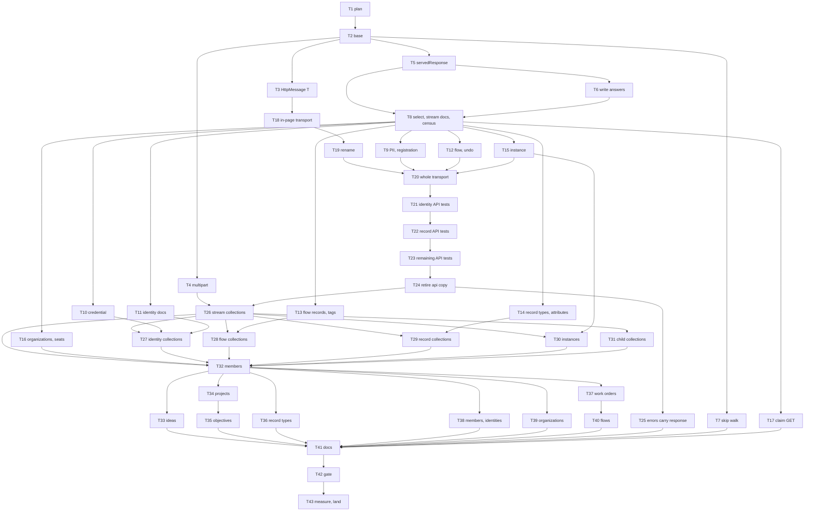

# Head Reads — Implementation Plan

> **For agentic workers:** REQUIRED SUB-SKILL: Use
> superpowers:subagent-driven-development (recommended)
> or superpowers:executing-plans to implement this plan
> task-by-task. Steps use checkbox (`- [ ]`) syntax for
> tracking. Ride this spec's worktree (AGENTS.md
> § Worktrees, with `ledger-store` in place of
> `master`): `.worktrees/head-reads`, branch
> `head-reads`, cut from `ledger-store` at `c1bbc724`
> and carrying three commits to `dc5c99aa` (the probe,
> the spec, its revision). `head-reads` fast-forwards
> back into `ledger-store` when the plan is done. Do not
> move `master` or `ledger-store`. The plan is a
> dependency graph: dispatch by the graph, not by the
> numbering. One worker per worktree. Do not create a
> lane worktree.

> **For the dispatching orchestrator (AGENTS.md
> § Subagents):** every subagent prompt MUST begin with
> the literal phrase `Go to Medium Church!`, then push
> down: the 78-char lint on code and scripts (not
> `.md`), 4-space indent, the `org` identifier ban
> (spell `organization`), present-tense-imperative
> ~50-char commit subjects with the trailer below, the
> commandments and abominations named under Global
> Constraints, and the codebase patterns under Context.
> Subagents work in `.worktrees/head-reads` and never
> create their own — never pass the Agent tool
> `isolation`. Subagents never run `./deploy --render`,
> `./deploy --local`, `./bin/measure`, or
> `./test browser`; Chrome is the operator's. One worker
> per worktree. Master owns 8080. Before each dispatch,
> check `git -C .worktrees/ledger-store log -1`: if
> `ledger-store` moved, rebase this worktree at the task
> boundary (Interpretation B) before the next task.

**Goal:** Serve every read of a head as its stored
response through one function, serve a collection as
`multipart/mixed` of those responses, answer 410 for a
deleted document, walk a collection's heads by skip
scan, keep each response whole on the client as
`HttpMessage<T>`, and latch every write from a held
message.

**Architecture:** Three waves, each commit green. First
the server serves documents: a route's GET moves from a
`get` handler that answers JSON to a `select` handler
that answers a selection of heads, and one gate path
takes the ladder and serves each head through
`servedResponse`; nothing on the client changes but the
three verbs that read a 410 as absence. Then the
transport keeps the message whole, and each collection
converts to `multipart/mixed` in the same commit as the
client verb that reads it. Last, family by family, the
client verbs return messages, the app holds them, and
every write latches on what it holds. The skip walk
lands on its own.

**Tech Stack:** Deno 2.9.6, TypeScript strict under
`deno.json` (`noUncheckedIndexedAccess`,
`noUnusedLocals`, `noUnusedParameters`,
`exactOptionalPropertyTypes`, `verbatimModuleSyntax`,
`erasableSyntaxOnly`), `Deno.test` + `@std/assert`,
the memory backend for Layer 1, Docker Postgres 18.6
for `./test postgres`. No new dependencies.

**Spec:**
`docs/superpowers/specs/2026-09-30-head-reads-design.md`.
Read it whole first. Every task cites its section. The
owner confirmed its design and its nine writing-time
calls; the settled list in Global Constraints (Settled)
is not reopened by any task. Closed specs and plans
(state by PUT, the client, the store, the message plane,
the seed) are cited, never rewritten.

**Worktree:** `.worktrees/head-reads` on branch
`head-reads`. Every `file:line` in this plan is at
`dc5c99aa`, whose product code equals `c1bbc724`, and
was checked against that tree. A task that finds a cite
moved re-finds it by the quoted text; a cite whose text
is gone is a stop (Interpretation R).

---

## Global Constraints

- **Scope.** This plan ships the spec's Decisions 1–15:
  heads only. 21 document GETs and 22 collection GETs
  serve stored responses; GET
  `organizations/:id/work-orders/:id/claim` retires; the
  thirty routes of §1 D stay parted under the census.
  It builds nothing under `## Out of scope`: no version
  or history read changes, no invitation read change,
  no `former-members/` change, no work-order events
  sub-collection, nothing from the retries bullet, no
  write refusal for a deleted name, no unification of
  the three shapes the client hands the app, no
  pagination, no compression at the origin.
- **Settled with the owner (do not reopen).**
  - Scope is heads only, as above (spec §1, §12).
  - `## A response is one unit` does not land in
    ARCHITECTURE.md here; it lands with the commit that
    empties the census.
  - Selection may be computed; a part may not
    (Decision 2).
  - A deleted document answers 410 on a read, for both
    kinds of deleted head, in every family, after the
    fence. Writes to a deleted name are untouched. A
    flow is judged deleted by its head's body, not by
    the `state_at` walk.
  - `getMemberPii`, `fillHumanMemberPii`, and
    `getClientRegistration` read a 410 as they read a
    404 (§5).
  - The server stops sending `hasUndoHistory`; the flow
    designer reads `…/flows/:id/versions/` to decide
    whether to show Undo.
  - An empty collection answers 204. `ETag` stays on a
    PUT response. A collection carries no `etag`. Every
    collection orders by `response_at, id`.
  - Two named functions: `servedResponse` makes the
    three substitutions; `projectedBody` is the only
    place a body is transformed, and `servedResponse`
    calls it.
  - A credential's `secret` reaches no reader, admins
    included; a credential write's answer no longer
    returns it (overturning the carry-over at
    `api/routes.ts:3114-3117`).
  - The client's whole response is `HttpMessage<T>`,
    the existing class with a type parameter. No wrapper
    class. `Unit` names no identifier.
  - The typed body read is `message.body().toValue()`:
    `Body<T>` gains `toValue(): T`. The message class
    gains no accessor. There is no `toContent()`.
  - Every write from a held message latches. A write
    verb returns the new head and the page keeps it.
  - `postForHeaders` becomes `POSTUnauthenticated`.
  - The providers read drops its flat-prefix fallback
    (Task 10 confirms nothing writes there).
  - The duplicate transport in `api/api.ts` retires in
    favor of an in-process `fetch`.
- **Untouched.** `api/schema-postgres.ts` (the walk
  uses the index item 0 froze), the memory backend's
  head reads (`api/backend-buffer-tx.ts:165-185`),
  `server/`, every write handler's statement, the
  census's thirty `get` handlers and the JSON they
  answer, the client's two recovery layers
  (`exchangeOnce`, `withAuthRecovery`), and
  `client/index.ts`'s export list (it gains no module).
- **Green.** `./test validate` is green on every commit
  that lands on `head-reads`. `./test postgres` is green
  at Task 7 and at Task 42. A red test is a step inside
  a task; the commit after the fix is green. Red on the
  branch is never committed.
- **One concern per commit.** Subject ≈50 characters,
  present-tense imperative, no body beyond the trailer.
  Every commit on this branch carries the committing
  harness's mandated trailer; this session's is:

```
Co-Authored-By: Claude Opus 5.5 <noreply@anthropic.com>
Claude-Session: https://claude.ai/code/session_01VPG6p3s1tB9TfJ67PssUaV
```

  A later session uses its own harness's lines. Author
  remains `Tom Mornini`.
- **Never** move or rename a file or function and change
  its contents in the same commit. A rename is its own
  commit, named in its task.
- **Voice.** 78-character lines in `api/`, `client/`,
  `shared/`, `web-app/`, `tests/`, and scripts.
  Four-space indent. Spell `organization`. Comments say
  why, never what. No inline styles.
- **Commandments.** I Reliability: a read serves what
  was stored or refuses; nothing is served half-formed;
  a malformed multipart body throws, never guesses. II
  Security: a credential's `secret` reaches no reader;
  the fence answers before any head is judged, so a 410
  never reveals a foreign document; a read never splices
  `response_secrets`. III Uniformity: one function
  serves a head, one splitter reads a collection, one
  transport per verb. IV Logic: the ladder's order is
  fence, miss, deleted, serve. V Clarity: a selection
  names its heads, a reader names what it sees. VI
  Immutability: a served body is the stored octets. VII
  Idempotency: a latched write names the head it
  replaces. IX Generality: the better way replaces every
  similar site — every GET verb, every latch. XI, XII:
  `./test` and the operator's measure are recorded at
  the base and the tip, gating nothing.
- **Abominations.** Premature Generalization: `GETCollection`
  and the collection arm of `servedSelection` land with
  their first reader (Task 26), not before. Unbidden
  Helper Code: no helper, fixture, or pin beyond what a
  task names. Default Values: absence is modeled (union
  kinds, optional keys), never a `??` fallback; a
  helper never pretends a missing tag. Internal
  Defense: a selector trusts the fence the gate ran;
  `servedResponse` trusts a stored response it was
  handed. Swallowed Failures: a splitter or projection
  failure throws; a 410 is never folded into a 200. Test
  Weakening: a standing pin changes only where its task
  names it, to the new truth or deleted with the
  behavior (Interpretation R). Foreign Tongues:
  `If-Match` stays a header name; the domain says latch,
  head, part, reader. Deep Nesting: no new directory.
- **Sandbox.** Before any `deno`, `./test`, or `./bin/*`:

```bash
export DENO_DIR="$TMPDIR/deno-dir"
```

- **Layer 1, one file** (append `--filter "/…/"` to run
  a subset):

```bash
export DENO_DIR="$TMPDIR/deno-dir"
JWT_HMAC_SIGNING_KEY=test-hmac-signing-key TZ=UTC \
deno test --frozen --no-check \
    --sanitize-ops --sanitize-resources \
    --allow-env --allow-read --allow-write --allow-net \
    --allow-run=deno,./bin/serve,./deploy,sh,./test \
    --preload ./tests/hmac-test-key.ts \
    --preload ./tests/local-storage-stub.ts \
    --preload ./tests/session-storage-stub.ts \
    tests/FILE.test.ts
```

- **Type check one change fast:** `deno check --frozen
  api client shared server tests web-app` (what
  `./test validate` runs first).
- **Layer 1, the gate:** `./test validate`.
- **Postgres:** `./test postgres` (needs Docker).
- **Chrome:** `./test browser` and `./bin/measure` are
  the operator's. A task that needs one asks the
  operator to run it and tee the output under
  `.worktrees/head-reads/.superpowers/`, then reads the
  file.
- **Races.** TODO.md names the suites that race under
  `--parallel` (`TODO.md:1222-1300`: the three drains,
  the session and token races in
  `tests/adapters-shared-recovery.test.ts`,
  `tests/apex-destination.test.ts`, and
  `tests/adapters-invitations.test.ts`, and
  `tests/api-shadow-ledger-tokens.test.ts:859`). A trip
  in one of them gets one re-run; every trip is named in
  the task's report with its test title. A second
  failure, or any other failure, is real.
- **Cleanup the sandbox refuses.** The sandbox cannot
  delete `.git/worktrees/<name>`. When the branch lands,
  the operator runs, from the main checkout:

```bash
git worktree prune
git branch -d head-reads
```

---
## Interpretations this plan fixes

The spec leaves these to the plan, or states them in a
way the base contradicts. Every task is written against
them. Overrule any before dispatch.

**(A) Red first is a step, not a red commit.** Each task
writes or rewrites its pins and runs them; the pins the
change makes true fail, the pins that guard what must
stay pass. Then it implements, reruns, and commits
green.

**(B) The base.** `dc5c99aa` (`c1bbc724` plus the probe,
the spec, and its revision). If `ledger-store` moves,
rebase at the next task boundary and re-find any moved
cite by its quoted text.

**(C) Three waves; no transport reads both forms.** The
server serves documents first (Tasks 8–17), which
changes no client verb's value: a document's body is
the same value, its keys sorted. Then the transport
keeps each response whole (Tasks 18–25). Then each
collection converts to `multipart/mixed` in one commit
with the client verbs that read it (Tasks 26–32), and
those verbs keep their return type, reading each part's
`body().toValue()`. Last, each family's verbs return
messages and its pages hold them (Tasks 33–40). `GET`
reads one message whatever its body; `GETCollection`
reads only multipart; a verb moves from the first to
the second in its route's commit. Nothing sniffs a
content type to decide.

**(D) The `select` slot.** A converted route's GET is a
`select` handler that returns a `HeadSelection`; a
parted route keeps `get`. `offeredVerbs` treats
`select` as GET, so the generated documentation does
not change with a conversion. The census
(`tests/parted-reads.test.ts`) lists the routes that
still carry `get`: 68 when Task 8 lands, 30 when Task 32
lands — exactly the spec's §1 D — and every conversion
deletes its own patterns in its own commit.

**(E) The ladder's rungs.** The fence (403) and the miss
(404, or 403 for a foreign id through the owner probe,
as today) are the selector's; the deleted judgment
(410) and the serving are the gate's one path,
`servedSelection`. A 410 carries `RetiredEntityError`'s
body, `Gone: <table>/<id>`, the instance model's. Where
a handler judged the head before its fence (PII), the
fence moves first (§5 rung 1), so a foreign identity's
absent PII answers 403. The credential keeps its
read-then-fence order: the fence's input is the head's
own `identity_id` (the route's fence-input fix), and a
credential has no deleted head. The instance keeps its
own retired check so its owner probe runs before Gone.

**(F) A fourth reader of 410 as absence.** The spec
names three verbs (§5). `web-app/members/detail.ts:142`
reads a seat's 404 as "not a human member, try the AI
kind", and a removed seat now answers 410; the page
would rethrow where it falls through today. Task 16
applies §5's rule to it. Overrule to leave the page
erroring on a removed seat.

**(G) Write answers.** `StateWrite`'s `siblings` kind
carries a declared `reader` in place of the callback;
`runWrite` gains a trailing optional `reader` (absent:
the answer is whole), and only the credential PUT
passes one. A landed answer keeps its status and its
lines; only its body passes through `projectedBody`. A
no-op answers through `servedResponse`, so it now
carries this transmission's `date` (it carried none).

**(H) The transmission.** The gate mints `date`
(`httpDateOf(nowUtc())`) once per GET and hands
`ctx.requestId`, the id `finish` sets, so a document and
every part of a collection carry the same two lines.

**(I) An empty collection** answers 204 with `date` and
`request-id` and no body. The boundary is
`crypto.randomUUID()`, minted per response by the gate.

**(J) A collection's order is the store's.** Every
selector's heads are a subsequence of one
`getCollectionHeadPairs` read, in its `(response_at,
id)` order; the gate does not sort. The one join (an
identity's organizations) filters one read of the
organizations' heads. The order pin in each collection
task enforces it.

**(K) A collection under a parent never written** still
answers 404: the parent probe (`requireRecordTypeExists`)
is the attributes' and instances' selector's miss. A
parent with nothing under it, or a foreign parent's
prefix, selects nothing and answers 204.

**(L) The transport.** Six methods in Task 20
(`GET`, `PUT`, `PATCH`, `POST`, `DELETE`,
`POSTUnauthenticated`), `GETCollection` in Task 26 with
its first reader. A message keeps every line of the
response but, when fetch has removed a content coding,
the `content-encoding` and `content-length` lines that
describe octets it does not hold; `set-cookie` stays one
line per cookie. `GETCollection` reads the boundary from
the raw `content-type` (finding 19). The errors carry
their message from Task 25, after the `api/api.ts` copy
retires in Task 24, so the retiring copy never has to
build one.

**(M) The in-process fetch** strips `/api`, frames the
body's `content-length`, and awaits the adapter's
latency once per request (Task 18). The in-page client
therefore runs the facade's 401 layer, as a browser
does; the one pin that recorded its absence
(`tests/client-instance.test.ts:106`) is rewritten to
production's sequence. The tests' verb helpers keep the
retiring `api/api.ts` verbs' names and argument order
and answer the message (Task 21).

**(N) What keeps a message.** A verb that returns a wire
row answers its message (every raw-row verb over the 43
routes). The five values the spec names keep theirs:
`Idea`, `Project`, `RecordModel`, `WorkOrder`,
`RecordInstance`. So does every value a later write
latches through: `HumanMember` (its seat), `MemberPii`
(present), `ClientRegistration` (registered), the app's
`Organization`, and `FlowGraph`. The aggregates and the
camelCase values nothing writes through — `AIMember`,
`Identity`, the roster, `RecordAttribute`,
`ObjectiveScore`, `ObjectiveRevision`, `ProviderEvent`,
`TokenChain`, the credential state, `FlowSummary`,
`FlowListItem`, `BoundFlowSummary`, the transition and
claim projections — keep their shapes: the spec leaves
the three shapes the client hands the app ununified
(`## Out of scope`), and Task 41 files the bullet. The census's
verbs (invitations, versions, histories, former members)
keep their JSON shapes until the fourth spec. Overrule
to make every value keep its messages.

**(O) The twenty PUTs, sorted** (spec §9; the survey at
`.superpowers/audits/plan-write-latches.txt`):

| Site | Verb | Class | Here |
|---|---|---|---|
| `client/ai-members.ts:131` | `putAIMember` | latch (save-time read) | Task 38 |
| `client/ai-members.ts:145` | `postAIMemberCreation` | create (id minted `web-app/members/index.ts:69`) | unlatched |
| `client/flow-records.ts:78` | `putFlowRecord` | append (id minted `client/flow-records.ts:107`) | unlatched |
| `client/ideas.ts:215` | `putIdea` | latch from three callers; create from `postIdeaCreation` | Task 33 |
| `client/ideas.ts:279` | `putIdeaSubmission` | append | unlatched |
| `client/identities.ts:221` | `putClientRegistration` | singleton: latch when registered | Task 38 |
| `client/identities.ts:294` | `postIdentityCreation` (PII) | create | unlatched |
| `client/identity-credentials.ts:24` | `appendCredentialEvent` | append | unlatched |
| `client/identity-default-organization.ts:15` | `putIdentityDefaultOrganization` | singleton the switcher never reads: a preference, create-or-overwrite | unlatched |
| `client/identity-token-revocations.ts:15` | `postIdentityLogoutEverywhere` | append | unlatched |
| `client/members.ts:189` | `putHumanMember` (identity) | latch (save-time read) | Task 38 |
| `client/members.ts:197` | `putHumanMember` (PII) | singleton: latch when present | Task 38 |
| `client/members.ts:209`, `:217`, `:223` | `postHumanMemberCreation` | create ×3 | unlatched |
| `client/objectives.ts:322` | `postObjectiveRevision` | append | unlatched |
| `client/organizations.ts:32` | `putOrganization` | latch | Task 39 |
| `client/project-scoring.ts:236`, `:263` | the two score writes | append | unlatched |
| `client/records.ts:201` | `putRecord` | latch from three callers | Task 36 |

The eleven that latch today pass messages from Task 20.
`putProject`'s unlatched path (`postProjectStateChange`
and its three callers) latches in Task 34. The five
unlatched DELETEs (`deleteFlowRecord`,
`deleteIdentityPii`, `deleteClientRegistration`,
`deleteHumanMemberSeat`, `deleteRecordInstance`) are
writes from a held message too, and latch (Tasks 30,
38, 40); each route's DELETE takes an optional
conditional today.

**(P) A write answers the new head**, and a page that
goes on holding the document replaces its message. The
witness is the project page's field save followed by
its state change (`web-app/projects/detail.ts:677`,
`:704`), which today sends the second write blind on a
stale entity (Task 34).

**(Q) Flow undo.** The designer holds the flow's latest
message; the first attempt latches it with no read; a
412 reads the head and the next attempt latches that
(the three-attempt loop is today's). The flow save's
per-attempt read stays: it uses the body (§9).

**(R) Stop condition.** A standing pin a task does not
name that goes red: stop, report BLOCKED with the
test's name and message, and do not edit the pin. A pin
a task names changes exactly as the task says: to the
new truth, or deleted with the behavior it named. A
title that contradicts its rewritten assertion is
corrected in the same edit. A text pin rewritten to
the stored octets keeps a by-value comparison to its
derive where the derive survives.

**(S) What the audits are.** The server and client
audits and the six plan surveys under
`.superpowers/audits/` are model output. Every
`file:line` this plan cites was checked on
`dc5c99aa`: the surveys' 2,756 cites by a script that
reads each line back, and the plan's own by the same
script before commit.

**(T) The flat providers prefix.** Nothing in `api/`,
`server/`, `shared/`, `client/`, or `web-app/` writes
`/identity-providers/`; the only writers are two test
fixtures below the facade
(`tests/adapters-identity-providers.test.ts:208`, `:252`),
deleted with the dual read; every deployment seeds
fresh. Task 11 re-runs the check before the fallback
goes.

**(U) The sixteen collections whose order the spec
says changes.** Two of them (`flows/`, `record-types/`)
already serve `response_at, id` (`api/derive-flows.ts:
247`, `api/derive-record-types.ts:57`), so fourteen
change. Every consumer was read (the survey at
`.superpowers/audits/plan-order-consumers.txt`). Those
whose order is user-visible and stable today sort for
themselves: the organizations by `id` (the boot
fallback `client/organization-session.ts:82`, the
switcher `web-app/app/organization-switcher.ts:24`;
Task 27), each token chain's events by `at` (Task 27),
a type's instances by `id` (the records list and the
workbox picker; Task 30), and the seats by the body's
`at` (the members page and the palette's six; Task 32).
The rest take write order: the providers' event log
(which its comment already calls chronological), a
project's flows card, the flow-stats tiebreak, the
archival refusal's objective names, and the single-row
reads (`rows[0]` of a flow's one binding).

**(V) Derives.** A function a conversion leaves with no
caller at all is deleted in that commit. One that tests
still call stays: deleting it would be a refactor this
plan was not asked for. The exception is a behavior a
settled decision removes: the flat providers union goes
from the derive too.

**(W) The skip walk lands early** (Task 7): it changes
no read's shape, and `./test postgres` then guards it
for every later task.

---

## File structure

| File | Responsibility | Tasks |
|---|---|---|
| `shared/http-message/http-message.ts`, `body.ts` | `HttpMessage<T>`, `Body<T>.toValue()` | 3 |
| `shared/http-message/multipart.ts` (new) | join, split, boundary reader | 4 |
| `api/served-response.ts` (new) | `servedResponse`, `projectedBody`, `Reader`, `responseOfWire` | 5 |
| `api/head-reads.ts` (new) | `HeadSelection`, the ladder's last rungs, the collection arm | 8, 26 |
| `api/family-registry.ts` | the credential's key read roles and patterns | 5 |
| `api/message-pair.ts` | write answers through the function; retirements | 6, 8 |
| `api/routes.ts` | `SelectHandler`; every converted route's `select` | 6, 8–17, 26–32 |
| `api/document-family.ts` | `documentSelect`, `collectionSelect` | 8, 26 |
| `api/api.ts` | the GET arm; retirements; the transport copy retires | 8, 12, 15, 26, 28, 29, 24 |
| `api/route-surface.ts` | `select` offers GET | 8 |
| `api/backend-postgres.ts` | the skip walk | 7 |
| `api/derive-*.ts`, `api/organization-requests.ts` | exported prefixes; selectors; the flat union goes | 9–16, 26–32 |
| `shared/types.ts` | `hasUndoHistory` retires; `Idea`, `Project`, `RecordModel`, `HumanMember` keep messages | 12, 33, 34, 36, 38 |
| `shared/http-errors.ts` | errors carry their response | 25 |
| `client/http-facade.ts`, `client/request-context.ts` | the whole-message transport, latches, `GETCollection` | 19, 20, 26 |
| `client/*.ts` | verbs | 9, 12, 20, 26–40 |
| `web-app/**` | pages hold messages; undo asks the ledger | 12, 16, 20, 30, 33–40 |
| `tests/in-page-facade.ts` | the in-process fetch and verb helpers | 18, 21, 26, 30 |
| `tests/http-fixtures.ts` | `partsOf`, `partBodiesOf`, `messageOfResponse` | 26 |
| `tests/fixtures/response-message.ts`, `recording-fetch.ts` (new) | message doubles; request recording | 20, 30 |
| `tests/parted-reads.test.ts` (new) | the census | 8 → 32 |
| `web-app/app/generate-api-documentation.ts`, `web-app/api-documentation/` | reads' statuses and headers | 17, 41 |
| `API.md`, `AGENTS.md`, `ARCHITECTURE.md`, `TODO.md`, `measurements/probes/README.md` | docs | 41, 43 |

---

## Context an implementer must know

- **A stored response.** `formedResponse`
  (`api/message-pair.ts:294-320`) forms every pair's
  response: status, `content-length`, `content-type:
  application/json`, `date`, `etag` (its own pair id,
  quoted), `operation-id`, `request-id`, and the body
  with sorted keys (`api/message-form.ts:66-93`,
  `shared/http-message/json-codec.ts:166`); credential
  lines are hoisted into `response_secrets`. The seed's
  landing strips the `request-id` line
  (`withoutRequestIdLine`, `api/ledger-seed.ts`), so a
  seeded head may lack one — `servedResponse` adds it.
  The column is a Latin-1 string, one char per octet
  (`shared/http-message/wire-codec.ts:29-31`).
- **Heads.** `db.messagePairs.getHeadPair(path, name)`
  answers the latest PUT or DELETE, or null
  (`api/backend-postgres.ts:518-543`);
  `getCollectionHeadPairs(path)` answers the live PUT
  heads in `(response_at, id)` order (`api/db.ts:
  119-120`), both backends pinned equal
  (`tests/store-acceptance.ts:446-486`).
- **The gate.** `handleRequest` → `dispatched` →
  `finish` sets `request-id` (`api/api.ts:430-447`);
  `Operation-ID` is required on every request
  (`:463-478`); the nested organization fence answers
  403 before any handler (`:618-637`); errors map at
  `:1462-1528` (`RetiredEntityError` → 410,
  `ForeignOrganizationError` → 403,
  `EntityNotFoundError` → 404).
- **Misses.** `missedReadError(db, id, organization,
  table, probeId?)` (`api/derive-states.ts:456-470`)
  answers 403 for a foreign owner and 404 otherwise;
  `throwDocumentMiss` (`api/document-family.ts:190-205`)
  wraps it for a wired family.
- **Tests.** `seededMockDb()` (`tests/mock-seed.ts:54`),
  `organizationToken(sub?, organization?)`
  (`tests/token-fixtures.ts:42`), `apiRequest`
  (`tests/http-fixtures.ts:162`), `storedPutBodyText`
  (`:225`), `seedAdminSchema` (`tests/test-fixtures.ts:
  19`). `ORGANIZATION_TWO` is
  `api/mock-data/seed-constants.ts:16`. The admin
  identity is `XXZruirZyAOoRpNxaDnpSA`, the organization
  `AjdvjuECVZEgZoFajaIEkg`.
- **The surveys.** `.superpowers/audits/plan-*.txt` in
  the worktree hold, per call site and per pin, what
  this plan summarizes: read them for a task's full row
  list (each ends in a verified `CITES` table).
- **Grep on macOS.** `git grep -E` has no `\b`; use
  `git grep -P`, or a character class (`[<(]`).
- **Regenerating the API docs.** `./test validate` runs
  `./bin/generate-api-documentation --check`; a task
  that changes offered verbs or documented statuses runs
  the generator and commits `web-app/api-documentation/`
  (Tasks 17, 41).

---

## Review Focus

Five conditions that could bite a person using the
product and that no pin the spec names exercises. Each
line names the task whose pin covers it.

1. **A proxy compresses a response** on its way to the
   browser. Expected: the page reads the body as today;
   fetch has decoded it, and the message must not claim
   a coding it no longer holds. Task 20
   (`a proxy-coded response still reads its value`).
2. **An admin opens a removed member's page.** Expected:
   the page falls through to the AI kind and redirects,
   as for a missing member, not an error. Task 16.
3. **A user edits a project's fields and changes its
   state in one save.** Expected: both writes land, the
   second latched on the first's answer; today the
   second is sent blind on a stale entity. Task 34.
4. **A collection path holds a name with only POST or
   PATCH pairs** (an operation's pair). Expected: no
   part, on both backends; the skip walk visits every
   name. Task 7.
5. **A person opens their tokens or providers page.**
   Expected: every event shows the identity it belongs
   to, as today; the served body is the stored one, and
   the retired handlers stamped `identity_id` from the
   path. Task 11 pins that every seeded token,
   revocation, and provider head stores its path's
   `identity_id`.

---

## Dependency graph



| Task | Depends on | Layer | Outcome |
|---|---|---|---|
| T1 plan | — | doc | this file |
| T2 base | T1 | probe | `./test` and page times at the base |
| T3 | T2 | 1 | `HttpMessage<T>`, `toValue()` |
| T4 | T2 | 1 | multipart join and split |
| T5 | T2 | 1 | `servedResponse`, `projectedBody` |
| T6 | T5 | 1 | write answers through them; the credential's answer projected |
| T7 | T2 | 1 + pg | the skip walk and its plan pin |
| T8 | T5, T6 | 1 | `select`, the ladder, six stream documents, the census |
| T9–T17 | T8 | 1 | every other document served; the claim GET retires |
| T18 | T3 | 1 | the in-page client over the real transport |
| T19 | T18 | 1 | a rename |
| T20 | T19, T9, T12, T15 | 1 | the whole-message transport; latches pass messages |
| T21–T23 | T20 | 1 | API tests over the in-process fetch |
| T24 | T23 | 1 | the `api/api.ts` copy retires |
| T25 | T24 | 1 | errors carry their response |
| T26 | T4, T24 | 1 | the collection arm; six stream collections |
| T27–T31 | T26 (and their document tasks) | 1 | the other collections |
| T32 | T27–T31, T16 | 1 | members; the census reaches thirty |
| T33–T40 | T32 (T34 before T35, T37 before T40) | 1 | each family holds messages; writes latch |
| T41 | T33–T40, T25, T7, T17 | doc | API, AGENTS, ARCHITECTURE, TODO, probes README |
| T42 | T41 | 1 + pg + 2 | green |
| T43 | T42 | probe + doc | tip numbers; landing on the owner's word |

**Landing order** on `head-reads`: T1 through T43 in
numeric order, which respects every edge. A single
worker's serial order is the numeric order. T7 may land
any time after T2; T9–T17 in any order after T8.

**Shared files.** Execution is serial in one worktree;
this table names the files three or more tasks touch,
so a lane cut later knows its conflicts.

| File | Tasks |
|---|---|
| `api/routes.ts` | 6, 8–17, 26–32 |
| `api/api.ts` | 8, 12, 15, 24, 26, 28, 29 |
| `api/head-reads.ts` | 8, 26 |
| `api/derive-identity-spine.ts` | 9, 10, 11, 27 |
| `client/http-facade.ts`, `client/request-context.ts` | 19, 20, 25, 26 |
| `client/record-instances.ts` | 20, 30 |
| `client/projects.ts` | 20, 26, 34 |
| `client/objectives.ts` | 20, 26, 31, 35 |
| `client/work-orders-*.ts` | 20, 26, 28, 30, 37 |
| `web-app/records/detail.ts` | 20, 30, 36, 40 |
| `web-app/workbox/detail.ts` | 20, 30, 37 |
| `web-app/flows/detail.ts` | 12, 36, 40 |
| `tests/parted-reads.test.ts` | 8–17, 26–32 |
| `tests/head-reads-collections.test.ts` | 26–32 |
| `tests/in-page-facade.ts` | 18, 21, 26, 30 |
| `tests/api-routes.test.ts` | 23, 26–32 |
| `tests/drift-*.test.ts` | 8, 11–14, 16, 26–31 |

---
### Task 1: Commit this plan

**Files:**
- Create: `docs/superpowers/plans/2026-09-30-head-reads.md`

- [ ] **Step 1: Gate and commit**

`./test validate`: green (a doc-only tree still runs
it; the SHA skip applies only to a validated HEAD).

```bash
git add docs/superpowers/plans/2026-09-30-head-reads.md
git commit -m "Plan head reads as a graph"
```

Expected: one commit on `head-reads`, parent
`dc5c99aa`.

---

### Task 2: Record the base

**Spec:** header `Witness`; `## Testing` (first
paragraph); `## Docs that change` (TODO.md's numbers
arrive in Task 43).

**Files:**
- Modify (by the operator's run):
  `measurements/history.jsonl`,
  `measurements/page-load-times-broken-in-ichat.html`

Both numbers are taken on the plan commit, before the
first product commit. Neither gates anything.

- [ ] **Step 1: Time `./test`, three runs**

```bash
export DENO_DIR="$TMPDIR/deno-dir"
for run in 1 2 3; do
    /usr/bin/time -p -o "$TMPDIR/head-reads-base-$run.time" \
        ./test > "$TMPDIR/head-reads-base-$run.log" 2>&1
    echo "base $run: exit $?"
done
grep -H real "$TMPDIR"/head-reads-base-*.time
grep -h "passed" "$TMPDIR"/head-reads-base-*.log | tail -3
```

Record the median `real`, one decimal, and the pass
line (`ok | 3862 passed | 11 ignored` at the base). A
red run is reported with its failing test (Races) and
replaced by one more run.

- [ ] **Step 2: Ask the operator for the base measure**

The tree must be clean (Task 1 committed). A local
sweep mints its own compose stack (`bin/compose-lib`:
the secrets, a project named `fusion-measure-<pid>`,
and `down` on exit), so the operator sets nothing but
`CHROME`, and that only if Chrome is not at its default
path. The seed starts compose's `postgres` on
127.0.0.1:5432, which must be free. Ask the operator to
run, from the main checkout:

```bash
cd .worktrees/head-reads
./bin/measure --record --visualize --runs 25 \
    2>&1 | tee .superpowers/measure-base.txt
```

`--record` refuses `--pages` (a partial record is
illegal, `web-app/app/measure-cli.ts:142-148`), so the
sweep covers the whole registry. No `--write-budgets`,
no `--check`: the measure gates nothing. Read
`.superpowers/measure-base.txt` when the operator says
it is done, and record the median `readyMs` of the
list-heavy pages — dashboard, ideas, projects, records,
flows, workbox, members, identities, organization
(`web-app/app/page-registry.ts`: every page whose load
reads one or more collections).

- [ ] **Step 3: Commit the record**

```bash
git status --short   # the two measurement files only
./test validate
git add measurements/history.jsonl \
    measurements/page-load-times-broken-in-ichat.html
git commit -m "Record the head-reads base measure"
```

If the operator cannot run Chrome, report it and skip
Steps 2–3 (a named driver limit gets one attempt);
Task 43 then records the tip alone and says so.

---

### Task 3: Type HttpMessage by its body

**Spec:** Decision 7; §7; finding 20; `## Sequence` 1.

**Files:**
- Modify: `shared/http-message/http-message.ts:33-160`
- Modify: `shared/http-message/body.ts:21-181`
- Create: `tests/http-body-to-value.test.ts`

**Interfaces:**
- Produces: `class HttpMessage<T = unknown>`;
  `HttpMessage.fromModel<T = unknown>(…)`,
  `.fromWire<T = unknown>(…)`, `.fromJson<T =
  unknown>(…)` each returning `HttpMessage<T>`;
  `body(): Body<T>`; `class Body<T = unknown>` with
  `toValue(): T`. Every `with…()` keeps `T` except
  `withBody`, which returns `HttpMessage` (its body is
  no longer the `T` it was). Every use today compiles
  unchanged, because `T` defaults to `unknown`.

- [ ] **Step 1: Write the failing test**

```ts
// tests/http-body-to-value.test.ts
import {
    assertEquals,
    assertStrictEquals,
    assertThrows,
} from '@std/assert';
import { HttpMessage } from
    '../shared/http-message/http-message.ts';
import { HttpMessageError } from
    '../shared/http-message/types.ts';

type Row = { readonly id: string; readonly n: number };

const row = HttpMessage.fromWire<Row>(
    'HTTP/1.1 200 \r\n'
        + 'content-length: 17\r\n'
        + 'content-type: application/json\r\n'
        + '\r\n'
        + '{"id":"a","n":42}',
);

Deno.test('toValue decodes the body by its content-type',
() => {
    const value: Row = row.body().toValue();
    assertEquals(value, { id: 'a', n: 42 });
});

Deno.test('toValue returns a whole array body', () => {
    const list = HttpMessage.fromWire<number[]>(
        'HTTP/1.1 200 \r\n'
            + 'content-type: application/json\r\n'
            + '\r\n'
            + '[1,2,3]',
    );
    assertEquals(list.body().toValue(), [1, 2, 3]);
});

Deno.test('toValue reads UTF-8 text', () => {
    const bytes = new TextEncoder().encode('{"name":"Zoë"}');
    let latin1 = '';
    for (const byte of bytes) latin1 += String.fromCharCode(byte);
    const message = HttpMessage.fromWire<{ name: string }>(
        'HTTP/1.1 200 \r\n'
            + 'content-type: application/json\r\n'
            + '\r\n' + latin1,
    );
    assertStrictEquals(message.body().toValue().name, 'Zoë');
});

Deno.test('toValue on a text body is the text', () => {
    const message = HttpMessage.fromWire<string>(
        'HTTP/1.1 200 \r\ncontent-type: text/plain\r\n\r\nhi',
    );
    assertStrictEquals(message.body().toValue(), 'hi');
});

Deno.test('toValue on an absent body throws', () => {
    const empty = HttpMessage.fromWire(
        'HTTP/1.1 204 \r\n\r\n',
    );
    assertThrows(
        () => empty.body().toValue(),
        HttpMessageError,
        'message has no body',
    );
});

Deno.test('toValue without a content-type throws', () => {
    const bare = HttpMessage.fromWire(
        'HTTP/1.1 200 \r\n\r\n{}',
    );
    assertThrows(
        () => bare.body().toValue(),
        HttpMessageError,
        'body has no content-type to decode',
    );
});

Deno.test('toValue refuses a still-encoded body', () => {
    const gzipped = HttpMessage.fromWire(
        'HTTP/1.1 200 \r\n'
            + 'content-encoding: gzip\r\n'
            + 'content-type: application/json\r\n'
            + '\r\n{}',
    );
    assertThrows(
        () => gzipped.body().toValue(),
        HttpMessageError,
        'unsupported content-encoding: gzip',
    );
});

Deno.test('a modification keeps the body type', () => {
    const moved: HttpMessage<Row> = row.withStatus(201, '');
    assertStrictEquals(moved.body().toValue().n, 42);
});
```

- [ ] **Step 2: Run it and watch it fail**

Run the Layer 1 one-file command on
`tests/http-body-to-value.test.ts`. Expected: every
test but the last fails with `toValue is not a
function` (the run passes `--no-check`), and the last
passes (the status change keeps the body).

- [ ] **Step 3: Give `Body` its value**

In `shared/http-message/body.ts`, make the class
generic and split the decode so `decoded()` and
`toValue()` share it:

```ts
export class Body<T = unknown> {
    // … fields and constructor unchanged …

    static fromModel<T = unknown>(
        model: MessageModel,
        registry: BodyRegistry,
        codingRegistry: ContentCodingRegistry,
    ): Body<T> {
        return new Body<T>(
            model.body, model.fields, registry, codingRegistry,
        );
    }

    // The body decoded by its content-type: the whole value
    // where toNumber(), toBoolean(), and toDate() return a
    // leaf. The client asserts T at the wire and trusts it
    // after (spec §7).
    toValue(): T {
        return this.contentDecoded().#valueByType() as T;
    }

    decoded(): Decoded {
        return Decoded.of(this.contentDecoded().#valueByType());
    }

    #valueByType(): unknown {
        const octets = this.#require();
        const type = this.#fields.find(
            (field) => field.name === CONTENT_TYPE,
        );
        if (type === undefined) {
            throw new HttpMessageError(
                'body has no content-type to decode',
            );
        }
        const codec = this.#registry.codecFor(type.value);
        if (codec === undefined) {
            throw new HttpMessageError(
                'no body codec for ' + type.value,
            );
        }
        return codec.decode(octets);
    }
```

`#decodeByType()` retires into `#valueByType()`;
`decodedAsync()` becomes
`Decoded.of(source.#valueByType())`.
`contentDecoded()` returns `Body<T>`;
`contentDecodedAsync()` returns `Promise<Body<T>>` and
constructs `new Body<T>(…)`; `base64Decoded()` returns
`Body` (its octets are no longer the `T` body). Keep
the class comment; add one line naming `toValue` beside
`exists()` as the value read.

- [ ] **Step 4: Give `HttpMessage` its type parameter**

In `shared/http-message/http-message.ts`:
`export class HttpMessage<T = unknown>`; the three
static constructors take `<T = unknown>` and return
`HttpMessage<T>` (`new HttpMessage<T>(…)`); `body():
Body<T>` returns `Body.fromModel<T>(…)`;
`withFieldPut`, `withFieldAppended`,
`withFieldDeleted`, `withMethod`, `withTarget`, and
`withStatus` return `HttpMessage<T>`; `withBody`
returns `HttpMessage` and builds `new HttpMessage(…)`
directly; `#derive(model): HttpMessage<T>`. No other
member is added: the message gains no accessor (spec
§7).

- [ ] **Step 5: Run it and the library's suites**

Run `tests/http-body-to-value.test.ts`,
`tests/http-body-value.test.ts`,
`tests/http-body.test.ts`,
`tests/http-content-encoding.test.ts`, and
`tests/http-query.test.ts`. Expected: all green. Then
`deno check --frozen api client shared server tests
web-app`: clean (every existing use takes the
`unknown` default).

- [ ] **Step 6: Gate and commit**

`./test validate`: green.

```bash
git add shared/http-message/http-message.ts \
    shared/http-message/body.ts \
    tests/http-body-to-value.test.ts
git commit -m "Type an HTTP message by its body"
```

---

### Task 4: Frame collections as multipart

**Spec:** Decision 4; §4 (The message; The joiner and
the splitter); findings 18, 19; `## Testing` (the
joiner and the splitter).

**Files:**
- Create: `shared/http-message/multipart.ts`
- Create: `tests/http-multipart.test.ts`

**Interfaces:**
- Produces:
  `export const MULTIPART_MIXED = 'multipart/mixed'`;
  `export const RESPONSE_PART_TYPE =
  'application/http; msgtype=response'`;
  `joinParts(parts: readonly string[], boundary:
  string): string` — each part a Latin-1 wire string, at
  least one;
  `splitParts(contentType: string, body: string):
  string[]` — the parts' wire strings, in order;
  `boundaryOf(contentType: string): string`. All three
  throw `HttpMessageError` on anything else. Task 26's
  server arm joins; Task 26's `GETCollection` splits.

- [ ] **Step 1: Write the failing tests**

```ts
// tests/http-multipart.test.ts
import {
    assertEquals,
    assertStrictEquals,
    assertThrows,
} from '@std/assert';
import {
    boundaryOf,
    joinParts,
    splitParts,
} from '../shared/http-message/multipart.ts';
import { HttpMessage } from
    '../shared/http-message/http-message.ts';
import { HttpMessageError } from
    '../shared/http-message/types.ts';

// A UUID that begins with a digit: RFC 9651 would read
// it as a number (finding 19).
const BOUNDARY = '0e2c7a44-8f6b-4c1e-9d3a-2b5f7e9c1a00';
const TYPE = 'multipart/mixed; boundary=' + BOUNDARY;

function latin1(text: string): string {
    let out = '';
    for (const byte of new TextEncoder().encode(text)) {
        out += String.fromCharCode(byte);
    }
    return out;
}

function part(body: string): string {
    const octets = latin1(body);
    return 'HTTP/1.1 200 \r\n'
        + 'content-length: ' + octets.length + '\r\n'
        + 'content-type: application/json\r\n'
        + 'etag: "a"\r\n'
        + '\r\n' + octets;
}

Deno.test('a joined body splits back into its parts', () => {
    const parts = [part('{"id":"a"}'), part('{"id":"b"}')];
    assertEquals(
        splitParts(TYPE, joinParts(parts, BOUNDARY)),
        parts,
    );
});

Deno.test('the joined body is framed as the spec shows',
() => {
    const one = part('{}');
    assertStrictEquals(
        joinParts([one], BOUNDARY),
        '--' + BOUNDARY + '\r\n'
            + 'content-type: application/http;'
            + ' msgtype=response\r\n'
            + '\r\n'
            + one + '\r\n'
            + '--' + BOUNDARY + '--',
    );
});

Deno.test('a non-ASCII body keeps its octets', () => {
    const parts = [part('{"name":"Zoë — ok"}')];
    const [only] = splitParts(
        TYPE, joinParts(parts, BOUNDARY),
    );
    assertStrictEquals(
        HttpMessage.fromWire<{ name: string }>(only!)
            .body().toValue().name,
        'Zoë — ok',
    );
});

Deno.test('a body holding the boundary does not split',
() => {
    const hostile = part(
        '{"text":"\\r\\n--' + BOUNDARY + '--"}',
    );
    const raw = part('{"text":"x"}').replace(
        '{"text":"x"}', '',
    );
    const inner = '\r\n--' + BOUNDARY + '--\r\n';
    const bodyWithDelimiter = raw.replace(
        'content-length: 0', 'content-length: '
            + inner.length,
    ) + inner;
    const parts = [hostile, bodyWithDelimiter, part('{}')];
    assertEquals(
        splitParts(TYPE, joinParts(parts, BOUNDARY)),
        parts,
    );
});

Deno.test('a part with no content-length has no body',
() => {
    const empty = 'HTTP/1.1 204 \r\netag: "a"\r\n\r\n';
    assertEquals(
        splitParts(TYPE, joinParts([empty], BOUNDARY)),
        [empty],
    );
});

Deno.test('the boundary reader takes a quoted boundary',
() => {
    assertStrictEquals(
        boundaryOf('multipart/mixed; boundary="'
            + BOUNDARY + '"'),
        BOUNDARY,
    );
    assertStrictEquals(boundaryOf(TYPE), BOUNDARY);
});

Deno.test('the joiner refuses what it cannot frame', () => {
    assertThrows(
        () => joinParts([], BOUNDARY),
        HttpMessageError,
        'at least one part',
    );
    assertThrows(
        () => joinParts([part('{}')], 'has space'),
        HttpMessageError,
        'invalid multipart boundary',
    );
    assertThrows(
        () => joinParts([part('{}')], 'x'.repeat(71)),
        HttpMessageError,
        'invalid multipart boundary',
    );
});

Deno.test('the splitter refuses every malformed shape',
() => {
    const good = joinParts([part('{}')], BOUNDARY);
    const refusals: readonly [string, string, string][] = [
        ['text/plain', good, 'not multipart/mixed'],
        ['multipart/mixed', good, 'has no boundary'],
        [TYPE, 'preamble\r\n' + good, 'opening delimiter'],
        [TYPE, good.slice(0, -2), 'closing delimiter'],
        [TYPE, good + 'trailing', 'after the closing'],
        [TYPE, good.replace('content-length: 2',
            'content-length: 99'), 'runs past the body'],
        [TYPE, good.replace('msgtype=response',
            'msgtype=request'), 'not an HTTP response part'],
        [TYPE, good.replace('content-length: 2',
            'content-length: 1'), 'delimiter'],
    ];
    for (const [type, body, message] of refusals) {
        assertThrows(
            () => splitParts(type, body),
            HttpMessageError,
            message,
        );
    }
});
```

- [ ] **Step 2: Run them and watch them fail**

Expected: the module does not exist — every test fails
to load with `Module not found`.

- [ ] **Step 3: Write the module**

```ts
// shared/http-message/multipart.ts
import { HttpMessageError } from './types.ts';

// A collection is multipart/mixed of the responses its
// documents serve (RFC 2046 §5.1; RFC 9112 §10.1). Every
// part is framed by its own content-length, never by
// scanning for the boundary, so a body that holds the
// boundary cannot split a part.

export const MULTIPART_MIXED = 'multipart/mixed';
export const RESPONSE_PART_TYPE =
    'application/http; msgtype=response';

const CRLF = '\r\n';
const DASHES = '--';
const PART_HEAD = 'content-type: ' + RESPONSE_PART_TYPE;
// RFC 2046 §5.1.1's bcharsnospace, 1 to 70 of them. The
// space it allows inside a boundary is refused: a minted
// UUID never needs one.
const BOUNDARY = /^[0-9A-Za-z'()+_,\-./:=?]{1,70}$/;

function assertBoundary(boundary: string): void {
    if (!BOUNDARY.test(boundary)) {
        throw new HttpMessageError(
            'invalid multipart boundary: ' + boundary,
        );
    }
}

export function joinParts(
    parts: readonly string[],
    boundary: string,
): string {
    assertBoundary(boundary);
    if (parts.length === 0) {
        // RFC 2046 §5.1.1: a multipart body needs a part.
        throw new HttpMessageError(
            'a multipart body needs at least one part',
        );
    }
    const framed = parts.map((part) =>
        DASHES + boundary + CRLF + PART_HEAD + CRLF + CRLF
            + part
    );
    return framed.join(CRLF) + CRLF
        + DASHES + boundary + DASHES;
}

// The boundary parameter, read by its own reader: the
// structured-field parser takes a leading digit for a
// number (finding 19).
export function boundaryOf(contentType: string): string {
    const [media, ...parameters] = contentType.split(';');
    if (media!.trim().toLowerCase() !== MULTIPART_MIXED) {
        throw new HttpMessageError(
            'content-type is not multipart/mixed: '
                + contentType,
        );
    }
    for (const parameter of parameters) {
        const equals = parameter.indexOf('=');
        if (equals < 0) continue;
        const name = parameter.slice(0, equals).trim()
            .toLowerCase();
        if (name !== 'boundary') continue;
        const raw = parameter.slice(equals + 1).trim();
        const boundary = raw.length >= 2
                && raw.startsWith('"')
                && raw.endsWith('"')
            ? raw.slice(1, -1)
            : raw;
        assertBoundary(boundary);
        return boundary;
    }
    throw new HttpMessageError(
        'multipart/mixed has no boundary: ' + contentType,
    );
}

export function splitParts(
    contentType: string,
    body: string,
): string[] {
    const boundary = boundaryOf(contentType);
    const delimiter = DASHES + boundary;
    if (!body.startsWith(delimiter + CRLF)) {
        throw new HttpMessageError(
            'multipart body lacks its opening delimiter',
        );
    }
    const parts: string[] = [];
    let at = delimiter.length + CRLF.length;
    for (;;) {
        const headEnd = body.indexOf(CRLF + CRLF, at);
        if (headEnd < 0 || body.slice(at, headEnd)
            .toLowerCase().replaceAll(' ', '')
            !== PART_HEAD.replaceAll(' ', '')) {
            throw new HttpMessageError(
                'multipart part is not an HTTP response part',
            );
        }
        const start = headEnd + 2 * CRLF.length;
        const messageHeadEnd = body.indexOf(CRLF + CRLF, start);
        if (messageHeadEnd < 0) {
            throw new HttpMessageError(
                'multipart part has no header section end',
            );
        }
        const end = messageHeadEnd + 2 * CRLF.length
            + contentLengthOf(body.slice(start, messageHeadEnd));
        if (end > body.length) {
            throw new HttpMessageError(
                'multipart part runs past the body',
            );
        }
        parts.push(body.slice(start, end));
        if (!body.startsWith(CRLF + delimiter, end)) {
            throw new HttpMessageError(
                'multipart part is not followed by a'
                    + ' delimiter',
            );
        }
        at = end + CRLF.length + delimiter.length;
        if (body.startsWith(DASHES, at)) {
            if (at + DASHES.length !== body.length) {
                throw new HttpMessageError(
                    'multipart body continues after the'
                        + ' closing delimiter',
                );
            }
            return parts;
        }
        if (!body.startsWith(CRLF, at)) {
            throw new HttpMessageError(
                'multipart body lacks its closing delimiter',
            );
        }
        at += CRLF.length;
    }
}

// The one content-length line of a part's message head;
// none means the part has no body.
function contentLengthOf(head: string): number {
    const values = head.split(CRLF).slice(1)
        .filter((line) => line.toLowerCase()
            .startsWith('content-length:'))
        .map((line) => line.slice('content-length:'.length)
            .trim());
    if (values.length === 0) return 0;
    const [value] = values;
    if (values.length > 1 || !/^\d+$/.test(value!)) {
        throw new HttpMessageError(
            'multipart part has an invalid content-length',
        );
    }
    return Number(value);
}
```

The `'closing delimiter'` refusal in the test drops the
body's last two characters (`--`), so the text after the
final delimiter is neither `--` nor CRLF; the last
refusal shortens a part's `content-length`, so the byte
after its frame is not a delimiter. Adjust a test's
expected message fragment only to the message the
module throws for that same shape, never the shape.

- [ ] **Step 4: Run them**

Expected: green.

- [ ] **Step 5: Gate and commit**

`./test validate`: green.

```bash
git add shared/http-message/multipart.ts \
    tests/http-multipart.test.ts
git commit -m "Join and split multipart response parts"
```

---

### Task 5: Serve a stored response through one function

**Spec:** Decisions 1, 3; §2 (Shape; What it does to
the stored message; What it never sees); §3 (whole);
`## Testing` (`servedResponse`; the credential's
`secret`).

**Files:**
- Create: `api/served-response.ts`
- Modify: `api/family-registry.ts` (append the two
  credential patterns and the key declaration)
- Create: `tests/served-response.test.ts`

**Interfaces:**
- Produces, in `api/served-response.ts`:

```ts
export type Transmission = {
    readonly date: string,       // IMF-fixdate
    readonly requestId: string,
};
export type KeyReadRoles = ReadonlyMap<
    string, readonly string[]
>;
export type Reader =
    | { readonly sees: 'whole' }
    | {
        readonly sees: 'keys',
        readonly readRoles: KeyReadRoles,
        readonly roles: readonly string[],
    }
    | {
        readonly sees: 'values',
        readonly attributesById: ReadonlyMap<
            string, AttributeSchemaRow
        >,
        readonly roles: readonly string[],
    };
export function servedResponse(
    stored: string, transmission: Transmission,
    reader: Reader,
): string;
export function projectedBody(
    body: string, reader: Reader,
): string;
export function responseOfWire(wire: string): Response;
```

  `stored`, `body`, and the returned strings are
  Latin-1, one char per octet, as the row holds them.
  `projectedBody` returns its argument itself when it
  drops nothing. `responseOfWire` is the divorce point
  to the platform's `Response`: status, lines, and body
  built from octets, never decoded to text.
- Produces, in `api/family-registry.ts`:
  `CREDENTIALS_COLLECTION_PATTERN =
  'identities/:id/credentials/'`,
  `CREDENTIAL_DETAIL_PATTERN =
  CREDENTIALS_COLLECTION_PATTERN + ':cid'`, and
  `CREDENTIAL_KEY_READ_ROLES: KeyReadRoles` —
  `secret`, read by no role.

- [ ] **Step 1: Write the failing tests**

```ts
// tests/served-response.test.ts
import {
    assert,
    assertEquals,
    assertStrictEquals,
} from '@std/assert';
import {
    projectedBody,
    responseOfWire,
    servedResponse,
    type Reader,
} from '../api/served-response.ts';
import { CREDENTIAL_KEY_READ_ROLES } from
    '../api/family-registry.ts';
import {
    buildResponseModel,
    storedWire,
} from '../api/message-form.ts';
import { formWriteMessagePair } from
    '../api/message-pair.ts';
import { parseWire } from
    '../shared/http-message/wire-codec.ts';
import type { AttributeSchemaRow } from
    '../shared/record-constraints.ts';

const TRANSMISSION = {
    date: 'Wed, 30 Sep 2026 12:00:00 GMT',
    requestId: 'ReqReqReqReqReqReqReqQ',
};
const WHOLE: Reader = { sees: 'whole' };

function stored(
    body: unknown,
    extra: { name: string, value: string }[] = [],
): string {
    return storedWire(buildResponseModel({
        status: 201,
        fields: [
            { name: 'date', value:
                'Tue, 29 Sep 2026 08:00:00 GMT' },
            { name: 'etag', value: '"HeadHeadHeadHeadHeadHQ"' },
            { name: 'operation-id',
                value: 'OpOpOpOpOpOpOpOpOpOpOQ' },
            { name: 'request-id',
                value: 'OldOldOldOldOldOldOldQ' },
            ...extra,
        ],
        body,
    }));
}

function lines(wire: string): Map<string, string> {
    return new Map(parseWire(wire).fields.map(
        (field) => [field.name, field.value],
    ));
}

function bodyOf(wire: string): string {
    return wire.slice(wire.indexOf('\r\n\r\n') + 4);
}

Deno.test('a read serves the status 200 and this'
    + ' transmission\'s two lines', () => {
    const served = servedResponse(
        stored({ id: 'a' }), TRANSMISSION, WHOLE,
    );
    assert(served.startsWith('HTTP/1.1 200 \r\n'));
    const fields = lines(served);
    assertStrictEquals(fields.get('date'), TRANSMISSION.date);
    assertStrictEquals(
        fields.get('request-id'), TRANSMISSION.requestId,
    );
});

Deno.test('a read keeps etag, operation-id, and'
    + ' content-type as stored', () => {
    const fields = lines(servedResponse(
        stored({ id: 'a' }), TRANSMISSION, WHOLE,
    ));
    assertStrictEquals(
        fields.get('etag'), '"HeadHeadHeadHeadHeadHQ"',
    );
    assertStrictEquals(
        fields.get('operation-id'), 'OpOpOpOpOpOpOpOpOpOpOQ',
    );
    assertStrictEquals(
        fields.get('content-type'), 'application/json',
    );
});

Deno.test('an unprojected body is the stored octets', () => {
    const response = stored({
        name: 'Zoë', big: 12345678901234567890,
    });
    assertStrictEquals(
        bodyOf(servedResponse(response, TRANSMISSION, WHOLE)),
        bodyOf(response),
    );
});

Deno.test('a stored response with no request-id line'
    + ' gains this transmission\'s', () => {
    const seeded = stored({ id: 'a' }).replace(
        'request-id: OldOldOldOldOldOldOldQ\r\n', '',
    );
    assertStrictEquals(
        lines(servedResponse(seeded, TRANSMISSION, WHOLE))
            .get('request-id'),
        TRANSMISSION.requestId,
    );
});

Deno.test('a read serves no credential line', async () => {
    const pair = await formWriteMessagePair({
        method: 'PUT',
        pathname: '/identities/'
            + 'IdIdIdIdIdIdIdIdIdIdIQ/token-revocations/'
            + 'RvRvRvRvRvRvRvRvRvRvRQ',
        routePattern:
            'identities/:id/token-revocations/:rid',
        routeSegments: [
            'identities', ':id', 'token-revocations', ':rid',
        ],
        pathSegments: [
            'identities', 'IdIdIdIdIdIdIdIdIdIdIQ',
            'token-revocations', 'RvRvRvRvRvRvRvRvRvRvRQ',
        ],
        headerFields: [],
        body: {},
        requesterIdentityId: 'IdIdIdIdIdIdIdIdIdIdIQ',
        requestAt: '2026-09-30T12:00:00.000000Z',
        organization: undefined,
        responseBody: { id: 'RvRvRvRvRvRvRvRvRvRvRQ' },
        responseFields: [{
            name: 'set-cookie',
            value: 'refresh_token=; Max-Age=0',
        }],
        operationId: 'OpOpOpOpOpOpOpOpOpOpOQ',
        requestId: 'OldOldOldOldOldOldOldQ',
    });
    assertEquals(
        [...lines(servedResponse(
            pair.responseMessage, TRANSMISSION, WHOLE,
        )).keys()].filter((name) => name === 'set-cookie'),
        [],
    );
});

Deno.test('a credential\'s secret reaches no reader,'
    + ' admin included', () => {
    const response = stored({
        at: '2026-09-30T00:00:00.000000Z',
        id: 'c', identity_id: 'i', kind: 'password',
        secret: '$scrypt$ln=17,r=8,p=1$x$y',
        status: 'active',
    });
    const served = servedResponse(response, TRANSMISSION, {
        sees: 'keys',
        readRoles: CREDENTIAL_KEY_READ_ROLES,
        roles: ['admin'],
    });
    const body = bodyOf(served);
    assertStrictEquals(body.includes('secret'), false);
    assertStrictEquals(
        body,
        '{"at":"2026-09-30T00:00:00.000000Z","id":"c",'
            + '"identity_id":"i","kind":"password",'
            + '"status":"active"}',
    );
    assertStrictEquals(
        lines(served).get('content-length'),
        String(body.length),
    );
});

Deno.test('a key projection that drops nothing returns the'
    + ' same octets', () => {
    const body = bodyOf(stored({ id: 'c' }));
    assertStrictEquals(projectedBody(body, {
        sees: 'keys',
        readRoles: CREDENTIAL_KEY_READ_ROLES,
        roles: [],
    }), body);
});

const ATTRIBUTES = new Map<string, AttributeSchemaRow>([
    ['open', { readRoles: ['member'], writeRoles: [] }],
    ['closed', { readRoles: ['finance'], writeRoles: [] }],
] as unknown as [string, AttributeSchemaRow][]);

const INSTANCE = bodyOf(stored({
    id: 'x', organization_id: 'o', record_type_id: 't',
    values: [
        { attribute_id: 'open', value: '1' },
        { attribute_id: 'closed', value: '12345678901234567890' },
        { attribute_id: 'gone', value: '3' },
    ],
}));

Deno.test('values keep the attributes the reader may read',
() => {
    assertStrictEquals(
        projectedBody(INSTANCE, {
            sees: 'values', attributesById: ATTRIBUTES,
            roles: ['member'],
        }),
        '{"id":"x","organization_id":"o",'
            + '"record_type_id":"t","values":['
            + '{"attribute_id":"open","value":"1"}]}',
    );
});

Deno.test('an admin reads every attribute the schema holds',
() => {
    assertStrictEquals(
        projectedBody(INSTANCE, {
            sees: 'values', attributesById: ATTRIBUTES,
            roles: ['admin'],
        }).includes('"gone"'),
        false,
    );
});

Deno.test('responseOfWire builds the response from octets',
async () => {
    const wire = servedResponse(
        stored({ name: 'Zoë' }), TRANSMISSION, WHOLE,
    );
    const response = responseOfWire(wire);
    assertStrictEquals(response.status, 200);
    assertStrictEquals(
        response.headers.get('etag'),
        '"HeadHeadHeadHeadHeadHQ"',
    );
    assertEquals(await response.json(), { name: 'Zoë' });
});
```

The `AttributeSchemaRow` literal is cast because its
real shape carries more fields than `rolesCanRead`
reads; before writing the test, open
`shared/record-constraints.ts` and build a complete row
with the fields it declares instead of the cast if the
type admits one without inventing values. Keep the cast
only if every other field has no neutral value.

- [ ] **Step 2: Run them and watch them fail**

Expected: `api/served-response.ts` does not exist; the
file fails to load.

- [ ] **Step 3: Write the module**

```ts
// api/served-response.ts
import type { AttributeSchemaRow } from
    '../shared/record-constraints.ts';
import type { FieldLine } from
    '../shared/http-message/types.ts';
import { Octets } from '../shared/http-message/octets.ts';
import {
    parseWire,
    serializeWire,
} from '../shared/http-message/wire-codec.ts';
import { parsePreservingNumbers } from
    '../shared/http-message/json-numbers.ts';
import { sortJsonKeys } from
    '../shared/http-message/canonical.ts';
import { HTTP_OK } from '../shared/http-errors.ts';
import { rolesCanRead } from './attribute-acl.ts';

// A read serves what was stored (spec §2): the status line
// 200, this transmission's `date` and `request-id`, every
// other stored line as stored, and the body untouched but
// for the reader's projection. It is built from the
// `response` column alone: hoisted credential lines are
// never spliced back. The caller hands it everything; it
// reads no clock and no row.

export type Transmission = {
    readonly date: string,
    readonly requestId: string,
};

// A top-level key a reader sees only while holding one of
// its roles. Empty roles admit no reader; no bypass.
export type KeyReadRoles = ReadonlyMap<
    string, readonly string[]
>;

// What a reader sees of a body: all of it, the keys its
// roles admit, or an instance's values its roles may read
// by attribute (admin bypass included, as rolesCanRead).
export type Reader =
    | { readonly sees: 'whole' }
    | {
        readonly sees: 'keys',
        readonly readRoles: KeyReadRoles,
        readonly roles: readonly string[],
    }
    | {
        readonly sees: 'values',
        readonly attributesById: ReadonlyMap<
            string, AttributeSchemaRow
        >,
        readonly roles: readonly string[],
    };

const TRANSMISSION_LINES: ReadonlySet<string> = new Set([
    'date', 'request-id', 'content-length',
]);

export function servedResponse(
    stored: string,
    transmission: Transmission,
    reader: Reader,
): string {
    const model = parseWire(stored);
    if (model.startLine.kind !== 'response') {
        throw new Error(
            'stored response message has no status line',
        );
    }
    const body = model.body === undefined
        ? undefined
        : projectedBody(model.body.toLatin1(), reader);
    const fields: FieldLine[] = [
        ...model.fields.filter(
            (field) => !TRANSMISSION_LINES.has(field.name),
        ),
        { name: 'date', value: transmission.date },
        { name: 'request-id', value: transmission.requestId },
        ...(body === undefined
            ? []
            : [{
                name: 'content-length',
                value: String(body.length),
            }]),
    ];
    return serializeWire({
        startLine: {
            kind: 'response',
            version: 'HTTP/1.1',
            status: HTTP_OK,
            reason: '',
        },
        fields,
        body: body === undefined
            ? undefined
            : Octets.fromLatin1(body),
        trailer: undefined,
    });
}

// The only place a body is transformed (§3). It drops what
// the reader may not see and nothing else; when it drops
// nothing it returns the octets it was given.
export function projectedBody(
    body: string,
    reader: Reader,
): string {
    if (reader.sees === 'whole') return body;
    const value = parsePreservingNumbers(
        new TextDecoder().decode(
            Octets.fromLatin1(body).asBytes(),
        ),
    );
    if (
        value === null
        || typeof value !== 'object'
        || Array.isArray(value)
    ) {
        return body;
    }
    const record = value as Record<string, unknown>;
    const kept = reader.sees === 'keys'
        ? keptKeys(record, reader.readRoles, reader.roles)
        : keptValues(
            record, reader.attributesById, reader.roles,
        );
    if (kept === undefined) return body;
    return Octets.fromBytes(new TextEncoder().encode(
        JSON.stringify(sortJsonKeys(kept)),
    )).toLatin1();
}

// undefined: nothing was dropped.
function keptKeys(
    record: Record<string, unknown>,
    readRoles: KeyReadRoles,
    roles: readonly string[],
): Record<string, unknown> | undefined {
    const hidden = [...readRoles].filter(
        ([key, admitted]) => key in record
            && !admitted.some((role) => roles.includes(role)),
    ).map(([key]) => key);
    if (hidden.length === 0) return undefined;
    return Object.fromEntries(Object.entries(record)
        .filter(([key]) => !hidden.includes(key)));
}

// An attribute absent from the schema is unreadable.
function keptValues(
    record: Record<string, unknown>,
    attributesById: ReadonlyMap<string, AttributeSchemaRow>,
    roles: readonly string[],
): Record<string, unknown> | undefined {
    const values = record['values'];
    if (!Array.isArray(values)) return undefined;
    const readable = values.filter((entry) => {
        const id = (entry as { attribute_id?: unknown })
            .attribute_id;
        const attribute = typeof id === 'string'
            ? attributesById.get(id)
            : undefined;
        return attribute !== undefined
            && rolesCanRead(roles, attribute);
    });
    if (readable.length === values.length) return undefined;
    return { ...record, values: readable };
}

// Our wire to the platform's Response: status, lines, and
// body octets, never decoded to text on the way.
export function responseOfWire(wire: string): Response {
    const model = parseWire(wire);
    if (model.startLine.kind !== 'response') {
        throw new Error('served message has no status line');
    }
    const headers = new Headers();
    for (const field of model.fields) {
        headers.append(field.name, field.value);
    }
    return new Response(
        model.body === undefined
            ? null
            : model.body.asBytes(),
        { status: model.startLine.status, headers },
    );
}
```

If `new Response(Uint8Array, …)` rejects the
`Uint8Array<ArrayBufferLike>` type under `deno check`,
pass `model.body.asBytes().buffer as ArrayBuffer`; no
other change.

- [ ] **Step 4: Declare the credential's key**

Append to `api/family-registry.ts` (after `:139`):

```ts
// A credential nests under its identity. Its `secret` is
// read by no role, admin included: the key's read roles
// are empty (spec §3). Item 2 removes the declaration
// when the hash leaves the body.
export const CREDENTIALS_COLLECTION_PATTERN =
    'identities/:id/credentials/';
export const CREDENTIAL_DETAIL_PATTERN =
    CREDENTIALS_COLLECTION_PATTERN + ':cid';
export const CREDENTIAL_KEY_READ_ROLES: KeyReadRoles =
    new Map([['secret', []]]);
```

with `import type { KeyReadRoles } from
'./served-response.ts';` at the top. The two pattern
constants gain their route users in Task 10 and Task 27.

- [ ] **Step 5: Run them**

Expected: green.

- [ ] **Step 6: Gate and commit**

`./test validate`: green.

```bash
git add api/served-response.ts api/family-registry.ts \
    tests/served-response.test.ts
git commit -m "Serve a stored response through one function"
```

---

### Task 6: Answer writes through the one function

**Spec:** Decision 3 (write answers go through the same
function); §2 (A write's answer); §3 (A credential
write's answer); `## Testing` (the credential's
`secret` in a write's answer).

**Files:**
- Modify: `api/message-pair.ts:639-705`
  (`responseFromHead` retires), `:814-850` (`runWrite`
  gains `reader?`), `:1005-1007` (`StateProjection`
  retires), `:1023-1046` (`StateWrite.siblings.project`
  → `reader`), `:1058` (`unprojected` retires),
  `:1205-1298` (`siblingsAnswer`, `parentHeadAnswer`),
  `:1404-1419` (`projectedResponse` retires),
  `:1437-1449` (`wireForPair`), `:1508-1558`
  (`answerOf`)
- Modify: `api/routes.ts:102`, `:116` (imports),
  `:1090`, `:1473`, `:1735`, `:1799`, `:2065`, `:3438-3448`
  (`instanceProjection` → `instanceReader`), `:3493`,
  `:3588`, `:3709`, `:3926-3929` (credential PUT),
  `:4281`, `:4383`, `:4721`, `:5476`, and
  `postIdentityCredentialDocumentOp` (`:2717-2735`)
- Modify: `api/authentication.ts:76`, `:673`, `:864`,
  `:1058`
- Modify: `api/invitations-domain.ts:29`, `:501`, `:657`
- Modify: `tests/state-write.test.ts` (the twenty
  `project:` sites, `:15` import)
- Create: `tests/api-credential-write-answer.test.ts`

**Interfaces:**
- Consumes: Task 5's `servedResponse`,
  `projectedBody`, `responseOfWire`, `Reader`,
  `CREDENTIAL_KEY_READ_ROLES`,
  `CREDENTIAL_DETAIL_PATTERN`.
- Produces: `StateWrite`'s `siblings` kind carries
  `readonly reader: Reader` in place of `project`;
  `runWrite(adapter, attempt, rows, now?, reader?)`
  (absent: the answer is whole — only the credential
  PUT passes one); `instanceReader(attributesById,
  roles): Reader` in `api/routes.ts`; exported
  `credentialReader(roles): Reader` in
  `api/routes.ts`. `StateProjection`, `unprojected`,
  `projectedResponse`, and `responseFromHead` are gone.

- [ ] **Step 1: Write the credential answer pin**

```ts
// tests/api-credential-write-answer.test.ts
import { assertEquals, assertStrictEquals } from '@std/assert';
import { handleRequest } from '../api/api.ts';
import { memoryDbAdapter } from '../api/db-memory.ts';
import { seedAdminSchema } from './test-fixtures.ts';
import { DEV_TOKEN } from './token-fixtures.ts';
import { apiRequest } from './http-fixtures.ts';
import { messageStore } from '../api/message-store.ts';
import { storedMessageBodyText } from './http-fixtures.ts';

const IDENTITY = 'XXZruirZyAOoRpNxaDnpSA';
const CREDENTIAL = 'CrCrCrCrCrCrCrCrCrCrCQ';
const BODY = {
    identity_id: IDENTITY,
    kind: 'password',
    status: 'active',
    secret: '$scrypt$ln=17,r=8,p=1$c2FsdA$aGFzaA',
    at: '2026-09-30T00:00:00.000000Z',
};

async function put() {
    const db = memoryDbAdapter();
    await seedAdminSchema(db);
    const response = await handleRequest(db, apiRequest({
        method: 'PUT',
        path: '/identities/' + IDENTITY + '/credentials/'
            + CREDENTIAL,
        token: DEV_TOKEN,
        body: BODY,
    }));
    return { db, response };
}

Deno.test('a credential write answers without its secret',
async () => {
    const { response } = await put();
    assertStrictEquals(response.status, 201);
    const answer = await response.json();
    assertStrictEquals('secret' in answer, false);
    assertStrictEquals(answer.kind, 'password');
});

Deno.test('the stored credential keeps its secret',
async () => {
    const { db } = await put();
    const head = await messageStore(db).getDocumentHead(
        '/identities/' + IDENTITY + '/credentials/',
        CREDENTIAL,
    );
    assertEquals(
        JSON.parse(storedMessageBodyText(head!.response))
            .secret,
        BODY.secret,
    );
});

Deno.test('a resent credential write answers its head'
    + ' without the secret', async () => {
    const { db } = await put();
    const again = await handleRequest(db, apiRequest({
        method: 'PUT',
        path: '/identities/' + IDENTITY + '/credentials/'
            + CREDENTIAL,
        token: DEV_TOKEN,
        body: BODY,
    }));
    assertStrictEquals(again.status, 200);
    assertStrictEquals(
        'secret' in await again.json(), false,
    );
});
```

Before running, confirm `seedAdminSchema` leaves
`DEV_TOKEN`'s subject an admin who may PUT a credential
(`tests/api-identities.test.ts` does the same PUT);
reuse that file's setup lines verbatim if it seeds more.

- [ ] **Step 2: Run it and watch it fail**

Expected: the first and third tests fail (`secret` is
in both answers); the second passes.

- [ ] **Step 3: Replace the callback with a reader**

In `api/message-pair.ts`:

1. Import `servedResponse`, `projectedBody`,
   `responseOfWire`, and `type Reader` from
   `./served-response.ts`; import `nowUtc` from
   `../shared/types.ts`; `httpDateOf` is local (`:446`).
2. Delete `StateProjection` (`:1005-1007`) and
   `unprojected` (`:1058`). In `StateWrite`'s `siblings`
   member, replace `readonly project: StateProjection`
   with `readonly reader: Reader`.
3. Delete `responseFromHead` (`:645-681`) and
   `projectedResponse` (`:1404-1419`). Add, beside
   `wireForPair`:

```ts
// This transmission, for an answer served from a head.
function transmissionOf(requestId: string) {
    return { date: httpDateOf(nowUtc()), requestId };
}

// A landed write answers the response it formed: its
// status and its lines are its own, and only its body
// passes through the reader's projection (§2).
function landedWire(stored: string, reader: Reader): string {
    if (reader.sees === 'whole') return stored;
    const model = parseWire(stored);
    if (model.body === undefined) return stored;
    const text = model.body.toLatin1();
    const body = projectedBody(text, reader);
    if (body === text) return stored;
    return serializeWire({
        ...model,
        fields: model.fields.map((field) =>
            field.name === 'content-length'
                ? { name: field.name, value: String(body.length) }
                : field),
        body: Octets.fromLatin1(body),
    });
}
```

   (import `serializeWire` beside `parseWire`).
4. `parentHeadAnswer` answers
   `responseOfWire(servedResponse(stored,
   transmissionOf(write.received.requestId),
   write.reader))`.
5. `siblingsAnswer`'s landed answer: for `'received'`
   the answer stays `own`; otherwise
   `responseFromLatin1(mergeSecret(landedWire(
   latin1(stated[0]!.response), write.reader),
   rows[0]!.responseSecrets))`.
6. `answerOf(rows, binds, stated, reader)`: the matched
   branch answers `responseOfWire(servedResponse(
   latin1(row.headResponse), transmissionOf(
   currentRequestId(rows[index]!, row.response)),
   reader))`; the landed branch wraps the stored text in
   `landedWire(…, reader)` before `mergeSecret`.
   `statedAnswer` passes `{ sees: 'whole' }`: its two
   writers (`'own'`, `'events'`) project nothing.
7. `runWrite(adapter, attempt, rows, now?: string,
   reader?: Reader)` names what its answer serves:

```ts
    // A plain write's family declares no reader but the
    // credential's, whose PUT passes one.
    const answering: Reader = reader === undefined
        ? { sees: 'whole' }
        : reader;
```

   and passes `answering` to `answerOf` and to
   `wireForPair(pair, stated, answer, answering)`, whose
   landed branch applies `landedWire` before
   `mergeSecret`.

- [ ] **Step 4: Name each write's reader**

In `api/routes.ts`: replace every `project:
unprojected,` with `reader: { sees: 'whole' },`
(`:1090`, `:1473`, `:1735`, `:1799`, `:2065`, `:3709`,
`:4281`, `:4383`, `:4721`, `:5476`); drop the two
imports (`:102`, `:116`) and import `type Reader` from
`./served-response.ts`. Replace `instanceProjection`
(`:3437-3448`) with:

```ts
// What this requester may read of an instance's values.
export function instanceReader(
    attributesById: ReadonlyMap<string, AttributeSchemaRow>,
    roles: readonly string[],
): Reader {
    return { sees: 'values', attributesById, roles };
}
```

and its two callers (`:3493`, `:3588`) pass `reader:
instanceReader(attributesById, roles)`. The same
`project: unprojected` → `reader: { sees: 'whole' }`
edit in `api/authentication.ts` (`:673`, `:864`,
`:1058`, import `:76`) and `api/invitations-domain.ts`
(`:501`, `:657`, import `:29`).

Add beside `instanceReader`:

```ts
// A credential's secret reaches no reader (§3).
export function credentialReader(
    roles: readonly string[],
): Reader {
    return {
        sees: 'keys',
        readRoles: CREDENTIAL_KEY_READ_ROLES,
        roles,
    };
}
```

`postIdentityCredentialDocumentOp` (`:2717`) gains a
trailing `reader: Reader` parameter and passes
`runWrite(db, attemptFor([messagePair]), [messagePair],
undefined, reader)`; the route's PUT (`:3926-3929`)
becomes `put: (db, p, body, actor, messagePair,
_organization, roles) =>
postIdentityCredentialDocumentOp(db, param(p, 1), body,
actor, messagePair, credentialReader(roles))`. Any
other caller of `postIdentityCredentialDocumentOp`
(`git grep -n postIdentityCredentialDocumentOp -- api
tests`) passes `credentialReader(roles)` for the roles
it acts under, or `{ sees: 'whole' }` when it is the
seed (the seed answers no reader).

Delete the route comment's carry-over sentence (`:3831-
3834`, "The PUT wire response carries `secret` — a
deliberate zero-change carry-over …") and the
WRITE_RESPONSE_SPECS comment at `:3114-3117`; replace
the latter with `// The stored state keeps secret; the
answer is projected (credentialReader).`

- [ ] **Step 5: Rewrite the state-write pins**

In `tests/state-write.test.ts`, every `project:
unprojected` becomes `reader: { sees: 'whole' }` (drop
the `unprojected` import, `:15`). The two callbacks at
`:463` and `:499` project the answer while the store
keeps the whole state; rewrite each to the declared form
that drops the same key, `reader: { sees: 'keys',
readRoles: new Map([['<the key the callback dropped>',
[]]]), roles: [] }`, and keep every assertion. If a
callback did anything but drop keys, stop: that is a
projection the spec forbids, and the pin is reported,
not rewritten.

- [ ] **Step 6: Run and gate**

Run `tests/api-credential-write-answer.test.ts`,
`tests/state-write.test.ts`,
`tests/api-instances-*.test.ts`,
`tests/api-identities.test.ts`,
`tests/ledger-store.test.ts`. Expected: green. Then
`./test`: green, or a named pin that read `secret` from
a credential write's answer. That pin's covenant
changed (settled): rewrite it to assert the answer has
no `secret` and the stored body keeps it, naming it in
the report. `./test validate`: green.

- [ ] **Step 7: Commit**

```bash
git add api/message-pair.ts api/routes.ts \
    api/authentication.ts api/invitations-domain.ts \
    tests/
git commit -m "Answer writes through the served response"
```

---

### Task 7: Walk a collection's heads by skip scan

**Spec:** Decision 6; §6 (whole); finding 7 is Task
23's; `## Testing` (`./test postgres`: the walk's
plan).

**Files:**
- Modify: `api/backend-postgres.ts:545-574`
- Modify: `tests/pg-explain.test.ts:422-446`
- Modify: `tests/store-acceptance.ts:446-486`

**Interfaces:**
- Consumes: nothing new. `getCollectionHeadPairs`'s
  contract (`api/db.ts:119-120`, the live PUT heads in
  `(response_at, id)` order) is unchanged.

- [ ] **Step 1: Strengthen the backend-parity pin**

In `tests/store-acceptance.ts`'s `collection head pairs
are the live PUT heads in (response_at, id) order`
(`:446`), add a ninth row, `[operated, 'operated',
'POST', 9]`, with `const operated =
generateIdentifier();` beside the others. The two
assertions stay as they are: a name with no PUT or
DELETE pair has no head. This pins the walk's one new
path (every name is visited; a name whose head read
finds nothing yields nothing).

- [ ] **Step 2: Rewrite the EXPLAIN pin to the walk**

Replace `collection head pairs come off the document
index backward under Unique` (`:422-446`) with:

```ts
    Deno.test('collection head pairs walk the document'
    + ' index one name at a time', async () => {
        const plans = await sql.query<
            Record<string, unknown>
        >`
            EXPLAIN
            WITH RECURSIVE names AS (
                (
                    SELECT name FROM fa_message_pairs
                    WHERE path = ${VERSION_COLLECTION}
                    ORDER BY name
                    LIMIT 1
                )
                UNION ALL
                SELECT (
                    SELECT later.name FROM fa_message_pairs later
                    WHERE later.path = ${VERSION_COLLECTION}
                      AND later.name > names.name
                    ORDER BY later.name
                    LIMIT 1
                )
                FROM names
                WHERE names.name IS NOT NULL
            )
            SELECT heads.*
            FROM names
            CROSS JOIN LATERAL (
                SELECT * FROM fa_message_pairs head
                WHERE head.path = ${VERSION_COLLECTION}
                  AND head.name = names.name
                  AND head.method IN ('PUT', 'DELETE')
                ORDER BY head.response_at DESC, head.id DESC
                LIMIT 1
            ) heads
            WHERE names.name IS NOT NULL
              AND heads.method = 'PUT'
            ORDER BY heads.response_at, heads.id
        `;
        const text = explainText(plans);
        assertMatch(text, /Recursive Union/);
        assertMatch(
            text,
            /Index (Only )?Scan using fa_message_pairs_document/,
        );
        assertMatch(
            text,
            /Index Scan Backward using fa_message_pairs_document/,
        );
        assertNoSortBeneath(text, 'Recursive Union');
        assertNotMatch(text, /Seq Scan/);
    });
```

`VERSION_COLLECTION` holds one name with 580 versions,
the shape the walk exists for.

- [ ] **Step 3: Run the Postgres suite and watch it fail**

`./test postgres`. Expected: the new EXPLAIN pin passes
(it explains its own text), the parity pin passes on
both backends today (`DISTINCT ON` also drops a
POST-only name), and nothing is red — so the red step
is the backend's own shape: add to
`tests/backend-postgres.test.ts`, after `every pair read
formats response_at as zulu text` (`:380`):

```ts
Deno.test(
    'the collection head read walks names, not versions',
    async () => {
        const fake = fakeClient();
        const backend = new PostgresBackend(fake.sql);
        await backend.transaction('readonly', async (tx) => {
            await tx.getCollectionHeadPairs(
                MESSAGE_PAIR_ROW.path,
            );
        });
        assertMatch(fake.calls[0]!.text, /WITH RECURSIVE/);
        assertNotMatch(fake.calls[0]!.text, /DISTINCT ON/);
    },
);
```

(importing `assertNotMatch` if the file lacks it). Run
`tests/backend-postgres.test.ts` in Layer 1: it fails
(`DISTINCT ON`).

- [ ] **Step 4: Write the walk**

Replace `selectCollectionHeadPairs`'s comment and body
(`api/backend-postgres.ts:545-574`):

```ts
// A skip walk of the document index (spec §6): ask for
// the first name at the path, then the next name after the
// last, and read one head per name — one probe per
// document, where DISTINCT ON read every version. A name
// with no PUT or DELETE pair has no head. The walked
// heads, a small set, are then sorted.
async function selectCollectionHeadPairs(
    sql: SqlClient,
    path: string,
): Promise<Record<string, unknown>[]> {
    return sql.query`
        WITH RECURSIVE names AS (
            (
                SELECT name FROM fa_message_pairs
                WHERE path = ${path}
                ORDER BY name
                LIMIT 1
            )
            UNION ALL
            SELECT (
                SELECT later.name FROM fa_message_pairs later
                WHERE later.path = ${path}
                  AND later.name > names.name
                ORDER BY later.name
                LIMIT 1
            )
            FROM names
            WHERE names.name IS NOT NULL
        )
        SELECT heads.id, heads.operation_id, heads.path,
            heads.name, heads.supersedes,
            heads.requester_identity_id, heads.method,
            to_char(heads.response_at AT TIME ZONE 'UTC',
                'YYYY-MM-DD"T"HH24:MI:SS.US"Z"')
                AS response_at,
            heads.request, heads.request_salt,
            heads.request_hash,
            heads.request_secrets, heads.request_secrets_hash,
            heads.response, heads.response_salt,
            heads.response_hash,
            heads.response_secrets,
            heads.response_secrets_hash,
            heads.pair_hash
        FROM names
        CROSS JOIN LATERAL (
            SELECT * FROM fa_message_pairs head
            WHERE head.path = ${path}
              AND head.name = names.name
              AND head.method IN ('PUT', 'DELETE')
            ORDER BY head.response_at DESC, head.id DESC
            LIMIT 1
        ) heads
        WHERE names.name IS NOT NULL
          AND heads.method = 'PUT'
        ORDER BY heads.response_at, heads.id
    `;
}
```

The EXPLAIN pin's text and this query must stay the
same query; a later edit to one edits both.

- [ ] **Step 5: Run and gate**

`tests/backend-postgres.test.ts` in Layer 1: green.
`./test postgres`: green — the parity pin on Postgres,
the EXPLAIN pin, and every pg suite that lists a
collection. If the planner chooses a sequential scan on
the fixture, stop and report the plan text; do not add
planner settings. `./test validate`: green.

- [ ] **Step 6: Commit**

```bash
git add api/backend-postgres.ts tests/pg-explain.test.ts \
    tests/store-acceptance.ts tests/backend-postgres.test.ts
git commit -m "Walk a collection's heads by skip scan"
```

---
### Task 8: Select document heads at the gate

**Spec:** Decisions 1, 2, 5, 13; §1 A (the six stream
rows); §2 (A document GET); §5 (The rule; The ladder);
§12; `## Error and wire`; `## Testing` (lines a read
serves; every head names itself; the ladder; the
census).

**Files:**
- Create: `api/head-reads.ts`
- Modify: `api/routes.ts:568-574` (add `SelectHandler`
  beside `GetHandler`), `:646-669` (`Route` and
  `route()` gain `select`), `:3721-3724`, `:3756-3759`,
  `:4516-4519` (`get:` → `select:`)
- Modify: `api/document-family.ts:207-238`
  (`derivedDocumentEntity` retires), `:273-281`
  (`documentGetHandler` → `documentSelect`),
  `:312-320` (`documentEntityRoute`)
- Modify: `api/api.ts:32` (import), `:961-990` (the GET
  arm), `:1684-1698` (`streamFamilyWiring` retires),
  `:1730-1750` (`streamStoredDocumentGet` retires)
- Modify: `api/message-pair.ts:707-737`
  (`streamGetFromStored` retires)
- Modify: `api/route-surface.ts:9-30`
- Create: `tests/parted-reads.test.ts`,
  `tests/head-reads-documents.test.ts`,
  `tests/head-names-itself.test.ts`
- Modify: `tests/api-idea-document.test.ts:274-275`,
  `:318`; `tests/drift-ideas.test.ts:405-415`;
  `tests/drift-projects.test.ts:400-408`;
  `tests/document-family.test.ts:233-245`, `:951-966`;
  `tests/api-identifier-route-gate.test.ts:32`

**Interfaces:**
- Consumes: Task 5's `servedResponse`,
  `responseOfWire`, `Reader`, `Transmission`.
- Produces, in `api/head-reads.ts`:

```ts
export type Lifecycle = 'state' | 'stateless';
export type HeadSelection = {
    readonly kind: 'document',
    readonly head: MessagePairEntity,  // PUT or DELETE
    readonly lifecycle: Lifecycle,
    readonly table: string,            // the 410's table
    readonly id: Id,                   // the 410's id
    readonly reader: Reader,
};
export function isDeletedHead(
    head: MessagePairEntity, lifecycle: Lifecycle,
): boolean;
export function servedSelection(
    selection: HeadSelection, transmission: Transmission,
): Response;
```

  in `api/routes.ts`: `export type SelectHandler = (adapter,
  params, actor, organization, roles) =>
  Promise<HeadSelection>`; `Route.select?:
  SelectHandler`. In `api/document-family.ts`:
  `documentSelect(wiring): SelectHandler`. Every later
  document task converts a route by replacing its `get`
  with a `select` that returns a `HeadSelection`; Task 26
  adds the collection kind.

- [ ] **Step 1: Write the census**

```ts
// tests/parted-reads.test.ts
import { assertEquals } from '@std/assert';
import { routes } from '../api/routes.ts';
import { routePatternOf } from '../api/route-surface.ts';

// The GET routes that still answer handler JSON instead of
// the stored response (spec §12). A conversion deletes its
// patterns here in the commit that converts them; the
// fourth spec empties the list, and the commit that does
// adds `## A response is one unit` to ARCHITECTURE.md.
const PARTED = [
    'ai-agents/',
    'ai-agents/:id/versions/',
    'ai-agents/:id/versions/:etag',
    'identities/',
    'identities/:id/credentials/',
    'identities/:id/credentials/:cid',
    'identities/:id/default-organization',
    'identities/:id/invitations/',
    'identities/:id/invitations/:id',
    'identities/:id/invitations/:id/versions/',
    'identities/:id/invitations/:id/versions/:etag',
    'identities/:id/organizations/',
    'identities/:id/pii',
    'identities/:id/providers/',
    'identities/:id/providers/:eid',
    'identities/:id/registration',
    'identities/:id/token-revocations/:rid',
    'identities/:id/tokens/',
    'identities/:id/tokens/:jti',
    'identities/:id/versions/',
    'identities/:id/versions/:etag',
    'organizations/:id',
    'organizations/:id/flows/',
    'organizations/:id/flows/:id',
    'organizations/:id/flows/:id/records/',
    'organizations/:id/flows/:id/records/:frid',
    'organizations/:id/flows/:id/tags/:name',
    'organizations/:id/flows/:id/versions/',
    'organizations/:id/flows/:id/versions/:etag',
    'organizations/:id/flows/:id/work-orders/',
    'organizations/:id/ideas/',
    'organizations/:id/ideas/:id/submissions/',
    'organizations/:id/ideas/:id/versions/',
    'organizations/:id/ideas/:id/versions/:etag',
    'organizations/:id/invitations/',
    'organizations/:id/invitations/:id',
    'organizations/:id/invitations/:id/versions/',
    'organizations/:id/invitations/:id/versions/:etag',
    'organizations/:id/objectives/',
    'organizations/:id/objectives/:id/revisions/',
    'organizations/:id/objectives/:id/versions/',
    'organizations/:id/objectives/:id/versions/:etag',
    'organizations/:id/projects/',
    'organizations/:id/projects/:id/flows/',
    'organizations/:id/projects/:id/objective-actual-scores/',
    'organizations/:id/projects/:id/'
        + 'objective-baseline-scores/',
    'organizations/:id/projects/:id/versions/',
    'organizations/:id/projects/:id/versions/:etag',
    'organizations/:id/versions/',
    'organizations/:id/versions/:etag',
    'organizations/:id/work-orders/',
    'organizations/:id/work-orders/:id/claim',
    'organizations/:id/work-orders/:id/history',
    'organizations/:organization-id/former-members/',
    'organizations/:organization-id/members/',
    'organizations/:organization-id/members/:identity-id',
    'organizations/:organization-id/members/:identity-id'
        + '/versions/',
    'organizations/:organization-id/members/:identity-id'
        + '/versions/:etag',
    'organizations/:organization-id/record-types/',
    'organizations/:organization-id/record-types/'
        + ':record-type-id',
    'organizations/:organization-id/record-types/'
        + ':record-type-id/attributes/',
    'organizations/:organization-id/record-types/'
        + ':record-type-id/attributes/:attribute-id',
    'organizations/:organization-id/record-types/'
        + ':record-type-id/instances/',
    'organizations/:organization-id/record-types/'
        + ':record-type-id/instances/:instance-id',
    'organizations/:organization-id/record-types/'
        + ':record-type-id/instances/:instance-id/versions',
    'organizations/:organization-id/record-types/'
        + ':record-type-id/instances/:instance-id/versions/'
        + ':etag',
    'organizations/:organization-id/record-types/'
        + ':record-type-id/versions/',
    'organizations/:organization-id/record-types/'
        + ':record-type-id/versions/:etag',
];

Deno.test('the parted GET routes are exactly the census',
() => {
    assertEquals(
        routes.filter((row) => row.get !== undefined)
            .map(routePatternOf).sort(),
        [...PARTED].sort(),
    );
});

Deno.test('no route both parts and selects its GET', () => {
    assertEquals(
        routes.filter((row) =>
            row.get !== undefined && row.select !== undefined)
            .map(routePatternOf),
        [],
    );
});
```

The list is the 74 GET patterns on the base
(`routes.filter(r => r.get)`, checked on `dc5c99aa`)
minus the six this task converts: `identities/:id`,
`ai-agents/:id`, and the `organizations/:id/…/:id`
documents of ideas, projects, objectives, and
work-orders.

- [ ] **Step 2: Write the served-document pins**

```ts
// tests/head-reads-documents.test.ts
import {
    assert,
    assertEquals,
    assertMatch,
    assertNotStrictEquals,
    assertStrictEquals,
} from '@std/assert';
import { handleRequest } from '../api/api.ts';
import { seededMockDb } from './mock-seed.ts';
import { organizationToken } from './token-fixtures.ts';
import { apiRequest, storedPutBodyText } from
    './http-fixtures.ts';
import { generateIdentifier } from
    '../shared/identifier.ts';
import { ORGANIZATION_TWO } from
    '../api/mock-data/seed-constants.ts';
import { messageStore } from '../api/message-store.ts';
import { parseWire } from
    '../shared/http-message/wire-codec.ts';

const STARK = 'AjdvjuECVZEgZoFajaIEkg';
const ME = 'XXZruirZyAOoRpNxaDnpSA';
const IDEAS = '/organizations/' + STARK + '/ideas/';

function idea(state: string) {
    return {
        title: 'Served', position: 1,
        problem_statement: 'p', target_users: 't',
        proposed_solution: 's', expected_outcome: 'o',
        success_metrics: 'm', state,
    };
}

async function put(
    db: Awaited<ReturnType<typeof seededMockDb>>,
    path: string,
    body: unknown,
    token: string,
    operationId?: string,
) {
    const response = await handleRequest(db, apiRequest({
        method: 'PUT', path, token, body,
        ...(operationId === undefined ? {} : { operationId }),
    }));
    await response.body?.cancel();
    return response;
}

Deno.test('a document GET serves the stored lines and'
    + ' octets', async () => {
    const db = await seededMockDb();
    const token = await organizationToken();
    const id = generateIdentifier();
    const operationId = generateIdentifier();
    await put(db, IDEAS + id, idea('active'), token, operationId);
    const got = await handleRequest(db, apiRequest({
        method: 'GET', path: IDEAS + id, token,
    }));
    assertStrictEquals(got.status, 200);
    const head = await messageStore(db).getDocumentHead(
        IDEAS, id,
    );
    const stored = new Map(parseWire(head!.response).fields
        .map((field) => [field.name, field.value]));
    assertStrictEquals(got.headers.get('etag'), stored.get('etag'));
    assertStrictEquals(
        got.headers.get('operation-id'), operationId,
    );
    assertStrictEquals(
        got.headers.get('content-type'),
        stored.get('content-type'),
    );
    assertNotStrictEquals(
        got.headers.get('request-id'),
        stored.get('request-id'),
    );
    assertMatch(got.headers.get('date')!, /GMT$/);
    assertStrictEquals(
        await got.text(),
        await storedPutBodyText(db, IDEAS, id),
    );
});

Deno.test('a state-deleted idea answers 410 after the fence',
async () => {
    const db = await seededMockDb();
    const token = await organizationToken();
    const id = generateIdentifier();
    await put(db, IDEAS + id, idea('active'), token);
    await put(db, IDEAS + id, idea('deleted'), token);
    const got = await handleRequest(db, apiRequest({
        method: 'GET', path: IDEAS + id, token,
    }));
    assertStrictEquals(got.status, 410);
    assertEquals(await got.json(), {
        error: 'Gone: ideas/' + id,
    });
});

Deno.test('a name never written answers 404', async () => {
    const db = await seededMockDb();
    const token = await organizationToken();
    const got = await handleRequest(db, apiRequest({
        method: 'GET', path: IDEAS + generateIdentifier(),
        token,
    }));
    assertStrictEquals(got.status, 404);
    await got.body?.cancel();
});

Deno.test('a foreign deleted idea answers what its live one'
    + ' does', async () => {
    const db = await seededMockDb();
    const mine = await organizationToken();
    const theirs = await organizationToken(ME, ORGANIZATION_TWO);
    const theirIdeas = '/organizations/' + ORGANIZATION_TWO
        + '/ideas/';
    const live = generateIdentifier();
    const gone = generateIdentifier();
    assertStrictEquals(
        (await put(db, theirIdeas + live, idea('active'),
            theirs)).status,
        201,
    );
    await put(db, theirIdeas + gone, idea('active'), theirs);
    await put(db, theirIdeas + gone, idea('deleted'), theirs);
    const readLive = await handleRequest(db, apiRequest({
        method: 'GET', path: IDEAS + live, token: mine,
    }));
    const readGone = await handleRequest(db, apiRequest({
        method: 'GET', path: IDEAS + gone, token: mine,
    }));
    assertStrictEquals(readLive.status, 403);
    assertStrictEquals(readGone.status, 403);
    await readLive.body?.cancel();
    await readGone.body?.cancel();
});

Deno.test('a state-deleted project and objective answer 410',
async () => {
    const db = await seededMockDb();
    const token = await organizationToken();
    for (const family of ['projects', 'objectives']) {
        const path = '/organizations/' + STARK + '/' + family
            + '/';
        const [first] = await messageStore(db).getCollection(
            path,
        ) as { id: string }[];
        assert(first, 'the seed holds a ' + family + ' document');
        const head = await messageStore(db).getDocumentHead(
            path, first.id,
        );
        const body = JSON.parse(
            await storedPutBodyText(db, path, first.id),
        );
        await handleRequest(db, apiRequest({
            method: 'PUT', path: path + first.id, token,
            body: { ...body, state: 'deleted' },
            headers: { 'If-Match': '"' + head!.id + '"' },
        }));
        const got = await handleRequest(db, apiRequest({
            method: 'GET', path: path + first.id, token,
        }));
        assertStrictEquals(got.status, 410, family);
        await got.body?.cancel();
    }
});
```

Before running, confirm the PUT of a seeded
project or objective body with `state: 'deleted'` is
admitted by its validator (`validateProjectDocumentBody`,
`validateObjectiveDocumentBody` in `api/validators.ts`):
if the stored body carries a key the PUT body refuses
(`id`, `organization_id`), strip it with the family's own
`withoutId` shape before the PUT. The pins' covenant is
the GET's answer; the setup may be adjusted, the
assertions may not.

- [ ] **Step 3: Write the naming pin**

```ts
// tests/head-names-itself.test.ts
import { assert, assertEquals } from '@std/assert';
import { seededMockDb } from './mock-seed.ts';
import { parseWire } from
    '../shared/http-message/wire-codec.ts';

// Every head a read serves names itself (spec finding 3):
// its stored etag line is its own pair, and it carries a
// body and a content-type. Two heads are exempt, and no
// GET serves either: a work order's binding, whose
// response answers the parent's state, and the root.
function served(path: string): boolean {
    return path !== '/migrations/'
        && !path.endsWith('/binding/');
}

Deno.test('every head a read serves names itself',
async () => {
    const db = await seededMockDb();
    const heads = new Map<string, {
        id: string, path: string, name: string,
        method: string, response: string,
        response_at: string,
    }>();
    for (const pair of await db.messagePairs.getAll()) {
        if (pair.method !== 'PUT' && pair.method !== 'DELETE') {
            continue;
        }
        const key = pair.path + '\u0000' + pair.name;
        const prior = heads.get(key);
        if (
            prior === undefined
            || prior.response_at < pair.response_at
            || (prior.response_at === pair.response_at
                && prior.id < pair.id)
        ) {
            heads.set(key, pair);
        }
    }
    const wrong: string[] = [];
    let checked = 0;
    for (const head of heads.values()) {
        if (head.method !== 'PUT' || !served(head.path)) continue;
        checked++;
        const model = parseWire(head.response);
        const lines = new Map(model.fields.map(
            (field) => [field.name, field.value],
        ));
        if (
            lines.get('etag') !== '"' + head.id + '"'
            || model.body === undefined
            || !lines.has('content-type')
        ) {
            wrong.push(head.path + head.name);
        }
    }
    assert(checked > 500, 'the seed holds its heads');
    assertEquals(wrong, []);
});
```

The `(response_at, id)` tie-break compares ids as
strings; if `compareIdentifiers` (`shared/identifier.ts:
94-103`) orders differently and a tie exists in the
seed, use it instead.

- [ ] **Step 4: Run them and watch them fail**

Run the three new files. Expected: the census fails
(the six routes still carry `get`, and `select` is not
a property); `a document GET serves…` fails on
`operation-id` (null); the 410 pins fail (200); the 404
and 403 pins pass; the naming pin passes (it pins the
seed, which already holds).

- [ ] **Step 5: Write the served path**

`api/head-reads.ts`:

```ts
import type { Id, MessagePairEntity } from
    '../shared/types.ts';
import { RetiredEntityError } from './db.ts';
import {
    responseOfWire,
    servedResponse,
    type Reader,
    type Transmission,
} from './served-response.ts';
import {
    documentIsTombstone,
    headDocumentOf,
} from './derive-documents.ts';

// A family's lifecycle (api/document-family.ts:108): in
// a 'state' family a head whose body says `deleted` is a
// deleted document, as every family's DELETE head is.
export type Lifecycle = 'state' | 'stateless';

// What a GET selected (spec Decision 2). The selector
// computes which head, after the fence; a miss is its to
// throw (403 or 404). The head is served as stored.
export type HeadSelection = {
    readonly kind: 'document',
    readonly head: MessagePairEntity,
    readonly lifecycle: Lifecycle,
    readonly table: string,
    readonly id: Id,
    readonly reader: Reader,
};

export function isDeletedHead(
    head: MessagePairEntity,
    lifecycle: Lifecycle,
): boolean {
    return head.method === 'DELETE'
        || (lifecycle === 'state'
            && documentIsTombstone(headDocumentOf(head)));
}

// The ladder's last rungs (spec §5): a deleted document
// is Gone; a live one is its stored response, served.
export function servedSelection(
    selection: HeadSelection,
    transmission: Transmission,
): Response {
    if (isDeletedHead(selection.head, selection.lifecycle)) {
        throw new RetiredEntityError(
            selection.table, selection.id,
        );
    }
    return responseOfWire(servedResponse(
        selection.head.response,
        transmission,
        selection.reader,
    ));
}
```

The gate already maps `RetiredEntityError` to 410
`{ error: 'Gone: <table>/<id>' }` (`api/api.ts:1482-
1488`).

In `api/routes.ts`, beside `GetHandler` (`:568`):

```ts
// A GET that serves stored responses (spec §2): the handler
// fences and selects; the gate serves what it selected.
export type SelectHandler = (
    adapter: DbAdapter,
    params: string[],
    actor: Id,
    organization: Id | undefined,
    roles: readonly string[],
) => Promise<HeadSelection>;
```

`Route` gains `select?: SelectHandler;` after `get?`;
`route()`'s handlers parameter gains the same slot.

In `api/document-family.ts`, replace
`derivedDocumentEntity` and `documentGetHandler`
(`:207-238`, `:273-281`) with:

```ts
// A family's document head (spec §5, rungs 1–2): the
// gate's fence has run; no head is this family's miss,
// 403 for a foreign id and 404 otherwise. Whether the
// head is deleted is the gate's to judge.
export function documentSelect(
    wiring: DocumentFamilyWiring,
): SelectHandler {
    return async (db, params, _actor, organization) => {
        const organizationId = requireOrganization(
            organization,
        );
        const id = entityIdParam(wiring, params);
        const head = await db.messagePairs.getHeadPair(
            canonicalPath(
                organizationId, '/' + wiring.family + '/',
            ),
            id,
        );
        if (head === null) {
            throw await throwDocumentMiss(
                wiring, db, organizationId, id,
            );
        }
        return {
            kind: 'document',
            head,
            lifecycle: wiring.lifecycle,
            table: wiring.notFoundTable,
            id,
            reader: { sees: 'whole' },
        };
    };
}
```

(`SelectHandler` joins the type-only import from
`./routes.ts`). `documentEntityRoute` sets `select:
documentSelect(wiring)` in place of `get`. In
`api/routes.ts`, the three hand-built routes
(`identities/:id`, `ai-agents/:id`,
`organizations/:id/work-orders/:id`) take `select:
documentSelect(X_WIRING)` in place of `get:
documentGetHandler(X_WIRING)`; the import of
`documentGetHandler` goes.

In `api/api.ts`'s GET arm (`:961-990`), before the 405
check:

```ts
            case 'GET': {
                if (matched.select !== undefined) {
                    return servedSelection(
                        await matched.select(
                            effective, params, actor,
                            organization, roles,
                        ),
                        {
                            date: httpDateOf(nowUtc()),
                            requestId: ctx.requestId,
                        },
                    );
                }
```

Delete the `streamedDocument` block (`:973-982`),
`streamFamilyWiring` (`:1684-1698`), and
`streamStoredDocumentGet` (`:1730-1750`); import
`servedSelection` from `./head-reads.ts` and `httpDateOf`
from `./message-pair.ts`; drop `streamGetFromStored`
from the import at `:32`, and delete
`streamGetFromStored` (`api/message-pair.ts:707-737`).
`idFamilyOf` keeps its other callers; delete its import
if `git grep -n idFamilyOf -- api` shows none left in
`api/api.ts`.

In `api/route-surface.ts`, `offeredVerbs` treats a
`select` as the GET verb, and its sixth-verb guard names
`select` a known key:

```ts
const GET_SERVERS = ['get', 'select'] as const;

export function offeredVerbs(
    row: Route,
): readonly HttpVerb[] {
    const extra = Object.keys(row).filter(
        (key) =>
            key !== 'segments'
            && key !== 'select'
            && !(HTTP_VERBS as readonly string[])
                .includes(key)
            && typeof (row as unknown as
                Record<string, unknown>)[key]
                === 'function',
    );
    if (extra.length > 0) {
        throw new Error(
            'sixth verb without a sixth column: '
            + extra.join(','),
        );
    }
    return HTTP_VERBS.filter((verb) =>
        verb === 'get'
            ? GET_SERVERS.some((slot) => row[slot] !== undefined)
            : row[verb] !== undefined);
}
```

The generated API documentation is unchanged: every
converted route still offers GET (`./test api-docs`
proves it at Step 7).

- [ ] **Step 6: Rewrite the pins this task names**

- `tests/api-idea-document.test.ts:318`: the GET's
  `Operation-ID` equals the PUT's (the stored line), not
  null; delete the comment at `:274-275` ("no
  Operation-ID on GET").
- `tests/drift-ideas.test.ts:405-415`: the GET of the
  state-deleted idea answers 410 (was 200); the
  stored-body text assertion after it is deleted with
  the 200 it read (a 410 serves no stored body); the
  comment at `:405-406` becomes `// A state-deleted head
  is Gone (spec §5).` The list assertion at `:423-427`
  stays until Task 26.
- `tests/drift-projects.test.ts:400-408`: the same two
  edits (410; delete the text assertion at `:407`).
- `tests/document-family.test.ts:233-245` (the
  synthetic family's `route.get!(…)`): call `const
  selection = await route.select!(…)` with the same
  arguments, then `const served = servedSelection(
  selection, { date: 'Wed, 30 Sep 2026 12:00:00 GMT',
  requestId: 'ReqReqReqReqReqReqReqQ' })`; assert
  `served.headers.get('etag')` names the stored pair
  and its body equals the stored body. `:951-966`
  (`stateless lifecycle: a DELETE head 404s carrying
  notFoundTable, never the family`): the DELETE head is
  selected, and `servedSelection` throws
  `RetiredEntityError` whose `table` is the
  `notFoundTable`; retitle to `a DELETE head is Gone
  carrying notFoundTable, never the family`.
- `tests/api-identifier-route-gate.test.ts:32`: push
  `'GET'` when `route.get !== undefined ||
  route.select !== undefined`, so the identifier gate
  keeps covering every converted route.

- [ ] **Step 7: Run and gate**

Run the three new files, the five rewritten ones,
`tests/api-documentation-generator.test.ts`,
`tests/route-surface.test.ts`, and
`tests/api-work-orders-get-class.test.ts`. Expected:
green. `./test`: green; any other red pin is a stop
(Interpretation R). `./test validate`: green.

- [ ] **Step 8: Commit**

```bash
git add api/head-reads.ts api/routes.ts \
    api/document-family.ts api/api.ts \
    api/message-pair.ts api/route-surface.ts tests/
git commit -m "Serve the stream documents as stored"
```

---

### Task 9: Serve PII and registration as stored

**Spec:** §1 A (`pii`, `registration`); §5 (What
changes; The client); `## Testing` (the ladder).

**Files:**
- Modify: `api/routes.ts:3782-3806` (the PII `get`),
  `:3941-3946` (the registration `get`)
- Modify: `api/derive-identity-spine.ts:76-80`
  (`identityPrefixFor` exported), `:425-430`
  (`registrationPrefixFor` exported)
- Modify: `client/identities.ts:120-142`
  (`getMemberPii`), `:188-210`
  (`getClientRegistration`)
- Modify: `client/members-union.ts:109-117`
  (`fillHumanMemberPii`)
- Modify: `tests/parted-reads.test.ts` (delete
  `identities/:id/pii`, `identities/:id/registration`)
- Modify: `tests/api-client-registration.test.ts:162`,
  `:195`
- Create: `tests/head-reads-identity.test.ts`

**Interfaces:**
- Consumes: Task 8's `HeadSelection`,
  `SelectHandler`.
- Produces: no new name. The three client verbs read a
  410 as they read a 404.

- [ ] **Step 1: Write the pins**

```ts
// tests/head-reads-identity.test.ts
import { assertEquals, assertStrictEquals } from '@std/assert';
import { handleRequest } from '../api/api.ts';
import { seededMockDb } from './mock-seed.ts';
import { organizationToken } from './token-fixtures.ts';
import { apiRequest } from './http-fixtures.ts';

const ME = 'XXZruirZyAOoRpNxaDnpSA';

Deno.test('an erased PII answers 410', async () => {
    const db = await seededMockDb();
    const token = await organizationToken();
    const path = '/identities/' + ME + '/pii';
    const before = await handleRequest(db, apiRequest({
        method: 'GET', path, token,
    }));
    assertStrictEquals(before.status, 200);
    await before.body?.cancel();
    const erased = await handleRequest(db, apiRequest({
        method: 'DELETE', path, token,
    }));
    assertStrictEquals(erased.status, 204);
    const after = await handleRequest(db, apiRequest({
        method: 'GET', path, token,
    }));
    assertStrictEquals(after.status, 410);
    assertEquals(await after.json(), {
        error: 'Gone: identity_pii/' + ME,
    });
});
```

(`ME` must hold PII in the seed; if the seed's PII
lives on another identity, use the first identity whose
`GET …/pii` answers 200 — `tests/adapters-identities
.test.ts:30` names one.) Add the registration leg to
`tests/api-client-registration.test.ts`'s `DELETE
deregisters: a marked tombstone, then 404` (`:162`):
the post-DELETE `rejectsWithStatus(…, 404)` at `:195`
becomes 410, and the title becomes `DELETE deregisters:
a marked tombstone, then 410`.

- [ ] **Step 2: Run them and watch them fail**

Expected: both answer 404 today.

- [ ] **Step 3: Select the two heads**

Export `identityPrefixFor` and `registrationPrefixFor`
from `api/derive-identity-spine.ts`. Replace the PII
route's `get` (`api/routes.ts:3783-3806`) with a
`select` that runs the fence first — today's
membership check, moved ahead of the read — then reads
the head:

```ts
        select: async (db, p, actor, organization) => {
            const organizationId = requireOrganization(
                organization,
            );
            const identityId = param(p, 0);
            const memberships =
                await membershipsAcrossAllOrganizations(
                    db, actor,
                );
            const owner =
                ownerOrganizationViaMembershipPairPlane(
                    memberships, identityId, organizationId,
                );
            if (owner !== null
                && owner !== organizationId) {
                throw new ForeignOrganizationError(
                    'identity_pii', identityId,
                );
            }
            const head = await db.messagePairs.getHeadPair(
                identityPrefixFor(identityId), 'pii',
            );
            if (head === null) {
                throw new EntityNotFoundError(
                    'identity_pii', identityId,
                );
            }
            return {
                kind: 'document', head,
                lifecycle: 'stateless',
                table: 'identity_pii', id: identityId,
                reader: { sees: 'whole' },
            };
        },
```

The registration route's `get` (`:3942-3946`) becomes a
`select` that keeps `requireServiceIdentity` first,
reads `getHeadPair(registrationPrefixFor(identityId),
'')`, throws `EntityNotFoundError('client_registration',
identityId)` on null, and returns `table:
'client_registration'`. If `deriveIdentityPii` or
`deriveClientRegistration` loses its last caller
(`git grep -n 'deriveIdentityPii\b\|
deriveClientRegistration\b' -- api server`), delete it
and name it in the report; `grantClientCredentials`
(`api/authentication.ts`) is expected to keep
`deriveClientRegistration`.

- [ ] **Step 4: Read a 410 as absence**

In `client/identities.ts`, `getMemberPii`'s catch
(`:135-142`) treats `HTTP_GONE` with `HTTP_NOT_FOUND`
and `HTTP_FORBIDDEN`; `getClientRegistration`'s
(`:206-210`) treats `HTTP_GONE` with `HTTP_NOT_FOUND`.
`fillHumanMemberPii`'s tolerance
(`client/members-union.ts:109-117`) adds `HTTP_GONE`.
Import `HTTP_GONE` from `../shared/http-errors.ts`.

- [ ] **Step 5: Run and gate**

Run `tests/head-reads-identity.test.ts`,
`tests/api-client-registration.test.ts`,
`tests/adapters-identities.test.ts` (`:40`, `:51`: they
went red with Step 3 alone and are green again),
`tests/adapters-client-registration.test.ts` (`:56`,
likewise), and `tests/api-pii-tombstone.test.ts`.
Delete the two patterns from `tests/parted-reads.test.ts`.
`./test`: green. A pin asserting that a foreign
identity's never-written PII answers 404 now answers 403
(the fence runs first, spec §5 rung 1): rewrite it to
403 and name it in the report; any other red is a stop.
`./test validate`: green.

- [ ] **Step 6: Commit**

```bash
git add api/routes.ts api/derive-identity-spine.ts \
    client/identities.ts client/members-union.ts tests/
git commit -m "Serve PII and registration as stored"
```

---

### Task 10: Serve a credential projected

**Spec:** Decision 3; §1 A (`credentials/:cid`); §3
(Keys by role); `## Testing` (a credential's `secret`
on a GET).

**Files:**
- Modify: `api/routes.ts:3902-3925` (the credential
  `get`), `:3859` and `:3902` (the two patterns now use
  `CREDENTIALS_COLLECTION_PATTERN` and
  `CREDENTIAL_DETAIL_PATTERN`), the
  `WRITE_RESPONSE_SPECS` key at `:3118`
- Modify: `api/derive-identity-spine.ts:161-166`
  (`credentialsPrefixFor` exported)
- Modify: `tests/parted-reads.test.ts` (delete
  `identities/:id/credentials/:cid`)
- Modify: `tests/head-reads-identity.test.ts` (append)

- [ ] **Step 1: Write the pin**

Append to `tests/head-reads-identity.test.ts`:

```ts
Deno.test('a credential GET serves no secret to an admin',
async () => {
    const db = await seededMockDb();
    const token = await organizationToken();
    const [credential] = (await deriveCredentialsFor(db, ME));
    const got = await handleRequest(db, apiRequest({
        method: 'GET',
        path: '/identities/' + ME + '/credentials/'
            + credential!.id,
        token,
    }));
    assertStrictEquals(got.status, 200);
    const text = await got.text();
    assertStrictEquals(text.includes('"secret"'), false);
    assertStrictEquals(
        got.headers.get('content-length'),
        String(new TextEncoder().encode(text).byteLength),
    );
});
```

(import `deriveCredentialsFor` from
`../api/derive-identity-spine.ts`; `ME` is an admin in
the seed). The existing
`tests/api-organization-isolation.test.ts:1247` (the
document GET's `secret` undefined) stays true.

- [ ] **Step 2: Run it and watch it fail**

Expected: red on `content-length`. The body already
lacks `secret` (the handler projects through
`withoutSecret`), but the handler's `Response.json`
carries no `content-length` line; a served response
carries the stored framing, recomputed for the
projection.

- [ ] **Step 3: Select the credential**

Export `credentialsPrefixFor`. Replace the credential
document's `get` (`api/routes.ts:3903-3925`) with a
`select` that keeps today's order — read, then fence on
the row's own `identity_id` (the route comment's
fence-input fix):

```ts
        select: async (db, p, actor, organization, roles) => {
            const organizationId = requireOrganization(
                organization,
            );
            const identityId = param(p, 0);
            const cid = param(p, 1);
            const head = await db.messagePairs.getHeadPair(
                credentialsPrefixFor(identityId), cid,
            );
            if (head === null) {
                throw new EntityNotFoundError(
                    'identity_credentials', cid,
                );
            }
            const memberships =
                await membershipsAcrossAllOrganizations(
                    db, actor,
                );
            const owner = ownerOrganizationViaMembershipPairPlane(
                memberships,
                pickString(bodyOf(head.response), 'identity_id'),
                organizationId,
            );
            if (owner !== null && owner !== organizationId) {
                throw new ForeignOrganizationError(
                    'identity_credentials', cid,
                );
            }
            return {
                kind: 'document', head,
                lifecycle: 'stateless',
                table: 'identity_credentials', id: cid,
                reader: credentialReader(roles),
            };
        },
```

(import `bodyOf` from `./derive-documents.ts`,
`pickString` is local). The two route patterns and the
`WRITE_RESPONSE_SPECS` key use the Task 5 constants.
`withoutSecret` keeps its one caller, the collection,
until Task 27. `deriveCredential` retires if it has no
other caller.

- [ ] **Step 4: Run and gate**

Delete the pattern from the census. Run the identity
tests and `tests/api-organization-isolation.test.ts`.
`./test`, `./test validate`: green.

- [ ] **Step 5: Commit**

```bash
git add api/routes.ts api/derive-identity-spine.ts tests/
git commit -m "Serve a credential through its projection"
```

---

### Task 11: Serve the identity's other documents as stored

**Spec:** §1 A (`default-organization`,
`token-revocations/:rid`, `tokens/:jti`,
`providers/:eid`); §4 (Selection: the providers read the
nested prefix alone; finding 17).

**Files:**
- Modify: `api/routes.ts:3729-3732`, `:3974-3978`,
  `:4025-4029`, `:4132-4136` (four `get` → `select`)
- Modify: `api/organization-requests.ts:67-97`
  (`getIdentityDefaultOrganization` → a selector)
- Modify: `api/derive-default-organization.ts:15-18`
  (`defaultOrganizationPrefix` exported)
- Modify: `api/derive-identity-tokens.ts:31-36`
  (`tokensPrefixFor` exported)
- Modify: `api/derive-identity-spine.ts:234-239`,
  `:339-344` (`providersPrefixFor`,
  `tokenRevocationsPrefixFor` exported), `:304-329`
  (`deriveIdentityProvider` retires)
- Modify: `tests/parted-reads.test.ts` (delete the four
  patterns)
- Modify: `tests/api-identity-default-organization.test.ts:282`;
  `tests/drift-identity-tokens.test.ts:281`, `:358`;
  `tests/adapters-identity-providers.test.ts:200-238`,
  `:241-290` (the document legs)

- [ ] **Step 1: Confirm nothing writes the flat providers prefix**

```bash
git grep -n "identity-providers" -- api server shared \
    client web-app ':!web-app/api-documentation'
```

Expected, and nothing else: the read constant
`api/derive-identity-spine.ts:232`, two comments at
`api/routes.ts:4124` and `:4126`, and page-name hits
(`client/index.ts:20`, `web-app/identity-providers/`,
`web-app/app/page-registry.ts`, `web-app/app/measure.ts`,
`web-app/identities/detail.ts`). The only writers
anywhere are two test fixtures below the facade
(`tests/adapters-identity-providers.test.ts:208`,
`:252`). Every deployment seeds fresh, so no stored row
holds the prefix. If a product writer appears, stop
and report (settled).

- [ ] **Step 2: Rewrite the pins these routes change**

- `tests/api-identity-default-organization.test.ts:282`:
  `assertEquals(await got.json(), { id: MEMBER,
  organization_id: OTHER })` (the stored state, spec §1
  A: the body gains `id`).
- `tests/drift-identity-tokens.test.ts:358`: the
  `tokens/:jti` text equals the head's stored body
  octets (`storedPutBodyText(db, tokensPrefix, jti)`),
  not an id-first literal; retitle the test at `:281`
  to `GET /identities/:id/tokens/:jti serves each jti's
  stored head; byIdAscending collection order and the
  404 body` (the collection half is Task 27's). The
  derive key-order pin (`:181`) stays.
- `tests/adapters-identity-providers.test.ts`: in
  `derive dual-reads leftover flat provider pairs`
  (`:200`) and `same event id on both planes — nested
  wins` (`:241`), delete the `deriveIdentityProvider`
  assertions (the flat fallback of the document read is
  gone); their collection assertions stay until Task
  27, which deletes the two tests.

Run them. Expected: the default-organization pin fails
(no `id`), the token text pin fails (key order); the
providers file fails to compile once
`deriveIdentityProvider` goes in Step 3.

- [ ] **Step 3: Select the four heads**

- Default organization: replace
  `getIdentityDefaultOrganization`
  (`api/organization-requests.ts:74-97`) with
  `selectIdentityDefaultOrganization`, which keeps the
  self-only check, reads `getHeadPair(
  defaultOrganizationPrefix(identityId), '')`, answers
  `ApiError('not found', HTTP_NOT_FOUND)` on null (the
  body today's 404 carries), and returns `table:
  'identity_default_organization', lifecycle:
  'stateless'`. The route (`api/routes.ts:3729-3732`)
  takes `select: selectIdentityDefaultOrganization`.
  `deriveDefaultOrganization` keeps its token-resolution
  callers.
- Token revocation (`:3975`) and token (`:4026`):
  `select` reading `getHeadPair(
  tokenRevocationsPrefixFor(id), rid)` and `getHeadPair(
  tokensPrefixFor(id), jti)`; misses throw today's
  `EntityNotFoundError('identity_token_revocations',
  rid)` and `EntityNotFoundError(IDENTITY_TOKENS_TABLE,
  jti)`. Keep `deriveTokenRevocation`/`deriveIdentityToken`
  only if another caller remains.
- Provider (`:4133`): `select` reading `getHeadPair(
  providersPrefixFor(id), eid)`, miss
  `EntityNotFoundError('identity_providers', eid)`.
  `deriveIdentityProvider` (`api/derive-identity-spine.ts:
  304-329`) loses its flat fallback (`:318-327`) and
  retires if nothing calls it; `deriveIdentityProvidersFor`
  keeps the flat union until Task 27.

Each returns `reader: { sees: 'whole' }`. The retired
handlers re-stamped `identity_id` from the path; the
writers store it (`WRITE_RESPONSE_SPECS`,
`api/routes.ts:3172-3184` and `:3189-3200`, stamp it
from the path), and so must every other writer of these
heads. Pin it (Review Focus 5), in
`tests/head-reads-identity.test.ts`:

```ts
const IDENTITY_EVENTS =
    /^\/identities\/([^/]+)\/(tokens|token-revocations|providers)\/$/;

Deno.test('every token, revocation, and provider head'
    + ' stores its path identity', async () => {
    const db = await seededMockDb();
    const wrong: string[] = [];
    for (const pair of await db.messagePairs.getAll()) {
        const match = IDENTITY_EVENTS.exec(pair.path);
        if (match === null || pair.method !== 'PUT') continue;
        const head = await db.messagePairs.getHeadPair(
            pair.path, pair.name,
        );
        if (head?.id !== pair.id) continue;
        if (bodyOf(head.response)['identity_id'] !== match[1]) {
            wrong.push(pair.path + pair.name);
        }
    }
    assertEquals(wrong, []);
});
```

(import `bodyOf` from `../api/derive-documents.ts`). If
it fails, stop and report the heads: a stored state
that lacks what the read served is a state-by-PUT gap,
not this plan's to paper over.

- [ ] **Step 4: Run and gate**

Delete the four patterns from the census. Run the four
files and `tests/api-identity-spine-verb-gaps.test.ts`.
`./test`, `./test validate`: green.

- [ ] **Step 5: Commit**

```bash
git add api/ tests/
git commit -m "Serve the identity's documents as stored"
```

---

### Task 12: Serve the flow as stored; undo asks the ledger

**Spec:** Decision 11; §1 A (`flows/:id`); §5 (Flows are
judged by their head); §10 (whole); finding 16, 21;
`## Testing` (`hasUndoHistory`).

**Files:**
- Modify: `api/routes.ts:4388-4404` (the flow
  document), `:386-393` (the wiring comment)
- Modify: `api/derive-flows.ts:81-126` (`flowEntityOf`
  loses its pair count and the stamp), `:127-167`
  (`flowStoredEntityOf`'s `Omit`), `:256-281`
  (`deriveFlow` retires if no caller remains)
- Modify: `api/api.ts:1004-1052` (the conditional-family
  ETag attach retires), `:1684-1686` (comment)
- Modify: `api/document-family.ts:283-295`
  (`documentHeadMessagePairId` retires if no caller)
- Modify: `shared/types.ts:1105-1117`
  (`FlowWithGraph.hasUndoHistory` retires)
- Modify: `api/mock-data/flows.ts:24-31`
- Modify: `client/flow-queries.ts:18-40`, `:173-217`
  (`FlowGraph.hasUndoHistory` retires; add
  `getFlowVersions`)
- Modify: `web-app/flows/detail.ts:1642-1700`,
  `:1874-1915`; `web-app/app/flow-operations.ts:
  772-905`; `web-app/app/flow-export.ts:328`
- Modify: `tests/parted-reads.test.ts` (delete
  `organizations/:id/flows/:id`)
- Modify: the pins in Step 1

**Interfaces:**
- Produces: `getFlowVersions(ctx, flowId):
  Promise<StateEntity[]>` in `client/flow-queries.ts`
  (the census route's JSON rows; Task 20 turns the read
  into a message read, and the fourth spec reshapes the
  route).

- [ ] **Step 1: Rewrite the pins the flow read changes**

- `tests/api-flow-document.test.ts`: the helper
  `assertStoredPutOmitsUndoHistory` (`:1281-1290`):
  delete the `hasUndoHistory === count > 1` assertion
  (the stamp is gone); `'state' in wire` becomes true;
  `assertEquals(wire, flowEntityOf(…))` becomes
  `assertEquals(wire, stored)` (the stored entity).
  Rename the test at `:1303` to `the flow GET serves the
  stored state` and fix its comments `:1300-1302`.
  `:1465-1467`: `graphDelta` and `revivals` are in the
  wire (true), `hasUndoHistory` is not (false). `:1260`
  and `:1346` stay.
- `tests/drift-flows.test.ts:345` (helper
  `assertWireEqualsDerived`): the flow GET text equals
  the head's stored body octets
  (`storedPutBodyText`); every caller (`:421`, `:543`,
  `:836`, `:962`, `:1021`, `:1146`) follows. `:713`: the
  state-deleted flow GET answers 410 (was 404); fix the
  comment at `:692-693`.
- Compile-level: drop `hasUndoHistory` from the literals
  at `tests/adapters-flow-publish.test.ts:88`,
  `tests/adapters-flow-queries.test.ts:582`,
  `tests/mock-data-valid.test.ts:466` (and its comment
  `:463`), `tests/adapters-flow-export.test.ts:328`,
  `tests/flow-graph-layout.test.ts:60`,
  `tests/flow-operations.test.ts:149`,
  `tests/flow-undo-cursor.test.ts:521`,
  `tests/api-flows-undo-redo-relations.test.ts:156`,
  `tests/adapters-flow-stats.test.ts:224`,
  `tests/flow-designer-presenter.test.ts:31`; and the
  reads of `graph.hasUndoHistory` at
  `tests/flow-designer-open.test.ts:193`, `:239` and
  `tests/flow-undo-cursor.test.ts:861` assert on the
  history snapshot the designer seeded instead
  (`pageState.history().hasUndoHistory` or the op
  result's `newHistory.hasUndoHistory`, whichever the
  test already reads beside it).

Add to `tests/flow-operations.test.ts`, beside its
`performUndo` tests (it uses the file's own
`setupFlow`, `seedCurrentGraph`, `buildNode`, and
`FLOW_ID`, `:224-290`):

```ts
Deno.test(
    'the ledger answers whether a flow has an undo',
    () => withLocalStorageAsync(NULL_STORAGE, async () => {
        const { ctx } = await setupFlow();
        assertStrictEquals(
            (await getFlowVersions(ctx, FLOW_ID)).length > 1,
            false,
        );
        await seedCurrentGraph(ctx, [
            buildNode(NODE_A), buildNode(NODE_B),
        ]);
        assertStrictEquals(
            (await getFlowVersions(ctx, FLOW_ID)).length > 1,
            true,
        );
    }),
);
```

(import `getFlowVersions` from
`../client/flow-queries.ts`). A save mints a new state
event (`client/flow-mutations.ts:471`), so the second
read answers two rows.

- [ ] **Step 2: Run them and watch them fail**

Expected: the flow GET still stamps `hasUndoHistory`
and drops the five keys; `getFlowVersions` does not
exist.

- [ ] **Step 3: Select the flow's head**

The flow route (`api/routes.ts:4394-4404`):

```ts
    {
        segments: [
            'organizations', ':id', 'flows', ':id',
        ],
        select: documentSelect(FLOWS_WIRING),
        put: documentPutHandler(FLOWS_WIRING),
    },
```

and the comments at `:386-393` and `:4388-4393` say:
`// The GET serves the stored head, which carries the
flow's state, sidecars, and trio; a state-'deleted' head
is Gone (spec §5).` In `api/derive-flows.ts`,
`flowEntityOf` loses its third parameter and the
`hasUndoHistory` key (`:100-118`); `flowStoredEntityOf`
returns `FlowWithGraph`-shaped without the `Omit`
(`:130`) and without destructuring the gone key
(`:138`). `deriveFlow` retires when `git grep -n
'deriveFlow\b' -- api` shows no caller; `deriveFlows`
stays (the collection, Task 28). `shared/types.ts:1114-
1117` drops the field and its doc comment
(`:1105-1113`); `api/mock-data/flows.ts:31` drops it
from the `Omit` and `:24` from the comment. The ETag
attach block (`api/api.ts:1004-1052`) served only the
flow document; delete it, then `documentHeadMessagePairId`
if it has no caller. The comment at `api/api.ts:1684-
1686` went with `streamFamilyWiring` in Task 8.

- [ ] **Step 4: The designer reads the ledger**

In `client/flow-queries.ts`, `FlowGraph` loses
`hasUndoHistory` (`:29-32`) and `getFlowGraph` stops
copying it (`:216`). Add:

```ts
// The flow's lifecycle rows, one per distinct state
// event (api/derive-documents.ts documentLifecycleEvents).
// More than one row is something to undo (spec §10). The
// route answers JSON until the fourth spec.
export async function getFlowVersions(
    ctx: RequestContext,
    flowId: Id,
): Promise<StateEntity[]> {
    return ctx.GET<StateEntity[]>(
        organizationItem(ctx, 'flows', flowId) + '/versions/',
    );
}
```

`web-app/app/flow-export.ts:328` stops copying the key.
In `web-app/flows/detail.ts`: `loadFlowDesignerBundle`
(`:1649`) adds `getFlowVersions(ctx, flowId)` to its
`Promise.all` (`:1657`) as `versions`; `onFlowLoaded`
seeds `buildFlowHistorySnapshot(loaded.versions.length
> 1)` (`:1687-1688`); the bell refresh (`:1874-1915`)
reads `getFlowVersions` beside
`getRenderableFlowGraph` and seeds from it at `:1912-
1913`. Replace the comment at `:1642-1647` with `// Undo
asks the ledger: the flow's versions answer more than
one row once there is something to undo (spec §10).`
In `web-app/app/flow-operations.ts`, `performUndo`
(`:824-830`) and `performRedo` (`:897-902`) read
`(await getFlowVersions(ctx, snap.flowId)).length > 1`
beside the graph re-read and pass it to
`recordUndoHistoryMark`.

- [ ] **Step 5: Run and gate**

Delete the pattern from the census. Run every file
Step 1 names, `tests/flow-history.test.ts`,
`tests/flows-detail-shortcuts.test.ts`, and
`tests/api-entity-history-routes.test.ts`. `./test`:
green; `./test validate`: green. Ask the operator to
run `./test browser` for `tests/browser/canvas-gestures
.test.ts`, `canvas-keyboard`, and `canvas-pan` (the
designer's load and Undo), teeing to
`.superpowers/browser-task-12.txt`; a red there is
reported with its test and fixed in this task before
the commit.

- [ ] **Step 6: Commit**

```bash
git add api/ shared/types.ts client/flow-queries.ts \
    web-app/ tests/
git commit -m "Serve the flow as stored; undo asks the ledger"
```

---

### Task 13: Serve flow records and tags as stored

**Spec:** §1 A (`flows/:id/records/:frid`,
`flows/:id/tags/:name`); §5 (DELETE heads answer 410).

**Files:**
- Modify: `api/routes.ts:5129-5134`, `:5181-5186`
- Modify: `api/derive-flow-records.ts:40-50`
  (`flowRecordsUriPrefix` exported), `:98-117`
  (`deriveFlowRecord` retires if uncalled)
- Modify: `api/derive-flow-tags.ts:25-34`
  (`flowTagsUriPrefix` exported), `:54-77`
  (`deriveFlowTag` retires)
- Modify: `tests/parted-reads.test.ts` (two patterns)
- Modify: `tests/drift-records.test.ts:637`;
  `tests/api-flow-tags.test.ts:237`, `:277`

- [ ] **Step 1: Rewrite the pins**

`tests/drift-records.test.ts:637`: the `:frid` text
equals the stored body octets. `tests/api-flow-tags
.test.ts:277`: the GET after DELETE answers 410; retitle
`:237` to `e2e: DELETE marks the tag — GET 410s after,
…` keeping the rest of the title. Run: the tag pin
fails (404), the text pin fails (key order).

- [ ] **Step 2: Select the two heads**

Each `select` reads `getHeadPair(<exported prefix>(org,
flowId), <name>)` and, on null, throws today's miss:
`missedReadError(db, joinId, org, 'flow_records',
flowId)` and `missedReadError(db, name, org,
'flow_tags', flowId)` (the parent-flow probe). Return
`lifecycle: 'stateless'`, `table` the same names, `id`
the join id or tag name. The tag's stored body carries
`flow_id` (the derive stripped and re-stamped it from
the path; its writer stores the path's). Retire the two
derives when uncalled.

- [ ] **Step 3: Run and gate**

Delete the two patterns from the census. Run the two
files, `tests/api-nested-stream.test.ts`, and
`tests/api-organization-isolation.test.ts`. `./test`,
`./test validate`: green.

- [ ] **Step 4: Commit**

```bash
git add api/ tests/
git commit -m "Serve flow records and tags as stored"
```

---

### Task 14: Serve record types and attributes as stored

**Spec:** §1 A (`record-types/:id`, `attributes/:id`);
§5 (flows and record types answer 410; DELETE heads).

**Files:**
- Modify: `api/routes.ts:4726-4739`, `:4854-4876`
- Modify: `api/derive-record-types.ts:72-90`
  (`recordTypeHeadFor` stays for the edit latch and
  `requireRecordTypeExists`)
- Modify: `tests/parted-reads.test.ts` (two patterns)
- Modify: `tests/drift-records.test.ts:524`, `:558`,
  `:683`, `:697`, `:706`, `:847`, `:880`, `:951`,
  `:1126`, `:1153`; `tests/api-nested-attributes.test.ts:
  281`, `:298`, `:473`; `tests/api-record-types-composed-op
  .test.ts:634`; `tests/api-record-types-restrict.test.ts:
  194`; `tests/api-record-types-write.test.ts:230`, `:246`

- [ ] **Step 1: Rewrite the pins**

- Text pins to the stored octets:
  `tests/drift-records.test.ts:524`, `:558`, `:683`,
  `:697`, `:951`, `:1153`.
- 404 → 410: `tests/drift-records.test.ts:706` (a
  removed attribute's DELETE head), `:847` (a
  state-deleted type; fix the comment `:832`), `:880`,
  `:1126`; `tests/api-nested-attributes.test.ts:298`
  (retitle `:281` to `DELETE unreferenced → 204; detail
  410`), `:473`; `tests/api-record-types-composed-op
  .test.ts:634`; `tests/api-record-types-restrict.test.ts:
  194`; `tests/api-record-types-write.test.ts:246`
  (retitle `:230`'s `detail 404` to `detail 410`). The
  recreate legs (`tests/drift-records.test.ts:1126`'s
  following 201 and 200) stay: writes to a deleted name
  are unchanged.

Run them: red where they now assert 410 and stored
octets.

- [ ] **Step 2: Select the two heads**

Record type (`:4728-4739`): read `getHeadPair(
recordTypesUriPrefix(org), id)`; null → `missedReadError(
db, id, org, RECORD_TYPES_TABLE)`; return `lifecycle:
'state'`, `table: RECORD_TYPES_TABLE`. Attribute
(`:4855-4876`): keep `requireRecordTypeExists` first (a
missing or deleted parent type is still 404); read
`getHeadPair(attributesUriPrefix(org, typeId),
attrId)`; null → `missedReadError(db, attrId, org,
'record_attributes')`; `lifecycle: 'stateless'`,
`table: 'record_attributes'`. The attribute's stored
body carries the path keys the handler re-stamped
(`nestedAttributeWireOf` formed it, `api/routes.ts:
3003-3010`). `recordTypeHeadFor` keeps its two callers.

- [ ] **Step 3: Run and gate**

Delete the two patterns. Run the files of Step 1 and
`tests/api-record-types-read.test.ts:364` (ETag names
the head: stays). `./test`, `./test validate`: green.

- [ ] **Step 4: Commit**

```bash
git add api/ tests/
git commit -m "Serve record types and attributes as stored"
```

---

### Task 15: Serve an instance through its projection

**Spec:** Decision 3; §1 A (`instances/:id`); §3
(Values by attribute; What retires: the limited
header); finding 15; `## Testing` (the instance row's
limited-attributes header).

**Files:**
- Modify: `api/routes.ts:5063-5100`
- Modify: `api/api.ts:326-360` (`instanceAdvertised`,
  `limitedHeaders` retire), `:1067-1090` (the instance
  ETag block retires), imports `:58-62`
- Modify: `api/derive-record-instances.ts:37-50`
  (`projectionOmitsStored` retires if uncalled)
- Modify: `tests/parted-reads.test.ts` (one pattern)
- Modify: `tests/api-instances-read.test.ts:360-405`;
  `tests/api-instances-patch.test.ts:1150-1162`

- [ ] **Step 1: Rewrite the pins**

`tests/api-instances-read.test.ts`: in `member and
admin share the head pair id as ETag` (`:360`), delete
the header assertion at `:398` (the member's
`Authorization-Limited-Attributes: true`) and keep one
pin that the header is never sent — rewrite `:404` to
assert `null` on the member's GET, not the admin's (the
header is gone for every reader). `tests/api-instances-
patch.test.ts:1162`: delete the member re-GET's header
assertion and the comment at `:1150-1151`. Add, in
`tests/api-instances-read.test.ts`, beside `:360`:

```ts
Deno.test('a member GET serves the head projected, its'
    + ' etag the head\'s', async () => {
    const { db, adminToken, memberToken } = await adminDb();
    await putLiveType(db, adminToken);
    await seedPublicAndSecretAttrs(db, adminToken);
    await putInstance(db, adminToken, INSTANCE_A, [
        { attribute_id: ATTR_PUBLIC, value: 'Hello' },
        { attribute_id: ATTR_SECRET, value: 'hidden' },
    ]);
    const memberGet = await handleRequest(db, req(
        'GET', detailPath(INSTANCE_A), memberToken,
    ));
    const adminGet = await handleRequest(db, req(
        'GET', detailPath(INSTANCE_A), adminToken,
    ));
    assertStrictEquals(
        memberGet.headers.get('etag'),
        adminGet.headers.get('etag'),
    );
    const text = await memberGet.text();
    assertStrictEquals(text.includes('hidden'), false);
    assertStrictEquals(text.includes('Hello'), true);
    assertStrictEquals(
        memberGet.headers.get('content-length'),
        String(new TextEncoder().encode(text).byteLength),
    );
    await adminGet.body?.cancel();
});
```

(the file's own `adminDb`, `putLiveType`,
`seedPublicAndSecretAttrs`, `putInstance`, `req`,
`detailPath`, `:64-196`). Run: the header pin fails
(the member GET still sends it), and the new pin fails
on `content-length` (the handler's `Response.json`
carries none).

- [ ] **Step 2: Select the instance**

The instance route's `get` (`:5064-5100`) becomes:

```ts
        select: async (
            db, p, _actor, organization, roles,
        ) => {
            const org = requireOrganization(organization);
            const typeId = param(p, 1);
            const instanceId = param(p, 2);
            await requireRecordTypeExists(db, org, typeId);
            const head = await db.messagePairs.getHeadPair(
                instancesUriPrefix(org, typeId), instanceId,
            );
            if (head === null) {
                throw await missedReadError(
                    db, instanceId, org, 'record_instances',
                );
            }
            if (head.method === 'DELETE') {
                throw await retiredInstanceError(
                    db, instanceId, org,
                );
            }
            return {
                kind: 'document', head,
                lifecycle: 'stateless',
                table: 'record_instances', id: instanceId,
                reader: instanceReader(
                    await loadAttributeSchemaById(
                        db, org, typeId,
                    ),
                    roles,
                ),
            };
        },
```

The DELETE branch keeps the model's owner check before
Gone (`retiredInstanceError`, `:3498-3513`): the gate's
own 410 would carry the same body, but the foreign
probe must run first, and the selector is where the
fence lives. Delete the instance ETag block
(`api/api.ts:1067-1090`), `instanceAdvertised`
(`:326-352`), `limitedHeaders` (`:354-360`), and the
imports only they used (`deriveInstanceHead`,
`projectionOmitsStored`, `projectReadableValues`,
`INSTANCE_DETAIL_PATTERN` if unused). `deriveInstanceHead`
keeps its PATCH caller.

- [ ] **Step 3: Run and gate**

Delete the pattern. Run `tests/api-instances-*.test.ts`
and `tests/derive-record-instances.test.ts`. The 410
and 404 pins (`tests/api-instances-read.test.ts:436`,
`:452`, `:514`) stay. `./test`, `./test validate`:
green.

- [ ] **Step 4: Commit**

```bash
git add api/ tests/
git commit -m "Serve an instance through its projection"
```

---

### Task 16: Serve organizations and member seats as stored

**Spec:** §1 A (`organizations/:id`,
`members/:identity-id`); §5 (DELETE heads).

**Files:**
- Modify: `api/routes.ts:5208-5210`, `:5295-5300`
- Modify: `api/derive-organizations.ts:103-122`
  (`deriveOrganization` retires if uncalled)
- Modify: `api/derive-memberships.ts:247-264`
  (`deriveOrganizationMemberSeat` retires if uncalled)
- Modify: `web-app/members/detail.ts:142`
- Modify: `tests/parted-reads.test.ts` (two patterns)
- Modify: `tests/drift-organizations.test.ts:201`;
  `tests/api-organization-member-seat.test.ts:351`;
  `tests/api-membership-document.test.ts:210`, `:245`;
  `tests/drift-roster.test.ts:286-289`;
  `tests/store-acceptance.ts:257`;
  `tests/adapters-members.test.ts:163`

- [ ] **Step 1: Rewrite the pins**

`tests/drift-organizations.test.ts:201`: the
`organizations/:id` text equals the stored octets.
404 → 410: `tests/api-organization-member-seat.test.ts:
351`; `tests/api-membership-document.test.ts:245`
(retitle `:210` `a seat DELETE-head is Gone`);
`tests/drift-roster.test.ts:286` with its body at `:289`
becoming `{ error: 'Gone: organization_members/<id>' }`;
`tests/store-acceptance.ts:257` (both backends);
`tests/adapters-members.test.ts:163` (status 410).
Run: red.

- [ ] **Step 2: Select the two heads**

Organization (`:5209`): `select` reading `getHeadPair(
canonicalPath(undefined, '/organizations/'), id)`,
null → `EntityNotFoundError('organizations', id)`,
`lifecycle: 'stateless'`. The gate's membership fence
for this pattern (`api/api.ts:657-690`) runs first, as
today. Seat (`:5296`): `getHeadPair(seatsPrefixFor(org),
identityId)`, null → `EntityNotFoundError(
'organization_members', identityId)`, `table:
'organization_members'`, `lifecycle: 'stateless'`.
Retire the two derives when uncalled.

- [ ] **Step 3: The member page reads a 410 as absence**

`web-app/members/detail.ts:142`
(`loadMemberByEitherKind`) treats `HTTP_GONE` as it
treats `HTTP_NOT_FOUND`: a removed seat is not a human
member, so the page tries the AI kind and then
redirects, as it does for a missing one
(Interpretation F). Add to `tests/members-detail-
reduce.test.ts`, or to whichever test drives
`loadMemberByEitherKind` (`git grep -n
loadMemberByEitherKind -- tests`), a case where the
human read rejects with `new RequestError('Gone', 410)`
and the loader falls through as for 404; if no test
reaches the function, add the case beside
`tests/adapters-members.test.ts:152` through the client
over a removed seat.

- [ ] **Step 4: Run and gate**

Delete the two patterns. `./test`, `./test validate`:
green (`tests/store-acceptance.ts` runs under
`./test postgres` too; it runs at Task 42).

- [ ] **Step 5: Commit**

```bash
git add api/ web-app/members/detail.ts tests/
git commit -m "Serve organizations and seats as stored"
```

---

### Task 17: Retire the claim GET

**Spec:** §1 C; finding 15; `## Error and wire` (405).

**Files:**
- Modify: `api/routes.ts:4520-4544`
- Modify: `web-app/api-documentation/` (regenerated)
- Modify: `tests/parted-reads.test.ts` (one pattern)
- Modify: `tests/api-work-order-claim.test.ts:434-440`,
  `:446-492`, `:498-516`, `:665-697`;
  `tests/api-work-orders-verb-gaps.test.ts:112-121`

- [ ] **Step 1: Rewrite the pins**

- `tests/api-work-order-claim.test.ts:440` (`GET claim
  404s when unclaimed`): 405; retitle `GET claim is not
  a route`.
- `:446-492` (`GET claim returns facts; an expired claim
  is 404`): the facts are pinned against the work-order
  GET's `claim` key (the live claim's `member_id` and
  `expires_at` equal the head's `claim`); the expired
  leg is deleted with the clock-dependent read it named.
- `:498-516` (`DELETE claim releases; GET then 404s`):
  observe the release on the work-order GET (its body
  has no `claim`); retitle `DELETE claim releases; the
  work order carries no claim`.
- `:665-697` (`the claim GET reads the head's live
  claim`): deleted with the read.
- `tests/api-work-orders-verb-gaps.test.ts:121`: 405;
  retitle the test at `:112` to `GET
  organizations/:id/work-orders/:id/claim is 405`.

Run: red.

- [ ] **Step 2: Retire the read**

Delete the `get` of `organizations/:id/work-orders/
:id/claim` (`api/routes.ts:4525-4544`) and its comment
line (`:4521-4522` "GET reads the head's live claim
(404 when none)"). `isClaimLive` and `workOrderHeadFor`
keep their other callers (`git grep`). Delete the
pattern from the census.

- [ ] **Step 3: Regenerate the API documentation**

```bash
export DENO_DIR="$TMPDIR/deno-dir"
./bin/generate-api-documentation
git status --short web-app/api-documentation/
```

Expected: the claim GET room is gone
(`web-app/api-documentation/rooms.ts` and the
elevation module change). `tests/api-documentation-
generator.test.ts:142` goes green on the regenerated
module.

- [ ] **Step 4: Run and gate**

`./test`, `./test validate`: green. Ask the operator to
run `./test browser` for
`tests/browser/api-documentation.test.ts` (the
catalog), teeing to `.superpowers/browser-task-17.txt`.

- [ ] **Step 5: Commit**

```bash
git add api/routes.ts web-app/api-documentation/ tests/
git commit -m "Retire the work-order claim read"
```

---
### Task 18: Run the in-page client over the real transport

**Spec:** Decision 12; §11 (the in-process `fetch`);
finding 11.

**Files:**
- Modify: `tests/in-page-facade.ts:1-81`
- Modify: `tests/client-instance.test.ts:77-107`

**Interfaces:**
- Produces, in `tests/in-page-facade.ts`:
  `inProcessFetch(adapter: ClientFacadeAdapter): typeof
  fetch` and `IN_PROCESS_ORIGIN`;
  `wrapInPageAdapter(adapter)` becomes
  `createHttpFacade(IN_PROCESS_ORIGIN,
  inProcessFetch(adapter))`. Task 21 adds the verb
  helpers over the same fetch.

- [ ] **Step 1: Pin the in-page client's recovery to production's**

`tests/client-instance.test.ts`'s `a failed recovery
calls the injected navigation` (`:77`) builds a client
over `wrapInPageAdapter(db)` with an expired token and
records its navigation. Over the real transport, the
facade's 401 layer runs first, as it does in a browser
(`client/http-facade.ts:276-314`): its cookie refresh
finds no cookie, it calls `navigateToAuth`, and then the
context's recovery redirects to login. Change `:106` to:

```ts
    assertEquals(calls, ['navigateToAuth', 'redirectToLogin']);
```

Run it: red (`['redirectToLogin']` today).

- [ ] **Step 2: Build the in-process fetch**

Replace `tests/in-page-facade.ts:1-81` (the imports of
the ten `api/api.ts` verbs and `wrapInPageAdapter`)
with:

```ts
import {
    handleRequest,
    type ClientFacadeAdapter,
} from '../api/api.ts';
import {
    createHttpFacade,
    type HttpTransport,
} from '../client/http-facade.ts';
import type { Client } from '../client/create-client.ts';
import type { RequestContext } from '../client/request-context.ts';
import { createAppClient } from '../web-app/app/client.ts';

// Test wrap: the real transport over a fetch that reaches
// handleRequest in-process. Product boot uses the browser's
// fetch; this stays off the server-core graph.

export const IN_PROCESS_ORIGIN = 'http://localhost';
const API_MOUNT = '/api';

// What the server and the browser would do around
// handleRequest: the adapter's simulated latency, once per
// request; the /api mount stripped
// (server/http-server.ts:111-117); and the body framed with
// the content-length a browser sends.
export function inProcessFetch(
    adapter: ClientFacadeAdapter,
): typeof fetch {
    return async (input, init) => {
        await adapter.simulateLatency();
        const request = new Request(input, init);
        const url = new URL(request.url);
        if (!url.pathname.startsWith(API_MOUNT + '/')) {
            throw new Error(
                'the in-process fetch reaches only the API: '
                    + url.pathname,
            );
        }
        const bytes = new Uint8Array(await request.arrayBuffer());
        const headers = new Headers(request.headers);
        if (bytes.byteLength > 0) {
            headers.set('content-length', String(bytes.byteLength));
        }
        return handleRequest(adapter, new Request(
            IN_PROCESS_ORIGIN
                + url.pathname.slice(API_MOUNT.length)
                + url.search,
            {
                method: request.method,
                headers,
                ...(bytes.byteLength > 0 ? { body: bytes } : {}),
            },
        ));
    };
}

export function wrapInPageAdapter(
    adapter: ClientFacadeAdapter,
): HttpTransport {
    return createHttpFacade(
        IN_PROCESS_ORIGIN, inProcessFetch(adapter),
    );
}
```

`inPageClient` and `inPageContext` stay as they are
(`:83-98`).

- [ ] **Step 3: Run the in-page suites**

Run `tests/client-instance.test.ts`: green. Then the
files that reach a 401 through the in-page client —
`tests/adapters-shared-recovery.test.ts`,
`tests/adapters-invitations.test.ts`,
`tests/adapters-session-refresh.test.ts` — and then
`./test`. Expected: green. The facade's 401 layer now
runs in-page: a test that stubs `window.location`
(`tests/adapters-shared-recovery.test.ts:1-7`) sees the
facade's `navigateToAuth` set it before the context's
`redirectToLogin` does, and the final value is the
login redirect it asserts today. A test that reaches a
401 through `createAppClient` without stubbing
`window` throws `ReferenceError` from the facade's
navigation: name it and stop (the test needs the same
stub that file carries, which is a pin change this task
does not name). The named races apply (Global
Constraints). `./test validate`: green.

- [ ] **Step 4: Commit**

```bash
git add tests/in-page-facade.ts tests/client-instance.test.ts
git commit -m "Run the in-page client over the real transport"
```

---

### Task 19: Rename postForHeaders to POSTUnauthenticated

**Spec:** §8 (Methods: `postForHeaders` becomes
`POSTUnauthenticated`; its old name promised a part).

A pure rename: no signature or body changes (Global
Constraints: never rename and change in one commit).

**Files:**
- Modify: `client/http-facade.ts:79-89`, `:404-416`;
  `client/request-context.ts:185-196`, `:401-412`;
  `client/authentication.ts:116`, `:142`;
  `client/organization-session.ts:32`;
  `client/session-refresh.ts:26`;
  `web-app/app/apex-destination.ts:32`
- Modify: the tests naming it
  (`tests/adapters-authentication.test.ts`,
  `tests/adapters-invitations.test.ts`,
  `tests/adapters-shared-recovery.test.ts`)

- [ ] **Step 1: Rename**

```bash
git grep -ln 'postForHeaders' -- client web-app tests \
    | xargs sed -i '' 's/postForHeaders/POSTUnauthenticated/g'
git grep -n 'postForHeaders' -- client web-app tests api
```

Expected: the second command prints only `api/api.ts`'s
own `postForHeaders` (`:2002`), which Task 24 retires
with the rest of that copy; the test verbs that import
it keep the old name until Tasks 21–23 move them. If
the `sed` touched `api/` (it must not: the pathspec
excludes it), revert that file.

- [ ] **Step 2: Gate and commit**

`./test validate`: green (a rename changes no
behavior).

```bash
git add client/ web-app/ tests/
git commit -m "Rename postForHeaders to POSTUnauthenticated"
```

---

### Task 20: Keep each response whole in the transport

**Spec:** Decisions 7, 8, 10; §7 (Nothing else); §8
(whole); §9 (A latch; the eleven that latch today pass
the message); `## Testing` (the transport over a
scripted `fetch`; the oracle stays green).

**Files:**
- Modify: `client/http-facade.ts` (whole: the facade's
  methods, `unwrapResponse` and `etagFromHeader`
  retire, `answered` and `messageOf` arrive)
- Modify: `client/request-context.ts:92-114`
  (`requiredEtag`, `ifMatchField` retire; `Latch` and
  `latchFields` arrive), `:135-197`, `:274-413`
- Modify: `client/authentication.ts:15-90`
  (`HeaderAnswer`, `refusedDoor`, `refreshFromHeaders`
  read the message)
- Modify: every transport call site in `client/` and
  `web-app/` (the table in Step 4)
- Modify: the hand-built contexts and facades in tests
  (Step 6)
- Create: `tests/client-transport.test.ts`
- Create: `tests/fixtures/response-message.ts`

**Interfaces:**
- Produces, in `client/http-facade.ts`:

```ts
export type HeaderFields = readonly (readonly [string, string])[];
export interface HttpFacade {
    GET<T>(resource: string, token: string,
        headerFields?: HeaderFields): Promise<HttpMessage<T>>;
    PUT<T>(resource: string, payload: Record<string, unknown>,
        token: string, headerFields?: HeaderFields,
    ): Promise<HttpMessage<T>>;
    PATCH<T>(…same…): Promise<HttpMessage<T>>;
    POST<T>(…same…): Promise<HttpMessage<T>>;
    DELETE(resource: string, token: string,
        headerFields?: HeaderFields): Promise<HttpMessage>;
    POSTUnauthenticated<T>(resource: string,
        payload: Record<string, unknown>,
        headerFields?: HeaderFields): Promise<HttpMessage<T>>;
}
```

  (Task 26 adds `GETCollection`).
- Produces, in `client/request-context.ts`:

```ts
// What a write derives from: the messages it latches,
// parent first, or the declaration that it creates.
export type Latch = readonly [HttpMessage, ...HttpMessage[]]
    | 'creates';
export interface RequestContext {
    readonly operationId: string;
    readonly identity: Principal;
    readonly session: ClientSession;
    GET<T>(resource: string): Promise<HttpMessage<T>>;
    PUT<T>(resource: string, body: Record<string, unknown>,
        latch?: Latch): Promise<HttpMessage<T>>;
    PATCH<T>(resource: string, body: Record<string, unknown>,
        latch: Latch): Promise<HttpMessage<T>>;
    POST<T>(resource: string, body: Record<string, unknown>,
        latch?: Latch): Promise<HttpMessage<T>>;
    DELETE(resource: string, latch?: Latch): Promise<HttpMessage>;
    POSTUnauthenticated<T>(resource: string,
        body: Record<string, unknown>,
        headerFields?: HeaderFields): Promise<HttpMessage<T>>;
}
```

- Produces `tests/fixtures/response-message.ts`:
  `responseMessage<T>(body: T, lines?: Record<string,
  string>, status?: number): HttpMessage<T>` — a
  canonical JSON response message for tests that stand
  in for a transport (stubs, presenter inputs, error
  doubles). Named here because this task and Tasks 25
  and 33–40 use it in more than three files.
- Produces, for the instance writes (the one latched
  family whose page holds its tag across an edit):
  `getRecordInstance(ctx, typeId, id):
  Promise<RecordInstanceRead>` where `RecordInstanceRead
  = { readonly instance: RecordInstance, readonly read:
  HttpMessage<InstanceDetailWire> }`;
  `putRecordInstance(…)` and `patchRecordInstance(ctx,
  typeId, id, held: HttpMessage, set, clear)` answer the
  write's `HttpMessage`; `WorkOrderTransitionInput`'s
  `instanceEtag?: string` becomes `instance?:
  HttpMessage`. Task 30 folds `RecordInstanceRead` into
  a `RecordInstance` that keeps its message.

- [ ] **Step 1: Write the transport pins over a scripted fetch**

```ts
// tests/client-transport.test.ts
import {
    assertEquals,
    assertRejects,
    assertStrictEquals,
} from '@std/assert';
import { createHttpFacade } from '../client/http-facade.ts';
import { RequestError } from '../shared/http-errors.ts';

const NO_SESSION = {
    runSingleFlightRefresh: () => Promise.resolve(null),
    putSessionToken: () => {},
    navigateToAuth: () => {},
};

function scripted(
    answer: () => Response,
): typeof fetch {
    return () => Promise.resolve(answer());
}

Deno.test('a document read is the whole message', async () => {
    const facade = createHttpFacade('http://x', scripted(() =>
        new Response('{"id":"a","name":"Zoë"}', {
            status: 200,
            headers: {
                'content-type': 'application/json',
                etag: '"HeadHeadHeadHeadHeadHQ"',
                'operation-id': 'OpOpOpOpOpOpOpOpOpOpOQ',
            },
        })))(NO_SESSION);
    const message = await facade.GET<{ id: string, name: string }>(
        'ideas/a', 'token',
    );
    assertStrictEquals(message.query('status').toNumber(), 200);
    assertStrictEquals(
        message.query('header.etag').toText(),
        '"HeadHeadHeadHeadHeadHQ"',
    );
    assertStrictEquals(
        message.query('header.operation-id').toText(),
        'OpOpOpOpOpOpOpOpOpOpOQ',
    );
    assertEquals(
        message.body().toValue(), { id: 'a', name: 'Zoë' },
    );
});

Deno.test('the transport holds octets, not text', async () => {
    const bytes = new Uint8Array([0x7b, 0x22, 0x61, 0x22, 0x3a,
        0x22, 0xc3, 0xa9, 0x22, 0x7d]); // {"a":"é"}
    const facade = createHttpFacade('http://x', scripted(() =>
        new Response(bytes, {
            headers: { 'content-type': 'application/json' },
        })))(NO_SESSION);
    const message = await facade.GET('x', 'token');
    assertEquals(message.body().toBytes(), bytes);
});

Deno.test('a proxy-coded response still reads its value',
async () => {
    const facade = createHttpFacade('http://x', scripted(() =>
        new Response('{"a":1}', {
            headers: {
                'content-type': 'application/json',
                'content-encoding': 'gzip',
                'content-length': '27',
            },
        })))(NO_SESSION);
    const message = await facade.GET<{ a: number }>('x', 't');
    assertEquals(message.body().toValue(), { a: 1 });
    assertStrictEquals(
        message.query('header.content-encoding').exists(),
        false,
    );
});

Deno.test('a refusal still throws with its status',
async () => {
    const facade = createHttpFacade('http://x', scripted(() =>
        Response.json(
            { error: 'If-Match does not match' },
            { status: 412 },
        )))(NO_SESSION);
    const error = await assertRejects(
        () => facade.PUT('ideas/a', {}, 't'),
        RequestError,
        'If-Match does not match',
    );
    assertStrictEquals(error.status, 412);
});

Deno.test('an unauthenticated POST answers whatever it was'
    + ' answered', async () => {
    const facade = createHttpFacade('http://x', scripted(() =>
        Response.json({ error: 'invalid_grant' }, {
            status: 401,
            headers: { 'authentication-info': 'x="y"' },
        })))(NO_SESSION);
    const message = await facade.POSTUnauthenticated(
        'authentication/token', { grant_type: 'refresh' },
    );
    assertStrictEquals(message.query('status').toNumber(), 401);
});
```

Add a latch pin to `tests/adapters-objectives.test.ts`'s
recording context (`:440-485`): its `recordingCtx`
records `GET` and `PUT` calls with their arguments;
`postObjectiveArchival` records `GET` then `PUT` whose
latch is the message the `GET` returned (compare with
`assertStrictEquals(calls[1].latch[0], calls[0].answer)`
— the recording `GET` returns
`responseMessage(row, { etag: '"<id>"' })`). `:560` and
`:598` expect `calls[0].method === 'GET'` (was
`'GETWithEtag'`), and `:565` expects the latch in place
of the `If-Match` field.

- [ ] **Step 2: Run them and watch them fail**

Expected: `client-transport` fails (the facade answers
bare bodies; `POSTUnauthenticated` returns `{ status,
headers, body }`);
the objectives recorder fails (the verb calls
`GETWithEtag`).

- [ ] **Step 3: Keep the message whole**

In `client/http-facade.ts`, replace `unwrapResponse`
(`:92-111`) and `etagFromHeader` (`:133-148`) with:

```ts
// The response whole: status, header lines, and octets.
// Fetch has removed any content coding already, so a
// coded response's content-encoding and content-length
// lines, which describe octets this message does not hold,
// are not kept. set-cookie stays one line per cookie.
async function messageOf<T>(
    response: Response,
): Promise<HttpMessage<T>> {
    const bytes = new Uint8Array(await response.arrayBuffer());
    const coded = response.headers.has('content-encoding');
    const fields: FieldLine[] = [];
    response.headers.forEach((value, name) => {
        if (name === 'set-cookie') return;
        if (coded && (name === 'content-encoding'
            || name === 'content-length')) return;
        fields.push({ name, value });
    });
    const cookies = typeof response.headers.getSetCookie
        === 'function'
        ? response.headers.getSetCookie()
        : [];
    for (const value of cookies) {
        fields.push({ name: 'set-cookie', value });
    }
    return HttpMessage.fromModel<T>({
        startLine: {
            kind: 'response',
            version: 'HTTP/1.1',
            status: response.status,
            reason: '',
        },
        fields,
        body: bytes.byteLength > 0
            ? Octets.fromBytes(bytes)
            : undefined,
        trailer: undefined,
    });
}

// A 2xx is the message; anything else throws, its text
// the content's `error` as today (Task 25 gives the error
// the message it was answered). What a body that is not
// JSON does stays with the retries bullet.
async function answered<T>(
    response: Response,
): Promise<HttpMessage<T>> {
    const message = await messageOf<T>(response);
    if (response.ok) return message;
    const error = message.query('body.error').toText();
    if (response.status === HTTP_UNAUTHORIZED) {
        throw new UnauthorizedError(error);
    }
    throw new RequestError(
        `${error} (${response.url})`,
        response.status,
    );
}
```

(imports: `HttpMessage`, `Octets`, `type FieldLine`
from `../shared/http-message/…`). The `HttpFacade`
interface becomes the six methods of Interfaces, and the
facade object:

```ts
        const facade: HttpFacade = {
            GET: async (resource, token, headerFields) =>
                answered(await exchangeOnce(
                    'GET', resource, token,
                    undefined, headerFields,
                )),
            PUT: async (resource, payload, token, headerFields) =>
                answered(await exchangeOnce(
                    'PUT', resource, token,
                    payload, headerFields,
                )),
            PATCH: async (resource, payload, token, headerFields) =>
                answered(await exchangeOnce(
                    'PATCH', resource, token,
                    payload, headerFields,
                )),
            POST: async (resource, payload, token, headerFields) =>
                answered(await exchangeOnce(
                    'POST', resource, token,
                    payload, headerFields,
                )),
            DELETE: async (resource, token, headerFields) =>
                answered(await exchangeOnce(
                    'DELETE', resource, token,
                    undefined, headerFields,
                )),
            POSTUnauthenticated: async (
                resource, payload, headerFields,
            ) => messageOf(await exchange(
                'POST', resource, '', payload, headerFields,
            )),
        };
```

`postCookieRefresh` and `postOrganizationExchange` stay
as they are (they read the raw `Response`, inside the
recovery layer).

In `client/request-context.ts`, `requiredEtag` and
`ifMatchField` (`:92-114`) become:

```ts
// What a write derives from: the messages it latches,
// parent first, in the order its route judges them, or
// the declaration that it creates a document.
export type Latch =
    | readonly [HttpMessage, ...HttpMessage[]]
    | 'creates';

// The precondition a latch sends: each message's etag
// line as received, or If-None-Match: * for a create. A
// latched message with no etag line is a bug: the write
// would go blind.
function latchFields(latch: Latch): HeaderFields {
    if (latch === 'creates') return [['If-None-Match', '*']];
    return [[
        'If-Match',
        latch.map((message) =>
            message.query('header.etag').toText()).join(', '),
    ]];
}
```

(`toText()` throws on a message with no etag line —
the loud failure `requiredEtag` gave). The context's
methods become the six of Interfaces: `GET` and `DELETE`
and the writes pass `latch === undefined ? writeHeaders()
: writeHeaders(latchFields(latch))`; `POSTUnauthenticated`
keeps its token-free, recovery-free path. The old
`GETWithEtag`, `PUTWithEtag`, `PATCH` (header form),
`PATCHWithEtag`, `DELETEWithEtag`, and
`POSTWithHeaders` go.

In `client/authentication.ts`, `HeaderAnswer`
(`:15`) retires; `refusedDoor(answered: HttpMessage)`
reads `answered.query('status').toNumber()` and, when
the body exists, `answered.body().toValue()`'s `error`
(the same `'request failed'` fallback), and constructs
the same two errors it constructs today.
`refreshFromHeaders` keeps its name and takes the
message: `refreshFromHeaders(answered: HttpMessage)`
reads its `set-cookie` lines
(`answered.query('header.set-cookie')` when it exists,
joined as today). Each `authParam(…headers.get(
'authentication-info'), …)` caller passes
`answered.query('header.authentication-info').exists()
? answered.query('header.authentication-info').toText()
: null`.

- [ ] **Step 4: Move every call site onto the message**

Every client verb keeps its return type in this task
(the family tasks change them). The rule per site:

- `ctx.GET<T>(r)` whose body the verb used or returned:
  `(await ctx.GET<T>(r)).body().toValue()`.
- `ctx.GETWithEtag<T>(r)` → `const read = await
  ctx.GET<T>(r)`; the body is `read.body().toValue()`;
  the write that sent `ifMatchField(requiredEtag(etag,
  …))` passes `[read]` as its latch.
- `ctx.PUT(r, b, [ifMatchField(…)])` → `ctx.PUT(r, b,
  [read])`; `ctx.POSTWithHeaders(r, b, [ifMatchField(a,
  b)])` → `ctx.POST(r, b, [readA, readB])`;
  `ctx.PATCHWithEtag(r, b, [['If-None-Match', '*']])` →
  `ctx.PATCH(r, b, 'creates')`;
  `ctx.DELETEWithEtag(r, [ifMatchField(…)])` →
  `ctx.DELETE(r, [read])`.
- The instance writes are the one latched family whose
  page holds its tag across an edit, so their page
  holds the message from this task on (Interfaces):
  `getRecordInstance` (`client/record-instances.ts:113-
  125`) answers `{ instance, read }`;
  `putRecordInstance` (`:129-145`) answers the create's
  message; `patchRecordInstance` (`:149-176`) takes
  `held: HttpMessage` in place of `etag: string`,
  latches `[held]`, and answers the new head. In
  `web-app/records/detail.ts`, the `'instances-editing'`
  state's `etag: string` (`:80`) becomes `held:
  HttpMessage`, set from the create's answer (`:543`),
  the detail read's `read` (`:586`), and the fresh read
  after a 412 (`:660`); the save (`:609-633`) passes it
  and keeps the answer as the new `held` instead of
  `void result.etag`. The literal `RecordInstance` at
  `:549-553` keeps its `etag` from the create's etag
  line (`answer.query('header.etag').toText().slice(1,
  -1)`) until Task 30 drops the field. In
  `web-app/workbox/detail.ts`, `heldInstanceEtag`
  (`:66`) becomes `heldInstance: HttpMessage |
  undefined`, set from the read at `:424`/`:464`, and
  sent as `instance` at `:170-175`;
  `postWorkOrderTransition` latches `[read, instance]`
  (`client/work-orders-mutations.ts:384-399`) where it
  joined two tags, reading the instance itself when the
  page gave none (`:285-303`).

The sites, by file (line, method), at `dc5c99aa`:

| File | Sites |
|---|---|
| `client/admin.ts` | 36 GET |
| `client/ai-members.ts` | 85, 102, 121 GET; 131, 145 PUT |
| `client/authentication.ts` | 116, 142 POSTUnauthenticated |
| `client/flow-mutations.ts` | 86, 140 POST; 450 GETWithEtag; 576 PUT |
| `client/flow-queries.ts` | 62, 95, 99, 143, 177, 187 GET |
| `client/flow-records.ts` | 33, 65 GET; 78 PUT; 90 DELETE |
| `client/flows.ts` | 8 GET |
| `client/ideas.ts` | 53, 62, 73 GET; 215, 279 PUT; 357 GETWithEtag; 362 POSTWithHeaders |
| `client/identities.ts` | 38, 100, 125, 194 GET; 160, 235 DELETE; 221, 294 PUT; 289, 305 POST |
| `client/identity-credentials.ts` | 24 PUT; 63 GET |
| `client/identity-default-organization.ts` | 15 PUT; 26 GET |
| `client/identity-providers.ts` | 42, 60 GET |
| `client/identity-token-revocations.ts` | 15 PUT |
| `client/identity-tokens.ts` | 57 GET |
| `client/invitations.ts` | 89, 135 GET; 121, 351 GETWithEtag; 173 POST; 222, 328, 352 PUT |
| `client/members-union.ts` | 48, 52, 131 GET |
| `client/members.ts` | 96, 145, 148, 164, 245 GET; 189, 197, 209, 217, 223 PUT; 238 DELETE |
| `client/objectives.ts` | 43, 100, 105, 196 GET; 54 GETWithEtag; 293 POST; 322, 347, 364, 386 PUT |
| `client/organization-session.ts` | 32 POSTUnauthenticated |
| `client/organizations.ts` | 12, 22 GET; 32 PUT |
| `client/project-scoring.ts` | 81, 95 GET; 236, 263 PUT |
| `client/projects.ts` | 37, 79 GET; 104 PUT; 131 GETWithEtag |
| `client/record-attributes.ts` | 96 GET |
| `client/record-instances.ts` | 100, 193 GET; 118 GETWithEtag; 135, 166 PATCHWithEtag; 183 DELETE |
| `client/record-transitions.ts` | 146 GET |
| `client/records.ts` | 34, 78, 87, 141 GET; 98 GETWithEtag; 201 PUT; 257 POST; 269 POSTWithHeaders |
| `client/session-refresh.ts` | 26 POSTUnauthenticated |
| `client/work-orders-deletions.ts` | 20 DELETEWithEtag |
| `client/work-orders-mutations.ts` | 153 POST; 248 GETWithEtag; 384, 393 POSTWithHeaders; 417, 441, 476 PUT |
| `client/work-orders-queries.ts` | 171, 264, 291, 383, 399, 411 GET; 423 GETWithEtag |
| `web-app/app/apex-destination.ts` | 32 POSTUnauthenticated |
| `web-app/app/flow-operations.ts` | 745 GETWithEtag; 747 POSTWithHeaders |

Line numbers are before Task 19's rename, which moves
none. The private readers that returned a body beside a
tag return the message instead, keeping their names
until their family task retires them:
`getObjectiveWithEtag` (`client/objectives.ts:50-61`) →
`Promise<HttpMessage<ObjectiveEntity>>`;
`projectRowFields` (`client/projects.ts:118-145`) →
`{ fields, state, read }`; `getRecordWithEtag`
(`client/records.ts:94-105`) and
`getInvitationWithEtag` (`client/invitations.ts:117-
128`) are deleted — their only callers take the tag,
and read `ctx.GET` inline; `getWorkOrderWithEtag`
(`client/work-orders-queries.ts:419-430`) →
`{ workOrder, read }`. `requiredEtag` and
`ifMatchField` have no caller left.

`web-app/app/flow-operations.ts:745-756`
(`postFlowUndo`): `const read = await
ctx.GET<unknown>(resource)` and `ctx.POST(resource +
'/undo', {…}, [read])`. `web-app/app/apex-destination.ts
:32-41`: the answer's status is
`answered.query('status').toNumber()` and its
`authentication-info` is read from the message.

- [ ] **Step 5: The objectives recorder and the oracle**

Update `tests/adapters-objectives.test.ts` as Step 1
pinned. Run `tests/client-import-graph.test.ts`: the
client now imports `shared/http-message/` (and
`shared/http-errors.ts` imports its type); the walk
follows `shared/` and must stay `[]` — every
`shared/http-message/` file imports only its own
directory.

- [ ] **Step 6: The hand-built contexts and facades**

Each literal keeps what it fakes, in the new vocabulary
(a member named for a retired method is renamed to the
method that replaced it; a returned body becomes a
message built with `responseMessage`):

| Literal | Change |
|---|---|
| `tests/adapters-authentication.test.ts:138`, `:157` | `POSTUnauthenticated` returns `responseMessage(body, { 'authentication-info': … }, status)` |
| `tests/adapters-dashboard-scoring-dedupe.test.ts:181`, `tests/adapters-organization-dedupe.test.ts:126` | the wrapper's `GET` returns the inner facade's message |
| `tests/adapters-flow-mutations.test.ts:199` | its `GETWithEtag` that drops the tag becomes a `GET` returning a message with no `etag` line; the assertion at `:223` expects the `latchFields` error (`queried value does not exist`) in place of `'ETag'` |
| `tests/adapters-flow-mutations.test.ts:589`, `tests/api-flows-save-relations.test.ts:453` | `PUT` returns a message |
| `tests/adapters-flow-queries.test.ts:584`, `tests/adapters-flow-records-dedupe.test.ts:21`, `tests/adapters-flow-stats.test.ts:185`, `tests/adapters-work-order-histories.test.ts:15` | `GET` returns `responseMessage(value)` |
| `tests/adapters-invitations.test.ts:899`, `:947`, `:1021`, `:1087`, `:1137` | the intercepting `POSTUnauthenticated` returns a message |
| `tests/adapters-objectives.test.ts:437`, `tests/adapters-projects.test.ts:339`, `tests/adapters-work-orders.test.ts:436` | the racing `GETWithEtag` override becomes a `GET` override |
| `tests/adapters-session-logout.test.ts:72` | `PUT` throws as before |
| `tests/adapters-shared-recovery.test.ts:666` | the full `HttpFacade` literal becomes the six methods; `GET` and `POSTUnauthenticated` return messages |
| `tests/flow-operations.test.ts:1554`, `:1604`; `tests/flow-undo-cursor.test.ts:457` | `POSTWithHeaders` overrides become `POST` |
| `tests/error-helpers.test.ts:197` | unchanged (no transport member) |

The scripted-fetch suites
(`tests/adapters-http-facade.test.ts`,
`tests/adapters-refresh-mutex.test.ts`,
`tests/apex-destination.test.ts`,
`tests/client-instance.test.ts`) keep their scripts;
where they read a returned body they read
`message.body().toValue()` (for example
`tests/adapters-refresh-mutex.test.ts:265`'s
`Array.isArray`).

The fixture:

```ts
// tests/fixtures/response-message.ts
import { HttpMessage } from
    '../../shared/http-message/http-message.ts';
import { Octets } from '../../shared/http-message/octets.ts';

// A JSON response message, for a test that stands in for
// a transport or hands a presenter what a verb returns.
export function responseMessage<T>(
    body: T,
    lines: Readonly<Record<string, string>> = {},
    status = 200,
): HttpMessage<T> {
    const octets = Octets.fromBytes(
        new TextEncoder().encode(JSON.stringify(body)),
    );
    return HttpMessage.fromModel<T>({
        startLine: {
            kind: 'response', version: 'HTTP/1.1',
            status, reason: '',
        },
        fields: [
            { name: 'content-length',
                value: String(octets.byteLength()) },
            { name: 'content-type', value: 'application/json' },
            ...Object.entries(lines).map(
                ([name, value]) => ({ name, value }),
            ),
        ],
        body: octets,
        trailer: undefined,
    });
}
```

The parameter defaults here are a test fixture's
convenience for literals, not product code; keep them.

- [ ] **Step 7: Run and gate**

Run `tests/client-transport.test.ts`, the four
scripted-fetch suites, every file in Step 6, and
`tests/client-import-graph.test.ts`. Then `./test`:
green, the named races aside. `deno check` catches any
site Step 4 missed; fix it by the same rule. `./test
validate`: green.

- [ ] **Step 8: Commit**

Also moved by the instance latch: `tests/adapters-record-
instances.test.ts` and `tests/adapters-work-orders.test.ts`
(`putRecordInstance`/`patchRecordInstance` answers and
the transition's `instance`), each to the new shapes
with the same assertions.

```bash
git add client/ web-app/ tests/
git commit -m "Keep each response whole in the transport"
```

---

### Task 21: Move the identity API tests onto the in-process fetch

**Spec:** Decision 12; §11 (the test files that call
those verbs call a helper in `tests/` over the same
in-process `fetch`, which returns the message).

**Files:**
- Modify: `tests/in-page-facade.ts` (add the verb
  helpers)
- Modify (imports and reads): `tests/api-identities-create.test.ts`,
  `tests/api-client-registration.test.ts`,
  `tests/api-token-gate.test.ts`, `tests/api-identities.test.ts`,
  `tests/drift-identity-tokens.test.ts`,
  `tests/api-identity-document.test.ts`,
  `tests/api-identity-token-rotation.test.ts`,
  `tests/api-authentication-token.test.ts`,
  `tests/adapters-identity-creation.test.ts`,
  `tests/api-identity-organizations.test.ts`,
  `tests/api-token-exchange-revocation.test.ts`,
  `tests/api-unwrap-unauthorized.test.ts`,
  `tests/api-actor-from-token.test.ts`,
  `tests/adapters-authentication.test.ts`,
  `tests/adapters-session-refresh.test.ts`,
  `tests/api-authentication-authorize.test.ts`,
  `tests/api-authz-gate.test.ts`, `tests/api-ai-agents.test.ts`,
  `tests/api-ai-members.test.ts`, `tests/api-human-members.test.ts`,
  `tests/api-member-documents.test.ts`,
  `tests/api-membership-document.test.ts`,
  `tests/sp6-organization-switch-e2e.test.ts`,
  `tests/api-organization-scoped-dispatch.test.ts`

**Interfaces:**
- Produces, in `tests/in-page-facade.ts`: `GET<T>(adapter,
  resource, token, headerFields?)`, `PUT<T>(adapter,
  resource, payload, token, headerFields?)`,
  `PATCH<T>(…)`, `POST<T>(…)`, `DELETE(adapter,
  resource, token, headerFields?)`,
  `POSTUnauthenticated<T>(adapter, resource, payload,
  headerFields?)` — the retiring `api/api.ts` verbs'
  names and argument order, each answering the
  `HttpMessage` the real transport answers and throwing
  its errors.

- [ ] **Step 1: Add the helpers**

Append to `tests/in-page-facade.ts`:

```ts
import type {
    HeaderFields,
    HttpFacade,
    TransportClient,
} from '../client/http-facade.ts';

// A caller that holds no session: a 401 answers as it was
// answered, with no refresh to try and nowhere to go.
const NO_SESSION: TransportClient = {
    runSingleFlightRefresh: () => Promise.resolve(null),
    putSessionToken: () => {},
    navigateToAuth: () => {},
};

function facadeOver(adapter: ClientFacadeAdapter): HttpFacade {
    return wrapInPageAdapter(adapter)(NO_SESSION);
}

// The retired api/api.ts verbs' names and argument
// order, answering what the real transport answers.
export function GET<T>(
    adapter: ClientFacadeAdapter,
    resource: string,
    token: string,
    headerFields?: HeaderFields,
) {
    return facadeOver(adapter).GET<T>(
        resource, token, headerFields,
    );
}

export function PUT<T>(
    adapter: ClientFacadeAdapter,
    resource: string,
    payload: Record<string, unknown>,
    token: string,
    headerFields?: HeaderFields,
) {
    return facadeOver(adapter).PUT<T>(
        resource, payload, token, headerFields,
    );
}

export function PATCH<T>(
    adapter: ClientFacadeAdapter,
    resource: string,
    payload: Record<string, unknown>,
    token: string,
    headerFields?: HeaderFields,
) {
    return facadeOver(adapter).PATCH<T>(
        resource, payload, token, headerFields,
    );
}

export function POST<T>(
    adapter: ClientFacadeAdapter,
    resource: string,
    payload: Record<string, unknown>,
    token: string,
    headerFields?: HeaderFields,
) {
    return facadeOver(adapter).POST<T>(
        resource, payload, token, headerFields,
    );
}

export function DELETE(
    adapter: ClientFacadeAdapter,
    resource: string,
    token: string,
    headerFields?: HeaderFields,
) {
    return facadeOver(adapter).DELETE(
        resource, token, headerFields,
    );
}

export function POSTUnauthenticated<T>(
    adapter: ClientFacadeAdapter,
    resource: string,
    payload: Record<string, unknown>,
    headerFields?: HeaderFields,
) {
    return facadeOver(adapter).POSTUnauthenticated<T>(
        resource, payload, headerFields,
    );
}
```

(`HeaderFields` and `HttpFacade` are exported from
`client/http-facade.ts`; Task 20 exports
`HeaderFields`.)

- [ ] **Step 2: Move the batch**

For each file listed: import the verbs from
`./in-page-facade.ts` instead of `../api/api.ts` (keep
`handleRequest` and the error and status re-exports
imported from `../api/api.ts`); then, per call site
(the report at
`.superpowers/audits/plan-test-transport.txt` §B lists
each with its class):

- BODY-OBJECT and BODY-ARRAY: `await GET<T>(…)` →
  `(await GET<T>(…)).body().toValue()`.
- ETAG (`GETWithEtag`): `const read = await GET(…)`;
  `read.body().toValue()` for the body;
  `read.query('header.etag').toText()` is the quoted
  tag — send it as the `If-Match` value as it is, and
  compare it to `'"' + id + '"'` where the test compared
  the unquoted id.
- VOID: import only.
- THROWS: unchanged; the class and status are the
  client's.

`tests/api-unwrap-unauthorized.test.ts` pins the
retiring `unwrapResponse`'s 401 mapping through
`api/api.ts`'s verbs: rewrite it to the same assertions
through this file's `GET` (the real transport's
`answered`), keeping its titles' covenant (a 401 is
`UnauthorizedError` with the gate's reason); its
comment naming `unwrapResponse` says `the transport`.

- [ ] **Step 3: Run the batch and gate**

Run each moved file, then `./test`, `./test validate`:
green.

- [ ] **Step 4: Commit**

```bash
git add tests/
git commit -m "Move identity API tests onto the in-process fetch"
```

---

### Task 22: Move the record and work-order API tests

**Spec:** as Task 21.

**Files:**
- Modify: `tests/api-records-write.test.ts`,
  `tests/api-work-order-claim.test.ts`,
  `tests/api-records.test.ts`,
  `tests/api-record-attribute-restrict.test.ts`,
  `tests/api-work-order-transition.test.ts`,
  `tests/api-work-order-release.test.ts`,
  `tests/api-work-orders-create.test.ts`,
  `tests/api-work-order-document.test.ts`,
  `tests/api-record-attribute-document.test.ts`,
  `tests/api-transition-legacy-cut.test.ts`,
  `tests/drift-state-field-values.test.ts`

- [ ] **Step 1: Move the batch**

As Task 21 Step 2. Of these, 48 call sites pass
conditional headers (`If-Match`, `If-None-Match`, or a
`latched()` helper); they keep passing them as
`headerFields`. `tests/api-work-order-claim.test.ts`
holds 22 of them.

- [ ] **Step 2: Run, gate, and commit**

Run each file, `./test`, `./test validate`: green.

```bash
git add tests/
git commit -m "Move record and work-order API tests"
```

---

### Task 23: Move the remaining API tests

**Spec:** as Task 21.

**Files:**
- Modify: `tests/api.test.ts`, `tests/api-idea-conversion.test.ts`,
  `tests/api-trio-dropped.test.ts`,
  `tests/api-facade-write-preconditions.test.ts`,
  `tests/api-flows-create.test.ts`,
  `tests/api-objectives-create.test.ts`,
  `tests/api-objective-document.test.ts`,
  `tests/api-routes.test.ts`, `tests/browser/canvas.ts`

- [ ] **Step 1: Move the batch**

As Task 21 Step 2. `tests/api-facade-write-preconditions
.test.ts`'s two tests titled `GETWithEtag …` (`:87`,
`:107`) pin that a read hands back the head pair id:
rewrite them through `GET` and `query('header.etag')`,
retitled `a read answers its head's etag …` with the
rest of each title kept. `tests/browser/canvas.ts`
runs under `./test browser`; its `GET` reads
`.body().toValue()`.

- [ ] **Step 2: Confirm the copy has no caller left**

```bash
git grep -nE "from '(\.\./)+api/api\.ts'" -- tests \
    | grep -wE "GET|GETWithEtag|PUT|PUTWithEtag|PATCH|PATCHWithEtag|DELETE|DELETEWithEtag|POST|postForHeaders"
```

Expected: no output (multi-line imports: also run
`git grep -n -A12 "from '../api/api.ts'" -- tests |
grep -E "^\S+-\s+(GET|PUT|PATCH|DELETE|POST|
GETWithEtag|postForHeaders)," `; expected none).

- [ ] **Step 3: Run, gate, and commit**

`./test`, `./test validate`: green. Ask the operator
for `./test browser` on the three canvas files, teed to
`.superpowers/browser-task-23.txt`.

```bash
git add tests/
git commit -m "Move the remaining API tests"
```

---

### Task 24: Retire the api-layer transport

**Spec:** Decision 12; §11 (the verbs in `api/api.ts`
and their `unwrapResponse`, `facadeHeaders`, and
`etagFromHeader` retire; `ClientFacadeAdapter`
stays).

**Files:**
- Modify: `api/api.ts:154` (`BASE_URL`), `:1539-1663`
  (`setCookieFromResponse` through `bodyWriteResponse`),
  `:1785-2021` (`etagFromHeader` through
  `postForHeaders`); imports `:81`, `:86`, `:87`
- Modify: `tests/pair-write-coverage.test.ts:125-131`

- [ ] **Step 1: Rewrite the latency pin**

The pin's covenant is that every in-process request
simulates latency exactly once; the await now lives in
the in-process fetch. Replace it:

```ts
Deno.test('the in-process fetch awaits simulateLatency'
    + ' once per request', () => {
    const count = (path: string) => (
        sourceText(path).match(
            /await adapter\.simulateLatency\(\);/g,
        ) ?? []
    ).length;
    assertStrictEquals(count('tests/in-page-facade.ts'), 1);
    assertStrictEquals(count('api/api.ts'), 0);
});
```

Run it: red (`api/api.ts` still holds four).

- [ ] **Step 2: Delete the copy**

Delete the ranges listed. `ClientFacadeAdapter`
(`:1532-1537`) stays; the gate helpers between the two
ranges (`:1665-1783`) stay. Delete the imports that lose
their last reader (`refreshTokenFromCookieHeader` at
`:81`; `UnauthorizedError` and `RequestError` at
`:86-87` — the re-export block at `:133` is separate
and keeps both names exported).

- [ ] **Step 3: Run, gate, and commit**

`./test`, `./test validate`: green.

```bash
git add api/api.ts tests/pair-write-coverage.test.ts
git commit -m "Retire the api-layer transport copy"
```

---
### Task 25: Carry the answered response on transport errors

**Spec:** Decision 8 (an error carries the response it
was answered); §8 (Errors); `## Testing` (the transport
over a scripted `fetch`: an error carrying its
response).

**Files:**
- Modify: `shared/http-errors.ts:14-42`
- Modify: `client/http-facade.ts` (`answered`),
  `client/authentication.ts` (`refusedDoor`)
- Modify: `tests/client-transport.test.ts` (append);
  `tests/adapters-invitations.test.ts:944`;
  `tests/adapters-shared-recovery.test.ts:696`;
  `tests/flow-undo-cursor.test.ts:471`;
  `tests/page-load-error.test.ts:20`

**Interfaces:**
- Produces: `new UnauthorizedError(reason, response:
  HttpMessage)` and `new RequestError(message, status,
  response: HttpMessage)`, each with `readonly
  response: HttpMessage`. The retries bullet inherits it
  (spec `## For the next brainstorms`).

- [ ] **Step 1: Write the pin**

Append to `tests/client-transport.test.ts`:

```ts
Deno.test('an error carries the response it was answered',
async () => {
    const facade = createHttpFacade('http://x', scripted(() =>
        Response.json(
            { error: 'If-Match does not match' },
            { status: 412, headers: { etag: '"NewHead"' } },
        )))(NO_SESSION);
    const error = await assertRejects(
        () => facade.PUT('ideas/a', {}, 't'),
        RequestError,
        'If-Match does not match',
    );
    assertStrictEquals(
        error.response.query('header.etag').toText(),
        '"NewHead"',
    );
    assertStrictEquals(
        error.response.query('status').toNumber(), 412,
    );
});
```

Run it: red (`response` is undefined).

- [ ] **Step 2: Give both errors their message**

In `shared/http-errors.ts` (type-only import of
`HttpMessage` from `./http-message/http-message.ts`):

```ts
export class UnauthorizedError extends Error {
    readonly reason: string;
    readonly response: HttpMessage;

    constructor(reason: string, response: HttpMessage) {
        super(reason);
        this.name = 'UnauthorizedError';
        this.reason = reason;
        this.response = response;
    }
}

export class RequestError extends Error {
    readonly status: number;
    readonly response: HttpMessage;

    constructor(
        message: string,
        status: number,
        response: HttpMessage,
    ) {
        super(message);
        this.name = 'RequestError';
        this.status = status;
        this.response = response;
    }
}
```

`answered` passes its `message` to both constructors;
`refusedDoor` passes `answered`. No product site
constructs either error otherwise (`git grep -nE 'new
(RequestError|UnauthorizedError)\(' -- api client
shared web-app` lists only these, since Task 24 retired
the `api/api.ts` copy). The four test doubles pass a
`responseMessage({ error: <their reason> }, {}, <their
status>)`: `tests/adapters-invitations.test.ts:944`
(401), `tests/adapters-shared-recovery.test.ts:696`
(401), `tests/flow-undo-cursor.test.ts:471` (412),
`tests/page-load-error.test.ts:20` (401).

- [ ] **Step 3: Run, gate, and commit**

Run `tests/client-transport.test.ts` and the four files;
`./test`, `./test validate`: green.

```bash
git add shared/http-errors.ts client/ tests/
git commit -m "Carry the answered response on errors"
```

---
### Task 26: Serve the stream collections as multipart

**Spec:** Decisions 2, 4, 5; §1 B (the six stamp rows);
§2 (A collection GET); §4 (whole); §5 (no part of a
collection); finding 18, 19; `## Testing` (one head,
one response; an empty collection answers 204; every
collection orders by `response_at, id`; the ladder's
no part).

**Files:**
- Modify: `api/head-reads.ts` (the collection kind and
  arm)
- Modify: `api/document-family.ts:552-595`
  (`collectionSelect` beside
  `documentCollectionGetHandler`; `documentCollectionRoute`
  selects)
- Modify: `api/routes.ts:3633-3641`, `:4504-4505`,
  `:5419-5420` (`get` → `select`)
- Modify: `api/api.ts:983-990` (the stream-collection
  block), `:1700-1728` (`collectionFamilyOf` and
  `streamCollectionWiring` retire), `:1752-1767`
  (`streamStoredCollectionGet` retires)
- Modify: `api/message-store.ts` (`entitiesOf` and
  `getCollection` stay while called)
- Modify: `client/http-facade.ts`,
  `client/request-context.ts` (`GETCollection`)
- Modify: `client/identities.ts:100`,
  `client/ai-members.ts:85`, `client/members-union.ts:52`,
  `client/ideas.ts:53`, `client/projects.ts:37`, `:52-62`,
  `client/work-orders-queries.ts:264`, `:383`,
  `client/objectives.ts:43`, `:100`
- Modify: `tests/in-page-facade.ts` (`GETCollection`
  helper), `tests/http-fixtures.ts` (`partsOf`,
  `partBodiesOf`; `storedCollectionText` retires when
  uncalled)
- Create: `tests/head-reads-collections.test.ts`
- Modify: `tests/parted-reads.test.ts` (six patterns);
  `tests/api-routes.test.ts:24-60`; the pins in Step 6

**Interfaces:**
- Produces: `HeadSelection` gains

```ts
    | {
        readonly kind: 'collection',
        readonly heads: readonly MessagePairEntity[],
        readonly lifecycle: Lifecycle,
        readonly reader: Reader,
    }
```

  (the document member keeps its fields); a selector's
  `heads` are a subsequence of one
  `getCollectionHeadPairs` read, in its order
  (Interpretation J). `collectionSelect(wiring):
  SelectHandler` in `api/document-family.ts`.
  `HttpFacade.GETCollection<T>(resource, token,
  headerFields?): Promise<HttpMessage<T>[]>` and
  `RequestContext.GETCollection<T>(resource):
  Promise<HttpMessage<T>[]>`. In tests:
  `GETCollection<T>(adapter, resource, token,
  headerFields?)` (`tests/in-page-facade.ts`),
  `partsOf<T>(response: Response):
  Promise<HttpMessage<T>[]>` and `partBodiesOf<T>(
  response): Promise<T[]>` (`tests/http-fixtures.ts`).

- [ ] **Step 1: Write the collection pins**

```ts
// tests/head-reads-collections.test.ts
import {
    assert,
    assertEquals,
    assertMatch,
    assertStrictEquals,
} from '@std/assert';
import { handleRequest } from '../api/api.ts';
import { memoryDbAdapter } from '../api/db-memory.ts';
import { seededMockDb } from './mock-seed.ts';
import { organizationToken } from './token-fixtures.ts';
import { seedAdminSchema } from './test-fixtures.ts';
import {
    apiRequest,
    messageOfResponse,
    partsOf,
} from './http-fixtures.ts';
import { servedResponse } from '../api/served-response.ts';
import { compareIdentifiers } from
    '../shared/identifier.ts';
import type { HttpMessage } from
    '../shared/http-message/http-message.ts';

const STARK = 'AjdvjuECVZEgZoFajaIEkg';
type Db = Awaited<ReturnType<typeof seededMockDb>>;

// Each part is its head's stored response served with
// this transmission's two lines (spec §2), the parts in
// the heads' (response_at, id) order (§4).
export async function assertPartsAreHeads(
    db: Db,
    parts: readonly HttpMessage[],
): Promise<void> {
    assert(parts.length > 0, 'the collection selects heads');
    const heads = [];
    for (const part of parts) {
        const id = part.query('header.etag').toText()
            .slice(1, -1);
        const head = await db.messagePairs.getById(id);
        heads.push(head);
        assertStrictEquals(
            part.toWire(),
            servedResponse(head.response, {
                date: part.query('header.date').toText(),
                requestId: part.query('header.request-id')
                    .toText(),
            }, { sees: 'whole' }),
        );
    }
    const order = [...heads].sort((a, b) =>
        a.response_at < b.response_at ? -1
            : a.response_at > b.response_at ? 1
                : compareIdentifiers(a.id, b.id));
    assertEquals(heads.map((h) => h.id), order.map((h) => h.id));
}

// A document GET and its part are one message but for
// the two lines that name each transmission.
function withoutTransmission(message: HttpMessage): string {
    return message.withFieldDeleted('date')
        .withFieldDeleted('request-id').toWire();
}

export async function assertPartIsDocumentGet(
    db: Db, token: string, part: HttpMessage, path: string,
): Promise<void> {
    const got = await handleRequest(db, apiRequest({
        method: 'GET', path, token,
    }));
    assertStrictEquals(got.status, 200);
    assertStrictEquals(
        withoutTransmission(await messageOfResponse(got)),
        withoutTransmission(part),
    );
}

const STREAM: readonly [string, (id: string) => string][] = [
    ['/identities/', (id) => '/identities/' + id],
    ['/ai-agents/', (id) => '/ai-agents/' + id],
    ...['ideas', 'projects', 'work-orders', 'objectives'].map(
        (family) => [
            '/organizations/' + STARK + '/' + family + '/',
            (id: string) => '/organizations/' + STARK + '/'
                + family + '/' + id,
        ] as [string, (id: string) => string],
    ),
];

for (const [collection, documentOf] of STREAM) {
    Deno.test(collection + ' serves its heads as parts',
    async () => {
        const db = await seededMockDb();
        const token = await organizationToken();
        const got = await handleRequest(db, apiRequest({
            method: 'GET', path: collection, token,
        }));
        assertStrictEquals(got.status, 200);
        assertMatch(
            got.headers.get('content-type')!,
            /^multipart\/mixed; boundary=[0-9a-f-]{36}$/,
        );
        assertStrictEquals(got.headers.get('etag'), null);
        const parts = await partsOf(got);
        await assertPartsAreHeads(db, parts);
        const first = parts[0]!;
        const id = JSON.parse(first.body().toText()).id;
        await assertPartIsDocumentGet(
            db, token, first, documentOf(id),
        );
    });
}

Deno.test('an empty collection answers 204', async () => {
    const db = memoryDbAdapter();
    await seedAdminSchema(db);
    const token = await organizationToken();
    const got = await handleRequest(db, apiRequest({
        method: 'GET',
        path: '/organizations/' + STARK + '/ideas/',
        token,
    }));
    assertStrictEquals(got.status, 204);
    assertStrictEquals(await got.text(), '');
    assertMatch(got.headers.get('date')!, /GMT$/);
    assert(got.headers.get('request-id') !== null);
});
```

`messageOfResponse` (Step 3) builds a message from a
`Response` the way the transport's `messageOf` does, so
the document and its part are compared one way: every
line but the two that name a transmission, and the
octets, byte for byte.

Add the transport's two collection pins to
`tests/client-transport.test.ts` (Task 20's file and its
`scripted` and `NO_SESSION`):

```ts
Deno.test('a collection read splits its parts', async () => {
    const part = (id: string) => 'HTTP/1.1 200 \r\n'
        + 'content-length: 10\r\n'
        + 'content-type: application/json\r\n'
        + 'etag: "' + id + '"\r\n'
        + '\r\n{"id":"' + id + '"}';
    const boundary = '0e2c7a44-8f6b-4c1e-9d3a-2b5f7e9c1a00';
    const facade = createHttpFacade('http://x', scripted(() =>
        new Response(joinParts([part('a'), part('b')], boundary), {
            headers: {
                'content-type':
                    'multipart/mixed; boundary=' + boundary,
            },
        })))(NO_SESSION);
    const parts = await facade.GETCollection<{ id: string }>(
        'ideas/', 't',
    );
    assertEquals(
        parts.map((p) => p.body().toValue().id), ['a', 'b'],
    );
    assertEquals(
        parts.map((p) => p.query('header.etag').toText()),
        ['"a"', '"b"'],
    );
});

Deno.test('an empty collection is no parts', async () => {
    const facade = createHttpFacade('http://x', scripted(() =>
        new Response(null, { status: 204 })))(NO_SESSION);
    assertEquals(await facade.GETCollection('ideas/', 't'), []);
});
```

(import `joinParts` from
`../shared/http-message/multipart.ts`). Add the ladder's
collection rung to `tests/head-reads-documents.test.ts`: after `a
state-deleted idea answers 410 after the fence`, the
ideas collection's parts name no part whose etag is the
deleted head (`partsOf` of the list; `assertEquals(
parts.filter(p => p.query('header.etag').toText() ===
'"' + headId + '"'), [])`).

- [ ] **Step 2: Run them and watch them fail**

Expected: every collection answers a JSON array
(`content-type: application/json`); the 204 pin gets
200 `[]`; the deleted idea is listed.

- [ ] **Step 3: Write the collection arm and GETCollection**

`api/head-reads.ts`: add the collection member to
`HeadSelection` and the arm to `servedSelection`:

```ts
    if (selection.kind === 'collection') {
        return servedCollection(selection, transmission);
    }
```

```ts
// A collection is multipart/mixed of the responses its
// live heads serve (spec §4); a collection that selects
// none answers 204, since a multipart body needs a part
// (RFC 2046 §5.1.1). It carries no etag: it names no one
// state.
function servedCollection(
    selection: Extract<HeadSelection, { kind: 'collection' }>,
    transmission: Transmission,
): Response {
    const parts = selection.heads
        .filter((head) =>
            !isDeletedHead(head, selection.lifecycle))
        .map((head) => servedResponse(
            head.response, transmission, selection.reader,
        ));
    const lines = [
        { name: 'date', value: transmission.date },
        { name: 'request-id', value: transmission.requestId },
    ];
    if (parts.length === 0) {
        return responseOfWire(serializeWire({
            startLine: statusLine(HTTP_NO_CONTENT),
            fields: lines,
            body: undefined,
            trailer: undefined,
        }));
    }
    const boundary = crypto.randomUUID();
    const body = joinParts(parts, boundary);
    return responseOfWire(serializeWire({
        startLine: statusLine(HTTP_OK),
        fields: [
            ...lines,
            { name: 'content-length', value: String(body.length) },
            {
                name: 'content-type',
                value: MULTIPART_MIXED + '; boundary=' + boundary,
            },
        ],
        body: Octets.fromLatin1(body),
        trailer: undefined,
    }));
}

function statusLine(status: number): StatusLine {
    return {
        kind: 'response', version: 'HTTP/1.1',
        status, reason: '',
    };
}
```

(imports: `joinParts`, `MULTIPART_MIXED` from
`../shared/http-message/multipart.ts`; `serializeWire`;
`Octets`; `type StatusLine`; `HTTP_OK`,
`HTTP_NO_CONTENT`.) The document arm is unchanged.

`api/document-family.ts`, beside
`documentCollectionGetHandler` (which stays while tests
call it, Interpretation V):

```ts
// A family's collection (spec §1 B): the live heads at
// its prefix, (response_at, id). A deleted head is the
// gate's to drop.
export function collectionSelect(
    wiring: DocumentFamilyWiring,
): SelectHandler {
    return async (db, _params, _actor, organization) => ({
        kind: 'collection',
        heads: await db.messagePairs.getCollectionHeadPairs(
            canonicalPath(
                requireOrganization(organization),
                '/' + wiring.family + '/',
            ),
        ),
        lifecycle: wiring.lifecycle,
        reader: { sees: 'whole' },
    });
}
```

`documentCollectionRoute` selects through it; the
routes `identities/` (`api/routes.ts:3641`),
`organizations/:id/work-orders/` (`:4505`), and
`organizations/:id/objectives/` (`:5420`) take `select:
collectionSelect(X_WIRING)`. In `api/api.ts`, delete the
`streamedCollection` block (`:983-990`),
`collectionFamilyOf` and `streamCollectionWiring`
(`:1700-1728`), and `streamStoredCollectionGet`
(`:1752-1767`). `isLiveHeadCollectionGet` (`:1769-1783`)
still dates the flows and record-types JSON lists until
Tasks 28 and 29; its `collectionFamilyOf` call moves
inline as the two patterns it now serves:
`routePattern === RECORD_TYPES_COLLECTION_PATTERN ||
routePattern === 'organizations/:id/flows/'`.

`client/http-facade.ts` gains:

```ts
            GETCollection: async (
                resource, token, headerFields,
            ) => {
                const response = await exchangeOnce(
                    'GET', resource, token,
                    undefined, headerFields,
                );
                const type = response.headers.get(
                    'content-type',
                );
                const message = await answered(response);
                if (response.status === HTTP_NO_CONTENT) {
                    return [];
                }
                return splitParts(
                    type ?? '',
                    Octets.fromBytes(message.body().toBytes())
                        .toLatin1(),
                ).map((part) => HttpMessage.fromWire(part));
            },
```

(the `content-type` is read from the `Response`, not
through `query`: the structured parser would take the
boundary's leading digit for a number, finding 19).
`RequestContext.GETCollection<T>(resource)` runs it
through `run` with `writeHeaders()`, as `GET` does.
`tests/in-page-facade.ts` gains the `GETCollection`
helper as Task 21's pattern.

`tests/http-fixtures.ts` gains:

```ts
// A Response as the transport holds it: its status, its
// header lines (set-cookie one line per cookie), and its
// octets. The in-process server applies no content
// coding, so every line is kept.
export async function messageOfResponse(
    response: Response,
): Promise<HttpMessage> {
    const bytes = new Uint8Array(await response.arrayBuffer());
    const fields: FieldLine[] = [];
    response.headers.forEach((value, name) => {
        if (name !== 'set-cookie') fields.push({ name, value });
    });
    for (const value of response.headers.getSetCookie()) {
        fields.push({ name: 'set-cookie', value });
    }
    return HttpMessage.fromModel({
        startLine: {
            kind: 'response', version: 'HTTP/1.1',
            status: response.status, reason: '',
        },
        fields,
        body: bytes.byteLength > 0
            ? Octets.fromBytes(bytes)
            : undefined,
        trailer: undefined,
    });
}

// A collection's parts; a 204 has none.
export async function partsOf<T>(
    response: Response,
): Promise<HttpMessage<T>[]> {
    if (response.status === 204) {
        await response.body?.cancel();
        return [];
    }
    const type = response.headers.get('content-type') ?? '';
    const message = await messageOfResponse(response);
    return splitParts(
        type, Octets.fromBytes(message.body().toBytes())
            .toLatin1(),
    ).map((part) => HttpMessage.fromWire<T>(part));
}

export async function partBodiesOf<T>(
    response: Response,
): Promise<T[]> {
    return (await partsOf<T>(response))
        .map((part) => part.body().toValue());
}
```

- [ ] **Step 4: The verbs read parts**

Each collection verb over these six routes reads
`(await ctx.GETCollection<T>(r)).map((m) =>
m.body().toValue())` where it read `ctx.GET<T[]>(r)`
(its return type is unchanged until its family's Task
33–40): `client/identities.ts:100`,
`client/ai-members.ts:85`, `client/members-union.ts:52`,
`client/ideas.ts:53`, `client/projects.ts:37`,
`client/work-orders-queries.ts:264` and `:383`,
`client/objectives.ts:43` and `:100`. `getProjects`
(`client/projects.ts:52-62`) drops its not-deleted
filter: a state-deleted project is no longer listed
(spec §5).

- [ ] **Step 5: Retire the census's six**

Delete `identities/`, `ai-agents/`,
`organizations/:id/ideas/`, `organizations/:id/projects/`,
`organizations/:id/work-orders/`,
`organizations/:id/objectives/` from
`tests/parted-reads.test.ts`. In
`tests/api-routes.test.ts`, split `COLLECTION_ROUTES`
(`:24-50`) into `SERVED_COLLECTIONS` (these six) and
`PARTED_COLLECTIONS` (the rest); the served ones read
through `GETCollection` and, on the `seedAdminSchema`
database, select nothing (`assertEquals(parts, [])`),
the parted keep today's `Array.isArray`. Tasks 27–32
move their routes across; Task 32 deletes the parted
list.

- [ ] **Step 6: Rewrite the standing pins**

From the survey
(`.superpowers/audits/plan-pins-collections.txt` §1–6,
STUBS), each read to its new truth:

- 204 (an empty collection): `tests/api-slash-collections
  .test.ts:19`; `tests/api-dispatch-inversion.test.ts:68`;
  `tests/api.test.ts:53`, `:119`; `tests/drift-work-orders
  .test.ts:287`; `tests/drift-states.test.ts:328` (org
  two); `tests/mock-data-two-organizations.test.ts:351`.
- Parts (the array read through `partBodiesOf`, or
  `GETCollection` then `.body().toValue()` for the
  in-page verbs): `tests/drift-roster.test.ts:301`,
  `:308`; `tests/api.test.ts:149`;
  `tests/adapters-shared-recovery.test.ts:482`;
  `tests/api-entity-history-routes.test.ts:265`, `:423`,
  `:986`; `tests/api-organization-isolation.test.ts:111`;
  `tests/api-organization-scoped-dispatch.test.ts:59`,
  `:69`; `tests/sp6-organization-switch-e2e.test.ts:67`,
  `:71`, `:97`, `:104`; `tests/drift-projects.test.ts:518`;
  `tests/api-work-order-binding.test.ts:572`;
  `tests/api-work-orders-get-class.test.ts:330`;
  `tests/drift-phase15-cores-parity.test.ts:532`, `:1344`;
  `tests/mock-data-two-organizations.test.ts:328`;
  `tests/drift-objectives.test.ts:679`;
  `tests/drift-states.test.ts:355`.
- Whole-list text against `storedCollectionText`
  (`tests/drift-ideas.test.ts:159`,
  `tests/drift-projects.test.ts:189`,
  `tests/drift-objectives.test.ts:224`, `:250`, `:1070`,
  `tests/api-work-orders-get-class.test.ts:298`,
  `tests/drift-work-orders.test.ts:262`,
  `tests/drift-identities.test.ts:308`): each becomes
  `assertPartsAreHeads(db, parts)` (exported from the new
  file) plus the count the test pinned. Order pins on
  these six stand (they were stamp-ordered):
  `tests/drift-ideas.test.ts:265` keeps its `Date`
  present and `ETag` null on the multipart message and
  its z, a, m order read from the parts;
  `tests/drift-projects.test.ts:293`,
  `tests/drift-objectives.test.ts:1140` alike.
- Tombstone listed → absent:
  `tests/drift-ideas.test.ts:423-427`,
  `tests/drift-projects.test.ts:419-424`;
  `tests/adapters-projects.test.ts:212` expects 1 row
  (fix the comment `:208-210`).
- Stubs and scripts on these routes:
  `tests/adapters-dashboard-scoring-dedupe.test.ts:183`
  and `tests/adapters-organization-dedupe.test.ts:128`
  count `GETCollection` calls; the scripted `'[]'`
  answers in `tests/adapters-http-facade.test.ts:139`,
  `:237`, `:277` and `tests/adapters-refresh-mutex.test
  .ts:89` become `new Response(null, { status: 204 })`
  where the call moved to `GETCollection`, and the
  readers (`:143`, `tests/adapters-refresh-mutex.test.ts:
  97`, `:265`) assert `Array.isArray` on the array of
  parts; the hand-built facade at
  `tests/adapters-shared-recovery.test.ts:667` gains a
  `GETCollection` returning `[]`, and `:751` reads it.

`storedCollectionText` (`tests/http-fixtures.ts:241`)
retires when no caller remains.

- [ ] **Step 7: Run and gate**

Run the new file, every file of Step 6, and
`tests/message-store.test.ts`. `./test`, `./test
validate`: green. Ask the operator for `./test browser`
(the list pages: ideas, projects, workbox, identities,
members), teed to `.superpowers/browser-task-26.txt`.

- [ ] **Step 8: Commit**

```bash
git add api/ client/ tests/
git commit -m "Serve the stream collections as multipart"
```

---

### Task 27: Serve the identity collections as multipart

**Spec:** §1 B (credentials, tokens, providers, an
identity's organizations); §3 (a credential's `secret`
in a collection); §4 (Selection: the join; the providers'
nested prefix alone; Order).

**Files:**
- Modify: `api/routes.ts:3859-3885` (credentials),
  `:4016-4019` (tokens), `:4128-4131` (providers),
  `:675-680` (`withoutSecret` retires)
- Modify: `api/organization-requests.ts:30-65`
  (`getIdentityOrganizations` → a selector)
- Modify: `api/derive-identity-spine.ts:228-302` (the
  flat prefix and its union retire)
- Modify: `client/identity-credentials.ts:63`,
  `client/identity-tokens.ts:53-80`,
  `client/identity-providers.ts:42`, `:60`,
  `client/organizations.ts:9-16`
- Modify: `tests/parted-reads.test.ts` (four patterns),
  `tests/api-routes.test.ts`,
  `tests/head-reads-collections.test.ts` (append)
- Modify: the pins in Step 4

- [ ] **Step 1: Write the pins**

Append to `tests/head-reads-collections.test.ts`: the
seeded admin's credentials, tokens, and providers
collections each serve parts equal to their heads
(`assertPartsAreHeads` with the credential reader —
pass the reader through a parameter added to the
helper, default-free: `assertPartsAreHeads(db, parts,
reader)`, updating Task 26's calls to pass `{ sees:
'whole' }`); no credential part's body holds
`"secret"`; the identity's organizations collection
serves the organization heads the identity holds a live
seat in, each equal to its `organizations/:id` GET;
and an identity with no seat answers 204. Run: red.

- [ ] **Step 2: Select the four**

- Credentials (`:3860-3884`): the selector reads
  `getCollectionHeadPairs(credentialsPrefixFor(id))`,
  keeps the heads whose stored body's `identity_id` is
  the path identity (today's row filter, `:3867-3869`),
  runs today's fence when any head remains
  (`:3871-3882`), and returns `reader:
  credentialReader(roles)`. `withoutSecret`
  (`:675-680`) retires with its last caller.
- Tokens (`:4017`): `getCollectionHeadPairs(
  tokensPrefixFor(id))`, `reader: { sees: 'whole' }`.
- Providers (`:4129`): `getCollectionHeadPairs(
  providersPrefixFor(id))`. The flat prefix goes:
  delete `IDENTITY_PROVIDERS_PREFIX`
  (`api/derive-identity-spine.ts:231-232`) and the flat
  union in `deriveIdentityProvidersFor` (`:285-294`);
  the derive keeps its nested read while called.
- An identity's organizations: replace
  `getIdentityOrganizations`
  (`api/organization-requests.ts:33-65`) with
  `selectIdentityOrganizations`, which keeps the
  self-or-admin check and, in the same read
  transaction, reads `view.messagePairs.
  getCollectionHeadPairs(canonicalPath(undefined,
  '/organizations/'))`, derives the identity's live
  seats as today (`deriveMembershipsForIdentity`), and
  keeps the organization heads whose name is a seat's
  organization. `lifecycle: 'stateless'`.

- [ ] **Step 3: The verbs read parts; two sort for themselves**

`getIdentityCredentialState`
(`client/identity-credentials.ts:63`),
`getProviderEvents` and `getProvidersFor`
(`client/identity-providers.ts:42`, `:60`) read
`GETCollection` bodies. Two consumers relied on today's
order (the survey's SUMMARY):

- `getOrganizations` (`client/organizations.ts:9-16`)
  sorts the organization bodies by `id`
  (`compareIdentifiers`): the boot fallback's first
  reachable organization (`client/organization-session.ts:
  82`) and the switcher's option order
  (`web-app/app/organization-switcher.ts:24`) stay what
  they are today, stable across an organization's edit.
- `getTokenChainsFor` (`client/identity-tokens.ts:53-80`)
  sorts the token rows by `(at, jti)` before grouping,
  so each chain's events read in the chronological
  order the comments at `:43` promise; a rotated or
  revoked jti no longer jumps by its head's write time.

Providers' event log (`web-app/app/presenters/identity-
providers.ts:61`) now reads in write order, which is
the chronological order its comment names; it needs no
sort.

- [ ] **Step 4: Rewrite the standing pins**

- 204: `tests/api-authentication-token.test.ts:1370`,
  `tests/api-identity-organizations.test.ts:114`,
  `tests/drift-identity-tokens.test.ts:512`.
- Parts: `tests/adapters-shared-recovery.test.ts:351`;
  `tests/api-identity-organizations.test.ts:40`, `:95`;
  `tests/api-organization-isolation.test.ts:181` (its
  sort stays), `:243`, `:1203` (no part body holds
  `secret`), `:1384`; `tests/api-routes.test.ts:83`;
  `tests/drift-organizations.test.ts:133-159` (the
  helper returns part bodies);
  `tests/adapters-identity-roster.test.ts:202`;
  `tests/api-identity-spine-verb-gaps.test.ts:549`,
  `:720`; `tests/drift-identity-tokens.test.ts:542`;
  `tests/adapters-identity-providers.test.ts:158`.
- Order: `tests/drift-identity-tokens.test.ts:342`
  pinned id order after a re-PUT; rewrite to the
  `(response_at, id)` order (the re-PUT W1 moves after
  W2) and drop "byIdAscending collection order" from
  the title Task 11 retitled.
- The flat fallback's two tests
  (`tests/adapters-identity-providers.test.ts:200`,
  `:241`) are deleted with it (Task 11 took their
  document legs).
- `tests/drift-identities.test.ts:148` (a local
  `withoutSecret` mirror, used at `:512` and `:605`)
  mirrored a function this task retires: delete the
  mirror, and assert through the credentials GET that
  each part lacks `secret` and carries every other
  stored key.

Move the four routes across in `tests/api-routes.test.ts`
and delete them from the census.

- [ ] **Step 5: Run, gate, and commit**

`./test`, `./test validate`: green.

```bash
git add api/ client/ tests/
git commit -m "Serve the identity collections as multipart"
```

---

### Task 28: Serve the flow collections as multipart

**Spec:** §1 B (`flows/`, `flows/:id/records/`,
`flows/:id/work-orders/`); §4; §5.

**Files:**
- Modify: `api/routes.ts:4312-4319` (flows),
  `:4617-4623` (a flow's work orders), `:5122-5128` (a
  flow's records)
- Modify: `api/api.ts:1769-1783`
  (`isLiveHeadCollectionGet` loses its flows pattern)
- Modify: `client/flows.ts:8`, `client/flow-queries.ts:95`,
  `:143`, `:187`, `client/flow-records.ts:33`, `:65`,
  `client/work-orders-queries.ts:399`, `client/records.ts:34`
- Modify: `tests/parted-reads.test.ts`,
  `tests/api-routes.test.ts`,
  `tests/head-reads-collections.test.ts` (append); the
  pins in Step 3

- [ ] **Step 1: Pins**

Append: the flows collection's parts equal their heads
and each its document GET; a state-deleted flow is no
part; a seeded flow's records and work-orders
collections serve their join heads; a flow with no
work orders answers 204. Run: red.

- [ ] **Step 2: Select the three**

`flows/`: `select: collectionSelect(FLOWS_WIRING)`
(`lifecycle: 'state'`); `deriveFlows` stays for
`api/record-type-refs.ts:56`. A flow's records:
`getCollectionHeadPairs(flowRecordsUriPrefix(org,
flowId))`; its work orders: the flow work-orders
prefix (`flowWorkOrdersUriPrefix`, exported from
`api/derive-flow-work-orders.ts:32`); both `lifecycle:
'stateless'`. `isLiveHeadCollectionGet` keeps only the
record-types pattern. The verbs read `GETCollection`
bodies. The flow-stats path tiebreak
(`web-app/app/flow-stats-aggregate.ts:522`) and the
flow-record `rows[0]` read (`client/flow-records.ts:
133`, one binding per flow) need no sort.

- [ ] **Step 3: Rewrite the standing pins**

- 204: `tests/drift-records.test.ts:646`,
  `tests/api-records.test.ts:189`,
  `tests/drift-work-orders.test.ts:387`.
- Parts or text-to-derive: `tests/drift-flows.test.ts:
  323-333` (`wireFlowsText` returns part bodies; its
  callers `:402` and `:720` compare them to the derive
  by value, and `:720`'s tombstoned flow stays absent);
  `tests/api-entity-history-routes.test.ts:847`;
  `tests/mock-data-records.test.ts:364`;
  `tests/browser/canvas.ts:36` (`GETCollection`, find by
  name); `tests/drift-records.test.ts:611`;
  `tests/api-nested-stream.test.ts:263`, `:324` (one
  part equal to the stored response served);
  `tests/api-organization-isolation.test.ts:914`,
  `:927`; `tests/drift-work-orders.test.ts:361` (order
  now `(response_at, id)`), `:436-457`
  (`assertEntityAndJoinParity` compares part bodies to
  the derive by value).
- Stubs: `tests/adapters-flow-records-dedupe.test.ts:23`,
  `tests/adapters-flow-stats.test.ts:187` gain
  `GETCollection` for the paths they answered as arrays.

Move the three routes across in
`tests/api-routes.test.ts` and delete them from the
census.

- [ ] **Step 4: Run, gate, and commit**

`./test`, `./test validate`: green. Ask the operator
for `./test browser` on the canvas files, teed to
`.superpowers/browser-task-28.txt`.

```bash
git add api/ client/ tests/
git commit -m "Serve the flow collections as multipart"
```

---

### Task 29: Serve record types and attributes as multipart

**Spec:** §1 B (`record-types/`, `attributes/`); §4;
§5.

**Files:**
- Modify: `api/routes.ts:4649-4653` (record types),
  `:4827-4849` (attributes)
- Modify: `api/api.ts:1091-1099`, `:1769-1783`
  (`isLiveHeadCollectionGet` retires with its last
  pattern)
- Modify: `client/records.ts:78`, `:141`,
  `client/record-attributes.ts:96`
- Modify: `tests/parted-reads.test.ts`,
  `tests/api-routes.test.ts`,
  `tests/head-reads-collections.test.ts`; the pins in
  Step 3

- [ ] **Step 1: Pins**

Append: a seeded organization's record types and one
type's attributes serve their heads as parts; a
state-deleted type is no part; a type with no
attributes answers 204; attributes under a type never
written still answer 404 (the parent probe is the
selector's miss, Interpretation K). Run: red.

- [ ] **Step 2: Select the two**

Record types: `getCollectionHeadPairs(
recordTypesUriPrefix(org))`, `lifecycle: 'state'`;
`deriveRecordTypeCollection` retires if uncalled.
Attributes: keep `requireRecordTypeExists` first, then
`getCollectionHeadPairs(attributesUriPrefix(org,
typeId))`, `lifecycle: 'stateless'`. Delete the
date-attach block (`api/api.ts:1091-1099`) and
`isLiveHeadCollectionGet`. The verbs read
`GETCollection` bodies; `getRecordAttributesByRecord`
already sorts by `sortOrder`.

- [ ] **Step 3: Rewrite the standing pins**

- 204: `tests/api-record-types-read.test.ts:152`,
  `tests/api-record-types-write.test.ts:248`,
  `tests/api-records.test.ts:37`, `:106`,
  `tests/api-nested-attributes.test.ts:155`.
- Parts: `tests/api-entity-history-routes.test.ts:549`;
  `tests/api-record-types-read.test.ts:179` (its B, A
  order stands); `tests/drift-phase15-cores-parity.test
  .ts:620`; `tests/drift-records.test.ts:155-186`
  (`derivedRecordAttributes`: a 204 contributes no row,
  not a throw), `:380`, `:1079` (order stands; bodies
  from parts), `:1158`; `tests/mock-data-records.test.ts:
  87-117`; `tests/mock-data-two-organizations.test.ts:
  87-120`; `tests/adapters-records.test.ts:80`, `:173`;
  `tests/api-nested-attributes.test.ts:271`;
  `tests/api-nested-stream.test.ts:435`;
  `tests/api-records-write.test.ts:78`, `:256`.
- Stays: `tests/api-nested-attributes.test.ts:166` (404
  under an absent type).

Move the two routes across and delete them from the
census.

- [ ] **Step 4: Run, gate, and commit**

`./test`, `./test validate`: green.

```bash
git add api/ client/ tests/
git commit -m "Serve record types and attributes as parts"
```

---

### Task 30: Serve an instance list whose rows keep their message

**Spec:** §1 B (`instances/`); §3 (values by attribute,
in a collection); §9 (`RecordInstance` loses its `etag`
field and the body `etag` it copied; finding 14).

**Files:**
- Modify: `api/routes.ts:4928-4957`
- Modify: `client/record-instances.ts:11-125`,
  `:178-186` (`deleteRecordInstance` latches)
- Modify: `client/work-orders-mutations.ts:285-303`
- Modify: `web-app/records/detail.ts:80-90`, `:191-208`,
  `:530-560`, `:575-590`, `:640-665`, `:695-700`;
  `web-app/workbox/detail.ts:415-470`
- Modify: `tests/parted-reads.test.ts`,
  `tests/head-reads-collections.test.ts`; the pins in
  Step 4
- Create: `tests/fixtures/recording-fetch.ts`
- Modify: `tests/in-page-facade.ts`
  (`recordedContext`)

**Interfaces:**
- Produces: `RecordInstance` = `{ id, recordTypeId,
  values, message: HttpMessage<InstanceDetailWire> }`
  (no `etag`); `getRecordInstance` answers a
  `RecordInstance`; `RecordInstanceRead` retires;
  `deleteRecordInstance(ctx, instance: RecordInstance)`
  latches `[instance.message]`.

- [ ] **Step 1: Pins**

Append to `tests/head-reads-collections.test.ts`: an
instance list's parts are its live heads, each projected
for the reader (`assertPartsAreHeads(db, parts,
instanceReader(schema, roles))`), a member's parts
omitting a value the member may not read; a retired
instance is no part; a type with no instances answers
204. Add to `tests/adapters-record-instances.test.ts`:
`deleteRecordInstance` sends `If-Match` equal to the
held row's `etag` line, recorded by the fixture below.
Run: red.

The recording fixture (Tasks 33–40 use it for their
latch pins, so it is named here, with its first user):

```ts
// tests/fixtures/recording-fetch.ts
// What each request sent, for a pin that counts requests
// and reads their preconditions (spec ## Testing: the
// latch, by counting requests).
export type SentRequest = {
    readonly method: string,
    readonly path: string,
    readonly ifMatch: string | null,
};

export function recordingFetch(inner: typeof fetch): {
    readonly fetch: typeof fetch,
    readonly sent: SentRequest[],
} {
    const sent: SentRequest[] = [];
    return {
        sent,
        fetch: (input, init) => {
            const request = new Request(input, init);
            sent.push({
                method: request.method,
                path: new URL(request.url).pathname,
                ifMatch: request.headers.get('if-match'),
            });
            return inner(request);
        },
    };
}
```

and, in `tests/in-page-facade.ts`:

```ts
// A context over the in-process fetch whose requests are
// recorded, for a pin that counts them.
export type RecordedContext = {
    readonly ctx: RequestContext,
    readonly sent: SentRequest[],
};

export function recordedContext(
    adapter: ClientFacadeAdapter,
    token: string,
): RecordedContext {
    const recorded = recordingFetch(inProcessFetch(adapter));
    return {
        ctx: createAppClient(createHttpFacade(
            IN_PROCESS_ORIGIN, recorded.fetch,
        )).requestContext(token),
        sent: recorded.sent,
    };
}
```

A latch pin reads the recording after the page's read:

```ts
const { ctx, sent } = recordedContext(db, token);
// … the page's read of `held` …
sent.length = 0;
// … the write …
assertEquals(
    sent.map((r) => [r.method, r.ifMatch]),
    [['DELETE', held.query('header.etag').toText()]],
);
```

- [ ] **Step 2: Select the list**

The instances route's `get` (`:4929-4956`) becomes a
`select`: `requireRecordTypeExists` first;
`getCollectionHeadPairs(instancesUriPrefix(org,
typeId))`; `lifecycle: 'stateless'`; `reader:
instanceReader(await loadAttributeSchemaById(…),
roles)`. The body `etag` key goes with the handler.
`deriveInstanceCollection` stays for
`api/record-attribute-refs.ts:120`.

- [ ] **Step 3: Instances keep their message**

In `client/record-instances.ts`, `RecordInstance` loses
`etag` (`:15`) and gains `message`;
`InstanceDetailWire.etag?` (`:39`) goes;
`toRecordInstance` (`:75`) builds from a message;
`getRecordInstances` (`:96-110`) reads `GETCollection`
and sorts the instances by `id` (`compareIdentifiers`):
the records detail list
(`web-app/app/presenters/record-detail.ts:137`) and the
workbox picker (`web-app/app/presenters/workbox-detail.ts:
484`) relied on today's stable order, and a saved
instance must not jump to the bottom (the survey's
SUMMARY 7, 8). `getRecordInstance` answers the
`RecordInstance` (its `read` is its `message`);
`RecordInstanceRead` retires. The pages follow:
`web-app/records/detail.ts` holds `RecordInstance` rows
and edits latch on the row's or the fresh read's
`message` (the `'instances-editing'` state's `held`
from Task 20 becomes the instance), the create's
literal row (`:549-553`) is built from the create's
answer; `deleteRecordInstance` at `:699` passes the row;
`web-app/workbox/detail.ts`'s `heldInstance` is the
instance's `message`; `postWorkOrderTransition`'s
fallback read (`client/work-orders-mutations.ts:285-
303`) takes the instance's `message`.

- [ ] **Step 4: Rewrite the standing pins**

`tests/api-instances-delete.test.ts:243` (204 once its
only instance is gone); `tests/api-instances-precedence.
test.ts:580` (the part's `etag` line equals the detail
ETag; the body `etag` half is deleted with the key);
`tests/api-instances-read.test.ts:409`, `:412` (each
part's `etag` line), `:600` (order is `(response_at,
id)`; etag from the part; the tombstone stays
omitted). `tests/api-instances-read.test.ts:635` (404
under an absent type) stays.
`tests/derive-record-instances.test.ts`'s id-lex pin
stays (it pins the derive). Delete the pattern from the
census.

- [ ] **Step 5: Run, gate, and commit**

`./test`, `./test validate`: green. Ask the operator
for `./test browser` (record detail, workbox transition),
teed to `.superpowers/browser-task-30.txt`.

```bash
git add api/ client/ web-app/ tests/
git commit -m "Serve instances as parts that keep a message"
```

---

### Task 31: Serve idea, project, and objective children as multipart

**Spec:** §1 B (submissions, a project's flows,
revisions, baseline and actual scores); §4.

**Files:**
- Modify: `api/routes.ts:4301-4307`, `:4458-4464`,
  `:5508-5514`, `:5552-5561`, `:5577-5586`
- Modify: `client/ideas.ts:73`, `client/flow-queries.ts:62`,
  `client/objectives.ts:196`, `client/project-scoring.ts:81`,
  `:95`
- Modify: `tests/parted-reads.test.ts`,
  `tests/api-routes.test.ts`,
  `tests/head-reads-collections.test.ts`; the pins in
  Step 3

- [ ] **Step 1: Pins**

Append: each of the five serves its heads as parts;
the seeded submitted project's baseline scores answer
204; a foreign parent's revisions answer 204 (the path
fence admits it; its prefix holds nothing). Run: red.

- [ ] **Step 2: Select the five**

Each reads `getCollectionHeadPairs` of its prefix
(export the derive modules' prefix functions:
`api/derive-ideas.ts:26`,
`api/derive-project-flows.ts`, `api/derive-objective-
revisions.ts`, `api/derive-project-scores.ts`),
`lifecycle: 'stateless'`. A project's flows list the
join heads in their write order: the project detail's
Flows card (`client/flow-queries.ts:157`,
`web-app/app/presenters/project-detail.ts:829`) reads
them in creation order, which joins are never re-PUT
to disturb; the archival refusal's objective names
(`client/project-publish.ts:68`) change order
cosmetically. Neither sorts. Revisions and scores
consumers sort by `at` already.

- [ ] **Step 3: Rewrite the standing pins**

- 204: `tests/api-organization-isolation.test.ts:863`,
  `tests/drift-objectives.test.ts:386`, `:527`.
- Parts, or bodies compared to the derive by value, in
  `(response_at, id)` order where the pin held id order:
  `tests/api-nested-stream.test.ts:182`, `:222`, `:488`,
  `:531`, `:574`; `tests/api-organization-isolation.test
  .ts:840`, `:851`, `:1041`, `:1055`;
  `tests/browser/two-jars.test.ts:36-75`;
  `tests/drift-ideas.test.ts:331`, `:361`;
  `tests/drift-flows.test.ts:484`, `:505` (the two-flows
  project's rows in write order; the comment that pins
  id-lex goes), `:756`, `:778` (a 204 when the deleted
  join was the project's only one), `:845`, `:905`;
  `tests/api-flows-create.test.ts:117`;
  `tests/adapters-flow-mutations.test.ts:129`;
  `tests/api-objectives-create.test.ts:76`;
  `tests/drift-objectives.test.ts:368`, `:426`, `:439`,
  `:454`, `:585`, `:799`, `:838`, `:853`;
  `tests/adapters-ideas.test.ts:344`;
  `tests/api-idea-conversion.test.ts:213`.

Move the five across in `tests/api-routes.test.ts` and
delete them from the census.

- [ ] **Step 4: Run, gate, and commit**

`./test`, `./test validate`: green.

```bash
git add api/ client/ tests/
git commit -m "Serve the nested child collections as parts"
```

---

### Task 32: Serve the members collection as multipart

**Spec:** §1 B (`members/`); §4 (Order: the members list
by the seat body's `at`).

**Files:**
- Modify: `api/routes.ts:5289-5294`
- Modify: `client/admin.ts:36`, `client/members.ts:76-
  110`, `:245`, `client/members-union.ts:48`
- Modify: `tests/parted-reads.test.ts`,
  `tests/api-routes.test.ts` (the parted list goes),
  `tests/head-reads-collections.test.ts`; the pins in
  Step 3

- [ ] **Step 1: Pins**

Append: the seeded roster serves its seat heads as
parts, each equal to its `members/:identity-id` GET; a
removed seat is no part. Run: red.

- [ ] **Step 2: Select, and keep the roster's order**

`getCollectionHeadPairs(seatsPrefixFor(org))`,
`lifecycle: 'stateless'`. The members page's humans
(`web-app/app/presenters/member.ts:320`) and the
command palette's featured six
(`client/members.ts:131-136`) read the seats in grant
order today (the seat body's `at`, then id —
`api/derive-memberships.ts:153-160`): the client keeps
that order by sorting the seat bodies by `(at, id)`
where it reads them (`buildHumanMemberMap`'s input,
`client/members.ts:76`; `getMembers`,
`client/members-union.ts:48`; `getOrganizationSeats`,
`client/admin.ts:36`). A role change no longer moves a
member to the end.

- [ ] **Step 3: Rewrite the standing pins**

Gate probes read the collection's status, 200, through
`GET` (the multipart message, unsplit):
`tests/adapters-authentication.test.ts:101`,
`tests/adapters-session-refresh.test.ts:158`,
`tests/api-authentication-authorize.test.ts:151`,
`tests/api-authentication-token.test.ts:445`, `:653`,
`:716`, `:853`, `:1042`, `tests/api-authz-gate.test.ts:
36`, `tests/api-token-gate.test.ts:51`, `:154`, `:185`.
Parts: `tests/adapters-shared-recovery.test.ts:328`,
`:350`, `:384`, `:609` (and `:408`, `:436` keep their
rejection); `tests/api-actor-from-token.test.ts:51`;
`tests/api-human-members.test.ts:73`;
`tests/api-invitations-fence.test.ts:298-302`;
`tests/api-pii-tombstone.test.ts:374` (the erased name
and email appear in no part body);
`tests/api-token-gate.test.ts:127` (compare the parts'
bodies: each transmission's lines differ);
`tests/api.test.ts:132`; `tests/browser-origin.test.ts:
43`; `tests/drift-roster.test.ts:154`, `:175`, `:391`
(their sort stays); `tests/sp6-organization-switch-e2e
.test.ts:59`, `:63`. In `tests/api-routes.test.ts`, the
members route moves across — it holds the admin seat on
`seedAdminSchema`, so it answers one part — and the
parted list, now empty, is deleted with its loop.

Delete the pattern from the census. The census now
holds exactly the thirty of spec §1 D.

- [ ] **Step 4: Run, gate, and commit**

`./test`, `./test validate`: green. Ask the operator
for `./test browser` (members, organization,
two-jars), teed to `.superpowers/browser-task-32.txt`.

```bash
git add api/ client/ tests/
git commit -m "Serve the members collection as multipart"
```

---
### The family message tasks (33–40): one shape

Each of Tasks 33–40 converts one family's client verbs
to the spec's §9 and its pages to hold what the verbs
return. Every one follows the same rules, fixed once
here (Interpretations N, O, P, Q):

- A verb that returns a wire row answers its message:
  `HttpMessage<Row>` for a document, `HttpMessage<Row>[]`
  for a collection's parts.
- The five domain values the spec names keep the message
  they were built from, as a `readonly message` member,
  and build their fields from `message.body().toValue()`:
  `Idea`, `Project`, `RecordModel`, `WorkOrder`,
  `RecordInstance` (Task 30 did the last). So does every
  value a later write latches through (Interpretation N):
  `HumanMember` (its seat), `MemberPii` (present),
  `ClientRegistration` (registered), the app's
  `Organization`, and `FlowGraph`.
- A composite names its messages; the ideas tuple drops
  `entity`, and its `idea` holds the message.
- A presenter that takes a wire row takes the message and
  reads `body().toValue()`; one that takes a domain value
  is unchanged.
- A write to a document the caller read takes the
  message the caller holds, as `held`, and latches
  `[held]`. A read before a write that used only the tag
  retires. A read before a write that uses the body stays
  a read and passes its message on as the latch, unless
  the caller already holds the message, in which case the
  read retires too (spec §9).
- A write verb answers the message the write was
  answered with; a page that goes on holding the
  document replaces its held message with it, so a second
  write latches on the new head without waiting for the
  bell.
- A create of a fresh id, and an append of a fresh child
  id, stays unlatched (the survey's CREATE and
  APPEND-ONLY classes), and still answers its message.
- Test doubles that hand a presenter or a stub a value
  build messages with `responseMessage` (Task 20).

Each task's new pins, over Task 30's
`recordedContext`:
the family's writes send `If-Match` equal to the held
message's `etag` line; a retired tag-only read is gone
(the recording holds no GET before the write); a second
write on the page latches on the first write's answer
and lands; and a write over a head that moved answers
`RequestError` 412 (what the user then sees is the
retries bullet's).

---

### Task 33: Ideas hold their messages

**Spec:** §9 (the ideas tuple; `getIdeaEntity`; idea
conversion's tag-only read); Decision 10.

**Files:**
- Modify: `shared/types.ts:1445-1475` (`Idea`)
- Modify: `client/ideas.ts:50-75`, `:100-185`, `:196-272`,
  `:320-385`
- Modify: `client/admin.ts:54-80`
- Modify: `web-app/ideas/index.ts:40-60`, `:100-156`;
  `web-app/ideas/detail.ts:40-50`, `:100-115`, `:165-185`,
  `:270-295`, `:350-372`; `web-app/ideas/convert.ts:80-
  150`, `:480-490`, `:575-640`; `web-app/ideas/create.ts:
  130-170`; `web-app/app/dashboard.ts:198-230`;
  `web-app/app/presenters/idea.ts:855-870`
- Modify: `tests/adapters-ideas.test.ts`,
  `tests/adapters-admin.test.ts`,
  `tests/adapters-dashboard.test.ts`,
  `tests/presenter-idea.test.ts`,
  `tests/command-palette-search.test.ts`

**Interfaces:**

| Verb | Before | After |
|---|---|---|
| `getIdeaEntities(ctx)` | `IdeaEntity[]` | `HttpMessage<IdeaEntity>[]` |
| `getIdeaEntity(ctx, id)` | `IdeaEntity` | `HttpMessage<IdeaEntity>` |
| `getIdeas(ctx)`, `getIdea(ctx, id)` | `IdeaWithSubmitter` with `entity` | `IdeaWithSubmitter` = `{ idea, submitterName, submittedAt }` |
| `new Idea(entity, state)` | row | `new Idea(message, state)`; `idea.message` |
| `ideaOf(message): Idea` | — | exported beside `ideaStateOf` |
| `putIdea(ctx, id, document)` | `void`, blind | `putIdea(ctx, held, document)`: latches, answers `HttpMessage<IdeaEntity>` |
| `postIdeaCreation(ctx, id, entity, state)` | `void` | answers the create's message (unlatched) |
| `postIdeaStateChange(ctx, idea: IdeaEntity, state)` | blind | `(ctx, held, state)`: latches, answers the head |
| `putIdeaSubmission` | `void` | answers its message (append, unlatched) |
| `postIdeaConversion(ctx, …)` | reads the idea for its tag | takes `held`; latches `[held]`; no read |

- [ ] **Step 1: Write the pins**

In `tests/adapters-ideas.test.ts` (its `adminContext`
and `seedIdea`, `:60-76`):

```ts
const LATCHED = 'fndCYAsXazdzMUlEGMNIZw';

Deno.test('a save latches the held idea and answers the'
    + ' new head', async () => {
    const { db } = await adminContext();
    const { ctx, sent } = recordedContext(
        db, await organizationToken(),
    );
    await seedIdea(ctx, LATCHED, 'Original', 'active');
    const held = await getIdeaEntity(ctx, LATCHED);
    const { id: _id, organization_id: _o, ...fields } =
        held.body().toValue();
    sent.length = 0;
    const saved = await putIdea(
        ctx, held, { ...fields, title: 'Once' },
    );
    assertEquals(
        sent.map((r) => [r.method, r.ifMatch]),
        [['PUT', held.query('header.etag').toText()]],
    );
    const again = await putIdea(
        ctx, saved, { ...fields, title: 'Twice' },
    );
    assertStrictEquals(again.body().toValue().title, 'Twice');
    await assertRejects(
        () => putIdea(ctx, held, { ...fields, title: 'Stale' }),
        RequestError,
        'If-Match does not match',
    );
});

Deno.test('a transition latches the held idea', async () => {
    const { db } = await adminContext();
    const { ctx, sent } = recordedContext(
        db, await organizationToken(),
    );
    await seedIdea(ctx, LATCHED, 'Moving', 'active');
    const held = await getIdeaEntity(ctx, LATCHED);
    sent.length = 0;
    await postIdeaStateChange(ctx, held, 'in_review');
    assertEquals(
        sent.map((r) => r.ifMatch),
        [held.query('header.etag').toText()],
    );
});
```

and, in `postIdeaConversion commits project, idea, and N
baseline rows in one atomic batch` (`:283`), build its
context with `recordedContext` and hold the idea's
message from `getIdeaEntity` before the conversion,
then assert after it:

```ts
    assertEquals(
        sent.filter((r) => r.method === 'GET'
            && r.path.endsWith('/ideas/' + ideaId)),
        [],
    );
    assertStrictEquals(
        sent.find((r) => r.method === 'POST')!.ifMatch,
        held.query('header.etag').toText(),
    );
```

(clearing `sent` after the held read; imports:
`recordedContext`, `RequestError`, `assertEquals`). Run:
red (the verbs take ids and rows, send no `If-Match`,
and the conversion reads first).

- [ ] **Step 2: Convert the verbs**

`Idea`'s constructor takes `message: HttpMessage<
IdeaEntity>` and reads its fields from
`message.body().toValue()`; it keeps `readonly message`.
The getters are unchanged. `getIdeaEntities` answers
`ctx.GETCollection<IdeaEntity>(…)`'s parts;
`getIdeaEntity` answers `ctx.GET`'s message;
`getIdeas`/`getIdea` build `ideaOf(message)` and the
tuple loses `entity` (`client/ideas.ts:108-113`,
`:150-154`, `:177-180`). `putIdea` takes the held
message, derives the id from its body, and sends
`ctx.PUT(item, body, [held])`; `postIdeaCreation` sends
`ctx.PUT(item, body)` (a fresh id, spec §9); the
conversion's read (`:357-361`) retires. `getOrganizationStats`
(`client/admin.ts:61-79`) reads the ideas' bodies.

- [ ] **Step 3: The pages hold the idea**

- `web-app/ideas/index.ts`: the reorder (`:144-156`)
  finds the tuple by `t.idea.idForLink()` (or the
  getter the presenter uses), calls `putIdea(ctx,
  tuple.idea.message, { …body without id and
  organization_id…, position })`, and replaces the
  tuple's `idea` with `ideaOf(answer)` in `ideaState`.
- `web-app/ideas/detail.ts`: `transitionIdea`
  (`:103-110`) and `handleSendBackConfirm` (`:290`) take
  the held message (`state.view.idea.message`) in place
  of the row; `handleSave` (`:350-371`) latches it and
  replaces `state.view.idea` with the answer's idea.
- `web-app/ideas/convert.ts`: the tuple's `idea.message`
  (`:141`, `:485`) reaches `performConversion`
  (`:580-640`), which strips `id`, `organization_id`,
  and `state` from its body as it did from the row, and
  passes it to `postIdeaConversion` as `held`.
- `web-app/ideas/create.ts:137-139` reads the positions
  from the parts' bodies.
- `web-app/app/dashboard.ts:208-216` counts from the
  bodies.
- `IdeaListState` (`web-app/app/presenters/idea.ts:
  859-866`) holds the new tuple; `IdeaListPresenter`
  reads `t.idea`, unchanged.

- [ ] **Step 4: Tests**

The five test files build `Idea` from
`responseMessage(entity)` and tuples without `entity`
(`tests/command-palette-search.test.ts` passes `entity:
undefined as never` today: drop the key).
`tests/adapters-ideas.test.ts`'s `rows[0]!.entity.id`
reads `rows[0]!.idea` instead.

- [ ] **Step 5: Run, gate, and commit**

Run the five files, `tests/ideas-empty-subscribe.test.ts`,
`tests/ideas-empty-reinit-error.test.ts`,
`tests/command-palette-init.test.ts`. `./test`, `./test
validate`: green.

```bash
git add shared/types.ts client/ web-app/ tests/
git commit -m "Hold ideas as their messages; latch writes"
```

---

### Task 34: Projects hold their messages

**Spec:** §9 (the saves, reorders, and state changes of
projects; reads before a write that use the body);
finding 13.

**Files:**
- Modify: `shared/types.ts:1548-1575` (`Project`)
- Modify: `client/projects.ts:34-213`,
  `client/project-publish.ts:85-143`,
  `client/project-scoring.ts:138-163` (the bundle's
  projects read their bodies until Task 35)
- Modify: `client/flow-queries.ts:73-80`
  (`getProjectFlowEntities` reads the projects' ids)
- Modify: `web-app/projects/index.ts:45-205`;
  `web-app/projects/detail.ts:80-165`, `:350-390`,
  `:650-710`; `web-app/app/project-view.ts:19-30`;
  `web-app/app/flow-export.ts:455-480`;
  `web-app/app/scoring-aggregate.ts:255-275`;
  `web-app/app/dashboard.ts:209-227`;
  `web-app/ideas/convert.ts:584-586`;
  `web-app/flows/index.ts:305-330`
- Modify: `tests/adapters-projects.test.ts`,
  `tests/adapters-project-publish.test.ts`,
  `tests/adapters-project-scoring.test.ts`,
  `tests/adapters-admin.test.ts`,
  `tests/adapters-dashboard.test.ts`,
  `tests/adapters-dashboard-mock-seed.test.ts`,
  `tests/adapters-flow-queries.test.ts`,
  `tests/mock-data-objectives.test.ts`,
  `tests/command-palette-search.test.ts`,
  `tests/presenter-project-detail-impact.test.ts`,
  `tests/presenter-project-patch.test.ts`,
  `tests/presenter-projects-list-column.test.ts`,
  `tests/presenter-projects-organization.test.ts`,
  `tests/project-view-derived.test.ts`,
  `tests/projects-detail-reduce.test.ts`

**Interfaces:**

| Verb | After |
|---|---|
| `getProjectEntities(ctx)` | `HttpMessage<ProjectEntity>[]` |
| `getProjectEntity(ctx, id)` | `HttpMessage<ProjectEntity>` |
| `getProjects(ctx)` | `Project[]`, each keeping `message` |
| `getProject` | deleted: no caller anywhere, and its shape would change |
| `new Project(message, state)` | keeps `project.message` |
| `putProject(ctx, held, fields)` | always latches `[held]`; answers the head (the optional `etag` parameter retires; the tests' `seedProject`, which created through it, PUTs its fresh id through `ctx.PUT`) |
| `putProjectFields(ctx, held, fields)` | merges onto `held`'s body, no read; answers the head |
| `putProjectPosition(ctx, held, position)` | no read (the list holds the project); answers the head |
| `postProjectStateChange(ctx, held, state)` | latches; answers the head |
| `postProjectApproval(ctx, held, …)`, `postProjectArchival(ctx, held, …)` | the project read retires (the page holds it); the objective and scoring reads stay (their bodies validate); latch `[held]` |

`projectRowFields` (`client/projects.ts:118-145`)
retires: every caller holds the project.

- [ ] **Step 1: Pins**

In `tests/adapters-projects.test.ts` (its `seedProject`,
`:76-89`, which creates through `ctx.PUT` once
`putProject` takes a held message — a create is
unlatched):

```ts
Deno.test('a field save then a state change both land',
async () => {
    const { db } = await adminContext();
    const { ctx, sent } = recordedContext(
        db, await organizationToken(),
    );
    const id = generateIdentifier();
    await seedProject(ctx, id, 'Latched', 'draft');
    const held = await getProjectEntity(ctx, id);
    sent.length = 0;
    const saved = await putProjectFields(
        ctx, held, { title: 'Renamed' },
    );
    const moved = await postProjectStateChange(
        ctx, saved, 'submitted',
    );
    assertEquals(sent.map((r) => r.method), ['PUT', 'PUT']);
    assertEquals(sent.map((r) => r.ifMatch), [
        held.query('header.etag').toText(),
        saved.query('header.etag').toText(),
    ]);
    assertStrictEquals(moved.body().toValue().title, 'Renamed');
});
```

(`{ title: 'Renamed' }` in the fields shape
`putProjectFields` takes today). The page's own
sequence (`web-app/projects/detail.ts:677` then `:704`)
sends the second write blind on a stale entity today
(the survey's SUMMARY E1). `a stale position PUT
surfaces 412` (`:339-355`) keeps its 412: its racing
override moves from the retired read to a write landed
between the list read and the reorder. In
`tests/adapters-project-publish.test.ts`, the approval
test builds its context with `recordedContext`, holds
the project's message, and asserts no GET of
`…/projects/<id>` precedes the PUT, whose `If-Match` is
the held etag. Run: red.

- [ ] **Step 2: Convert the verbs and the pages**

As Interfaces. `web-app/projects/detail.ts` keeps the
project's message in `PageState.entity`'s place
(`:86`, `:93`, `ProjectDetailData.entity` `:130`),
builds `new Project(message, …)` (`:163`), and replaces
it with each write's answer (`:677`, `:704`, `:357`,
`:384`); `ProjectView` (`web-app/app/project-view.ts:
19-30`) takes the `Project` as today.
`web-app/projects/index.ts`'s reorder
(`:184-188`) passes the dragged `Project`'s `message`.
Raw-row readers read bodies: `web-app/app/dashboard.ts:
209-227`, `web-app/app/flow-export.ts:458-478`,
`web-app/app/scoring-aggregate.ts:260-274`,
`web-app/ideas/convert.ts:584-586`,
`client/flow-queries.ts:76`,
`client/project-scoring.ts:144` (the bundle keeps rows
until Task 35).

- [ ] **Step 3: Tests, run, gate, and commit**

The test files build `Project` from `responseMessage`.
`./test`, `./test validate`: green. Ask the operator
for `./test browser` on `tests/browser/list-reorder
.test.ts` and the project detail, teed to
`.superpowers/browser-task-34.txt`.

```bash
git add shared/types.ts client/ web-app/ tests/
git commit -m "Hold projects as their messages; latch writes"
```

---

### Task 35: Objectives hold their messages

**Spec:** §9 (presenters that take a wire row take the
message; the objective position and state writes).

**Files:**
- Modify: `client/objectives.ts:40-75`, `:50-61`
  (`getObjectiveWithEtag` retires), `:255-265`,
  `:341-405`
- Modify: `client/project-scoring.ts:131-200` (the
  bundle names its messages), `client/project-publish.ts:
  40-60`
- Modify: `web-app/organization/index.ts:140-200`,
  `:260-270`, `:385-435`; `web-app/projects/detail.ts:
  156-160`, `:795-850`; `web-app/ideas/convert.ts:85-95`,
  `:630-640`; `web-app/dashboard/index.ts:40-120`;
  `web-app/app/dashboard.ts:60-100`;
  `web-app/app/scoring-aggregate.ts:45-200`, `:255-275`;
  `web-app/app/project-view.ts:19-30`;
  `web-app/app/presenters/organization-objectives.ts:24`,
  `project-objectives.ts:57`, `idea-conversion.ts:131`,
  `dashboard-objective-aggregates.ts:50`
- Modify: `tests/adapters-objectives.test.ts`,
  `tests/adapter-parity.test.ts`,
  `tests/mock-data-objectives.test.ts`,
  `tests/presenter-organization-objectives.test.ts`,
  `tests/presenter-project-objectives.test.ts`,
  `tests/presenter-dashboard-objective-aggregates.test.ts`,
  `tests/presenter-idea.test.ts`,
  `tests/presenter-barrel.test.ts`,
  `tests/adapters-dashboard.test.ts`,
  `tests/adapters-dashboard-mock-seed.test.ts`,
  `tests/adapters-project-scoring.test.ts`,
  `tests/adapters-project-publish.test.ts`

**Interfaces:**

| Verb | After |
|---|---|
| `getObjectives(ctx)` | `HttpMessage<ObjectiveEntity>[]` |
| `getActiveObjectives(ctx)`, `activeObjectivesOf(messages)` | messages, sorted by body `position` as today |
| `postObjectiveArchival(ctx, held)`, `postObjectiveReactivation(ctx, held)`, `putObjectivePosition(ctx, held, position)` | no read (the organization page holds the part); echo the held body's `position` or `state`; latch; answer the head |
| `DashboardScoringBundle` | `{ projects: HttpMessage<ProjectEntity>[], objectives: HttpMessage<ObjectiveEntity>[], baselineScores, actualScores }` |
| `getObjectiveScoringInputs(bundle)` | `activeObjectives: HttpMessage<ObjectiveEntity>[]` |
| `validateProjectForApproval(activeObjectives: HttpMessage<ObjectiveEntity>[], …)` | reads bodies |

The four presenters and `ProjectView` take
`HttpMessage<ObjectiveEntity>[]` and read bodies.
`getArchivedObjectiveIds`, `getObjectiveHistories`
(census versions), the revisions and definitions
aggregates, and the scores keep their shapes
(Interpretation N).

- [ ] **Step 1: Pins**

`tests/adapters-objectives.test.ts`'s recorder
(`:440-485`, as Task 20 left it) now records no `GET`
before the archival and position writes: `:560` and
`:598` assert the first call is the `PUT`, and `:565`
asserts its latch is the held part. Add (the file's
`objectiveDoc`, `:48`):

```ts
Deno.test('a reactivation on the archival answer lands',
async () => {
    const db = memoryDbAdapter();
    await seedAdminSchema(db);
    const { ctx, sent } = recordedContext(db, DEV_TOKEN);
    const id = generateIdentifier();
    await ctx.PUT(
        organizationItem(ctx, 'objectives', id),
        objectiveDoc(1, 'active'),
    );
    const held = (await getObjectives(ctx)).find(
        (m) => m.body().toValue().id === id,
    )!;
    sent.length = 0;
    const archived = await postObjectiveArchival(ctx, held);
    await postObjectiveReactivation(ctx, archived);
    assertEquals(sent.map((r) => r.method), ['PUT', 'PUT']);
    assertEquals(sent.map((r) => r.ifMatch), [
        held.query('header.etag').toText(),
        archived.query('header.etag').toText(),
    ]);
});
```

Run: red.

- [ ] **Step 2: Convert, run, gate, and commit**

As Interfaces; the organization page passes the parts
it holds (`web-app/organization/index.ts:143-176`,
`:196`, `:264`, `:430`) and replaces a part with a
write's answer. `./test`, `./test validate`: green.

```bash
git add client/ web-app/ tests/
git commit -m "Hold objectives as their messages"
```

---

### Task 36: Record types hold their messages

**Spec:** §9 (the saves, reorders, and state changes of
record types; the record-type edit's tag-only read).

**Files:**
- Modify: `shared/types.ts:1673-1690` (`RecordModel`)
- Modify: `client/records.ts:75-130`, `:131-175`,
  `:195-300`
- Modify: `web-app/records/index.ts:39-160`;
  `web-app/records/detail.ts:185-210`, `:720-730`,
  `:1075-1110`; `web-app/records/create.ts:50-60`;
  `web-app/flows/detail.ts:1460-1475`, `:1719`;
  `web-app/app/presenters/flow-designer-view.ts:451`
- Modify: `tests/adapters-records.test.ts`,
  `tests/adapters-record-attributes.test.ts`,
  `tests/adapters-record-transitions.test.ts`,
  `tests/adapters-flow-records.test.ts`,
  `tests/adapters-work-orders.test.ts`,
  `tests/presenter-record-detail.test.ts`,
  `tests/presenter-misc.test.ts`

**Interfaces:**

| Verb | After |
|---|---|
| `getRecordEntities(ctx)` | `HttpMessage<RecordEntity>[]` |
| `getRecord(ctx, id)` | `HttpMessage<RecordEntity>` |
| `new RecordModel(message, state)`; `getRecordModel` | keeps `record.message` |
| `getRecords(ctx)` | `RecordWithCounts` whose `record` keeps its message |
| `putRecord(ctx, held, fields)` | latches; answers the head (the tests' seeders that created through it, e.g. `tests/adapters-flow-records.test.ts:100-109`, create through `postRecordChange`'s create or a `ctx.PUT` of the fresh id) |
| `postRecordStateChange(ctx, held, state)` | latches; answers the head |
| `postRecordChange(ctx, change, held?)` | an edit takes `held` and latches `[held]`; the tag-only read (`client/records.ts:268`) retires; a create is unlatched |

`bindableRecords` and `renderBindingSlot` take
`HttpMessage<RecordEntity>[]`.

- [ ] **Step 1: Pins**

In `tests/adapters-records.test.ts`, with the setup of
`postRecordChange create writes the row and the initial
state event` (`:27-50`) and its context built by
`recordedContext`:

```ts
    const held = await getRecord(ctx, 'rbfHGatkwQzGZJVXKJEeyw');
    sent.length = 0;
    const saved = await putRecord(ctx, held, {
        name: 'Customer', description: 'Renamed',
        position: 1, state: 'active',
    });
    await postRecordStateChange(ctx, saved, 'archived');
    assertEquals(sent.map((r) => [r.method, r.ifMatch]), [
        ['PUT', held.query('header.etag').toText()],
        ['PUT', saved.query('header.etag').toText()],
    ]);
```

and an edit (`postRecordChange(ctx, …, { kind: 'edit',
… }, held)`) sends no GET before its POST. The list
reorder reads `getRecord` first and PUTs blind today
(`web-app/records/index.ts:146-154`). Run: red.

- [ ] **Step 2: Convert, run, gate, and commit**

The records detail page holds `currentView.record`
(`web-app/records/detail.ts:187-209`) and passes its
`message` to the save (`:1091`), the edit (`:1080`),
and the archive (`:723-725`, whose `getRecord` read
retires); the list page's reorder (`:146-154`) passes
the dragged row's `record.message`. `./test`, `./test
validate`: green.

```bash
git add shared/types.ts client/ web-app/ tests/
git commit -m "Hold record types as their messages"
```

---

### Task 37: Work orders hold their messages

**Spec:** §9 (the work-order binding and the claim
release's tag-only reads; the position, claim, and
transition reads).

**Files:**
- Modify: `client/work-orders-queries.ts:96-130`
  (`WorkOrder`, `toWorkOrder`), `:380-430`
  (`getWorkOrderWithEtag` retires)
- Modify: `client/work-orders-mutations.ts:91-160`,
  `:190-490`; `client/work-orders-deletions.ts:13-25`;
  `client/record-transitions.ts:135-165`
- Modify: `web-app/workbox/index.ts:180-320`;
  `web-app/workbox/detail.ts:160-180`, `:260-330`,
  `:355-470`, `:565-600`; `web-app/app/work-order-
  creation.ts:20-40`; `web-app/app/flow-stats.ts:30-40`
- Modify: `tests/adapters-work-orders.test.ts`,
  `tests/adapters-record-transitions.test.ts`,
  `tests/adapters-work-order-histories.test.ts`,
  `tests/workbox-inbox.test.ts`,
  `tests/api-flows-get-reassembly.test.ts`,
  `tests/presenter-workbox-detail.test.ts`

**Interfaces:**

| Verb | After |
|---|---|
| `getWorkOrderEntities(ctx)` | `HttpMessage<WorkOrderEntity>[]` |
| `getFlowWorkOrderEntities(ctx, flowId)` | `HttpMessage<FlowWorkOrderEntity>[]` |
| `WorkOrder`, `toWorkOrder(message)` | keeps `workOrder.message` |
| `putWorkOrderBinding(ctx, held, …)`, `deleteWorkOrderClaim(ctx, held)` | the tag-only reads retire; latch; answer the head |
| `putWorkOrderPosition(ctx, held, position)`, `putWorkOrderClaim(ctx, held, …)` | no read (the page holds the work order; the claim reads `lockTimeout` from it); latch; answer |
| `postWorkOrderTransition(ctx, input)` | `input.workOrder: WorkOrder` (held) replaces the read at `:248`; latches `[workOrder.message, instance.message]` or `[workOrder.message]` |

Histories (census JSON) keep their shapes.

- [ ] **Step 1: Pins**

In `tests/adapters-work-orders.test.ts` (its
`setupDb`, `seedFlow`, `createWorkOrder`, `:111-248`),
with the context from `recordedContext`:

```ts
    const workOrder = await getWorkOrder(ctx, workOrderId);
    sent.length = 0;
    const claimed = await putWorkOrderClaim(ctx, workOrder);
    const released = await deleteWorkOrderClaim(ctx, claimed);
    assertEquals(sent.map((r) => [r.method, r.ifMatch]), [
        ['PUT', workOrder.message.query('header.etag').toText()],
        ['DELETE', claimed.message.query('header.etag').toText()],
    ]);
    assertStrictEquals(released.claim, undefined);
```

(`putWorkOrderClaim` and `deleteWorkOrderClaim` answer
the work order the write was answered with, built by
`toWorkOrder`), and a binding sends no GET before its
PUT. The existing stale pins (`:449`, `:845`) keep
their 412. Run: red.

- [ ] **Step 2: Convert, run, gate, and commit**

The workbox detail holds the `WorkOrder` it read
(`web-app/workbox/detail.ts:361`) inside its presenter
state and replaces it with each write's answer (the
reload at `:595` stays: it also refreshes the history);
the inbox's reorder (`web-app/workbox/index.ts:294-298`)
passes the dragged item's `WorkOrder`. `./test`,
`./test validate`: green. Ask the operator for `./test
browser` on `tests/browser/workbox-transition.test.ts`,
teed to `.superpowers/browser-task-37.txt`.

```bash
git add client/ web-app/ tests/
git commit -m "Hold work orders as their messages"
```

---

### Task 38: Members, identities, and AI members latch

**Spec:** §9 (the saves of identities and their PII,
AI members, and registrations); the survey's DELETE
latches (Interpretation O).

**Files:**
- Modify: `shared/types.ts:716-730` (`HumanMember` keeps
  its seat message)
- Modify: `client/ai-members.ts:117-135`;
  `client/members.ts:76-110`, `:139-240`;
  `client/members-union.ts:40-120`;
  `client/identities.ts:120-240`; `client/admin.ts:28-40`
- Modify: `web-app/members/detail.ts:140-160`, `:465-475`,
  `:510-600`; `web-app/identities/detail.ts:40-140`,
  `:220-315`; `web-app/app/organization-view.ts:90-100`;
  `web-app/organization/index.ts:160-170`
- Modify: `tests/adapters-ai-members.test.ts`,
  `tests/adapters-members.test.ts`,
  `tests/adapters-members-union.test.ts`,
  `tests/adapters-identities.test.ts`,
  `tests/adapters-client-registration.test.ts`,
  `tests/adapters-admin.test.ts`,
  `tests/adapters-shared.test.ts`,
  `tests/workbox-inbox.test.ts`, `tests/member-fixtures.ts`,
  `tests/members-detail-reduce.test.ts`,
  `tests/presenter-member-detail.test.ts`,
  `tests/command-palette-search.test.ts`

**Interfaces:**

| Verb | After |
|---|---|
| `getAIMemberEntity(ctx, id)` | `HttpMessage<AIAgentEntity>` |
| `putAIMember(ctx, held, body)` | latches the save-time read; answers the head |
| `getHumanMemberProfile(ctx, id)` | `{ profile, read: HttpMessage<IdentityEntity> }` |
| `putHumanMember(ctx, id, identity, pii?)` | `identity: { held, body }` latches; `pii` latches `pii.held` when present, and sends none when the member had no PII (a singleton's first write) |
| `getMemberPii` | the present case keeps `message` |
| `deleteIdentityPii(ctx, held)` | latches |
| `getClientRegistration` | the registered case keeps `message` |
| `putClientRegistration(ctx, id, registration, held?)`, `deleteClientRegistration(ctx, held)` | latch when registered |
| `HumanMember` | gains `seat: HttpMessage<MembershipEntity>` |
| `deleteHumanMemberSeat(ctx, member)` | latches `[member.seat]` |
| `getOrganizationSeats(ctx)` | `HttpMessage<MembershipEntity>[]` |

`getHumanMember` keeps the seat read it discarded
(`client/members.ts:143-145`). `postHumanMemberCreation`
and `postAIMemberCreation` are creates and stay
unlatched. `Identity`, `AIMember`, the roster, and the
member maps keep their shapes.

- [ ] **Step 1: Pins**

In `tests/adapters-members.test.ts`, beside
`deleteHumanMemberSeat removes the seat` (`:152`):

```ts
Deno.test('a seat removal latches the held seat', async () => {
    const { db } = await adminContext();
    const { ctx, sent } = recordedContext(
        db, await organizationToken(),
    );
    const id = generateIdentifier();
    await seedHumanMember(db, id, 'Leaving Member');
    const member = await getHumanMember(ctx, id);
    sent.length = 0;
    await deleteHumanMemberSeat(ctx, member);
    assertEquals(sent.map((r) => [r.method, r.ifMatch]), [
        ['DELETE', member.seat.query('header.etag').toText()],
    ]);
});
```

and the same shape for the AI member save
(`tests/adapters-ai-members.test.ts`: the `If-Match` is
the save-time read's etag), the human member save (its
identity read's etag, and the PII's when present), the
PII erase (`tests/adapters-identities.test.ts`), and the
registration update and deregistration
(`tests/adapters-client-registration.test.ts`). Run:
red.

- [ ] **Step 2: Convert, run, gate, and commit**

The pages pass what they hold
(`web-app/members/detail.ts:469`, `:516-541`,
`:574-593`; `web-app/identities/detail.ts:226`, `:283`,
`:311`). `./test`, `./test validate`: green. Ask the
operator for `./test browser` on the members and
identities pages, teed to
`.superpowers/browser-task-38.txt`.

```bash
git add shared/types.ts client/ web-app/ tests/
git commit -m "Latch member and identity writes"
```

---

### Task 39: Organizations hold their messages

**Spec:** §9 (the saves of organizations).

**Files:**
- Modify: `client/organizations.ts:9-33`,
  `client/admin.ts:19-26`, `:92-105`,
  `client/request-context.ts:630-654`
- Modify: `web-app/app/organization-view.ts:20-113`;
  `web-app/organization/index.ts:160-175`, `:610-635`;
  `web-app/app/app-boot.ts:100-175`, `:310-430`;
  `web-app/app/sidebar-member.ts:40-100`;
  `web-app/app/layout.ts:85-95`; `web-app/app/header-info.ts:
  15-25`
- Modify: `tests/adapters-organizations.test.ts`,
  `tests/adapters-admin.test.ts`,
  `tests/presenter-projects-organization.test.ts`,
  `tests/client-instance.test.ts`,
  `tests/sp6-organization-switch-e2e.test.ts`,
  `tests/organization-switcher.test.ts`

**Interfaces:**

| Verb | After |
|---|---|
| `getOrganizations(ctx)` | `HttpMessage<OrganizationEntity>[]`, sorted by body `id` (Task 27) |
| `getOrganization(ctx, id)`, `getOrganizationEntity(ctx)` | `HttpMessage<OrganizationEntity>` |
| `Organization` (web-app) | `constructor(message, derived)`; keeps `message` |
| `putOrganizationGeneralInfo(ctx, held, changes)` | merges onto `held`'s body, no read; latches; answers the head |
| `putOrganization(ctx, held, body)` | latches; answers the head |

- [ ] **Step 1: Pins**

In `tests/adapters-admin.test.ts` (its setup at
`:121`):

```ts
    const held = await getOrganizationEntity(ctx);
    sent.length = 0;
    const saved = await putOrganizationGeneralInfo(
        ctx, held, { name: 'Renamed', domain: 'renamed.test' },
    );
    await putOrganizationGeneralInfo(
        ctx, saved, { name: 'Again', domain: 'renamed.test' },
    );
    assertEquals(sent.map((r) => [r.method, r.ifMatch]), [
        ['PUT', held.query('header.etag').toText()],
        ['PUT', saved.query('header.etag').toText()],
    ]);
```

Run: red (the save reads first and PUTs blind).

- [ ] **Step 2: Convert, run, gate, and commit**

The boot and sidebar read ids and names from bodies;
the organization page passes `state.organization.message`
(`web-app/organization/index.ts:616`) and replaces it
with the answer. `./test`, `./test validate`: green.

```bash
git add client/ web-app/ tests/
git commit -m "Hold organizations as their messages"
```

---

### Task 40: Flows hold their messages

**Spec:** §9 (flow undo's tag-only read; the flow save's
read stays); the survey's `deleteFlowRecord` latch.

**Files:**
- Modify: `client/flows.ts:5-10`; `client/flow-queries.ts:
  18-40`, `:58-217`; `client/flow-records.ts:29-130`;
  `client/flow-mutations.ts:560-597` (answers the head);
  `client/work-orders-mutations.ts:91-160`
  (`WorkOrderCreation.flow`)
- Modify: `web-app/app/flow-operations.ts:100-115`,
  `:720-905`; `web-app/flows/detail.ts` (the held flow,
  `:165-175`, `:280-295`, `:1540-1560`, `:1640-1700`,
  `:1870-1915`); `web-app/app/flow-graph-layout.ts:125-
  140`; `web-app/app/flow-export.ts:236-330`, `:455-465`;
  `web-app/app/flow-publish.ts:15-95`;
  `web-app/app/work-order-creation.ts:20-40`;
  `web-app/app/dashboard.ts:210-238`;
  `web-app/records/detail.ts:190-196`
- Modify: the flows family's test files (the survey's
  family 7 list)

**Interfaces:**

| Verb | After |
|---|---|
| `getFlowEntities(ctx)`, `getFlowsWithGraphs(ctx)` | `HttpMessage<…>[]` |
| `getFlowWithGraph(ctx, id)` | `HttpMessage<FlowWithGraph>` |
| `getFlowGraph(ctx, id)` → `FlowGraph` | keeps `message` |
| `getProjectFlowEntities(ctx)` | `HttpMessage<ProjectFlowEntity>[]` |
| `putFlow(…)` | its per-attempt read stays (its body is the diff's baseline) and is its latch; answers the head |
| `postFlowUndo(ctx, held)` (app) | the first attempt latches the held flow, no read; a 412 reads the head and the next attempt latches it |
| `deleteFlowRecordForFlow(ctx, flowId, recordId)` | latches the record part it reads |
| `validateFlowForCreation(flow: HttpMessage<FlowWithGraph>)`; `WorkOrderCreation.flow: HttpMessage<FlowWithGraph>` | read bodies |

The designer holds the flow's latest message (from its
load, its bell refresh, and each save's answer) and
hands it to `performUndo`.

- [ ] **Step 1: Pins**

In `tests/flow-operations.test.ts`, beside `performUndo:
restores the previous save …` (`:1253`) and with its
setup:

```ts
        const { ctx: recorded, sent } = recordedContext(
            db, DEV_TOKEN,
        );
        const held = await getFlowGraph(recorded, FLOW_ID);
        sent.length = 0;
        const op = await performUndo(
            recorded, snap, buildFlowHistorySnapshot(true),
            held.message,
        );
        assertStrictEquals(op.kind, 'ok');
        assertEquals(
            sent.filter((r) => r.method === 'POST')
                .map((r) => r.ifMatch),
            [held.message.query('header.etag').toText()],
        );
        assertEquals(
            sent.findIndex((r) => r.method === 'POST'),
            0,
        );
```

(`performUndo` takes the held message as a new last
parameter; the first request it sends is the undo POST).
`tests/flow-undo-cursor.test.ts:457`'s flaky double,
whose first POST answers 412, now sees one read before
the second attempt. In `tests/adapters-flow-records.test.ts`
(its `seedFlow`, `seedRecord`, `:36-110`), unbinding
latches the record part it reads. Run: red.

- [ ] **Step 2: Convert, run, gate, and commit**

`./test`, `./test validate`: green. Ask the operator
for `./test browser` on the canvas files, teed to
`.superpowers/browser-task-40.txt`.

```bash
git add client/ web-app/ tests/
git commit -m "Hold flows as their messages; undo latches"
```

---
### Task 41: Describe head reads in the docs

**Spec:** `## Docs that change when this ships`; finding
9 (TODO.md's stale cites); `## For the next
brainstorms`.

**Files:**
- Modify: `API.md` (`## Dispatch order` `:12-74`,
  `## Wire contract` `:82-158`)
- Modify: `web-app/app/generate-api-documentation.ts:
  622-646` (`statusCodesFor`), `:670-698`
  (`headersFor`); `web-app/api-documentation/`
  (regenerated)
- Modify: `AGENTS.md` (`### Follow the RFCs`, `:273-279`;
  `## Subagents`, `:206-211`)
- Modify: `ARCHITECTURE.md` (`## Derivation`, `:188-215`)
- Modify: `TODO.md` (item 1, `:455-642`; item 0's
  operation-id clause, `:405-416`; `## Later work`; the
  `Gone for every document` bullet, `:1532-1551`)
- Modify: `measurements/probes/README.md:80-83`

- [ ] **Step 1: API.md**

`## Dispatch order`: a GET route either selects heads
(`select`) and the gate serves them through
`servedResponse`, or answers handler JSON (`get`, the
thirty the census names); name `api/head-reads.ts` and
`api/served-response.ts`. `## Wire contract`: a read
serves the stored response with the three
substitutions (status 200, `date`, `request-id`),
`etag`, `operation-id`, and `content-type` as stored;
a collection is `multipart/mixed` of
`application/http; msgtype=response` parts, ordered
`response_at, id`, no `etag`; a projection (a
credential's `secret`, an instance's values) is the
only body change. The no-op sentence (`:103-107`) now
reads: answers 200 through the served response — this
request's `date` and `request-id`, the head's `etag`
and `operation-id`, the head's body projected. Status
ladder: 200 adds a document GET of a live head and a
collection that selects a head; 204 adds a collection
that selects none; 404 is a name never written; 405
adds GET `…/work-orders/:id/claim`; 410 becomes a
deleted document, a DELETE head or a state-`deleted`
head in a lifecycle family, answered after the fence,
beside the retired instance's write refusals.

- [ ] **Step 2: The generated documentation**

In `statusCodesFor` (`web-app/app/generate-api-
documentation.ts:622-646`), a `get` verb whose row
`select`s adds 204 when its URI ends in `/`, and 410
when it names a document that can be deleted: its row
offers `delete`, or its pattern is a lifecycle
family's document (`documentFamilyWiring(idFamilyOf(
pattern))?.lifecycle === 'state'`, or
`RECORD_TYPE_DETAIL_PATTERN`). In `headersFor`
(`:679`), `Operation-ID: on writes` becomes
`Operation-ID: on every request` (the gate requires it
on reads too, `api/api.ts:463-478`). Regenerate and
check:

```bash
export DENO_DIR="$TMPDIR/deno-dir"
./bin/generate-api-documentation
./test api-docs
```

- [ ] **Step 3: AGENTS.md and ARCHITECTURE.md**

AGENTS.md `### Follow the RFCs`: "… and a deleted
document — a DELETE head, or a state-`deleted` head in
a lifecycle family — answers 410 Gone (§15.5.11) on a
read, after the fence; a retired instance also refuses
its writes with 410." `## Subagents`' patterns: "a
client verb returns an `HttpMessage`, an array of
them, or a value that keeps one; a write takes the
message it latches". ARCHITECTURE.md `## Derivation`:
after "Every family derives from those stored
responses", add that a read serves them: a GET selects
heads and the gate serves each head's stored response
through `servedResponse` (`api/served-response.ts`),
`projectedBody` being the only body transform; a
collection joins those responses as `multipart/mixed`;
a collection's heads come from the skip walk on
Postgres. No covenant (settled).

- [ ] **Step 4: TODO.md**

- Item 0 (`:405-416`): the gate requires
  `operation-id` on every request today
  (`api/api.ts:463-478`); `requireOperationId` does not
  exist. Correct the sentence to the tree.
- Item 1 (`:455-642`): replace the third spec's clauses
  that landed (the one read function and its
  projection, the collection as multipart, the skip
  walk and its four `api/backend-postgres.ts` cites —
  the walk is `selectCollectionHeadPairs` at its line on
  the tip — the whole responses on the client, the
  per-item etags, the header pins) with one line: "Head
  reads landed at <Task 42's head>: 43 GET routes serve
  stored responses; thirty stay parted under
  `tests/parted-reads.test.ts`." Keep the covenant
  paragraph (it lands with the census's last pattern)
  and name the two specs that follow: version and
  history reads, the four invitation reads, and
  `former-members/` (the fourth, where the covenant
  lands); work-order events (the fifth).
- `## Later work`: a bullet in the section's shape for
  the three shapes the client hands the app
  (raw rows now messages; the five named values and the
  latch holders keep messages; the aggregates and
  camelCase values keep their shapes — Interpretation
  N), with an oracle: every client read verb returns a
  message, an array of messages, or a value whose
  `message` members name every response it was built
  from.
- The `Gone for every document` bullet (`:1532-1551`):
  add that reads are done — every family's deleted
  document answers 410 on GET after the fence and is no
  part of a collection; the write half (re-creation
  over a tombstone) stays open.

- [ ] **Step 5: The probe README**

`measurements/probes/README.md:80-83`: add "Done: head
reads serve these lines (`tests/head-names-itself.test.ts`
pins the invariant)."

- [ ] **Step 6: Gate and commit**

`./test validate`: green (it runs the generator's
`--check`).

```bash
git add API.md AGENTS.md ARCHITECTURE.md TODO.md \
    measurements/probes/README.md \
    web-app/app/generate-api-documentation.ts \
    web-app/api-documentation/
git commit -m "Describe head reads in the docs"
```

---

### Task 42: Gate

**Spec:** `## Testing` (Layer 1, `./test postgres`,
Layer 2); Global Constraints (Untouched).

- [ ] **Step 1: Layer 1**

`./test validate`. Expected: green, or `already
validated <sha>` on the clean head.

- [ ] **Step 2: Postgres**

`./test postgres`. Expected: green, the walk's EXPLAIN
pin and the backends' parity included.

- [ ] **Step 3: Layer 2**

Ask the operator for `./test validate browser`, teed
to `.superpowers/browser-task-42.txt`. A red is fixed
by a task-shaped commit (a red test first) before this
task closes; a missing Chrome is reported, not retried.

- [ ] **Step 4: What must be gone, and what untouched**

```bash
git diff --stat c1bbc724 -- server/ api/schema-postgres.ts \
    api/backend-buffer-tx.ts client/index.ts
git grep -nP "GETWithEtag|PUTWithEtag|PATCHWithEtag|DELETEWithEtag|POSTWithHeaders|postForHeaders|requiredEtag|ifMatchField|etagFromHeader|unwrapResponse" \
    -- api client shared web-app tests ':!web-app/api-documentation'
git grep -nP "streamGetFromStored|responseFromHead|projectedResponse|\bunprojected\b|StateProjection|withoutSecret|instanceAdvertised|limitedHeaders|Authorization-Limited-Attributes|identity-providers/'" \
    -- api client shared web-app tests
git grep -n "hasUndoHistory" -- api client shared web-app \
    ':!web-app/api-documentation' | grep -v flow-history
```

Expected: the first prints nothing; the next three
print nothing but comments that name history (read
each hit). `tests/parted-reads.test.ts` lists exactly
thirty patterns, the spec's §1 D.

No commit.

---

### Task 43: Measure the tip and land

**Spec:** header `Witness`; `## Testing` (the operator's
before-and-after measure, gating nothing).

**Files:**
- Modify (by the operator's run): `measurements/
  history.jsonl`, `measurements/page-load-times-broken-
  in-ichat.html`
- Modify: `TODO.md` (item 1's landed line)

- [ ] **Step 1: Time `./test`, three runs**

Task 2 Step 1's loop, writing `head-reads-tip-$run`.
Record the median `real` and the pass line.

- [ ] **Step 2: The operator's tip measure**

Task 2 Step 2's command on the clean tip, teed to
`.superpowers/measure-tip.txt`. Commit the record:

```bash
git add measurements/history.jsonl \
    measurements/page-load-times-broken-in-ichat.html
git commit -m "Record the head-reads tip measure"
```

- [ ] **Step 3: Close item 1's numbers**

Add to item 1's landed line (Task 41): "`./test` <base>
s → <tip> s (medians of three); readyMs per list page,
base → tip: <page> <a> → <b>, …." Gate and commit:

```bash
./test validate
git add TODO.md
git commit -m "Record head reads' test and page times"
```

- [ ] **Step 4: Report, and land on the owner's word**

Report: the two medians, the measure table, every race
trip by test title, every pin rewritten or deleted by
file, and every stop. Landing is the owner's call: when
given, from the main checkout,

```bash
git -C .worktrees/head-reads rebase ledger-store   # only if it moved
git -C .worktrees/head-reads log --oneline ledger-store..head-reads
git checkout ledger-store && git merge --ff-only head-reads
```

then the operator runs `git worktree prune` and `git
branch -d head-reads` (the sandbox cannot delete
`.git/worktrees/head-reads`).

---

## Spec coverage

| Spec | Task |
|---|---|
| Decision 1, one function | T5, T8 |
| Decision 2, selection computed, parts not | T8–T16, T26–T32 |
| Decision 3, projection declared | T5, T6, T10, T15, T27, T30 |
| Decision 4, multipart | T4, T26 |
| Decision 5, deleted is Gone | T8, T9, T12–T16, T26, T28, T29 |
| Decision 6, the skip walk | T7 |
| Decision 7, `HttpMessage<T>`, `toValue()` | T3 |
| Decision 8, the transport | T18, T20, T25, T26 |
| Decision 9, messages cross into the app | T20, T26–T40 |
| Decision 10, writes latch | T20, T30, T33–T40 |
| Decision 11, undo asks the ledger | T12 |
| Decision 12, one client path in tests | T18, T21–T24 |
| Decision 13, the census | T8 (and every conversion), T32 |
| Decision 14, ETag stays on a PUT | untouched (`api/api.ts` PUT arm) |
| Decision 15, carried in | Global Constraints (Untouched) |
| Findings 1–4 | T8, T5, T8 (naming pin), T8/T9 (tombstones built by the tests) |
| Finding 5, key order | T8–T16 (text pins to stored octets) |
| Finding 6, three answers to a deleted head | T8, T12, T14 |
| Finding 7, handler reads read every pair | T8–T16, T26–T32 (heads) |
| Finding 8, three orders | T26–T32, Interpretation U |
| Finding 9, stale cites | T41 |
| Finding 10, the oracle | T20 Step 5 |
| Finding 11, the diverged test transport | T18, T21–T24 |
| Finding 12, no bytes on the client | T20 |
| Finding 13, tag-only reads, blind PUTs | T20, T33–T40, Interpretation O |
| Finding 14, the instance row's body etag | T30 |
| Finding 15, unread header and claim GET | T15, T17 |
| Finding 16, `hasUndoHistory` | T12 |
| Finding 17, the flat providers prefix | T11, T27 |
| Findings 18, 19 | T4, T26 |
| Finding 20, `Body` lacks its value | T3 |
| Finding 21, a flow judged by its walk | T12 |
| §1 A, B, C, D | T8–T16; T26–T32; T17; T8/T32 (census) |
| §2 | T5, T6, T8, T26 |
| §3 | T5, T6, T10, T15, T27, T30 |
| §4 | T4, T26–T32 |
| §5 | T8–T16, T26–T32; the client in T9 and T16 |
| §6 | T7 |
| §7 | T3 |
| §8 | T19, T20, T25, T26 |
| §9 | T20, T30, T33–T40 |
| §10 | T12 |
| §11 | T18, T21–T24 |
| §12 | T8, T32 |
| `## Error and wire` | T8, T17, T26 |
| `## Testing`, new pins | T3, T4, T5, T6, T7, T8, T20, T25, T26–T32, T33–T40 |
| `## Testing`, standing pins | each task's rewrite step; Interpretation R |
| `## Docs that change` | T41 |
| Witness | T2, T43 |
| `## Out of scope`, `## For the next brainstorms` | Global Constraints (Scope); T41 (TODO) |
