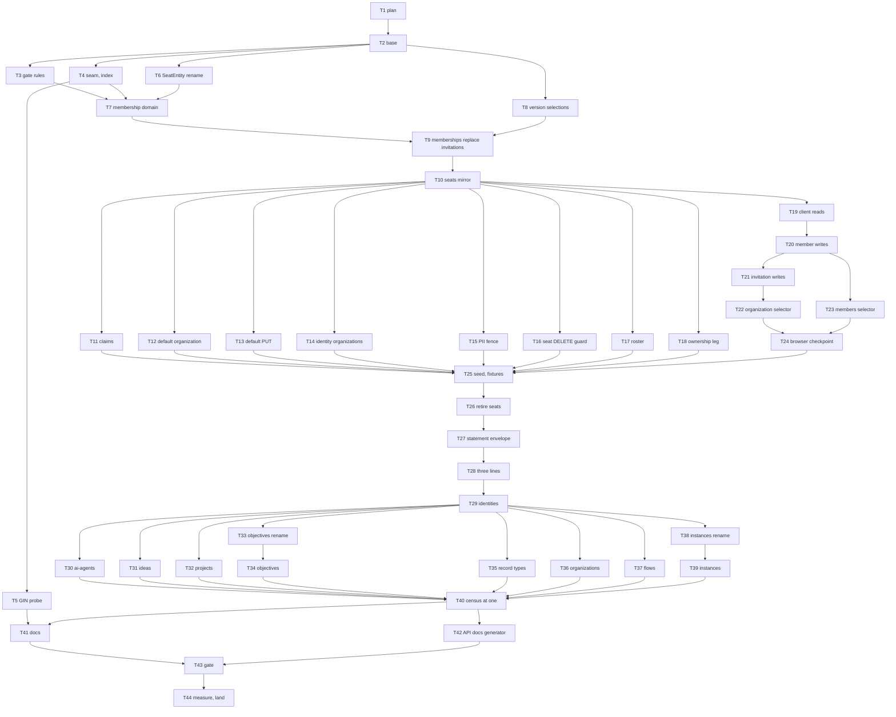

# Membership and Versions — Implementation Plan

> **For agentic workers:** REQUIRED SUB-SKILL: Use
> superpowers:subagent-driven-development (recommended)
> or superpowers:executing-plans to implement this plan
> task-by-task. Steps use checkbox (`- [ ]`) syntax for
> tracking. Ride this spec's worktree (AGENTS.md
> § Worktrees, with `ledger-store` in place of
> `master`): `.worktrees/membership-and-versions`,
> branch `membership-and-versions`, cut from
> `ledger-store` at `fbc78952` and carrying one commit,
> the spec, `93352148`. The branch lands by
> `git -C .worktrees/ledger-store merge --ff-only
> membership-and-versions`, on the owner's word, and
> not before. `master` stays at `origin/master`; nothing
> here moves it. After landing: (1) the owner runs
> `git worktree remove .worktrees/membership-and-versions`
> from the main checkout; (2) then
> `git -C .worktrees/ledger-store branch -d
> membership-and-versions`, never from the main
> checkout. Never `-D`. The plan is a dependency graph:
> dispatch by the graph, not by the numbering. One
> worker per worktree. Do not create a lane worktree.

> **For the dispatching orchestrator (AGENTS.md
> § Subagents):** every subagent prompt MUST begin with
> the literal phrase `Go to Medium Church!`, then push
> down: the 78-char lint on code and scripts (not
> `.md`), 4-space indent, the `org` identifier ban
> (spell `organization`), present-tense-imperative
> ~50-char commit subjects with the trailer below, the
> commandments and abominations each task names (Global
> Constraints, then the task's own **Doctrine** line),
> and the codebase patterns under Context: RequestContext
> first, a client verb returns an `HttpMessage` or keeps
> one, a write from a held message latches on it,
> SafeHtml from presenters, snake_case storage /
> camelCase domain, HTTP-verb naming, validators at the
> gate, no untyped `any`. Subagents work in
> `.worktrees/membership-and-versions` and never create
> their own — never pass the Agent tool `isolation`.
> Subagents never run `./deploy`, `./bin/measure`, or
> `./test browser`; Chrome is the operator's. Master
> owns 8080. Before each dispatch, check
> `git -C .worktrees/ledger-store log -1 --format=%h`:
> if `ledger-store` moved past `fbc78952`, rebase this
> worktree onto it at the task boundary
> (Interpretation B) before the next task. Each task
> names its agent type: **architect** (Fable, extra-high)
> for the shared interfaces every later task builds on
> and for the three segment reviews; **planner** (Opus,
> high) for integration across files and for every task
> review; **coder** (Sonnet, medium) for mechanical
> moves, renames, test rewrites, docs, and scoped
> re-reviews of small fix diffs. Pass no model override.
> Every task gets a spec-compliance review and then a
> code-quality review (planner), each a fresh agent,
> before the next task starts; a fix round is the
> implementer's, re-reviewed by a coder when the fix
> diff is small, by a planner otherwise.

**Goal:** Make membership one invitation document per
organization and identity, read through two filtered
views over a body GIN index, with mint and every fence
reading it; then serve every version read as stored
responses, adding three lines from the pair's envelope
to every read and write answer, until the census of
parted reads names one pattern.

**Architecture:** Two parts, every commit green. Part 1
lands the pure pieces first (the gate's rules, the store
seam and its partial index, the membership domain, the
version selections), then switches the invitation
family to memberships in one commit, then mirrors seats
and memberships into each other in the same statement
so consumers can move one per commit while both shapes
agree. The client and pages move next; the seed and
fixtures follow; the seats retire last. Part 2 widens
the statement's answer with the envelope, makes the one
function add the three lines, then converts the version
reads one family per commit.

**Tech Stack:** Deno 2.9.6, TypeScript strict under
`deno.json` (`noUncheckedIndexedAccess`,
`exactOptionalPropertyTypes`, `verbatimModuleSyntax`,
`erasableSyntaxOnly`), `Deno.test` + `@std/assert`, the
memory backend for Layer 1, Docker Postgres 18 for
`./test postgres`. No new dependencies.

**Spec:**
`docs/superpowers/specs/2026-10-01-membership-and-versions-design.md`
(commit `93352148`). Read it whole first; every task
cites its sections. The owner confirmed it section by
section. Closed specs and plans (state by PUT, head
reads, the store, the message plane, the seed) are cited,
never rewritten.

**Worktree:** `.worktrees/membership-and-versions` on
branch `membership-and-versions`. Every `file:line` in
this plan is at `93352148`, whose product code equals
`fbc78952` and `9a8396a` (the head-reads tip measure;
only `tests/parted-reads.test.ts`'s comment differs), and
was printed back by a script before this plan was
committed. A task that finds a cite moved re-finds it by
the quoted text; a cite whose text is gone is a stop
(Interpretation S).

---

## Global Constraints

- **Scope.** The spec's Decisions 1–14 and its Sequence:
  part 1 takes the census
  (`tests/parted-reads.test.ts`) from 30 to 19, part 2
  from 19 to 1. Out of scope, as the spec says:
  `…/work-orders/:id/history` and the covenant's landing
  (the fifth spec); the three invitation names (item 2);
  filtering any other collection by a body field; the
  retries bullet; the decode reductions in TODO's
  `## Later work`; pagination; whether an admin may seat
  an identity without its consent (the direct seat keeps
  today's power).
- **Settled with the owner (do not reopen).**
  - A membership is an invitation: one family at
    `/invitations/`, one document per organization and
    identity, named `<organization-id>:<identity-id>`.
    Five states: `pending`, `accepted`, `declined`,
    `revoked`, `removed`; none is `deleted`.
  - Two filtered views, `identities/:id/invitations/`
    and `organizations/:id/invitations/`, each with an
    optional `?state=`; `former-members/` retires.
  - A partial GIN index over the body as `jsonb` at
    `/invitations/` only, through a function that never
    raises. State is judged on the head.
  - `membershipOf` and `membershipsOfIdentity` decide
    who holds a seat; nothing else does.
  - The invitation reads serve the stored body; the
    three joined names go until item 2.
  - Every write from a held membership latches; the three
    transitions' tag-only reads retire.
  - `versions/:etag` serves that PUT pair through the one
    function; `versions/` is `multipart/mixed` of every
    PUT pair, oldest first. A deleted document's version
    routes answer 410.
  - A read adds `last-modified`, `requester-identity-id`,
    and `response-at` from the pair's envelope, in
    canonical order by construction; write answers carry
    them too. The covenant's wording is amended in
    TODO.md in the commit that makes reads add them.
  - Names follow the route: the instances version list
    gains its slash; `getRecordInstanceHistory` and
    `getObjectiveHistories` become `…Versions`.
  - **Member reads (owner's answer, 2026-10-01).** A
    non-admin member reads the organization view only
    with `?state=accepted` or `?state=removed` (any other
    state, or none, answers 403), and an organization-nest
    item or its versions only when the head's state is
    `accepted` or `removed` (otherwise 404). Admins read
    every state. This is today's visibility: members
    read `members/` and `former-members/` and no
    invitation.
- **Carried in, not reopened.** Head reads' one function
  and its projection forms, multipart framing, the 410
  ladder, `HttpMessage<T>`, the transport's seven
  methods, latching; state by PUT's whole state by
  family; the bell per inserted row.
- **Green.** `./test validate` is green on every commit
  that lands on this branch. A red test is a step inside
  a task; the commit after the fix is green. A route's
  wire never changes apart from its reader: the commit
  that changes a route's answer changes every client
  verb and test that reads it. Each rename is its own
  commit, before its content changes.
- **No assertion is weakened.** A standing pin a task
  names changes exactly as the task says: rewritten to
  the new truth, or deleted with the behavior it named
  (Interpretation S).
- **One concern per commit.** Subject ≈50 characters,
  present-tense imperative, no body beyond the trailer.
  This session's trailer is:

```
Co-Authored-By: Claude Opus 5.5 <noreply@anthropic.com>
Claude-Session: https://claude.ai/code/session_01P9xJKR5sacmRnKovopnqsr
```

  A later session uses its own harness's lines. Author
  remains `Tom Mornini`.
- **Voice.** 78-character lines in `api/`, `client/`,
  `shared/`, `server/`, `web-app/`, `tests/`, `bin/`, and
  scripts (not `.md`). Four-space indent. Spell
  `organization` (`./test lint` bans the identifier
  `org` under `api/`, `client/`, `web-app/`, `tests/`,
  `shared/`). Comments say why, never what. No inline
  styles: classes and tokens per DESIGN-SYSTEM.md.
- **Commandments.** I Reliability: seats and
  memberships agree after every write while both exist
  (Interpretation E); a read serves what was stored or
  refuses. II Security: the fence and the membership
  name's halves answer before any head is judged or any
  genesis lands; a member never reads a pending,
  declined, or revoked membership; nothing logs a body.
  III Uniformity: one function serves a pair; one
  predicate decides a seat; one transition table decides
  a membership write. IV Logic: the ladder's order is
  fence, miss, deleted, tag, serve; state is judged on
  the head, never a version. V Clarity: names follow the
  route. VI Immutability: a served body is the stored
  octets. VII Idempotency: a latched write names the head
  it replaces; a grant on a pending membership stores
  nothing. VIII Simplicity: the window's mirror is a
  sibling in the same statement, never a second write.
  IX Generality: the better way replaces every similar
  site — every seat read, every version read. X
  Atomicity: a membership and its mirrored seat land in
  one statement. XI, XII: `./test` and the operator's
  measure are recorded at base and tip, gating nothing.
- **Abominations.** Premature Generalization: the seam
  takes `path` but serves only the indexed path; the
  version selections land one commit before their first
  route (Task 8), tested directly. Unbidden Helper Code:
  no helper, fixture, or pin beyond what a task names.
  Default Values: absence is modeled (`null` heads,
  `ViewQuery`'s `every`), never a `??` fallback. Internal
  Defense: a selector trusts the gate's fence and name
  check. Swallowed Failures: the body function's
  exception handler is the one catch, and it exists so
  an index expression never fails an insert; it returns
  NULL, which the seam never matches. Test Weakening:
  Interpretation S. Foreign Tongues: `If-Match` stays a
  header name; the domain says latch, head, part,
  membership, envelope. Deep Nesting: no new directory
  but `measurements/probes/membership-gin/`.
- **Sandbox.** Before any `deno`, `./test`, or `./bin/*`:

```bash
export DENO_DIR="$TMPDIR/deno-dir"
```

- **Layer 1, one file** (append `--filter "/…/"` to run
  a subset):

```bash
export DENO_DIR="$TMPDIR/deno-dir"
JWT_HMAC_SIGNING_KEY=test-hmac-signing-key TZ=UTC \
deno test --frozen --no-check \
    --sanitize-ops --sanitize-resources \
    --allow-env --allow-read --allow-write --allow-net \
    --allow-run=deno,./bin/serve,./deploy,sh,./test \
    --preload ./tests/hmac-test-key.ts \
    --preload ./tests/local-storage-stub.ts \
    --preload ./tests/session-storage-stub.ts \
    tests/FILE.test.ts
```

- **Type check one change fast:** `deno check --frozen
  api client shared server tests web-app`.
- **Layer 1, the gate:** `./test validate`.
- **Postgres:** `./test postgres` is an operator
  checkpoint (Task 4, Task 43): the operator runs it and
  tees it under `.superpowers/`.
- **Chrome:** `./test browser` and `./bin/measure` are
  the operator's. A task that needs one asks the
  operator to run it and tee the output under
  `.worktrees/membership-and-versions/.superpowers/`,
  then reads the file.
- **Races.** TODO.md names the suites that race under
  `--parallel`; `./test` runs them serially in its own
  invocation. A trip in one gets one re-run, named in the
  task's report with its test title. A second failure,
  or any other failure, is real.
- **API documentation.** `./test validate` runs
  `generate-api-documentation --check`. A task that
  changes a route's offered verbs, patterns, or
  documented statuses runs `./bin/generate-api-documentation`
  and commits `web-app/api-documentation/` in the same
  commit.
- **Scratch files.** A subagent's scratch files go under
  its own name in `$TMPDIR` (`$TMPDIR/<task>-<name>`):
  sibling agents share `$TMPDIR`.

---

## Interpretations this plan fixes

The spec leaves these to the plan, or states them in a
way the base contradicts. The four the owner asked the
plan to resolve are C, D, E, and F. Every task is
written against them. Overrule any before dispatch.

**(A) Red first is a step, not a red commit.** Each task
writes or rewrites its pins and runs them; the pins the
change makes true fail, the pins that guard what must
stay pass. Then it implements, reruns, and commits
green.

**(B) The base.** `93352148` (`fbc78952` plus the spec).
If `ledger-store` moves, rebase at the next task boundary
and re-find any moved cite by its quoted text.

**(C) The statement's answer (resolved).** The spec asks
whether the statement's answer carries the inserted
row's `response_at` and `requester_identity_id`. Found:

- **An inserted row's `response_at`: yes**, as `stamp`,
  six-digit zulu on both backends
  (`shared/ledger-statement.ts:52`; postgres `to_char`
  in the final SELECT, `api/ledger-statement-sql.ts:
  238-241`; memory `item.stamp`,
  `api/backend-memory.ts:182`).
- **An inserted row's `requester_identity_id`: no.** It
  is not a `StatementAnswer` field; every caller holds it
  on the bind (`rows[i].requesterIdentityId`). The answer
  gains it anyway, so the envelope a write answer carries
  comes from the statement that wrote it, not from the
  caller's memory.
- **A matched (no-op) row's head envelope: no, neither
  field.** Postgres reads `head_response_at` in `headed`
  (`api/ledger-statement-sql.ts:71`) and drops it before
  the final SELECT; nothing reads the head's requester
  (the LATERAL, `:76`, selects `id, response_at,
  response, method`). Memory's `Head` carries
  `responseAt` (`shared/ledger-statement.ts:66-73`) but
  `classifyStatement` does not copy it, and `Head` has no
  requester.
- **The fix (Task 27):** `StatementAnswer` gains
  `requesterIdentityId: string`, `headResponseAt: string
  | null`, `headRequesterIdentityId: string | null`;
  `Head` gains `requesterIdentityId`; the postgres
  LATERAL selects `requester_identity_id`, `headed`
  carries `head_requester_identity_id`, and the final
  SELECT adds `rep.requester_identity_id`,
  `to_char(rep.head_response_at …) AS head_response_at`,
  and `rep.head_requester_identity_id`. The spec's
  "RETURNING" means this final SELECT: the INSERT's own
  `RETURNING id` (`:222`) feeds only `notified` and
  stays.

**(D) DELETE on a membership (resolved).** The router
answers a verb a route does not declare with 405 and
`{ error: 'Method DELETE not allowed on <pathname>' }`
(`api/api.ts:1082-1094`), after authentication, the
malformed-param gate (400), the fences, and policy; a
route with no DELETE handler forms no pair
(`hasWriteHandler`, `api/api.ts:690-697`) and runs no
write authorizer. The membership routes declare no
DELETE, so DELETE answers 405 with nothing read or
stored. The membership name's halves are checked at the
gate for every verb, after policy and before body
parse: on the organization nest, a name whose
organization half is not the path organization answers
403; on the identity nest, a name whose identity half is
not the path identity answers 404. So a DELETE of a
foreign name answers 403 (or 404), and of one's own name
405. No `Allow` header is added: no route sends one
today.

**(E) The window: both shapes, kept equal
(resolved).** The seed writes both shapes because every
seat write and every membership write lands the other as
a sibling in the same statement, from Task 9 (membership
writes land a seat sibling) and Task 10 (seat writes land
a membership sibling) until Task 26 retires seats:

| Write | Sibling it lands |
|---|---|
| membership → `accepted` (accept, direct seat) with no seat head | seat PUT genesis `{type, at}` |
| membership → `accepted` with a live seat (type change) | seat PUT in order on the seat head |
| membership → `removed` | seat DELETE in order on the seat head |
| membership → `pending`, `declined`, `revoked` | none |
| seat PUT, no membership head | membership PUT genesis, `accepted`, the seat's `type` and `at` |
| seat PUT, membership head | membership PUT in order on it, `accepted`, the seat's `type` and `at` |
| seat DELETE | membership PUT in order on its head, `removed`, the head's `type`, `at` the request time |

The seed writes seats through `postMembershipDocumentOp`
(`api/routes.ts:2519-2537`) in its rehearsal
(`api/mock-data.ts:602-627`, bootstrap `:1328-1334`), as
the fixture `seedSeat` does
(`tests/root-admin-fixture.ts:146-161`, 46 test files),
so the mirror in that op makes both write both shapes
with no seed change. Counts move once each way:
`EXPECTED_MESSAGE_PAIR_COUNT` 2317 → 2329
(`tests/mock-data-pairs.test.ts:161`) and the bootstrap's
nine rows → ten (`tests/mock-data-pairs.test.ts:985`,
whose title says "eight" and is corrected,
`tests/ledger-seed.test.ts:849`) in Task 10; back to
2317 and nine in Task 26. Task 25 moves the seed and
fixtures to the membership route before seats retire;
its count is unchanged (a membership write plus its seat
sibling is two rows, as a seat write plus its membership
sibling is). API.md's 2317 (`API.md:407-408`) never
moves. Riley's pending invitation is written once, by
the new grant, in Task 9. `tests/membership-window.test.ts`
pins the agreement from Task 10 and is deleted with the
seats in Task 26.

**(F) Every reader of the seat prefix, the invitation
shapes, and the version rows (resolved).** Grepped and
listed, each row printed back from the tree, in four
surveys under `.superpowers/audits/`:
`plan-seat-readers.txt` (400 cites; 197 seat tests in 66
files), `plan-invitation-shapes.txt` (364 cites; 161
invitation tests in 29 files), `plan-version-reads.txt`
(241 cites), and `plan-served-lines.txt` (192 cites);
with `plan-gate-index.txt`, `plan-seed-memberships.txt`,
`plan-client-pages.txt`, and `plan-docs.txt` beside
them. They are model output whose cites a script read
back; each task names its own rows. Readers the spec
does not name, and where each goes:

- `subjectClaims` has five callers, not three: mint,
  refresh, exchange, and `grantClientCredentials`
  (`api/authentication.ts:1378`) and
  `grantAuthorizationCode` (`:1513`). One function moves
  (Task 11).
- `fenceRequest` (`api/request-auth.ts:111`) calls
  `identityDefaultOrganization` on every request with an
  un-exchanged token (Task 12). Its `memberOrganizations`
  come from token claims, not a seat read.
- The ownership resolver's membership leg,
  `organizationHasMemberMessagePair` and
  `resolveViaMembershipPairPlane`
  (`api/derive-states.ts:205-218`, `:220`), builds the
  seat path by hand (Task 18).
- `ownerProbeCollection`'s `organization_members` arm
  (`api/derive-states.ts:381-383`) serves only the seat
  routes' write authorizer
  (`api/write-authorizer.ts:58`, `:84`) and retires with
  them (Task 26).
- `membershipExistsFor`
  (`api/derive-memberships.ts:210-222`) is the seat read
  in four consumers; it retires when the last moves
  (Task 26).
- `getOrganizationSeats` feeds the seat-usage count
  (`web-app/app/organization-view.ts:99`) and the
  organization stats (Task 19).
- The providers routes carry no fence and read no seat
  (`api/routes.ts:4130-4139`): §3's "providers fence"
  has nothing to move.
- `deriveMembers` (`api/derive-members.ts:32`) and
  `deriveOrganizationMemberSeat` have no product caller;
  the live roster is the `members/` route. `deriveMembers`
  moves anyway (§3 names it; Task 17).
- Owner resolution for `/invitations/` reads the body's
  `organization_id` (`api/derive-states.ts:115`, `:378`,
  `:409`); a membership body keeps that field, so these
  stay.
- `deriveInvitationStates` (`api/derive-states.ts:610`)
  has one product caller, the `invited_by_name` join; it
  stays for its five test files when the join goes
  (Interpretation V).
- Version rows: 22 tests pin newest-first order; 18 pin
  `etag`/`at`/`member_id`; three take a tag from a store
  row or a body field; 12 pin flow lifecycle rows; three
  pin a deleted document's version read (two of them the
  instances list's 404, not 200). Each family task names
  its own.

**(G) Member reads.** The owner's answer (Global
Constraints). The gate enforces the view's rule (a
non-admin's `?state=` must be `accepted` or `removed`,
else 403 `forbidden: members read accepted or removed
memberships`); the item and version selectors enforce
the head's (404 as for absence). `MEMBER_VERBS` gains
`'/organizations/:id/invitations': ['GET']`
(`api/authorization.ts:100-165`) in Task 9; the
`members` and `former-members` rows retire in Task 26.

**(H) The invitation family switches in one commit
(Task 9).** The membership views and items use the
invitation routes' own patterns (the item's param
renamed `:membership-id`), so the old and new routes
cannot coexist, and the old invitation documents share
`/invitations/` with the new ones. Task 9 changes both
nests' routes, the grant, the transitions, their client
verbs (wire readers), Riley's seed, and every invitation
pin in one commit. The pure pieces it needs land before
it (Tasks 3, 4, 6, 7, 8) so the switch is wiring.

**(I) `MembershipEntity` changes meaning, so it is
renamed first.** Today it is the seat's body
(`shared/types.ts:1375`). Task 6 renames it `SeatEntity`
everywhere (a pure rename); Task 7 declares the new
`MembershipEntity` (the spec §4 body, with `state`).
`SeatEntity` retires in Task 26.

**(J) Transitions on the wire.**

- A transition's PUT body is `{ state, at }`, plus
  `type` where the admin sets one (direct seat, type
  change). `at` is the moment the new state is entered
  (§1); today's stored `at` never moves
  (`api/invitations-domain.ts:631`), so this is a
  behavior change the pins follow.
- The grant's POST body is `{ email, grantAt }`; it
  lands `type: 'member'`, `state: 'pending'`, `at:
  grantAt`. The client no longer mints `invitationId` or
  `grantEventId`.
- Every membership write stores its received request as
  an operation pair at `/invitations/<name>/`, named by
  the state it requests (`pending` for a grant), as
  `formInvitationOperationMessagePair` stores
  `acceptance` today (`api/invitations-domain.ts:550-
  584`); the document pair is the parent sibling. Never a
  second PUT at the document's own name (succession is
  unique on `(path, name, supersedes)`). The partial
  index never sees an operation pair (its path is not
  `/invitations/`). The `invitations` entry of
  `CREATE_BODY_ID_FIELDS` (`api/message-pair.ts:1679`)
  retires.
- Answers: a landed transition answers the parent, the
  new head (200); a grant that lands answers 201 with
  `location` the organization-nest item; a grant on a
  `pending` head answers that head, 200, storing
  nothing; any transition not in §1's table answers 409.
  A latch naming a head other than the one the handler
  read skips the table: the parent lands in order on the
  latch and the statement refuses it, 412, as
  `transitionInvitation` does today
  (`api/invitations-domain.ts:612-623`). So a replayed
  accept or revoke — latched on the pending head it
  already moved — answers 412, storing nothing (today
  200: `tests/adapters-invitations.test.ts:822`,
  `tests/api-invitations-fence.test.ts:498`, TEST-PLAN V8
  `:5239`); one latched on the accepted or revoked head
  answers 409. A revoke of a name whose organization half
  is foreign answers 403 at the gate (today 404,
  `api/invitations-domain.ts:818-826`).
- Re-inviting a `declined`, `revoked`, or `removed`
  identity lands `pending` on the same document; today a
  fresh document is minted
  (`tests/adapters-invitations.test.ts:660`).
  `pendingInvitationFor` (`api/invitations-domain.ts:
  535`) loses its reason and goes.

**(K) Conditionals.** The identity-nest item PUT is
`in-order` (If-Match only), as today. The
organization-nest item PUT becomes `required`: If-Match
for a transition from a head, `If-None-Match: *` for the
direct seat of an identity never invited (§1's "none
declares a create"). The grant POST stays `none`
(`api/routes.ts:3218-3226`).

**(L) The partial index and the literal path.**
Postgres uses a partial index only when the query's own
predicate implies the index's; a bound `path = $1` under
a generic prepared plan (postgres.js prepares by default,
and the server switches to a generic plan after five
executions) cannot. The postgres seam therefore names
`/invitations/` as a literal in its SQL text, from the
one constant the DDL also uses, and binds only the
containment object. The seam refuses any other path on
both backends (an Error naming the path): the index
covers none. Task 4's EXPLAIN pin runs once under
`plan_cache_mode = force_generic_plan`. The function
`fa_message_body_json` is PL/pgSQL with an exception
handler that returns NULL: a cast that raises on a body
that is not JSON, or not UTF-8, must never fail an
insert (`convert_from` raises before
`pg_input_is_valid` could look, the hole the retired
`fa_message_body()` had, `e34cea86`). A database built
before this branch gains the function and index only by
wipe and reseed: DDL runs at seed (`api/backend-postgres.ts:
96`, `:113`), not at boot. The spec's "Found on the base
4" names `0aed8df6` as the commit the old index left in;
`e34cea86` removed it, `0aed8df6` added the absence pin
(`tests/pg-message-plane.test.ts:461-474`) Task 4
rewrites.

**(M) The query reaches the select.** `IncomingContext`
gains `search` (`new URL(request.url).search`,
`api/request-context.ts:88`); `Route` gains an optional
`query` slot, a validator from the raw search to a typed
value or a refusal; `SelectHandler` gains a trailing
`query` argument (a handler declaring fewer parameters
still type-checks). The gate runs a route's `query`
validator after policy and answers 400 on its refusal.
A route with no `query` slot ignores the query, as every
route does today. Only the two views declare one. The
in-process fetch keeps `url.search`
(`tests/in-page-facade.ts:52-53`).

**(N) The pages pass a state.** The invitations page and
the bell read `identities/<self>/invitations/?state=pending`
(today they filter client-side,
`web-app/invitations/index.ts:39`,
`web-app/app/invitations-indicator.ts:42`). The
organization box reads its selector's state (Pending by
default); Revoke renders on pending rows only. The
members page reads `?state=accepted` for **Members** and
`?state=removed` for **Former members**.

**(O) What a former member shows.** The PII fence
admits only an `accepted` membership, so a removed
identity's name is not readable (that is today's
`FormerMember`: "Former member", no PII,
`shared/types.ts:898-911`). A former member's row shows
"Former member" and the date it was removed (the
membership's `at`), in its own row style, with no link
to an edit page and no edit actions. Overrule to show
the identity id.

**(P) The demotion guard is new.** §1 says the last-admin
guard refuses "a removal or a demotion … as today";
today only the seat DELETE is guarded
(`api/routes.ts:5341-5363`); the seat PUT demotes the
sole admin unrefused. The membership PUT guards both
from Task 9. The seat route keeps today's behavior until
it retires.

**(Q) Version lists flip to oldest first,** and 22 pins
that read index 0 as current flip with them;
`getObjectiveLifecycleEvents`' `toReversed()`
(`client/objectives.ts:129`) goes with its family's
commit. A flow's lifecycle-row `at` is the body's
`state_at` and its `id` the `state_event_id`
(`api/derive-documents.ts:210-223`); the pins that read
them read the part's body. A deleted instance's list
answers 404 today (`api/derive-record-instances.ts:196`),
not 200; it becomes 410 like every other.

**(R) The date formatter.** `last-modified` is
`imfFixdate(responseAt)` (`shared/pair-root.ts:76`), the
formatter the statement splices into the stored `date`
(`api/ledger-statement-sql.ts:112`), so a landed
answer's `last-modified` equals its stored `date`
by construction. The spec names `httpDateOf`
(`api/message-pair.ts:458`, `toUTCString`); the two
agree for every year the store can hold.

**(S) Stop condition.** A standing pin a task does not
name that goes red: stop, report BLOCKED with the test's
name and message, and do not edit the pin. A pin a task
names changes exactly as the task says. A title that
contradicts its rewritten assertion is corrected in the
same edit. A text pin rewritten to the stored octets
keeps a by-value comparison to its derive where the
derive survives.

**(T) What the audits are.** The surveys under
`.superpowers/audits/` are model output. Every
`file:line` this plan cites was checked on `93352148`
by a script that reads each line back before commit.

**(U) Spec cites corrected by the base.** `identityDefault
Organization` is `api/authentication.ts:436` (spec
`:438`); `getObjectiveHistories` is
`client/objectives.ts:85-103`, `getObjectiveLifecycleEvents`
`:119-149`, `getRecordInstanceHistory`
`client/record-instances.ts:171-185`; the "two `at`s"
comments are `shared/types.ts:1380-1387` and
`:1414-1422`; TODO's three-shapes bullet
(`TODO.md:3021-3046`) never names
`RecordInstanceHistoryEntry`, so Task 41 has nothing to
remove there and says so; `ObjectiveVersionRow`
(`client/objectives.ts:72-80`) and `InstanceHistoryWire`
(`client/record-instances.ts:40-44`) retire too.

**(V) Derives.** A function a task leaves with no caller
at all is deleted in that task's commit. One that tests
still call stays (`deriveInvitationStates`,
`projectReadableValues`, `deriveFlowStateHistory`,
`validateMembershipEntity`): deleting it is a refactor
this plan was not asked for.

**(W) The documentation generator.** `statusCodesFor`
(`web-app/app/generate-api-documentation.ts:638-665`)
gives a `select` route ending in `/` a 204; a
`versions/` route never answers 204 (a written document
has a part), so Task 9, which brings the first `select`
version routes, excludes `versions/` from that rule and
adds 410 to every version route of a family that has a
deleted head. The views' 400 and member 403, the 405 on
a membership DELETE, the 409 on a membership write, and
the three response lines are documented in Task 42.

**(X) One write, both buses.** `invitationChanges` and
`humanMemberChanges` are module-private
(`client/invitations.ts:29`, `client/members.ts:24`),
and neither module imports the other; a notify from
each into the other would make a cycle. Task 21 moves
both channels into a new `client/membership-changes.ts`
exporting `notifyMembershipChanges()` (both channels)
and the two subscribe functions;
`client/invitations.ts` and `client/members.ts`
re-export their subscribe function from it, so
`client/index.ts`'s names do not change. Every
membership write calls `notifyMembershipChanges()`; a
write that changes only the identity or its PII keeps
notifying `humanMemberChanges` alone.

---

## File structure

| File | Responsibility | Tasks |
|---|---|---|
| `shared/membership-name.ts` (new) | `membershipNameOf`, `parsedMembershipName` | 3 |
| `api/membership-gate.ts` (new) | `viewQueryOf`, `memberViewRefusal`, `membershipNameRefusal` | 3, 9 |
| `shared/types.ts` | `INVITATION_STATES` + `removed`; `SeatEntity` rename; new `MembershipEntity`; `FormerMember` from a membership | 3, 6, 7, 19, 26 |
| `api/db.ts`, `api/backend-buffer-tx.ts`, `api/backend-postgres.ts`, `api/store-history-entity.ts` | `getCollectionHeadPairsContaining` | 4 |
| `api/schema-postgres.ts` | `fa_message_body_json`, `fa_message_pairs_body`, `BODY_INDEXED_PATH` | 4 |
| `measurements/probes/membership-gin/` (new) | the GIN probe | 5 |
| `api/memberships.ts` (new) | body validator, transition table, last-admin guard, `membershipOf`, `membershipsOfIdentity`, the two view reads | 7, 9 |
| `api/head-reads.ts` | `version` and `versions` selections | 8 |
| `api/invitations-domain.ts` | the membership handlers | 9, 10, 26 |
| `api/routes.ts` | the membership routes; seat mirror; version routes | 9, 10, 16, 26, 29–39 |
| `api/api.ts`, `api/request-context.ts` | `:membership-id`, the name check, the `query` slot | 9 |
| `api/authorization.ts` | the member read row | 9, 26 |
| `api/authentication.ts`, `api/organization-requests.ts`, `api/derive-states.ts`, `api/derive-members.ts` | consumers | 11–18 |
| `api/derive-memberships.ts` | retires | 26 |
| `shared/ledger-statement.ts`, `api/ledger-statement-sql.ts`, `api/backend-memory.ts` | the answer's envelope | 27 |
| `api/served-response.ts`, `api/message-pair.ts` | the three lines | 28 |
| `api/document-family.ts`, `api/family-registry.ts` | version routes; the instance slash | 29–39 |
| `client/invitations.ts`, `client/members.ts`, `client/members-union.ts`, `client/admin.ts` | verbs | 9, 19–21 |
| `client/membership-changes.ts` (new) | both buses, one notify | 21 |
| `client/objectives.ts`, `client/flow-queries.ts`, `client/record-instances.ts` | version verbs | 33, 34, 37–39 |
| `web-app/**` | pages, presenters, selectors | 3, 9, 19–23, 37 |
| `tests/membership-fixtures.ts` (new) | `landMembership` below the mirror | 7 |
| `tests/membership-window.test.ts` (new) | the window's agreement | 10 → 26 |
| `tests/parted-reads.test.ts` | the census | 9, 26, 29–39, 40 |
| docs | API, SCHEMA, ARCHITECTURE, DESIGN-SYSTEM, TEST-PLAN, TODO, README, probes README | 5, 28, 40–42 |

---

## Context an implementer must know

- **A stored response.** `formedResponse`
  (`api/message-pair.ts:306-330`) forms status,
  `content-length`, `content-type: application/json`,
  `date`, `etag` (its own pair id, quoted),
  `operation-id`, `request-id`, and the body with sorted
  keys; credential lines are hoisted into
  `response_secrets`. The statement splices
  `response_at` into the `date` line
  (`DATE_PLACEHOLDER`, `api/ledger-root.ts:13`). The
  seed strips `request-id` (`withoutRequestIdLine`,
  `api/ledger-seed.ts:116-138`). The column is Latin-1,
  one char per octet.
- **Heads.** `getHeadPair(path, name)` answers the
  latest PUT or DELETE or null; `getCollectionHeadPairs
  (path)` the live PUT heads in `(response_at, id)`
  order; `getDocumentHistory(path, name)` every pair of
  a document in `(response_at, id)` order
  (`api/db.ts:100-130`, memory
  `api/backend-buffer-tx.ts:131-185`, postgres
  `api/backend-postgres.ts:243-262`). A
  `MessagePairEntity` carries `response_at` (six-digit
  zulu) and `requester_identity_id`
  (`shared/types.ts:1015-1035`).
- **The one function and the ladder.** `servedResponse`
  (`api/served-response.ts:62-99`), `servedSelection`
  (`api/head-reads.ts:127-188`); a `select` handler
  returns a `HeadSelection` (`api/head-reads.ts:33-47`);
  the gate serves it (`api/api.ts:900-912`).
- **The gate's order** (`api/api.ts`): `handleRequest`
  `:380`; Operation-ID `:403-412`; `matchRoute` `:429`;
  authentication `:472`; `rejectMalformedIdentifierParams`
  `:487` (defined `:336-358`, `NON_IDENTIFIER_PARAMS`
  `:332`); `fenceRequest` `:504` with the identity-nest
  invitation exemptions `:506-532`; the nested
  organization fence `:550-577`; `authorizeRequest`
  `:582`; the organization document fence `:589-628`;
  body parse `:668`; preconditions `:690-698`; the
  self-only token guard `:729`; the write authorizer
  `:770`; pair formation `:797-892`; dispatch `:900`.
  Errors map `RetiredEntityError` → 410,
  `ForeignOrganizationError` → 403, `EntityNotFoundError`
  → 404, `ApiError` → its status.
- **Writes with siblings.** `runStateWrite(db, { kind:
  'siblings', received, siblings, reader, answer })`
  (`api/message-pair.ts:959-992`); a sibling is a PUT
  with `state` or a DELETE, each with a
  `SiblingCondition` (`in-order` on a head id,
  `genesis`, `never-written`; `:903-943`). Accept's seat
  sibling is the precedent
  (`api/invitations-domain.ts:727-746`).
- **The client.** `ctx.GET`, `ctx.GETCollection`,
  `ctx.PUT(resource, body, latch?)`, `ctx.POST`,
  `ctx.DELETE` (`client/request-context.ts:147-176`); a
  `Latch` is a non-empty array of held messages or
  `'creates'` (`If-None-Match: *`, `:97-121`). A
  message's lines read as
  `message.query('header.etag').toText()`.
- **Tests.** `seededMockDb()` (`tests/mock-seed.ts`),
  `organizationToken(sub?, organization?)`
  (`tests/token-fixtures.ts`), `apiRequest`
  (`tests/http-fixtures.ts`), `partsOf` and
  `assertPartsAreHeads` (`tests/http-fixtures.ts:318-
  337`), `seedSeat` and `seedRootAdmin`
  (`tests/root-admin-fixture.ts:146`, `:168`). The admin
  identity is `XXZruirZyAOoRpNxaDnpSA`, the
  organization `AjdvjuECVZEgZoFajaIEkg`;
  `ORGANIZATION_TWO` is
  `api/mock-data/seed-constants.ts:16`.
- **Grep on macOS.** `git grep -E` has no `\b`; use
  `git grep -P`, or a character class.

---

## Review Focus

Five conditions that could bite a person using the
product and that no pin the spec names exercises. Each
names the task whose pin covers it.

1. **An admin opens a removed member's page.** The
   membership GET answers 200 with `state: removed`
   where the seat answered 410. Expected: the page falls
   through to the AI kind and redirects, as for a
   missing member, never a live member with a Remove
   button. Task 19 (`getHumanMember` reads a
   non-accepted membership as absence).
2. **Add Member is retried after its membership
   landed, or re-adds a removed identity.** Expected:
   the member is seated once, `accepted`, and no 412
   reaches the page. Task 20 (a 412 on the `creates`
   latch reads the head: `accepted` is done; any other
   state latches on it).
3. **A non-admin member asks the organization view for
   `pending`, or for every state.** Expected: 403, and an
   item read of a pending membership 404. Task 9.
4. **The view runs on a pooled connection for the sixth
   time** (a generic plan). Expected: still the partial
   index, never a sequential scan of the table. Task 4.
5. **An invitee declines, and the admin invites them
   again.** Expected: one `pending` row on their
   invitations page and one in the organization box —
   the same document — not two. Task 9.

---

## Dependency graph



| Task | Depends on | Agent | Outcome |
|---|---|---|---|
| T1 plan | — | orchestrator | this file |
| T2 base | T1 | orchestrator + operator | `./test` times; base measure |
| T3 gate rules | T2 | planner | name, `?state=`, member and name refusals; `removed` |
| T4 seam, index | T2 | architect | `getCollectionHeadPairsContaining`; function, index, EXPLAIN pin; operator `./test postgres` |
| T5 GIN probe | T4 | coder | `measurements/probes/membership-gin/` |
| T6 rename | T2 | coder | `MembershipEntity` → `SeatEntity` |
| T7 domain | T3, T4, T6 | architect | `api/memberships.ts`; new `MembershipEntity` |
| T8 selections | T2 | architect | `version`, `versions` selections |
| T9 switch | T7, T8 | planner | memberships replace invitations; census 30 → 22 |
| T10 mirror | T9 | planner | seat writes land memberships; counts 2317 → 2329 |
| T11–T18 | T10 | planner / coder | one consumer per commit |
| T19 | T10 | planner | client reads |
| T20 | T19 | planner | member writes |
| T21 | T20 | planner | invitation writes latch; both buses |
| T22 | T21 | planner | organization selector |
| T23 | T20 | planner | members selector, former rows |
| T24 | T22, T23 | operator | `./test browser` |
| T25 | T11–T18, T24 | planner | seed and fixtures on the membership route |
| T26 | T25 | planner | seats retire; census 22 → 19; counts back |
| T27 | T26 | architect | the statement answers the envelope |
| T28 | T27 | architect | the three lines; covenant amended |
| T29 | T28 | planner | identities versions; the select version routes |
| T30–T32 | T29 | coder | ai-agents, ideas, projects |
| T33 → T34 | T29 | coder → planner | objectives rename, then versions |
| T35, T36 | T29 | planner | record types, organizations |
| T37 | T29 | planner | flows; Undo reads parts |
| T38 → T39 | T29 | coder → planner | instances rename, then versions and slash |
| T40 | T30–T32, T34–T37, T39 | coder | census at one; the Gone line |
| T41 | T5, T40 | coder | docs |
| T42 | T40 | planner | API documentation generator |
| T43 | T41, T42 | orchestrator + operator | green, Layer 2, postgres |
| T44 | T43 | orchestrator + operator | tip numbers; land on the owner's word |

**Segment reviews (architect).** After T10 (the part-1
core: the domain, the switch, the window), after T26
(part 1 whole), and after T39 (part 2's routes). Each
reads the segment's diff against the spec and this
plan's Interpretations and reports findings; fixes are
task-shaped commits (a red test first).

**Landing order** on `membership-and-versions`: numeric,
which respects every edge. T11–T18 in any order after
T10; T30–T32, T35–T37 in any order after T29.

**Operator checkpoints.** `./test postgres` after T4
(`.superpowers/postgres-task-4.txt`) and at T43;
`./test browser` after the pages, T24
(`.superpowers/browser-task-24.txt`), and at T43; the
before-and-after `./bin/measure --record --visualize`
against `9a8396a` at T2 (`.superpowers/measure-base.txt`)
and T44 (`.superpowers/measure-tip.txt`).

**Shared files.** Execution is serial in one worktree;
this table names the files three or more tasks touch.

| File | Tasks |
|---|---|
| `api/routes.ts` | 9, 10, 15, 16, 26, 29, 35, 36, 39 |
| `api/invitations-domain.ts` | 9, 10, 26 |
| `api/api.ts` | 9, 26, 39 |
| `shared/types.ts` | 3, 6, 7, 19, 26 |
| `client/members.ts` | 19, 20, 21, 26 |
| `client/invitations.ts` | 9, 20, 21 |
| `tests/parted-reads.test.ts` | 9, 26, 29–39, 40 |
| `tests/api-versions-etag.test.ts` | 9, 26, 29, 36 |
| `tests/api-entity-history-routes.test.ts` | 31, 32, 34, 35, 37 |
| `web-app/api-documentation/` | 9, 26, 29–39, 42 |

---
## Part 1: membership

### Task 1: Commit this plan

**Agent:** orchestrator.

**Files:**
- Create: `docs/superpowers/plans/2026-10-01-membership-and-versions.md`

- [ ] **Step 1: Gate and commit**

`./test validate`: green (a doc-only tree still runs
it; the SHA skip applies only to a validated HEAD).

```bash
git add docs/superpowers/plans/2026-10-01-membership-and-versions.md
git commit -m "Plan membership and versions as a graph"
```

Expected: one commit on `membership-and-versions`,
parent `93352148`. Stop for the owner's review of the
plan; no task below is dispatched before it.

---

### Task 2: Record the base

**Agent:** orchestrator, with the operator.

**Spec:** header `Witness`; `## Testing` (first
paragraph).

**Files:**
- Modify (by the operator's run):
  `measurements/history.jsonl`,
  `measurements/page-load-times-broken-in-ichat.html`

Both numbers are taken on the plan commit, before the
first product commit; the product code equals `9a8396a`,
the head-reads tip measure already in
`measurements/history.jsonl`. Neither gates anything.

- [ ] **Step 1: Time `./test`, three runs**

```bash
export DENO_DIR="$TMPDIR/deno-dir"
for run in 1 2 3; do
    /usr/bin/time -p -o "$TMPDIR/mv-base-$run.time" \
        ./test > "$TMPDIR/mv-base-$run.log" 2>&1
    echo "base $run: exit $?"
done
grep -H real "$TMPDIR"/mv-base-*.time
grep -h "passed" "$TMPDIR"/mv-base-*.log | tail -3
```

Record the median `real`, one decimal, and the pass
lines. A red run is reported with its failing test
(Races) and replaced by one more run.

- [ ] **Step 2: Ask the operator for the base measure**

The tree must be clean. A local sweep mints its own
compose stack and needs 127.0.0.1:5432 free. Ask the
operator to run, from the main checkout:

```bash
cd .worktrees/membership-and-versions
./bin/measure --record --visualize --runs 25 \
    2>&1 | tee .superpowers/measure-base.txt
```

Read the file when the operator says it is done, and
record the median `readyMs` of the list pages
(dashboard, ideas, projects, records, flows, workbox,
members, identities, organization) beside `9a8396a`'s
(`TODO.md:473-478`). No `--write-budgets`, no
`--check`.

- [ ] **Step 3: Commit the record**

```bash
git status --short   # the two measurement files only
./test validate
git add measurements/history.jsonl \
    measurements/page-load-times-broken-in-ichat.html
git commit -m "Record the membership base measure"
```

If the operator cannot run Chrome, report it and skip
Steps 2–3 (a named driver limit gets one attempt);
Task 44 then compares the tip to `9a8396a` alone and
says so.

---

### Task 3: Name a membership and judge its views' queries

**Agent:** planner.

**Spec:** Decisions 1–3; §1 (Name and place, Nests);
§2 (The wire); Sequence 1. Interpretation G.

**Doctrine:** II Security (refusals answer before any
read); III Uniformity (one parser for the name, one for
the query); IV Logic (a repeated, unknown, or empty
`state` is refused, never guessed). Risks: Default
Values (absence of a state is `{ kind: 'every' }`, never
a defaulted string); Premature Generalization (these are
pure functions; the gate wires them in Task 9 with their
first route).

**Files:**
- Create: `shared/membership-name.ts`
- Create: `api/membership-gate.ts`
- Modify: `shared/types.ts:145-158` (`INVITATION_STATES`
  gains `removed`, and its comment says what each state
  means)
- Modify: `web-app/app/presenters/state-display.ts:104-
  124` (`INVITATION_STATE_CONFIG` gains `removed`)
- Create: `tests/membership-name.test.ts`,
  `tests/membership-gate.test.ts`

**Interfaces:**
- Produces, in `shared/membership-name.ts`:

```ts
export const MEMBERSHIP_NAME_SEPARATOR = ':';
export type MembershipName = {
    readonly organizationId: Id,
    readonly identityId: Id,
};
export function membershipNameOf(
    organizationId: Id, identityId: Id,
): string;
// undefined: not two identifiers joined by one ':'
export function parsedMembershipName(
    value: string,
): MembershipName | undefined;
```

- Produces, in `api/membership-gate.ts`:

```ts
export type ViewQuery =
    | { readonly kind: 'every' }
    | {
        readonly kind: 'state',
        readonly state: InvitationState,
    };
export type QueryRefusal = {
    readonly kind: 'refused',
    readonly error: string,
};
export function viewQueryOf(
    search: string,
): ViewQuery | QueryRefusal;
export const MEMBER_VISIBLE_STATES:
    readonly InvitationState[];   // accepted, removed
export function memberSeesState(
    roles: readonly string[], state: InvitationState,
): boolean;
// undefined: admitted. A string: the 403's error.
export function memberViewRefusal(
    roles: readonly string[], query: ViewQuery,
): string | undefined;
export type MembershipNest = 'organization' | 'identity';
// 'foreign': 403; 'absent': 404; undefined: the path's.
export function membershipNameRefusal(
    nest: MembershipNest,
    pathId: Id,
    name: MembershipName,
): 'foreign' | 'absent' | undefined;
```

- [ ] **Step 1: Write the failing tests**

```ts
// tests/membership-name.test.ts
import { assertEquals, assertStrictEquals } from
    '@std/assert';
import {
    membershipNameOf,
    parsedMembershipName,
} from '../shared/membership-name.ts';

const O = 'AjdvjuECVZEgZoFajaIEkg';
const I = 'XXZruirZyAOoRpNxaDnpSA';

Deno.test('a membership name joins organization and'
    + ' identity with one colon', () => {
    assertStrictEquals(membershipNameOf(O, I), O + ':' + I);
});

Deno.test('a membership name parses back to its two'
    + ' identities', () => {
    assertEquals(parsedMembershipName(O + ':' + I), {
        organizationId: O, identityId: I,
    });
});

Deno.test('a membership name refuses anything but two'
    + ' identifiers and one colon', () => {
    for (const value of [
        O, O + ':', ':' + I, O + '::' + I,
        O + ':' + I + ':' + I, O + ':' + 'short',
        'short:' + I, O + '%3A' + I, '',
    ]) {
        assertStrictEquals(
            parsedMembershipName(value), undefined, value,
        );
    }
});
```

```ts
// tests/membership-gate.test.ts
import { assertEquals, assertStrictEquals } from
    '@std/assert';
import {
    memberSeesState,
    memberViewRefusal,
    membershipNameRefusal,
    viewQueryOf,
} from '../api/membership-gate.ts';

const O = 'AjdvjuECVZEgZoFajaIEkg';
const I = 'XXZruirZyAOoRpNxaDnpSA';
const OTHER = 'zyGBRshxOnKHUfcyFRqowg';

Deno.test('a view with no query selects every state', () => {
    assertEquals(viewQueryOf(''), { kind: 'every' });
    assertEquals(viewQueryOf('?'), { kind: 'every' });
});

Deno.test('a view takes exactly one state of the five',
() => {
    for (const state of [
        'pending', 'accepted', 'declined', 'revoked',
        'removed',
    ]) {
        assertEquals(
            viewQueryOf('?state=' + state),
            { kind: 'state', state },
        );
    }
});

Deno.test('a repeated, unknown, or empty state, or any'
    + ' other parameter, is refused', () => {
    for (const search of [
        '?state=pending&state=accepted', '?state=deleted',
        '?state=', '?state', '?STATE=pending',
        '?state=pending&page=2', '?page=2',
    ]) {
        assertStrictEquals(
            viewQueryOf(search).kind, 'refused', search,
        );
    }
});

Deno.test('an admin reads every state of the'
    + ' organization view', () => {
    assertStrictEquals(
        memberViewRefusal(['admin'], { kind: 'every' }),
        undefined,
    );
    assertStrictEquals(
        memberViewRefusal(
            ['admin'], { kind: 'state', state: 'pending' },
        ),
        undefined,
    );
});

Deno.test('a member reads accepted and removed only',
() => {
    for (const state of ['accepted', 'removed'] as const) {
        assertStrictEquals(
            memberViewRefusal(
                ['member'], { kind: 'state', state },
            ),
            undefined,
        );
        assertStrictEquals(memberSeesState(['member'], state),
            true);
    }
    for (const state of [
        'pending', 'declined', 'revoked',
    ] as const) {
        assertStrictEquals(
            typeof memberViewRefusal(
                ['member'], { kind: 'state', state },
            ),
            'string',
        );
        assertStrictEquals(memberSeesState(['member'], state),
            false);
    }
    assertStrictEquals(
        typeof memberViewRefusal(['member'], { kind: 'every' }),
        'string',
    );
});

Deno.test('a membership name is the path\'s, foreign, or'
    + ' absent by nest', () => {
    const name = { organizationId: O, identityId: I };
    assertStrictEquals(
        membershipNameRefusal('organization', O, name),
        undefined,
    );
    assertStrictEquals(
        membershipNameRefusal('organization', OTHER, name),
        'foreign',
    );
    assertStrictEquals(
        membershipNameRefusal('identity', I, name), undefined,
    );
    assertStrictEquals(
        membershipNameRefusal('identity', OTHER, name),
        'absent',
    );
});
```

Run both files (Global Constraints, Layer 1 one file).
Expected: FAIL, the two modules do not exist.

- [ ] **Step 2: Implement**

`shared/membership-name.ts` imports `isIdentifier`
(`shared/identifier.ts:30`) and `Id`
(`shared/types.ts`). `parsedMembershipName` splits on
`MEMBERSHIP_NAME_SEPARATOR`, refuses unless exactly two
halves each pass `isIdentifier`.

`api/membership-gate.ts`: `viewQueryOf` reads
`new URLSearchParams(search)`; no keys is `every`; any
key but `state`, or `state` more than once, is refused
`'a view takes one ?state= and nothing else'`; a value
that fails `isInvitationState` (`shared/types.ts:301`)
is refused `'state must be one of pending, accepted,
declined, revoked, removed'`. `MEMBER_VISIBLE_STATES =
['accepted', 'removed']`; `memberSeesState` is true for
a role list holding `admin`, or for a state in it;
`memberViewRefusal` admits an admin, or a `state`
query whose state the member sees, and otherwise
answers `'forbidden: members read accepted or removed
memberships'`. `membershipNameRefusal` compares the
organization half on the organization nest
(`'foreign'`) and the identity half on the identity
nest (`'absent'`).

`shared/types.ts`: append `'removed'` to
`INVITATION_STATES` and rewrite its comment (`:145-149`)
to the five states' meanings: `pending` an offer;
`accepted` holds a seat; `declined` the invitee said no;
`revoked` an offer withdrawn before acceptance;
`removed` a seat taken away; none is `deleted`.
`INVITATION_STATE_CONFIG` gains `removed: { label:
'Removed', className: 'badge-default' }`.

- [ ] **Step 3: Run and gate**

Both files: PASS. `./test validate`: green. Nothing
reads `removed` yet: today's validators refuse it per
nest (`api/validators.ts:1968-2000`).

- [ ] **Step 4: Commit**

```bash
git add shared/membership-name.ts api/membership-gate.ts \
    shared/types.ts web-app/app/presenters/state-display.ts \
    tests/membership-name.test.ts \
    tests/membership-gate.test.ts
git commit -m "Name memberships and judge view queries"
```

---

### Task 4: Select memberships through a body index

**Agent:** architect.

**Spec:** Decision 4; §2 (The selection, The function,
The index, The seam, The pin); Sequence 2;
`## Testing` (the GIN plan; a body that is not JSON
still inserts; the two backends agree).
Interpretation L.

**Doctrine:** I Reliability (the index expression never
fails an insert); III Uniformity (one method on every
`EntityStore`, both backends held to one set of answers);
IV Logic (state is not this method's: it returns heads,
the view judges state); XII Performance, measured
(Task 5). Risks: Premature Generalization (the method
takes `path`, refuses every path but the indexed one);
Swallowed Failures (the PL/pgSQL handler is the one
catch, returning NULL so the row inserts unindexed);
Internal Defense (the seam trusts its caller's flat
string object; the caller is the domain, Task 7).

**Files:**
- Modify: `api/db.ts:100-130` (`EntityStore` gains the
  method)
- Modify: `api/backend-buffer-tx.ts:165-185` (memory)
- Modify: `api/backend-postgres.ts:262` (the adapter
  method) and the select helpers beside
  `selectCollectionHeadPairs` (`:545-600`)
- Modify: `api/store-history-entity.ts:78` (the third
  `EntityStore`, which forwards)
- Modify: `api/schema-postgres.ts:176-257`
  (`BODY_INDEXED_PATH`, the function, the index, both
  statement lists)
- Modify: `tests/store-acceptance.ts:167-195` (a body
  variant of `pairRow`) and a new case after `:486`
- Modify: `tests/pg-message-plane.test.ts:461-474`
  (the absence pin becomes the presence pin)
- Modify: `tests/pg-explain.test.ts` (a new pin after
  the skip walk's, `:422`)
- Modify: `web-app/schema.svg` or whatever
  `./bin/generate-schema-svg` writes (regenerated)

**Interfaces:**
- Produces, on `EntityStore<T>` (`api/db.ts`):

```ts
// The heads of the documents at `path` any of whose
// pairs' JSON bodies contain every field of `contains`,
// live PUT heads only, in (response_at, id) order. Only
// BODY_INDEXED_PATH has a body index; any other path is
// refused.
getCollectionHeadPairsContaining(
    path: string,
    contains: Readonly<Record<string, string>>,
): Promise<T[]>;
```

- Produces, in `api/schema-postgres.ts`:
  `export const BODY_INDEXED_PATH = '/invitations/';`,
  `POSTGRES_FA_MESSAGE_BODY_JSON_FUNCTION`, and the
  index appended to `POSTGRES_INDEXES`.

- [ ] **Step 1: Write the failing store case**

In `tests/store-acceptance.ts`, beside `pairRow`, a
variant whose response carries a body and its
content type:

```ts
function bodyPairRow(
    id: string,
    name: string,
    method: string,
    responseAt: string,
    n: number,
    body: string,
    contentType: string,
): Promise<Omit<MessagePairEntity, 'id'>> {
    return ledgerFields({
        id,
        path: BODY_INDEXED_PATH,
        name,
        requester_identity_id: ORDER_REQUESTER,
        method,
        response_at: responseAt,
        request: method + ' ' + BODY_INDEXED_PATH + name
            + ' HTTP/1.1\r\n'
            + 'x-n: ' + String(n) + '\r\n\r\n',
        response: 'HTTP/1.1 200 OK\r\n'
            + 'content-type: ' + contentType + '\r\n\r\n'
            + body,
        operation_id: ORDER_OPERATION,
        supersedes: id,
    });
}
```

Then, inside `defineStoreAcceptance`:

```ts
Deno.test(name + ': containing heads are the live PUT'
+ ' heads of documents with a matching version',
async () => {
    const { db } = await ready();
    const json = 'application/json';
    const id = (): string => generateIdentifier();
    const [a1, a2, b1, c1, c2, d1, e1, f1] =
        [id(), id(), id(), id(), id(), id(), id(), id()];
    const rows: [string, string, string, string, string][] = [
        // a: an older version matches, the head does not;
        // the document is selected and its head served.
        [a1, 'a', 'PUT', '{"k":"v","s":"old"}', json],
        [a2, 'a', 'PUT', '{"k":"w","s":"new"}', json],
        // b: never matches.
        [b1, 'b', 'PUT', '{"k":"x"}', json],
        // c: matches, then a DELETE head: not live.
        [c1, 'c', 'PUT', '{"k":"v"}', json],
        [c2, 'c', 'DELETE', '', json],
        // d: a POST pair matches, no PUT head.
        [d1, 'd', 'POST', '{"k":"v"}', json],
        // e: a body that is not JSON inserts, never matches.
        [e1, 'e', 'PUT', 'k=v', 'text/plain'],
        // f: a JSON content type whose body does not parse.
        [f1, 'f', 'PUT', '{"k":"v"', json],
    ];
    let k = 1;
    for (const [rowId, docName, method, body, type] of rows) {
        await db.messagePairs.append(
            rowId,
            // Each row supersedes itself, as pairRow's do:
            // one PUT or DELETE per (path, name, supersedes).
            await bodyPairRow(
                rowId, docName, method, stamp(k), k,
                body, type,
            ),
        );
        k += 1;
    }
    const heads = await db.messagePairs
        .getCollectionHeadPairsContaining(
            BODY_INDEXED_PATH, { k: 'v' },
        );
    assertEquals(heads.map((row) => row.id), [a2]);
    assertEquals(
        (await db.messagePairs.getCollectionHeadPairsContaining(
            BODY_INDEXED_PATH, { k: 'w', s: 'new' },
        )).map((row) => row.id),
        [a2],
    );
    assertEquals(
        await db.messagePairs.getCollectionHeadPairsContaining(
            BODY_INDEXED_PATH, { k: 'w', s: 'old' },
        ),
        [],
    );
});

Deno.test(name + ': containing heads refuse a path with'
+ ' no body index', async () => {
    const { db } = await ready();
    await assertRejects(
        () => db.messagePairs.getCollectionHeadPairsContaining(
            HEAD_PATH, { k: 'v' },
        ),
        Error,
        'no body index at ' + HEAD_PATH,
    );
});
```

`stamp(k)` (`:192-194`) holds one digit: the case has
eight rows, so it fits. A head whose response the order
case built (`'HTTP/1.1 200 OK\r\n\r\n'`) has no content
type; the memory backend must not choke on it.

Run `tests/store-acceptance-memory.test.ts`. Expected:
FAIL, the method does not exist.

- [ ] **Step 2: Write the failing postgres pins**

`tests/pg-message-plane.test.ts:461-474` asserts
`fa_message_pairs_body` is absent. Rewrite it to the
new truth, retitled `the body index is partial,
jsonb_path_ops, over fa_message_body_json`: read
`pg_indexes.indexdef` for `fa_message_pairs_body` and
assert it names `gin`, `fa_message_body_json(response)`,
`jsonb_path_ops`, and `WHERE (path = '/invitations/'`.

In `tests/pg-explain.test.ts`, after the skip walk's pin
(`:422`), seed 10,000 rows at `/invitations/` across 100
organizations through `seedRows` (`:182`) with JSON
bodies `{"organization_id": O, "identity_id": I,
"state": …}` built by `jsonWire` (`:105`), `ANALYZE`
(`:316`), then pin two plans through `explainText`
(`:254`) and `assertIndexPlan` (`:266`):

1. The view-shaped containment query the postgres seam
   sends (copied inline, as the skip-walk pin copies its
   SQL), with `{"organization_id": O}`: a Bitmap Index
   Scan on `fa_message_pairs_body`, no Seq Scan on
   `fa_message_pairs`.
2. The same under a generic plan: `SET plan_cache_mode
   = force_generic_plan`, `PREPARE` the statement with
   its one `jsonb` parameter, `EXPLAIN EXECUTE` it, and
   assert the same (Review Focus 4). Reset the setting
   in a `finally`.

These run under `./test postgres` (`bin/test-postgres`),
which the operator runs (Step 6).

- [ ] **Step 3: The function and the index**

In `api/schema-postgres.ts`, in the house style
(`String.raw`, `CREATE OR REPLACE`), after
`POSTGRES_FA_MESSAGE_BODY_BYTES_FUNCTION`:

```ts
export const BODY_INDEXED_PATH = '/invitations/';

// The body as jsonb when the stored header block says
// application/json, NULL otherwise. It runs inside an
// index expression, so it must never raise: a body that
// is not UTF-8 or not JSON inserts unindexed.
export const POSTGRES_FA_MESSAGE_BODY_JSON_FUNCTION =
    String.raw`CREATE OR REPLACE FUNCTION fa_message_body_json(
    response bytea
)
RETURNS jsonb
IMMUTABLE STRICT PARALLEL SAFE LANGUAGE plpgsql
AS $$
DECLARE
    split_at integer := position(
        E'\r\n\r\n'::bytea IN response
    );
BEGIN
    IF split_at = 0 THEN
        RETURN NULL;
    END IF;
    IF position(
        E'\r\ncontent-type: application/json\r\n'::bytea
        IN E'\r\n'::bytea
            || substring(response FROM 1 FOR split_at - 1)
            || E'\r\n'::bytea
    ) = 0 THEN
        RETURN NULL;
    END IF;
    RETURN convert_from(
        substring(response FROM split_at + 4), 'UTF8'
    )::jsonb;
EXCEPTION WHEN others THEN
    RETURN NULL;
END;
$$;`;
```

Append to `POSTGRES_INDEXES`, its predicate the same
literal as `BODY_INDEXED_PATH`:

```sql
CREATE INDEX IF NOT EXISTS fa_message_pairs_body
    ON fa_message_pairs
    USING gin (fa_message_body_json(response)
        jsonb_path_ops)
    WHERE path = '/invitations/';
```

Add the function to `POSTGRES_SCHEMA_STATEMENTS` and
`POSTGRES_SCHEMA` before `POSTGRES_INDEXES` (the index
needs it). A pin in `tests/pg-message-plane.test.ts`
already compares the two lists' order; follow it.

- [ ] **Step 4: The seam on every store**

Memory (`api/backend-buffer-tx.ts`, beside
`getCollectionHeadPairs`): refuse a path other than
`BODY_INDEXED_PATH` with `new Error('no body index at '
+ path)`; select the names of the rows at the path
whose response's header block carries `content-type:
application/json` and whose body parses (a `try`
around `JSON.parse` of the decoded body octets that
returns no match on a `SyntaxError` only, so a store
bug still surfaces) to an object holding every
`contains` field as an equal string; then answer the
live PUT heads of those names exactly as
`getCollectionHeadPairs` does (the same
`latestByKey`, the same sort). Reuse the module's own
helpers; add none beyond a `bodyContains(row,
contains)`.

Postgres (`api/backend-postgres.ts`): refuse the same
way, then send, with the path as a literal built from
`BODY_INDEXED_PATH` (never a bind) and the containment
as the one bind (`JSON.stringify(contains)`, cast
`::jsonb`), the same column list and `to_char` as
`selectCollectionHeadPairs`:

```sql
SELECT …columns…
FROM (
    SELECT DISTINCT ON (head.name) head.*
    FROM fa_message_pairs head
    WHERE head.path = '/invitations/'
      AND head.method IN ('PUT', 'DELETE')
      AND head.name IN (
          SELECT version.name
          FROM fa_message_pairs version
          WHERE version.path = '/invitations/'
            AND fa_message_body_json(version.response)
                @> $1::jsonb
      )
    ORDER BY head.name, head.response_at DESC,
        head.id DESC
) heads
WHERE heads.method = 'PUT'
ORDER BY heads.response_at, heads.id
```

The literal goes into the statement text the way
`executeLedger` sends `statementText`
(`api/backend-postgres.ts:704`), not through a tagged
template's interpolation (which binds). The
history-entity store (`api/store-history-entity.ts:78`)
forwards to its backend as its siblings do.

- [ ] **Step 5: Run, regenerate, gate**

```bash
export DENO_DIR="$TMPDIR/deno-dir"
./bin/generate-schema-svg
git status --short
./test validate
```

Expected: the store case passes on memory; the schema
SVG changes (its parser already reads `USING gin` and an
opclass, `web-app/app/schema-svg.ts:331`, and colors a
`body` index, `:47`); `./test schema` is green on the
regenerated file.

- [ ] **Step 6: The operator's postgres checkpoint**

Ask the operator to run, from the main checkout:

```bash
cd .worktrees/membership-and-versions
./test postgres 2>&1 | tee .superpowers/postgres-task-4.txt
```

Read the file. Expected: green — the store case on the
postgres backend, the presence pin, and both EXPLAIN
pins. A red is fixed before the commit; a missing
Docker is reported, not retried.

- [ ] **Step 7: Commit**

```bash
git add api/db.ts api/backend-buffer-tx.ts \
    api/backend-postgres.ts api/store-history-entity.ts \
    api/schema-postgres.ts tests/store-acceptance.ts \
    tests/pg-message-plane.test.ts tests/pg-explain.test.ts \
    web-app/
git commit -m "Select memberships through a body index"
```

---

### Task 5: Probe the body index

**Agent:** coder.

**Spec:** §2 (The probe); `## Docs that change`
(`measurements/probes/README.md`).

**Doctrine:** XI/XII measured, not asserted; V Clarity
(the README says what was measured, where, and the
numbers). Risks: Unbidden Helper Code (scripts only, no
library).

**Files:**
- Create: `measurements/probes/membership-gin/`
  (`setup.sh`, `seed.sql`, `time.sh`, `README` section
  only in the shared README)
- Modify: `measurements/probes/README.md` (a section
  before `## Figures whose script did not survive`,
  `measurements/probes/README.md:146`)

- [ ] **Step 1: Write the probe**

Follow the house pattern (`measurements/probes/
succession/p3-time.sh:3`): a throwaway Postgres 18.6
container named `fa-gin-probe` on tmpfs, not compose;
scripts mode 100644 piped into `docker exec … psql`;
medians of seven warm runs. `seed.sql` creates the
schema from `POSTGRES_SCHEMA` (print it with `deno eval
"import { POSTGRES_SCHEMA } from
'./api/schema-postgres.ts'; console.log(POSTGRES_SCHEMA)"`)
and inserts 10,000 membership PUT pairs at
`/invitations/` across 100 organizations (100 identities
each), bodies built as the store writes them. `time.sh`
measures, with and without `fa_message_pairs_body`
(drop and recreate it between legs): the seed's insert
time, `pg_relation_size` of the table and of the index,
and the organization view's query (Task 4's SQL) against
a forced sequential scan (`SET enable_bitmapscan = off;
SET enable_indexscan = off`).

- [ ] **Step 2: Run it**

```bash
sh measurements/probes/membership-gin/time.sh \
    2>&1 | tee "$TMPDIR/gin-probe.txt"
```

If Docker is unreachable from the sandbox, report it
and ask the operator to run the same line, teed to
`.superpowers/gin-probe.txt`.

- [ ] **Step 3: Record and commit**

The README section: `## membership-gin/ (2026-10-…)`,
the environment paragraph, one bullet per script, and
the measured numbers (insert ms with and without, index
bytes, view ms by index and by sequential scan).

```bash
./test validate
git add measurements/probes/
git commit -m "Probe the membership body index"
```

---

### Task 6: Rename the seat's entity SeatEntity

**Agent:** coder.

**Spec:** §4 (Types: `MembershipEntity` is the
membership body). Interpretation I.

**Doctrine:** III Uniformity; the Office of the Commit
(a rename is its own commit, before its content
changes). Risk: changing any content in this commit.

**Files:** every file `git grep -l MembershipEntity --
api client shared server web-app tests` lists
(`shared/types.ts:1375` declares it; the seat survey's
section B lists the product sites).

- [ ] **Step 1: Rename**

```bash
git grep -l 'MembershipEntity' -- api client shared \
    server web-app tests | xargs sed -i '' \
    's/\bMembershipEntity\b/SeatEntity/g'
git grep -n 'MembershipEntity' -- api client shared \
    server web-app tests
```

BSD `sed` has no `\b`: if the substitution leaves
nothing renamed, use `perl -pi -e
's/\bMembershipEntity\b/SeatEntity/g'` instead. The
second grep prints nothing. Comments that say "seat"
already keep their words; a comment that says
"MembershipEntity" now says "SeatEntity", which is
what it names.

- [ ] **Step 2: Gate and commit**

`./test validate`: green, with no other diff
(`git diff --stat` names only renamed lines).

```bash
git add -A api client shared server web-app tests
git commit -m "Rename the seat entity SeatEntity"
```

---

### Task 7: Decide a membership in one module

**Agent:** architect.

**Spec:** Decisions 1, 2, 5; §1 (Body, Transitions, The
last-admin guard); §3 (Two reads; The primary
organization); `## Testing` (each transition by actor;
each consumer's states). Interpretations J, P.

**Doctrine:** III Uniformity (one table decides a
membership write; one predicate decides a seat); IV
Logic (state is judged on the head; the table is total:
anything not in it is refused); VII Idempotency (a
grant on a pending head is unchanged); II Security (the
last admin is never removed or demoted). Risks: Default
Values (a never-written head is `null`, never an empty
body); Internal Defense (the reads trust the seam and
the body validator at the store edge); Premature
Generalization (no actor or state beyond §1's).

**Files:**
- Modify: `shared/types.ts` (a new `MembershipEntity`
  after `SeatEntity`, `:1366-1390`; `MembershipType`
  stays)
- Create: `api/memberships.ts`
- Create: `tests/membership-fixtures.ts`
- Create: `tests/memberships.test.ts`

**Interfaces:**
- Consumes: `membershipNameOf`, `parsedMembershipName`
  (Task 3); `ViewQuery` (Task 3);
  `getCollectionHeadPairsContaining`,
  `BODY_INDEXED_PATH` (Task 4).
- Produces, in `shared/types.ts`:

```ts
// The membership body (spec §1): the name fixes the two
// ids; `at` is when the current state was entered.
export interface MembershipEntity {
    id: string;          // `<organization-id>:<identity-id>`
    organization_id: Id;
    identity_id: Id;
    type: MembershipType;
    state: InvitationState;
    at: string;
}
```

- Produces, in `api/memberships.ts`:

```ts
export const MEMBERSHIPS_PATH = BODY_INDEXED_PATH;

// The store edge: exactly the six keys, `id` equal to
// the name of its two ids, a known type and state, an
// RFC-3339 zulu `at`. Throws ValidationError.
export function validateMembershipBody(
    body: Record<string, unknown>,
): MembershipEntity;

export function membershipOfHead(
    head: MessagePairEntity,
): MembershipEntity;   // the head's body, validated

export type MembershipActor = 'invitee' | 'admin';
// What a write asks for: a PUT's body, or a grant's
// (state 'pending', type 'member').
export type MembershipRequest = {
    readonly state: InvitationState,
    readonly type?: MembershipType,
    readonly at: string,
};
export type MembershipOutcome =
    | {
        readonly kind: 'lands',
        readonly next: MembershipEntity,
    }
    | { readonly kind: 'unchanged' }
    | { readonly kind: 'refused', readonly error: string };
// §1's table. `from` is the head's body, or null when
// the name was never written. Pure.
export function membershipTransition(
    actor: MembershipActor,
    name: MembershipName,
    from: MembershipEntity | null,
    request: MembershipRequest,
): MembershipOutcome;

// undefined: the write keeps an accepted admin. Pure;
// `accepted` is the organization's accepted memberships.
export function lastAdminRefusal(
    accepted: readonly MembershipEntity[],
    from: MembershipEntity,
    next: MembershipEntity,
): string | undefined;

// The head at <O>:<I> when it is accepted; else null.
export function membershipOf(
    db: DbAdapter, organizationId: Id, identityId: Id,
): Promise<MembershipEntity | null>;
// Every accepted membership of the identity, in the
// view's (response_at, id) order.
export function membershipsOfIdentity(
    db: DbAdapter, identityId: Id,
): Promise<MembershipEntity[]>;
// The views' heads: every membership of the nest whose
// head is in the query's state, (response_at, id).
export function organizationMembershipHeads(
    db: DbAdapter, organizationId: Id, query: ViewQuery,
): Promise<MessagePairEntity[]>;
export function identityMembershipHeads(
    db: DbAdapter, identityId: Id, query: ViewQuery,
): Promise<MessagePairEntity[]>;
```

- Produces, in `tests/membership-fixtures.ts`:

```ts
// A membership's PUT, landed below the gate and below
// any mirror: no seat moves. In order on the head when
// one exists, genesis otherwise.
export function landMembership(
    db: DbAdapter,
    organizationId: Id,
    identityId: Id,
    state: InvitationState,
    type: MembershipType,
    at: string,
): Promise<MessagePairEntity>;   // the new head
```

- [ ] **Step 1: Write the failing tests**

`tests/memberships.test.ts`, in three groups.

The table, every row of §1 and its refusals (pure):

```ts
const O = 'AjdvjuECVZEgZoFajaIEkg';
const I = 'XXZruirZyAOoRpNxaDnpSA';
const NAME = { organizationId: O, identityId: I };
const AT = '2026-10-01T12:00:00.000000Z';
const LATER = '2026-10-02T12:00:00.000000Z';

function held(
    state: InvitationState,
    type: MembershipType = 'member',
): MembershipEntity {
    return {
        id: O + ':' + I, organization_id: O, identity_id: I,
        type, state, at: AT,
    };
}

Deno.test('an admin grant lands pending from nothing,'
    + ' declined, revoked, or removed', () => {
    for (const from of [
        null, held('declined'), held('revoked'),
        held('removed'),
    ]) {
        assertEquals(
            membershipTransition('admin', NAME, from, {
                state: 'pending', type: 'member', at: LATER,
            }),
            {
                kind: 'lands',
                next: {
                    id: O + ':' + I, organization_id: O,
                    identity_id: I, type: 'member',
                    state: 'pending', at: LATER,
                },
            },
        );
    }
});

Deno.test('a grant on a pending membership changes'
    + ' nothing; on an accepted one it is refused', () => {
    assertEquals(
        membershipTransition('admin', NAME, held('pending'),
            { state: 'pending', type: 'member', at: LATER }),
        { kind: 'unchanged' },
    );
    assertStrictEquals(
        membershipTransition('admin', NAME, held('accepted'),
            { state: 'pending', type: 'member', at: LATER })
            .kind,
        'refused',
    );
});
```

…and one test per remaining row, each asserting the
`next` body whole: invitee `pending` → `accepted` and →
`declined` (type kept); admin `pending` → `revoked`;
admin `accepted` → `removed` (type kept); admin
`accepted` → `accepted` with the other `type`; admin
`null`, `revoked`, `removed` → `accepted` with the
request's `type` (a `type` is required: refused
without one). Then a total refusal test that walks every
`(actor, from-state or null, requested-state)` triple
not in §1's table and asserts `kind: 'refused'` —
including invitee `accepted` → `accepted` (a repeated
accept, Interpretation J), admin `revoked` → `revoked`
(a second revoke), invitee anything → `revoked` or
`removed`, admin `pending` → `accepted` (an admin cannot
accept for the invitee), and admin `accepted` →
`accepted` with the same `type`.

The guard (pure): the sole accepted admin removed →
refused; demoted to member → refused; with a second
accepted admin → undefined for both; a member's removal
→ undefined.

The reads (memory backend, `seedAdminSchema` then
`landMembership`):

```ts
Deno.test('membershipOf holds an accepted head and its'
    + ' type, and nothing else', async () => {
    const db = await freshDb();
    assertStrictEquals(await membershipOf(db, O, I), null);
    for (const state of [
        'pending', 'declined', 'revoked', 'removed',
    ] as const) {
        await landMembership(db, O, I, state, 'admin', AT);
        assertStrictEquals(
            await membershipOf(db, O, I), null, state,
        );
    }
    await landMembership(db, O, I, 'accepted', 'admin', AT);
    assertStrictEquals(
        (await membershipOf(db, O, I))?.type, 'admin',
    );
});

Deno.test('an accepted version under a removed head'
    + ' holds nothing in either read', async () => {
    const db = await freshDb();
    await landMembership(db, O, I, 'accepted', 'member', AT);
    await landMembership(db, O, I, 'removed', 'member', LATER);
    assertStrictEquals(await membershipOf(db, O, I), null);
    assertEquals(await membershipsOfIdentity(db, I), []);
    assertEquals(
        (await organizationMembershipHeads(db, O, {
            kind: 'state', state: 'accepted',
        })),
        [],
    );
});
```

…plus: `membershipsOfIdentity` spans two organizations
and orders by head `(response_at, id)`; each view
filters its nest (a membership of another organization
or identity is absent), `every` returns all five
states, a `state` query only its own; the view's order
is the heads' `(response_at, id)`.

Run. Expected: FAIL, the module does not exist.

- [ ] **Step 2: Implement**

`validateMembershipBody` follows the house validators
(`api/validators.ts`: `assertOnlyKeys`, `pickString`,
`assertInvitationState`); it checks `id ===
membershipNameOf(organization_id, identity_id)`.
`membershipOfHead` parses `bodyOf(head.response)`
(`api/derive-documents.ts`) through it.

`membershipTransition` is one table, not a ladder of
`if`s:

```ts
type Row = {
    readonly actor: MembershipActor,
    readonly from: InvitationState | 'none',
    readonly to: InvitationState,
    readonly typed: 'keeps' | 'requires' | 'retypes',
};
const MEMBERSHIP_TRANSITIONS: readonly Row[] = [
    // the grant
    { actor: 'admin', from: 'none', to: 'pending',
        typed: 'requires' },
    { actor: 'admin', from: 'declined', to: 'pending',
        typed: 'requires' },
    { actor: 'admin', from: 'revoked', to: 'pending',
        typed: 'requires' },
    { actor: 'admin', from: 'removed', to: 'pending',
        typed: 'requires' },
    // the invitee
    { actor: 'invitee', from: 'pending', to: 'accepted',
        typed: 'keeps' },
    { actor: 'invitee', from: 'pending', to: 'declined',
        typed: 'keeps' },
    // the admin
    { actor: 'admin', from: 'pending', to: 'revoked',
        typed: 'keeps' },
    { actor: 'admin', from: 'accepted', to: 'removed',
        typed: 'keeps' },
    { actor: 'admin', from: 'accepted', to: 'accepted',
        typed: 'retypes' },
    { actor: 'admin', from: 'none', to: 'accepted',
        typed: 'requires' },
    { actor: 'admin', from: 'revoked', to: 'accepted',
        typed: 'requires' },
    { actor: 'admin', from: 'removed', to: 'accepted',
        typed: 'requires' },
];
```

`keeps` takes the head's type and refuses a request
that names a different one; `requires` takes the
request's and refuses its absence; `retypes` requires a
type different from the head's. The grant on `pending`
answers `unchanged` before the table (§1's no-op row);
every miss is `refused` with `'no transition from <from>
to <to> for the <actor>'`. `next` is the whole body:
the name's ids, the type the row decides, the requested
state, the request's `at`.

The reads go through Task 4's seam: the organization
view `getCollectionHeadPairsContaining(MEMBERSHIPS_PATH,
{ organization_id })`, the identity view `{
identity_id }`, then keep the heads whose
`membershipOfHead(head).state` the query admits.
`membershipOf` is `getHeadPair(MEMBERSHIPS_PATH,
membershipNameOf(O, I))`, then the state. Nothing reads
a seat.

`landMembership` forms the pair the way
`tests/root-admin-fixture.ts:107` forms a seat's
(`formWriteMessagePair` over the organization-nest item
pattern, below the gate) and lands it with
`runStateWrite` as one `PUT` sibling: `genesis` when
`getHeadPair` is null, else `in-order` on the head.
No seat sibling: the point is a membership the mirror
never touched.

- [ ] **Step 3: Run and gate**

`tests/memberships.test.ts`: PASS. `./test validate`:
green. Nothing in the product calls the module yet.

- [ ] **Step 4: Commit**

```bash
git add shared/types.ts api/memberships.ts \
    tests/membership-fixtures.ts tests/memberships.test.ts
git commit -m "Decide a membership in one module"
```

---

### Task 8: Select a document's versions

**Agent:** architect.

**Spec:** Decisions 8, 9; §5 (`versions/:etag`, its
ladder; `versions/`); `## Error and wire` (410, 404).
Interpretation Q.

**Doctrine:** IV Logic (the ladder: fence, never
written, deleted, tag, serve — a deleted document with a
bad tag is 410, not 404); III Uniformity (versions are
served by the one function, as heads are); VI
Immutability (each part is a stored pair). Risks:
Premature Generalization (two selection kinds and two
selectors, no option bag); Internal Defense (the
selector trusts the gate's fence; its miss is the
family's to throw, as `throwDocumentMiss` throws today,
`api/document-family.ts:196-211`).

**Files:**
- Modify: `api/head-reads.ts:23-188`
- Create: `tests/head-reads-versions.test.ts`

**Interfaces:**
- Produces, in `api/head-reads.ts`:

```ts
export type HeadSelection =
    | …the two kinds of today…
    | {
        readonly kind: 'version',
        readonly head: MessagePairEntity,
        // the PUT pair the tag names at this document;
        // undefined when it names none
        readonly pair: MessagePairEntity | undefined,
        readonly lifecycle: Lifecycle,
        readonly table: string,
        readonly id: Id,
        readonly tag: string,
        readonly reader: Reader,
    }
    | {
        readonly kind: 'versions',
        readonly head: MessagePairEntity,
        // every PUT pair, (response_at, id): oldest first
        readonly pairs: readonly MessagePairEntity[],
        readonly lifecycle: Lifecycle,
        readonly table: string,
        readonly id: Id,
        readonly reader: Reader,
    };

// One store read of the document's pairs. `miss` throws
// the family's 403 or 404 for a document never written.
export function selectVersionsAt(
    db: DbAdapter, prefix: string, name: string,
    lifecycle: Lifecycle, table: string, reader: Reader,
    miss: () => Promise<never>,
): Promise<HeadSelection>;
export function selectVersionAt(
    db: DbAdapter, prefix: string, name: string,
    tag: string, lifecycle: Lifecycle, table: string,
    reader: Reader, miss: () => Promise<never>,
): Promise<HeadSelection>;
```

- [ ] **Step 1: Write the failing tests**

`tests/head-reads-versions.test.ts`, on the memory
backend with hand-landed pairs at a test prefix
(the store-acceptance case's `pairRow` shape, with JSON
bodies):

- three PUTs then a read: `versions/` is `multipart/
  mixed` of three parts, oldest first, each part's text
  what `servedResponse` serves for its pair;
- `versions/:etag` with the middle pair's id: 200, that
  pair served;
- a tag naming no pair, a POST pair, a DELETE pair, or
  another document's PUT pair: `EntityNotFoundError`
  (404) through `servedSelection`;
- a DELETE head: both selections throw
  `RetiredEntityError` (410) — the list, and a tag
  naming an earlier PUT, and a tag naming nothing (410
  before 404, the ladder);
- a `state` lifecycle with a `deleted` head: 410 for
  both;
- a document never written: `miss` is called, and its
  error is what the selector throws;
- the transmission's `date` and `request-id` on every
  part, as on a head.

Run. Expected: FAIL, the kinds do not exist.

- [ ] **Step 2: Implement**

Both selectors read `db.messagePairs.getDocumentHistory
(prefix, name)` once (`(response_at, id)` order); the
head is the last PUT or DELETE among them (none:
`miss()`); `pairs` are its PUTs in that order; the
`version` kind's `pair` is the PUT whose `id` equals the
tag. `servedSelection` gains two arms: first
`isDeletedHead(selection.head, selection.lifecycle)` →
`RetiredEntityError(table, id)`; then for `version` an
absent pair → `EntityNotFoundError(table, tag)`, a
present one → `responseOfWire(servedResponse(
pair.response, transmission, reader))`; for `versions`,
the parts joined as `servedCollection` joins heads
(`api/head-reads.ts:151-188`), never empty (a written
document has a PUT), so no 204 arm.

- [ ] **Step 3: Run and gate**

The file: PASS. `./test validate`: green. No route
selects a version yet (Task 9 is the first).

- [ ] **Step 4: Commit**

```bash
git add api/head-reads.ts tests/head-reads-versions.test.ts
git commit -m "Select a document's versions as stored"
```

---

### Task 9: Serve memberships in place of invitations

**Agent:** planner.

**Spec:** Decisions 1–7; §1 (all); §2 (The wire);
§3 (grant and accept: the head at the name); §4 (Types:
`InvitationView`, `SentInvitation` drop their names);
§5 (the membership family's four version routes);
§7 (eight patterns); `## Error and wire`;
`## Testing` (each transition and refusal; each view;
the member reads). Interpretations D, E (the membership
half of the mirror), G, H, J, K, M, W.

**Doctrine:** II Security (the name's halves and the
member rule answer before any read or genesis; nothing
reads across the fence for a name); III Uniformity (one
table, Task 7, decides every write; one function serves
every read); IV Logic (stale latch 412 before the
table; the table before the guard; the guard inside the
read transaction, refused after it, as today); VII
Idempotency (a grant on a pending head stores nothing);
X Atomicity (a membership and its seat sibling land in
one statement). Risks: Swallowed Failures (a refusal is
an `ApiError` with its status, never folded into 200);
Default Values (`?state=` absent is `every`); Test
Weakening (Interpretation S: each pin below is rewritten
to the new truth or deleted with its behavior); Foreign
Tongues (the domain says membership; the route keeps
its word `invitations`).

**Files:**
- Modify: `api/routes.ts:3736-3754` (identity nest),
  `:5283-5306` (organization nest), `:3218-3226`
  (`WRITE_RESPONSE_SPECS` for the nests)
- Modify: `api/invitations-domain.ts` (whole module:
  the handlers below replace `:57-1052`'s reads,
  grant, transitions, and version handlers)
- Modify: `api/derive-invitations.ts` (retire what the
  switch orphans; `deriveInvitations` keeps the callers
  `git grep` shows)
- Modify: `api/api.ts:140-149`
  (`invitationWriteOwnsNotification` patterns),
  `:332-358` (the `membership-id` param kind),
  `:506-532` (the identity-nest fence exemptions' patterns),
  a new name check after `authorizeRequest` (`:582`), the
  `query` slot run after it, `:900-912` (the select gets
  its query)
- Modify: `api/request-context.ts:33`, `:88` (`search`)
- Modify: `api/routes.ts:570-576`, `:648-672`
  (`SelectHandler`'s trailing `query`; `Route` and
  `route()` gain `query`)
- Modify: `api/authorization.ts:160-165` (the member row)
- Modify: `api/message-pair.ts:1679` (the `invitations`
  create field retires)
- Modify: `api/validators.ts:1955-2000` (the transition
  body becomes the membership request: `{ state, at,
  type? }`; `validateInvitationEntity` stays for its
  tests, Interpretation V)
- Modify: `api/mock-data/seed-message-pairs.ts:492-495`,
  `:2224-2262`; `api/mock-data.ts:711-722` (Riley's
  grant through the new POST)
- Modify: `client/invitations.ts:41-190`, `:199-221`,
  `:308-349` (wire readers; tag reads stay until
  Task 21)
- Modify: `web-app/app/presenters/invitation-list.ts:35-
  79` (the names are absent)
- Modify: `web-app/app/generate-api-documentation.ts:
  222-231`, `:497-504` (example bodies), `:638-665`
  (Interpretation W); regenerate
  `web-app/api-documentation/`
- Modify: `tests/parted-reads.test.ts:15-18`, `:25-28`
  (eight patterns go)
- Modify (pins): the 29 files of
  `plan-invitation-shapes.txt` section 9, as Step 1 sorts
  them
- Create: `tests/api-memberships.test.ts`

**Interfaces:**
- Consumes: Tasks 3, 4, 7, 8.
- Produces:
  - Routes (`api/routes.ts`), all `select` for GET:
    `identities/:id/invitations/` (`query`),
    `identities/:id/invitations/:membership-id` (PUT),
    `…/:membership-id/versions/`,
    `…/:membership-id/versions/:etag`;
    `organizations/:id/invitations/` (`query`, POST),
    `organizations/:id/invitations/:membership-id` (PUT),
    and its two version routes. No DELETE on any.
  - `api/routes.ts`: `export type RouteQuery =
    ViewQuery;` `SelectHandler` gains `query: RouteQuery
    | undefined` last; `Route.query?: (search: string)
    => ViewQuery | QueryRefusal`.
  - `api/request-context.ts`: `IncomingContext.search:
    string`.
  - The seat sibling a membership write lands
    (Interpretation E, its first four rows), formed by
    one function in `api/invitations-domain.ts`,
    `seatSiblingOf(db, from, next)`, which Task 26
    deletes.

- [ ] **Step 1: Sort and rewrite the pins**

`.superpowers/audits/plan-invitation-shapes.txt` section
9 tags each of the 161 invitation tests NAMES, SHAPE,
TRANSITION, or VERSIONS. Rewrite them by tag:

- **NAMES** (`tests/adapters-invitations.test.ts:423`,
  `:438`, `:454`, `:686`, `:702`;
  `tests/presenter-invitation-list.test.ts`, six tests
  from `:46`; `tests/mock-data-unaffiliated-identity.
  test.ts:76`; `tests/drift-identities.test.ts:684`): a
  pin that asserted a joined name now asserts the
  absence marker `DISPLAY_ABSENT`
  (`web-app/app/format.ts:6`) where the presenter shows
  one, and the inviter clause omitted
  (`invitation-list.ts:47-50`); a pin whose whole subject
  was the join (`the view omits the org name when the org
  is gone`, `:454`) is deleted with the behavior.
- **SHAPE**: the views answer `multipart/mixed` of
  membership parts (`partsOf`), the item a membership
  body; ids are composite names; route strings take
  `:membership-id` (`tests/pair-write-coverage.test.ts:
  56-58`, `tests/api-roster-verb-gaps.test.ts` ×18,
  `tests/api-documentation-generator.test.ts:210`,
  `:229` — the organization view now answers 204 when
  empty, so it moves to the 204 list).
- **TRANSITION**: bodies become `{ state, at }`; ids
  become names; the outcomes follow Interpretation J:
  a replayed accept or revoke latched on the moved head
  answers 412 and stores nothing (`tests/adapters-
  invitations.test.ts:822` keeps "posts no notification"
  and asserts 412; `tests/api-invitations-fence.test.ts:
  498` asserts 412, still two events, retitled `revoke:
  a replay latched on the pending head is 412`), one
  latched on the current accepted or revoked head 409,
  foreign revoke 403, re-invite lands on the same document
  (`tests/adapters-invitations.test.ts:660`, retitled
  `re-inviting a declined invitee lands pending on the
  same membership`). Pins whose subject needs two
  invitations per pair are deleted with that behavior:
  `tests/drift-invitation-pending-dedup.test.ts:45`,
  `tests/pin-invitation-write-path-parity.test.ts:86`,
  `tests/pin-invitation-client-rehome-parity.test.ts:82`,
  `tests/derive-states-union.test.ts:746`, and
  `tests/derive-invitation-lifecycle-for.test.ts:234`'s
  echo-id leg. A file left with no test is deleted.
- **VERSIONS**: `tests/api-versions-etag.test.ts:261`,
  `:439`; `tests/derive-invitation-lifecycle-for.test.
  ts`, `tests/derive-invitation-op-state.test.ts` (their
  helpers `:80`, `:52` read JSON rows newest first): the
  lists are multipart, oldest first; `at` and `member_id`
  are not fields (a part is the stored body; Part 2 adds
  the lines), so a pin of the ledger arrival time reads
  the part's `date` line, the time the statement spliced
  (`api/ledger-root.ts:13`), and is retitled to say so;
  a newest-version helper takes the last part.
- The accept's seat pins
  (`tests/api-invitation-document.test.ts:283`, `:333`,
  `:361`; `tests/api-invitation-nests.test.ts:232`;
  `tests/api-organization-member-seat.test.ts:70`)
  keep their assertions: the seat sibling still lands
  (Interpretation E). `:361` (a no-op re-accept appends
  no seat) becomes 409, still appending nothing.
- `tests/ledger-seed.test.ts:926-949`: Riley's
  invitation is read at `STARK:Riley`'s name.
- `tests/api-invitation-document.test.ts:162` (a fresh
  grant appends two pairs): still two — the operation
  pair at `/invitations/<name>/pending` and the
  document.

New pins in `tests/api-memberships.test.ts`, through
`handleRequest`:

- every §1 transition by its actor, each answer's
  status and body;
- the refusals: 409 for a transition not in the table,
  412 for a stale latch, 403 for a foreign organization
  half on every verb of the organization nest (GET,
  PUT, POST to the item is 405, DELETE), 404 for a
  foreign identity half on the identity nest, 400 for a
  malformed `:membership-id`, 405 for DELETE of one's
  own name, the last admin by removal and by demotion;
- each view: nest filtering, every `?state=`, 400 on a
  bad query, 204 when empty, `(response_at, id)` order,
  and the head-versus-version case (an `accepted` version
  under a `removed` head is absent from
  `?state=accepted`);
- member reads (Interpretation G, Review Focus 3): a
  member's view without `state`, or with `pending`,
  `declined`, `revoked`: 403; with `accepted` or
  `removed`: 200; an item or version of a pending
  membership: 404; an admin: every state;
- re-invite after decline (Review Focus 5): one
  document, `pending`, in both views;
- the version routes: 404 for a name never written,
  404 for a foreign tag, parts equal to items, oldest
  first;
- each write that reaches `accepted` or `removed` lands
  its seat sibling (Interpretation E rows 1–3).

Run the rewritten files and the new one. Expected: the
new and changed pins FAIL; the rest pass.

- [ ] **Step 2: The gate**

`api/request-context.ts`: `search: new URL(request.url)
.search`. `api/api.ts`: `rejectMalformedIdentifierParams`
gives `membership-id` its own rule: the value must pass
`parsedMembershipName`, else 400 `'membership-id must be
two identifiers joined by one colon'`. After
`authorizeRequest`, for a route whose segments hold
`:membership-id`, run `membershipNameRefusal` with the
nest the first segment names and the path id: `'foreign'`
answers 403 with `foreignOrganizationMessage(
'invitations', name)`, `'absent'` 404 `'Not found: ' +
pathname`. Then, for a GET on a route with a `query`
slot, run it on `ctx.search`: a refusal answers 400; on
the organization view, `memberViewRefusal(roles, query)`
answers 403. Hand the query to `select` (`:902-904`).
The identity-nest fence exemptions (`:506-532`) and
`invitationWriteOwnsNotification` (`:140-149`) take the
new patterns. `api/authorization.ts`: `MEMBER_VERBS`
gains `'/organizations/:id/invitations': ['GET']`, its
comment saying a member reads accepted and removed
only, the gate and selectors enforcing it.

- [ ] **Step 3: The handlers**

In `api/invitations-domain.ts`, replacing the reads,
grant, transitions, and version handlers:

- **Views:** `select` → `wholeCollectionSelection(
  await organizationMembershipHeads(db, O, query),
  'stateless')`; the identity view the same with
  `identityMembershipHeads`, after today's
  `requireSelfOrAdmin` (`:66`).
- **Items:** `select` → the head at
  `/invitations/<name>`; null → `EntityNotFoundError(
  'invitations', name)`; on the organization nest, a
  non-admin whose head's state `memberSeesState` refuses
  → the same 404. `wholeHeadSelection(head, 'stateless',
  'invitations', name)`.
- **Versions:** Task 8's `selectVersionsAt` /
  `selectVersionAt` at `/invitations/`, name, `stateless`,
  whole, with the item's miss; the same member rule on
  the head.
- **PUT, both nests:** pre-tx, read the head; form the
  request through the validator. If the `If-Match` tag
  names a head other than the one read, skip the table:
  land the parent in order on the tag and let the
  statement refuse it, 412 (Interpretation J). Else
  `membershipTransition(
  actor kind, name, head body or null, request)`
  (identity nest: `invitee`, and the actor must be the
  identity half, else 403 as today; organization nest:
  `admin`, `requireAdmin`); `refused` → 409,
  `unchanged` → the head through `servedResponse`; for
  `removed` or a demotion, read `organizationMembership
  Heads(… 'accepted')` inside `db.readTransaction` and
  refuse 409 on `lastAdminRefusal` after it. Then one
  `runStateWrite` of `kind: 'siblings'`: the received
  request as the operation pair at
  `/invitations/<name>/` named by the requested state
  (Interpretation J), the document PUT as the parent
  (`in-order` on the latched head, or `never-written`
  for `If-None-Match: *`), and `seatSiblingOf`'s sibling
  when it has one; `answer: { kind: 'parent' }`. A latch
  naming another head is the statement's 412, asked
  first.
- **The grant (POST):** validate `{ email, grantAt }`;
  resolve the email pre-tx as today (`:440-446`); the
  name is `membershipNameOf(O, identity)`; the table
  with `{ state: 'pending', type: 'member', at:
  grantAt }`: `unchanged` → 200 with the head, `refused`
  → 409; `lands` → `runStateWrite` with the operation
  pair at `/invitations/<name>/pending`, the parent
  (`genesis` with no head, else `in-order` on it),
  `answer: { kind: 'created', location: <the
  organization-nest item path> }`.
- **Notification:** as today, scoped to the
  organization and identity, on `land`.
- **Retired with no caller:** `identityViewJoins`,
  `invitationIdentityView`, `invitationOrganizationView`,
  `grantOutcomeFor`, `pendingInvitationFor`,
  `loadInvitation`, `transitionInvitation`,
  `invitationDocumentEntity`, `invitationVersionSnapshots`,
  `invitationVersionSnapshot`, the four version
  handlers; `membershipExistsFor`'s calls here.

`seatSiblingOf(db, from, next)`: Interpretation E's
first four rows, reading the seat head at
`seatsPrefixFor(O)` + identity pre-tx.

`WRITE_RESPONSE_SPECS` (`api/routes.ts:3218-3226`): the
identity item `in-order`; the organization item
`required`; the grant `none`.

- [ ] **Step 4: Riley, the client, the presenters**

The seed: Riley's pending invitation is the new grant's
(`api/mock-data.ts:711-722`, its input
`api/mock-data/seed-message-pairs.ts:2224-2262` sends `{
email, grantAt }`); `UNAFFILIATED_INVITATION_ID` and its
preimage go if nothing else reads them (`git grep`).
Still two rows.

`client/invitations.ts`: `getInvitations` and
`getSentInvitations` read their view with
`GETCollection<MembershipEntity>` and build
`InvitationView` / `SentInvitation` from each part's
body, without `organizationName`, `invitedByName`, or
`inviteeEmail` (the types drop them, `:41-60`); their id
is the name. `getSentInvitations` reads
`?state=pending` until Task 22 gives the box a
selector, so the box shows what it showed.
`getInvitations` reads every state, as today; its page
filters to pending (`web-app/invitations/index.ts:39`)
until Task 21. `postInvitationGrant` sends `{ email,
grantAt: nowUtc() }` and maps 404 and 409 as today
(`:148-190`). Accept, decline, and revoke keep their
tag-only GET (Task 21 retires them) and send `{ state,
at: nowUtc() }`; accept's `organizationId` argument
stays (the remint uses it).

Presenters: `buildInviteeRow` and `buildSentRow`
(`web-app/app/presenters/invitation-list.ts:35-79`)
show the absence marker where the names were.

- [ ] **Step 5: The census, the documentation**

Delete from `tests/parted-reads.test.ts` the eight
invitation patterns (`:15-18`, `:25-28`): 30 → 22.

`web-app/app/generate-api-documentation.ts`: the grant
and transition example bodies (`:222-231`, `:497-504`)
become `{ email, grantAt }` and `{ state, at }`;
`statusCodesFor` (`:638-665`) gives no 204 to a route
whose last segment is `versions/`'s, and gives 410 to a
version route whose family can hold a deleted head
(Interpretation W). Regenerate:

```bash
export DENO_DIR="$TMPDIR/deno-dir"
./bin/generate-api-documentation
git status --short web-app/api-documentation/
```

The invitation rooms move to `…/membership-id/`.

- [ ] **Step 6: Run and gate**

The rewritten files and `tests/api-memberships.test.ts`:
PASS. `./test validate`: green.

- [ ] **Step 7: Commit**

```bash
git add api/ client/ shared/ web-app/ tests/
git commit -m "Serve memberships in place of invitations"
```

---

### Task 10: Mirror seats into memberships

**Agent:** planner.

**Spec:** Sequence 3 (while consumers move, the seed
writes both shapes); `## Testing` (the consumers'
states). Interpretation E (its last three rows).

**Doctrine:** I Reliability (both shapes agree after
every write); X Atomicity (the sibling lands in the
seat's statement or not at all); VIII Simplicity (one
function forms the sibling; Task 26 deletes it). Risks:
Unbidden Helper Code (no reconciliation pass; the
mirror is the only writer); Test Weakening (the count
pins move to the new truth, once).

**Files:**
- Modify: `api/routes.ts:2519-2537`
  (`postMembershipDocumentOp`: the seat PUT lands its
  membership sibling) and `:5341-5372` (the seat DELETE
  lands its membership sibling)
- Modify: `tests/mock-data-pairs.test.ts:161` (2317 →
  2329), `:977-985` (nine rows → ten; the title's
  "eight" corrected), `tests/ledger-seed.test.ts:849`
- Create: `tests/membership-window.test.ts`

**Interfaces:**
- Consumes: Task 7's `membershipNameOf`,
  `MEMBERSHIPS_PATH`; Task 9's `seatSiblingOf` shape.
- Produces: `membershipSiblingOf(db, organization,
  identity, seat)` in `api/routes.ts` beside the op,
  deleted in Task 26.

- [ ] **Step 1: Write the failing pins**

`tests/membership-window.test.ts`, on a fresh memory db
with `seedAdminSchema`, a helper `agree(db, O, I)` that
asserts: the seat head at `seatsPrefixFor(O)` + I is a
live PUT if and only if `membershipOf(db, O, I)` is not
null, and their `type`s are equal. Cases, each followed
by `agree`:

- `seedSeat` (genesis);
- a seat PUT changing `type`;
- a seat DELETE through `handleRequest`;
- a seat PUT re-seating that identity;
- a direct seat through the organization-nest
  membership PUT (`If-None-Match: *`);
- a grant then an accept;
- a membership removal;
- a membership type change.

Then the counts: `tests/mock-data-pairs.test.ts:161`
becomes 2329, the bootstrap's rows ten, the title "nine
balanced …"→ "ten"; `tests/ledger-seed.test.ts:849` ten.
Run. Expected: the seat-route cases and the counts FAIL;
the membership-route cases pass (Task 9's half).

- [ ] **Step 2: The seat writes land their sibling**

`postMembershipDocumentOp` reads the membership head
pre-tx (`getHeadPair(MEMBERSHIPS_PATH,
membershipNameOf(organization, identity))`) and lands
the received seat pair with one more row: a membership
PUT, `accepted`, the seat body's `type` and `at`,
`genesis` with no head or `in-order` on it. The seat
DELETE does the same with `removed`, the head's `type`,
`at` the request time, `in-order` on the head; with no
membership head it lands no sibling. Both ride the
statement the seat already lands in (`runWrite` takes
the rows together, as `runWrite(db, attemptFor(rows),
rows)` does at `:2529-2534`), so a stale latch refuses
both. The seat route's answer is unchanged: it answers
its own pair.

- [ ] **Step 3: Run and gate**

`tests/membership-window.test.ts`, the two count files:
PASS. `./test validate`: green. A standing pin that
counts pairs after a seat write and goes red is named
by Interpretation S: stop and report it, unless
`git grep` shows it counts seat pairs at the seat path
only (then it is green).

- [ ] **Step 4: Commit**

```bash
git add api/routes.ts tests/
git commit -m "Mirror seats into memberships"
```

**Segment review A (architect)** follows this task:
Tasks 3–10 against §1–§3 and Interpretations C–M.

---
### The consumer tasks (11–18): one shape

**Spec:** §3 (Two reads; the table; The primary
organization; Tenancy); Sequence 4; `## Testing`
(every §3 consumer: `pending`, `declined`, `revoked`,
and `removed` hold nothing; an `accepted` version under a
`removed` head holds nothing; an `accepted` head holds
its `type`). Interpretations E, F.

Each consumer moves in its own commit, from a seat read
to `membershipOf` or `membershipsOfIdentity` (Task 7).
Because the window mirrors every seat write
(Task 10), every standing pin that seats through
`seedSeat`, `seedRootAdmin`, the seed, or the seat
routes stays green: the same fact now reaches the
consumer through the membership. Only `tests/
store-acceptance.ts` writes a seat below the op, and
through `handleRequest`, so it is mirrored too. A red
pin is therefore real (Interpretation S).

The red pin that tells the reader apart writes a
membership with no seat (`landMembership`, Task 7) and
asserts the consumer holds it; and writes a seat whose
membership head is `removed` (a seat PUT through the
op, then `landMembership(… 'removed' …)`, which moves
the membership and not the seat) and asserts the
consumer holds nothing. Each task adds those two, plus
the four non-holding states and the version-under-head
case through `landMembership`, in the consumer's own
test file.

**Doctrine (all eight):** III Uniformity (one predicate
decides a seat); IV Logic (state judged on the head);
II Security (a removed membership never holds a claim
or passes a fence). Risks: Internal Defense (the
consumer trusts the read; no seat cross-check);
Unbidden Helper Code (no new helper).

**Steps (all eight):**

- [ ] **Step 1:** write the task's pins (above, in the
  named file); run; the membership-only and
  removed-head pins FAIL, the rest pass.
- [ ] **Step 2:** move the read (the task's **Change**).
- [ ] **Step 3:** run the file and `./test validate`:
  green.
- [ ] **Step 4:** commit with the task's subject.

---

### Task 11: Bake claims from memberships

**Agent:** planner.

**Files:**
- Modify: `api/authentication.ts:397-416`
  (`subjectClaims`)
- Test: `tests/api-authentication-token.test.ts`
  (beside `:759`, `refresh with a live seat scopes the
  access token`)

**Change:** `subjectClaims` reads
`membershipsOfIdentity(adapter, identityId)`, sorted by
`(at, organization_id)` with `byAtThenIdAscending`
(`shared/identifier.ts`) over the membership `at` and
organization id, so the `orgs` claim keeps today's join
chronology byte for byte (the seat derive sorted by
`(at, id)`, `api/derive-memberships.ts:191`). Its five
callers (mint `:564`, refresh `:1131`, exchange `:1255`,
client credentials `:1378`, authorization code
`:1513`) change nothing. Pins: a membership with no
seat mints its organization and `type` role; a removed
head mints neither; the order pin for two memberships
with equal `at`.

```bash
git commit -m "Bake claims from memberships"
```

---

### Task 12: Resolve the default organization from memberships

**Agent:** planner.

**Files:**
- Modify: `api/authentication.ts:436-475`
  (`identityDefaultOrganization`,
  `primaryMembershipOrganization`)
- Test: `tests/default-organization-precedence.test.ts`
  (beside `:94-174`)

**Change:** the SET default holds when
`membershipOf(adapter, chosen, identityId)` is not null
(`:448`); the primary is the earliest `at` among
`membershipsOfIdentity`, lowest organization id on a tie
(§3), as today (`:462-475`). `fenceRequest`
(`api/request-auth.ts:111`) calls it unchanged. Pins:
a SET default whose membership is `removed` falls to the
primary; a membership with no seat is a primary; the
tie-break on equal `at`. The comment at `:428-434` says
"an accepted membership" for "a live seat".

```bash
git commit -m "Resolve the default organization by membership"
```

---

### Task 13: Admit a default organization by membership

**Agent:** coder.

**Files:**
- Modify: `api/organization-requests.ts:121-129`
- Test: `tests/api-identity-default-organization.test.ts`
  (beside `:98`, `PUT a non-seat organization is 400`)

**Change:** `membershipOf(db, organization, identityId)
=== null` refuses 400; the error says `organization_id
is not an accepted membership`, and `:98`'s assertion of
the old text (if it asserts text) follows, retitled `PUT
an organization without an accepted membership is 400`.
Pins: a `pending` and a `removed` membership are 400; a
membership with no seat is admitted.

```bash
git commit -m "Admit a default organization by membership"
```

---

### Task 14: List an identity's organizations by membership

**Agent:** coder.

**Files:**
- Modify: `api/organization-requests.ts:36-70`
  (`selectIdentityOrganizations`, the read at `:60`)
- Test: `tests/head-reads-collections.test.ts` (beside
  `:178`, `:206`)

**Change:** the set is `membershipsOfIdentity(view,
identityId)`'s organization ids; the parts stay a
subsequence of the one organizations read, in its order
(head reads' Interpretation J). Pins: as the shape says;
`:178`'s title says "an accepted membership" for "a live
seat".

```bash
git commit -m "List an identity's organizations by membership"
```

---

### Task 15: Fence PII and credentials by the target's memberships

**Agent:** planner.

**Files:**
- Modify: `api/routes.ts:676-735`
  (`membershipsAcrossAllOrganizations`,
  `ownerOrganizationViaMembershipPairPlane`) and its
  callers `:3789`, `:3855`, `:3900`
- Test: `tests/drift-identities.test.ts` (beside `:357`,
  the three-way fence legs)

**Change:** the fence asks the target identity's
`membershipsOfIdentity` instead of every seat in every
organization: co-member (an accepted membership in the
caller's organization) visible; an identity with
accepted memberships only elsewhere foreign; an
identity with none orphan, as the three-way algorithm
says (`:711-735`). `membershipsAcrossAllOrganizations`
retires with no caller; its comment block (`:674-697`)
goes with it. Pins: a target whose membership in the
caller's organization is `removed` is not a co-member;
a membership with no seat is.

```bash
git commit -m "Fence PII by the target's memberships"
```

---

### Task 16: Guard the last admin seat by memberships

**Agent:** coder.

**Files:**
- Modify: `api/routes.ts:5341-5363` (the seat DELETE's
  guard)
- Test: `tests/api-organization-member-seat.test.ts`
  (beside `:311`, `:331`)

**Change:** the guard reads
`organizationMembershipHeads(view, organization, {
kind: 'state', state: 'accepted' })` inside the same
`db.readTransaction`, keeps the `admin`s, and refuses
409 after it, as today. The seat route retires in
Task 26; until then its guard and the membership PUT's
(Task 9) read one truth. Pins: a sole admin whose
membership is accepted but whose second admin's
membership is `removed` (seat still present, via
`landMembership`) is refused.

```bash
git commit -m "Guard the last admin seat by memberships"
```

---

### Task 17: Derive the roster from memberships

**Agent:** coder.

**Files:**
- Modify: `api/derive-members.ts:32-54`
- Test: `tests/derive-states-union.test.ts:576`

**Change:** `deriveMembers` reads the organization view
at `accepted` (`organizationMembershipHeads`) instead of
`deriveOrganizationMemberSeats` (`:37`), intersected with
person identities as today. It has no product caller
(Interpretation F); §3 names it, and its test stays.
`:576`'s title says "memberships ∩ identities".

```bash
git commit -m "Derive the roster from memberships"
```

---

### Task 18: Own an identity through its memberships

**Agent:** planner.

**Files:**
- Modify: `api/derive-states.ts:205-218`
  (`organizationHasMemberMessagePair`), `:220-260`
  (`resolveViaMembershipPairPlane`)
- Test: `tests/drift-phase15-cores-parity.test.ts`
  (beside `:377`, `:587`)

**Change:** the membership leg of the owner resolver
asks `membershipOf(db, organization, identityId)` for
the bound organization first, then
`membershipsOfIdentity` for any other, replacing the
hand-built seat path (`:210-211`). `ownerProbeCollection`'s
`organization_members` arm (`:381-383`) stays: it serves
the seat routes' write authorizer until Task 26. Pins:
an identity whose only membership is `removed` is
unowned; a membership with no seat owns.

```bash
git commit -m "Own an identity through its memberships"
```

---

### Task 19: Read members from the organization view

**Agent:** planner.

**Spec:** §4 (Types; Reads; Pages:
`getOrganizationStats` counts from the members view);
`## Testing` (the right rows under each state).
Interpretations G, N, O; Review Focus 1.

**Doctrine:** III Uniformity (every member read is the
one view); II Security (a member's read sends a state
the gate admits); V Clarity (a removed member is absent
to the detail page). Risks: Default Values (a member
with no PII stays the erased `Member` it is today, not
a default name); Swallowed Failures (a non-accepted
membership is absence, typed, not a caught error).

**Files:**
- Modify: `client/members.ts:49-57` (the seats
  collection becomes the organization view's path),
  `:82-127` (`buildHumanMemberMap`,
  `getHumanMemberMap`), `:152-171` (`getHumanMember`),
  `:279-288` (`getAdminSeatIds`)
- Modify: `client/members-union.ts:42-65`
  (`getMembers`), `:128-158` (`getFormerMembers`,
  `getMemberMap`)
- Modify: `client/admin.ts:31-77`
  (`getOrganizationSeats`, `getOrganizationStats`)
- Modify: `shared/types.ts:721-730` (`HumanMember`
  holds `membership: HttpMessage<MembershipEntity>` in
  place of `seat`), `:898-920` (`FormerMember` is built
  from a `removed` membership)
- Modify: `web-app/members/detail.ts:142-160` (absence
  is a typed result, not only 404/410),
  `web-app/app/organization-view.ts:93-105`
- Modify (pins): `tests/adapters-members.test.ts:253`,
  `:264`; `tests/adapters-members-union.test.ts:80-415`
  (13 tests); `tests/adapters-admin.test.ts:239`, `:289`,
  `:308`; `tests/members-detail-reduce.test.ts:348`;
  `tests/adapters-shared.test.ts:67-91`;
  `tests/member-fixtures.ts:86`; `tests/workbox-inbox.
  test.ts:188`, `:566`; `tests/adapters-ideas.test.ts:
  528`, `:553`; `tests/head-reads-collections.test.ts:
  698`, `:721` (they read `members/`, which stays until
  Task 26: unchanged here unless they call a verb)

**Interfaces:**
- Produces: `HumanMember.membership` (renamed from
  `seat`: the rename is Step 0's own commit, before the
  content changes); `getHumanMember` resolves
  `HumanMember | null`, null for a membership whose
  head is not `accepted` and for a 404;
  `FormerMember(membership: MembershipEntity)`.

- [ ] **Step 0: Rename `HumanMember.seat` to `membership`**

A pure rename (`git grep -n '\.seat\b'` across
`client/`, `web-app/`, `tests/`, `shared/`), its own
commit, nothing else changed:

```bash
./test validate
git commit -am "Rename a human member's seat membership"
```

- [ ] **Step 1: Rewrite the pins**

- Reads go to `organizations/<O>/invitations/?state=
  accepted` (`?state=removed` for former members): every
  pin that counts requests or inspects paths says so.
- `buildHumanMemberMap` takes the view's parts in
  `(response_at, id)` order and sorts by the body's `at`
  then `identity_id` as it sorted seats (`:82-102`), so
  the grant-order pin (`:264`) holds.
- `getAdminSeatIds` keeps the `admin` type's identity
  ids (`:253`).
- `getHumanMember` (Review Focus 1): a pin in
  `tests/adapters-members.test.ts` reads a removed
  member and gets null; `tests/members-detail-reduce.
  test.ts:348` (`a removed seat is absent, as a missing
  member is`) is retitled `a removed membership is
  absent, as a missing member is` and drives the null.
- `getMemberMap` names a removed member `Former member`
  from the `removed` view
  (`tests/adapters-members-union.test.ts:415` keeps its
  assertion; its setup removes through the seat route,
  which the mirror makes `removed`).
- `getOrganizationStats` counts distinct identities in
  the members view (`tests/adapters-admin.test.ts:289`).

Run. Expected: the request-path pins FAIL.

- [ ] **Step 2: Move the reads**

Each verb reads the view with `GETCollection<
MembershipEntity>`; `getHumanMember` reads
`organizations/<O>/invitations/<O:I>` and resolves null
for a body whose `state` is not `accepted`;
`loadMemberByEitherKind` (`web-app/members/detail.ts:
149`) treats null as it treats `isAbsentMember`
(`:143`): fall through to the AI kind, then redirect.
`getFormerMembers` reads `?state=removed` and builds
`FormerMember` from each part's body.
`getOrganizationSeats` returns the view's messages,
sorted as today.

- [ ] **Step 3: Run, gate, commit**

`./test validate`: green.

```bash
git add client/ shared/ web-app/ tests/
git commit -m "Read members from the organization view"
```

---

### Task 20: Write members through their membership

**Agent:** planner.

**Spec:** §4 (Writes: `postMembershipRemoval`,
`postHumanMemberCreation`'s seat); `## Testing`.
Interpretation J; Review Focus 2.

**Doctrine:** VII Idempotency (a creation retried after
it landed seats once); II Security (the removal latches
the membership the page holds); III Uniformity (every
member write is a membership PUT). Risks: Swallowed
Failures (a 412 is read and judged, never ignored);
Default Values (none).

**Files:**
- Modify: `client/members.ts:235-277`
  (`postHumanMemberCreation`; `deleteHumanMemberSeat`
  becomes `postMembershipRemoval`)
- Modify: `web-app/members/detail.ts:468-480`,
  `web-app/members/index.ts:459`
- Modify (pins): `tests/adapters-members.test.ts:57`,
  `:164`, `:179`; `tests/adapters-admin.test.ts:289`;
  `tests/adapters-ideas.test.ts:553`;
  `tests/adapters-members-union.test.ts:415`;
  `tests/workbox-inbox.test.ts:566`;
  `tests/browser/former-member.test.ts:22-30` (its
  helper; the operator runs it at Task 24)

- [ ] **Step 0: Rename `deleteHumanMemberSeat` to `postMembershipRemoval`**

A pure rename across `client/`, `web-app/`, `tests/`,
its own commit:

```bash
./test validate
git commit -am "Rename the seat removal postMembershipRemoval"
```

- [ ] **Step 1: Rewrite the pins**

- `:57` (`postHumanMemberCreation persists identity PII
  and a seat`): the third write is a PUT of
  `organizations/<O>/invitations/<O:I>` with
  `If-None-Match: *` and `{ state: 'accepted', type:
  'member', at }`; the seat still lands (the mirror);
  retitled `… and an accepted membership`.
- New (Review Focus 2): the creation run twice with the
  same id seats once and rejects nothing; a creation for
  an identity whose membership is `removed` lands
  `accepted`, latched on the removed head.
- `:164` (`deleteHumanMemberSeat removes the seat`,
  expecting 410 on the seat GET): the removal PUTs `{
  state: 'removed', at }` latched on
  `member.membership`; the membership GET then reads
  `removed`; retitled `postMembershipRemoval removes the
  membership`.
- `:179` (`a seat removal latches the held seat`): the
  PUT carries `If-Match` of the held membership.
- The browser helper `removeLisaWang`
  (`tests/browser/former-member.test.ts:22-30`) PUTs the
  removal to the organization-nest item with the head's
  tag and expects 200, in place of a DELETE expecting
  204.

Run. Expected: FAIL.

- [ ] **Step 2: The verbs**

`postHumanMemberCreation` keeps its identity and PII
PUTs, then PUTs the membership with the `'creates'`
latch; on a `RequestError` with status 412
(`shared/http-errors.ts:38`, `HTTP_PRECONDITION_FAILED`) it GETs the
item: `accepted` is done; any other state is latched
on that message with the same body. One retry, no loop.
`postMembershipRemoval(ctx, member)` PUTs `{ state:
'removed', at: nowUtc() }` latched `[member.membership]`.
Both notify `humanMemberChanges` (Task 21 widens it).
The detail page (`:468-480`) calls the removal; the
Add Member submit (`web-app/members/index.ts:459`) is
unchanged.

- [ ] **Step 3: Run, gate, commit**

`./test validate`: green.

```bash
git add client/ web-app/ tests/
git commit -m "Write members through their membership"
```

---

### Task 21: Latch invitation answers on the held part

**Agent:** planner.

**Spec:** Decision 7; §4 (Writes; remint; both
buses; Pages: the invitations page and its indicator
hold their parts). Interpretations N, X.

**Doctrine:** VII Idempotency (a write names the head
it replaces, with no read); III Uniformity (every write
from a held message latches). Risks: Swallowed Failures
(the remint's named failure stays); Unbidden Helper Code
(one new module, the channels', nothing else).

**Files:**
- Create: `client/membership-changes.ts`
- Modify: `client/invitations.ts:29-34` (the channel
  moves), `:41-60` (`InvitationView` and
  `SentInvitation` keep their message), `:84-130`,
  `:199-221`, `:308-349`
- Modify: `client/members.ts:24-30` (the channel moves),
  and its membership writes (Task 20) notify both
- Modify: `web-app/invitations/index.ts:34-90`,
  `web-app/app/invitations-indicator.ts:17-50`,
  `web-app/organization/index.ts:505-532`
- Modify (pins): `tests/adapters-invitations.test.ts`
  (the transition tests that count requests: each
  write is now one PUT with no GET before it), `:924-
  1114` (the remint tests keep their two attempts)

**Interfaces:**
- Produces: `InvitationView` and `SentInvitation` gain
  `message: HttpMessage<MembershipEntity>`;
  `postInvitationAcceptance(ctx, invitation)`,
  `postInvitationDecline(ctx, invitation)`,
  `postInvitationRevocation(ctx, invitation)` take the
  held value and latch `[invitation.message]`;
  `notifyMembershipChanges()`.

- [ ] **Step 1: Rewrite the pins**

Every accept, decline, and revoke pin asserts one PUT,
latched on the held part's `etag`, and no GET before it;
a stale part answers 412 (TEST-PLAN V10's
`another tab revoked it`). A membership write notifies
both subscribers (a new pin with both subscribed). The
invitations page and the bell read `?state=pending`.
Run. Expected: FAIL.

- [ ] **Step 2: The verbs, the channels, the pages**

`client/membership-changes.ts` holds both channels
(`createSubscriptionChannel`, `client/channels.ts:140`)
and `notifyMembershipChanges()`; the two modules
re-export their subscribe functions from it. The three
transitions PUT `{ state, at: nowUtc() }` latched on the
held message; accept remints as today, its
`organizationId` read from the message's body. The
invitations page and the bell read
`identities/<self>/invitations/?state=pending` and pass
the held view to the verbs; their client-side pending
filters (`web-app/invitations/index.ts:39`,
`web-app/app/invitations-indicator.ts:42`) go.

- [ ] **Step 3: Run, gate, commit**

`./test validate`: green.

```bash
git add client/ web-app/ tests/
git commit -m "Latch invitation answers on the held part"
```

---

### Task 22: Select the organization's invitations by state

**Agent:** planner.

**Spec:** §4 (Pages: the organization page's
invitations box gains a selector, **Pending**,
**Declined**, **Revoked**, and revokes from the part it
holds); `## Testing` (each state reachable by keyboard;
the right rows under each). Interpretation N.

**Doctrine:** V Clarity; the Office of the Interface
(accessibility is a precondition: a `role="group"` of
real buttons with `aria-pressed`, keyboard by nature).
Risks: inline style (none: classes per DESIGN-SYSTEM.md);
Premature Generalization (the selector markup is the
members page's kind filter, `web-app/members/index.html:
48-69`; no component is extracted for two uses).

**Files:**
- Modify: `web-app/organization/index.html:4-12`
- Modify: `web-app/organization/index.ts:379-532`
- Modify: `web-app/app/presenters/invitation-list.ts:
  62-79`, `:109-125`
- Modify: `client/invitations.ts` (`getSentInvitations
  (ctx, state)`)
- Modify (pins): `tests/presenter-invitation-list.test.
  ts:101-140`; `tests/adapters-invitations.test.ts:686`
- Create: a presenter pin per state in
  `tests/presenter-invitation-list.test.ts`

- [ ] **Step 1: Write the failing pins**

- `getSentInvitations(ctx, 'declined')` reads
  `?state=declined`.
- The sent presenter renders Revoke on a pending row
  only; a declined or revoked row shows its state badge
  (`INVITATION_STATE_CONFIG`) and no button.
- The empty text names the state (`No pending
  invitations.`, `No declined invitations.`, `No revoked
  invitations.`).

Run. Expected: FAIL.

- [ ] **Step 2: The selector**

In `web-app/organization/index.html`, above
`#sent-invitations-list`, the kind filter's markup:
`<div class="flex items-center gap-2" role="group"
aria-label="Filter invitations by state">` with three
`btn btn-secondary btn-sm` buttons carrying
`data-invitation-state` and `aria-pressed` (Pending
pressed first). `web-app/organization/index.ts`: a
click sets `aria-pressed` on the three and re-reads with
that state; Revoke latches the part the row holds and
re-renders once, from the bell, not twice (`:532` and
`:379` both re-read today: keep the subscription's).

- [ ] **Step 3: Run, gate, commit**

`./test validate`: green.

```bash
git add web-app/ client/ tests/
git commit -m "Select the organization's invitations by state"
```

---

### Task 23: Select members or former members

**Agent:** planner.

**Spec:** §4 (Pages: the members page gains a selector,
**Members** and **Former members**; former members in
their own row style with no edit actions).
Interpretation O.

**Doctrine:** as Task 22. Risks: as Task 22; Default
Values (a former member's row shows what the fence
admits — "Former member" and the removal date — never
an invented name).

**Files:**
- Modify: `web-app/members/index.html:48-71`
- Modify: `web-app/members/index.ts:119-200`
- Modify: `web-app/app/presenters/member.ts:28-60`,
  `:196-260` (`ManagedMembersPresenter` renders former
  rows when the state is `removed`)
- Modify: `web-app/app/styles/pages-members.css` (the
  former row's class, from tokens)
- Modify (pins): `tests/presenter-member*.test.ts` that
  build `ManagedMembersState`
- Create: presenter pins for the former rows

- [ ] **Step 1: Write the failing pins**

- With **Former members** pressed, the list reads
  `getFormerMembers`' view and renders one row per
  removed membership: "Former member", the removal date
  (`formatDate` of the body's `at`), the
  `member-row-former` class, and no link to an edit page.
- With **Members** pressed, today's rows.
- The kind filter applies to **Members** only.

Run. Expected: FAIL.

- [ ] **Step 2: The selector and the rows**

A second `role="group"` beside the kind filter, `aria-
label="Members or former members"`, two buttons with
`data-membership-state` (`accepted` pressed first,
`removed`). The page keeps one state field;
`getFormerMembers` becomes exported for the page
(`client/members-union.ts:132`). The row class in
`pages-members.css` uses the muted text and border
tokens only.

- [ ] **Step 3: Run, gate, commit**

`./test validate`: green.

```bash
git add web-app/ client/ tests/
git commit -m "Select members or former members"
```

---

### Task 24: The operator's browser checkpoint

**Agent:** orchestrator, with the operator.

- [ ] **Step 1:** ask the operator to run, from the main
  checkout:

```bash
cd .worktrees/membership-and-versions
./test browser 2>&1 | tee .superpowers/browser-task-24.txt
```

- [ ] **Step 2:** read the file. Expected: green,
  `tests/browser/former-member.test.ts` (rewritten in
  Task 20), `member-create`, `member-strengths`,
  `dialogs`, and `toasts` included. A red is fixed by a
  task-shaped commit (a red Layer 1 test first, where
  one can reproduce it) before Task 25; a missing Chrome
  is reported, not retried. No commit.

---

### Task 25: Seed and seat fixtures through memberships

**Agent:** planner.

**Spec:** Sequence 6 (the seed's seat writes); Interpretation
E.

**Doctrine:** III Uniformity (every seat the seed and
fixtures make is a membership write); I Reliability
(the counts do not move: a membership plus its seat
sibling is two rows, as a seat plus its membership
sibling was). Risks: Test Weakening (no count changes;
if one does, stop: Interpretation S).

**Files:**
- Modify: `tests/root-admin-fixture.ts:107-161`
  (`seatDocumentMessagePair`, `seedSeat`: a membership
  PUT through the organization-nest item handler,
  `accepted`, `If-None-Match: *`)
- Modify: `api/mock-data.ts:602-627`, `:1328-1334`;
  `api/mock-data/seed-message-pairs.ts:1404-1435`,
  `:2565-2582` (the seed's seat invocations become
  membership PUTs; `membershipSeedBody`,
  `:1054-1065`, revived as the body builder; the stale
  "16 seats" comments `:55-57` and
  `tests/mock-data-pairs.test.ts:77-80` say twelve)
- Modify (pins): `tests/mock-data-pairs.test.ts:323`
  (the seeded seat document sits at its members path:
  still true, the sibling; plus the membership at
  `/invitations/O:I`), `:941`

- [ ] **Step 1:** rewrite `:323` to assert both the
  seat and the membership for one seeded member; run;
  the membership half FAILS until the seed moves.
- [ ] **Step 2:** move the fixture and the seed (both
  passes: pass 1's pair formation names the
  organization-nest item route, which stores at
  `/invitations/` with the composite name; pass 2's
  rehearsal calls the membership PUT handler).
- [ ] **Step 3:** `./test validate`: green, with
  `EXPECTED_MESSAGE_PAIR_COUNT` still 2329 and the
  bootstrap still ten rows.
- [ ] **Step 4:** commit.

```bash
git add api/ tests/
git commit -m "Seed seats through memberships"
```

---

### Task 26: Retire the seats

**Agent:** planner.

**Spec:** Decision 1 (the seat family retires); §1
(Retired); §2 (`former-members/` retires); §7 (the
census at 19); Sequence 6. Interpretations E, F, G, I.

**Doctrine:** IX Generality (the better way replaces
every site); VIII Simplicity (the window's mirror goes
whole). Risks: Test Weakening (each seat pin below is
rewritten to the membership route or deleted with the
behavior it named; a test that used a seat route only as
"some protected route" moves to another route, its
assertion unchanged).

**Files:**
- Modify: `api/routes.ts:5307-5420` (the seat routes and
  `former-members/`), `:2519-2537` (the op and its
  mirror), `:3130-3149` (the seat's write spec)
- Delete: `api/derive-memberships.ts` (every export:
  `seatsPrefixFor`, `seatEntityOf`,
  `deriveMembershipsForIdentity`, `membershipExistsFor`,
  `deriveOrganizationMemberSeats`,
  `deriveOrganizationMemberSeat`,
  `deriveOrganizationFormerSeats`), after `git grep`
  shows each uncalled
- Modify: `api/invitations-domain.ts` (`seatSiblingOf`
  goes; accept's second write goes)
- Modify: `api/derive-states.ts:371-392`
  (`ownerProbeCollection`'s `organization_members` arm),
  `api/write-authorizer.ts:58`, `:84`
- Modify: `api/authorization.ts:145-149` (the `members`
  and `former-members` rows)
- Modify: `api/message-pair.ts:1794` (the wired set),
  `api/family-registry.ts:129-141` (the seat patterns)
- Modify: `api/validators.ts` (`validateSeatDocumentBody`
  and what only it used)
- Modify: `shared/types.ts:1366-1400` (`SeatEntity`,
  `FormerSeatEntity` go)
- Modify: `tests/mock-data-pairs.test.ts:161` (2329 →
  2317), `:977-985` (ten → nine), `tests/ledger-seed.
  test.ts:849`
- Delete: `tests/membership-window.test.ts`
- Modify: `tests/parted-reads.test.ts:36-40` (three
  patterns go: 22 → 19)
- Regenerate: `web-app/api-documentation/`
- Modify (pins): `plan-seat-readers.txt` section I's
  DIRECT rows, as Step 1 sorts them

- [ ] **Step 1: Sort and rewrite the seat pins**

Section I lists 155 DIRECT tests in 66 files. Sort them:

- **Seat behavior that retires with the routes** —
  delete with the behavior: `tests/api-membership-
  document.test.ts` (5 tests; the file goes if empty);
  `tests/api-organization-member-seat.test.ts:198`,
  `:269`, `:365`, `:412` (the seat write authorizer, the
  seat PUT/DELETE, `former-members/`); `tests/drift-
  memberships-identity.test.ts` (the nine legs pin
  `deriveMembershipsForIdentity` and
  `membershipExistsFor`; their facts are re-pinned by
  Tasks 7 and 11–18, so the file goes);
  `tests/drift-roster.test.ts:207`, `:371`, `:441`,
  `:900`, `:949` (per-seat wire and seat chains);
  `tests/api-member-tier.test.ts:204` (a member reads
  former-members) — rewritten, not deleted: a member
  reads `?state=removed`;
  `tests/api-write-status.test.ts:231`, `:265` (DELETE
  live and gone on a seat) — rewritten to another
  DELETE-bearing route the file already uses, assertion
  unchanged; `tests/store-acceptance.ts:232` (a DELETE
  head is gone) — the same: another route's DELETE.
- **Membership facts pinned through a seat** — rewrite
  to the membership: `tests/api-organization-member-seat.
  test.ts:70`, `:134`, `:311`, `:331` (accept seats;
  mint bakes roles; the last admin; another admin is
  removable) through the membership routes;
  `tests/api-invitation-document.test.ts:283`, `:333`,
  `:361` and `tests/api-invitation-nests.test.ts:232`
  (accept writes a seat) — accept's membership is
  `accepted` and no seat path exists; `tests/drift-
  roster.test.ts:145`, `:558` (the roster and the
  invitations lifecycle) — through the views;
  `tests/mock-data-two-organizations.test.ts:225`,
  `:239`, `tests/mock-data-root-admin.test.ts:13`,
  `:27`, `tests/mock-data-default-organization.test.ts:
  25`, `:44`, `tests/mock-data-unaffiliated-identity.
  test.ts:30` — through `membershipsOfIdentity`.
- **A seat route used as "some protected route"** —
  move to `organizations/<O>/ideas/`, assertion
  unchanged: `tests/api-token-gate.test.ts:36-163` (8),
  `tests/authorization.test.ts:87`, `:154`,
  `tests/adapters-authentication.test.ts:91`,
  `tests/api-transport-unauthorized.test.ts:24`, `:41`,
  `tests/api-routes.test.ts:66`, `tests/api.test.ts:
  123`, `tests/api-roster-retired.test.ts:76` (rewritten
  to `the seat collection is retired`: 404).
- **Fixtures** — `tests/root-admin-fixture.ts` already
  writes memberships (Task 25); `seatDocumentMessagePair`
  goes; `tests/member-fixtures.ts:86` builds a
  membership message.

Run. Expected: the rewritten pins FAIL where they name a
route that still exists, pass where they name one that
goes.

- [ ] **Step 2: Retire**

Delete the five seat routes and `former-members/`; the
op and its mirror; `seatSiblingOf` and accept's second
write; the derives; the patterns, the write spec, the
wired-set entry, the policy rows, the authorizer arm,
the validator; `SeatEntity`, `FormerSeatEntity`. Each
by `git grep` first: a name with a caller left is a
stop. The counts return: 2317 and nine.

- [ ] **Step 3: Census and documentation**

Delete `former-members/` and the two member version
patterns from `tests/parted-reads.test.ts` (`:36-40`):
22 → 19. Regenerate `web-app/api-documentation/` (the
seven seat and former-member rooms go; the generator's
seat example, `generate-api-documentation.ts:512`,
goes).

- [ ] **Step 4: Run, gate, commit**

`./test validate`: green. The census lists nineteen.

```bash
git add -A api client shared web-app tests
git commit -m "Retire the seats"
```

**Segment review B (architect)** follows: Part 1 whole
against the spec's §1–§4, §7 (to 19), Sequence 1–6, and
Interpretations C–X.

---
## Part 2: version reads

### Task 27: Answer the envelope from the statement

**Agent:** architect.

**Spec:** §6 (Write answers: "The plan confirms the
statement's answer carries the inserted row's
`response_at` and `requester_identity_id`, and adds them
… where it does not"). Interpretation C.

**Doctrine:** III Uniformity (both backends answer the
same fields; `tests/store-acceptance.ts` holds them);
IV Logic (a matched row's envelope is its head's, never
the unwritten row's); VI Immutability (the answer
reports what the row holds). Risks: Default Values (a
head field is `null` when there is no head, never an
empty string); Unbidden Helper Code (no field beyond
the three).

**Files:**
- Modify: `shared/ledger-statement.ts:45-90`
  (`StatementAnswer`, `Head`, `ClassifiedRow`), `:330-
  356` (`hashedRow` copies the head's two fields)
- Modify: `api/backend-memory.ts:164-196` (the answer),
  `:342-351` (`headsOf` reads `requester_identity_id`)
- Modify: `api/ledger-statement-sql.ts:68-84` (`headed`
  and the LATERAL), `:231-257` (the final SELECT)
- Modify: `api/backend-postgres.ts:680-698`
  (`StatementResult`), `:774-800` (the mapping)
- Modify: `tests/ledger-store.test.ts` (the 13 `Head`
  literals at `:228`, `:285`, `:324`, `:343`, `:420`,
  `:450`, `:516`, `:547`, `:595`, `:751`, `:759`, `:808`,
  `:863` gain `requesterIdentityId`),
  `tests/backend-postgres.test.ts:92` (the fake row
  gains the columns)
- Modify: `tests/store-acceptance.ts` (a new case)

**Interfaces:**
- Produces, in `shared/ledger-statement.ts`:

```ts
export type StatementAnswer = {
    …today's fields…
    // the row's own requester, as inserted (or as it
    // would have been)
    requesterIdentityId: string,
    // the head this row read: its response_at (six-digit
    // zulu) and its requester; null with no head
    headResponseAt: string | null,
    headRequesterIdentityId: string | null,
};
export type Head = {
    …today's fields…
    requesterIdentityId: string,
};
```

- [ ] **Step 1: Write the failing store case**

A new case in `tests/store-acceptance.ts`, `a statement
answers each row's envelope and its head's`, drives
`executeLedger` (`api/db.ts:210`) directly with binds
built the way `bindOf` builds them
(`api/message-pair.ts:1406-1429`; the ledger tests'
bind helpers in `tests/ledger-store.test.ts` are the
model), at one test path and name, three statements in
turn:

1. a genesis PUT by requester A: its answer's
   `requesterIdentityId` is A; `headResponseAt` and
   `headRequesterIdentityId` are `null`;
2. a second PUT by requester B with a new body, in
   order on the first: `requesterIdentityId` is B;
   `headResponseAt` equals the first pair's
   `response_at` as `getHeadPair` reads it before this
   statement, and `headRequesterIdentityId` is A;
3. a third PUT by requester C whose body equals the
   head's: outcome `matched`; `requesterIdentityId` is
   C; the head fields are the second pair's
   (`response_at`, B); nothing inserted.

Run on memory. Expected: FAIL, the fields do not
exist.

- [ ] **Step 2: Implement both backends**

Memory: `headsOf` reads the record's
`requester_identity_id` into `Head`; `hashedRow` copies
`head.responseAt` and `head.requesterIdentityId` (or
`null`); the answer literal (`:175-196`) adds the
three. Postgres: the LATERAL selects
`requester_identity_id`; `headed` aliases it
`head_requester_identity_id`; the final SELECT adds
`rep.requester_identity_id`,
`to_char(rep.head_response_at AT TIME ZONE 'UTC',
'<STAMP_TEXT>') AS head_response_at`, and
`rep.head_requester_identity_id`; `StatementResult` and
its mapping add them (TEXT, no conversion; the
`to_char` of a NULL is NULL). The INSERT's `RETURNING
id` stays.

- [ ] **Step 3: Run, gate, commit**

`./test validate`: green (the 13 literals type-check).
The case runs on postgres at Task 43.

```bash
git add shared/ api/ tests/
git commit -m "Answer the envelope from the statement"
```

---

### Task 28: Add the write's three lines to every answer

**Agent:** architect.

**Spec:** Decisions 10, 11; §6 (all); `## Error and
wire` (every 2xx read carries the three added lines);
`## Testing` (`servedResponse`: the three lines, their
order by construction, a stored copy dropped, landed and
no-op answers carrying them). Interpretations C, R.

**Doctrine:** III Uniformity (one function makes the
lines for every read; `landedWire` makes them for every
landed answer; both share the one ordered pass); IV
Logic (both time lines come from one column, so they
cannot disagree); VI Immutability (the body is
untouched; the stored lines pass through). Risks:
Cleverness (the pass is a merge of two sorted lists,
written plainly; nothing compares or reorders after);
Swallowed Failures (none); Unbidden Helper Code
(`responseFromStored`, `api/message-pair.ts:643`, has no
caller and answers stored bytes past the function; it is
deleted here so no second path can skip the lines).

**Files:**
- Modify: `api/served-response.ts:21-99`
- Modify: `api/head-reads.ts` (every `servedResponse`
  call passes its pair's envelope: the document arm
  `:139`, the collection `:158`, Task 8's two arms)
- Modify: `api/message-pair.ts:1200-1233`,
  `:1354-1393`, `:1440-1497` (`landedWire` gains the
  envelope and adds the lines before its early returns,
  `:1363`, `:1365`, `:1368`; the `received` answer at
  `:1206` passes through it with a whole reader;
  `parentHeadAnswer` and the matched `answerOf` pass the
  head's envelope from Task 27's fields), `:643`
  (`responseFromStored` goes)
- Modify: `tests/http-fixtures.ts:315-350`
  (`assertPartsAreHeads` passes each head's envelope, and
  asserts the three lines on each part by value, so the
  comparison is not only the function against itself)
- Modify: `tests/served-response.test.ts` (the seven
  calls `:60`, `:73`, `:92`, `:103`, `:138`, `:153`,
  `:283` pass an envelope; `:58`'s title "two lines"
  becomes "its lines")
- Modify: `tests/head-reads-documents.test.ts:76` (a
  read's three lines)
- Modify: `TODO.md:498-502` (the covenant amendment)

**Interfaces:**
- Produces, in `api/served-response.ts`:

```ts
// What the pair's row says about the write (§6).
export type Envelope = {
    readonly responseAt: string,          // six-digit zulu
    readonly requesterIdentityId: string,
};
export function envelopeOf(pair: MessagePairEntity): Envelope;
export function servedResponse(
    stored: string,
    transmission: Transmission,
    envelope: Envelope,
    reader: Reader,
): string;
// The one ordered pass over a canonical head block:
// `replaced` lines take their value where they stand or
// are inserted in order when absent; `added` lines are
// inserted in order, a stored copy dropped; every other
// line passes through.
export function placedLines(
    stored: readonly FieldLine[],
    placed: readonly FieldLine[],
): FieldLine[];
```

- [ ] **Step 1: Write the failing tests**

In `tests/served-response.test.ts`:

```ts
const ENVELOPE = {
    responseAt: '2026-09-29T08:00:00.123456Z',
    requesterIdentityId: 'XXZruirZyAOoRpNxaDnpSA',
};

Deno.test('a read adds the write\'s three lines from'
    + ' the envelope', () => {
    const fields = lines(servedResponse(
        stored({ id: 'a' }), TRANSMISSION, ENVELOPE, WHOLE,
    ));
    assertStrictEquals(
        fields.get('last-modified'),
        'Tue, 29 Sep 2026 08:00:00 GMT',
    );
    assertStrictEquals(
        fields.get('response-at'), ENVELOPE.responseAt,
    );
    assertStrictEquals(
        fields.get('requester-identity-id'),
        ENVELOPE.requesterIdentityId,
    );
});

Deno.test('a read\'s lines are in canonical order by'
    + ' construction', () => {
    const served = servedResponse(
        stored({ id: 'a' }, [
            { name: 'location', value: '/x' },
        ]),
        TRANSMISSION, ENVELOPE, WHOLE,
    );
    assertEquals(
        parseWire(served).fields.map((field) => field.name),
        [
            'content-length', 'content-type', 'date', 'etag',
            'last-modified', 'location', 'operation-id',
            'request-id', 'requester-identity-id',
            'response-at',
        ],
    );
});

Deno.test('a stored copy of an added line is dropped,'
    + ' never joined', () => {
    const fields = parseWire(servedResponse(
        stored({ id: 'a' }, [
            { name: 'response-at', value: 'stale' },
            { name: 'last-modified', value: 'stale' },
        ]),
        TRANSMISSION, ENVELOPE, WHOLE,
    )).fields;
    assertEquals(
        fields.filter((f) => f.name === 'response-at')
            .map((f) => f.value),
        [ENVELOPE.responseAt],
    );
    assertEquals(
        fields.filter((f) => f.name === 'last-modified')
            .length,
        1,
    );
});

Deno.test('the served lines already equal their own'
    + ' sort', () => {
    const fields = parseWire(servedResponse(
        stored({ id: 'a' }), TRANSMISSION, ENVELOPE, WHOLE,
    )).fields;
    assertEquals(fields, sortFields(fields));
});
```

`placedLines` gets its own cases: a stored block missing
`request-id` gains it in place (the seeded head,
`api/ledger-seed.ts:116-138`); a projected body's
`content-length` replaces the stored one where it
stands.

Write answers, in `tests/head-reads-documents.test.ts`
beside `:76`: a landed PUT's answer carries
`last-modified` equal to its own `date`, `response-at`
equal to its stored pair's `response_at`, and
`requester-identity-id` the actor; a no-op PUT's answer
carries the head's three (its `response-at` the
earlier write's); a document GET and its collection part
carry the same three (One head, one response). A
received answer (the grant's 201) carries its own pair's
three.

Run. Expected: FAIL.

- [ ] **Step 2: Implement**

`servedResponse` builds `placed` = `date`, `request-id`
(the transmission), `last-modified`
(`imfFixdate(envelope.responseAt)`,
`shared/pair-root.ts:76`), `requester-identity-id`,
`response-at`, and `content-length` when the body was
projected, sorted by name once (a literal list in
order, so no sort runs), and hands `placedLines(stored
fields, placed)` to `serializeWire`. `placedLines` walks
both lists once: emit every placed line whose name
sorts before the stored line's; on a name equal to a
placed one, emit the placed and skip the stored; else
pass the stored through; then the rest of the placed.
The stored block is canonical (it was formed through
`sortFields`, `shared/http-message/canonical.ts:19`), so
the result equals its own sort; the test above holds it.

`landedWire(stored, envelope, reader)` places the three
added lines (not `date` or `request-id`: a landed answer
is the response it formed) before any early return; the
`received` branch calls it with `{ sees: 'whole' }`. The
envelope for a landed row is `{ responseAt: row.stamp,
requesterIdentityId: row.requesterIdentityId }`; for a
matched row the head's (`row.headResponseAt`,
`row.headRequesterIdentityId`, which Task 27 makes
non-null exactly when there is a head).

- [ ] **Step 3: The covenant amendment**

In `TODO.md`, item 1's approved wording, the sentence at
`:498-502` — "A read serves those stored bytes with
exactly three substitutions — the status line, `date`,
and `request-id`, the lines that describe this
transmission — made by ONE function on the head;" —
becomes, verbatim from the spec §6:

> A read serves those stored bytes with exactly three
> substitutions — the status line, `date`, and
> `request-id`, the lines that describe this
> transmission — and three additions from the pair's
> envelope — `last-modified` and `response-at` from
> `response_at`, and `requester-identity-id` from
> `requester_identity_id`, the lines that describe
> the write — made by ONE function on the pair it
> serves;

The rest of the approved wording is unchanged.

- [ ] **Step 4: Run, gate, commit**

`./test validate`: green.

```bash
git add api/ tests/ TODO.md
git commit -m "Add the write's three lines to every answer"
```

---

### The family version tasks (29–39): one shape

**Spec:** Decisions 8, 9, 12; §5 (Scope, `versions/:etag`,
`versions/`, the family's own paragraph); §7; Sequence 8;
`## Testing` (each version route: 403, 404, 410, 404 for
a foreign tag; parts equal to items; oldest first).
Interpretations Q, S, W.

Each family's two routes become `select` routes over
Task 8's selections, with the family's prefix, name,
lifecycle, table, reader, and miss; its two census
patterns go; its client verb (where one exists) and
every test that reads the routes change in the same
commit (Global Constraints, Green). Every pin of the
family is rewritten by these rules:

- **Order** (o): a list pin that read index 0 as the
  current version reads the last part.
- **Shape** (j): a JSON array becomes `partsOf(res)`
  (`tests/http-fixtures.ts`), each part's
  `body().toValue()` the stored body.
- **Row fields** (a): `etag` is the part's `etag` line;
  `at` (the arrival) is the part's `response-at` line;
  `member_id` the `requester-identity-id` line. A body
  field the row spread from the entity stays a body
  field.
- **Tags** (b): a tag a test took from a store row or a
  body field is read from an `etag` line (of the write's
  answer or a part). A literal tag that pins a
  deliberate miss stays.
- **Deleted** (d): a version read of a deleted document
  answers 410 (`{ error: 'Gone: <table>/<id>' }`), for
  both routes.
- **Miss**: a document never written answers 404, a tag
  naming no PUT pair at the document 404, as today; a
  foreign document 403 at the gate, or 404 under one's
  own path, as today.

Each task also: deletes its handler if it has no other
caller (Interpretation V); regenerates
`web-app/api-documentation/` (the rooms gain 410 where
Interpretation W says; none gains 204); deletes its two
patterns from `tests/parted-reads.test.ts`.

**Doctrine (all):** III Uniformity (versions served as
heads are); IV Logic (the ladder); VI Immutability.
Risks: Test Weakening (Interpretation S; the rules
above are the only rewrites); Default Values (none).

**Steps (all):** 1, rewrite the pins and add the
family's new ones (a 410 pair for a family with a
deleted head; the oldest-first order; parts equal to
the items each tag serves); run: FAIL. 2, convert the
routes and the verb. 3, census and docs. 4, `./test
validate` green; commit with the task's subject.

---

### Task 29: Serve identity versions as stored

**Agent:** planner (it sets the pattern the generic
families follow).

**Files:**
- Modify: `api/document-family.ts:499-571` (new
  `documentVersionsSelectRoute(wiring)` and
  `documentVersionSelectRoute(wiring)` beside the old
  pair, building Task 8's selectors from a family's
  wiring: its prefix, `lifecycle`, table, the whole
  reader, and `throwDocumentMiss` (`:196-211`) as the
  miss)
- Modify: `api/routes.ts:3760-3761`
- Modify (pins): `tests/api-versions-etag.test.ts:132`
  (route matching; unchanged), `:374` (the identities
  list is 200: multipart, rows ≥ 1 → parts ≥ 1; its
  title's "members" and "identity-nest" legs went in
  Tasks 9 and 26)
- Census: `identities/:id/versions/`,
  `identities/:id/versions/:etag`
- New pins in `tests/api-versions-etag.test.ts`: a
  DELETEd identity's two routes answer 410; two PUTs
  list oldest first.

```bash
git commit -m "Serve identity versions as stored"
```

### Task 30: Serve AI agent versions as stored

**Agent:** coder.

**Files:** `api/routes.ts:3762-3763`; pins: none read
the routes today but `tests/api-versions-etag.test.ts:
132` (matching); new: 410 after the agent's DELETE,
oldest first. Census: `ai-agents/:id/versions/`,
`…/:etag`.

```bash
git commit -m "Serve AI agent versions as stored"
```

### Task 31: Serve idea versions as stored

**Agent:** coder.

**Files:** `api/routes.ts:5427-5431` (the comment goes
with the old route); pins:
`tests/api-versions-etag.test.ts:44`, `:59` (matching;
unchanged); `tests/api-entity-history-routes.test.ts:
133`, `:231`, `:316` (o, j), `:256`, `:293` (misses,
unchanged); `tests/api-history-ownership-fence.test.ts:
90` (j), `:109`; `tests/api-organization-isolation.
test.ts:1138` (j); `tests/api-idea-document.test.ts:
113` (a: `member_id` via `versionsOf`, `:67-80`);
`tests/api-ideas-create.test.ts:68` (j, `:93-109`);
`tests/api-idea-conversion.test.ts:131` (the ideas
`history[0]` current, o, `:187-196`; its projects
`member_id` leg, a, `:200-209`, rides Task 32 — leave
it until then, it reads the projects route) and `:399`
(o, `:442-448`); `tests/api-trio-dropped.test.ts:42`
(j); `tests/drift-states.test.ts:505` (d: org 2's
state-`deleted` idea's versions answer 410, `:570-588`,
retitled to say Gone). Census: the two ideas patterns.

```bash
git commit -m "Serve idea versions as stored"
```

### Task 32: Serve project versions as stored

**Agent:** coder.

**Files:** `api/routes.ts:5437-5441`; pins:
`tests/api-entity-history-routes.test.ts:385` (o, j),
`:414`, `:451`; `tests/api-project-document.test.ts:106`
(a, `:133-140`); `tests/drift-projects.test.ts:423` (j,
`:519-523`); `tests/api-trio-dropped.test.ts:76` (j);
`tests/api-idea-conversion.test.ts:200-209` (a). Census:
the two projects patterns.

```bash
git commit -m "Serve project versions as stored"
```

### Task 33: Rename getObjectiveHistories getObjectiveVersions

**Agent:** coder.

A pure rename (`client/objectives.ts:85`, its one caller
`:123`, any test), its own commit, before its content
changes.

```bash
git commit -am "Rename getObjectiveHistories getObjectiveVersions"
```

### Task 34: Serve objective versions as stored

**Agent:** planner.

**Files:**
- Modify: `api/routes.ts:5519-5523`
- Modify: `client/objectives.ts:72-149`
  (`ObjectiveVersionRow` retires; `getObjectiveVersions`
  returns `Map<Id, HttpMessage<ObjectiveEntity>[]>`;
  `getObjectiveLifecycleEvents` reads each part's
  `state` from its body, `memberId` from its
  `requester-identity-id` line, and `at` from its
  `response-at` line, oldest first, so the `toReversed()`
  at `:129` goes; the echo rule, a version is an event
  only when its `state` differs from its predecessor's,
  stays)
- Modify (pins): `tests/api-entity-history-routes.test.
  ts:934` (a: etag, at ordering, `member_id`, `:950-972`;
  o, j), `:977`, `:1014`; `tests/api-objective-history.
  test.ts:112` (o, j); `tests/api-objective-versions.
  test.ts:41` (o, j); `tests/api-trio-dropped.test.ts:
  111` (j); `tests/drift-states.test.ts:298` (`:370-379`,
  j); `tests/adapters-objectives.test.ts:234`, `:282`
  (the verb's values: unchanged assertions, the
  `memberId` and `at` now from the lines)
- Census: the two objectives patterns.

```bash
git commit -m "Serve objective versions as stored"
```

### Task 35: Serve record type versions as stored

**Agent:** planner.

**Files:** `api/routes.ts:4769-4815` (the inline
handlers become `select`s over Task 8's selectors at
the record types prefix, `stateless` with the DELETE
route's head judged Gone, the miss `missedReadError(…,
'record_types')`); pins:
`tests/api-entity-history-routes.test.ts:512` (o, j),
`:541`, `:577`; `tests/api-record-types-read.test.ts:
251` (o, j), `:333` (a member reads them: 200);
`tests/api-record-document.test.ts:142` (a, `:175-182`),
`:185` (a, o: `['archived', 'active']` becomes
`['active', 'archived']`, `:238-249`);
`tests/api-records-write.test.ts:29` (j, `:69-75`),
`:85` (a, `:110-122`); `tests/api-trio-dropped.test.ts:
146` (j); `tests/api-record-types-verb-gaps.test.ts:71`,
`:81`, `:91` (405s; unchanged). Census: the two record
type patterns.

```bash
git commit -m "Serve record type versions as stored"
```

### Task 36: Serve organization versions as stored

**Agent:** planner.

**Files:** `api/routes.ts:5242-5278` (inline handlers
become `select`s at `/organizations/`, `stateless`; the
gate's organization document fence, `api/api.ts:589-
628`, answers 403 and 404 first, as today); pins:
`tests/api-versions-etag.test.ts:293` (b: the tag from
the store head id, `:312-320`, read from the GET's
`etag` line), `:330`, `:354` (literal miss tags;
unchanged). Census: the two organizations patterns.

```bash
git commit -m "Serve organization versions as stored"
```

### Task 37: Serve flow versions as stored

**Agent:** planner.

**Spec:** §5 (Flows: list PUT pairs like every family;
Undo when the list has more than one part; F36, F45).

**Files:**
- Modify: `api/routes.ts:4408-4413`
- Modify: `api/document-family.ts:343-372`, `:446-466`,
  `:512-547` (`documentStateHistoryHandler` and the
  route's use of `documentLifecycleEvents` retire; with
  the last generic family converted,
  `documentVersionListHandler`, `documentVersionGetHandler`,
  `documentVersionListRoute`, `documentVersionRoute`,
  `serveDocumentRevision`, `versionSnapshotsAt` retire if
  `git grep` shows no caller; `deriveFlowStateHistory`
  stays for its drift test, Interpretation V)
- Modify: `client/flow-queries.ts:234-245`
  (`getFlowVersions` returns
  `HttpMessage<FlowEntity>[]`; its `StateEntity` import
  goes, `:8`)
- Modify: `web-app/flows/detail.ts:49`, `:1683`,
  `:1904-1951`; `web-app/app/flow-operations.ts:837`,
  `:912` (they count parts: `versions.length > 1`,
  unchanged)
- Modify: `shared/types.ts:431-433` (the `etag?`
  comment names the work-order rows, the only `/versions`-
  shaped reader left: `StateEntity` stays)
- Modify (pins, Interpretation Q): `tests/api-entity-
  history-routes.test.ts:679`, `:707`, `:754` (c: a
  part's `state_event_id` and `state` from its body;
  `etag` from its line; `[A2, B, A]` oldest first becomes
  `[A, B, A2]`), `:838`, `:875`;
  `tests/api-flows-versions-retired.test.ts:53` (j);
  `tests/adapters-flow-mutations.test.ts:152`, `:169`,
  `:393`, `:445`, `:485` (c: the body's `state` and
  `state_at`; the caller-chosen `at` is the body's
  `state_at`, not `response-at`); `tests/api-flows-
  create-relations.test.ts:144`; `tests/api-flows-create.
  test.ts:165`; `tests/api-flows-save-relations.test.ts:
  519` (o: `['active', 'updated', 'updated']`);
  `tests/drift-states.test.ts:413` (the flow leg compares
  the parts' bodies' `(state_event_id, state, state_at)`
  sequence to `deriveFlowStateHistory`, by value);
  `tests/flow-designer-open.test.ts:194`, `:243`,
  `tests/flow-operations.test.ts:1519`,
  `tests/flow-undo-cursor.test.ts:889` (counts;
  unchanged)
- Census: the two flows patterns.

The Undo decision counts PUT parts, which equals
lifecycle rows on every product write path (each save
mints a `state_event_id`, `client/flow-mutations.ts:489`;
an exhausted undo stores nothing,
`tests/flow-undo-cursor.test.ts:394`); `tests/browser/
canvas-gestures.test.ts:241` (F37b) depends on it and
runs at Task 43.

```bash
git commit -m "Serve flow versions as stored"
```

### Task 38: Rename getRecordInstanceHistory getRecordInstanceVersions

**Agent:** coder.

A pure rename (`client/record-instances.ts:171`, its
one caller `tests/adapters-record-instances.test.ts:
200`), its own commit.

```bash
git commit -am "Rename getRecordInstanceHistory getRecordInstanceVersions"
```

### Task 39: Serve instance versions as stored

**Agent:** planner.

**Spec:** §5 (Instances: project each version by the
reader's current attribute schema, the `values` reader;
the last two `projectReadableValues` calls retire; the
list route gains its slash).

**Files:**
- Modify: `api/family-registry.ts:125-128`
  (`INSTANCE_VERSIONS_PATTERN = INSTANCE_DETAIL_PATTERN +
  '/versions/'`; `INSTANCE_VERSION_PATTERN =
  INSTANCE_VERSIONS_PATTERN + ':etag'` — both in this
  commit, or the item gains a double slash)
- Modify: `api/routes.ts:4946-5028` (`select`s with the
  `instanceReader`, `:3418-3424`, over the current
  schema; `requireRecordTypeExists`, `api/derive-record-
  types.ts:88-94`, as the parent probe before the
  selector; a tombstoned instance answers 410 on both
  routes; the two `projectReadableValues` calls, `:4977`,
  `:5017`, go; the function stays for
  `tests/attribute-acl.test.ts:172`, `:196`)
- Modify: `api/api.ts:937-950` (the `/versions/:etag`
  `attachEtag` branch has no `get` route left; it goes)
- Modify: `client/record-instances.ts:17-21`, `:40-44`,
  `:171-185` (`RecordInstanceHistoryEntry` and
  `InstanceHistoryWire` retire;
  `getRecordInstanceVersions` returns
  `HttpMessage<RecordInstanceEntity>[]` from
  `…/versions/`)
- Modify (pins): `tests/api-instances-history.test.ts:
  241` (a, e, o, j), `:357` (a, o), `:400` (b: the tag
  from the PATCH answer's `etag` line, `:422`; the
  foreign pair id `:456` stays 404), `:466` (e: each
  part projected for the member, whole for the admin),
  `:557`, `:575` (d: 404 → 410, retitled `history
  tombstoned → 410`), `:608`, `:637`, `:657` (b: the tag
  from `entries[1]`'s `etag` line, `:714`; e);
  `tests/api-instances-delete.test.ts:219` (d: the history
  leg `:257-266` 404 → 410); `tests/adapters-record-
  instances.test.ts:82` (a, e, o, `:200-209`);
  `tests/api-identifier-route-gate.test.ts:159` (the
  path literal gains its slash)
- Census: the two instance patterns
  (`tests/parted-reads.test.ts:41-46` at the base).

```bash
git commit -m "Serve instance versions as stored"
```

**Segment review C (architect)** follows: Tasks 27–39
against §5, §6, §7, and Interpretations C, Q, R, W.

---

### Task 40: Close the census at one pattern

**Agent:** coder.

**Spec:** §7; Sequence 8 (the Gone oracle line), 9.

**Files:**
- Modify: `tests/parted-reads.test.ts:5-11` (the comment
  says the fifth spec builds the one route left, and its
  commit that empties the list lands the covenant)
- Modify: `TODO.md:1495-1496` ("history and past
  versions still answer 200" becomes "history and past
  versions answer 410 with the document")

- [ ] **Step 1:** assert the census is exactly
  `['organizations/:id/work-orders/:id/history']` (it
  is, after Task 39; the test compares the whole list).
- [ ] **Step 2:** `./test validate`: green; commit.

```bash
git add tests/parted-reads.test.ts TODO.md
git commit -m "Close the census at one pattern"
```

---

### Task 41: Describe memberships and versions in the docs

**Agent:** coder.

**Spec:** `## Docs that change when this ships`;
`## For the next brainstorms`.

**Files and passages** (`plan-docs.txt` holds every
line):
- `API.md`: `:6` (the room count after Tasks 9, 26, 42),
  `:76` ("thirty routes" → one), `:93`, `:107`, `:114`
  (write answers carry the three lines), `:125-126` (a
  read's substitutions and additions), `:136`, the status
  ladder `:143-190` (204 for an empty view; 400 for a bad
  `?state=` or `:membership-id`; 403 for a member's view
  state and a foreign name; 405 for a membership DELETE;
  409 for a transition and the last admin; 410 for a
  deleted document's versions), `:214` (the conditionals:
  the organization item `required`), `:302-307` (the
  grant), `:340-346` (accept: no seat), the membership
  routes and views (new prose), version reads (new
  prose: `versions/:etag`, `versions/` oldest first).
- `SCHEMA.md`: §8 `:67-69` becomes "Tenancy rides
  `path`, and a membership's name"; the DDL list gains
  item 13 after `:84` (`fa_message_body_json`,
  `fa_message_pairs_body`, partial at `/invitations/`,
  a database built before it gains it only by reseed);
  `:35` and `:104` say what `last-modified` and
  `response-at` read.
- `ARCHITECTURE.md`: `## Tenancy` `:134-157` (`:141`,
  `:145`: an accepted membership, not a seat; the named
  covenant `:147` stands); `## Identity, seats,
  invitations` `:159-186` becomes `## Identity and
  memberships` (one document, five states, two views,
  the member read rule); `:199`, `:207` (how a version
  is served; thirty → one); `:379`; `:427` (the
  do-not-resurrect cite of a retired test).
- `DESIGN-SYSTEM.md`: after **Tab pattern** (`:59-62`),
  **Segmented control**: a `role="group"` of `btn
  btn-secondary btn-sm` buttons with `aria-pressed`,
  one pressed; its users (members kind, members state,
  organization invitations); classes in each page's
  `pages-X.css` (`:172`, `:181`).
- `TEST-PLAN.md`: B27 `:1553` (no organization or
  inviter name: the absence marker), B28 `:1568-1578`
  (`postMembershipRemoval`), AA2 `:581-583`, G14
  `:5006`, the members list `:4859-4867`, V1–V10
  `:5032-5327` (V4 accept: no seat; V8 a second revoke
  is 409, `:5239`; the selectors), F36 `:3213-3234`
  ("more than one part"; its third pin is
  `tests/flow-undo-cursor.test.ts:394`), F45
  `:3536-3560`.
- `TODO.md`: item 1's progress (`:466-491`: the fourth
  spec landed, its numbers from Task 44; the fifth
  follows); `:627`, `:965-973`, `:1059-1061`, `:1502`,
  `:1617-1618`, `:1658`, `:2708-2712`, `:3129`,
  `:3147-3158` (seat wording; the slash bullet now true;
  the counting checks under one name per pair); a new
  bullet for filtering other collections by a body field
  (objectives' two preconditions: a transition recorded
  in the body, a collection-wide versions view; the
  partial index's reach); a new bullet for item 2 to
  restore the three invitation names through a read
  scoped to the relationship; the three-shapes bullet
  (`:3021-3046`) does not name
  `RecordInstanceHistoryEntry` (Interpretation U), so it
  loses nothing, and the task says so in its report.
- `README.md:20-21` ("accept writes the seat").

- [ ] **Step 1:** edit each passage to what is true at
  this commit; no passage states what is not yet true.
- [ ] **Step 2:** `./test validate`: green; commit.

```bash
git add API.md SCHEMA.md ARCHITECTURE.md DESIGN-SYSTEM.md \
    TEST-PLAN.md TODO.md README.md
git commit -m "Describe memberships and versions"
```

---

### Task 42: Document the membership and version wire

**Agent:** planner.

**Spec:** `## Docs that change` (the generated API
documentation, through its generator and `./test
api-docs`). Interpretation W.

**Files:**
- Modify: `web-app/app/generate-api-documentation.ts:
  638-690` (`statusCodesFor`: 400 and 403 on the two
  views; 405 for DELETE on a membership item; 409 on the
  membership PUTs and the grant; `headersFor`, `:690`,
  gains a response-headers list naming
  `last-modified`, `requester-identity-id`, and
  `response-at` on every 2xx read and write)
- Modify: `tests/api-documentation-generator.test.ts`
  (pins for each)
- Regenerate: `web-app/api-documentation/`

- [ ] **Step 1:** the pins; run: FAIL.
- [ ] **Step 2:** the generator; regenerate; `./test
  api-docs` and `./test validate`: green.
- [ ] **Step 3:** commit.

```bash
git add web-app/ tests/
git commit -m "Document the membership and version wire"
```

---

### Task 43: Gate

**Agent:** orchestrator, with the operator.

- [ ] **Step 1: Layer 1.** `./test validate`: green,
  or `already validated <sha>` on the clean head.
- [ ] **Step 2: Postgres.** Ask the operator for
  `./test postgres`, teed to
  `.superpowers/postgres-task-43.txt`: green, Task 4's
  pins and Task 27's case on postgres included.
- [ ] **Step 3: Layer 2.** Ask the operator for
  `./test validate browser`, teed to
  `.superpowers/browser-task-43.txt`; F37b
  (`tests/browser/canvas-gestures.test.ts:241`) and
  `former-member` included. A red is fixed by a
  task-shaped commit before this task closes.
- [ ] **Step 4: What must be gone.**

```bash
git grep -nP "seatsPrefixFor|SeatEntity|FormerSeatEntity|membershipExistsFor|deriveMembershipsForIdentity|versionSnapshotsAt|serveDocumentRevision|storedRevisionDocument|invitationVersionSnapshots|documentStateHistoryHandler|RecordInstanceHistoryEntry|InstanceHistoryWire|ObjectiveVersionRow|former-members|responseFromStored" \
    -- api client shared web-app tests \
    ':!web-app/api-documentation'
```

Expected: nothing but comments that name history (read
each hit). `tests/parted-reads.test.ts` names exactly
one pattern. No commit.

---

### Task 44: Measure the tip and land

**Agent:** orchestrator, with the operator.

**Spec:** header `Witness`.

- [ ] **Step 1:** Task 2 Step 1's loop on the tip
  (`mv-tip-$run`); record the median and the pass
  lines.
- [ ] **Step 2:** ask the operator for Task 2 Step 2's
  command on the clean tip, teed to
  `.superpowers/measure-tip.txt`; commit the record:

```bash
git add measurements/history.jsonl \
    measurements/page-load-times-broken-in-ichat.html
git commit -m "Record the membership tip measure"
```

- [ ] **Step 3:** add to item 1's progress (Task 41)
  "`./test` <base> s → <tip> s (medians of three);
  readyMs per list page, `9a8396a` → base → tip: <page>
  <a> → <b> → <c>, …"; `./test validate`; commit:

```bash
git add TODO.md
git commit -m "Record membership and versions' times"
```

- [ ] **Step 4: Report, and land on the owner's word.**
  Report: the two medians, the measure table, every
  race trip by title, every pin rewritten or deleted by
  file, every stop. Landing is the owner's call. When
  given:

```bash
git -C .worktrees/membership-and-versions rebase ledger-store   # only if it moved
git -C .worktrees/membership-and-versions log --oneline \
    ledger-store..membership-and-versions
git -C .worktrees/ledger-store merge --ff-only \
    membership-and-versions
```

Then, in this order: (1) the owner runs `git worktree
remove .worktrees/membership-and-versions` from the
main checkout; (2) then `git -C .worktrees/ledger-store
branch -d membership-and-versions`, never from the main
checkout. Never `-D`. `master` does not move.

---

## Spec coverage

| Spec | Task |
|---|---|
| Decision 1, a membership is an invitation | T7, T9, T26 |
| Decision 2, five states | T3, T7 |
| Decision 3, two views, `former-members/` retires | T3, T9, T19, T26 |
| Decision 4, the body GIN index | T4, T5 |
| Decision 5, two reads decide a seat | T7, T11–T18 |
| Decision 6, the names are item 2's | T9, T41 |
| Decision 7, writes latch | T9, T20, T21 |
| Decision 8, a version is a stored response | T8, T9, T29–T39 |
| Decision 9, Gone is gone | T8, T29–T39, T40 |
| Decision 10, three lines | T27, T28 |
| Decision 11, the covenant amendment | T28 |
| Decision 12, names follow the route | T33, T38, T39 |
| Decision 13, one spec, membership first | the graph (T26 → T27) |
| Decision 14, carried in | Global Constraints |
| Found 1–15 | Interpretations C, F, J, L, Q; T9, T21, T28, T34, T37, T39 |
| §1 | T3, T7, T9, T10, T26 |
| §2 | T3, T4, T5, T7, T9 |
| §3 | T7, T11–T18 |
| §4 | T9, T19–T23 |
| §5 | T8, T9, T29–T39 |
| §6 | T27, T28 |
| §7 | T9 (30 → 22), T26 (→ 19), T29–T39 (→ 1), T40 |
| `## Error and wire` | T9, T28, T29–T39, T42 |
| `## Testing`, new pins | T3, T4, T7, T8, T9, T11–T23, T27, T28, T29–T39 |
| `## Testing`, standing pins | T9 Step 1, T19–T21, T26 Step 1, T29–T39; Interpretation S |
| `## Docs that change` | T5, T28 (TODO amendment), T40, T41, T42 |
| Witness | T2, T5, T44 |
| Sequence 1–10 | T3; T4; T7–T10; T11–T18; T19–T24; T25–T26; T27–T28; T29–T39; T40; T41–T42 |
| `## Out of scope`, `## For the next brainstorms` | Global Constraints (Scope); T41 (TODO) |
